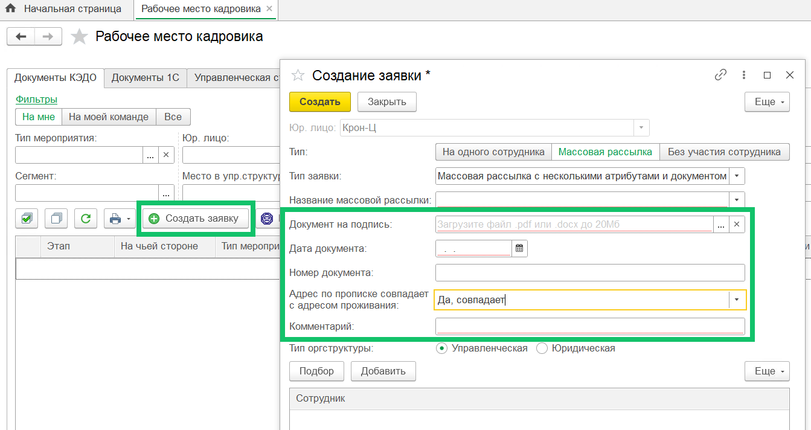
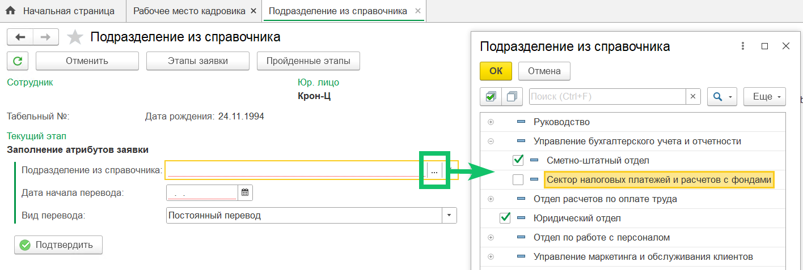
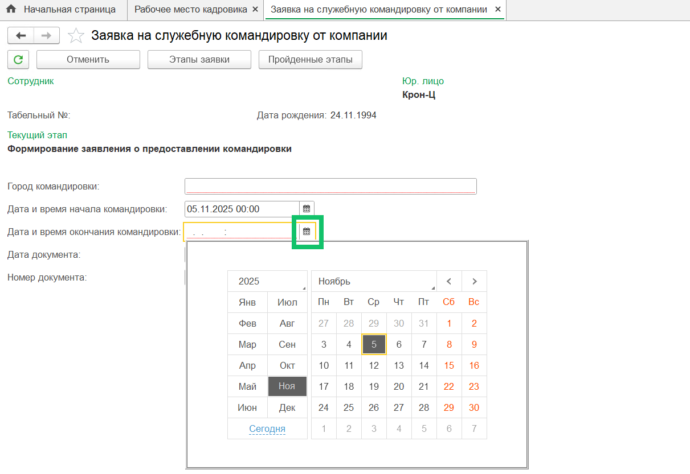
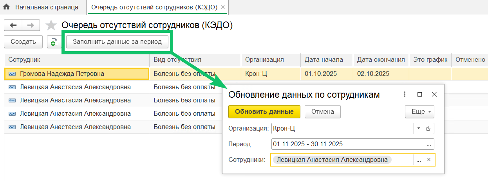

<info>
Новая версия расширения 1С КЭДО была протестирована на платформе 1С:Предприятие 8.3.26 с конфигурацией ЗУП КОРП, ред. 3.1.35.47.
</info>

## **Работа с заявками**
### **Список атрибутов для заявок массовой рассылки**
Расширили список атрибутов, которые можно добавить в заявку для массовой рассылки. 

Доступные типы атрибутов:

- дата;
- текст;
- выбор из заданных вариантов (без зависимостей);
- файлы — с возможностью одиночного или множественного добавления.

Расширение списка позволяет гибче настраивать шаблоны заявок и собирать больше нужной информации в заявках.

Чтобы заполнить атрибуты на этапе создания заявки, перейдите в раздел **КЭДО** → **Рабочее место кадровика**, создайте заявку с типом **Массовая рассылка** и выберите тип заявки. 

### **Атрибуты в заявках**
1\. В атрибутах, где значения выбираются из справочников, теперь можно использовать **справочники с иерархией**. Это удобно, когда значения имеют многоуровневую структуру. Такая структура помогает упростить навигацию и сделать выбор значений более наглядным. 

2\. Добавлен новый тип атрибута — **дата+время**. При его использовании в заявке отображаются два связанных поля: одно для выбора даты и второе — для указания времени. 

Новый тип атрибута удобен для процессов, где важно фиксировать не только день, но и точное время события или действия.

## **Отсутствия** 
Если вы хотите отобразить в VK HR Tek отсутствия, которые были проведены до начала работы с отсутствиями в сервисе, то теперь можно добавить такие периоды в выгрузку без перепроведения документов в 1С.

Это решение позволит вывести все нужные периоды в календаре отсутствий сотрудников, даже если перепроводка закрытых документов невозможна из-за ограничений внутренних политик компании.

Чтобы переотправить данные об отсутствиях в КЭДО, в регистре сведений **Очередь отсутствий сотрудников (КЭДО)** нажмите кнопку **Заполнить данные за период** и обновите данные по сотрудникам.

