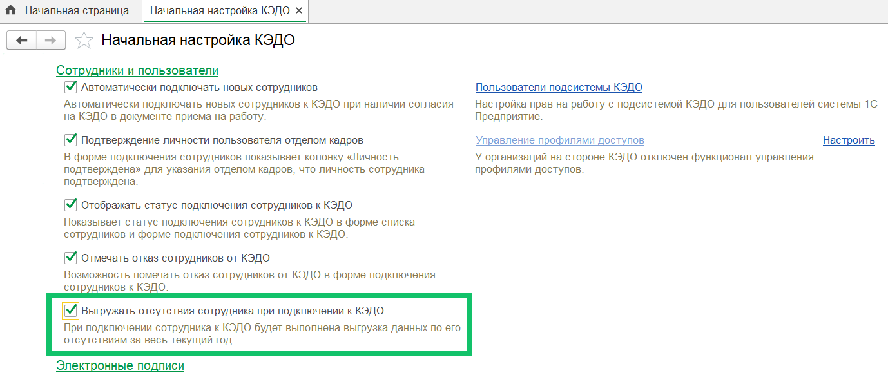
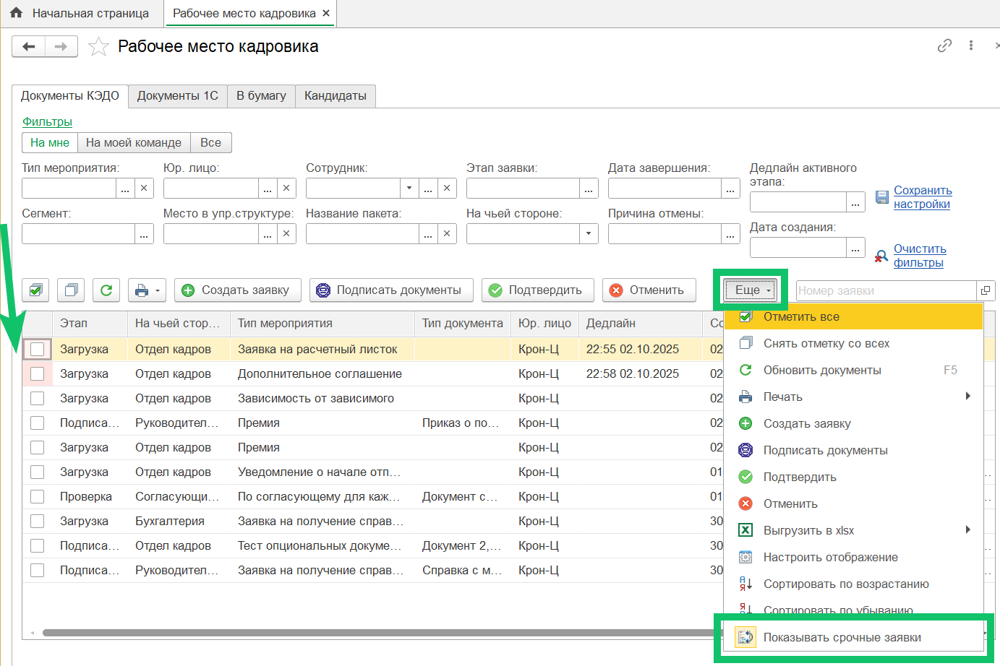
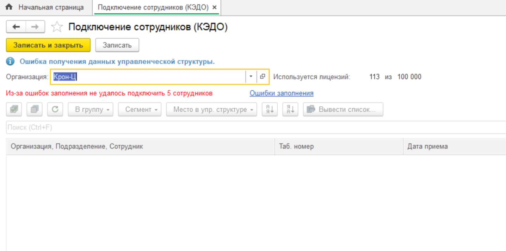
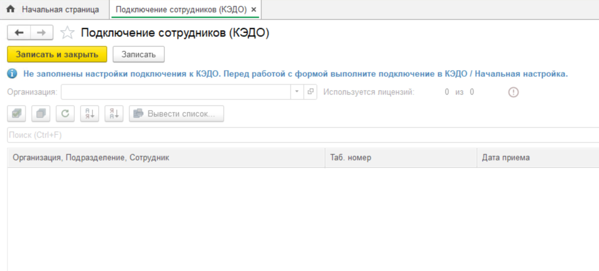
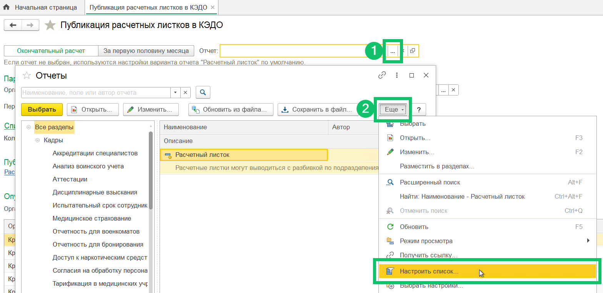
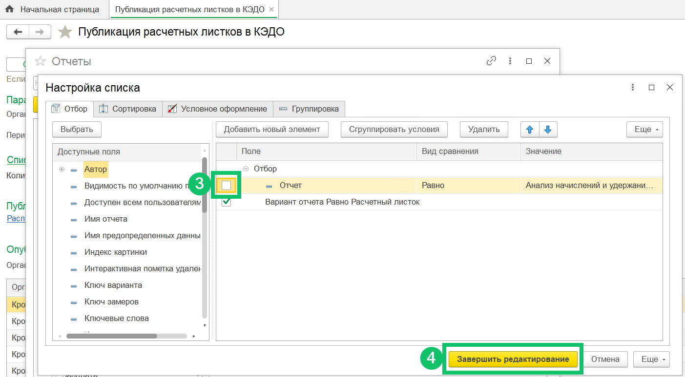

<info>
Новая версия расширения 1С КЭДО была протестирована на платформе 1С:Предприятие 8.3.26 с конфигурацией ЗУП КОРП, ред. 3.1.35.47.
</info>

## **Отсутствия сотрудников**
Добавлена автоматическая отправка отсутствий из 1С в КЭДО по сотрудникам, которые только что были подключены к КЭДО. Отсутствия отправляются за текущий год, если включена настройка на форме **КЭДО → Начальная настройка → Выгружать отсутствия сотрудника при подключении к КЭДО**.

Заполнение данных отсутствий для отправки в КЭДО производится при подключении сотрудника на форме подключения или при автоподключении и при получении согласия на КЭДО в документе «Приём на работу».

## **Уведомления о графиках отпусков**
Исправлена проблема с дублированием уведомлений о начале отпуска в случае прерывания работы фонового задания с отправкой.

Также добавлена повторная отправка уведомлений, которые находятся в статусе «В обработке».

## **Срочные заявки**
В разделе **КЭДО → Рабочее место кадровика → Документы КЭДО** значение включения/отключения опции **Показывать срочные заявки** теперь сохраняется в настройках сеанса текущего пользователя и восстанавливается при открытии раздела.

Чтобы включить или отключить опцию, нажмите кнопку **Еще → Показывать срочные заявки**. 

В веб-сервисе КЭДО работа с [опцией для показа срочных заявок](/ru/release_notes/saas/20251100Core#opciya_srochnyh_zayavok_zapominaem_vash_vybor_8f51c0d6) доступна в разделе **Заявки**.

## **Блокировка формы подключения сотрудников**
Добавлена блокировка формы подключения сотрудников в случае ошибки получения данных управленческой структуры из КЭДО или настроек по компании в КЭДО.

Блокировка формы **КЭДО → Подключение сотрудников** поможет избежать ситуации, когда управленческая структура не загружается во время недоступности КЭДО (например, из-за смены IP-адреса прокси-сервера), но на форме подключения сотрудников у пользователя получается сохранять данные. В результате информация о расположении сотрудников в подразделениях может быть удалена из системы.

Теперь, в случае если 1С не сможет получить данные управленческой структуры или настройки организации из КЭДО, то форма заблокируется до восстановления соединения с КЭДО, что исключит риск потери данных.

Блокировка формы из-за ошибки получения данных управленческой структуры
 

Блокировка формы из-за незаполнения настроек подключения к КЭДО
 

## **Расчётные листки**
В раздел **Публикация расчётных листков в КЭДО** добавлена возможность выбрать нетиповой отчёт для формирования расчётного листка, но только если логика его формирования полностью идентична типовому отчёту «Анализ начислений и удержаний».

Инструкция по выбору отчёта
 

1. В поле **Отчёт** нажмите на троеточие, откроется форма с отчётами.
1. Нажмите кнопку **Еще → Настроить список…**

 

3\. В форме настройки списка уберите галочку с **Отчёта**.

4\. Завершите редактирование. Список вариантов на предыдущей форме **Отчёты** будет обновлён. 

 

5\. В форме **Отчёты** выберите вариант своего отчёта. 

