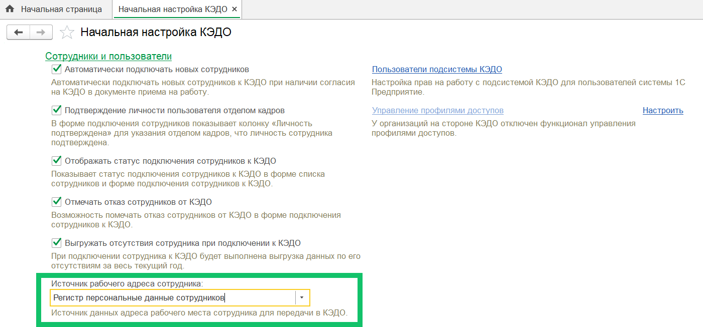
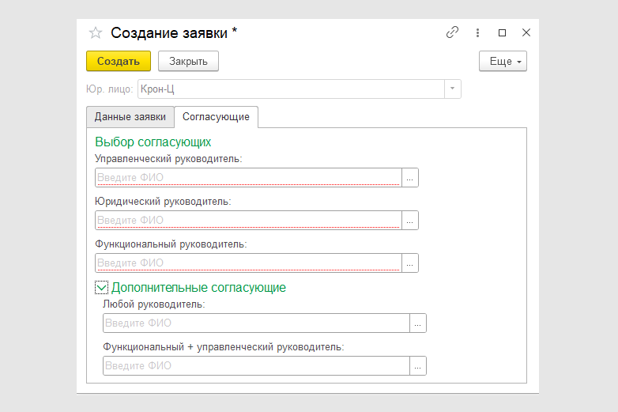
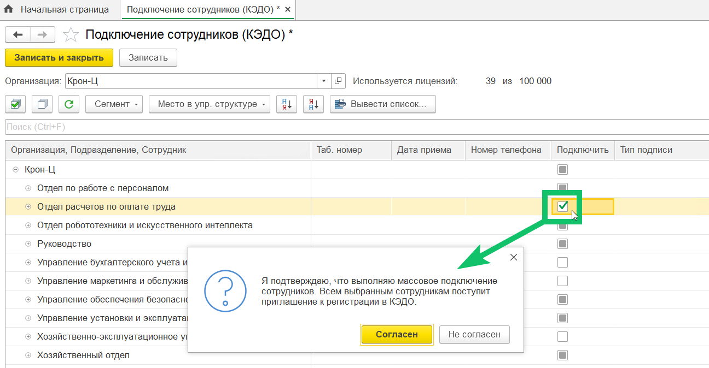
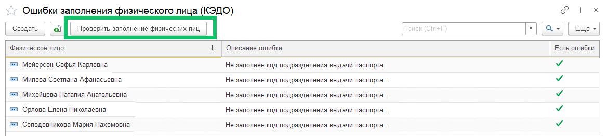
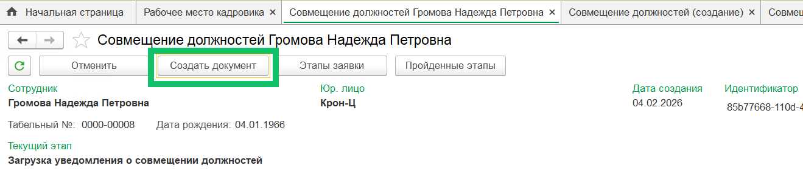
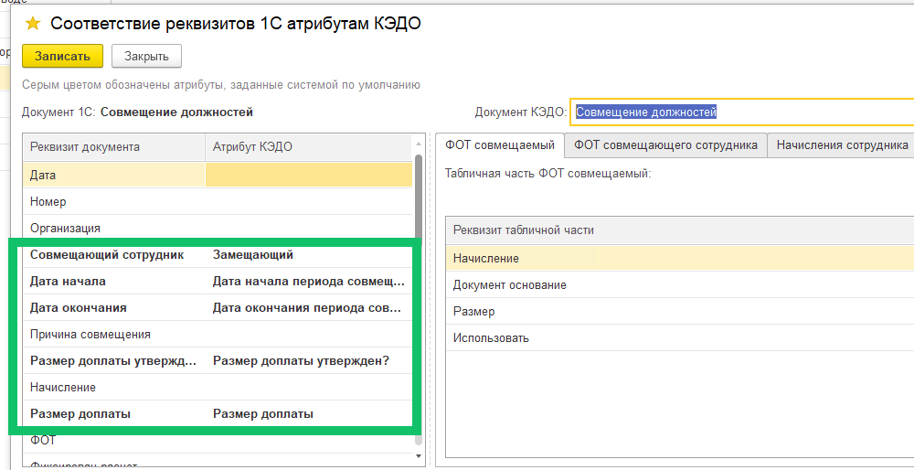

<info>
Новая версия расширения 1С КЭДО была протестирована на платформе 1С:Предприятие 8.3.26 с конфигурацией ЗУП КОРП, ред. 3.1.35.47.
</info>

## Часовые пояса

Расширяем возможности настройки разных часовых поясов в рамках компании — добавили возможность использовать данные сотрудника из 1С для определения его часового пояса. Импорт данных о часовых поясах из 1С в КЭДО работает с адресами рабочих мест сотрудников.

В качестве источника рабочего адреса сотрудника в 1С используется поле «АдресРабочегоМеста» из типового регистра «Персональные данные сотрудников».

Настройка в 1С
 

Чтобы настроить импорт из 1С:

1. Перейдите в раздел **Общие настройки** и установите флажок в настройке **Свойства**. 
2. Перейдите в раздел **Начальная настройка → Настройки функциональности →**  **Сотрудники и пользователи**. 
3.  В настройке **Источник рабочего адреса сотрудника** выберите один из вариантов:
    - Регистр персональных данных сотрудников.
    - Дополнительные сведения сотрудников (данный вариант можно установить, если собираетесь использовать значения из дополнительного реквизита справочника с сотрудниками).

В веб-сервисе КЭДО настройка [часовых поясов](/ru/release_notes/saas/20260100Core#chasovye_poyasa) доступна в разделе **Настройки КЭДО → Настройки компании**. 

## Согласование заявок руководителями

При создании заявки добавлена возможность выбирать согласующих из числа руководителей — по управленческой, юридической или функциональной структуре. 
Информация о возможности согласования заявок указана в обзоре [версии 2026.01](/ru/release_notes/saas/20260100Core#novye_vozmozhnosti_soglasovaniya_dokumentov_rukovoditelyami_408bcda7).

## Подключение сотрудников

При подключении целого подразделения или организации к КЭДО добавили сообщение с подтверждением выполнить массовое подключение сотрудников перед записью в системе.

## Проверка заполнения данных по физическим лицам

На форму регистра **Ошибки заполнения физического лица (КЭДО)** добавлена кнопка **Проверить заполнение физических лиц** для перепроверки данных заполнения всех физических лиц из списка.

Например, такая проверка может быть полезна при изменении способа авторизации, когда в настройках компании в КЭДО сменили вход по электронной почте на вход по номеру телефона. В этом случае незаполненный email у сотрудников больше не будет считаться ошибкой.

## Документ «Совмещение должностей»

В **Рабочем месте кадровика**, из формы заявки стало доступно заполнение документа «Совмещение должностей» при создании по кнопке **Создать документ**.

   

Данные основного сотрудника из документа теперь могут заполняться из атрибута заявки, если настроено соответствие атрибутов КЭДО и реквизитов документа 1С.

Проверьте, что включена настройка функциональности **Использовать соответствие реквизитов**.  

## Исправления

1.  Исправлена ошибка, при которой запись об отсутствии сотрудника в КЭДО оставалась после возвращения сотрудника из отпуска по уходу за ребенком.
2.  Исправлена ошибка при создании документа «Отпуск по уходу за ребенком» по кнопке **Создать документ** из формы заявки в **Рабочем месте кадровика**. Добавлено проставление флага **не начислять зарплату и не выплачивать аванс** на вкладке **Начисления**. 
3.  Исправлена ошибка, когда уведомление об отпуске не учитывало дни второго отпуска, который следовал сразу же после даты завершения первого отпуска.
4.  Исправлена ошибка, при которой в создаваемые документы 1С из формы заявки в качестве даты документа подставлялась дата создания заявки, а не текущая дата (начиная с версии расширения 2025.11.00). Теперь и при автосоздании документов 1С по данным заявки КЭДО, и при создании по кнопке **Создать документ**, для даты документа фиксируется текущая дата.