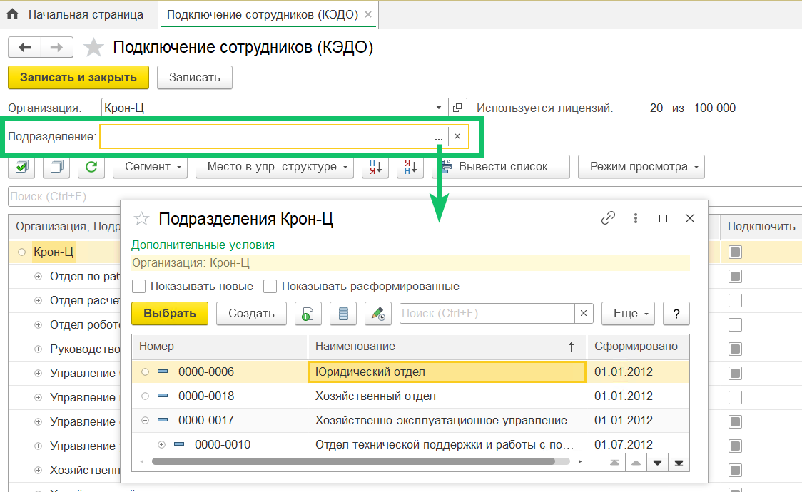
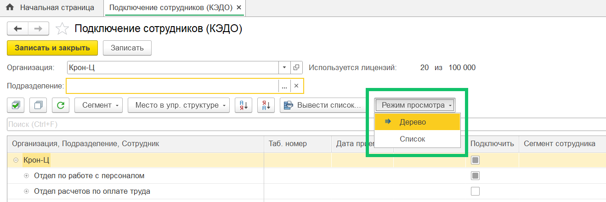
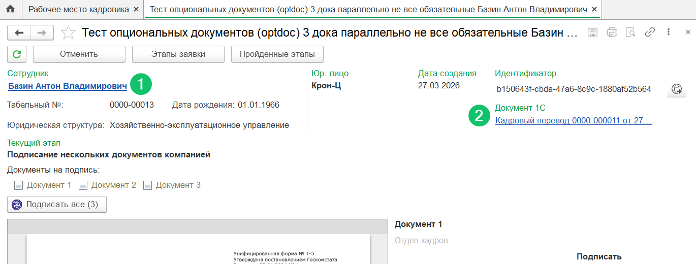
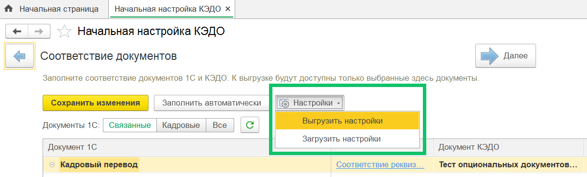
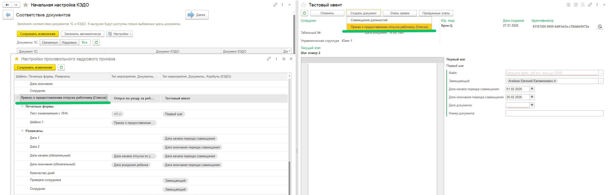
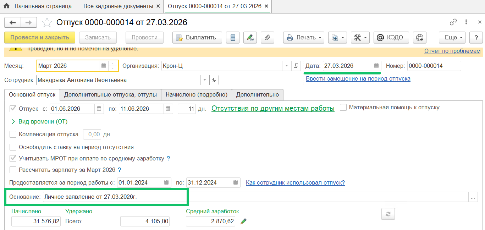

<info>
Новая версия расширения 1С КЭДО была протестирована на платформе 1С:Предприятие 8.3.26 с конфигурацией ЗУП КОРП, ред. 3.1.35.47
</info>

## Подключение сотрудников к КЭДО

На форму подключения сотрудников к КЭДО добавлен фильтр по подразделению.

Также появилась возможность переключаться между иерархическим и плоским списком сотрудников. Для этого воспользуйтесь кнопкой **Режим просмотра**. Для отображения иерархического списка выберите вариант **Дерево**, для плоского списка — **Список**.

## Работа с заявками

На форму заявки в Рабочем месте кадровика добавили: 

1.  Ссылку на карточку сотрудника.
2.  Список связанных с заявкой документов 1С.

## Миграция настроек маппинга между 1С базами

В форму соответствия документов 1С и КЭДО добавлена возможность выгрузить настройки соответствия (маппинга) документов, печатных форм, реквизитов и атрибутов в файл и загрузить из файла в другой базе 1С.

В новой базе 1С сопоставление производится по идентификаторам объектов в КЭДО, а если значения не найдены, то по наименованиям. Таким образом, можно перенести настройки на новый стенд КЭДО, куда загружены те же бизнес-процессы, но с другими идентификаторами типов мероприятий, документов и атрибутов.

Чтобы выгрузить настройки маппинга, на форме **КЭДО → Начальная настройка → Соответствие документов** нажмите кнопку **Настройки / Выгрузить настройки**, а для загрузки — **Настройки / Загрузить настройки**.

## Автосоздание произвольного кадрового приказа

Для версии 1С:ЗУП КОРП.

Доработали автосоздание документа «Произвольный кадровый приказ» по данным заявки в КЭДО. Теперь сотрудника в документ можно подгрузить из атрибута заявки с типом «Сотрудники», если настроено соответствие реквизита документа 1С и атрибута заявки КЭДО.

При создании документа из формы заявки КЭДО в Рабочем месте кадровика теперь показывается название шаблона произвольного кадрового приказа, который связан с данным типом заявки, а не просто имя документа «Произвольный кадровый приказ» (если тип заявки связан с несколькими документами 1С / шаблонами произвольных кадровых приказов и необходим выбор типа документа).

## Автосоздание документа «Отпуск»

При автоматическом создании в 1С документа «Отпуск» по данным заявки КЭДО добавлено заполнение даты заявки в поле документа **Основание**.

## Исправления

Исправлена ошибка передачи отсутствий из 1С в КЭДО при наличии дублей графиков отпусков. При наличии более раннего непроведенного графика отпусков (меньший номер документа) по тому же сотруднику и с теми же видом отпуска и датой начала отпуска, ранее происходила некорректная регистрация данных отсутствий для передачи в КЭДО.