<warn>

Так как был повышен уровень режима совместимости расширения VK HR Tek до версии 8.3.20, теперь минимально допустимыми для работы версиями 1С:ЗУП и 1С:ЗУП КОРП являются версии 3.1.26.11 и 3.1.27.111.  
Минимально допустимые версии конфигураций ERP и «Комплексная автоматизация» — те, у которых режим совместимости не ниже 8.3.20  

</warn>

<info>
Новая версия расширения 1С КЭДО была протестирована на платформе 1С:Предприятие 8.3.26 с конфигурацией ЗУП КОРП, ред. 3.1.37.49
</info>

## **Передача дней отгула за работу в выходные и праздничные дни из 1С в КЭДО**

Добавлена передача из 1С в КЭДО данных о накопленных днях отгулов за работу сотрудников в праздничные и выходные дни. Подробнее в [статье](/ru/release_notes/saas/20260300Core#peredacha_dney_otgula_za_rabotu_v_vyhodnye_i_prazdnichnye_dni_iz_1s_v_kedo_c0d94988).

Для включения импорта дней отгулов в компании обратитесь в [поддержку VK HR Tek](/ru/hr/support/contact_channels).  

Функционал доступен только в 1С:ЗУП версии 3.1.34 и выше. 

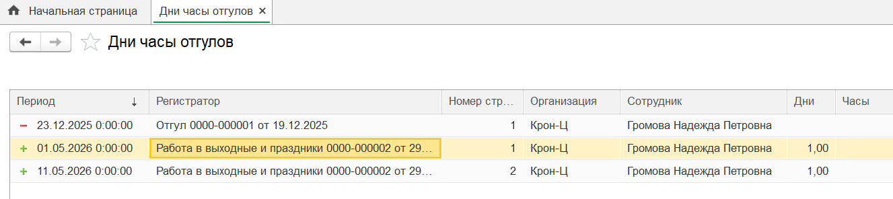

Чтобы проверить корректность передачи данных об отгуле, найдите в исходящем пакете сотрудника информацию о виде отсутствия и количестве дней отгулов.  

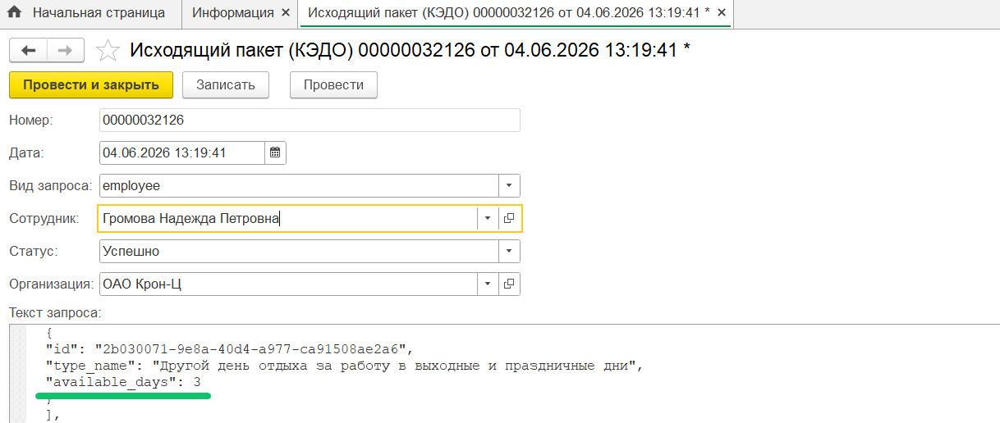

## **Автоматизация рассылки табелей руководителям**

Добавлена рассылка табеля учета рабочего времени руководителям подразделений сотрудников. При отправке табеля из документа 1С в КЭДО выберите подходящий тип мероприятия с массовой рассылкой. Подробнее о настройке — в [статье](/ru/release_notes/saas/20260300Core#avtomatizaciya_rassylki_tabeley_rukovoditelyam_776588e3).

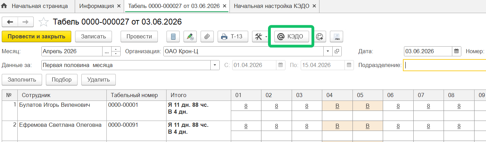

Для корректной отправки табеля по подразделениям проверьте в настройках соответствия документов, что 1С документ **Табель учета рабочего времени** сопоставлен с бизнес-процессом, в котором настроены массовая рассылка без сотрудника и тип атрибута «Подразделение».  

Разделение сотрудников по подразделениям и руководителям будет производиться согласно типу оргструктуры, выбранному в настройках раздела **КЭДО → Начальная настройка → Настройка функциональности → Тип оргструктуры для рассылки табеля по подразделениям**.  

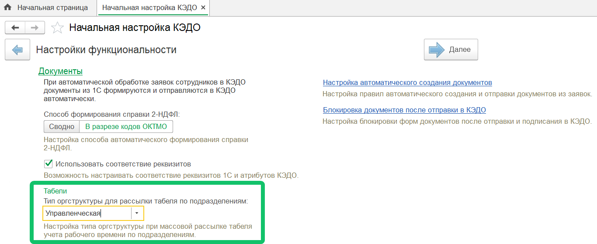

## **Массовая отправка печатных форм из документов 1С**

Добавлена возможность массово отправлять печатные формы из документов 1С, созданных по данным заявок в КЭДО. Например, к таким печатным формам можно отнести — приказы на отпуск из документов «Отпуск», созданных по данным заявок сотрудников на отпуск. 

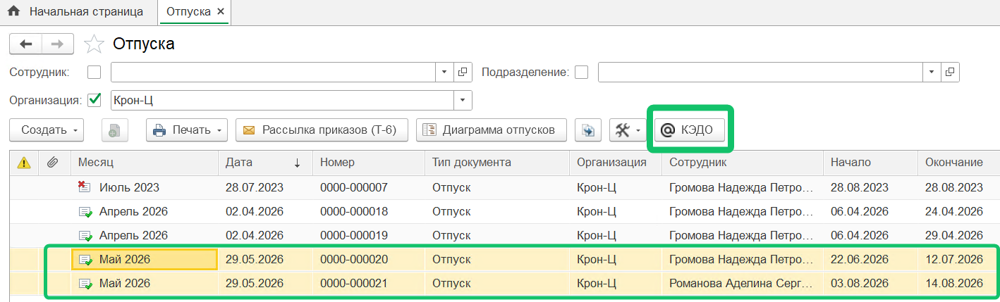

## **Отправка данных производственных календарей и графиков работы сотрудников**

Добавлена переотправка данных производственных календарей и графиков работы сотрудников из 1С в КЭДО при изменении данных в календарях или графиках.

Для включения импорта графиков работы в компании обратитесь в [поддержку VK HR Tek](/ru/hr/support/contact_channels).  

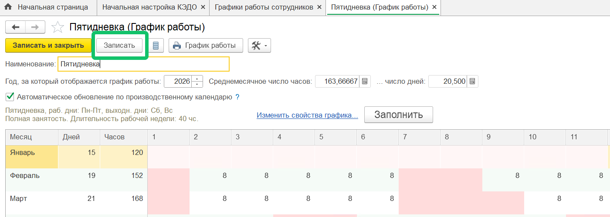

Для корректной отправки проверьте, что справочник «Графики работы сотрудников» выгружен в КЭДО.  

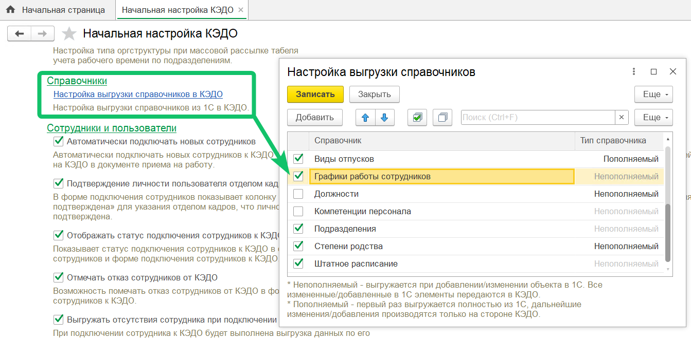

## **Данные штатного расписания в оргструктуре**

Добавлена передача из 1С в КЭДО данных штатного расписания и информации о количестве занимаемых ставок и вакансий по позициям. Подробнее в [статье](/ru/release_notes/saas/20260300Core#dannye_shtatnogo_raspisaniya_v_orgstrukture_669ecd5e).

Для подключения настройки доступности данных штатного расписания в КЭДО обратитесь в [поддержку VK HR Tek](/ru/hr/support/contact_channels). Функционал доступен только при условии импорта управленческой структуры из 1С.

Добавлена возможность устанавливать связь между управленческим подразделением и позициями штатного расписания. Одна штатная позиция может быть связана только с одним управленческим подразделением.

Отправлять данные по штатным позициям в подразделение компании можно в регистре **Управленческая организационная структура (КЭДО)**.    
Для этого укажите название подразделения, имя руководителя и другие обязательные параметры, а также добавьте позиции штатного расписания. Если для штатных позиций заполнить необязательный признак очередности, то перечень сотрудников в подразделении будет отсортирован согласно порядковому номеру.

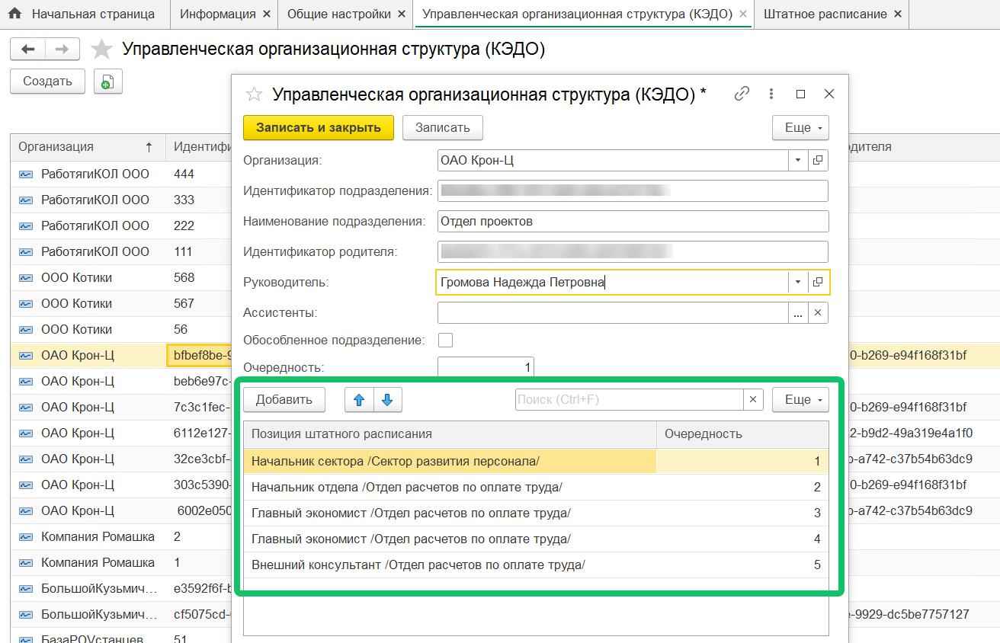

## **Подтверждение при подключении к КЭДО**

Изменена логика подтверждения при подключении к КЭДО целого подразделения: подтверждение не запрашивается, если подключается последний неподключенный сотрудник подразделения.  

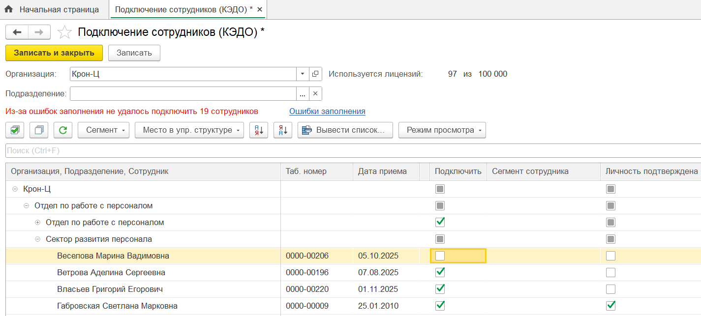

## **Подписание УКЭП**

Добавлена возможность подписывать документы КЭДО с помощью УКЭП, установленного на сервере 1С:Предприятие. Ранее такое подписание работало только на компьютере пользователя.  

Чтобы включить настройку **Подписывать на сервере**, перейдите в раздел **Администрирование → Общие настройки → Электронная подпись и шифрование**.

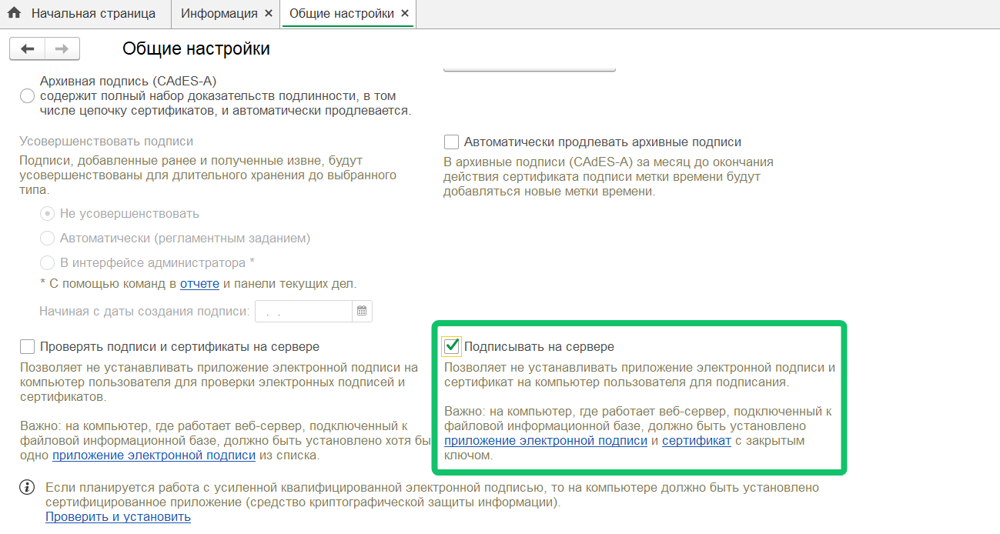

## **Открытие заявки в 1С**

В форму документов 1С, связанных с типами мероприятий КЭДО, добавлена кнопка открытия заявки КЭДО в Рабочем месте кадровика в 1С расширении.  

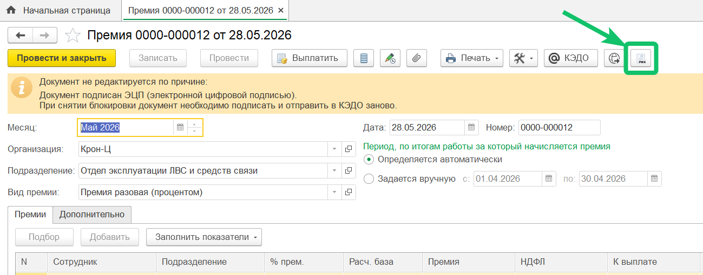

## **Документ «Кадровый перевод»**

Добавлено автоматическое заполнение полей **Изменить дистанционную работу** и **Работает дистанционно** в документе «Кадровый перевод», созданном в 1С по данным заявки КЭДО.

Для корректного заполнения документа проверьте, что:
* в начальных настройках включено автосоздание документа «Кадровый перевод»,  
* в настройках соответствия документов: документ 1С «Кадровый перевод» сопоставлен с бизнес-процессом КЭДО, в котором прописаны атрибуты **Изменить дистанционную работу** и **Работает дистанционно**;  
* в настройках соответствия реквизитов для этого бизнес-процесса КЭДО: 1С реквизиты **Изменить дистанционную работу** и **Работает дистанционно** сопоставлены с атрибутами КЭДО, которые указаны в бизнес-процессе. 

Настройка бизнес-процесса является платной. Для подключения обратитесь в [поддержку VK HR Tek](https://help.hrtek.ru/ru/hr/support/contact_channels).

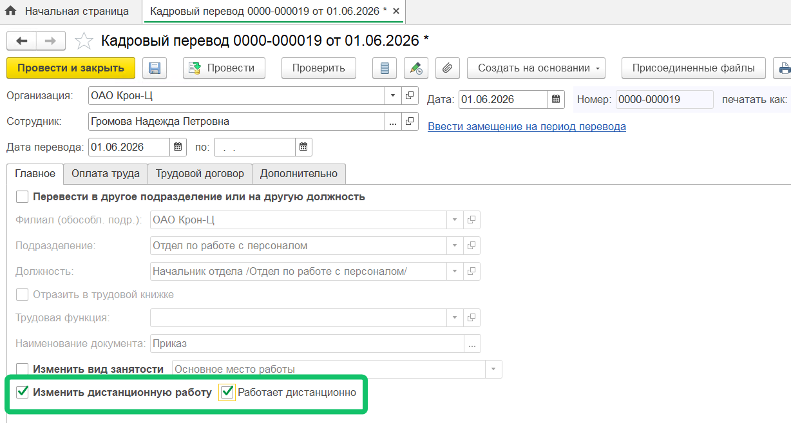