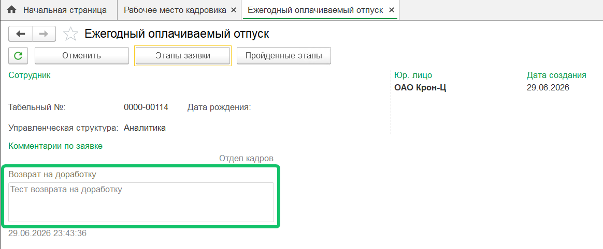
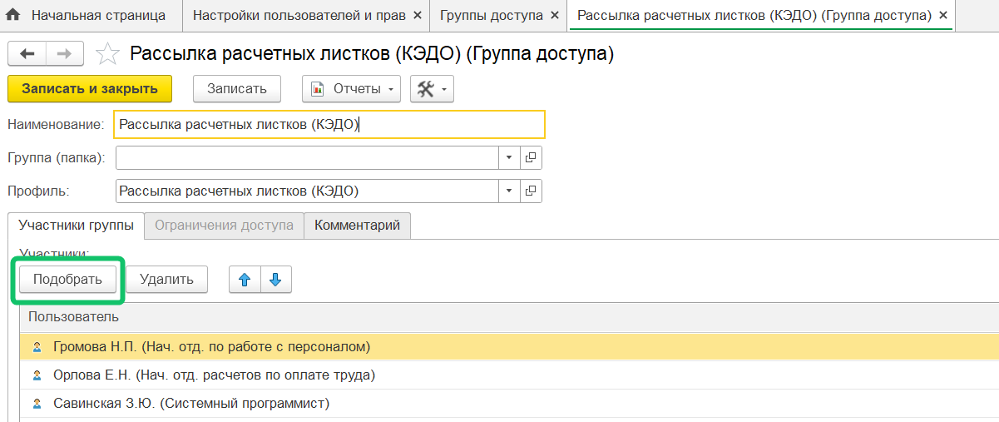
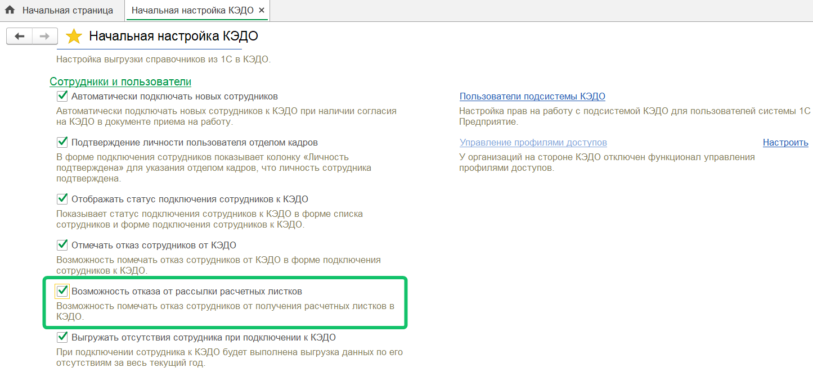
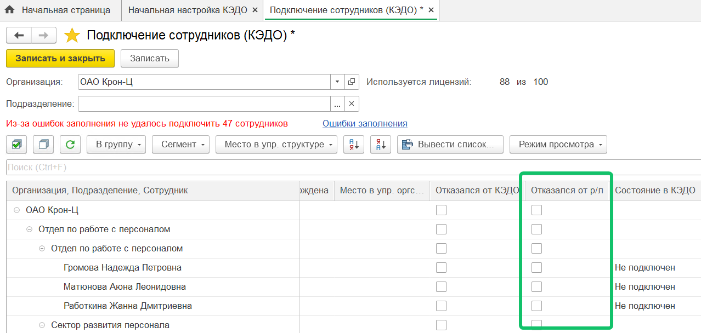
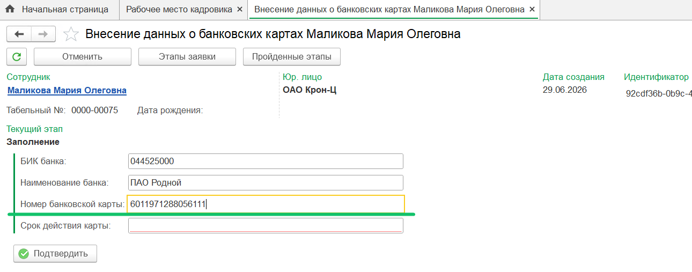
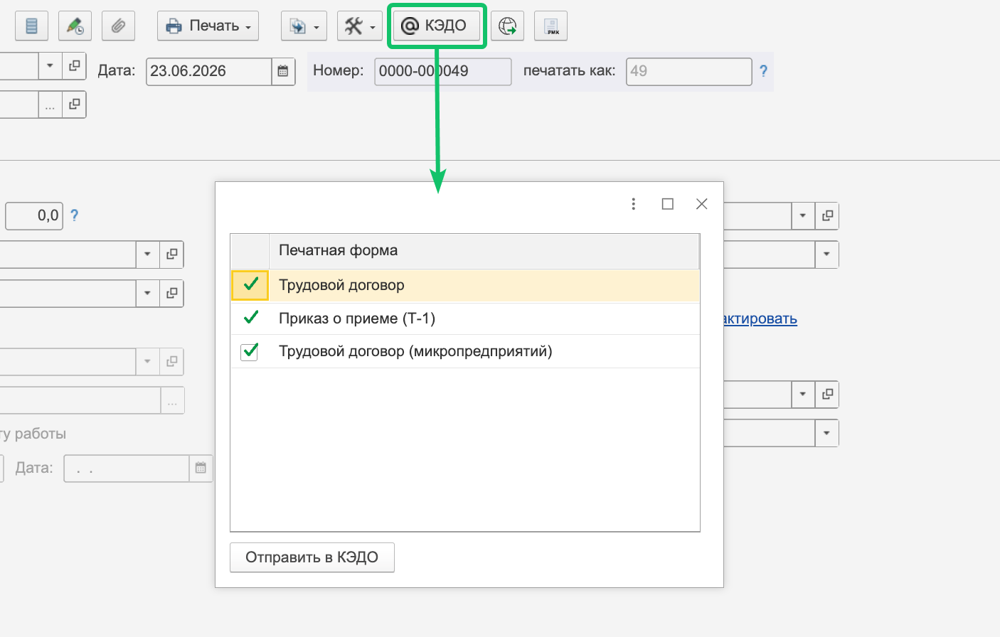
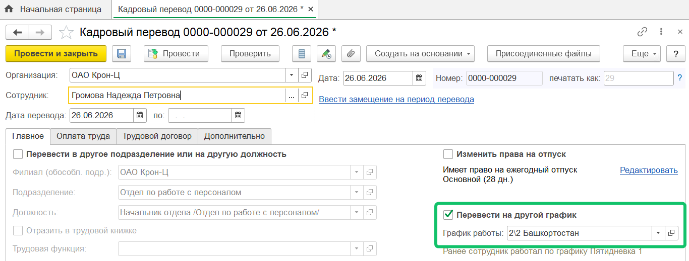
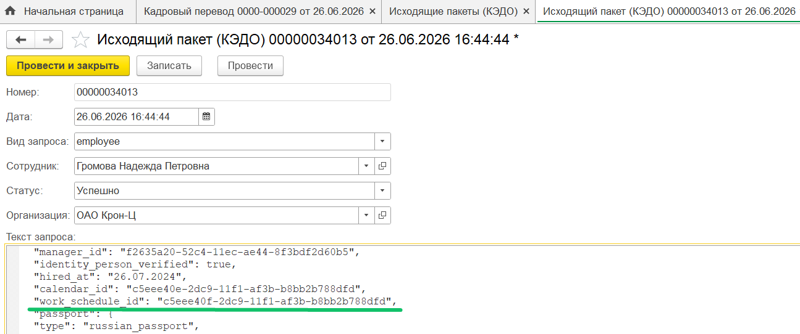

<info>
Новая версия расширения 1С КЭДО была протестирована на платформе 1С:Предприятие 8.3.26 с конфигурацией ЗУП КОРП, ред. 3.1.37.49
</info>

## **Заявки на доработке**

В карточке заявки и в списке документов КЭДО в **Рабочем месте кадровика** появилась отметка о возврате заявки на доработку. Также в список документов КЭДО добавлен фильтр **Только заявки на доработке**. 

О том, как выглядят заявки на доработке в веб-сервисе VK HR Tek, см. в [статье](/ru/release_notes/saas/20260400Core#zayavki_na_dorabotke_teper_vidno_srazu_263b76e2).  

## **Раздел «Публикация расчетных листков» теперь доступен только назначенным сотрудникам**

В 1С появилась новая группа доступа — «Рассылка расчетных листков (КЭДО)». Начиная с этого релиза, раздел **КЭДО → Публикация расчетных листков** открывается только пользователям, добавленным в эту группу, а также пользователям с ролью «Полные права».  

При обновлении конфигурации группа назначается автоматически тем пользователям, у которых уже есть роль «Администратор (КЭДО)» или «Рабочее место (КЭДО)» — вручную ничего перенастраивать не нужно. Для всех остальных раздел станет недоступен.  

Чтобы открыть доступ нужному сотруднику, добавьте его в группу «Рассылка расчетных листков (КЭДО)» в настройках групп доступа 1С (**Администрирование → Настройки пользователей и прав → Группы доступа**).  

Изменение касается только ролей в модуле 1С и не затрагивает другие веб-интерфейсы VK HR Tek.  

## **Исключение сотрудников из рассылки расчётных листков**

В форме **Подключение сотрудников (КЭДО)** можно включить опцию **Отказался от р/л**.  

По умолчанию функция выключена. Чтобы её активировать, перейдите в **КЭДО → Начальная настройка** → блок **Сотрудники и пользователи** и включите пункт **Возможность отказа от рассылки расчётных листков**. После этого столбец становится видимым и доступным для редактирования в форме подключения сотрудников.  

Включить опцию для подключенных сотрудников могут пользователи с ролями «Администратор (КЭДО)», «Рассылка расчётных листков (КЭДО)» или «Рабочее место (КЭДО)». Пользователи открывают форму **Подключение сотрудников (КЭДО)**, проставляют отметку нужным сотрудникам и сохраняют.  

При следующей публикации через раздел **Публикация расчётных листков** отмеченные сотрудники не попадут в список получателей. При необходимости список можно скорректировать вручную перед отправкой. 

## **Проверка минимальной длины значения текстового поля заявки**

В разделе **КЭДО → Рабочее место кадровика**, на форме мероприятия можно просмотреть заявку, для которой настроены поля с вводом минимального количества символов. Используется для полей: номер банковской карты, номер лицевого счёта, СНИЛС, артикул — что угодно, где точно известно минимальное количество символов в значении.  

<info>

Настройка бизнес-процесса является платной. Для подключения обратитесь в [поддержку VK HR Tek](/ru/hr/support/contact_channels)  

</info>

Пример заявки: номер банковской карты не может содержать менее 16 цифр.  

## **Работа с печатными формами**

При отправке документа из 1С в КЭДО на форме выбора необязательных печатных форм теперь отображаются печатные формы до первой ненайденной обязательной.

Ранее отображалось до первой любой ненайденной печатной формы из раздела соответствия документов 1С и КЭДО.  Таким образом, могли быть пропущены обязательные печатные формы, следующие после необязательных.  

Пример отправки печатных форм для заявки «Прием на работу»: документ «Трудовой договор (микропредприятий)» — необязательный, можно его отправлять в КЭДО, а можно убрать галочку. О пропуске необязательных печатных форм в [статье](/ru/release_notes/1C/202508001C#otpravka_dokumentov_v_kedo).  

## **Отправка данных сотрудника в КЭДО**

Добавлена переотправка данных сотрудника в КЭДО при смене графика работы сотрудника. 

Чтобы проверить, что передача данных о графике работы состоялась, найдите в исходящем пакете сотрудника запись "work_schedule_id".  

