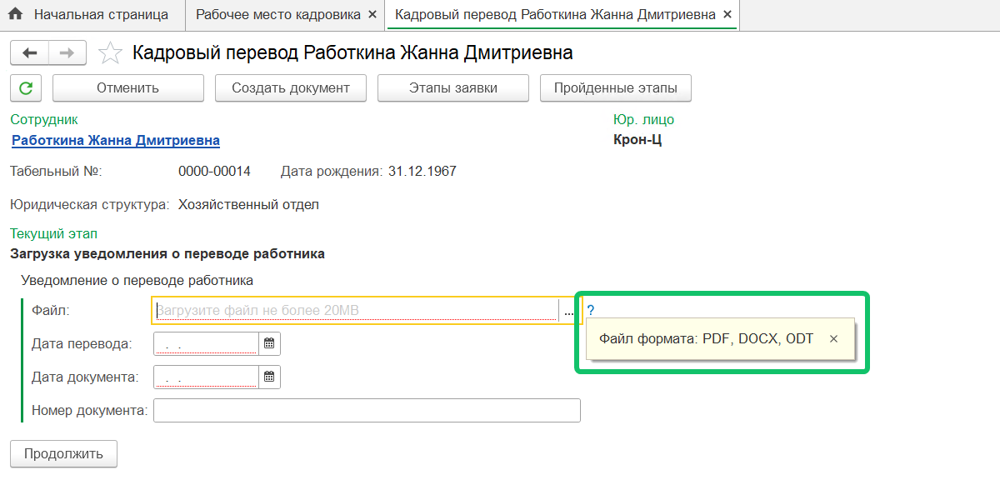
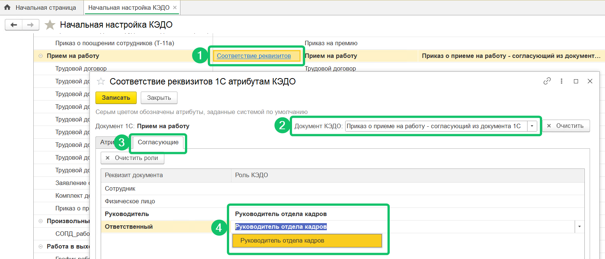
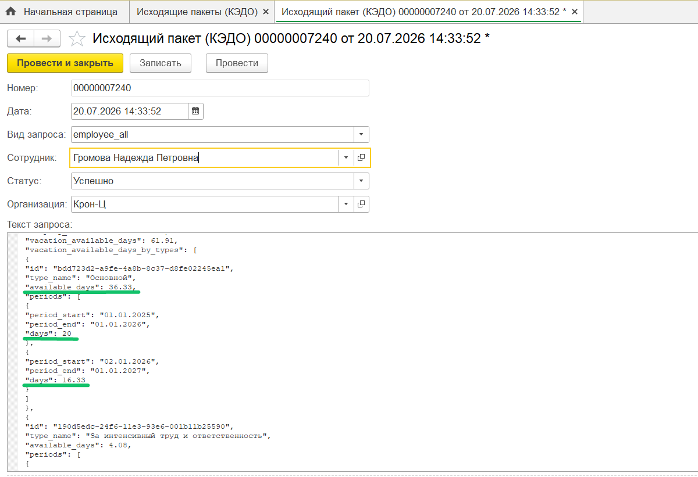
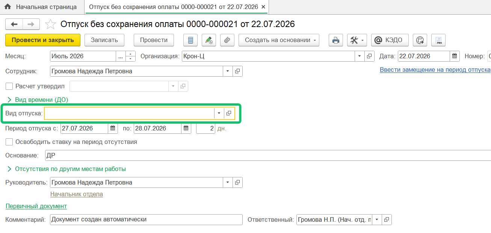
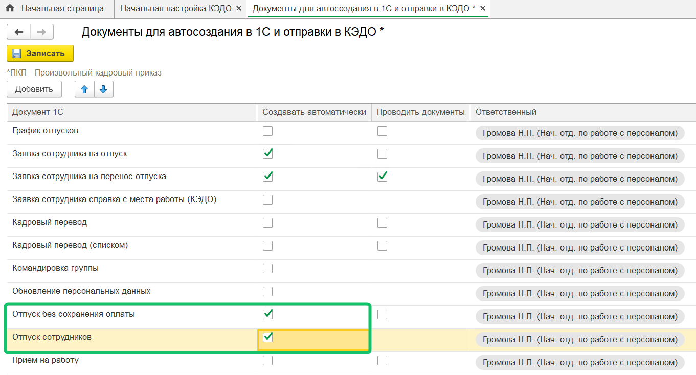
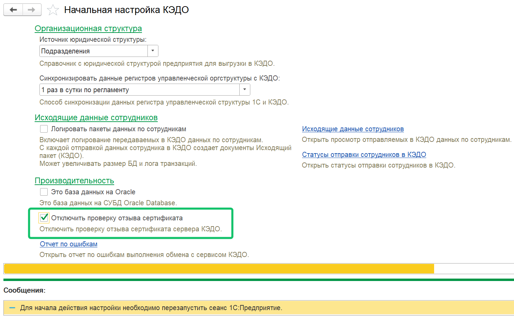

<info>
Новая версия расширения 1С КЭДО была протестирована на платформе 1С:Предприятие 8.3.27 с конфигурацией ЗУП КОРП, ред. 3.1.37.49
</info>

## **Новые типы файловых атрибутов**

Расширен список поддерживаемых типов для файловых атрибутов в форме заявки в **Рабочем месте кадровика**.  

Теперь в заявку можно загружать файлы с расширениями: *.xlsx*, *.odt*, *.ods*, *.xml*, *.p7m*.  

В качестве документа для подписания можно загружать файлы *.odt*.  

Посмотреть интерфейс

О том, как выглядит заявка с новыми типами файловых атрибутов в веб-сервисе VK HR Tek, см. в [статье](/ru/release_notes/saas/20260500Core#novye_tipy_faylovyh_atributov_60c24465).

## **Добавление участников в заявку из документа 1С**

Если в документе 1С указан конкретный подписант, система теперь может автоматически назначить его исполнителем нужной роли в заявке КЭДО. Маппинг между полями в 1С документе и ролями в бизнес-процессе КЭДО можно настроить на процесс один раз, и дальше участники будут подставляться автоматически, в том числе и в рамках уже активной заявки. Такое автозаполнение участников заявки возможно при загрузке документа из 1С в уже запущенную заявку до момента получения печатной формы или при создании заявки из 1С (если печатная форма уже получена, то исполнитель не будет дозаполнен).

Если в бизнес-процессе для роли настроены опция «Выбор согласующего» и опция заполнения исполнителя из 1С документа, необходимо настроить соответствие реквизитов 1С, из которых будут получены сотрудники-исполнители, с ролями согласующих в КЭДО. Для этого:

1. Откройте раздел **КЭДО → Начальная настройка → Соответствие документов**.  
2. Настройте соответствие документа 1С и бизнес-процесса КЭДО, а также печатной формы документа 1С и документа из заявки КЭДО.
3. Перейдите в настройки соответствия реквизитов и выберите нужный документ КЭДО (если сопоставлено несколько бизнес-процессов).
4. Откройте вкладку Согласующие и настройте соответствие реквизита документа 1С с ролью согласующего в КЭДО. Реквизит должен указывать на подходящего пользователя, для которого одновременно верно:
- есть хотя бы один неуволенный сотрудник,
- этот сотрудник подключен к КЭДО,
- сотрудник может быть исполнителем этой роли.

Посмотреть интерфейс

Таким образом, при отправке документа из 1С в КЭДО согласующий будет выбран из реквизита документа и автоматически передан в качестве исполнителя этапа в КЭДО.  

<info>

Настройка опции для ролей в бизнес-процессе является платной. Для подключения обратитесь в поддержку VK HR Tek

</info>

Подробнее о настройке см. в [обзоре веб-версии 2026.05](/ru/release_notes/saas/20260500Core#dobavlenie_uchastnikov_v_zayavku_iz_dokumenta_1s_111238be).  

## **Детализация накопленных дней отпуска в разрезе периодов их накопления**

В передаваемые из 1С в КЭДО данные сотрудника добавлена детализация накопленных дней отпуска по периодам, за которые эти дни накоплены. 

Для просмотра накопленных дней отпуска по периодам перейдите в раздел **Исходящие пакеты (КЭДО)** и найдите строки *days* в объектах *periods*.  

Посмотреть интерфейс

О том, как выглядит детализация отпускных дней по периодам в веб-сервисе VK HR Tek, см. в [статье](/ru/release_notes/saas/20260500Core#detalizaciya_nakoplennyh_dney_otpuska_v_razreze_periodov_ih_nakopleniya_bae7a42b).

## **Реквизит «Вид отпуска»**

При автоматическом создании документов «Отпуск», «Отпуск без сохранения оплаты» и «Отпуск сотрудников» в 1С из заявки КЭДО система теперь учитывает настройку обязательности реквизита «Вид отпуска» из документа 1С.  

Раньше реквизит считался обязательным по умолчанию, и если маппинг для него не был настроен или значение оказывалось пустым, документ не создавался. Теперь, если в 1С реквизит помечен как необязательный, документ создаётся и предзаполняется остальными реквизитами согласно маппингу.  

Посмотреть интерфейс документа 1С

Посмотреть интерфейс настройки

Путь: КЭДО → Начальная настройка → Настройки функциональности → Настройка автоматического создания документов.  

  

## **Рассылка расчетных листков**

Ускорено формирование большого количества расчетных листков в автоматической рассылке по расписанию.

## **Оптимизация и доработка расширения 1С**

Сделали несколько задач для оптимизации и ускорения работы 1С расширения КЭДО.

## Отключение проверки отзыва SSL-сертификата

Добавили настройку **Отключить проверку отзыва сертификата** в раздел **Начальная настройка КЭДО**. Включенная настройка позволит предотвратить ошибку, связанную с невыполнением проверки отзыва SSL-сертификата сервера КЭДО.

Чтобы настройка вступила в силу, перезапустите сеанс 1С:Предприятие.

Посмотреть интерфейс настройки

Путь: КЭДО → Начальная настройка → Настройки функциональности → Отключить проверку отзыва сертификата.  

  