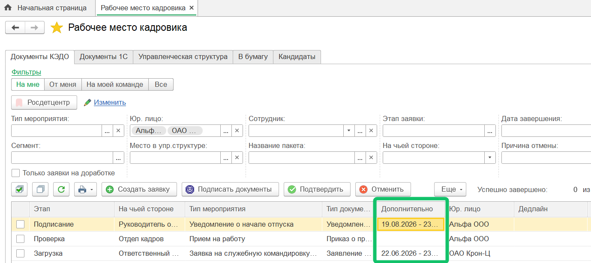
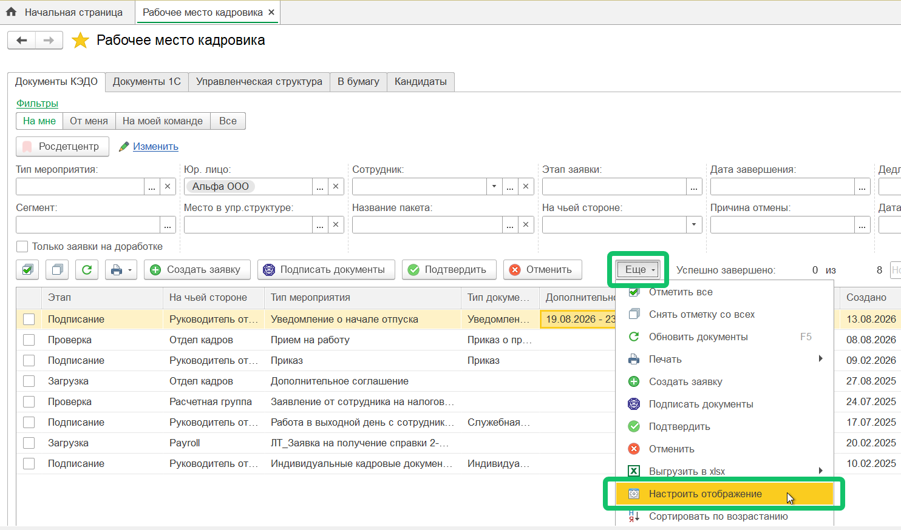
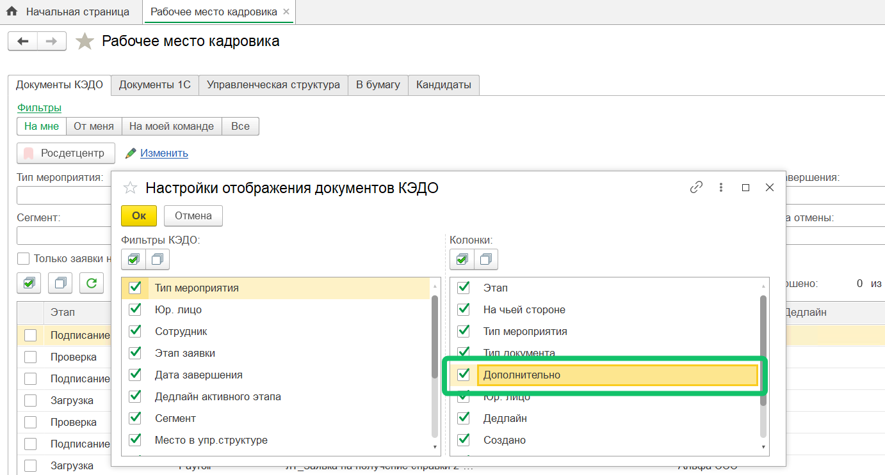
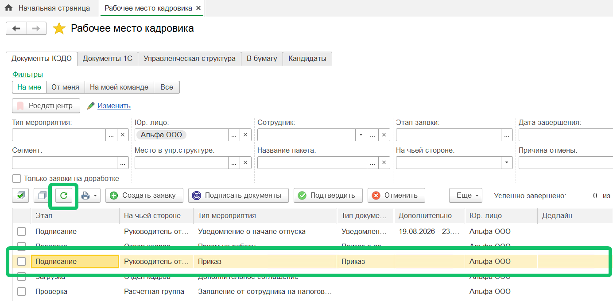
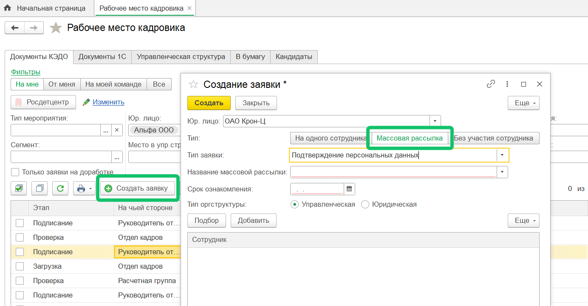
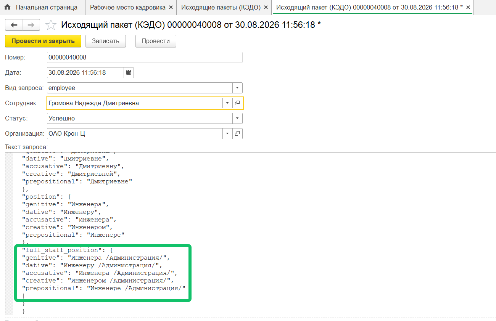
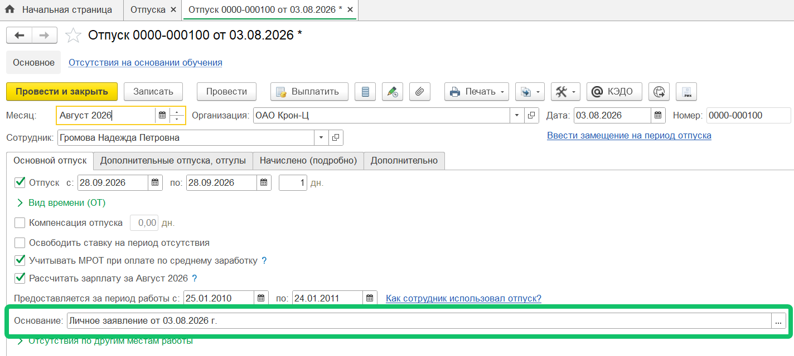
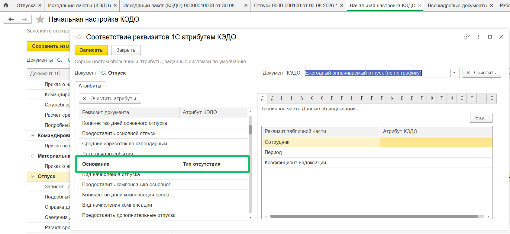

<info>
Новая версия расширения 1С КЭДО была протестирована на платформе 1С:Предприятие 8.3.27 с конфигурацией ЗУП КОРП, ред. 3.1.38.18
</info>

## **Атрибуты заявок**

На форму **КЭДО → Рабочее место кадровика → Документы КЭДО** и форму заявки добавили блок **Дополнительно** со значениями ключевых атрибутов заявки, например, с датами заявки на отпуск.  
   

Посмотреть список заявок

По умолчанию колонка **Дополнительно** в списке документов КЭДО скрыта, ее отображение можно включить по кнопке **Еще → Настроить отображение** **→** выбор колонки **Дополнительно**. 
  

Посмотреть настройку колонки «Дополнительно»

## **Обновление заявок**

При автоматическом и ручном обновлении списка заявок КЭДО в форме **КЭДО → Рабочее место кадровика** добавили сохранение фокуса на ранее выделенной заявке, если она присутствует в списке заявок после обновления.  

Посмотреть список заявок

## **Создание заявки**

Из формы создания пакетной заявки в **КЭДО → Рабочее место кадровика →** кнопка **Создать заявку →** тип **Массовая рассылка** убрали отображение поля «Документ на подпись» для типов заявок, у которых нет этапа с загрузкой документа.  

Посмотреть форму

## **Данные позиций штатного расписания**

В передаваемые из 1С в КЭДО данные позиций штатного расписания добавилось полное наименование позиции и ее склонения.  

Для просмотра передаваемых данных перейдите в раздел **Исходящие пакеты (КЭДО)** и найдите строки в объекте *full_staff_position*.  

Посмотреть форму

## **Кнопка «КЭДО» скрыта**

Если в КЭДО выключен сервис «Заявки и графики отпусков», то в 1С на формах документов скрывается кнопка **КЭДО**, после нажатия которой документ передается из 1С в КЭДО.  

О том, как отключить сервис «Заявки и графики отпусков» в VK HR Tek, см. в [статье](/ru/release_notes/saas/20260600Core#kompaniyaakkaunt).

## **Автозаполнение обоснования в приказе на отпуск**

При автоматическом создании документа «Отпуск» в 1С по данным заявки КЭДО поле **Основание** теперь может заполняться по данным соответствия реквизитов документа 1С и атрибутов КЭДО, если такое соответствие настроено.   

Посмотреть документ

Посмотреть форму настройки

## **Вкладка «Документы 1С» скрыта**

Если у пользователя нет прав на просмотр журнала документов **Кадры → Все кадровые документы**, то вкладка **Документы 1С** в форме **КЭДО → Рабочее место кадровика** больше недоступна.
