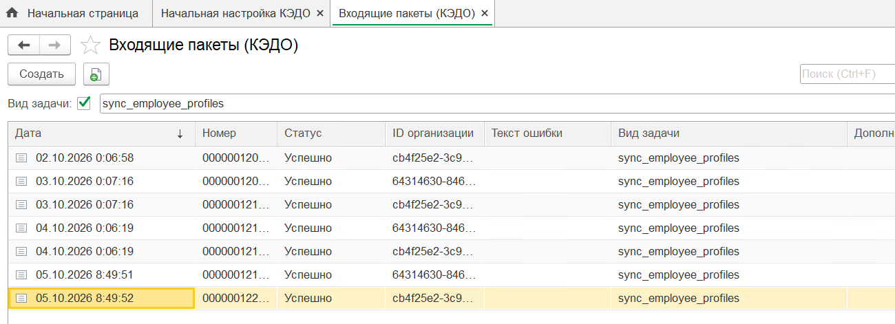
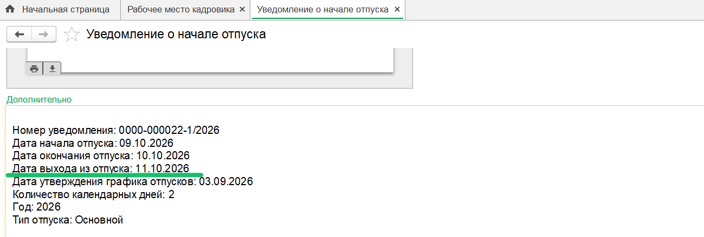
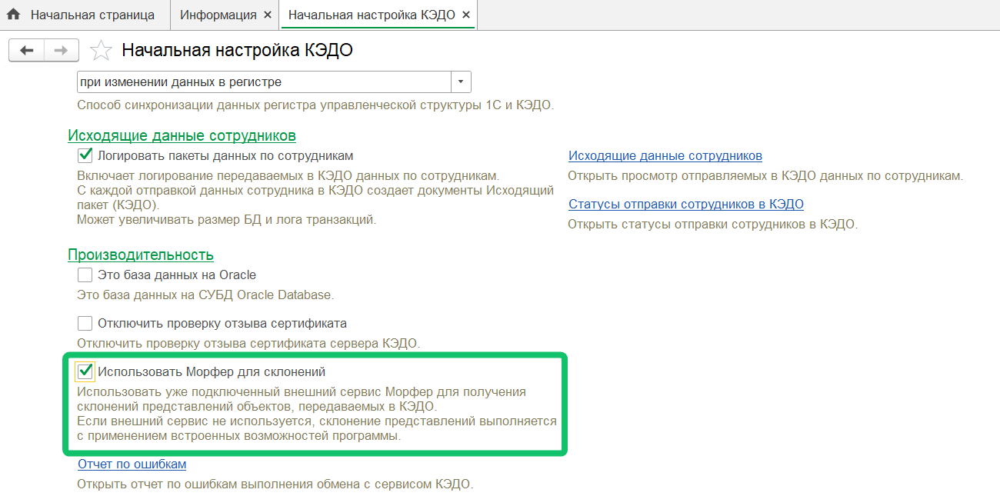

<info>
Новая версия расширения 1С КЭДО была протестирована на платформе 1С:Предприятие 8.3.27 с конфигурацией ЗУП КОРП, ред. 3.1.38.18
</info>

## **Выгрузка групп доступа физических лиц**

При заведении в 1С новой группы доступа физических лиц добавлена автоматическая выгрузка справочника групп доступа в КЭДО, чтобы избежать ошибки при подключении сотрудников с новой группой доступа.  

Ранее выгрузка справочника происходила только раз в сутки, примерно с 0:06.  

Для просмотра передаваемых данных из 1С в КЭДО перейдите в раздел **Входящие пакеты (КЭДО)** и найдите строки с видом задачи *sync_employee_profiles*. 

Посмотреть интерфейс

## **Удаление планирования графика отпусков**

Из 1С удаляется планирование графиков отпусков, если в КЭДО это же планирование было удалено. Связанный с планированием документ «График отпусков» очищается и помечается на удаление.

<info>

Если требуется удалить планирование графиков отпусков в КЭДО, обратитесь в поддержку [VK HR Tek](/ru/hr/support/contact_channels)

</info>

## **Учёт графика работы в уведомлениях о начале отпуска**

В уведомлениях о начале отпуска добавлен учёт графика работы сотрудника для расчёта даты выхода сотрудника на работу.  
Ранее для расчёта даты выхода на работу учитывался только производственный календарь.  

Пример: отпуск закончится в субботу 10.10.2026. У сотрудника сменный график, в воскресенье 11.10.2026 начнётся смена.  
Ранее дата выхода рассчитывалась только по производственному календарю, где суббота и воскресенье — это выходные, и сотруднику ставилась дата выхода из отпуска в понедельник 12.10.2026.  

Посмотреть интерфейс

## **Настройка «Использовать Морфер для склонений»**

В разделе **КЭДО → Начальная настройка → Настройка функциональности** добавлена новая настройка **Использовать Морфер для склонений**. Настройка отвечает за использование ранее подключенного сервиса склонений Морфер для склонения представлений объектов, передаваемых из 1С в КЭДО, и позволяет экономить токены Морфера. Если настройка выключена, то для склонений будут использованы встроенные возможности 1С.  

Посмотреть интерфейс

