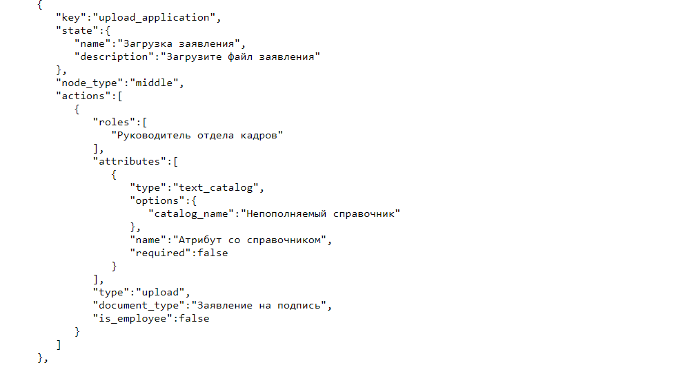
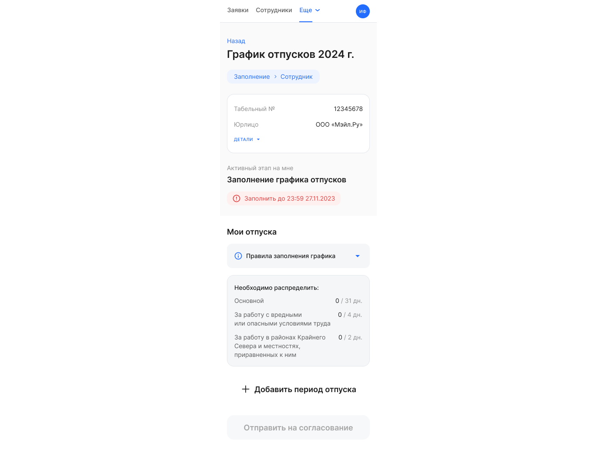

## **Для сотрудников и представителей компании**
### **Атрибуты со справочниками**

Научились связывать текстовые атрибуты со справочниками. Например, атрибут «Список стран» можно связать со справочником «Страны», который хранится в базе данных VK HR Tek. Создаваться и обновляться эти справочники могут из 1С и публичного API.

На странице заявки атрибут со справочником будет отображен в виде поля с выпадающим списком значений из справочника с возможностью ввода и поиска текста из справочника.

Чтобы подключить атрибут со справочником для конкретного типа заявки, необходимо прописать данную опцию в JSON-файле бизнес-процесса.

## **Для сотрудников**
Сотрудники могут просматривать и заполнять графики отпусков в *Личном кабинете* мобильной версии VK HR Tek.

## **Для клиентов On-premise решения**
Добавлен новый тип атрибута, который будет отображаться на странице заявки как поле с выпадающим списком значений из справочника. Текстовый атрибут с заполнением значения из непополняемого справочника прописывается в JSON-файле бизнес-процесса.

## **Исправления**
1. Для кастомных уведомлений убрали ограничение на количество уведомлений в сутки.
1. Открыли заместителям руководителей доступ в *Кабинет компании*, даже если заместитель не относится ни к одной группе компании.

