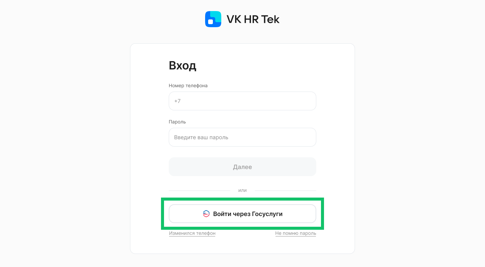
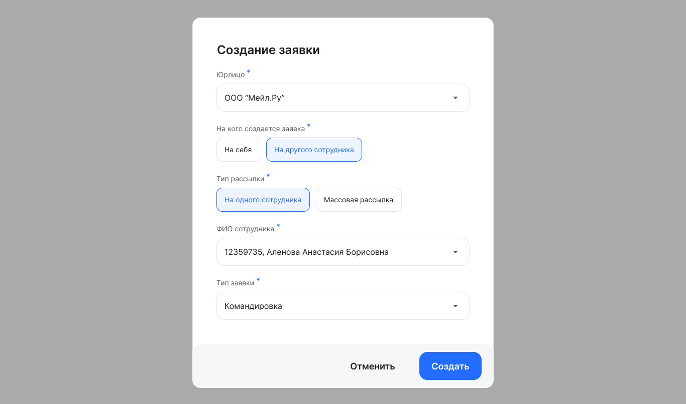
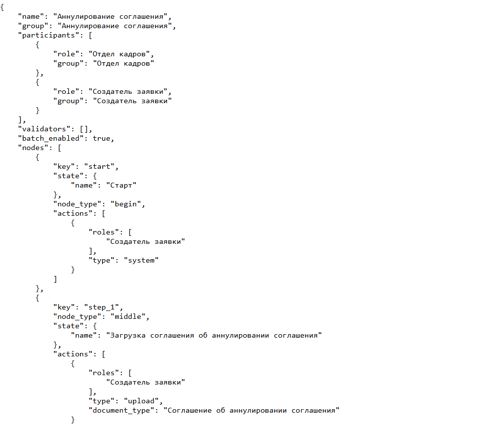
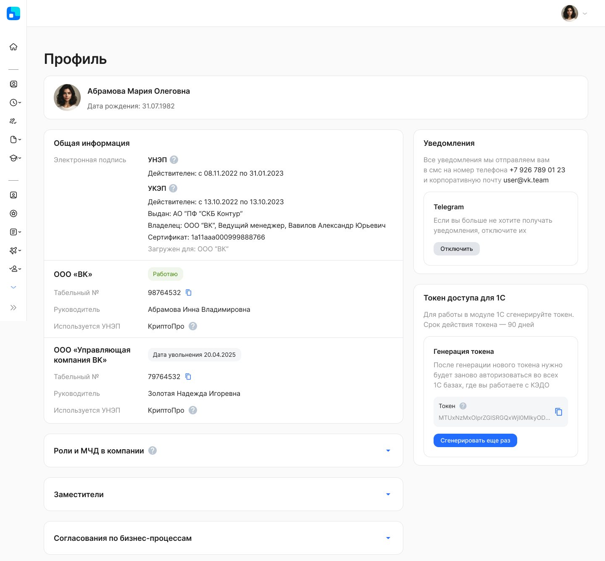
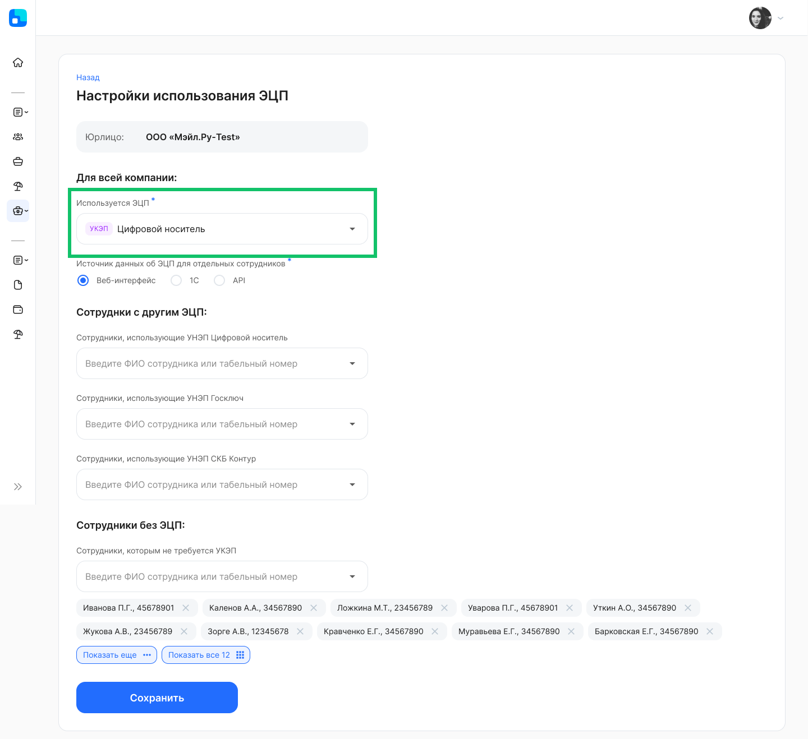
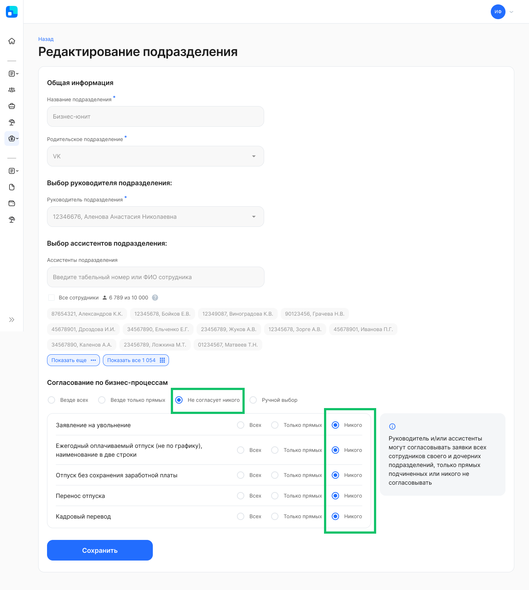
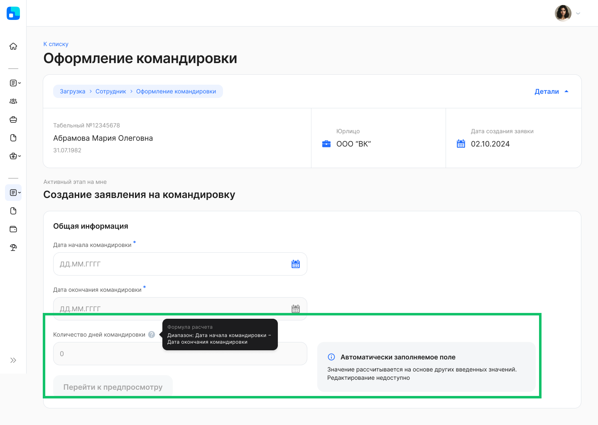
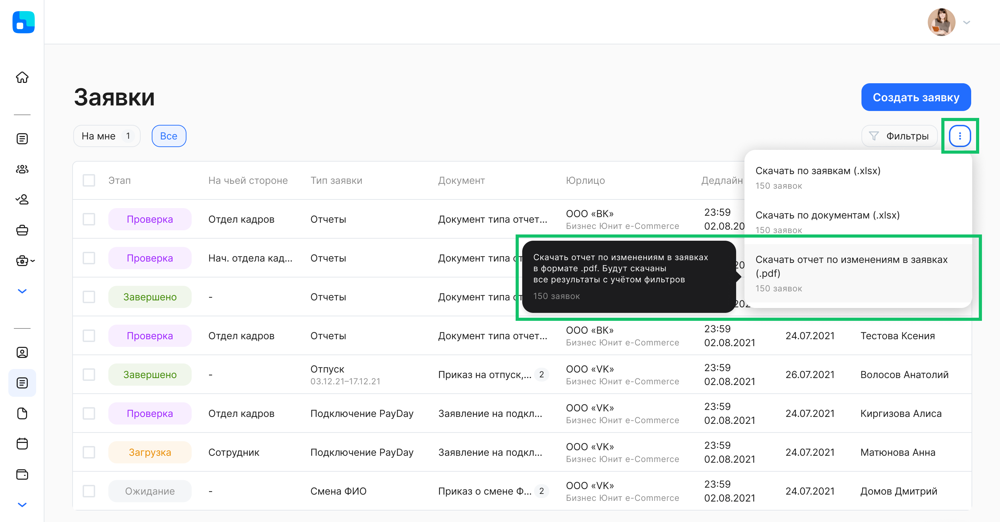

## **Для сотрудников и представителей компании**
### **Авторизация через ЕСИА**
Для пользователей VK HR Tek стал доступен вход в сервис через Госуслуги (ЕСИА). Настройка авторизации через ЕСИА распространяется на всю компанию, а не выборочно на отдельных сотрудников.

Также пользователь может выбирать способ авторизации из нескольких вариантов, если на уровне компании определено несколько.

### **Создание заявки на другого сотрудника** 
Пользователь без роли в компании может создавать заявки на других сотрудников. 

Например, в компании есть ответственный сотрудник, который массово создает заявки на командировку на других сотрудников. Больше не нужно назначать сотруднику роль в компании, чтобы он смог создать заявку на другого сотрудника. Теперь на уровне типа заявки достаточно указать признак, на основании которого будет определена возможность создавать заявки со стороны сотрудника на другого сотрудника.

При создании заявки на другого сотрудника можно указать, на кого будет оформлена заявка:

- на одного сотрудника;
- массовая рассылка.

 

Пример JSON бизнес-процесса с указанием ответственных на разных этапах заявки: 

- инициатора заявки (роль "Создатель заявки");
- другого сотрудника (роль "Отдел кадров").

### **Профиль пользователя**
Обновили Профиль пользователя с учетом того, что появился раздел **Персональные данные**.

Фотография пользователя импортируется из модуля 1С. Ручная загрузка фотографии в Профиле недоступна.

### **Отключение виджета «Быстрые действия»** 
На главной странице можно отключить виджет «Быстрые действия», содержащий список действий, которые чаще других совершает пользователь в сервисе.

Настроить отключение виджета «Быстрые действия» можно в административной панели, в разделе **Main page → Company widgest list**.

### **Отсутствия сотрудника**
Отсутствия, которые были созданы в 1С, передаются из 1С в КЭДО и не имеют связи с заявкой, создаются со статусом «Согласовано» и переходят в статус «В процессе» при достижении даты начала отсутствия.

### **Планирование графика отпусков**
В планирование графика отпусков добавили валидатор, ограничивающий формировать заявку с датами, выпадающими только на выходные/праздничные дни. Например, если дата начала отпуска 09.11.2024 (суббота), то первой возможной для выбора датой окончания отпуска будет 11.11.2024 (понедельник).

### **Электронная цифровая подпись**
Добавлено использование УКЭП сотрудниками в разделе **Настройки → Типы ЭЦП**. Эта настройка поможет сократить затраты на выпуск УНЭП за счет использования ранее выпущенных УКЭП.

Настроить выбор УКЭП можно в административной панели, в разделе **Company →  Company_edit → Доступные УНЭП → УКЭП**.

## **Работа с заявками**
### **Согласование по бизнес-процессам**
В опции согласования руководителями по управленческой структуре добавили еще одну опцию «Не согласует никого».

### **Работа с атрибутами и валидаторами**

#### **Рассчитываемые атрибуты**
На основании значений, заполненных в полях заявки, автоматически по формуле будут рассчитаны значения некоторых атрибутов. Эта функция ускорит обработку заявки, т.к. не нужно будет проверять корректность ручных расчетов сотрудника.

Расчет по формуле возможен для атрибутов, где выполняются:

- расчеты количества дней в выбранном диапазоне дат;
- простые математические действия с числовыми значениями атрибутов.

Например, значение атрибута «Количество дней командировки» равно количеству дней между выбранными датами начала и окончания командировки с учетом производственного календаря.

#### **Мультивыбор в атрибутах**
В заявки на сотрудников, без сотрудников, на кандидатов могут быть добавлены поля с выбором нескольких значений.

#### **Логическое действие unequal в зависимых атрибутах**
Логическое действие unequal влияет на видимость атрибутов в зависимости от значения, которое указано в другом атрибуте. Например, поле номера паспорта должно отображаться в заявке только в том случае, если в поле «Страна назначения» выбрано значение «Россия».

Логическое действие unequal  указывается в настройках бизнес-процесса вместе со значениями, которым не должно соответствовать значение, указанное пользователем в атрибуте. На основании выполнения/не выполнения условия отображаются зависимые атрибуты.

#### **Изменение атрибутов на этапах заявки**
В отчет о пройденных этапах заявки добавили данные о том, какие атрибуты были изменены на этапе.

#### **Валидаторы**
1\. Добавлен валидатор, который не дает пользователю завершить этап, если в выбранном периоде выходных дней в соответствие с графиком 5/2 меньше, чем заданное минимальное количество.

2\. Добавлен валидатор, который не дает выбрать период менее 5 календарных дней, если эти дни находятся между выходными/праздничными днями. То есть день, предшествующий началу отпуска, и день, идущий после даты окончания отпуска, не должен быть праздничным или выходным.

Например, если дата начала отпуска 05.11.2024, то возможными датами для выбора окончания отпуска станут 06.11.2024 (среда), 07.11.2024 (четверг) или после 10.11.2024 (воскресенье).

## **Изменения в административной панели**
1. На странице сотрудника добавлена кнопка "Dismiss" / "Undismiss".
1. На странице сотрудника скрыты профили «по умолчанию» (IsDefault = True).
1. На странице пользователя в блоке **UNEP certificates** добавлена кнопка "Bind". Кнопка доступна, если в блоке нет ни одного привязанного сертификата с зеленой меткой.
1. На странице компании добавлена кнопка "Templates", открывающая страницу с шаблонами документов компании.
1. На странице со списком компаний добавлены фильтры: 
- по аккаунту;
- по ИНН.
6. Исправлено сообщение об успешном приглашении на регистрацию сотрудника в сервисе — с "invite sended" на "invite sent".
7. При создании группы на аккаунт исправлено отображение выпадающего списка юрлиц.
8. В разделе **Notifications → Registry List** добавлены названия уведомлений "Title" и описания для переменных внутри "Trigger".

## **Исправления**
1. Если заявку согласовал один руководитель, а затем этот руководитель был изменен на нового, то в случае возврата на доработку заявка будет назначена на нового руководителя.
1. При выборе периода отпуска в заявке валидатор кратности работает корректно с учетом производственного календаря.
1. В разделе **Настройки → Заместители сотрудников** администратор компании А видит, кто является руководителем во всех компаниях аккаунта, и может назначать руководителю заместителя из другой компании аккаунта.
1. Если пользователь является сотрудником в компании А и руководителем в компании В, то он сможет просматривать график отсутствий сотрудников в компании В (раздел **Рабочее время**).
1. Если на клиентской стороне установлено расширение AdBlock, то это может привести к некорректной работе сервиса VK HR Tek. Для исправления проблемы добавьте сервис в список доверенных.