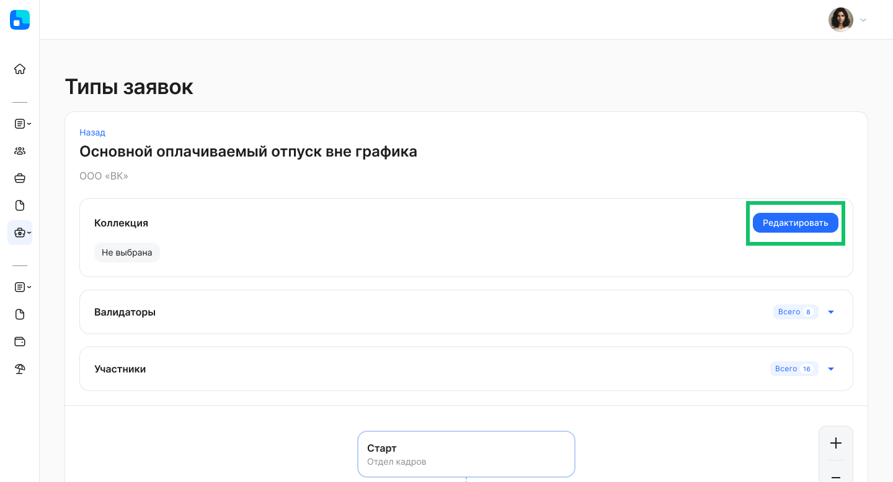

## **Ролевая модель доступа к данным**
В **Сервисы компании → Настройки → Настройки компании** добавлена настройка «Использование ролевой модели». Пользователь с ролью «Администратор» может настроить доступ к разделам целиком или к конкретным данным в зависимости от роли сотрудника в компании. Подробности в [статье](/ru/admin_actions/settings/settings_comp/role_model).

## **Ассистенты подразделений** 
В рамках управленческой структуры для каждого подразделения можно выбирать ассистента (административная роль в департаментах компании). Ассистент может быть указан исполнителем этапов заявки и рассчитывается по иерархии аналогично руководителям. Отличие ассистента от заместителя заключается в том, что заместитель назначается руководителю, а ассистент добавляется к подразделению.

О создании подразделения с ассистентами см. в [статье](/ru/admin_actions/management_structure/create_edit_division).

## **Уровень согласования для руководителей**
В **Сервисы компании → Настройки → Настройки компании** добавлена настройка «Уровень согласования для руководителя подразделения». Если руководитель является сотрудником в том же подразделении, которым руководит, то после включения этой настройки для руководителя подразделения будет создаваться этап согласования вышестоящим руководителем.

## **Согласования с поиском руководителей**
Если в заявке указан этап согласования руководителем, но у сотрудника по каким-то причинам отсутствует нужный руководитель, то в бизнес-процессе можно настроить обязательность согласования руководителем вышестоящего уровня.

Чтобы подключить поиск вышестоящих руководителей для конкретного типа заявки, необходимо прописать в JSON-файле настройку "skip\_missing\_managers": true. В этом случае этап согласования перейдет на первого найденного по цепочке вверх руководителя. Если настройка выключена ("skip\_missing\_managers": false), в заявке не будет этапа согласования руководителем.

## **Приветствие на главной странице**

На странице компании в административной панели добавлена настройка приветствия на главной странице VK HR Tek: отображение только имени или имени и отчества сотрудника.

Чтобы установить полное обращение (имя и отчество) в приветствии, перейдите в **Companies → List companies → Edit company** и включите настройку **Use full greeting**.

На главной странице отображается формальное обращение, если такая настройка есть хотя бы в одной компании сотрудника.

## **Текст в кнопке «Создать дочернюю заявку»**
Добавили возможность изменять текст в кнопке «Создать дочернюю заявку».

Чтобы изменить текст в кнопке для родительского типа заявки, необходимо прописать новое значение для поля "create\_child\_label" в JSON бизнес-процесса.

## **Новые валидаторы**
1\. Добавлен валидатор, который ограничивает доступ для выбора компенсации, так как сотрудник использовал ее в текущем году.

Реализация валидатора возможна, если компания сможет передавать данные о запрещенных датах по сотруднику и типу заявок в определенный регистр 1С. Настройка будет доступна после выпуска новой версии расширения 1С 2025.01.00.

2\. Добавлен валидатор, который не дает оформлять заявку в период, когда сотруднику запрещено брать командировку. Определенные даты в календаре будут заблокированы для выбора сотрудником, если они заполнены для него как запрещенные.

Реализация валидатора возможна, если компания сможет передавать данные о запрещенных датах по сотруднику и типу заявок в определенный регистр 1С. Настройка будет доступна после выпуска новой версии расширения 1С 2025.01.00.

3\. Добавлен валидатор, который не запрещает создавать заявки, содержащие праздничные или нерабочие дни в периоде, а только показывает информацию об их наличии. 
Также добавлена возможность указать переход на определенный этап флоу заявки, который настраивается в JSON бизнес-процесса.

## **Группировка типов заявок**
Группы типов заявок создаются в административной панели, в разделе **Collection**. 

Далее в разделе **Сервисы компании → Настройки → Типы заявок** Администратор назначает/меняет коллекции для каждого бизнес-процесса.

При создании заявки список типов заявок распределен по группам для быстрого доступа.

## **Исправления**
1. В разделе **Сервисы компании → Корп. документы** доработали выгрузки по ЛНА для случаев, когда количество строк превышает 1 048 576. Теперь данные xlsx-файла разбиваются на несколько листов, на первом листе — 1 000 000 строк.
1. Скорректировали отображение списка сотрудников в разделе **Сервисы компании → Рабочее время** при переходе по кнопке **Показать все** на больших экранах.
1. Перестали показывать дни отпуска уволенного сотрудника в виджете доступных дней в разделе **Сервисы сотрудника → Мой календарь**.
1. Поправили сортировку ролей сотрудников в компании (от А до Я) на странице **Users → List Groups**  в административной панели.