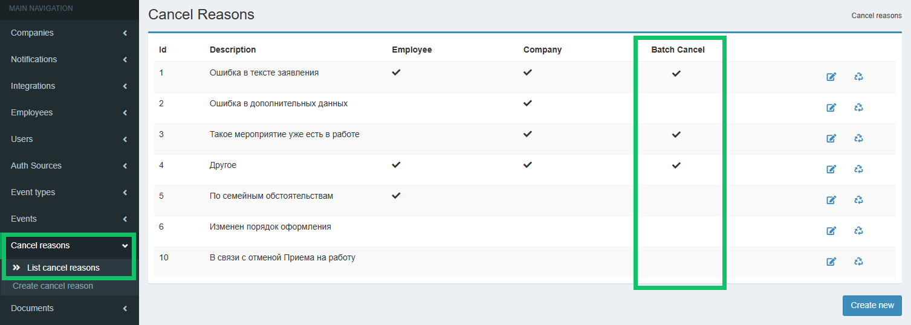

## **Для представителей компании**
### **Выбор нескольких подразделений или сотрудников при создании ЛНА**
В создание нового корпоративного документа добавили опцию выбора нескольких подразделений, должностей или конкретных сотрудников.


### **Опциональные этапы с загрузкой документов**
Для этапа с загрузкой документа на подписание можно настроить (через JSON) опцию, которая позволит перейти на следующий этап без загрузки документа. Переход возможен на тот же этап, что и в случае, если исполнитель загрузит документ. 


В JSON опция задаётся настройками *"type": "decline"* на этапах загрузки *(nodes)* и *"action\_type": "decline"* на переходах (*transitions*).

<details>
<summary>Пример JSON</summary>

```json
{
  "name": "Тест опциональных документов",
  "group": "Тест опциональных документов",
  "participants": [
    {
      "role": "Отдел кадров",
      "group": "Отдел кадров"
    }
  ],
  "nodes": [
    {
      "key": "start",
      "state": {
        "name": "Старт"
      },
      "node_type": "begin",
      "action": {
        "roles": [
          "Отдел кадров"
        ],
        "type": "system"
      }
    },
    {
      "key": "upload1",
      "state": {
        "name": "Загрузка Заявления"
      },
      "node_type": "middle",
      "actions": [
        {
          "type": "upload",
          "document_type": "Заявление",
          "roles": [
            "Отдел кадров"
          ]
        },
        {
          "type": "decline",
          "roles": [
            "Отдел кадров"
          ],
          "name": "Пропустить"
        }
      ]
    },
    {
      "key": "upload2",
      "state": {
        "name": "Загрузка Приказа"
      },
      "node_type": "middle",
      "join_any": true,
      "actions": [
        {
          "type": "upload",
          "document_type": "Приказ",
          "roles": [
            "Отдел кадров"
          ]
        },
        {
          "type": "decline",
          "roles": [
            "Отдел кадров"
          ],
          "name": "Пропустить"
        }
      ]
    },
    {
      "key": "upload3",
      "state": {
        "name": "Загрузка Документа"
      },
      "node_type": "middle",
      "join_any": true,
      "actions": [
        {
          "type": "upload",
          "document_type": "Документ",
          "roles": [
            "Отдел кадров"
          ]
        }
      ]
    },
    {
      "key": "sign1",
      "state": {
        "name": "Подписание Заявления"
      },
      "node_type": "middle",
      "action": {
        "type": "sign",
        "signature_type": "pep",
        "document_type": "Заявление",
        "is_employee": true
      }
    },
    {
      "key": "sign2",
      "state": {
        "name": "Подписание Приказа"
      },
      "node_type": "middle",
      "action": {
        "type": "sign",
        "signature_type": "pep",
        "document_type": "Приказ",
        "is_employee": true
      }
    },
    {
      "key": "sign3",
      "state": {
        "name": "Подписание Документа"
      },
      "node_type": "middle",
      "action": {
        "type": "sign",
        "signature_type": "pep",
        "document_type": "Документ",
        "is_employee": true
      }
    },
    {
      "key": "validate_sign1",
      "state": {
        "name": "Подписание 1"
      },
      "node_type": "middle",
      "action": {
        "type": "system_validate_sign",
        "document_type": "Заявление"
      }
    },
    {
      "key": "validate_sign2",
      "state": {
        "name": "Подписание 2"
      },
      "node_type": "middle",
      "action": {
        "type": "system_validate_sign",
        "document_type": "Приказ"
      }
    },
    {
      "key": "validate_sign3",
      "state": {
        "name": "Подписание 3"
      },
      "node_type": "middle",
      "action": {
        "type": "system_validate_sign",
        "document_type": "Документ"
      }
    },
    {
      "key": "end",
      "state": {
        "name": "Финиш"
      },
      "node_type": "end",
      "action": {
        "type": "system"
      }
    }
  ],
  "transitions": [
    {
      "from": "start",
      "to": "upload1"
    },
    {
      "from": "upload1",
      "to": "upload2",
      "action_type": "upload"
    },
    {
      "from": "upload1",
      "to": "upload2",
      "action_type": "decline"
    },
    {
      "from": "upload2",
      "to": "upload3",
      "action_type": "upload"
    },
    {
      "from": "upload2",
      "to": "upload3",
      "action_type": "decline"
    },
    {
      "from": "upload3",
      "to": "sign1"
    },
    {
      "from": "upload3",
      "to": "sign2"
    },
    {
      "from": "upload3",
      "to": "sign3"
    },
    {
      "from": "sign1",
      "to": "validate_sign1"
    },
    {
      "from": "sign2",
      "to": "validate_sign2"
    },
    {
      "from": "sign3",
      "to": "validate_sign3"
    },
    {
      "from": "validate_sign1",
      "to": "end"
    },
    {
      "from": "validate_sign2",
      "to": "end"
    },
    {
      "from": "validate_sign3",
      "to": "end"
    }
  ]
}
```

</details>

### **Статус заявки «В бумагу»**
Добавили новый этап «В бумагу» для заявок, которые были отменены по дедлайну и должны быть проведены в бумажном виде. Раньше такие заявки собирались в листинге **В бумагу** в статусе «Отменено».


### **Выбор сотрудника в атрибуте** 
Для работы с процессами на несколько сотрудников добавили возможность создавать заявку без сотрудника, в которой можно указать сотрудников в атрибутах.


### **Автоматическое создание дочерних заявок с сотрудниками из атрибутов**
В привязке дочернего типа заявки к родительскому добавили опцию автоматического создания дочерних заявок при успешном завершении родительской заявки.

**Кейсы и ограничения**

<table><tr><th><b>Родительский тип заявки</b></th><th><b>Дочерний тип заявки</b></th><th><b>Количество автосозданных дочерних заявок</b></th></tr>
<tr><td rowspan="2"><p>- без сотрудника</p><p>- без сотрудников в атрибутах</p></td><td>- без сотрудника</td><td>1 дочерняя заявка без сотрудника.</td></tr>
<tr><td rowspan="2"><p>- без сотрудника</p><p>- без сотрудников в атрибутах</p></td><td>- с сотрудником</td><td>Дочерняя заявка не может быть создана.</td></tr>
<tr><td rowspan="2"><p>- без сотрудника</p><p>- есть сотрудники в атрибутах</p></td><td>- без сотрудника</td><td>1 дочерняя заявка без сотрудника.</td></tr>
<tr><td rowspan="2"><p>- без сотрудника</p><p>- есть сотрудники в атрибутах</p></td><td>- с сотрудником</td><td><p>N дочерних заявок на всех сотрудников из атрибутов родительской заявки.</p><p>В дочернюю заявку из родительской копируются атрибуты в случаях:</p><p>- если копируемый атрибут был объединен с сотрудником, на которого создаётся заявка;</p><p>- если копируемый атрибут не был объединен с другими атрибутами.</p></td></tr>
<tr><td rowspan="2"><p>- с сотрудником</p><p>- без сотрудников в атрибутах</p></td><td>- без сотрудника</td><td>1 дочерняя заявка без сотрудника.</td></tr>
<tr><td rowspan="2"><p>- с сотрудником</p><p>- без сотрудников в атрибутах</p></td><td>- с сотрудником</td><td>1 дочерняя заявка на сотрудника из родительской заявки. </td></tr>
<tr><td rowspan="2"><p>- с сотрудником</p><p>- есть сотрудники в атрибутах</p></td><td>- без сотрудника</td><td>1 дочерняя заявка без сотрудника.</td></tr>
<tr><td rowspan="2"><p>- с сотрудником</p><p>- есть сотрудники в атрибутах</p></td><td>- с сотрудником</td><td><p>N+1 дочерних заявок:</p><p>- на сотрудника из родительской заявки;</p><p>- на всех сотрудников из атрибутов родительской заявки.</p><p>В дочернюю заявку из родительской копируются атрибуты в случаях:</p><p>- если копируемый атрибут был объединен с сотрудником, на которого создаётся заявка;</p><p>- если копируемый атрибут не был объединен с другими атрибутами.</p></td></tr>
</table>


Для активации автосоздания дочерних заявок в административной панели, в разделе **Event type**, в блоке **Linked** включите опцию **Create on finish** при добавлении связи родительской заявки с дочерней.


## **Для представителей компании и руководителей**
### **Массовая отмена заявок**
Добавили массовую отмену заявок со стороны компании. Массово отменить можно только те заявки, на активном этапе которых доступна кнопка «Отменить».

Для массовой отмены по умолчанию включены три причины отмены: «Такое мероприятие уже есть в работе», «Другое», «Ошибочно созданная заявка». Причина отмены у всех заявок одна, выбранная при массовой отмене.


Чтобы кнопка и причины отмены заявок отображались в web-сервисе, необходимо в административной панели, в разделе **Cancel reasons** включить флаг **Batch Cancel** хотя бы для одной причины отмены заявки.



### **Выборка значений из списка кандидатов**
Появилась возможность сохранять собственные наборы выбранных значений в фильтрах списка кандидатов.


## **Для руководителей**
Руководители могут создавать заявки без сотрудников. Чтобы руководитель имел доступ к созданной заявке, у заявки должен быть исполнитель с ролью «Создатель заявки».
 

## **Для руководителей и администраторов сервиса**
### **Выбор заместителей**
В разделе **Настройки → Заместители сотрудников** и **Профиле** пользователя изменили поле с выбором заместителя. В выпадающий список добавлены:

- новый набор данных сотрудника: ФИО, должность, название компании (если несколько компаний в аккаунте);
- полный список сотрудников в компании.
## **Для администраторов сервиса**
### **Справочники и группы видов отсутствий** 
Сервис VK HR Tek может получать справочники видов отсутствий и классифицировать их по определённым группам.

В административной панели, в разделе **Companies → Absence type groups** можно добавлять группы отсутствий. По умолчанию в компании всегда заводятся 5 обязательных групп (те, что используются в организационной структуре web-сервиса для указания отсутствия сотрудника):

- Отпуск;
- Декретный отпуск;
- Учебный отпуск;
- Больничный;
- Командировка.

При добавлении новые виды отсутствий будут автоматически распределяться по стандартным группам на основе ключевых слов, которые содержатся в названии вида. Также виды отсутствий можно распределять вручную по любым группам.

### **Привязка справочника к компании**
Реализована возможность загружать один справочник к нескольким компаниям в рамках одного аккаунта. Для этого в административной панели, в разделе **Event types** → **List Catalogs** нажмите кнопку **Add catalogs to company**. Кнопка будет активной только в случае, если есть справочники, созданные в рамках аккаунта, но не добавленные к компании.

 

## **Для сотрудников**
### **Графики отсутствий коллег**
Просмотр графиков отсутствий коллег доступен в разделе **Мой календарь** c визуальным разделением видов отсутствий.


Чтобы включить видимость графиков отсутствий коллег по подразделению или всей компании, перейдите в административную панель в настройки компании и выберите в настройке **Уровень доступности графиков отсутствий коллег** один из вариантов: *По подразделению* или *Вся компания.* Для отключения видимости графиков выберите вариант *Не доступно.*


## **Для пользователей**


### **Реквизиты руководителя в шаблоне документа**
В шаблон документа добавлены плейсхолдеры (поля с данными) с реквизитами юридического и прямого руководителей первого уровня.

В случае когда пользователь заполняет документ, в котором необходимо указать реквизиты руководителя сотрудника (ФИО, должность, подразделение), документ будет автоматически заполняться корректными реквизитами руководителя первого уровня.

### **Уведомления согласующим в заявках**
Теперь пользователи, у которых нет групп и которые были выбраны согласующими на старте создания заявок, будут получать уведомления о заявках.

Подробнее об уведомлениях в [статье](/ru/hr/notifications).

### **Уведомления: отображение дедлайна -1 мин (23:59)**
В тексте уведомления, где указано время окончания выполнения этапа в заявке, сократили время дедлайна на одну минуту в конце суток. 

Пример: 

- Дедлайн 00:00 13.03.2025.
- Отображение в тексте уведомления: «до 23:59 12.03.2025».
 
### **Количество дней в периодах отпуска/отсутствий/оценки** 
Вернули счётчик количества дней отпуска/отсутствий/оценки в «шапку» заявки.


### **Даты командировок**
Для отображения выбранных дат командировки в «шапке» заявки добавили новую пару атрибутов — дата начала и дата окончания командировки.


### **Изменения в дизайне элементов сервиса**
1\. Изменили расположение кнопки создания дочерней заявки в мобильной версии сервиса.


2\. Если на форме создания заявки присутствует только один тип заявки, то название этого типа заявки будет предварительно выбрано.


3\. Добавили «заглушки» для всех видов пустых списков в разделах сервиса.


### **Дочерние заявки на командировку**
В списке заявок скрыты дочерние заявки, связанные с изменением или отменой командировки в сторонней системе бронирования.  

### **Индивидуальные цели в заявке**
Поправили отображение новой индивидуальной цели на странице заявки.


### **Ошибка при верификации номера телефона**
Заменили ошибку 500 (сервер не смог обработать запрос пользователя) на ошибку 400 (пользователь отправил неверный запрос на сервер) после ввода неверного кода подтверждения для верификации номера телефона.

## **Для технических специалистов**

### **Public API для передачи событий ИБ в SIEM систему клиента**

В Public API добавили метод, который будет передавать события логов активности (activity\_log) в SIEM систему клиента.


### **Работа в административной панели**
1. В раздел **Companies → List accounts** добавили возможность выгружать таблицу с данными по компаниям (если есть аккаунт) и количеству активных/лимитированных лицензий в формате xlsx.
1. В разделе **Event types → Upload event type** добавили валидацию JSON: 
   - чтобы удалять дубли значений value в атрибутах типа choice;
   - чтобы все options по одному и тому же атрибуту на разных этапах (*actions*) были в точности совпадающими.

### **Брендирование на страницах входа**
Добавлена возможность сменить логотип для страницы регистрации/входа и в анкете кандидата.

Для этого в административной панели, в настройках **Auth Source** загрузите логотип своей компании. Если логотип не загрузить, то будет отображаться логотип VK HR Tek.


## **Исправления**
1. Скорректировали порядок в ФИО в разделе **Персональные данные**.
1. Настроили отображение подсказок к рассчитываемым атрибутам на странице заявки.
1. В рассчитываемых атрибутах заявки отделили праздничные дни от выходных согласно производственному календарю.
1. В разделе **Сотрудники** подкорректировали работу фильтров.
1. В мобильной версии сервиса починили кнопку **Создать заявку**.
1. Вернули даты в подсказке при отображении графика отпусков на год.
1. В разделе **Рабочее время** убрали уволенных сотрудников из формы фильтров.
1. Убрали возможность смены номера телефона при включенной настройке инсталляции «без управления телефоном».
1. На главной странице показали дни отсутствия сотрудника в виджете «Мой календарь».
1. Изменили логику выдачи результатов при фильтрации списка графиков отсутствий.