## **Для всех пользователей**
### **Просмотр документов**
1\. Добавили возможность увеличивать или уменьшать размер документа при его просмотре. Изменение масштаба доступно для документов:

- сформированных по шаблону (только в режиме просмотра заявки); 
- загруженных к заявке только в формате pdf (при создании, редактировании и просмотре заявки);
- ЛНА (просмотр сотрудником и представителем компании);
- расчётных листков.

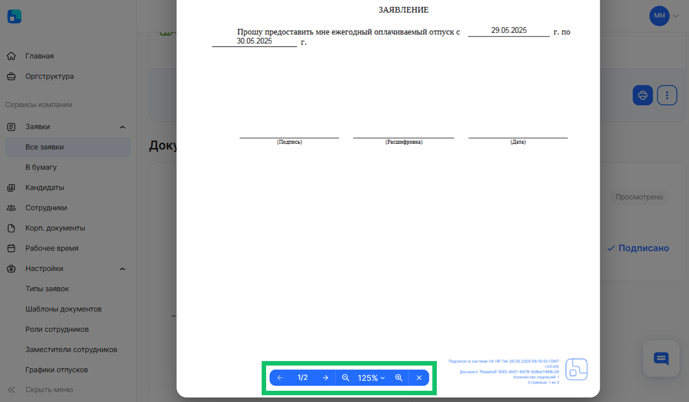

2\. Иногда в отрисовке штампов случаются ошибки, и в этом случае штамп не будет отображаться на странице документа. При этом документ будет иметь юридическую силу. 

В заявке появится сообщение о том, что штамповка документа пропущена. 

### **Ограничение символов в атрибуте заявки**
Для текстовых атрибутов заявки можно задать ограничение на количество символов, включая пробелы.

Чтобы настроить ограничение символов в JSON бизнес-процесса, пропишите в необходимом атрибуте число для параметра `max_length`.

<details>
<summary>Фрагмент JSON</summary>

```json
{
    "type": "text",
    "required": true,
    "name": "Название атрибута",
    "options": {
        "max_length": N
    }
}
```

</details>

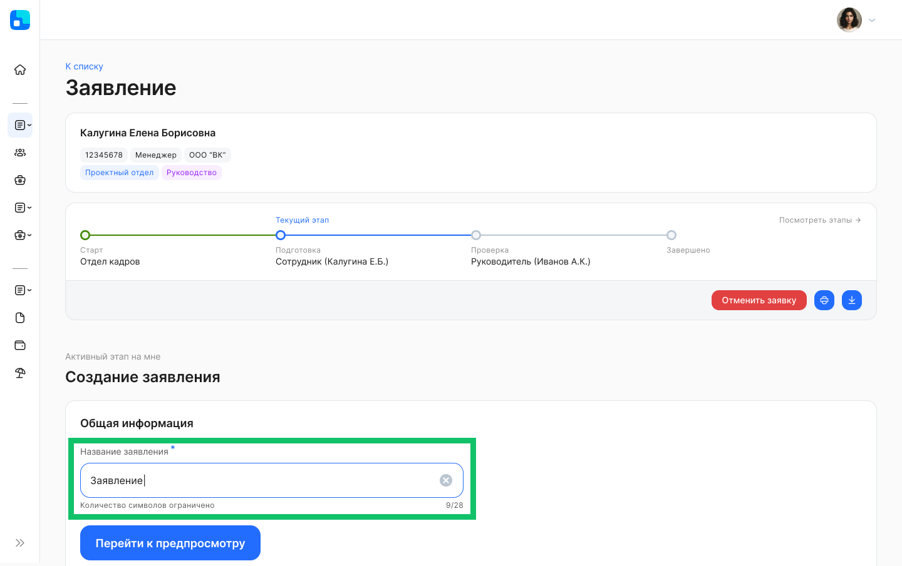

### **Скачивание корпоративного документа (ЛНА)**
В разделе **Корпоративные документы** сотрудники могут скачивать ЛНА только актуальных версий в формате pdf.

Представители компании могут скачивать корпоративные документы как последних, так и прошлых версий.

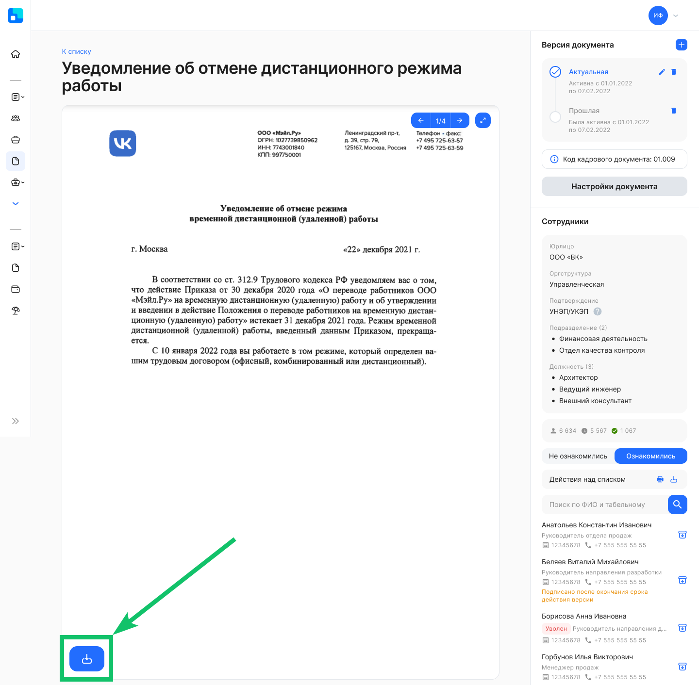

Чтобы кнопка скачивания стала доступной, Администратор КЭДО должен включить настройку **Сотрудники: доступ на скачивание корпоративных документов** в разделе **Настройки компании**.  


### **Персональные данные**
В разделе **Персональные данные сотрудника** можно скачать данные о наградах в формате pdf.

Выгрузка содержит следующие данные:

- ФИО, компания, должность и подразделение сотрудника;
- наименование награды;
- дата и номер приказа, по которому была присвоена эта награда;
- дата выгрузки данных.

Скачивание возможно только при наличии доступа к блоку данных о наградах сотрудника. Чтобы блок стал доступен для представителей компании, руководителей и других сотрудников, настройте ролевую модель компании для данных о наградах. 

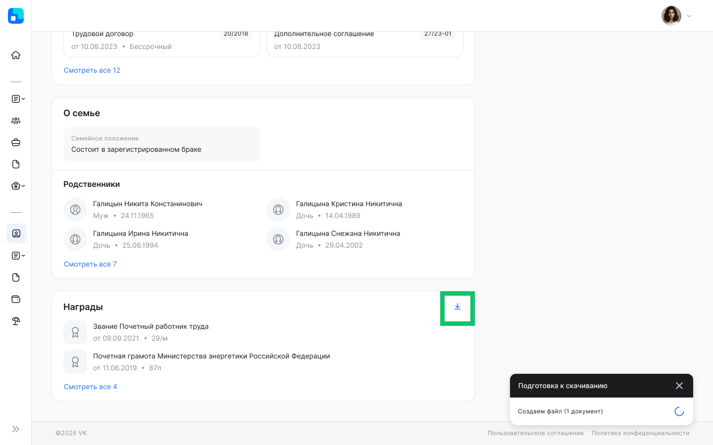

### **Уведомления**
В уведомления, которые поступают сотрудникам и руководителям по заявкам от разных компаний (если есть аккаунт компаний), добавили данные о согласовании планируемых графиков отпусков, если такие планирования есть у сотрудников.

<details>
<summary>Пример уведомления</summary>

**Тема: Заявки подчиненных ожидают ваших действий в КЭДО**

Дорогой коллега,

В системе есть заявки подчиненных, которые нужно обработать.

**ООО "Ромашка"**

**Дедлайн завтра:** 1 заявка

- Должностная инструкция: 1

**На тебе:** 3 заявки\
**Сегмент Продажи:**

- Приказ о предоставлении премии: 2
- Уведомление о начале отпуска: 1

**ЗАО "Василек"**

**На тебе:** 2 заявки\
**Сегмент Логистика:**

- Отпуск: 2

**Требуется согласование в планировании графиков отпусков:**

- Смирнов А.П. (ООО "Ромашка"), согласовать до 15.06.2025: [example.com/company/vacations/123](http://example.com/company/vacations/123)
- Кузнецова Е.В. (ЗАО "Василек"), согласовать: [example.com/company/vacations/223](http://example.com/company/vacations/223)

</details>

### **Мобильная версия сервиса**
В **Профиле** пользователя обновили отображение данных о сотруднике.

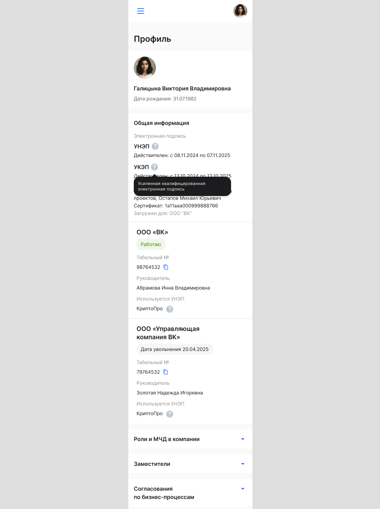

## **Для представителей компании**

### **Заявки с массовой рассылкой**
Для заявок с массовой рассылкой добавили новые возможности для случаев, когда в бизнес-процессах:

- присутствуют загрузка документа и заполнение текстовых атрибутов;
- присутствует загрузка документа и отсутствует заполнение текстовых атрибутов;
- отсутствует загрузка документа и присутствует заполнение текстовых атрибутов;
- отсутствуют загрузка документа и заполнение текстовых атрибутов.

Пример заявки с загрузкой документа и заполнением текстовых атрибутов: 

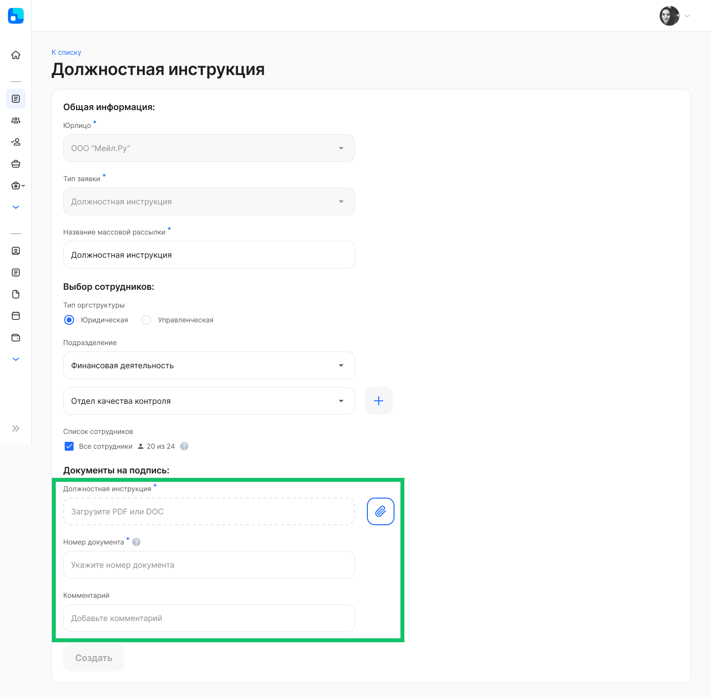

### **Пропуск этапов с любыми действиями**
В заявках могут быть пропущены этапы с подписанием, загрузкой/генерацией документа при наступлении дедлайна. 

Пример заявки:

1) загрузка документа произошла (нет дедлайна на этапе *Загрузка*); 

2) документ перешёл на этап подписания (есть дедлайн на этапе *Подписание*);

3) этап подписания будет пропущен и заявка перейдёт на следующий этап, если дедлайн будет просрочен.


Чтобы настроить такой бизнес-процесс, в JSON укажите настройку дедлайна `"outcome": "skip"` для этапов с действиями `upload`, `generate_from_template` или `sign`.

<details>
<summary>Пример JSON</summary>

```json
{
    "name": "Линейный процесс - пропуск этапа sign при upload",
    "group": "Линейный процесс - пропуск этапа sign при upload",
    "participants": [
        {
            "role": "Отдел кадров",
            "group": "Отдел кадров"
        },
        {
            "role": "Руководитель отдела кадров",
            "group": "Руководитель отдела кадров"
        }
    ],
    "nodes": [
        {
            "key": "start",
            "state": {
                "name": "Старт"
            },
            "node_type": "begin",
            "actions": [
                {
                    "type": "system",
                    "roles": [
                        "Отдел кадров"
                    ]
                }
            ]
        },
        {
            "key": "step_1",
            "state": {
                "name": "Загрузка дополнительного соглашения к трудовому договору"
            },
            "node_type": "middle",
            "actions": [
                {
                    "type": "upload",
                    "roles": [
                        "Отдел кадров"
                    ],
                    "document_type": "Дополнительное соглашение к трудовому договору"
                }
            ]
        },
        {
            "key": "step_2",
            "state": {
                "name": "Подписание дополнительного соглашения к трудовому договору"
            },
            "node_type": "middle",
            "actions": [
                {
                    "type": "sign",
                    "is_employee": true,
                    "document_type": "Дополнительное соглашение к трудовому договору",
                    "signature_type": "pep"
                }
            ],
            "deadline_settings": {
                "reference": "node_active",
                "unit": "minute",
                "term": 2,
                "outcome": "skip"
            }
        },
        {
            "key": "step_3",
            "state": {
                "name": "Проверка подписи"
            },
            "node_type": "middle",
            "actions": [
                {
                    "type": "system_validate_sign",
                    "document_type": "Дополнительное соглашение к трудовому договору"
                }
            ]
        },
        {
            "key": "step_4",
            "state": {
                "name": "Подписание дополнительного соглашения к трудовому договору"
            },
            "node_type": "middle",
            "actions": [
                {
                    "type": "sign",
                    "roles": [
                        "Руководитель отдела кадров"
                    ],
                    "document_type": "Дополнительное соглашение к трудовому договору",
                    "signature_type": "pep"
                }
            ],
            "deadline_settings": {
                "reference": "node_active",
                "unit": "minute",
                "term": 2,
                "outcome": "skip"
            }
        },
        {
            "key": "step_5",
            "state": {
                "name": "Проверка подписи"
            },
            "node_type": "middle",
            "actions": [
                {
                    "type": "system_validate_sign",
                    "document_type": "Дополнительное соглашение к трудовому договору"
                }
            ]
        },
        {
            "key": "step_6",
            "node_type": "middle",
            "state": {
                "name": "Проверка документов"
            },
            "actions": [
                {
                    "roles": [
                        "Отдел кадров"
                    ],
                    "type": "accept"
                }
            ]
        },
        {
            "key": "finish1",
            "state": {
                "name": "Завершено"
            },
            "node_type": "end",
            "actions": [
                {
                    "type": "system"
                }
            ]
        }
    ],
    "transitions": [
        {
            "from": "start",
            "to": "step_1"
        },
        {
            "from": "step_1",
            "to": "step_2"
        },
        {
            "from": "step_2",
            "to": "step_3"
        },
        {
            "from": "step_3",
            "to": "step_4"
        },
        {
            "from": "step_4",
            "to": "step_5"
        },
        {
            "from": "step_5",
            "to": "step_6"
        },
        {
            "from": "step_6",
            "to": "finish1"
        }
    ]
}
```

</details>


### **Отчёт об изменениях заявки**
В отчёт по изменениям заявки добавили:

- новый столбец «Наименование этапа», в котором отображаются действия, выполненные на этапе.
- информацию о возврате этапа на доработку, если в заявке был такой возврат.

### **Фильтр по пакету заявки**
В фильтре **По пакету заявки** доступен выбор всех или нескольких значений.

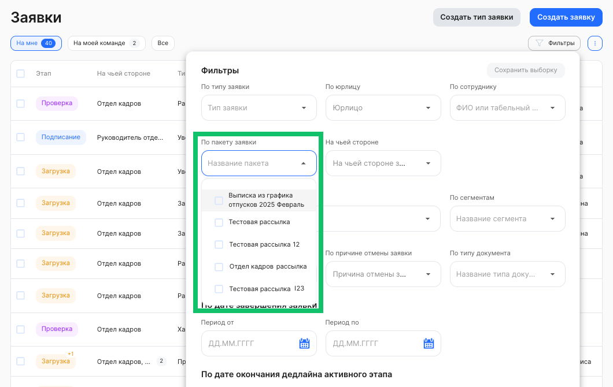

### **Фильтр по группе доступа**
В раздел **Сотрудники** добавили фильтр по группе доступа. Фильтр будет доступен, если компания использует группы доступа.

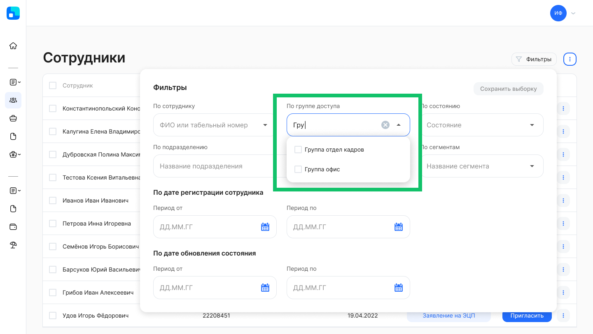

### **Изменение настроек корпоративного документа**
Доступно редактирование настроек в корпоративном документе после его публикации. В документе можно изменить:

- возможность скрыть версию документа после ознакомления сотрудником;
- тип организационной структуры;
- подразделение(-я);
- должность(-и);
- сотрудника(-ов).

Если внесённые изменения сохранены, то документ доступен изменённому набору пользователей для ознакомления и пользователям, которые уже ознакомились с документом (независимо от того попали ли они в новую выборку или нет).

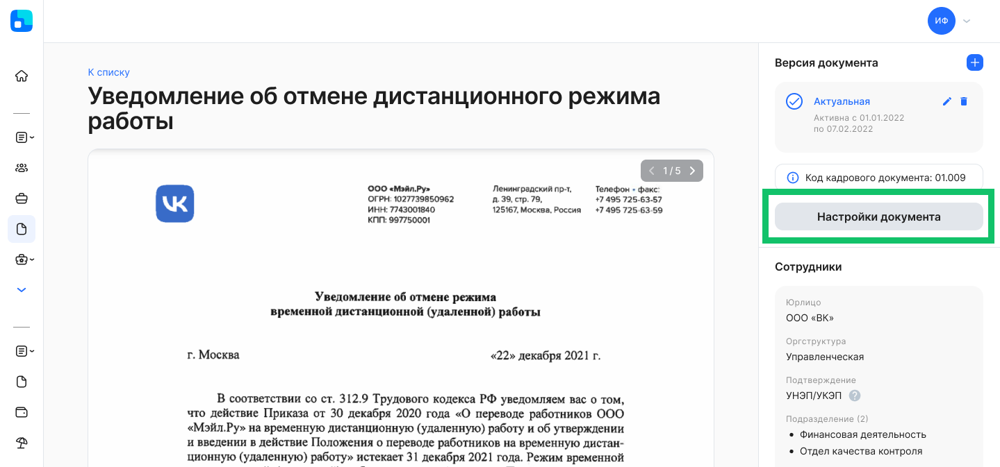

### **Видимость типов заявок**
Администратор КЭДО может управлять видимостью типов заявок в разделе **Сервисы компании → Настройки → Типы заявок**. Чтобы показать тип заявки в списке доступных при создании новой заявки, выберите необходимый бизнес-процесс из списка и включите настройку **Использование типа заявки**.

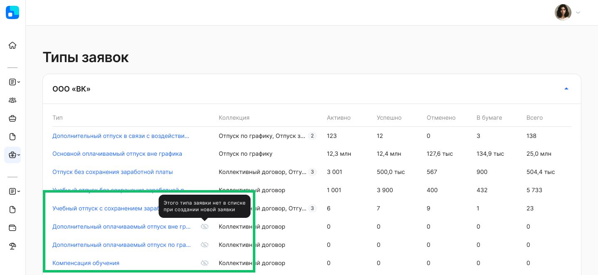

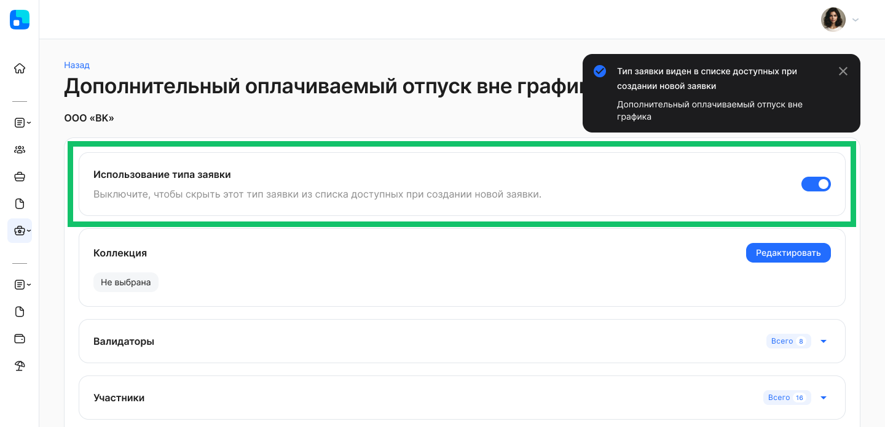

### **Изменение данных генерального директора**
Администратор КЭДО может отредактировать ФИО и должность генерального директора компании и изменить эти данные по падежам. Для этого откройте настройку **Юридическая информация** в разделе **Настройки компании** и заполните необходимую информацию.

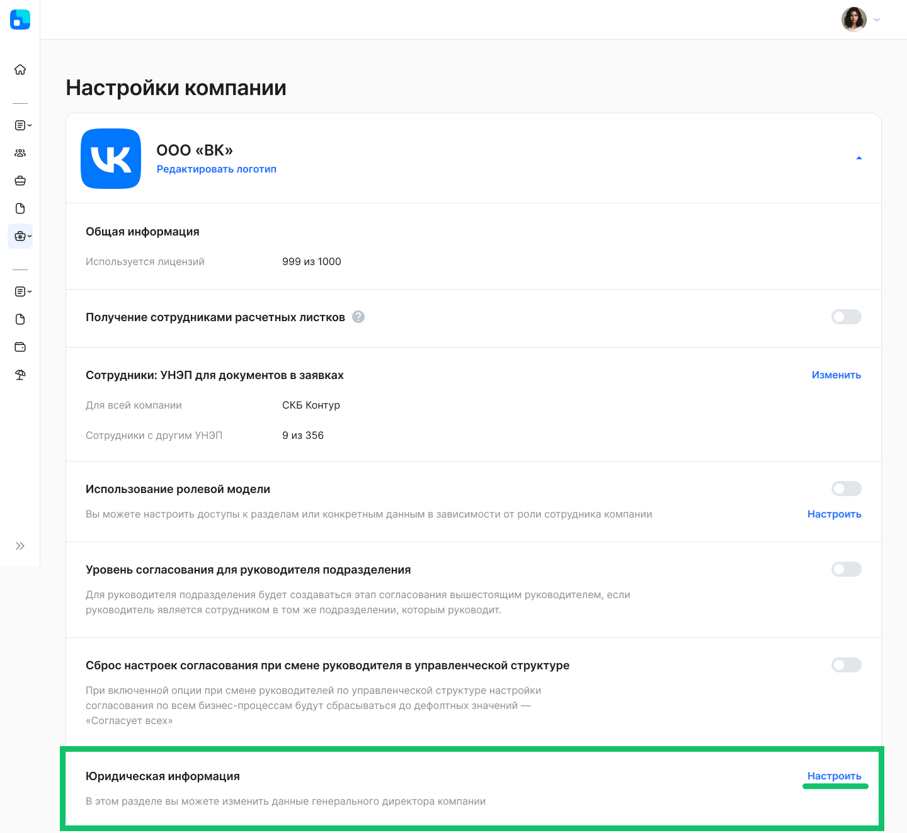

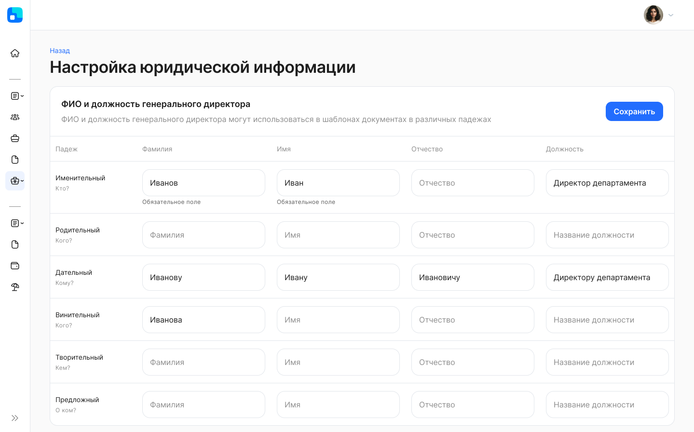

## **Для сотрудников**
### **Запланированные отсутствия**
При создании заявки на отсутствие сотрудник может выбрать период нового отсутствия, ориентируясь на даты ранее запланированных отсутствий.

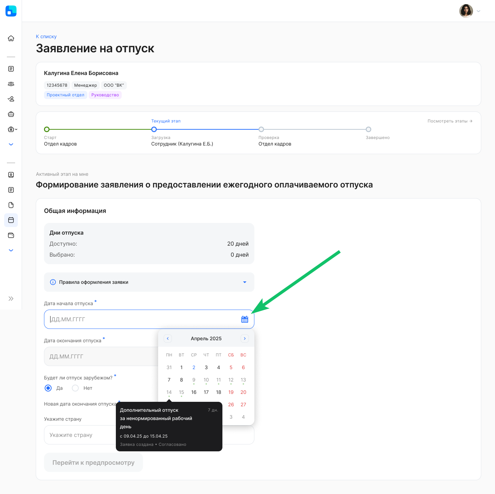

### **Превышение доступного количества дней**
Для заявок с отсутствиями доступен валидатор, который считает общее количество дней во всех указанных периодах и предупреждает, если это число превысило лимит. 

Если при выборе периода дат отсутствия сотрудник превысил доступный ему лимит по всем видам отсутствий, то в заявке отображается сообщение о превышении доступного количества дней. При этом сотрудник может создать заявку.

Чтобы настроить такую проверку для бизнес-процесса с несколькими периодами отсутствий, в JSON укажите валидатор типа `exceeding_limit` для каждой пары дат, образующих один период. При расчёте выбранного количества дней учитываются все периоды дат, для которых указан новый валидатор. 

<details>
<summary>Фрагмент JSON</summary>

```json 
{
    "type": "exceeding_limit",
    "attributes": [
        "Дата начала отпуска",
        "Дата окончания отпуска"
    ]
},
{
    "type": "exceeding_limit",
    "attributes": [
        "Дата начала отпуска 1",
        "Дата окончания отпуска 1"
    ]
}
```

</details>

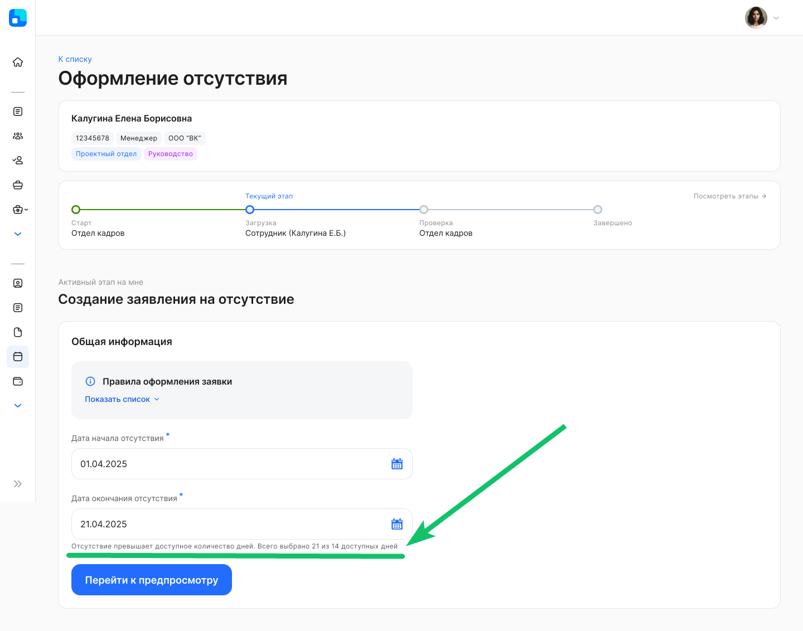

### **Электронная подпись**
Для иностранных сотрудников необязательно указывать ИНН для выпуска усиленной неквалифицированной электронной подписи (УНЭП УЦ Контур). В таком случае, если у иностранного сотрудника отсутствует ИНН, то этап валидации ИНН будет пропущен при выпуске УНЭП.

Для сотрудников РФ ИНН обязателен при выпуске УНЭП.

## **Работа в административной панели**
### **Отключение уведомлений об ознакомлении с ЛНА в выходные/праздничные дни**
В административной панели, в настройках компании добавлена опция, позволяющая получать уведомления об ознакомлении с ЛНА только в рабочие дни. Рабочие дни учитываются по производственному календарю.

Включить опцию могут пользователи с ролями:

- ROLE\_MANAGER;
- ROLE\_SUPPORT;
- ROLE\_NOTIFICATION\_MANAGER;
- ROLE\_DEVELOPER;
- ROLE\_SENIOR\_MANAGER;
- ROLE\_ADMIN.

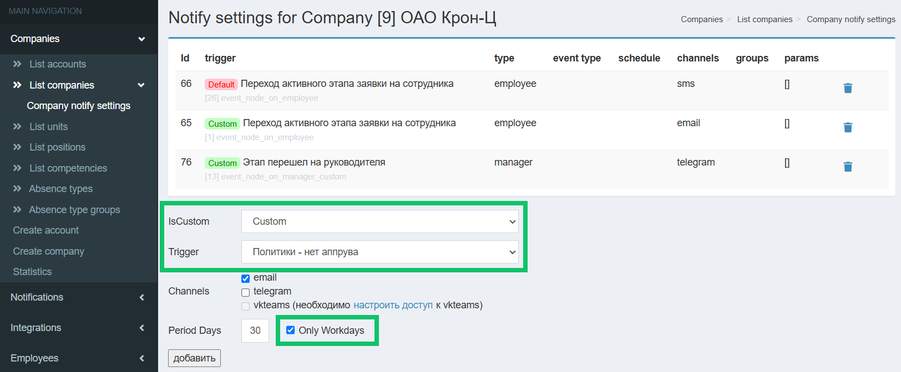

### **Отключение дефолтных уведомлений**
В административной панели, в настройках компании можно отключать все (**Companies → List companies → Edit company**) или отдельные дефолтные уведомления (**Companies → List companies → Company notify settings**), которые больше не требуется получать сотрудникам и представителям компании. Исключением являются уведомления, которые нельзя отключить:

- Истечение срока действия УКЭП (user\_ukep\_certificate\_lte\_days);
- Успешный выпуск УНЭП (user\_unep\_certificate\_released);
- Автоматический перевыпуск УНЭП из-за истечения срока годности УНЭП (user\_unep\_certificate\_renew).

Отключение дефолтных уведомлений доступно для ролей:

- ADMIN;
- MANAGER;
- SUPPORT.

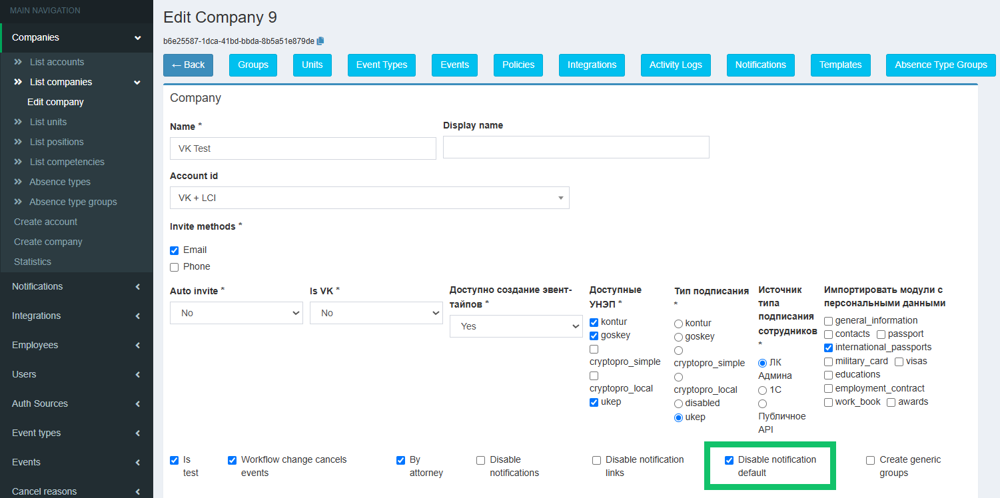

### **Отчёт по продукту**
В административной панели добавлен новый раздел **Companies → Statistics**, где можно скачать аналитический отчёт по использованию продукта (по всей инсталляции). Раздел доступен для ролей:

- ROLE\_MANAGER;
- ROLE\_NOTIFICATION\_MANAGER;
- ROLE\_SENIOR\_MANAGER.

## **Исправления**
1. Поправили текст, появляющийся в случае возникновения ошибки СМЭВ.
1. В разделе **Рабочее время**, для выбранной компании корректно открывается полный **График отсутствий** при нажатии кнопки **Показать все** в конце календаря.
1. Скорректировали данные в **Профиле** пользователя для случаев, когда у пользователя отсутствует выпущенный УНЭП.
1. При редактировании бизнес-процесса в разделе **Настройки → Типы заявок** исправили ошибку с пустым наименованием справочника, возникавшую в JSON.
1. При просмотре этапов заявки после возврата на доработку отображается исполнитель этапа.
1. В мобильной версии настроили корректное отображение подсказок.

