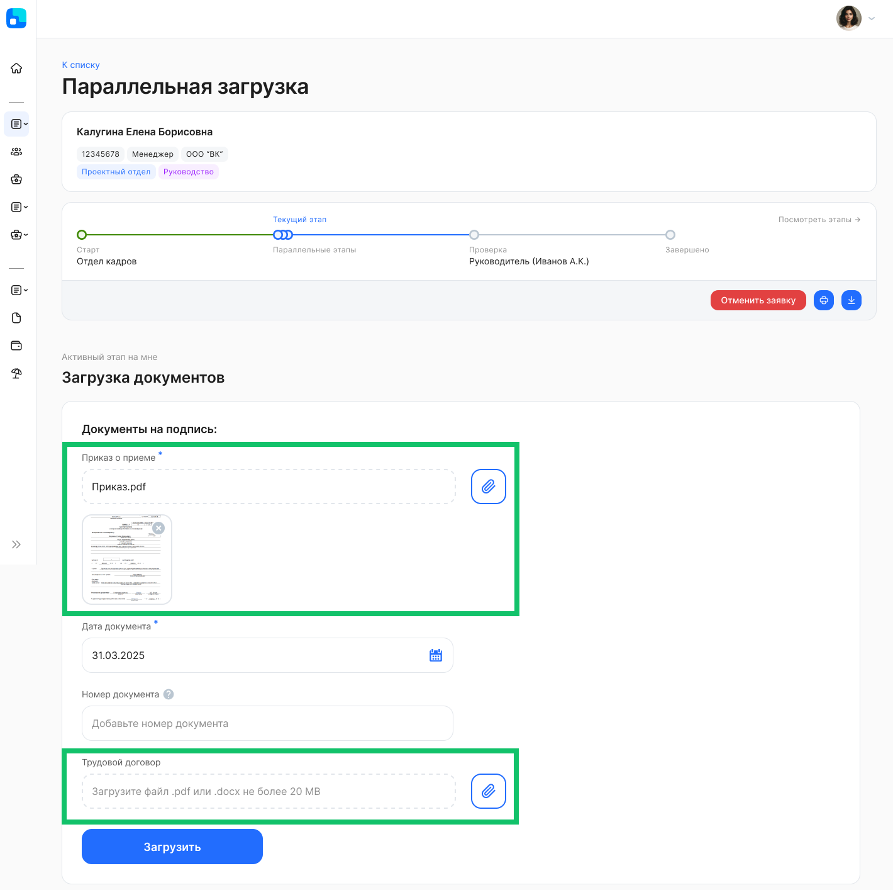
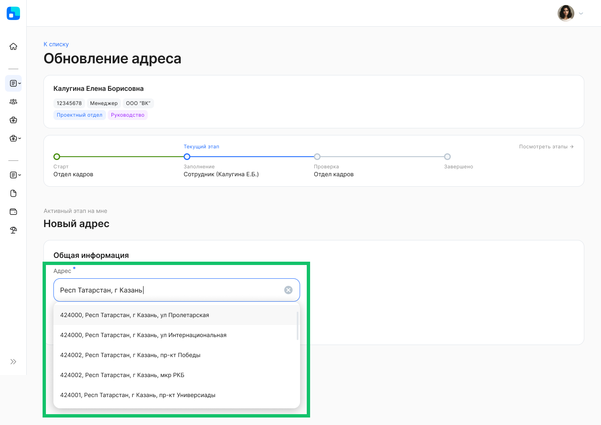
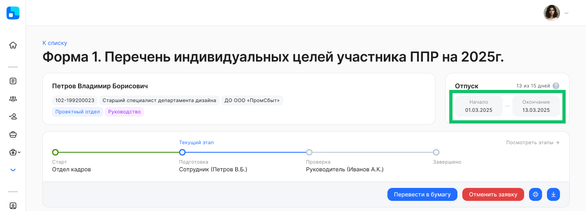
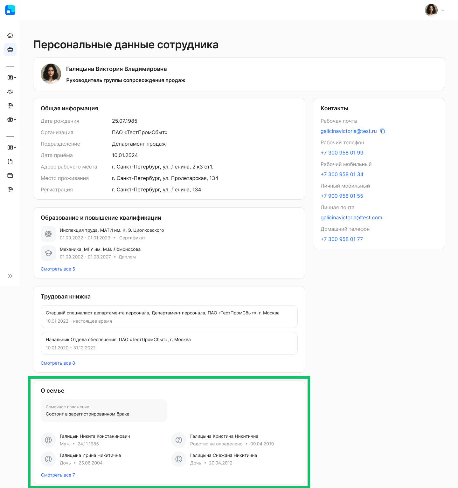
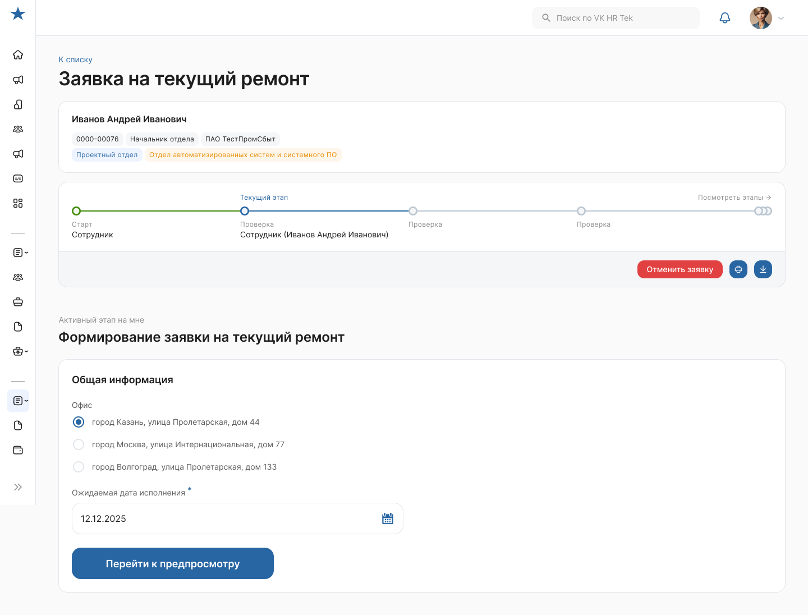
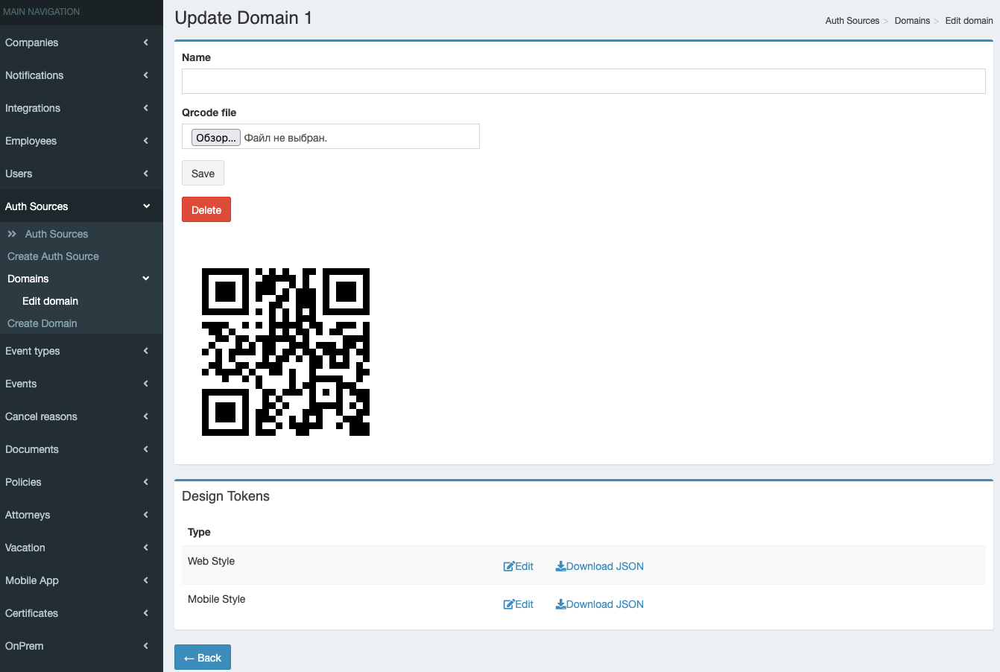
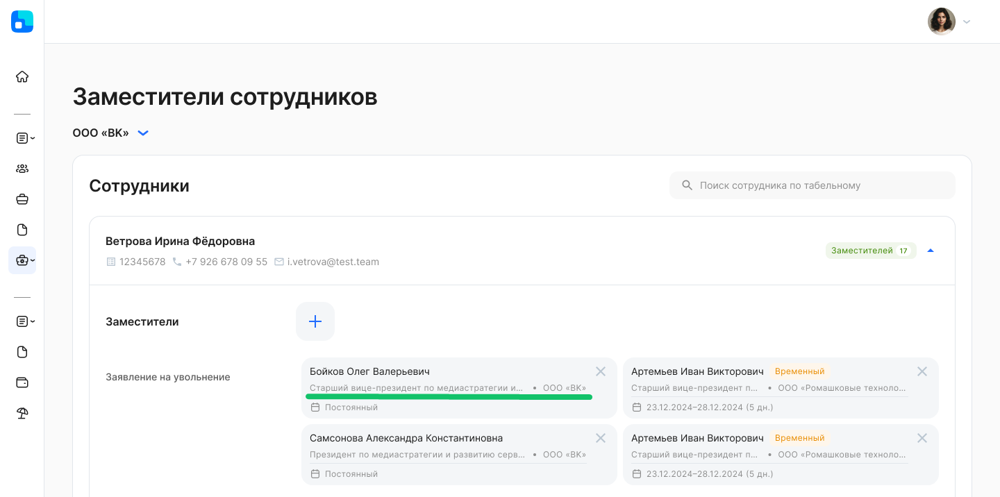

## **Для всех пользователей**
### **Параллельная загрузка документов**
Для заявок с несколькими параллельными этапами «Загрузка» обновлён интерфейс одновременной загрузки нескольких документов. В бизнес-процессах могут поддерживаться обязательные и необязательные для загрузки типы документов.



### **Пропуск этапа с подписанием**
Если в заявке на этапе подписания не найден руководитель (или ассистент руководителя) сотрудника, то при включенной опции пропуска этапа в бизнес-процессе система проверит наличие вышестоящего руководителя/ассистента относительно предыдущего. И в случае если вышестоящий руководитель/ассистент будет найден, переведёт этап с подписанием на него, иначе пропустит этот этап.

Если в JSON бизнес-процесса для этапа с типом `"sign"` указана настройка `"skip_missing_managers": true`, то система переведёт этап на найденного руководителя/ассистента или пропустит этап.

Если `"skip_missing_managers": false`, то этапы подписания и проверки подписи пропускаются, даже если есть руководители выше по иерархии.

Если настройка `"skip_missing_managers"` отсутствует в JSON и руководитель сотрудника не найден, то этапы подписания и проверки подписи пропускаются.

<details>
<summary>Пример JSON</summary>

```json
{
    "name": "Заявление на отпуск без сохранения заработной платы",
    "group": "Заявление на отпуск без сохранения заработной платы",
    "options": {
        "skip_missing_managers": true
    },
    "participants": [
        {
            "role": "Отдел кадров",
            "group": "Отдел кадров"
        },
        {
            "role": "Отдел кадров (ОЦО)",
            "group": "Отдел кадров (ОЦО)"
        },
        {
            "role": "Отдел кадров предприятия",
            "group": "Отдел кадров предприятия"
        },
        {
            "role": "Руководитель юридический 1"
        }
    ],
    "validators": [
        {
            "type": "min_date",
            "attributes": [
                "Дата начала отпуска"
            ],
            "settings": {
                "days_count": -1,
                "working_days_only": false
            }
        },
        {
            "type": "min_duration",
            "attributes": [
                "Дата начала отпуска",
                "Дата окончания отпуска"
            ],
            "settings": {
                "min_duration": -1,
                "working_days_only": false
            }
        },
        {
            "type": "absence_overlap",
            "attributes": [
                "Дата начала отпуска",
                "Дата окончания отпуска"
            ],
            "settings": {
                "rules": {
                    "ВРПР1": "A",
                    "ВРПР2": "E",
                    "ВРПР3": "A",
                    "ВРПР4": "E",
                    "ВРПР5": "E",
                    "ВРПР6": "A",
                    "ВРПР7": "W",
                    "ВРПР8": "A",
                    "ВРПР9": "A",
                    "ВРПР10": "E"
                },
                "messages": {
                    "A": "Внимание! Выбранный отпуск пересекается с другим отсутствием. Вы можете оформить заявку на выбранные даты, но пересекающиеся с другими отсутствиями дни будут учтены как указанный отпуск",
                    "W": "Внимание! Выбранный отпуск пересекается с другим отсутствием. Вы можете оформить заявку на выбранные даты, но пересекающиеся с другими отсутствиями дни не будут учтены как указанный отпуск",
                    "E": "Внимание! Выбранный отпуск не может пересекаться с другим отсутствием"
                }
            }
        },
        {
            "type": "no_overlap",
            "attributes": [
                "Дата начала отпуска",
                "Дата окончания отпуска"
            ]
        }
    ],
    "nodes": [
        {
            "key": "start",
            "state": {
                "name": "Старт"
            },
            "node_type": "begin",
            "actions": [
                {
                    "roles": [],
                    "type": "system",
                    "is_employee": true
                }
            ]
        },
        {
            "key": "zapolnenye",
            "state": {
                "name": "Заполните данные"
            },
            "node_type": "middle",
            "actions": [
                {
                    "roles": [],
                    "attributes": [
                        {
                            "type": "date",
                            "name": "Дата начала отпуска",
                            "required": true
                        },
                        {
                            "type": "date",
                            "name": "Дата окончания отпуска",
                            "required": true
                        }
                    ],
                    "type": "generate_document_from_template",
                    "document_type": "Заявление на отпуск без сохранения заработной платы",
                    "is_employee": true,
                    "template": {
                        "placeholders": [
                            {
                                "key": "FirstDateFrom",
                                "attribute": "Дата начала отпуска"
                            },
                            {
                                "key": "FirstDateTo",
                                "attribute": "Дата окончания отпуска"
                            }
                        ]
                    }
                }
            ],
            "employee_cancelable": true
        },
        {
            "key": "signzauyav",
            "state": {
                "name": "Подписание заявления на отпуск без сохранения заработной платы"
            },
            "node_type": "middle",
            "actions": [
                {
                    "roles": [],
                    "type": "sign",
                    "signature_type": "unep",
                    "is_employee": true,
                    "document_type": "Заявление на отпуск без сохранения заработной платы"
                }
            ],
            "employee_cancelable": true,
            "deadline_settings": {
                "reference": "created_date",
                "unit": "day",
                "term": 1,
                "round_days": true
            }
        },
        {
            "key": "signcheck",
            "state": {
                "name": "Проверка подписи"
            },
            "node_type": "middle",
            "actions": [
                {
                    "type": "system_validate_sign",
                    "document_type": "Заявление на отпуск без сохранения заработной платы"
                }
            ]
        },
        {
            "key": "signruk",
            "state": {
                "name": "Подписание заявления на отпуск без сохранения заработной платы"
            },
            "node_type": "middle",
            "actions": [
                {
                    "roles": [
                        "Руководитель юридический 1"
                    ],
                    "type": "sign",
                    "signature_type": "pep",
                    "document_type": "Заявление на отпуск без сохранения заработной платы"
                },
                {
                    "roles": [
                        "Руководитель юридический 1"
                    ],
                    "type": "return",
                    "name": "Вернуть на доработку"
                }
            ],
            "employee_cancelable": true,
            "deadline_settings": {
                "reference": "created_date",
                "unit": "day",
                "term": 1,
                "round_days": true
            }
        },
        {
            "key": "signrukchek",
            "state": {
                "name": "Проверка подписи"
            },
            "node_type": "middle",
            "actions": [
                {
                    "type": "system_validate_sign",
                    "document_type": "Заявление на отпуск без сохранения заработной платы"
                }
            ]
        },
        {
            "key": "proverkazaivlenya",
            "state": {
                "name": "Проверка заявления"
            },
            "node_type": "middle",
            "actions": [
                {
                    "roles": [
                        "Отдел кадров"
                    ],
                    "type": "accept",
                    "name": "Согласовать"
                },
                {
                    "roles": [
                        "Отдел кадров"
                    ],
                    "type": "return",
                    "name": "На доработку"
                }
            ],
            "employee_cancelable": true,
            "deadline_settings": {
                "reference": "created_date",
                "unit": "workday",
                "term": 2
            }
        },
        {
            "key": "vrabotu",
            "state": {
                "name": "Новая заявка",
                "description": "Возьмите в заявку в работу, чтобы зафиксирать себя, как исполнителя по задаче"
            },
            "node_type": "middle",
            "custom_state": {
                "name": "Обработка ОЦО"
            },
            "actions": [
                {
                    "type": "accept",
                    "name": "Взять в работу",
                    "roles": [
                        "Отдел кадров (ОЦО)"
                    ]
                }
            ]
        },
        {
            "key": "tosap",
            "state": {
                "name": "Запрос в SAP",
                "description": "Проведите мероприятие в SAP, после чего вернитесь в данную заявку и нажмите кнопку Мероприятие проведено "
            },
            "node_type": "middle",
            "actions": [
                {
                    "roles": [
                        "Отдел кадров (ОЦО)"
                    ],
                    "type": "accept",
                    "name": "Мероприятие проведено"
                },
                {
                    "roles": [
                        "Отдел кадров (ОЦО)"
                    ],
                    "type": "return"
                }
            ],
            "notify_integration": true
        },
        {
            "key": "end",
            "state": {
                "name": "Завершено"
            },
            "node_type": "end",
            "actions": [
                {
                    "type": "system"
                }
            ]
        }
    ],
    "transitions": [
        {
            "from": "start",
            "to": "zapolnenye"
        },
        {
            "from": "zapolnenye",
            "to": "signzauyav"
        },
        {
            "from": "signzauyav",
            "to": "signcheck"
        },
        {
            "from": "signcheck",
            "to": "signruk"
        },
        {
            "from": "signruk",
            "to": "zapolnenye",
            "action_type": "return"
        },
        {
            "from": "signruk",
            "to": "signrukchek",
            "action_type": "sign"
        },
        {
            "from": "signrukchek",
            "to": "proverkazaivlenya"
        },
        {
            "from": "proverkazaivlenya",
            "to": "vrabotu",
            "action_type": "accept"
        },
        {
            "from": "proverkazaivlenya",
            "to": "zapolnenye",
            "action_type": "return"
        },
        {
            "from": "vrabotu",
            "to": "tosap"
        },
        {
            "from": "tosap",
            "to": "end",
            "action_type": "accept"
        },
        {
            "from": "tosap",
            "to": "proverkazaivlenya",
            "action_type": "return"
        }
    ]
}
```

</details>


### **Поддержка справочника ГАР**
Пользователь может вводить адрес в поле заявки в соответствии с форматом Государственного адресного реестра (ГАР). Система покажет адреса из поискового запроса в выпадающем списке, обращаясь к сервису [DaData «Подсказки по адресам»](https://dadata.ru/api/suggest/address/). После выбора адреса система заполнит поле заявки данными по адресу по шаблону ГАР и сохранит полный ответ от сервиса DaData по выбранному адресу.



<br>

Чтобы добавить атрибут со справочником ГАР в бизнес-процесс, укажите в JSON новый атрибут с типом `"external_resource"`.

<details>
<summary>Фрагмент JSON</summary>

```json
{
    "type": "external_resource",
    "name": "Адрес регистрации",
    "required": true,
    "options": {
    "service": "DaData_address_service" // указывается наименование внешнего сервиса, к которому происходит обращение при заполнении атрибута (значение указано как возможный пример названия сервиса для использования ДаДаты)
    "suggestions_key": "fias_id" // обязательно должен быть заполнен при использовании сервиса DaData. Заполняется значением поля из ответа suggestions, получаемого с DaData.
    }
}
```

</details>

### **Мультивыбор в атрибутах для пополняемых справочников**
В заявке при заполнении поля можно выбирать несколько значений из справочника, а также вводить и выбирать новые произвольные значения.


### **Период отсутствия в заявке**
В верхней части заявки поменяли текст в блоке с подсчётом дней для периода отсутствия.




### **Валидаторы**
Пользователь может подтвердить даты в заявке и перейти на следующий этап, если атрибуты с датами не редактируются на текущем этапе. В этом случае валидаторы «Минимальное количество дней между датой подачи заявки и датой события» и «Максимальное количество дней между датой подачи заявки и датой события» на текущем этапе не будут применяться к полям, недоступным для редактирования дат.

Если на `"actions"` в JSON бизнес-процесса есть атрибуты с настройкой `"not_editable"`, то валидаторы `"min_date"` и `"max_date"` не должны срабатывать для этих атрибутов.

<details>
<summary>Пример JSON</summary>

```json
{
    "name": "Заявка на командировку",
    "group": "Заявка на командировку",
    "participants": [
        {
            "role": "Отдел кадров",
            "group": "Отдел кадров"
        },
        {
            "role": "Отдел кадров (ОЦО)",
            "group": "Отдел кадров (ОЦО)"
        },
        {
            "role": "Уполномоченное лицо",
            "group": "Уполномоченное лицо"
        },
        {
            "role": "Бухгалтерия",
            "group": "Бухгалтерия"
        },
        {
            "role": "Руководитель управленческий 1"
        },
        {
            "role": "Руководитель должности ГД-1",
            "required": true,
            "editable": true,
            "editable_scope": "company"
        }
    ],
    "validators": [
        {
            "type": "min_date",
            "attributes": [
                "Дата начала командировки (в приказ)"
            ],
            "settings": {
                "days_count": 0,
                "working_days_only": false
            }
        },
        {
            "type": "min_date",
            "attributes": [
                "Дата фактического начала командировки"
            ],
            "settings": {
                "days_count": 0,
                "working_days_only": false
            }
        },
        {
            "type": "max_duration",
            "attributes": [
                "Дата начала командировки (в приказ)",
                "Дата окончания командировки (в приказ)"
            ],
            "settings": {
                "max_duration": 200,
                "working_days_only": false
            }
        },
        {
            "type": "min_duration",
            "attributes": [
                "Дата начала командировки (в приказ)",
                "Дата окончания командировки (в приказ)"
            ],
            "settings": {
                "min_duration": 0,
                "working_days_only": false
            }
        },
        {
            "type": "max_duration",
            "attributes": [
                "Дата фактического начала командировки",
                "Дата фактического окончания командировки"
            ],
            "settings": {
                "max_duration": 250,
                "working_days_only": false
            }
        },
        {
            "type": "min_duration",
            "attributes": [
                "Дата фактического начала командировки",
                "Дата фактического окончания командировки"
            ],
            "settings": {
                "min_duration": 0,
                "working_days_only": false
            }
        },
        {
            "type": "no_overlap",
            "attributes": [
                "Дата начала командировки (в приказ)",
                "Дата окончания командировки (в приказ)"
            ]
        }
    ],
    "nodes": [
        {
            "key": "start",
            "state": {
                "name": "Старт"
            },
            "node_type": "begin",
            "actions": [
                {
                    "type": "system",
                    "is_employee": true
                }
            ]
        },
        {
            "key": "step_1",
            "state": {
                "name": "Заполните необходимые данные"
            },
            "node_type": "middle",
            "actions": [
                {
                    "type": "accept",
                    "is_employee": true,
                    "attributes": [
                        {
                            "name": "Локация командировки",
                            "description": "Укажите локацию командировки",
                            "type": "choice",
                            "required": true,
                            "options": {
                                "choices": [
                                    {
                                        "label": "Командировка по РФ",
                                        "value": "1"
                                    },
                                    {
                                        "label": "Командировка зарубеж",
                                        "value": "2"
                                    }
                                ]
                            }
                        },
                        {
                            "name": "Необходимость визы",
                            "description": "Укажите, нужна ли вам виза",
                            "type": "choice",
                            "options": {
                                "choices": [
                                    {
                                        "label": "Нужна",
                                        "value": "1"
                                    },
                                    {
                                        "label": "Не нужна",
                                        "value": "2"
                                    }
                                ],
                                "hide_when": {
                                    "attribute": "Локация командировки",
                                    "equal": [
                                        "1"
                                    ]
                                }
                            }
                        },
                        {
                            "name": "Укажите цель командировки",
                            "type": "choice",
                            "options": {
                                "choices": [
                                    {
                                        "label": "Производственная необходимость",
                                        "value": "1"
                                    },
                                    {
                                        "label": "Повышение квалификации",
                                        "value": "2"
                                    },
                                    {
                                        "label": "Другое",
                                        "value": "3"
                                    }
                                ]
                            },
                            "required": true
                        },
                        {
                            "name": "Укажите другую цель командировки",
                            "type": "text",
                            "required": true,
                            "options": {
                                "hide_when": {
                                    "attribute": "Укажите цель командировки",
                                    "equal": [
                                        "1",
                                        "2"
                                    ]
                                }
                            }
                        },
                        {
                            "name": "Укажите город отправления",
                            "type": "text",
                            "required": true
                        },
                        {
                            "name": "Выберите первую страну командирования",
                            "type": "choice",
                            "required": true,
                            "options": {
                                "choices": [
                                    {
                                        "label": "Россия",
                                        "value": "1"
                                    },
                                    {
                                        "label": "Другая страна",
                                        "value": "2"
                                    }
                                ],
                                "hide_when": {
                                    "attribute": "Локация командировки",
                                    "equal": [
                                        "1"
                                    ]
                                }
                            }
                        },
                        {
                            "name": "Укажите первую страну из списка",
                            "type": "choice",
                            "options": {
                                "choices": [
                                    {
                                        "label": "Афганистан",
                                        "value": "1"
                                    },
                                    {
                                        "label": "Албания",
                                        "value": "2"
                                    },
                                    {
                                        "label": "Алжир",
                                        "value": "3"
                                    },
                                    {
                                        "label": "Андорра",
                                        "value": "4"
                                    },
                                    {
                                        "label": "Ангола",
                                        "value": "5"
                                    },
                                    {
                                        "label": "Антигуа и Барбуда",
                                        "value": "6"
                                    },
                                    {
                                        "label": "Аргентина",
                                        "value": "7"
                                    },
                                    {
                                        "label": "Армения",
                                        "value": "8"
                                    },
                                    {
                                        "label": "Австралия",
                                        "value": "9"
                                    },
                                    {
                                        "label": "Австрия",
                                        "value": "10"
                                    },
                                    {
                                        "label": "Азербайджан",
                                        "value": "11"
                                    },
                                    {
                                        "label": "Багамы",
                                        "value": "12"
                                    },
                                    {
                                        "label": "Бахрейн",
                                        "value": "13"
                                    },
                                    {
                                        "label": "Бангладеш",
                                        "value": "14"
                                    },
                                    {
                                        "label": "Барбадос",
                                        "value": "15"
                                    },
                                    {
                                        "label": "Беларусь",
                                        "value": "16"
                                    },
                                    {
                                        "label": "Бельгия",
                                        "value": "17"
                                    },
                                    {
                                        "label": "Белиз",
                                        "value": "18"
                                    },
                                    {
                                        "label": "Бенин",
                                        "value": "19"
                                    },
                                    {
                                        "label": "Бутан",
                                        "value": "20"
                                    },
                                    {
                                        "label": "Боливия",
                                        "value": "21"
                                    },
                                    {
                                        "label": "Босния и Герцеговина",
                                        "value": "22"
                                    },
                                    {
                                        "label": "Ботсвана",
                                        "value": "23"
                                    },
                                    {
                                        "label": "Бразилия",
                                        "value": "24"
                                    },
                                    {
                                        "label": "Бруней",
                                        "value": "25"
                                    },
                                    {
                                        "label": "Болгария",
                                        "value": "26"
                                    },
                                    {
                                        "label": "Буркина-Фасо",
                                        "value": "27"
                                    },
                                    {
                                        "label": "Бурунди",
                                        "value": "28"
                                    },
                                    {
                                        "label": "Камбоджа",
                                        "value": "29"
                                    },
                                    {
                                        "label": "Камерун",
                                        "value": "30"
                                    },
                                    {
                                        "label": "Канада",
                                        "value": "31"
                                    },
                                    {
                                        "label": "Кабо-Верде",
                                        "value": "32"
                                    },
                                    {
                                        "label": "Центральноафриканская Республика",
                                        "value": "33"
                                    },
                                    {
                                        "label": "Чад",
                                        "value": "34"
                                    },
                                    {
                                        "label": "Чили",
                                        "value": "35"
                                    },
                                    {
                                        "label": "Китай",
                                        "value": "36"
                                    },
                                    {
                                        "label": "Колумбия",
                                        "value": "37"
                                    },
                                    {
                                        "label": "Коморские Острова",
                                        "value": "38"
                                    },
                                    {
                                        "label": "Конго, Демократическая Республика",
                                        "value": "39"
                                    },
                                    {
                                        "label": "Конго, Республика",
                                        "value": "40"
                                    },
                                    {
                                        "label": "Коста-Рика",
                                        "value": "41"
                                    },
                                    {
                                        "label": "Хорватия",
                                        "value": "42"
                                    },
                                    {
                                        "label": "Куба",
                                        "value": "43"
                                    },
                                    {
                                        "label": "Кипр",
                                        "value": "44"
                                    },
                                    {
                                        "label": "Чехия",
                                        "value": "45"
                                    },
                                    {
                                        "label": "Дания",
                                        "value": "46"
                                    },
                                    {
                                        "label": "Джибути",
                                        "value": "47"
                                    },
                                    {
                                        "label": "Доминика",
                                        "value": "48"
                                    },
                                    {
                                        "label": "Доминиканская Республика",
                                        "value": "49"
                                    },
                                    {
                                        "label": "Эквадор",
                                        "value": "50"
                                    },
                                    {
                                        "label": "Египет",
                                        "value": "51"
                                    },
                                    {
                                        "label": "Сальвадор",
                                        "value": "52"
                                    },
                                    {
                                        "label": "Экваториальная Гвинея",
                                        "value": "53"
                                    },
                                    {
                                        "label": "Эритрея",
                                        "value": "54"
                                    },
                                    {
                                        "label": "Эстония",
                                        "value": "55"
                                    },
                                    {
                                        "label": "Эсватини",
                                        "value": "56"
                                    },
                                    {
                                        "label": "Эфиопия",
                                        "value": "57"
                                    },
                                    {
                                        "label": "Фиджи",
                                        "value": "58"
                                    },
                                    {
                                        "label": "Финляндия",
                                        "value": "59"
                                    },
                                    {
                                        "label": "Франция",
                                        "value": "60"
                                    },
                                    {
                                        "label": "Габон",
                                        "value": "61"
                                    },
                                    {
                                        "label": "Гамбия",
                                        "value": "62"
                                    },
                                    {
                                        "label": "Грузия",
                                        "value": "63"
                                    },
                                    {
                                        "label": "Германия",
                                        "value": "64"
                                    },
                                    {
                                        "label": "Гана",
                                        "value": "65"
                                    },
                                    {
                                        "label": "Греция",
                                        "value": "66"
                                    },
                                    {
                                        "label": "Гренада",
                                        "value": "67"
                                    },
                                    {
                                        "label": "Гватемала",
                                        "value": "68"
                                    },
                                    {
                                        "label": "Гвинея",
                                        "value": "69"
                                    },
                                    {
                                        "label": "Гвинея-Бисау",
                                        "value": "70"
                                    },
                                    {
                                        "label": "Гайана",
                                        "value": "71"
                                    },
                                    {
                                        "label": "Гаити",
                                        "value": "72"
                                    },
                                    {
                                        "label": "Гондурас",
                                        "value": "73"
                                    },
                                    {
                                        "label": "Венгрия",
                                        "value": "74"
                                    },
                                    {
                                        "label": "Исландия",
                                        "value": "75"
                                    },
                                    {
                                        "label": "Индия",
                                        "value": "76"
                                    },
                                    {
                                        "label": "Индонезия",
                                        "value": "77"
                                    },
                                    {
                                        "label": "Иран",
                                        "value": "78"
                                    },
                                    {
                                        "label": "Ирак",
                                        "value": "79"
                                    },
                                    {
                                        "label": "Ирландия",
                                        "value": "80"
                                    },
                                    {
                                        "label": "Израиль",
                                        "value": "81"
                                    },
                                    {
                                        "label": "Италия",
                                        "value": "82"
                                    },
                                    {
                                        "label": "Ямайка",
                                        "value": "83"
                                    },
                                    {
                                        "label": "Япония",
                                        "value": "84"
                                    },
                                    {
                                        "label": "Иордания",
                                        "value": "85"
                                    },
                                    {
                                        "label": "Казахстан",
                                        "value": "86"
                                    },
                                    {
                                        "label": "Кения",
                                        "value": "87"
                                    },
                                    {
                                        "label": "Кирибати",
                                        "value": "88"
                                    },
                                    {
                                        "label": "Корея, Северная",
                                        "value": "89"
                                    },
                                    {
                                        "label": "Корея, Южная",
                                        "value": "90"
                                    },
                                    {
                                        "label": "Косово",
                                        "value": "91"
                                    },
                                    {
                                        "label": "Кувейт",
                                        "value": "92"
                                    },
                                    {
                                        "label": "Кыргызстан",
                                        "value": "93"
                                    },
                                    {
                                        "label": "Лаос",
                                        "value": "94"
                                    },
                                    {
                                        "label": "Латвия",
                                        "value": "95"
                                    },
                                    {
                                        "label": "Ливан",
                                        "value": "96"
                                    },
                                    {
                                        "label": "Лесото",
                                        "value": "97"
                                    },
                                    {
                                        "label": "Либерия",
                                        "value": "98"
                                    },
                                    {
                                        "label": "Ливия",
                                        "value": "99"
                                    },
                                    {
                                        "label": "Лихтенштейн",
                                        "value": "100"
                                    },
                                    {
                                        "label": "Литва",
                                        "value": "101"
                                    },
                                    {
                                        "label": "Люксембург",
                                        "value": "102"
                                    },
                                    {
                                        "label": "Мадагаскар",
                                        "value": "103"
                                    },
                                    {
                                        "label": "Малави",
                                        "value": "104"
                                    },
                                    {
                                        "label": "Малайзия",
                                        "value": "105"
                                    },
                                    {
                                        "label": "Мальдивы",
                                        "value": "106"
                                    },
                                    {
                                        "label": "Мали",
                                        "value": "107"
                                    },
                                    {
                                        "label": "Мальта",
                                        "value": "108"
                                    },
                                    {
                                        "label": "Маршалловы Острова",
                                        "value": "109"
                                    },
                                    {
                                        "label": "Мавритания",
                                        "value": "110"
                                    },
                                    {
                                        "label": "Маврикий",
                                        "value": "111"
                                    },
                                    {
                                        "label": "Мексика",
                                        "value": "112"
                                    },
                                    {
                                        "label": "Микронезия",
                                        "value": "113"
                                    },
                                    {
                                        "label": "Молдова",
                                        "value": "114"
                                    },
                                    {
                                        "label": "Монако",
                                        "value": "115"
                                    },
                                    {
                                        "label": "Монголия",
                                        "value": "116"
                                    },
                                    {
                                        "label": "Черногория",
                                        "value": "117"
                                    },
                                    {
                                        "label": "Марокко",
                                        "value": "118"
                                    },
                                    {
                                        "label": "Мозамбик",
                                        "value": "119"
                                    },
                                    {
                                        "label": "Мьянма",
                                        "value": "120"
                                    },
                                    {
                                        "label": "Намибия",
                                        "value": "121"
                                    },
                                    {
                                        "label": "Науру",
                                        "value": "122"
                                    },
                                    {
                                        "label": "Непал",
                                        "value": "123"
                                    },
                                    {
                                        "label": "Нидерланды",
                                        "value": "124"
                                    },
                                    {
                                        "label": "Новая Зеландия",
                                        "value": "125"
                                    },
                                    {
                                        "label": "Никарагуа",
                                        "value": "126"
                                    },
                                    {
                                        "label": "Нигер",
                                        "value": "127"
                                    },
                                    {
                                        "label": "Нигерия",
                                        "value": "128"
                                    },
                                    {
                                        "label": "Северная Македония",
                                        "value": "129"
                                    },
                                    {
                                        "label": "Норвегия",
                                        "value": "130"
                                    },
                                    {
                                        "label": "Оман",
                                        "value": "131"
                                    },
                                    {
                                        "label": "Пакистан",
                                        "value": "132"
                                    },
                                    {
                                        "label": "Палау",
                                        "value": "133"
                                    },
                                    {
                                        "label": "Палестина",
                                        "value": "134"
                                    },
                                    {
                                        "label": "Панама",
                                        "value": "135"
                                    },
                                    {
                                        "label": "Папуа — Новая Гвинея",
                                        "value": "136"
                                    },
                                    {
                                        "label": "Парагвай",
                                        "value": "137"
                                    },
                                    {
                                        "label": "Перу",
                                        "value": "138"
                                    },
                                    {
                                        "label": "Филиппины",
                                        "value": "139"
                                    },
                                    {
                                        "label": "Польша",
                                        "value": "140"
                                    },
                                    {
                                        "label": "Португалия",
                                        "value": "141"
                                    },
                                    {
                                        "label": "Катар",
                                        "value": "142"
                                    },
                                    {
                                        "label": "Румыния",
                                        "value": "143"
                                    },
                                    {
                                        "label": "Руанда",
                                        "value": "145"
                                    },
                                    {
                                        "label": "Сент-Китс и Невис",
                                        "value": "146"
                                    },
                                    {
                                        "label": "Сент-Люсия",
                                        "value": "147"
                                    },
                                    {
                                        "label": "Сент-Винсент и Гренадины",
                                        "value": "148"
                                    },
                                    {
                                        "label": "Самоа",
                                        "value": "149"
                                    },
                                    {
                                        "label": "Сан-Марино",
                                        "value": "150"
                                    },
                                    {
                                        "label": "Сан-Томе и Принсипи",
                                        "value": "151"
                                    },
                                    {
                                        "label": "Саудовская Аравия",
                                        "value": "152"
                                    },
                                    {
                                        "label": "Сенегал",
                                        "value": "153"
                                    },
                                    {
                                        "label": "Сербия",
                                        "value": "154"
                                    },
                                    {
                                        "label": "Сейшельские Острова",
                                        "value": "155"
                                    },
                                    {
                                        "label": "Сьерра-Леоне",
                                        "value": "156"
                                    },
                                    {
                                        "label": "Сингапур",
                                        "value": "157"
                                    },
                                    {
                                        "label": "Словакия",
                                        "value": "158"
                                    },
                                    {
                                        "label": "Словения",
                                        "value": "159"
                                    },
                                    {
                                        "label": "Соломоновы Острова",
                                        "value": "160"
                                    },
                                    {
                                        "label": "Сомали",
                                        "value": "161"
                                    },
                                    {
                                        "label": "Южно-Африканская Республика",
                                        "value": "162"
                                    },
                                    {
                                        "label": "Южный Судан",
                                        "value": "163"
                                    },
                                    {
                                        "label": "Испания",
                                        "value": "164"
                                    },
                                    {
                                        "label": "Шри-Ланка",
                                        "value": "165"
                                    },
                                    {
                                        "label": "Судан",
                                        "value": "166"
                                    },
                                    {
                                        "label": "Суринам",
                                        "value": "167"
                                    },
                                    {
                                        "label": "Швеция",
                                        "value": "168"
                                    },
                                    {
                                        "label": "Швейцария",
                                        "value": "169"
                                    },
                                    {
                                        "label": "Сирия",
                                        "value": "170"
                                    },
                                    {
                                        "label": "Тайвань",
                                        "value": "171"
                                    },
                                    {
                                        "label": "Таджикистан",
                                        "value": "172"
                                    },
                                    {
                                        "label": "Танзания",
                                        "value": "173"
                                    },
                                    {
                                        "label": "Таиланд",
                                        "value": "174"
                                    },
                                    {
                                        "label": "Тимор-Лесте",
                                        "value": "175"
                                    },
                                    {
                                        "label": "Того",
                                        "value": "176"
                                    },
                                    {
                                        "label": "Тонга",
                                        "value": "177"
                                    },
                                    {
                                        "label": "Тринидад и Тобаго",
                                        "value": "178"
                                    },
                                    {
                                        "label": "Тунис",
                                        "value": "179"
                                    },
                                    {
                                        "label": "Турция",
                                        "value": "180"
                                    },
                                    {
                                        "label": "Туркмения",
                                        "value": "181"
                                    },
                                    {
                                        "label": "Уганда",
                                        "value": "182"
                                    },
                                    {
                                        "label": "Украина",
                                        "value": "183"
                                    },
                                    {
                                        "label": "Объединенные Арабские Эмираты",
                                        "value": "184"
                                    },
                                    {
                                        "label": "Великобритания",
                                        "value": "185"
                                    },
                                    {
                                        "label": "США",
                                        "value": "186"
                                    },
                                    {
                                        "label": "Уругвай",
                                        "value": "187"
                                    },
                                    {
                                        "label": "Узбекистан",
                                        "value": "188"
                                    },
                                    {
                                        "label": "Вануату",
                                        "value": "189"
                                    },
                                    {
                                        "label": "Ватикан",
                                        "value": "190"
                                    },
                                    {
                                        "label": "Венесуэла",
                                        "value": "191"
                                    },
                                    {
                                        "label": "Вьетнам",
                                        "value": "192"
                                    },
                                    {
                                        "label": "Йемен",
                                        "value": "193"
                                    },
                                    {
                                        "label": "Замбия",
                                        "value": "194"
                                    },
                                    {
                                        "label": "Зимбабве",
                                        "value": "195"
                                    }
                                ],
                                "hide_when": {
                                    "attribute": "Выберите первую страну командирования",
                                    "equal": [
                                        "1"
                                    ]
                                }
                            }
                        },
                        {
                            "name": "Укажите первый город командирования из списка",
                            "type": "choice",
                            "required": true,
                            "options": {
                                "choices": [
                                    {
                                        "label": "Абакан",
                                        "value": "1"
                                    },
                                    {
                                        "label": "Абу-Даби",
                                        "value": "2"
                                    },
                                    {
                                        "label": "Адана",
                                        "value": "3"
                                    },
                                    {
                                        "label": "Адлер",
                                        "value": "4"
                                    },
                                    {
                                        "label": "Алматы",
                                        "value": "5"
                                    },
                                    {
                                        "label": "Ангарск",
                                        "value": "6"
                                    },
                                    {
                                        "label": "Апатиты",
                                        "value": "7"
                                    },
                                    {
                                        "label": "Армавир-Ростовский",
                                        "value": "8"
                                    },
                                    {
                                        "label": "Архангельск",
                                        "value": "9"
                                    },
                                    {
                                        "label": "Архыз",
                                        "value": "10"
                                    },
                                    {
                                        "label": "Астана",
                                        "value": "11"
                                    },
                                    {
                                        "label": "Астрахань",
                                        "value": "12"
                                    },
                                    {
                                        "label": "Баку",
                                        "value": "13"
                                    },
                                    {
                                        "label": "Барнаул",
                                        "value": "14"
                                    },
                                    {
                                        "label": "Белград",
                                        "value": "15"
                                    },
                                    {
                                        "label": "Белореченск",
                                        "value": "16"
                                    },
                                    {
                                        "label": "Березники",
                                        "value": "17"
                                    },
                                    {
                                        "label": "Благовещенск",
                                        "value": "18"
                                    },
                                    {
                                        "label": "Бодрум",
                                        "value": "19"
                                    },
                                    {
                                        "label": "Борзя",
                                        "value": "20"
                                    },
                                    {
                                        "label": "Брюссель",
                                        "value": "21"
                                    },
                                    {
                                        "label": "Брянск",
                                        "value": "22"
                                    },
                                    {
                                        "label": "Буденновск",
                                        "value": "23"
                                    },
                                    {
                                        "label": "Великий Новгород",
                                        "value": "24"
                                    },
                                    {
                                        "label": "Верхняя Салда",
                                        "value": "25"
                                    },
                                    {
                                        "label": "Владивосток",
                                        "value": "26"
                                    },
                                    {
                                        "label": "Владимир",
                                        "value": "27"
                                    },
                                    {
                                        "label": "Внуково",
                                        "value": "28"
                                    },
                                    {
                                        "label": "Волгоград",
                                        "value": "29"
                                    },
                                    {
                                        "label": "Волгодонск",
                                        "value": "30"
                                    },
                                    {
                                        "label": "Вологда",
                                        "value": "31"
                                    },
                                    {
                                        "label": "Воронеж",
                                        "value": "32"
                                    },
                                    {
                                        "label": "Выкса",
                                        "value": "33"
                                    },
                                    {
                                        "label": "Гонконг",
                                        "value": "34"
                                    },
                                    {
                                        "label": "Горячий Ключ",
                                        "value": "35"
                                    },
                                    {
                                        "label": "Гуанчжоу",
                                        "value": "36"
                                    },
                                    {
                                        "label": "Гуйян",
                                        "value": "37"
                                    },
                                    {
                                        "label": "Далянь",
                                        "value": "38"
                                    },
                                    {
                                        "label": "Дацин (Китай)",
                                        "value": "39"
                                    },
                                    {
                                        "label": "Дели",
                                        "value": "40"
                                    },
                                    {
                                        "label": "Дзержинск",
                                        "value": "41"
                                    },
                                    {
                                        "label": "Дмитров",
                                        "value": "42"
                                    },
                                    {
                                        "label": "Дубай",
                                        "value": "43"
                                    },
                                    {
                                        "label": "Екатеринбург",
                                        "value": "44"
                                    },
                                    {
                                        "label": "Железногорск",
                                        "value": "45"
                                    },
                                    {
                                        "label": "Зеленоград",
                                        "value": "46"
                                    },
                                    {
                                        "label": "Иваново",
                                        "value": "47"
                                    },
                                    {
                                        "label": "Ижевск",
                                        "value": "48"
                                    },
                                    {
                                        "label": "Иньчуань",
                                        "value": "49"
                                    },
                                    {
                                        "label": "Иркутск",
                                        "value": "50"
                                    },
                                    {
                                        "label": "Казань",
                                        "value": "51"
                                    },
                                    {
                                        "label": "Калининград",
                                        "value": "52"
                                    },
                                    {
                                        "label": "Калуга",
                                        "value": "53"
                                    },
                                    {
                                        "label": "Каменск-Шахтинский",
                                        "value": "54"
                                    },
                                    {
                                        "label": "Карымская",
                                        "value": "55"
                                    },
                                    {
                                        "label": "Каспийск",
                                        "value": "56"
                                    },
                                    {
                                        "label": "Кемерово",
                                        "value": "57"
                                    },
                                    {
                                        "label": "Кингисепп",
                                        "value": "58"
                                    },
                                    {
                                        "label": "Кировск",
                                        "value": "59"
                                    },
                                    {
                                        "label": "Ковдор",
                                        "value": "60"
                                    },
                                    {
                                        "label": "Котельниково",
                                        "value": "61"
                                    },
                                    {
                                        "label": "Краснодар",
                                        "value": "62"
                                    },
                                    {
                                        "label": "Красноярск",
                                        "value": "63"
                                    },
                                    {
                                        "label": "Крюково",
                                        "value": "64"
                                    },
                                    {
                                        "label": "Куала-Лумпур",
                                        "value": "65"
                                    },
                                    {
                                        "label": "Куантан",
                                        "value": "66"
                                    },
                                    {
                                        "label": "Курово",
                                        "value": "67"
                                    },
                                    {
                                        "label": "Курск",
                                        "value": "68"
                                    },
                                    {
                                        "label": "Лас-Вегас",
                                        "value": "69"
                                    },
                                    {
                                        "label": "Липецк",
                                        "value": "70"
                                    },
                                    {
                                        "label": "Лучегорск",
                                        "value": "71"
                                    },
                                    {
                                        "label": "Мадрид",
                                        "value": "72"
                                    },
                                    {
                                        "label": "Майкоп",
                                        "value": "73"
                                    },
                                    {
                                        "label": "Махачкала",
                                        "value": "74"
                                    },
                                    {
                                        "label": "Медвежьегорск",
                                        "value": "75"
                                    },
                                    {
                                        "label": "Минеральные Воды",
                                        "value": "76"
                                    },
                                    {
                                        "label": "Минск",
                                        "value": "77"
                                    },
                                    {
                                        "label": "Михайловка",
                                        "value": "78"
                                    },
                                    {
                                        "label": "Михайловский Руд",
                                        "value": "79"
                                    },
                                    {
                                        "label": "Москва",
                                        "value": "80"
                                    },
                                    {
                                        "label": "Мумбаи",
                                        "value": "81"
                                    },
                                    {
                                        "label": "Мурманск",
                                        "value": "82"
                                    },
                                    {
                                        "label": "Набережные Челны",
                                        "value": "83"
                                    },
                                    {
                                        "label": "Нанкин",
                                        "value": "84"
                                    },
                                    {
                                        "label": "Наньтун",
                                        "value": "85"
                                    },
                                    {
                                        "label": "Наньян",
                                        "value": "86"
                                    },
                                    {
                                        "label": "Невинномысск",
                                        "value": "87"
                                    },
                                    {
                                        "label": "Нижнекамск",
                                        "value": "88"
                                    },
                                    {
                                        "label": "Нижний Новгород",
                                        "value": "89"
                                    },
                                    {
                                        "label": "Нинбо",
                                        "value": "90"
                                    },
                                    {
                                        "label": "Новокузнецк",
                                        "value": "91"
                                    },
                                    {
                                        "label": "Новомосковск",
                                        "value": "92"
                                    },
                                    {
                                        "label": "Новороссийск",
                                        "value": "93"
                                    },
                                    {
                                        "label": "Новосибирск",
                                        "value": "94"
                                    },
                                    {
                                        "label": "Новочеркасск",
                                        "value": "95"
                                    },
                                    {
                                        "label": "Новый Оскол",
                                        "value": "96"
                                    },
                                    {
                                        "label": "Норильск",
                                        "value": "97"
                                    },
                                    {
                                        "label": "Нью-Йорк",
                                        "value": "98"
                                    },
                                    {
                                        "label": "Обнинск",
                                        "value": "99"
                                    },
                                    {
                                        "label": "Обь",
                                        "value": "100"
                                    },
                                    {
                                        "label": "Омск",
                                        "value": "101"
                                    },
                                    {
                                        "label": "Орел",
                                        "value": "102"
                                    },
                                    {
                                        "label": "Павловск",
                                        "value": "103"
                                    },
                                    {
                                        "label": "Пекин",
                                        "value": "104"
                                    },
                                    {
                                        "label": "Первомайский",
                                        "value": "105"
                                    },
                                    {
                                        "label": "Пермь",
                                        "value": "106"
                                    },
                                    {
                                        "label": "Пугачев",
                                        "value": "107"
                                    },
                                    {
                                        "label": "Пятигорск",
                                        "value": "108"
                                    },
                                    {
                                        "label": "Рио-Де-Жанейро",
                                        "value": "109"
                                    },
                                    {
                                        "label": "Ростов-на-Дону",
                                        "value": "110"
                                    },
                                    {
                                        "label": "Ртищево",
                                        "value": "111"
                                    },
                                    {
                                        "label": "Рязань",
                                        "value": "112"
                                    },
                                    {
                                        "label": "Самара",
                                        "value": "113"
                                    },
                                    {
                                        "label": "Сан-Паулу",
                                        "value": "114"
                                    },
                                    {
                                        "label": "Санкт-Петербург",
                                        "value": "115"
                                    },
                                    {
                                        "label": "Саратов",
                                        "value": "116"
                                    },
                                    {
                                        "label": "Себряково",
                                        "value": "117"
                                    },
                                    {
                                        "label": "Сиань",
                                        "value": "118"
                                    },
                                    {
                                        "label": "Сингапур",
                                        "value": "119"
                                    },
                                    {
                                        "label": "Солигорск",
                                        "value": "120"
                                    },
                                    {
                                        "label": "София",
                                        "value": "121"
                                    },
                                    {
                                        "label": "Софрино",
                                        "value": "122"
                                    },
                                    {
                                        "label": "Сочи",
                                        "value": "123"
                                    },
                                    {
                                        "label": "Ставрополь",
                                        "value": "124"
                                    },
                                    {
                                        "label": "Стамбул",
                                        "value": "125"
                                    },
                                    {
                                        "label": "Старый Оскол",
                                        "value": "126"
                                    },
                                    {
                                        "label": "Тайга",
                                        "value": "127"
                                    },
                                    {
                                        "label": "Тайюань",
                                        "value": "128"
                                    },
                                    {
                                        "label": "Тараз",
                                        "value": "129"
                                    },
                                    {
                                        "label": "Ташкент",
                                        "value": "130"
                                    },
                                    {
                                        "label": "Тбилиси",
                                        "value": "131"
                                    },
                                    {
                                        "label": "Тверь",
                                        "value": "132"
                                    },
                                    {
                                        "label": "Тель-Авив",
                                        "value": "133"
                                    },
                                    {
                                        "label": "Тобольск",
                                        "value": "134"
                                    },
                                    {
                                        "label": "Тольятти",
                                        "value": "135"
                                    },
                                    {
                                        "label": "Томск",
                                        "value": "136"
                                    },
                                    {
                                        "label": "Туапсе",
                                        "value": "137"
                                    },
                                    {
                                        "label": "Тула",
                                        "value": "138"
                                    },
                                    {
                                        "label": "Тюмень",
                                        "value": "139"
                                    },
                                    {
                                        "label": "Тяньцзинь",
                                        "value": "140"
                                    },
                                    {
                                        "label": "Уберландия",
                                        "value": "141"
                                    },
                                    {
                                        "label": "Улан-Батор",
                                        "value": "142"
                                    },
                                    {
                                        "label": "Улан-Удэ",
                                        "value": "143"
                                    },
                                    {
                                        "label": "Урюпинск",
                                        "value": "144"
                                    },
                                    {
                                        "label": "Усть-Каменогорск",
                                        "value": "145"
                                    },
                                    {
                                        "label": "Ухань",
                                        "value": "146"
                                    },
                                    {
                                        "label": "Учалы",
                                        "value": "147"
                                    },
                                    {
                                        "label": "Хабаровск",
                                        "value": "148"
                                    },
                                    {
                                        "label": "Ханчжоу",
                                        "value": "149"
                                    },
                                    {
                                        "label": "Харбин",
                                        "value": "150"
                                    },
                                    {
                                        "label": "Хуанхуа",
                                        "value": "151"
                                    },
                                    {
                                        "label": "Хэйхэ",
                                        "value": "152"
                                    },
                                    {
                                        "label": "Хэнань",
                                        "value": "153"
                                    },
                                    {
                                        "label": "Цзиньчжоу",
                                        "value": "154"
                                    },
                                    {
                                        "label": "Цуг",
                                        "value": "155"
                                    },
                                    {
                                        "label": "Цюрих",
                                        "value": "156"
                                    },
                                    {
                                        "label": "Чанчжоу",
                                        "value": "157"
                                    },
                                    {
                                        "label": "Чанша",
                                        "value": "158"
                                    },
                                    {
                                        "label": "Чегдомын",
                                        "value": "159"
                                    },
                                    {
                                        "label": "Челябинск",
                                        "value": "160"
                                    },
                                    {
                                        "label": "Череповец",
                                        "value": "161"
                                    },
                                    {
                                        "label": "Чжанчжоу",
                                        "value": "162"
                                    },
                                    {
                                        "label": "Чжаньцзян",
                                        "value": "163"
                                    },
                                    {
                                        "label": "Чжэнчжоу",
                                        "value": "164"
                                    },
                                    {
                                        "label": "Чита",
                                        "value": "165"
                                    },
                                    {
                                        "label": "Чудово",
                                        "value": "166"
                                    },
                                    {
                                        "label": "Чэнду",
                                        "value": "167"
                                    },
                                    {
                                        "label": "Шанхай",
                                        "value": "168"
                                    },
                                    {
                                        "label": "Шеньцзян",
                                        "value": "169"
                                    },
                                    {
                                        "label": "Шеньян",
                                        "value": "170"
                                    },
                                    {
                                        "label": "Шымкент",
                                        "value": "171"
                                    },
                                    {
                                        "label": "Шэньян",
                                        "value": "172"
                                    },
                                    {
                                        "label": "Юйлинь",
                                        "value": "173"
                                    },
                                    {
                                        "label": "Ярославль",
                                        "value": "174"
                                    }
                                ]
                            }
                        },
                        {
                            "name": "Командировка в организацию ЕХ?",
                            "type": "choice",
                            "required": true,
                            "options": {
                                "choices": [
                                    {
                                        "label": "Нет",
                                        "value": "1"
                                    },
                                    {
                                        "label": "Да",
                                        "value": "2"
                                    }
                                ]
                            }
                        },
                        {
                            "name": "Укажите первую организацию командирования",
                            "type": "choice",
                            "options": {
                                "choices": [
                                    {
                                        "label": "КГОК",
                                        "value": "1"
                                    },
                                    {
                                        "label": "Нак Азот",
                                        "value": "2"
                                    },
                                    {
                                        "label": "ООО \"ЕХ-Усольский КК\"",
                                        "value": "3"
                                    },
                                    {
                                        "label": "ООО \"ЕвроХим-ВолгаКалий\"",
                                        "value": "4"
                                    },
                                    {
                                        "label": "ООО \"Новомосковский хлор\"",
                                        "value": "5"
                                    },
                                    {
                                        "label": "АО \"ЕвроХим-СЗ\"",
                                        "value": "6"
                                    },
                                    {
                                        "label": "АО \"Невинномысский Азот\"",
                                        "value": "7"
                                    },
                                    {
                                        "label": "ООО \"Кингисепп-ремстройсервис\"",
                                        "value": "8"
                                    },
                                    {
                                        "label": "ООО \"Невинномысск-Ремстройсервис\"",
                                        "value": "9"
                                    },
                                    {
                                        "label": "ООО \"Новомосковск-ремстройсервис\"",
                                        "value": "10"
                                    },
                                    {
                                        "label": "ООО \"ЕвроХим-ВолгаСервис\"",
                                        "value": "11"
                                    },
                                    {
                                        "label": "ООО \"Невинномысск-Сервис\"",
                                        "value": "12"
                                    },
                                    {
                                        "label": "ООО \"Еврохим-Белореченск\"",
                                        "value": "13"
                                    },
                                    {
                                        "label": "ООО «ЕвроХим-Невинномысск»",
                                        "value": "14"
                                    },
                                    {
                                        "label": "ООО Депо-ЕвроХим",
                                        "value": "15"
                                    },
                                    {
                                        "label": "ООО Пансионат \"Химик\"",
                                        "value": "16"
                                    },
                                    {
                                        "label": "ООО \"Русбонд-ЕвроХим\"",
                                        "value": "17"
                                    },
                                    {
                                        "label": "ООО \"ПроТехСтрой\"",
                                        "value": "18"
                                    },
                                    {
                                        "label": "ООО \"ЕвроХим Северо-Запад-3\"",
                                        "value": "19"
                                    },
                                    {
                                        "label": "ООО \"ЕвроХим - Озинская нефтегазовая ком\"",
                                        "value": "20"
                                    },
                                    {
                                        "label": "АО \"Березниковский механический завод\"",
                                        "value": "21"
                                    },
                                    {
                                        "label": "ООО \"Урал-ремстройсервис\"",
                                        "value": "22"
                                    },
                                    {
                                        "label": "ООО \"Астраханская Нефтегазовая Компания\"",
                                        "value": "23"
                                    },
                                    {
                                        "label": "ООО \"ЕвроХим Северо-Запад-2\"",
                                        "value": "24"
                                    },
                                    {
                                        "label": "ООО \"Еврохим Северный Кавказ\"",
                                        "value": "25"
                                    },
                                    {
                                        "label": "ООО «ЕвроХим-СаратовКалий»",
                                        "value": "26"
                                    },
                                    {
                                        "label": "ООО ЕвроХим-НИЦ",
                                        "value": "27"
                                    },
                                    {
                                        "label": "ООО \"Санаторий-профилакторий \"Ковдорский\"",
                                        "value": "28"
                                    },
                                    {
                                        "label": "ООО \"Юг-Сервис\"",
                                        "value": "29"
                                    },
                                    {
                                        "label": "ООО \"ОРС-Фосфорит\"",
                                        "value": "30"
                                    },
                                    {
                                        "label": "ООО \"Тонус-плюс\"",
                                        "value": "31"
                                    },
                                    {
                                        "label": "ООО \"Дворец культуры химиков\"",
                                        "value": "32"
                                    },
                                    {
                                        "label": "ООО \"ЕвроХим-Терминал Невинномысск\"",
                                        "value": "33"
                                    },
                                    {
                                        "label": "ООО \"ЕвроХим Дальний Восток\"",
                                        "value": "34"
                                    },
                                    {
                                        "label": "ООО \"ЕвроХим Трейдинг Рус\"",
                                        "value": "35"
                                    },
                                    {
                                        "label": "EuroChem Terminal Sillamäe saühing",
                                        "value": "36"
                                    },
                                    {
                                        "label": "Представительство в Республике Беларусь",
                                        "value": "37"
                                    },
                                    {
                                        "label": "Представительство ООО \"ПроТех Лаб\"",
                                        "value": "38"
                                    },
                                    {
                                        "label": "ООО «ПроТех Лаб»",
                                        "value": "39"
                                    },
                                    {
                                        "label": "ТОО «ЕвроХим-Каратау»",
                                        "value": "40"
                                    },
                                    {
                                        "label": "ТОО «ЕвроХим – Удобрения»",
                                        "value": "41"
                                    },
                                    {
                                        "label": "ТОО «Сары-Тас-Удобрения»",
                                        "value": "42"
                                    },
                                    {
                                        "label": "ТОО «ЕвроХим –Каменковская нефтегазовая компания»",
                                        "value": "43"
                                    },
                                    {
                                        "label": "ТОО \"Герес-Удобрения\"",
                                        "value": "44"
                                    },
                                    {
                                        "label": "АО «ГХК «Ушгер»",
                                        "value": "45"
                                    },
                                    {
                                        "label": "ТОО «Агроцентр Еврохим-Казахстан\"",
                                        "value": "46"
                                    },
                                    {
                                        "label": "ООО «ПроТех Переработка»",
                                        "value": "47"
                                    }
                                ],
                                "hide_when": {
                                    "attribute": "Командировка в организацию ЕХ?",
                                    "equal": [
                                        "1"
                                    ]
                                }
                            }
                        },
                        {
                            "name": "Укажите организацию и\/или место командирования",
                            "type": "textarea",
                            "options": {
                                "hide_when": {
                                    "attribute": "Командировка в организацию ЕХ?",
                                    "equal": [
                                        "2"
                                    ]
                                }
                            }
                        },
                        {
                            "name": "Указать второй пункт командирования?",
                            "type": "choice",
                            "options": {
                                "choices": [
                                    {
                                        "label": "Нет",
                                        "value": "1"
                                    },
                                    {
                                        "label": "Да",
                                        "value": "2"
                                    }
                                ]
                            }
                        },
                        {
                            "name": "Выберите вторую страну командирования",
                            "type": "choice",
                            "options": {
                                "choices": [
                                    {
                                        "label": "Россия",
                                        "value": "1"
                                    },
                                    {
                                        "label": "Другая страна",
                                        "value": "2"
                                    }
                                ],
                                "hide_when": {
                                    "attribute": "Указать второй пункт командирования?",
                                    "equal": [
                                        "1"
                                    ]
                                }
                            }
                        },
                        {
                            "name": "Укажите вторую страну из списка",
                            "type": "choice",
                            "options": {
                                "choices": [
                                    {
                                        "label": "Афганистан",
                                        "value": "1"
                                    },
                                    {
                                        "label": "Албания",
                                        "value": "2"
                                    },
                                    {
                                        "label": "Алжир",
                                        "value": "3"
                                    },
                                    {
                                        "label": "Андорра",
                                        "value": "4"
                                    },
                                    {
                                        "label": "Ангола",
                                        "value": "5"
                                    },
                                    {
                                        "label": "Антигуа и Барбуда",
                                        "value": "6"
                                    },
                                    {
                                        "label": "Аргентина",
                                        "value": "7"
                                    },
                                    {
                                        "label": "Армения",
                                        "value": "8"
                                    },
                                    {
                                        "label": "Австралия",
                                        "value": "9"
                                    },
                                    {
                                        "label": "Австрия",
                                        "value": "10"
                                    },
                                    {
                                        "label": "Азербайджан",
                                        "value": "11"
                                    },
                                    {
                                        "label": "Багамы",
                                        "value": "12"
                                    },
                                    {
                                        "label": "Бахрейн",
                                        "value": "13"
                                    },
                                    {
                                        "label": "Бангладеш",
                                        "value": "14"
                                    },
                                    {
                                        "label": "Барбадос",
                                        "value": "15"
                                    },
                                    {
                                        "label": "Беларусь",
                                        "value": "16"
                                    },
                                    {
                                        "label": "Бельгия",
                                        "value": "17"
                                    },
                                    {
                                        "label": "Белиз",
                                        "value": "18"
                                    },
                                    {
                                        "label": "Бенин",
                                        "value": "19"
                                    },
                                    {
                                        "label": "Бутан",
                                        "value": "20"
                                    },
                                    {
                                        "label": "Боливия",
                                        "value": "21"
                                    },
                                    {
                                        "label": "Босния и Герцеговина",
                                        "value": "22"
                                    },
                                    {
                                        "label": "Ботсвана",
                                        "value": "23"
                                    },
                                    {
                                        "label": "Бразилия",
                                        "value": "24"
                                    },
                                    {
                                        "label": "Бруней",
                                        "value": "25"
                                    },
                                    {
                                        "label": "Болгария",
                                        "value": "26"
                                    },
                                    {
                                        "label": "Буркина-Фасо",
                                        "value": "27"
                                    },
                                    {
                                        "label": "Бурунди",
                                        "value": "28"
                                    },
                                    {
                                        "label": "Камбоджа",
                                        "value": "29"
                                    },
                                    {
                                        "label": "Камерун",
                                        "value": "30"
                                    },
                                    {
                                        "label": "Канада",
                                        "value": "31"
                                    },
                                    {
                                        "label": "Кабо-Верде",
                                        "value": "32"
                                    },
                                    {
                                        "label": "Центральноафриканская Республика",
                                        "value": "33"
                                    },
                                    {
                                        "label": "Чад",
                                        "value": "34"
                                    },
                                    {
                                        "label": "Чили",
                                        "value": "35"
                                    },
                                    {
                                        "label": "Китай",
                                        "value": "36"
                                    },
                                    {
                                        "label": "Колумбия",
                                        "value": "37"
                                    },
                                    {
                                        "label": "Коморские Острова",
                                        "value": "38"
                                    },
                                    {
                                        "label": "Конго, Демократическая Республика",
                                        "value": "39"
                                    },
                                    {
                                        "label": "Конго, Республика",
                                        "value": "40"
                                    },
                                    {
                                        "label": "Коста-Рика",
                                        "value": "41"
                                    },
                                    {
                                        "label": "Хорватия",
                                        "value": "42"
                                    },
                                    {
                                        "label": "Куба",
                                        "value": "43"
                                    },
                                    {
                                        "label": "Кипр",
                                        "value": "44"
                                    },
                                    {
                                        "label": "Чехия",
                                        "value": "45"
                                    },
                                    {
                                        "label": "Дания",
                                        "value": "46"
                                    },
                                    {
                                        "label": "Джибути",
                                        "value": "47"
                                    },
                                    {
                                        "label": "Доминика",
                                        "value": "48"
                                    },
                                    {
                                        "label": "Доминиканская Республика",
                                        "value": "49"
                                    },
                                    {
                                        "label": "Эквадор",
                                        "value": "50"
                                    },
                                    {
                                        "label": "Египет",
                                        "value": "51"
                                    },
                                    {
                                        "label": "Сальвадор",
                                        "value": "52"
                                    },
                                    {
                                        "label": "Экваториальная Гвинея",
                                        "value": "53"
                                    },
                                    {
                                        "label": "Эритрея",
                                        "value": "54"
                                    },
                                    {
                                        "label": "Эстония",
                                        "value": "55"
                                    },
                                    {
                                        "label": "Эсватини",
                                        "value": "56"
                                    },
                                    {
                                        "label": "Эфиопия",
                                        "value": "57"
                                    },
                                    {
                                        "label": "Фиджи",
                                        "value": "58"
                                    },
                                    {
                                        "label": "Финляндия",
                                        "value": "59"
                                    },
                                    {
                                        "label": "Франция",
                                        "value": "60"
                                    },
                                    {
                                        "label": "Габон",
                                        "value": "61"
                                    },
                                    {
                                        "label": "Гамбия",
                                        "value": "62"
                                    },
                                    {
                                        "label": "Грузия",
                                        "value": "63"
                                    },
                                    {
                                        "label": "Германия",
                                        "value": "64"
                                    },
                                    {
                                        "label": "Гана",
                                        "value": "65"
                                    },
                                    {
                                        "label": "Греция",
                                        "value": "66"
                                    },
                                    {
                                        "label": "Гренада",
                                        "value": "67"
                                    },
                                    {
                                        "label": "Гватемала",
                                        "value": "68"
                                    },
                                    {
                                        "label": "Гвинея",
                                        "value": "69"
                                    },
                                    {
                                        "label": "Гвинея-Бисау",
                                        "value": "70"
                                    },
                                    {
                                        "label": "Гайана",
                                        "value": "71"
                                    },
                                    {
                                        "label": "Гаити",
                                        "value": "72"
                                    },
                                    {
                                        "label": "Гондурас",
                                        "value": "73"
                                    },
                                    {
                                        "label": "Венгрия",
                                        "value": "74"
                                    },
                                    {
                                        "label": "Исландия",
                                        "value": "75"
                                    },
                                    {
                                        "label": "Индия",
                                        "value": "76"
                                    },
                                    {
                                        "label": "Индонезия",
                                        "value": "77"
                                    },
                                    {
                                        "label": "Иран",
                                        "value": "78"
                                    },
                                    {
                                        "label": "Ирак",
                                        "value": "79"
                                    },
                                    {
                                        "label": "Ирландия",
                                        "value": "80"
                                    },
                                    {
                                        "label": "Израиль",
                                        "value": "81"
                                    },
                                    {
                                        "label": "Италия",
                                        "value": "82"
                                    },
                                    {
                                        "label": "Ямайка",
                                        "value": "83"
                                    },
                                    {
                                        "label": "Япония",
                                        "value": "84"
                                    },
                                    {
                                        "label": "Иордания",
                                        "value": "85"
                                    },
                                    {
                                        "label": "Казахстан",
                                        "value": "86"
                                    },
                                    {
                                        "label": "Кения",
                                        "value": "87"
                                    },
                                    {
                                        "label": "Кирибати",
                                        "value": "88"
                                    },
                                    {
                                        "label": "Корея, Северная",
                                        "value": "89"
                                    },
                                    {
                                        "label": "Корея, Южная",
                                        "value": "90"
                                    },
                                    {
                                        "label": "Косово",
                                        "value": "91"
                                    },
                                    {
                                        "label": "Кувейт",
                                        "value": "92"
                                    },
                                    {
                                        "label": "Кыргызстан",
                                        "value": "93"
                                    },
                                    {
                                        "label": "Лаос",
                                        "value": "94"
                                    },
                                    {
                                        "label": "Латвия",
                                        "value": "95"
                                    },
                                    {
                                        "label": "Ливан",
                                        "value": "96"
                                    },
                                    {
                                        "label": "Лесото",
                                        "value": "97"
                                    },
                                    {
                                        "label": "Либерия",
                                        "value": "98"
                                    },
                                    {
                                        "label": "Ливия",
                                        "value": "99"
                                    },
                                    {
                                        "label": "Лихтенштейн",
                                        "value": "100"
                                    },
                                    {
                                        "label": "Литва",
                                        "value": "101"
                                    },
                                    {
                                        "label": "Люксембург",
                                        "value": "102"
                                    },
                                    {
                                        "label": "Мадагаскар",
                                        "value": "103"
                                    },
                                    {
                                        "label": "Малави",
                                        "value": "104"
                                    },
                                    {
                                        "label": "Малайзия",
                                        "value": "105"
                                    },
                                    {
                                        "label": "Мальдивы",
                                        "value": "106"
                                    },
                                    {
                                        "label": "Мали",
                                        "value": "107"
                                    },
                                    {
                                        "label": "Мальта",
                                        "value": "108"
                                    },
                                    {
                                        "label": "Маршалловы Острова",
                                        "value": "109"
                                    },
                                    {
                                        "label": "Мавритания",
                                        "value": "110"
                                    },
                                    {
                                        "label": "Маврикий",
                                        "value": "111"
                                    },
                                    {
                                        "label": "Мексика",
                                        "value": "112"
                                    },
                                    {
                                        "label": "Микронезия",
                                        "value": "113"
                                    },
                                    {
                                        "label": "Молдова",
                                        "value": "114"
                                    },
                                    {
                                        "label": "Монако",
                                        "value": "115"
                                    },
                                    {
                                        "label": "Монголия",
                                        "value": "116"
                                    },
                                    {
                                        "label": "Черногория",
                                        "value": "117"
                                    },
                                    {
                                        "label": "Марокко",
                                        "value": "118"
                                    },
                                    {
                                        "label": "Мозамбик",
                                        "value": "119"
                                    },
                                    {
                                        "label": "Мьянма",
                                        "value": "120"
                                    },
                                    {
                                        "label": "Намибия",
                                        "value": "121"
                                    },
                                    {
                                        "label": "Науру",
                                        "value": "122"
                                    },
                                    {
                                        "label": "Непал",
                                        "value": "123"
                                    },
                                    {
                                        "label": "Нидерланды",
                                        "value": "124"
                                    },
                                    {
                                        "label": "Новая Зеландия",
                                        "value": "125"
                                    },
                                    {
                                        "label": "Никарагуа",
                                        "value": "126"
                                    },
                                    {
                                        "label": "Нигер",
                                        "value": "127"
                                    },
                                    {
                                        "label": "Нигерия",
                                        "value": "128"
                                    },
                                    {
                                        "label": "Северная Македония",
                                        "value": "129"
                                    },
                                    {
                                        "label": "Норвегия",
                                        "value": "130"
                                    },
                                    {
                                        "label": "Оман",
                                        "value": "131"
                                    },
                                    {
                                        "label": "Пакистан",
                                        "value": "132"
                                    },
                                    {
                                        "label": "Палау",
                                        "value": "133"
                                    },
                                    {
                                        "label": "Палестина",
                                        "value": "134"
                                    },
                                    {
                                        "label": "Панама",
                                        "value": "135"
                                    },
                                    {
                                        "label": "Папуа — Новая Гвинея",
                                        "value": "136"
                                    },
                                    {
                                        "label": "Парагвай",
                                        "value": "137"
                                    },
                                    {
                                        "label": "Перу",
                                        "value": "138"
                                    },
                                    {
                                        "label": "Филиппины",
                                        "value": "139"
                                    },
                                    {
                                        "label": "Польша",
                                        "value": "140"
                                    },
                                    {
                                        "label": "Португалия",
                                        "value": "141"
                                    },
                                    {
                                        "label": "Катар",
                                        "value": "142"
                                    },
                                    {
                                        "label": "Румыния",
                                        "value": "143"
                                    },
                                    {
                                        "label": "Руанда",
                                        "value": "145"
                                    },
                                    {
                                        "label": "Сент-Китс и Невис",
                                        "value": "146"
                                    },
                                    {
                                        "label": "Сент-Люсия",
                                        "value": "147"
                                    },
                                    {
                                        "label": "Сент-Винсент и Гренадины",
                                        "value": "148"
                                    },
                                    {
                                        "label": "Самоа",
                                        "value": "149"
                                    },
                                    {
                                        "label": "Сан-Марино",
                                        "value": "150"
                                    },
                                    {
                                        "label": "Сан-Томе и Принсипи",
                                        "value": "151"
                                    },
                                    {
                                        "label": "Саудовская Аравия",
                                        "value": "152"
                                    },
                                    {
                                        "label": "Сенегал",
                                        "value": "153"
                                    },
                                    {
                                        "label": "Сербия",
                                        "value": "154"
                                    },
                                    {
                                        "label": "Сейшельские Острова",
                                        "value": "155"
                                    },
                                    {
                                        "label": "Сьерра-Леоне",
                                        "value": "156"
                                    },
                                    {
                                        "label": "Сингапур",
                                        "value": "157"
                                    },
                                    {
                                        "label": "Словакия",
                                        "value": "158"
                                    },
                                    {
                                        "label": "Словения",
                                        "value": "159"
                                    },
                                    {
                                        "label": "Соломоновы Острова",
                                        "value": "160"
                                    },
                                    {
                                        "label": "Сомали",
                                        "value": "161"
                                    },
                                    {
                                        "label": "Южно-Африканская Республика",
                                        "value": "162"
                                    },
                                    {
                                        "label": "Южный Судан",
                                        "value": "163"
                                    },
                                    {
                                        "label": "Испания",
                                        "value": "164"
                                    },
                                    {
                                        "label": "Шри-Ланка",
                                        "value": "165"
                                    },
                                    {
                                        "label": "Судан",
                                        "value": "166"
                                    },
                                    {
                                        "label": "Суринам",
                                        "value": "167"
                                    },
                                    {
                                        "label": "Швеция",
                                        "value": "168"
                                    },
                                    {
                                        "label": "Швейцария",
                                        "value": "169"
                                    },
                                    {
                                        "label": "Сирия",
                                        "value": "170"
                                    },
                                    {
                                        "label": "Тайвань",
                                        "value": "171"
                                    },
                                    {
                                        "label": "Таджикистан",
                                        "value": "172"
                                    },
                                    {
                                        "label": "Танзания",
                                        "value": "173"
                                    },
                                    {
                                        "label": "Таиланд",
                                        "value": "174"
                                    },
                                    {
                                        "label": "Тимор-Лесте",
                                        "value": "175"
                                    },
                                    {
                                        "label": "Того",
                                        "value": "176"
                                    },
                                    {
                                        "label": "Тонга",
                                        "value": "177"
                                    },
                                    {
                                        "label": "Тринидад и Тобаго",
                                        "value": "178"
                                    },
                                    {
                                        "label": "Тунис",
                                        "value": "179"
                                    },
                                    {
                                        "label": "Турция",
                                        "value": "180"
                                    },
                                    {
                                        "label": "Туркмения",
                                        "value": "181"
                                    },
                                    {
                                        "label": "Уганда",
                                        "value": "182"
                                    },
                                    {
                                        "label": "Украина",
                                        "value": "183"
                                    },
                                    {
                                        "label": "Объединенные Арабские Эмираты",
                                        "value": "184"
                                    },
                                    {
                                        "label": "Великобритания",
                                        "value": "185"
                                    },
                                    {
                                        "label": "США",
                                        "value": "186"
                                    },
                                    {
                                        "label": "Уругвай",
                                        "value": "187"
                                    },
                                    {
                                        "label": "Узбекистан",
                                        "value": "188"
                                    },
                                    {
                                        "label": "Вануату",
                                        "value": "189"
                                    },
                                    {
                                        "label": "Ватикан",
                                        "value": "190"
                                    },
                                    {
                                        "label": "Венесуэла",
                                        "value": "191"
                                    },
                                    {
                                        "label": "Вьетнам",
                                        "value": "192"
                                    },
                                    {
                                        "label": "Йемен",
                                        "value": "193"
                                    },
                                    {
                                        "label": "Замбия",
                                        "value": "194"
                                    },
                                    {
                                        "label": "Зимбабве",
                                        "value": "195"
                                    }
                                ],
                                "hide_when": {
                                    "attribute": "Выберите вторую страну командирования",
                                    "equal": [
                                        "1"
                                    ]
                                }
                            }
                        },
                        {
                            "name": "Укажите второй город командирования из списка",
                            "type": "choice",
                            "options": {
                                "choices": [
                                    {
                                        "label": "Абакан",
                                        "value": "1"
                                    },
                                    {
                                        "label": "Абу-Даби",
                                        "value": "2"
                                    },
                                    {
                                        "label": "Адана",
                                        "value": "3"
                                    },
                                    {
                                        "label": "Адлер",
                                        "value": "4"
                                    },
                                    {
                                        "label": "Алматы",
                                        "value": "5"
                                    },
                                    {
                                        "label": "Ангарск",
                                        "value": "6"
                                    },
                                    {
                                        "label": "Апатиты",
                                        "value": "7"
                                    },
                                    {
                                        "label": "Армавир-Ростовский",
                                        "value": "8"
                                    },
                                    {
                                        "label": "Архангельск",
                                        "value": "9"
                                    },
                                    {
                                        "label": "Архыз",
                                        "value": "10"
                                    },
                                    {
                                        "label": "Астана",
                                        "value": "11"
                                    },
                                    {
                                        "label": "Астрахань",
                                        "value": "12"
                                    },
                                    {
                                        "label": "Баку",
                                        "value": "13"
                                    },
                                    {
                                        "label": "Барнаул",
                                        "value": "14"
                                    },
                                    {
                                        "label": "Белград",
                                        "value": "15"
                                    },
                                    {
                                        "label": "Белореченск",
                                        "value": "16"
                                    },
                                    {
                                        "label": "Березники",
                                        "value": "17"
                                    },
                                    {
                                        "label": "Благовещенск",
                                        "value": "18"
                                    },
                                    {
                                        "label": "Бодрум",
                                        "value": "19"
                                    },
                                    {
                                        "label": "Борзя",
                                        "value": "20"
                                    },
                                    {
                                        "label": "Брюссель",
                                        "value": "21"
                                    },
                                    {
                                        "label": "Брянск",
                                        "value": "22"
                                    },
                                    {
                                        "label": "Буденновск",
                                        "value": "23"
                                    },
                                    {
                                        "label": "Великий Новгород",
                                        "value": "24"
                                    },
                                    {
                                        "label": "Верхняя Салда",
                                        "value": "25"
                                    },
                                    {
                                        "label": "Владивосток",
                                        "value": "26"
                                    },
                                    {
                                        "label": "Владимир",
                                        "value": "27"
                                    },
                                    {
                                        "label": "Внуково",
                                        "value": "28"
                                    },
                                    {
                                        "label": "Волгоград",
                                        "value": "29"
                                    },
                                    {
                                        "label": "Волгодонск",
                                        "value": "30"
                                    },
                                    {
                                        "label": "Вологда",
                                        "value": "31"
                                    },
                                    {
                                        "label": "Воронеж",
                                        "value": "32"
                                    },
                                    {
                                        "label": "Выкса",
                                        "value": "33"
                                    },
                                    {
                                        "label": "Гонконг",
                                        "value": "34"
                                    },
                                    {
                                        "label": "Горячий Ключ",
                                        "value": "35"
                                    },
                                    {
                                        "label": "Гуанчжоу",
                                        "value": "36"
                                    },
                                    {
                                        "label": "Гуйян",
                                        "value": "37"
                                    },
                                    {
                                        "label": "Далянь",
                                        "value": "38"
                                    },
                                    {
                                        "label": "Дацин (Китай)",
                                        "value": "39"
                                    },
                                    {
                                        "label": "Дели",
                                        "value": "40"
                                    },
                                    {
                                        "label": "Дзержинск",
                                        "value": "41"
                                    },
                                    {
                                        "label": "Дмитров",
                                        "value": "42"
                                    },
                                    {
                                        "label": "Дубай",
                                        "value": "43"
                                    },
                                    {
                                        "label": "Екатеринбург",
                                        "value": "44"
                                    },
                                    {
                                        "label": "Железногорск",
                                        "value": "45"
                                    },
                                    {
                                        "label": "Зеленоград",
                                        "value": "46"
                                    },
                                    {
                                        "label": "Иваново",
                                        "value": "47"
                                    },
                                    {
                                        "label": "Ижевск",
                                        "value": "48"
                                    },
                                    {
                                        "label": "Иньчуань",
                                        "value": "49"
                                    },
                                    {
                                        "label": "Иркутск",
                                        "value": "50"
                                    },
                                    {
                                        "label": "Казань",
                                        "value": "51"
                                    },
                                    {
                                        "label": "Калининград",
                                        "value": "52"
                                    },
                                    {
                                        "label": "Калуга",
                                        "value": "53"
                                    },
                                    {
                                        "label": "Каменск-Шахтинский",
                                        "value": "54"
                                    },
                                    {
                                        "label": "Карымская",
                                        "value": "55"
                                    },
                                    {
                                        "label": "Каспийск",
                                        "value": "56"
                                    },
                                    {
                                        "label": "Кемерово",
                                        "value": "57"
                                    },
                                    {
                                        "label": "Кингисепп",
                                        "value": "58"
                                    },
                                    {
                                        "label": "Кировск",
                                        "value": "59"
                                    },
                                    {
                                        "label": "Ковдор",
                                        "value": "60"
                                    },
                                    {
                                        "label": "Котельниково",
                                        "value": "61"
                                    },
                                    {
                                        "label": "Краснодар",
                                        "value": "62"
                                    },
                                    {
                                        "label": "Красноярск",
                                        "value": "63"
                                    },
                                    {
                                        "label": "Крюково",
                                        "value": "64"
                                    },
                                    {
                                        "label": "Куала-Лумпур",
                                        "value": "65"
                                    },
                                    {
                                        "label": "Куантан",
                                        "value": "66"
                                    },
                                    {
                                        "label": "Курово",
                                        "value": "67"
                                    },
                                    {
                                        "label": "Курск",
                                        "value": "68"
                                    },
                                    {
                                        "label": "Лас-Вегас",
                                        "value": "69"
                                    },
                                    {
                                        "label": "Липецк",
                                        "value": "70"
                                    },
                                    {
                                        "label": "Лучегорск",
                                        "value": "71"
                                    },
                                    {
                                        "label": "Мадрид",
                                        "value": "72"
                                    },
                                    {
                                        "label": "Майкоп",
                                        "value": "73"
                                    },
                                    {
                                        "label": "Махачкала",
                                        "value": "74"
                                    },
                                    {
                                        "label": "Медвежьегорск",
                                        "value": "75"
                                    },
                                    {
                                        "label": "Минеральные Воды",
                                        "value": "76"
                                    },
                                    {
                                        "label": "Минск",
                                        "value": "77"
                                    },
                                    {
                                        "label": "Михайловка",
                                        "value": "78"
                                    },
                                    {
                                        "label": "Михайловский Руд",
                                        "value": "79"
                                    },
                                    {
                                        "label": "Москва",
                                        "value": "80"
                                    },
                                    {
                                        "label": "Мумбаи",
                                        "value": "81"
                                    },
                                    {
                                        "label": "Мурманск",
                                        "value": "82"
                                    },
                                    {
                                        "label": "Набережные Челны",
                                        "value": "83"
                                    },
                                    {
                                        "label": "Нанкин",
                                        "value": "84"
                                    },
                                    {
                                        "label": "Наньтун",
                                        "value": "85"
                                    },
                                    {
                                        "label": "Наньян",
                                        "value": "86"
                                    },
                                    {
                                        "label": "Невинномысск",
                                        "value": "87"
                                    },
                                    {
                                        "label": "Нижнекамск",
                                        "value": "88"
                                    },
                                    {
                                        "label": "Нижний Новгород",
                                        "value": "89"
                                    },
                                    {
                                        "label": "Нинбо",
                                        "value": "90"
                                    },
                                    {
                                        "label": "Новокузнецк",
                                        "value": "91"
                                    },
                                    {
                                        "label": "Новомосковск",
                                        "value": "92"
                                    },
                                    {
                                        "label": "Новороссийск",
                                        "value": "93"
                                    },
                                    {
                                        "label": "Новосибирск",
                                        "value": "94"
                                    },
                                    {
                                        "label": "Новочеркасск",
                                        "value": "95"
                                    },
                                    {
                                        "label": "Новый Оскол",
                                        "value": "96"
                                    },
                                    {
                                        "label": "Норильск",
                                        "value": "97"
                                    },
                                    {
                                        "label": "Нью-Йорк",
                                        "value": "98"
                                    },
                                    {
                                        "label": "Обнинск",
                                        "value": "99"
                                    },
                                    {
                                        "label": "Обь",
                                        "value": "100"
                                    },
                                    {
                                        "label": "Омск",
                                        "value": "101"
                                    },
                                    {
                                        "label": "Орел",
                                        "value": "102"
                                    },
                                    {
                                        "label": "Павловск",
                                        "value": "103"
                                    },
                                    {
                                        "label": "Пекин",
                                        "value": "104"
                                    },
                                    {
                                        "label": "Первомайский",
                                        "value": "105"
                                    },
                                    {
                                        "label": "Пермь",
                                        "value": "106"
                                    },
                                    {
                                        "label": "Пугачев",
                                        "value": "107"
                                    },
                                    {
                                        "label": "Пятигорск",
                                        "value": "108"
                                    },
                                    {
                                        "label": "Рио-Де-Жанейро",
                                        "value": "109"
                                    },
                                    {
                                        "label": "Ростов-на-Дону",
                                        "value": "110"
                                    },
                                    {
                                        "label": "Ртищево",
                                        "value": "111"
                                    },
                                    {
                                        "label": "Рязань",
                                        "value": "112"
                                    },
                                    {
                                        "label": "Самара",
                                        "value": "113"
                                    },
                                    {
                                        "label": "Сан-Паулу",
                                        "value": "114"
                                    },
                                    {
                                        "label": "Санкт-Петербург",
                                        "value": "115"
                                    },
                                    {
                                        "label": "Саратов",
                                        "value": "116"
                                    },
                                    {
                                        "label": "Себряково",
                                        "value": "117"
                                    },
                                    {
                                        "label": "Сиань",
                                        "value": "118"
                                    },
                                    {
                                        "label": "Сингапур",
                                        "value": "119"
                                    },
                                    {
                                        "label": "Солигорск",
                                        "value": "120"
                                    },
                                    {
                                        "label": "София",
                                        "value": "121"
                                    },
                                    {
                                        "label": "Софрино",
                                        "value": "122"
                                    },
                                    {
                                        "label": "Сочи",
                                        "value": "123"
                                    },
                                    {
                                        "label": "Ставрополь",
                                        "value": "124"
                                    },
                                    {
                                        "label": "Стамбул",
                                        "value": "125"
                                    },
                                    {
                                        "label": "Старый Оскол",
                                        "value": "126"
                                    },
                                    {
                                        "label": "Тайга",
                                        "value": "127"
                                    },
                                    {
                                        "label": "Тайюань",
                                        "value": "128"
                                    },
                                    {
                                        "label": "Тараз",
                                        "value": "129"
                                    },
                                    {
                                        "label": "Ташкент",
                                        "value": "130"
                                    },
                                    {
                                        "label": "Тбилиси",
                                        "value": "131"
                                    },
                                    {
                                        "label": "Тверь",
                                        "value": "132"
                                    },
                                    {
                                        "label": "Тель-Авив",
                                        "value": "133"
                                    },
                                    {
                                        "label": "Тобольск",
                                        "value": "134"
                                    },
                                    {
                                        "label": "Тольятти",
                                        "value": "135"
                                    },
                                    {
                                        "label": "Томск",
                                        "value": "136"
                                    },
                                    {
                                        "label": "Туапсе",
                                        "value": "137"
                                    },
                                    {
                                        "label": "Тула",
                                        "value": "138"
                                    },
                                    {
                                        "label": "Тюмень",
                                        "value": "139"
                                    },
                                    {
                                        "label": "Тяньцзинь",
                                        "value": "140"
                                    },
                                    {
                                        "label": "Уберландия",
                                        "value": "141"
                                    },
                                    {
                                        "label": "Улан-Батор",
                                        "value": "142"
                                    },
                                    {
                                        "label": "Улан-Удэ",
                                        "value": "143"
                                    },
                                    {
                                        "label": "Урюпинск",
                                        "value": "144"
                                    },
                                    {
                                        "label": "Усть-Каменогорск",
                                        "value": "145"
                                    },
                                    {
                                        "label": "Ухань",
                                        "value": "146"
                                    },
                                    {
                                        "label": "Учалы",
                                        "value": "147"
                                    },
                                    {
                                        "label": "Хабаровск",
                                        "value": "148"
                                    },
                                    {
                                        "label": "Ханчжоу",
                                        "value": "149"
                                    },
                                    {
                                        "label": "Харбин",
                                        "value": "150"
                                    },
                                    {
                                        "label": "Хуанхуа",
                                        "value": "151"
                                    },
                                    {
                                        "label": "Хэйхэ",
                                        "value": "152"
                                    },
                                    {
                                        "label": "Хэнань",
                                        "value": "153"
                                    },
                                    {
                                        "label": "Цзиньчжоу",
                                        "value": "154"
                                    },
                                    {
                                        "label": "Цуг",
                                        "value": "155"
                                    },
                                    {
                                        "label": "Цюрих",
                                        "value": "156"
                                    },
                                    {
                                        "label": "Чанчжоу",
                                        "value": "157"
                                    },
                                    {
                                        "label": "Чанша",
                                        "value": "158"
                                    },
                                    {
                                        "label": "Чегдомын",
                                        "value": "159"
                                    },
                                    {
                                        "label": "Челябинск",
                                        "value": "160"
                                    },
                                    {
                                        "label": "Череповец",
                                        "value": "161"
                                    },
                                    {
                                        "label": "Чжанчжоу",
                                        "value": "162"
                                    },
                                    {
                                        "label": "Чжаньцзян",
                                        "value": "163"
                                    },
                                    {
                                        "label": "Чжэнчжоу",
                                        "value": "164"
                                    },
                                    {
                                        "label": "Чита",
                                        "value": "165"
                                    },
                                    {
                                        "label": "Чудово",
                                        "value": "166"
                                    },
                                    {
                                        "label": "Чэнду",
                                        "value": "167"
                                    },
                                    {
                                        "label": "Шанхай",
                                        "value": "168"
                                    },
                                    {
                                        "label": "Шеньцзян",
                                        "value": "169"
                                    },
                                    {
                                        "label": "Шеньян",
                                        "value": "170"
                                    },
                                    {
                                        "label": "Шымкент",
                                        "value": "171"
                                    },
                                    {
                                        "label": "Шэньян",
                                        "value": "172"
                                    },
                                    {
                                        "label": "Юйлинь",
                                        "value": "173"
                                    },
                                    {
                                        "label": "Ярославль",
                                        "value": "174"
                                    }
                                ],
                                "hide_when": {
                                    "attribute": "Указать второй пункт командирования?",
                                    "equal": [
                                        "1"
                                    ]
                                }
                            }
                        },
                        {
                            "name": "Второй пункт командирования - организация ЕХ?",
                            "type": "choice",
                            "required": true,
                            "options": {
                                "choices": [
                                    {
                                        "label": "Нет",
                                        "value": "1"
                                    },
                                    {
                                        "label": "Да",
                                        "value": "2"
                                    }
                                ],
                                "hide_when": {
                                    "attribute": "Указать второй пункт командирования?",
                                    "equal": [
                                        "1"
                                    ]
                                }
                            }
                        },
                        {
                            "name": "Укажите вторую организацию командирования",
                            "type": "choice",
                            "options": {
                                "choices": [
                                    {
                                        "label": "КГОК",
                                        "value": "1"
                                    },
                                    {
                                        "label": "Нак Азот",
                                        "value": "2"
                                    },
                                    {
                                        "label": "ООО \"ЕХ-Усольский КК\"",
                                        "value": "3"
                                    },
                                    {
                                        "label": "ООО \"ЕвроХим-ВолгаКалий\"",
                                        "value": "4"
                                    },
                                    {
                                        "label": "ООО \"Новомосковский хлор\"",
                                        "value": "5"
                                    },
                                    {
                                        "label": "АО \"ЕвроХим-СЗ\"",
                                        "value": "6"
                                    },
                                    {
                                        "label": "АО \"Невинномысский Азот\"",
                                        "value": "7"
                                    },
                                    {
                                        "label": "ООО \"Кингисепп-ремстройсервис\"",
                                        "value": "8"
                                    },
                                    {
                                        "label": "ООО \"Невинномысск-Ремстройсервис\"",
                                        "value": "9"
                                    },
                                    {
                                        "label": "ООО \"Новомосковск-ремстройсервис\"",
                                        "value": "10"
                                    },
                                    {
                                        "label": "ООО \"ЕвроХим-ВолгаСервис\"",
                                        "value": "11"
                                    },
                                    {
                                        "label": "ООО \"Невинномысск-Сервис\"",
                                        "value": "12"
                                    },
                                    {
                                        "label": "ООО \"Еврохим-Белореченск\"",
                                        "value": "13"
                                    },
                                    {
                                        "label": "ООО «ЕвроХим-Невинномысск»",
                                        "value": "14"
                                    },
                                    {
                                        "label": "ООО Депо-ЕвроХим",
                                        "value": "15"
                                    },
                                    {
                                        "label": "ООО Пансионат \"Химик\"",
                                        "value": "16"
                                    },
                                    {
                                        "label": "ООО \"Русбонд-ЕвроХим\"",
                                        "value": "17"
                                    },
                                    {
                                        "label": "ООО \"ПроТехСтрой\"",
                                        "value": "18"
                                    },
                                    {
                                        "label": "ООО \"ЕвроХим Северо-Запад-3\"",
                                        "value": "19"
                                    },
                                    {
                                        "label": "ООО \"ЕвроХим - Озинская нефтегазовая ком\"",
                                        "value": "20"
                                    },
                                    {
                                        "label": "АО \"Березниковский механический завод\"",
                                        "value": "21"
                                    },
                                    {
                                        "label": "ООО \"Урал-ремстройсервис\"",
                                        "value": "22"
                                    },
                                    {
                                        "label": "ООО \"Астраханская Нефтегазовая Компания\"",
                                        "value": "23"
                                    },
                                    {
                                        "label": "ООО \"ЕвроХим Северо-Запад-2\"",
                                        "value": "24"
                                    },
                                    {
                                        "label": "ООО \"Еврохим Северный Кавказ\"",
                                        "value": "25"
                                    },
                                    {
                                        "label": "ООО «ЕвроХим-СаратовКалий»",
                                        "value": "26"
                                    },
                                    {
                                        "label": "ООО ЕвроХим-НИЦ",
                                        "value": "27"
                                    },
                                    {
                                        "label": "ООО \"Санаторий-профилакторий \"Ковдорский\"",
                                        "value": "28"
                                    },
                                    {
                                        "label": "ООО \"Юг-Сервис\"",
                                        "value": "29"
                                    },
                                    {
                                        "label": "ООО \"ОРС-Фосфорит\"",
                                        "value": "30"
                                    },
                                    {
                                        "label": "ООО \"Тонус-плюс\"",
                                        "value": "31"
                                    },
                                    {
                                        "label": "ООО \"Дворец культуры химиков\"",
                                        "value": "32"
                                    },
                                    {
                                        "label": "ООО \"ЕвроХим-Терминал Невинномысск\"",
                                        "value": "33"
                                    },
                                    {
                                        "label": "ООО \"ЕвроХим Дальний Восток\"",
                                        "value": "34"
                                    },
                                    {
                                        "label": "ООО \"ЕвроХим Трейдинг Рус\"",
                                        "value": "35"
                                    },
                                    {
                                        "label": "EuroChem Terminal Sillamäe saühing",
                                        "value": "36"
                                    },
                                    {
                                        "label": "Представительство в Республике Беларусь",
                                        "value": "37"
                                    },
                                    {
                                        "label": "Представительство ООО \"ПроТех Лаб\"",
                                        "value": "38"
                                    },
                                    {
                                        "label": "ООО «ПроТех Лаб»",
                                        "value": "39"
                                    },
                                    {
                                        "label": "ТОО «ЕвроХим-Каратау»",
                                        "value": "40"
                                    },
                                    {
                                        "label": "ТОО «ЕвроХим – Удобрения»",
                                        "value": "41"
                                    },
                                    {
                                        "label": "ТОО «Сары-Тас-Удобрения»",
                                        "value": "42"
                                    },
                                    {
                                        "label": "ТОО «ЕвроХим –Каменковская нефтегазовая компания»",
                                        "value": "43"
                                    },
                                    {
                                        "label": "ТОО \"Герес-Удобрения\"",
                                        "value": "44"
                                    },
                                    {
                                        "label": "АО «ГХК «Ушгер»",
                                        "value": "45"
                                    },
                                    {
                                        "label": "ТОО «Агроцентр Еврохим-Казахстан\"",
                                        "value": "46"
                                    },
                                    {
                                        "label": "ООО «ПроТех Переработка»",
                                        "value": "47"
                                    }
                                ],
                                "hide_when": {
                                    "attribute": "Второй пункт командирования - организация ЕХ?",
                                    "equal": [
                                        "1"
                                    ]
                                }
                            }
                        },
                        {
                            "name": "Укажите вторую организацию и\/или место командирования",
                            "type": "textarea",
                            "options": {
                                "hide_when": {
                                    "attribute": "Указать второй пункт командирования?",
                                    "equal": [
                                        "1"
                                    ]
                                }
                            }
                        },
                        {
                            "name": "Указать третий пункт командирования?",
                            "type": "choice",
                            "options": {
                                "choices": [
                                    {
                                        "label": "Нет",
                                        "value": "1"
                                    },
                                    {
                                        "label": "Да",
                                        "value": "2"
                                    }
                                ],
                                "hide_when": {
                                    "attribute": "Указать второй пункт командирования?",
                                    "equal": [
                                        "1"
                                    ]
                                }
                            }
                        },
                        {
                            "name": "Выберите третью страну командирования",
                            "type": "choice",
                            "options": {
                                "choices": [
                                    {
                                        "label": "Россия",
                                        "value": "1"
                                    },
                                    {
                                        "label": "Другая страна",
                                        "value": "2"
                                    }
                                ],
                                "hide_when": {
                                    "attribute": "Указать третий пункт командирования?",
                                    "equal": [
                                        "1"
                                    ]
                                }
                            }
                        },
                        {
                            "name": "Укажите третью страну из списка",
                            "type": "choice",
                            "options": {
                                "choices": [
                                    {
                                        "label": "Афганистан",
                                        "value": "1"
                                    },
                                    {
                                        "label": "Албания",
                                        "value": "2"
                                    },
                                    {
                                        "label": "Алжир",
                                        "value": "3"
                                    },
                                    {
                                        "label": "Андорра",
                                        "value": "4"
                                    },
                                    {
                                        "label": "Ангола",
                                        "value": "5"
                                    },
                                    {
                                        "label": "Антигуа и Барбуда",
                                        "value": "6"
                                    },
                                    {
                                        "label": "Аргентина",
                                        "value": "7"
                                    },
                                    {
                                        "label": "Армения",
                                        "value": "8"
                                    },
                                    {
                                        "label": "Австралия",
                                        "value": "9"
                                    },
                                    {
                                        "label": "Австрия",
                                        "value": "10"
                                    },
                                    {
                                        "label": "Азербайджан",
                                        "value": "11"
                                    },
                                    {
                                        "label": "Багамы",
                                        "value": "12"
                                    },
                                    {
                                        "label": "Бахрейн",
                                        "value": "13"
                                    },
                                    {
                                        "label": "Бангладеш",
                                        "value": "14"
                                    },
                                    {
                                        "label": "Барбадос",
                                        "value": "15"
                                    },
                                    {
                                        "label": "Беларусь",
                                        "value": "16"
                                    },
                                    {
                                        "label": "Бельгия",
                                        "value": "17"
                                    },
                                    {
                                        "label": "Белиз",
                                        "value": "18"
                                    },
                                    {
                                        "label": "Бенин",
                                        "value": "19"
                                    },
                                    {
                                        "label": "Бутан",
                                        "value": "20"
                                    },
                                    {
                                        "label": "Боливия",
                                        "value": "21"
                                    },
                                    {
                                        "label": "Босния и Герцеговина",
                                        "value": "22"
                                    },
                                    {
                                        "label": "Ботсвана",
                                        "value": "23"
                                    },
                                    {
                                        "label": "Бразилия",
                                        "value": "24"
                                    },
                                    {
                                        "label": "Бруней",
                                        "value": "25"
                                    },
                                    {
                                        "label": "Болгария",
                                        "value": "26"
                                    },
                                    {
                                        "label": "Буркина-Фасо",
                                        "value": "27"
                                    },
                                    {
                                        "label": "Бурунди",
                                        "value": "28"
                                    },
                                    {
                                        "label": "Камбоджа",
                                        "value": "29"
                                    },
                                    {
                                        "label": "Камерун",
                                        "value": "30"
                                    },
                                    {
                                        "label": "Канада",
                                        "value": "31"
                                    },
                                    {
                                        "label": "Кабо-Верде",
                                        "value": "32"
                                    },
                                    {
                                        "label": "Центральноафриканская Республика",
                                        "value": "33"
                                    },
                                    {
                                        "label": "Чад",
                                        "value": "34"
                                    },
                                    {
                                        "label": "Чили",
                                        "value": "35"
                                    },
                                    {
                                        "label": "Китай",
                                        "value": "36"
                                    },
                                    {
                                        "label": "Колумбия",
                                        "value": "37"
                                    },
                                    {
                                        "label": "Коморские Острова",
                                        "value": "38"
                                    },
                                    {
                                        "label": "Конго, Демократическая Республика",
                                        "value": "39"
                                    },
                                    {
                                        "label": "Конго, Республика",
                                        "value": "40"
                                    },
                                    {
                                        "label": "Коста-Рика",
                                        "value": "41"
                                    },
                                    {
                                        "label": "Хорватия",
                                        "value": "42"
                                    },
                                    {
                                        "label": "Куба",
                                        "value": "43"
                                    },
                                    {
                                        "label": "Кипр",
                                        "value": "44"
                                    },
                                    {
                                        "label": "Чехия",
                                        "value": "45"
                                    },
                                    {
                                        "label": "Дания",
                                        "value": "46"
                                    },
                                    {
                                        "label": "Джибути",
                                        "value": "47"
                                    },
                                    {
                                        "label": "Доминика",
                                        "value": "48"
                                    },
                                    {
                                        "label": "Доминиканская Республика",
                                        "value": "49"
                                    },
                                    {
                                        "label": "Эквадор",
                                        "value": "50"
                                    },
                                    {
                                        "label": "Египет",
                                        "value": "51"
                                    },
                                    {
                                        "label": "Сальвадор",
                                        "value": "52"
                                    },
                                    {
                                        "label": "Экваториальная Гвинея",
                                        "value": "53"
                                    },
                                    {
                                        "label": "Эритрея",
                                        "value": "54"
                                    },
                                    {
                                        "label": "Эстония",
                                        "value": "55"
                                    },
                                    {
                                        "label": "Эсватини",
                                        "value": "56"
                                    },
                                    {
                                        "label": "Эфиопия",
                                        "value": "57"
                                    },
                                    {
                                        "label": "Фиджи",
                                        "value": "58"
                                    },
                                    {
                                        "label": "Финляндия",
                                        "value": "59"
                                    },
                                    {
                                        "label": "Франция",
                                        "value": "60"
                                    },
                                    {
                                        "label": "Габон",
                                        "value": "61"
                                    },
                                    {
                                        "label": "Гамбия",
                                        "value": "62"
                                    },
                                    {
                                        "label": "Грузия",
                                        "value": "63"
                                    },
                                    {
                                        "label": "Германия",
                                        "value": "64"
                                    },
                                    {
                                        "label": "Гана",
                                        "value": "65"
                                    },
                                    {
                                        "label": "Греция",
                                        "value": "66"
                                    },
                                    {
                                        "label": "Гренада",
                                        "value": "67"
                                    },
                                    {
                                        "label": "Гватемала",
                                        "value": "68"
                                    },
                                    {
                                        "label": "Гвинея",
                                        "value": "69"
                                    },
                                    {
                                        "label": "Гвинея-Бисау",
                                        "value": "70"
                                    },
                                    {
                                        "label": "Гайана",
                                        "value": "71"
                                    },
                                    {
                                        "label": "Гаити",
                                        "value": "72"
                                    },
                                    {
                                        "label": "Гондурас",
                                        "value": "73"
                                    },
                                    {
                                        "label": "Венгрия",
                                        "value": "74"
                                    },
                                    {
                                        "label": "Исландия",
                                        "value": "75"
                                    },
                                    {
                                        "label": "Индия",
                                        "value": "76"
                                    },
                                    {
                                        "label": "Индонезия",
                                        "value": "77"
                                    },
                                    {
                                        "label": "Иран",
                                        "value": "78"
                                    },
                                    {
                                        "label": "Ирак",
                                        "value": "79"
                                    },
                                    {
                                        "label": "Ирландия",
                                        "value": "80"
                                    },
                                    {
                                        "label": "Израиль",
                                        "value": "81"
                                    },
                                    {
                                        "label": "Италия",
                                        "value": "82"
                                    },
                                    {
                                        "label": "Ямайка",
                                        "value": "83"
                                    },
                                    {
                                        "label": "Япония",
                                        "value": "84"
                                    },
                                    {
                                        "label": "Иордания",
                                        "value": "85"
                                    },
                                    {
                                        "label": "Казахстан",
                                        "value": "86"
                                    },
                                    {
                                        "label": "Кения",
                                        "value": "87"
                                    },
                                    {
                                        "label": "Кирибати",
                                        "value": "88"
                                    },
                                    {
                                        "label": "Корея, Северная",
                                        "value": "89"
                                    },
                                    {
                                        "label": "Корея, Южная",
                                        "value": "90"
                                    },
                                    {
                                        "label": "Косово",
                                        "value": "91"
                                    },
                                    {
                                        "label": "Кувейт",
                                        "value": "92"
                                    },
                                    {
                                        "label": "Кыргызстан",
                                        "value": "93"
                                    },
                                    {
                                        "label": "Лаос",
                                        "value": "94"
                                    },
                                    {
                                        "label": "Латвия",
                                        "value": "95"
                                    },
                                    {
                                        "label": "Ливан",
                                        "value": "96"
                                    },
                                    {
                                        "label": "Лесото",
                                        "value": "97"
                                    },
                                    {
                                        "label": "Либерия",
                                        "value": "98"
                                    },
                                    {
                                        "label": "Ливия",
                                        "value": "99"
                                    },
                                    {
                                        "label": "Лихтенштейн",
                                        "value": "100"
                                    },
                                    {
                                        "label": "Литва",
                                        "value": "101"
                                    },
                                    {
                                        "label": "Люксембург",
                                        "value": "102"
                                    },
                                    {
                                        "label": "Мадагаскар",
                                        "value": "103"
                                    },
                                    {
                                        "label": "Малави",
                                        "value": "104"
                                    },
                                    {
                                        "label": "Малайзия",
                                        "value": "105"
                                    },
                                    {
                                        "label": "Мальдивы",
                                        "value": "106"
                                    },
                                    {
                                        "label": "Мали",
                                        "value": "107"
                                    },
                                    {
                                        "label": "Мальта",
                                        "value": "108"
                                    },
                                    {
                                        "label": "Маршалловы Острова",
                                        "value": "109"
                                    },
                                    {
                                        "label": "Мавритания",
                                        "value": "110"
                                    },
                                    {
                                        "label": "Маврикий",
                                        "value": "111"
                                    },
                                    {
                                        "label": "Мексика",
                                        "value": "112"
                                    },
                                    {
                                        "label": "Микронезия",
                                        "value": "113"
                                    },
                                    {
                                        "label": "Молдова",
                                        "value": "114"
                                    },
                                    {
                                        "label": "Монако",
                                        "value": "115"
                                    },
                                    {
                                        "label": "Монголия",
                                        "value": "116"
                                    },
                                    {
                                        "label": "Черногория",
                                        "value": "117"
                                    },
                                    {
                                        "label": "Марокко",
                                        "value": "118"
                                    },
                                    {
                                        "label": "Мозамбик",
                                        "value": "119"
                                    },
                                    {
                                        "label": "Мьянма",
                                        "value": "120"
                                    },
                                    {
                                        "label": "Намибия",
                                        "value": "121"
                                    },
                                    {
                                        "label": "Науру",
                                        "value": "122"
                                    },
                                    {
                                        "label": "Непал",
                                        "value": "123"
                                    },
                                    {
                                        "label": "Нидерланды",
                                        "value": "124"
                                    },
                                    {
                                        "label": "Новая Зеландия",
                                        "value": "125"
                                    },
                                    {
                                        "label": "Никарагуа",
                                        "value": "126"
                                    },
                                    {
                                        "label": "Нигер",
                                        "value": "127"
                                    },
                                    {
                                        "label": "Нигерия",
                                        "value": "128"
                                    },
                                    {
                                        "label": "Северная Македония",
                                        "value": "129"
                                    },
                                    {
                                        "label": "Норвегия",
                                        "value": "130"
                                    },
                                    {
                                        "label": "Оман",
                                        "value": "131"
                                    },
                                    {
                                        "label": "Пакистан",
                                        "value": "132"
                                    },
                                    {
                                        "label": "Палау",
                                        "value": "133"
                                    },
                                    {
                                        "label": "Палестина",
                                        "value": "134"
                                    },
                                    {
                                        "label": "Панама",
                                        "value": "135"
                                    },
                                    {
                                        "label": "Папуа — Новая Гвинея",
                                        "value": "136"
                                    },
                                    {
                                        "label": "Парагвай",
                                        "value": "137"
                                    },
                                    {
                                        "label": "Перу",
                                        "value": "138"
                                    },
                                    {
                                        "label": "Филиппины",
                                        "value": "139"
                                    },
                                    {
                                        "label": "Польша",
                                        "value": "140"
                                    },
                                    {
                                        "label": "Португалия",
                                        "value": "141"
                                    },
                                    {
                                        "label": "Катар",
                                        "value": "142"
                                    },
                                    {
                                        "label": "Румыния",
                                        "value": "143"
                                    },
                                    {
                                        "label": "Руанда",
                                        "value": "145"
                                    },
                                    {
                                        "label": "Сент-Китс и Невис",
                                        "value": "146"
                                    },
                                    {
                                        "label": "Сент-Люсия",
                                        "value": "147"
                                    },
                                    {
                                        "label": "Сент-Винсент и Гренадины",
                                        "value": "148"
                                    },
                                    {
                                        "label": "Самоа",
                                        "value": "149"
                                    },
                                    {
                                        "label": "Сан-Марино",
                                        "value": "150"
                                    },
                                    {
                                        "label": "Сан-Томе и Принсипи",
                                        "value": "151"
                                    },
                                    {
                                        "label": "Саудовская Аравия",
                                        "value": "152"
                                    },
                                    {
                                        "label": "Сенегал",
                                        "value": "153"
                                    },
                                    {
                                        "label": "Сербия",
                                        "value": "154"
                                    },
                                    {
                                        "label": "Сейшельские Острова",
                                        "value": "155"
                                    },
                                    {
                                        "label": "Сьерра-Леоне",
                                        "value": "156"
                                    },
                                    {
                                        "label": "Сингапур",
                                        "value": "157"
                                    },
                                    {
                                        "label": "Словакия",
                                        "value": "158"
                                    },
                                    {
                                        "label": "Словения",
                                        "value": "159"
                                    },
                                    {
                                        "label": "Соломоновы Острова",
                                        "value": "160"
                                    },
                                    {
                                        "label": "Сомали",
                                        "value": "161"
                                    },
                                    {
                                        "label": "Южно-Африканская Республика",
                                        "value": "162"
                                    },
                                    {
                                        "label": "Южный Судан",
                                        "value": "163"
                                    },
                                    {
                                        "label": "Испания",
                                        "value": "164"
                                    },
                                    {
                                        "label": "Шри-Ланка",
                                        "value": "165"
                                    },
                                    {
                                        "label": "Судан",
                                        "value": "166"
                                    },
                                    {
                                        "label": "Суринам",
                                        "value": "167"
                                    },
                                    {
                                        "label": "Швеция",
                                        "value": "168"
                                    },
                                    {
                                        "label": "Швейцария",
                                        "value": "169"
                                    },
                                    {
                                        "label": "Сирия",
                                        "value": "170"
                                    },
                                    {
                                        "label": "Тайвань",
                                        "value": "171"
                                    },
                                    {
                                        "label": "Таджикистан",
                                        "value": "172"
                                    },
                                    {
                                        "label": "Танзания",
                                        "value": "173"
                                    },
                                    {
                                        "label": "Таиланд",
                                        "value": "174"
                                    },
                                    {
                                        "label": "Тимор-Лесте",
                                        "value": "175"
                                    },
                                    {
                                        "label": "Того",
                                        "value": "176"
                                    },
                                    {
                                        "label": "Тонга",
                                        "value": "177"
                                    },
                                    {
                                        "label": "Тринидад и Тобаго",
                                        "value": "178"
                                    },
                                    {
                                        "label": "Тунис",
                                        "value": "179"
                                    },
                                    {
                                        "label": "Турция",
                                        "value": "180"
                                    },
                                    {
                                        "label": "Туркмения",
                                        "value": "181"
                                    },
                                    {
                                        "label": "Уганда",
                                        "value": "182"
                                    },
                                    {
                                        "label": "Украина",
                                        "value": "183"
                                    },
                                    {
                                        "label": "Объединенные Арабские Эмираты",
                                        "value": "184"
                                    },
                                    {
                                        "label": "Великобритания",
                                        "value": "185"
                                    },
                                    {
                                        "label": "США",
                                        "value": "186"
                                    },
                                    {
                                        "label": "Уругвай",
                                        "value": "187"
                                    },
                                    {
                                        "label": "Узбекистан",
                                        "value": "188"
                                    },
                                    {
                                        "label": "Вануату",
                                        "value": "189"
                                    },
                                    {
                                        "label": "Ватикан",
                                        "value": "190"
                                    },
                                    {
                                        "label": "Венесуэла",
                                        "value": "191"
                                    },
                                    {
                                        "label": "Вьетнам",
                                        "value": "192"
                                    },
                                    {
                                        "label": "Йемен",
                                        "value": "193"
                                    },
                                    {
                                        "label": "Замбия",
                                        "value": "194"
                                    },
                                    {
                                        "label": "Зимбабве",
                                        "value": "195"
                                    }
                                ],
                                "hide_when": {
                                    "attribute": "Локация командировки",
                                    "equal": [
                                        "1"
                                    ]
                                }
                            }
                        },
                        {
                            "name": "Укажите третий город командирования из списка",
                            "type": "choice",
                            "options": {
                                "choices": [
                                    {
                                        "label": "Абакан",
                                        "value": "1"
                                    },
                                    {
                                        "label": "Абу-Даби",
                                        "value": "2"
                                    },
                                    {
                                        "label": "Адана",
                                        "value": "3"
                                    },
                                    {
                                        "label": "Адлер",
                                        "value": "4"
                                    },
                                    {
                                        "label": "Алматы",
                                        "value": "5"
                                    },
                                    {
                                        "label": "Ангарск",
                                        "value": "6"
                                    },
                                    {
                                        "label": "Апатиты",
                                        "value": "7"
                                    },
                                    {
                                        "label": "Армавир-Ростовский",
                                        "value": "8"
                                    },
                                    {
                                        "label": "Архангельск",
                                        "value": "9"
                                    },
                                    {
                                        "label": "Архыз",
                                        "value": "10"
                                    },
                                    {
                                        "label": "Астана",
                                        "value": "11"
                                    },
                                    {
                                        "label": "Астрахань",
                                        "value": "12"
                                    },
                                    {
                                        "label": "Баку",
                                        "value": "13"
                                    },
                                    {
                                        "label": "Барнаул",
                                        "value": "14"
                                    },
                                    {
                                        "label": "Белград",
                                        "value": "15"
                                    },
                                    {
                                        "label": "Белореченск",
                                        "value": "16"
                                    },
                                    {
                                        "label": "Березники",
                                        "value": "17"
                                    },
                                    {
                                        "label": "Благовещенск",
                                        "value": "18"
                                    },
                                    {
                                        "label": "Бодрум",
                                        "value": "19"
                                    },
                                    {
                                        "label": "Борзя",
                                        "value": "20"
                                    },
                                    {
                                        "label": "Брюссель",
                                        "value": "21"
                                    },
                                    {
                                        "label": "Брянск",
                                        "value": "22"
                                    },
                                    {
                                        "label": "Буденновск",
                                        "value": "23"
                                    },
                                    {
                                        "label": "Великий Новгород",
                                        "value": "24"
                                    },
                                    {
                                        "label": "Верхняя Салда",
                                        "value": "25"
                                    },
                                    {
                                        "label": "Владивосток",
                                        "value": "26"
                                    },
                                    {
                                        "label": "Владимир",
                                        "value": "27"
                                    },
                                    {
                                        "label": "Внуково",
                                        "value": "28"
                                    },
                                    {
                                        "label": "Волгоград",
                                        "value": "29"
                                    },
                                    {
                                        "label": "Волгодонск",
                                        "value": "30"
                                    },
                                    {
                                        "label": "Вологда",
                                        "value": "31"
                                    },
                                    {
                                        "label": "Воронеж",
                                        "value": "32"
                                    },
                                    {
                                        "label": "Выкса",
                                        "value": "33"
                                    },
                                    {
                                        "label": "Гонконг",
                                        "value": "34"
                                    },
                                    {
                                        "label": "Горячий Ключ",
                                        "value": "35"
                                    },
                                    {
                                        "label": "Гуанчжоу",
                                        "value": "36"
                                    },
                                    {
                                        "label": "Гуйян",
                                        "value": "37"
                                    },
                                    {
                                        "label": "Далянь",
                                        "value": "38"
                                    },
                                    {
                                        "label": "Дацин (Китай)",
                                        "value": "39"
                                    },
                                    {
                                        "label": "Дели",
                                        "value": "40"
                                    },
                                    {
                                        "label": "Дзержинск",
                                        "value": "41"
                                    },
                                    {
                                        "label": "Дмитров",
                                        "value": "42"
                                    },
                                    {
                                        "label": "Дубай",
                                        "value": "43"
                                    },
                                    {
                                        "label": "Екатеринбург",
                                        "value": "44"
                                    },
                                    {
                                        "label": "Железногорск",
                                        "value": "45"
                                    },
                                    {
                                        "label": "Зеленоград",
                                        "value": "46"
                                    },
                                    {
                                        "label": "Иваново",
                                        "value": "47"
                                    },
                                    {
                                        "label": "Ижевск",
                                        "value": "48"
                                    },
                                    {
                                        "label": "Иньчуань",
                                        "value": "49"
                                    },
                                    {
                                        "label": "Иркутск",
                                        "value": "50"
                                    },
                                    {
                                        "label": "Казань",
                                        "value": "51"
                                    },
                                    {
                                        "label": "Калининград",
                                        "value": "52"
                                    },
                                    {
                                        "label": "Калуга",
                                        "value": "53"
                                    },
                                    {
                                        "label": "Каменск-Шахтинский",
                                        "value": "54"
                                    },
                                    {
                                        "label": "Карымская",
                                        "value": "55"
                                    },
                                    {
                                        "label": "Каспийск",
                                        "value": "56"
                                    },
                                    {
                                        "label": "Кемерово",
                                        "value": "57"
                                    },
                                    {
                                        "label": "Кингисепп",
                                        "value": "58"
                                    },
                                    {
                                        "label": "Кировск",
                                        "value": "59"
                                    },
                                    {
                                        "label": "Ковдор",
                                        "value": "60"
                                    },
                                    {
                                        "label": "Котельниково",
                                        "value": "61"
                                    },
                                    {
                                        "label": "Краснодар",
                                        "value": "62"
                                    },
                                    {
                                        "label": "Красноярск",
                                        "value": "63"
                                    },
                                    {
                                        "label": "Крюково",
                                        "value": "64"
                                    },
                                    {
                                        "label": "Куала-Лумпур",
                                        "value": "65"
                                    },
                                    {
                                        "label": "Куантан",
                                        "value": "66"
                                    },
                                    {
                                        "label": "Курово",
                                        "value": "67"
                                    },
                                    {
                                        "label": "Курск",
                                        "value": "68"
                                    },
                                    {
                                        "label": "Лас-Вегас",
                                        "value": "69"
                                    },
                                    {
                                        "label": "Липецк",
                                        "value": "70"
                                    },
                                    {
                                        "label": "Лучегорск",
                                        "value": "71"
                                    },
                                    {
                                        "label": "Мадрид",
                                        "value": "72"
                                    },
                                    {
                                        "label": "Майкоп",
                                        "value": "73"
                                    },
                                    {
                                        "label": "Махачкала",
                                        "value": "74"
                                    },
                                    {
                                        "label": "Медвежьегорск",
                                        "value": "75"
                                    },
                                    {
                                        "label": "Минеральные Воды",
                                        "value": "76"
                                    },
                                    {
                                        "label": "Минск",
                                        "value": "77"
                                    },
                                    {
                                        "label": "Михайловка",
                                        "value": "78"
                                    },
                                    {
                                        "label": "Михайловский Руд",
                                        "value": "79"
                                    },
                                    {
                                        "label": "Москва",
                                        "value": "80"
                                    },
                                    {
                                        "label": "Мумбаи",
                                        "value": "81"
                                    },
                                    {
                                        "label": "Мурманск",
                                        "value": "82"
                                    },
                                    {
                                        "label": "Набережные Челны",
                                        "value": "83"
                                    },
                                    {
                                        "label": "Нанкин",
                                        "value": "84"
                                    },
                                    {
                                        "label": "Наньтун",
                                        "value": "85"
                                    },
                                    {
                                        "label": "Наньян",
                                        "value": "86"
                                    },
                                    {
                                        "label": "Невинномысск",
                                        "value": "87"
                                    },
                                    {
                                        "label": "Нижнекамск",
                                        "value": "88"
                                    },
                                    {
                                        "label": "Нижний Новгород",
                                        "value": "89"
                                    },
                                    {
                                        "label": "Нинбо",
                                        "value": "90"
                                    },
                                    {
                                        "label": "Новокузнецк",
                                        "value": "91"
                                    },
                                    {
                                        "label": "Новомосковск",
                                        "value": "92"
                                    },
                                    {
                                        "label": "Новороссийск",
                                        "value": "93"
                                    },
                                    {
                                        "label": "Новосибирск",
                                        "value": "94"
                                    },
                                    {
                                        "label": "Новочеркасск",
                                        "value": "95"
                                    },
                                    {
                                        "label": "Новый Оскол",
                                        "value": "96"
                                    },
                                    {
                                        "label": "Норильск",
                                        "value": "97"
                                    },
                                    {
                                        "label": "Нью-Йорк",
                                        "value": "98"
                                    },
                                    {
                                        "label": "Обнинск",
                                        "value": "99"
                                    },
                                    {
                                        "label": "Обь",
                                        "value": "100"
                                    },
                                    {
                                        "label": "Омск",
                                        "value": "101"
                                    },
                                    {
                                        "label": "Орел",
                                        "value": "102"
                                    },
                                    {
                                        "label": "Павловск",
                                        "value": "103"
                                    },
                                    {
                                        "label": "Пекин",
                                        "value": "104"
                                    },
                                    {
                                        "label": "Первомайский",
                                        "value": "105"
                                    },
                                    {
                                        "label": "Пермь",
                                        "value": "106"
                                    },
                                    {
                                        "label": "Пугачев",
                                        "value": "107"
                                    },
                                    {
                                        "label": "Пятигорск",
                                        "value": "108"
                                    },
                                    {
                                        "label": "Рио-Де-Жанейро",
                                        "value": "109"
                                    },
                                    {
                                        "label": "Ростов-на-Дону",
                                        "value": "110"
                                    },
                                    {
                                        "label": "Ртищево",
                                        "value": "111"
                                    },
                                    {
                                        "label": "Рязань",
                                        "value": "112"
                                    },
                                    {
                                        "label": "Самара",
                                        "value": "113"
                                    },
                                    {
                                        "label": "Сан-Паулу",
                                        "value": "114"
                                    },
                                    {
                                        "label": "Санкт-Петербург",
                                        "value": "115"
                                    },
                                    {
                                        "label": "Саратов",
                                        "value": "116"
                                    },
                                    {
                                        "label": "Себряково",
                                        "value": "117"
                                    },
                                    {
                                        "label": "Сиань",
                                        "value": "118"
                                    },
                                    {
                                        "label": "Сингапур",
                                        "value": "119"
                                    },
                                    {
                                        "label": "Солигорск",
                                        "value": "120"
                                    },
                                    {
                                        "label": "София",
                                        "value": "121"
                                    },
                                    {
                                        "label": "Софрино",
                                        "value": "122"
                                    },
                                    {
                                        "label": "Сочи",
                                        "value": "123"
                                    },
                                    {
                                        "label": "Ставрополь",
                                        "value": "124"
                                    },
                                    {
                                        "label": "Стамбул",
                                        "value": "125"
                                    },
                                    {
                                        "label": "Старый Оскол",
                                        "value": "126"
                                    },
                                    {
                                        "label": "Тайга",
                                        "value": "127"
                                    },
                                    {
                                        "label": "Тайюань",
                                        "value": "128"
                                    },
                                    {
                                        "label": "Тараз",
                                        "value": "129"
                                    },
                                    {
                                        "label": "Ташкент",
                                        "value": "130"
                                    },
                                    {
                                        "label": "Тбилиси",
                                        "value": "131"
                                    },
                                    {
                                        "label": "Тверь",
                                        "value": "132"
                                    },
                                    {
                                        "label": "Тель-Авив",
                                        "value": "133"
                                    },
                                    {
                                        "label": "Тобольск",
                                        "value": "134"
                                    },
                                    {
                                        "label": "Тольятти",
                                        "value": "135"
                                    },
                                    {
                                        "label": "Томск",
                                        "value": "136"
                                    },
                                    {
                                        "label": "Туапсе",
                                        "value": "137"
                                    },
                                    {
                                        "label": "Тула",
                                        "value": "138"
                                    },
                                    {
                                        "label": "Тюмень",
                                        "value": "139"
                                    },
                                    {
                                        "label": "Тяньцзинь",
                                        "value": "140"
                                    },
                                    {
                                        "label": "Уберландия",
                                        "value": "141"
                                    },
                                    {
                                        "label": "Улан-Батор",
                                        "value": "142"
                                    },
                                    {
                                        "label": "Улан-Удэ",
                                        "value": "143"
                                    },
                                    {
                                        "label": "Урюпинск",
                                        "value": "144"
                                    },
                                    {
                                        "label": "Усть-Каменогорск",
                                        "value": "145"
                                    },
                                    {
                                        "label": "Ухань",
                                        "value": "146"
                                    },
                                    {
                                        "label": "Учалы",
                                        "value": "147"
                                    },
                                    {
                                        "label": "Хабаровск",
                                        "value": "148"
                                    },
                                    {
                                        "label": "Ханчжоу",
                                        "value": "149"
                                    },
                                    {
                                        "label": "Харбин",
                                        "value": "150"
                                    },
                                    {
                                        "label": "Хуанхуа",
                                        "value": "151"
                                    },
                                    {
                                        "label": "Хэйхэ",
                                        "value": "152"
                                    },
                                    {
                                        "label": "Хэнань",
                                        "value": "153"
                                    },
                                    {
                                        "label": "Цзиньчжоу",
                                        "value": "154"
                                    },
                                    {
                                        "label": "Цуг",
                                        "value": "155"
                                    },
                                    {
                                        "label": "Цюрих",
                                        "value": "156"
                                    },
                                    {
                                        "label": "Чанчжоу",
                                        "value": "157"
                                    },
                                    {
                                        "label": "Чанша",
                                        "value": "158"
                                    },
                                    {
                                        "label": "Чегдомын",
                                        "value": "159"
                                    },
                                    {
                                        "label": "Челябинск",
                                        "value": "160"
                                    },
                                    {
                                        "label": "Череповец",
                                        "value": "161"
                                    },
                                    {
                                        "label": "Чжанчжоу",
                                        "value": "162"
                                    },
                                    {
                                        "label": "Чжаньцзян",
                                        "value": "163"
                                    },
                                    {
                                        "label": "Чжэнчжоу",
                                        "value": "164"
                                    },
                                    {
                                        "label": "Чита",
                                        "value": "165"
                                    },
                                    {
                                        "label": "Чудово",
                                        "value": "166"
                                    },
                                    {
                                        "label": "Чэнду",
                                        "value": "167"
                                    },
                                    {
                                        "label": "Шанхай",
                                        "value": "168"
                                    },
                                    {
                                        "label": "Шеньцзян",
                                        "value": "169"
                                    },
                                    {
                                        "label": "Шеньян",
                                        "value": "170"
                                    },
                                    {
                                        "label": "Шымкент",
                                        "value": "171"
                                    },
                                    {
                                        "label": "Шэньян",
                                        "value": "172"
                                    },
                                    {
                                        "label": "Юйлинь",
                                        "value": "173"
                                    },
                                    {
                                        "label": "Ярославль",
                                        "value": "174"
                                    }
                                ],
                                "hide_when": {
                                    "attribute": "Указать третий пункт командирования?",
                                    "equal": [
                                        "1"
                                    ]
                                }
                            }
                        },
                        {
                            "name": "Третий пункт командирования - организация ЕХ?",
                            "type": "choice",
                            "required": true,
                            "options": {
                                "choices": [
                                    {
                                        "label": "Нет",
                                        "value": "1"
                                    },
                                    {
                                        "label": "Да",
                                        "value": "2"
                                    }
                                ],
                                "hide_when": {
                                    "attribute": "Указать третий пункт командирования?",
                                    "equal": [
                                        "1"
                                    ]
                                }
                            }
                        },
                        {
                            "name": "Укажите третью организацию командирования",
                            "type": "choice",
                            "options": {
                                "choices": [
                                    {
                                        "label": "КГОК",
                                        "value": "1"
                                    },
                                    {
                                        "label": "Нак Азот",
                                        "value": "2"
                                    },
                                    {
                                        "label": "ООО \"ЕХ-Усольский КК\"",
                                        "value": "3"
                                    },
                                    {
                                        "label": "ООО \"ЕвроХим-ВолгаКалий\"",
                                        "value": "4"
                                    },
                                    {
                                        "label": "ООО \"Новомосковский хлор\"",
                                        "value": "5"
                                    },
                                    {
                                        "label": "АО \"ЕвроХим-СЗ\"",
                                        "value": "6"
                                    },
                                    {
                                        "label": "АО \"Невинномысский Азот\"",
                                        "value": "7"
                                    },
                                    {
                                        "label": "ООО \"Кингисепп-ремстройсервис\"",
                                        "value": "8"
                                    },
                                    {
                                        "label": "ООО \"Невинномысск-Ремстройсервис\"",
                                        "value": "9"
                                    },
                                    {
                                        "label": "ООО \"Новомосковск-ремстройсервис\"",
                                        "value": "10"
                                    },
                                    {
                                        "label": "ООО \"ЕвроХим-ВолгаСервис\"",
                                        "value": "11"
                                    },
                                    {
                                        "label": "ООО \"Невинномысск-Сервис\"",
                                        "value": "12"
                                    },
                                    {
                                        "label": "ООО \"Еврохим-Белореченск\"",
                                        "value": "13"
                                    },
                                    {
                                        "label": "ООО «ЕвроХим-Невинномысск»",
                                        "value": "14"
                                    },
                                    {
                                        "label": "ООО Депо-ЕвроХим",
                                        "value": "15"
                                    },
                                    {
                                        "label": "ООО Пансионат \"Химик\"",
                                        "value": "16"
                                    },
                                    {
                                        "label": "ООО \"Русбонд-ЕвроХим\"",
                                        "value": "17"
                                    },
                                    {
                                        "label": "ООО \"ПроТехСтрой\"",
                                        "value": "18"
                                    },
                                    {
                                        "label": "ООО \"ЕвроХим Северо-Запад-3\"",
                                        "value": "19"
                                    },
                                    {
                                        "label": "ООО \"ЕвроХим - Озинская нефтегазовая ком\"",
                                        "value": "20"
                                    },
                                    {
                                        "label": "АО \"Березниковский механический завод\"",
                                        "value": "21"
                                    },
                                    {
                                        "label": "ООО \"Урал-ремстройсервис\"",
                                        "value": "22"
                                    },
                                    {
                                        "label": "ООО \"Астраханская Нефтегазовая Компания\"",
                                        "value": "23"
                                    },
                                    {
                                        "label": "ООО \"ЕвроХим Северо-Запад-2\"",
                                        "value": "24"
                                    },
                                    {
                                        "label": "ООО \"Еврохим Северный Кавказ\"",
                                        "value": "25"
                                    },
                                    {
                                        "label": "ООО «ЕвроХим-СаратовКалий»",
                                        "value": "26"
                                    },
                                    {
                                        "label": "ООО ЕвроХим-НИЦ",
                                        "value": "27"
                                    },
                                    {
                                        "label": "ООО \"Санаторий-профилакторий \"Ковдорский\"",
                                        "value": "28"
                                    },
                                    {
                                        "label": "ООО \"Юг-Сервис\"",
                                        "value": "29"
                                    },
                                    {
                                        "label": "ООО \"ОРС-Фосфорит\"",
                                        "value": "30"
                                    },
                                    {
                                        "label": "ООО \"Тонус-плюс\"",
                                        "value": "31"
                                    },
                                    {
                                        "label": "ООО \"Дворец культуры химиков\"",
                                        "value": "32"
                                    },
                                    {
                                        "label": "ООО \"ЕвроХим-Терминал Невинномысск\"",
                                        "value": "33"
                                    },
                                    {
                                        "label": "ООО \"ЕвроХим Дальний Восток\"",
                                        "value": "34"
                                    },
                                    {
                                        "label": "ООО \"ЕвроХим Трейдинг Рус\"",
                                        "value": "35"
                                    },
                                    {
                                        "label": "EuroChem Terminal Sillamäe saühing",
                                        "value": "36"
                                    },
                                    {
                                        "label": "Представительство в Республике Беларусь",
                                        "value": "37"
                                    },
                                    {
                                        "label": "Представительство ООО \"ПроТех Лаб\"",
                                        "value": "38"
                                    },
                                    {
                                        "label": "ООО «ПроТех Лаб»",
                                        "value": "39"
                                    },
                                    {
                                        "label": "ТОО «ЕвроХим-Каратау»",
                                        "value": "40"
                                    },
                                    {
                                        "label": "ТОО «ЕвроХим – Удобрения»",
                                        "value": "41"
                                    },
                                    {
                                        "label": "ТОО «Сары-Тас-Удобрения»",
                                        "value": "42"
                                    },
                                    {
                                        "label": "ТОО «ЕвроХим –Каменковская нефтегазовая компания»",
                                        "value": "43"
                                    },
                                    {
                                        "label": "ТОО \"Герес-Удобрения\"",
                                        "value": "44"
                                    },
                                    {
                                        "label": "АО «ГХК «Ушгер»",
                                        "value": "45"
                                    },
                                    {
                                        "label": "ТОО «Агроцентр Еврохим-Казахстан\"",
                                        "value": "46"
                                    },
                                    {
                                        "label": "ООО «ПроТех Переработка»",
                                        "value": "47"
                                    }
                                ],
                                "hide_when": {
                                    "attribute": "Третий пункт командирования - организация ЕХ?",
                                    "equal": [
                                        "1"
                                    ]
                                }
                            }
                        },
                        {
                            "name": "Укажите третью организацию и\/или место командирования",
                            "type": "textarea",
                            "options": {
                                "hide_when": {
                                    "attribute": "Указать третий пункт командирования?",
                                    "equal": [
                                        "1"
                                    ]
                                }
                            }
                        },
                        {
                            "name": "Указать четвертый пункт командирования?",
                            "type": "choice",
                            "options": {
                                "choices": [
                                    {
                                        "label": "Нет",
                                        "value": "1"
                                    },
                                    {
                                        "label": "Да",
                                        "value": "2"
                                    }
                                ],
                                "hide_when": {
                                    "attribute": "Указать третий пункт командирования?",
                                    "equal": [
                                        "1"
                                    ]
                                }
                            }
                        },
                        {
                            "name": "Выберите четвертую страну командирования",
                            "type": "choice",
                            "options": {
                                "choices": [
                                    {
                                        "label": "Россия",
                                        "value": "1"
                                    },
                                    {
                                        "label": "Другая страна",
                                        "value": "2"
                                    }
                                ],
                                "hide_when": {
                                    "attribute": "Указать четвертый пункт командирования?",
                                    "equal": [
                                        "1"
                                    ]
                                }
                            }
                        },
                        {
                            "name": "Укажите четвертую страну из списка",
                            "type": "choice",
                            "options": {
                                "choices": [
                                    {
                                        "label": "Афганистан",
                                        "value": "1"
                                    },
                                    {
                                        "label": "Албания",
                                        "value": "2"
                                    },
                                    {
                                        "label": "Алжир",
                                        "value": "3"
                                    },
                                    {
                                        "label": "Андорра",
                                        "value": "4"
                                    },
                                    {
                                        "label": "Ангола",
                                        "value": "5"
                                    },
                                    {
                                        "label": "Антигуа и Барбуда",
                                        "value": "6"
                                    },
                                    {
                                        "label": "Аргентина",
                                        "value": "7"
                                    },
                                    {
                                        "label": "Армения",
                                        "value": "8"
                                    },
                                    {
                                        "label": "Австралия",
                                        "value": "9"
                                    },
                                    {
                                        "label": "Австрия",
                                        "value": "10"
                                    },
                                    {
                                        "label": "Азербайджан",
                                        "value": "11"
                                    },
                                    {
                                        "label": "Багамы",
                                        "value": "12"
                                    },
                                    {
                                        "label": "Бахрейн",
                                        "value": "13"
                                    },
                                    {
                                        "label": "Бангладеш",
                                        "value": "14"
                                    },
                                    {
                                        "label": "Барбадос",
                                        "value": "15"
                                    },
                                    {
                                        "label": "Беларусь",
                                        "value": "16"
                                    },
                                    {
                                        "label": "Бельгия",
                                        "value": "17"
                                    },
                                    {
                                        "label": "Белиз",
                                        "value": "18"
                                    },
                                    {
                                        "label": "Бенин",
                                        "value": "19"
                                    },
                                    {
                                        "label": "Бутан",
                                        "value": "20"
                                    },
                                    {
                                        "label": "Боливия",
                                        "value": "21"
                                    },
                                    {
                                        "label": "Босния и Герцеговина",
                                        "value": "22"
                                    },
                                    {
                                        "label": "Ботсвана",
                                        "value": "23"
                                    },
                                    {
                                        "label": "Бразилия",
                                        "value": "24"
                                    },
                                    {
                                        "label": "Бруней",
                                        "value": "25"
                                    },
                                    {
                                        "label": "Болгария",
                                        "value": "26"
                                    },
                                    {
                                        "label": "Буркина-Фасо",
                                        "value": "27"
                                    },
                                    {
                                        "label": "Бурунди",
                                        "value": "28"
                                    },
                                    {
                                        "label": "Камбоджа",
                                        "value": "29"
                                    },
                                    {
                                        "label": "Камерун",
                                        "value": "30"
                                    },
                                    {
                                        "label": "Канада",
                                        "value": "31"
                                    },
                                    {
                                        "label": "Кабо-Верде",
                                        "value": "32"
                                    },
                                    {
                                        "label": "Центральноафриканская Республика",
                                        "value": "33"
                                    },
                                    {
                                        "label": "Чад",
                                        "value": "34"
                                    },
                                    {
                                        "label": "Чили",
                                        "value": "35"
                                    },
                                    {
                                        "label": "Китай",
                                        "value": "36"
                                    },
                                    {
                                        "label": "Колумбия",
                                        "value": "37"
                                    },
                                    {
                                        "label": "Коморские Острова",
                                        "value": "38"
                                    },
                                    {
                                        "label": "Конго, Демократическая Республика",
                                        "value": "39"
                                    },
                                    {
                                        "label": "Конго, Республика",
                                        "value": "40"
                                    },
                                    {
                                        "label": "Коста-Рика",
                                        "value": "41"
                                    },
                                    {
                                        "label": "Хорватия",
                                        "value": "42"
                                    },
                                    {
                                        "label": "Куба",
                                        "value": "43"
                                    },
                                    {
                                        "label": "Кипр",
                                        "value": "44"
                                    },
                                    {
                                        "label": "Чехия",
                                        "value": "45"
                                    },
                                    {
                                        "label": "Дания",
                                        "value": "46"
                                    },
                                    {
                                        "label": "Джибути",
                                        "value": "47"
                                    },
                                    {
                                        "label": "Доминика",
                                        "value": "48"
                                    },
                                    {
                                        "label": "Доминиканская Республика",
                                        "value": "49"
                                    },
                                    {
                                        "label": "Эквадор",
                                        "value": "50"
                                    },
                                    {
                                        "label": "Египет",
                                        "value": "51"
                                    },
                                    {
                                        "label": "Сальвадор",
                                        "value": "52"
                                    },
                                    {
                                        "label": "Экваториальная Гвинея",
                                        "value": "53"
                                    },
                                    {
                                        "label": "Эритрея",
                                        "value": "54"
                                    },
                                    {
                                        "label": "Эстония",
                                        "value": "55"
                                    },
                                    {
                                        "label": "Эсватини",
                                        "value": "56"
                                    },
                                    {
                                        "label": "Эфиопия",
                                        "value": "57"
                                    },
                                    {
                                        "label": "Фиджи",
                                        "value": "58"
                                    },
                                    {
                                        "label": "Финляндия",
                                        "value": "59"
                                    },
                                    {
                                        "label": "Франция",
                                        "value": "60"
                                    },
                                    {
                                        "label": "Габон",
                                        "value": "61"
                                    },
                                    {
                                        "label": "Гамбия",
                                        "value": "62"
                                    },
                                    {
                                        "label": "Грузия",
                                        "value": "63"
                                    },
                                    {
                                        "label": "Германия",
                                        "value": "64"
                                    },
                                    {
                                        "label": "Гана",
                                        "value": "65"
                                    },
                                    {
                                        "label": "Греция",
                                        "value": "66"
                                    },
                                    {
                                        "label": "Гренада",
                                        "value": "67"
                                    },
                                    {
                                        "label": "Гватемала",
                                        "value": "68"
                                    },
                                    {
                                        "label": "Гвинея",
                                        "value": "69"
                                    },
                                    {
                                        "label": "Гвинея-Бисау",
                                        "value": "70"
                                    },
                                    {
                                        "label": "Гайана",
                                        "value": "71"
                                    },
                                    {
                                        "label": "Гаити",
                                        "value": "72"
                                    },
                                    {
                                        "label": "Гондурас",
                                        "value": "73"
                                    },
                                    {
                                        "label": "Венгрия",
                                        "value": "74"
                                    },
                                    {
                                        "label": "Исландия",
                                        "value": "75"
                                    },
                                    {
                                        "label": "Индия",
                                        "value": "76"
                                    },
                                    {
                                        "label": "Индонезия",
                                        "value": "77"
                                    },
                                    {
                                        "label": "Иран",
                                        "value": "78"
                                    },
                                    {
                                        "label": "Ирак",
                                        "value": "79"
                                    },
                                    {
                                        "label": "Ирландия",
                                        "value": "80"
                                    },
                                    {
                                        "label": "Израиль",
                                        "value": "81"
                                    },
                                    {
                                        "label": "Италия",
                                        "value": "82"
                                    },
                                    {
                                        "label": "Ямайка",
                                        "value": "83"
                                    },
                                    {
                                        "label": "Япония",
                                        "value": "84"
                                    },
                                    {
                                        "label": "Иордания",
                                        "value": "85"
                                    },
                                    {
                                        "label": "Казахстан",
                                        "value": "86"
                                    },
                                    {
                                        "label": "Кения",
                                        "value": "87"
                                    },
                                    {
                                        "label": "Кирибати",
                                        "value": "88"
                                    },
                                    {
                                        "label": "Корея, Северная",
                                        "value": "89"
                                    },
                                    {
                                        "label": "Корея, Южная",
                                        "value": "90"
                                    },
                                    {
                                        "label": "Косово",
                                        "value": "91"
                                    },
                                    {
                                        "label": "Кувейт",
                                        "value": "92"
                                    },
                                    {
                                        "label": "Кыргызстан",
                                        "value": "93"
                                    },
                                    {
                                        "label": "Лаос",
                                        "value": "94"
                                    },
                                    {
                                        "label": "Латвия",
                                        "value": "95"
                                    },
                                    {
                                        "label": "Ливан",
                                        "value": "96"
                                    },
                                    {
                                        "label": "Лесото",
                                        "value": "97"
                                    },
                                    {
                                        "label": "Либерия",
                                        "value": "98"
                                    },
                                    {
                                        "label": "Ливия",
                                        "value": "99"
                                    },
                                    {
                                        "label": "Лихтенштейн",
                                        "value": "100"
                                    },
                                    {
                                        "label": "Литва",
                                        "value": "101"
                                    },
                                    {
                                        "label": "Люксембург",
                                        "value": "102"
                                    },
                                    {
                                        "label": "Мадагаскар",
                                        "value": "103"
                                    },
                                    {
                                        "label": "Малави",
                                        "value": "104"
                                    },
                                    {
                                        "label": "Малайзия",
                                        "value": "105"
                                    },
                                    {
                                        "label": "Мальдивы",
                                        "value": "106"
                                    },
                                    {
                                        "label": "Мали",
                                        "value": "107"
                                    },
                                    {
                                        "label": "Мальта",
                                        "value": "108"
                                    },
                                    {
                                        "label": "Маршалловы Острова",
                                        "value": "109"
                                    },
                                    {
                                        "label": "Мавритания",
                                        "value": "110"
                                    },
                                    {
                                        "label": "Маврикий",
                                        "value": "111"
                                    },
                                    {
                                        "label": "Мексика",
                                        "value": "112"
                                    },
                                    {
                                        "label": "Микронезия",
                                        "value": "113"
                                    },
                                    {
                                        "label": "Молдова",
                                        "value": "114"
                                    },
                                    {
                                        "label": "Монако",
                                        "value": "115"
                                    },
                                    {
                                        "label": "Монголия",
                                        "value": "116"
                                    },
                                    {
                                        "label": "Черногория",
                                        "value": "117"
                                    },
                                    {
                                        "label": "Марокко",
                                        "value": "118"
                                    },
                                    {
                                        "label": "Мозамбик",
                                        "value": "119"
                                    },
                                    {
                                        "label": "Мьянма",
                                        "value": "120"
                                    },
                                    {
                                        "label": "Намибия",
                                        "value": "121"
                                    },
                                    {
                                        "label": "Науру",
                                        "value": "122"
                                    },
                                    {
                                        "label": "Непал",
                                        "value": "123"
                                    },
                                    {
                                        "label": "Нидерланды",
                                        "value": "124"
                                    },
                                    {
                                        "label": "Новая Зеландия",
                                        "value": "125"
                                    },
                                    {
                                        "label": "Никарагуа",
                                        "value": "126"
                                    },
                                    {
                                        "label": "Нигер",
                                        "value": "127"
                                    },
                                    {
                                        "label": "Нигерия",
                                        "value": "128"
                                    },
                                    {
                                        "label": "Северная Македония",
                                        "value": "129"
                                    },
                                    {
                                        "label": "Норвегия",
                                        "value": "130"
                                    },
                                    {
                                        "label": "Оман",
                                        "value": "131"
                                    },
                                    {
                                        "label": "Пакистан",
                                        "value": "132"
                                    },
                                    {
                                        "label": "Палау",
                                        "value": "133"
                                    },
                                    {
                                        "label": "Палестина",
                                        "value": "134"
                                    },
                                    {
                                        "label": "Панама",
                                        "value": "135"
                                    },
                                    {
                                        "label": "Папуа — Новая Гвинея",
                                        "value": "136"
                                    },
                                    {
                                        "label": "Парагвай",
                                        "value": "137"
                                    },
                                    {
                                        "label": "Перу",
                                        "value": "138"
                                    },
                                    {
                                        "label": "Филиппины",
                                        "value": "139"
                                    },
                                    {
                                        "label": "Польша",
                                        "value": "140"
                                    },
                                    {
                                        "label": "Португалия",
                                        "value": "141"
                                    },
                                    {
                                        "label": "Катар",
                                        "value": "142"
                                    },
                                    {
                                        "label": "Румыния",
                                        "value": "143"
                                    },
                                    {
                                        "label": "Руанда",
                                        "value": "145"
                                    },
                                    {
                                        "label": "Сент-Китс и Невис",
                                        "value": "146"
                                    },
                                    {
                                        "label": "Сент-Люсия",
                                        "value": "147"
                                    },
                                    {
                                        "label": "Сент-Винсент и Гренадины",
                                        "value": "148"
                                    },
                                    {
                                        "label": "Самоа",
                                        "value": "149"
                                    },
                                    {
                                        "label": "Сан-Марино",
                                        "value": "150"
                                    },
                                    {
                                        "label": "Сан-Томе и Принсипи",
                                        "value": "151"
                                    },
                                    {
                                        "label": "Саудовская Аравия",
                                        "value": "152"
                                    },
                                    {
                                        "label": "Сенегал",
                                        "value": "153"
                                    },
                                    {
                                        "label": "Сербия",
                                        "value": "154"
                                    },
                                    {
                                        "label": "Сейшельские Острова",
                                        "value": "155"
                                    },
                                    {
                                        "label": "Сьерра-Леоне",
                                        "value": "156"
                                    },
                                    {
                                        "label": "Сингапур",
                                        "value": "157"
                                    },
                                    {
                                        "label": "Словакия",
                                        "value": "158"
                                    },
                                    {
                                        "label": "Словения",
                                        "value": "159"
                                    },
                                    {
                                        "label": "Соломоновы Острова",
                                        "value": "160"
                                    },
                                    {
                                        "label": "Сомали",
                                        "value": "161"
                                    },
                                    {
                                        "label": "Южно-Африканская Республика",
                                        "value": "162"
                                    },
                                    {
                                        "label": "Южный Судан",
                                        "value": "163"
                                    },
                                    {
                                        "label": "Испания",
                                        "value": "164"
                                    },
                                    {
                                        "label": "Шри-Ланка",
                                        "value": "165"
                                    },
                                    {
                                        "label": "Судан",
                                        "value": "166"
                                    },
                                    {
                                        "label": "Суринам",
                                        "value": "167"
                                    },
                                    {
                                        "label": "Швеция",
                                        "value": "168"
                                    },
                                    {
                                        "label": "Швейцария",
                                        "value": "169"
                                    },
                                    {
                                        "label": "Сирия",
                                        "value": "170"
                                    },
                                    {
                                        "label": "Тайвань",
                                        "value": "171"
                                    },
                                    {
                                        "label": "Таджикистан",
                                        "value": "172"
                                    },
                                    {
                                        "label": "Танзания",
                                        "value": "173"
                                    },
                                    {
                                        "label": "Таиланд",
                                        "value": "174"
                                    },
                                    {
                                        "label": "Тимор-Лесте",
                                        "value": "175"
                                    },
                                    {
                                        "label": "Того",
                                        "value": "176"
                                    },
                                    {
                                        "label": "Тонга",
                                        "value": "177"
                                    },
                                    {
                                        "label": "Тринидад и Тобаго",
                                        "value": "178"
                                    },
                                    {
                                        "label": "Тунис",
                                        "value": "179"
                                    },
                                    {
                                        "label": "Турция",
                                        "value": "180"
                                    },
                                    {
                                        "label": "Туркмения",
                                        "value": "181"
                                    },
                                    {
                                        "label": "Уганда",
                                        "value": "182"
                                    },
                                    {
                                        "label": "Украина",
                                        "value": "183"
                                    },
                                    {
                                        "label": "Объединенные Арабские Эмираты",
                                        "value": "184"
                                    },
                                    {
                                        "label": "Великобритания",
                                        "value": "185"
                                    },
                                    {
                                        "label": "США",
                                        "value": "186"
                                    },
                                    {
                                        "label": "Уругвай",
                                        "value": "187"
                                    },
                                    {
                                        "label": "Узбекистан",
                                        "value": "188"
                                    },
                                    {
                                        "label": "Вануату",
                                        "value": "189"
                                    },
                                    {
                                        "label": "Ватикан",
                                        "value": "190"
                                    },
                                    {
                                        "label": "Венесуэла",
                                        "value": "191"
                                    },
                                    {
                                        "label": "Вьетнам",
                                        "value": "192"
                                    },
                                    {
                                        "label": "Йемен",
                                        "value": "193"
                                    },
                                    {
                                        "label": "Замбия",
                                        "value": "194"
                                    },
                                    {
                                        "label": "Зимбабве",
                                        "value": "195"
                                    }
                                ],
                                "hide_when": {
                                    "attribute": "Локация командировки",
                                    "equal": [
                                        "1"
                                    ]
                                }
                            }
                        },
                        {
                            "name": "Укажите четвертый город командирования из списка",
                            "type": "choice",
                            "options": {
                                "choices": [
                                    {
                                        "label": "Абакан",
                                        "value": "1"
                                    },
                                    {
                                        "label": "Абу-Даби",
                                        "value": "2"
                                    },
                                    {
                                        "label": "Адана",
                                        "value": "3"
                                    },
                                    {
                                        "label": "Адлер",
                                        "value": "4"
                                    },
                                    {
                                        "label": "Алматы",
                                        "value": "5"
                                    },
                                    {
                                        "label": "Ангарск",
                                        "value": "6"
                                    },
                                    {
                                        "label": "Апатиты",
                                        "value": "7"
                                    },
                                    {
                                        "label": "Армавир-Ростовский",
                                        "value": "8"
                                    },
                                    {
                                        "label": "Архангельск",
                                        "value": "9"
                                    },
                                    {
                                        "label": "Архыз",
                                        "value": "10"
                                    },
                                    {
                                        "label": "Астана",
                                        "value": "11"
                                    },
                                    {
                                        "label": "Астрахань",
                                        "value": "12"
                                    },
                                    {
                                        "label": "Баку",
                                        "value": "13"
                                    },
                                    {
                                        "label": "Барнаул",
                                        "value": "14"
                                    },
                                    {
                                        "label": "Белград",
                                        "value": "15"
                                    },
                                    {
                                        "label": "Белореченск",
                                        "value": "16"
                                    },
                                    {
                                        "label": "Березники",
                                        "value": "17"
                                    },
                                    {
                                        "label": "Благовещенск",
                                        "value": "18"
                                    },
                                    {
                                        "label": "Бодрум",
                                        "value": "19"
                                    },
                                    {
                                        "label": "Борзя",
                                        "value": "20"
                                    },
                                    {
                                        "label": "Брюссель",
                                        "value": "21"
                                    },
                                    {
                                        "label": "Брянск",
                                        "value": "22"
                                    },
                                    {
                                        "label": "Буденновск",
                                        "value": "23"
                                    },
                                    {
                                        "label": "Великий Новгород",
                                        "value": "24"
                                    },
                                    {
                                        "label": "Верхняя Салда",
                                        "value": "25"
                                    },
                                    {
                                        "label": "Владивосток",
                                        "value": "26"
                                    },
                                    {
                                        "label": "Владимир",
                                        "value": "27"
                                    },
                                    {
                                        "label": "Внуково",
                                        "value": "28"
                                    },
                                    {
                                        "label": "Волгоград",
                                        "value": "29"
                                    },
                                    {
                                        "label": "Волгодонск",
                                        "value": "30"
                                    },
                                    {
                                        "label": "Вологда",
                                        "value": "31"
                                    },
                                    {
                                        "label": "Воронеж",
                                        "value": "32"
                                    },
                                    {
                                        "label": "Выкса",
                                        "value": "33"
                                    },
                                    {
                                        "label": "Гонконг",
                                        "value": "34"
                                    },
                                    {
                                        "label": "Горячий Ключ",
                                        "value": "35"
                                    },
                                    {
                                        "label": "Гуанчжоу",
                                        "value": "36"
                                    },
                                    {
                                        "label": "Гуйян",
                                        "value": "37"
                                    },
                                    {
                                        "label": "Далянь",
                                        "value": "38"
                                    },
                                    {
                                        "label": "Дацин (Китай)",
                                        "value": "39"
                                    },
                                    {
                                        "label": "Дели",
                                        "value": "40"
                                    },
                                    {
                                        "label": "Дзержинск",
                                        "value": "41"
                                    },
                                    {
                                        "label": "Дмитров",
                                        "value": "42"
                                    },
                                    {
                                        "label": "Дубай",
                                        "value": "43"
                                    },
                                    {
                                        "label": "Екатеринбург",
                                        "value": "44"
                                    },
                                    {
                                        "label": "Железногорск",
                                        "value": "45"
                                    },
                                    {
                                        "label": "Зеленоград",
                                        "value": "46"
                                    },
                                    {
                                        "label": "Иваново",
                                        "value": "47"
                                    },
                                    {
                                        "label": "Ижевск",
                                        "value": "48"
                                    },
                                    {
                                        "label": "Иньчуань",
                                        "value": "49"
                                    },
                                    {
                                        "label": "Иркутск",
                                        "value": "50"
                                    },
                                    {
                                        "label": "Казань",
                                        "value": "51"
                                    },
                                    {
                                        "label": "Калининград",
                                        "value": "52"
                                    },
                                    {
                                        "label": "Калуга",
                                        "value": "53"
                                    },
                                    {
                                        "label": "Каменск-Шахтинский",
                                        "value": "54"
                                    },
                                    {
                                        "label": "Карымская",
                                        "value": "55"
                                    },
                                    {
                                        "label": "Каспийск",
                                        "value": "56"
                                    },
                                    {
                                        "label": "Кемерово",
                                        "value": "57"
                                    },
                                    {
                                        "label": "Кингисепп",
                                        "value": "58"
                                    },
                                    {
                                        "label": "Кировск",
                                        "value": "59"
                                    },
                                    {
                                        "label": "Ковдор",
                                        "value": "60"
                                    },
                                    {
                                        "label": "Котельниково",
                                        "value": "61"
                                    },
                                    {
                                        "label": "Краснодар",
                                        "value": "62"
                                    },
                                    {
                                        "label": "Красноярск",
                                        "value": "63"
                                    },
                                    {
                                        "label": "Крюково",
                                        "value": "64"
                                    },
                                    {
                                        "label": "Куала-Лумпур",
                                        "value": "65"
                                    },
                                    {
                                        "label": "Куантан",
                                        "value": "66"
                                    },
                                    {
                                        "label": "Курово",
                                        "value": "67"
                                    },
                                    {
                                        "label": "Курск",
                                        "value": "68"
                                    },
                                    {
                                        "label": "Лас-Вегас",
                                        "value": "69"
                                    },
                                    {
                                        "label": "Липецк",
                                        "value": "70"
                                    },
                                    {
                                        "label": "Лучегорск",
                                        "value": "71"
                                    },
                                    {
                                        "label": "Мадрид",
                                        "value": "72"
                                    },
                                    {
                                        "label": "Майкоп",
                                        "value": "73"
                                    },
                                    {
                                        "label": "Махачкала",
                                        "value": "74"
                                    },
                                    {
                                        "label": "Медвежьегорск",
                                        "value": "75"
                                    },
                                    {
                                        "label": "Минеральные Воды",
                                        "value": "76"
                                    },
                                    {
                                        "label": "Минск",
                                        "value": "77"
                                    },
                                    {
                                        "label": "Михайловка",
                                        "value": "78"
                                    },
                                    {
                                        "label": "Михайловский Руд",
                                        "value": "79"
                                    },
                                    {
                                        "label": "Москва",
                                        "value": "80"
                                    },
                                    {
                                        "label": "Мумбаи",
                                        "value": "81"
                                    },
                                    {
                                        "label": "Мурманск",
                                        "value": "82"
                                    },
                                    {
                                        "label": "Набережные Челны",
                                        "value": "83"
                                    },
                                    {
                                        "label": "Нанкин",
                                        "value": "84"
                                    },
                                    {
                                        "label": "Наньтун",
                                        "value": "85"
                                    },
                                    {
                                        "label": "Наньян",
                                        "value": "86"
                                    },
                                    {
                                        "label": "Невинномысск",
                                        "value": "87"
                                    },
                                    {
                                        "label": "Нижнекамск",
                                        "value": "88"
                                    },
                                    {
                                        "label": "Нижний Новгород",
                                        "value": "89"
                                    },
                                    {
                                        "label": "Нинбо",
                                        "value": "90"
                                    },
                                    {
                                        "label": "Новокузнецк",
                                        "value": "91"
                                    },
                                    {
                                        "label": "Новомосковск",
                                        "value": "92"
                                    },
                                    {
                                        "label": "Новороссийск",
                                        "value": "93"
                                    },
                                    {
                                        "label": "Новосибирск",
                                        "value": "94"
                                    },
                                    {
                                        "label": "Новочеркасск",
                                        "value": "95"
                                    },
                                    {
                                        "label": "Новый Оскол",
                                        "value": "96"
                                    },
                                    {
                                        "label": "Норильск",
                                        "value": "97"
                                    },
                                    {
                                        "label": "Нью-Йорк",
                                        "value": "98"
                                    },
                                    {
                                        "label": "Обнинск",
                                        "value": "99"
                                    },
                                    {
                                        "label": "Обь",
                                        "value": "100"
                                    },
                                    {
                                        "label": "Омск",
                                        "value": "101"
                                    },
                                    {
                                        "label": "Орел",
                                        "value": "102"
                                    },
                                    {
                                        "label": "Павловск",
                                        "value": "103"
                                    },
                                    {
                                        "label": "Пекин",
                                        "value": "104"
                                    },
                                    {
                                        "label": "Первомайский",
                                        "value": "105"
                                    },
                                    {
                                        "label": "Пермь",
                                        "value": "106"
                                    },
                                    {
                                        "label": "Пугачев",
                                        "value": "107"
                                    },
                                    {
                                        "label": "Пятигорск",
                                        "value": "108"
                                    },
                                    {
                                        "label": "Рио-Де-Жанейро",
                                        "value": "109"
                                    },
                                    {
                                        "label": "Ростов-на-Дону",
                                        "value": "110"
                                    },
                                    {
                                        "label": "Ртищево",
                                        "value": "111"
                                    },
                                    {
                                        "label": "Рязань",
                                        "value": "112"
                                    },
                                    {
                                        "label": "Самара",
                                        "value": "113"
                                    },
                                    {
                                        "label": "Сан-Паулу",
                                        "value": "114"
                                    },
                                    {
                                        "label": "Санкт-Петербург",
                                        "value": "115"
                                    },
                                    {
                                        "label": "Саратов",
                                        "value": "116"
                                    },
                                    {
                                        "label": "Себряково",
                                        "value": "117"
                                    },
                                    {
                                        "label": "Сиань",
                                        "value": "118"
                                    },
                                    {
                                        "label": "Сингапур",
                                        "value": "119"
                                    },
                                    {
                                        "label": "Солигорск",
                                        "value": "120"
                                    },
                                    {
                                        "label": "София",
                                        "value": "121"
                                    },
                                    {
                                        "label": "Софрино",
                                        "value": "122"
                                    },
                                    {
                                        "label": "Сочи",
                                        "value": "123"
                                    },
                                    {
                                        "label": "Ставрополь",
                                        "value": "124"
                                    },
                                    {
                                        "label": "Стамбул",
                                        "value": "125"
                                    },
                                    {
                                        "label": "Старый Оскол",
                                        "value": "126"
                                    },
                                    {
                                        "label": "Тайга",
                                        "value": "127"
                                    },
                                    {
                                        "label": "Тайюань",
                                        "value": "128"
                                    },
                                    {
                                        "label": "Тараз",
                                        "value": "129"
                                    },
                                    {
                                        "label": "Ташкент",
                                        "value": "130"
                                    },
                                    {
                                        "label": "Тбилиси",
                                        "value": "131"
                                    },
                                    {
                                        "label": "Тверь",
                                        "value": "132"
                                    },
                                    {
                                        "label": "Тель-Авив",
                                        "value": "133"
                                    },
                                    {
                                        "label": "Тобольск",
                                        "value": "134"
                                    },
                                    {
                                        "label": "Тольятти",
                                        "value": "135"
                                    },
                                    {
                                        "label": "Томск",
                                        "value": "136"
                                    },
                                    {
                                        "label": "Туапсе",
                                        "value": "137"
                                    },
                                    {
                                        "label": "Тула",
                                        "value": "138"
                                    },
                                    {
                                        "label": "Тюмень",
                                        "value": "139"
                                    },
                                    {
                                        "label": "Тяньцзинь",
                                        "value": "140"
                                    },
                                    {
                                        "label": "Уберландия",
                                        "value": "141"
                                    },
                                    {
                                        "label": "Улан-Батор",
                                        "value": "142"
                                    },
                                    {
                                        "label": "Улан-Удэ",
                                        "value": "143"
                                    },
                                    {
                                        "label": "Урюпинск",
                                        "value": "144"
                                    },
                                    {
                                        "label": "Усть-Каменогорск",
                                        "value": "145"
                                    },
                                    {
                                        "label": "Ухань",
                                        "value": "146"
                                    },
                                    {
                                        "label": "Учалы",
                                        "value": "147"
                                    },
                                    {
                                        "label": "Хабаровск",
                                        "value": "148"
                                    },
                                    {
                                        "label": "Ханчжоу",
                                        "value": "149"
                                    },
                                    {
                                        "label": "Харбин",
                                        "value": "150"
                                    },
                                    {
                                        "label": "Хуанхуа",
                                        "value": "151"
                                    },
                                    {
                                        "label": "Хэйхэ",
                                        "value": "152"
                                    },
                                    {
                                        "label": "Хэнань",
                                        "value": "153"
                                    },
                                    {
                                        "label": "Цзиньчжоу",
                                        "value": "154"
                                    },
                                    {
                                        "label": "Цуг",
                                        "value": "155"
                                    },
                                    {
                                        "label": "Цюрих",
                                        "value": "156"
                                    },
                                    {
                                        "label": "Чанчжоу",
                                        "value": "157"
                                    },
                                    {
                                        "label": "Чанша",
                                        "value": "158"
                                    },
                                    {
                                        "label": "Чегдомын",
                                        "value": "159"
                                    },
                                    {
                                        "label": "Челябинск",
                                        "value": "160"
                                    },
                                    {
                                        "label": "Череповец",
                                        "value": "161"
                                    },
                                    {
                                        "label": "Чжанчжоу",
                                        "value": "162"
                                    },
                                    {
                                        "label": "Чжаньцзян",
                                        "value": "163"
                                    },
                                    {
                                        "label": "Чжэнчжоу",
                                        "value": "164"
                                    },
                                    {
                                        "label": "Чита",
                                        "value": "165"
                                    },
                                    {
                                        "label": "Чудово",
                                        "value": "166"
                                    },
                                    {
                                        "label": "Чэнду",
                                        "value": "167"
                                    },
                                    {
                                        "label": "Шанхай",
                                        "value": "168"
                                    },
                                    {
                                        "label": "Шеньцзян",
                                        "value": "169"
                                    },
                                    {
                                        "label": "Шеньян",
                                        "value": "170"
                                    },
                                    {
                                        "label": "Шымкент",
                                        "value": "171"
                                    },
                                    {
                                        "label": "Шэньян",
                                        "value": "172"
                                    },
                                    {
                                        "label": "Юйлинь",
                                        "value": "173"
                                    },
                                    {
                                        "label": "Ярославль",
                                        "value": "174"
                                    }
                                ],
                                "hide_when": {
                                    "attribute": "Указать четвертый пункт командирования?",
                                    "equal": [
                                        "1"
                                    ]
                                }
                            }
                        },
                        {
                            "name": "Четвертый пункт командирования - организация ЕХ?",
                            "type": "choice",
                            "required": true,
                            "options": {
                                "choices": [
                                    {
                                        "label": "Нет",
                                        "value": "1"
                                    },
                                    {
                                        "label": "Да",
                                        "value": "2"
                                    }
                                ],
                                "hide_when": {
                                    "attribute": "Указать четвертый пункт командирования?",
                                    "equal": [
                                        "1"
                                    ]
                                }
                            }
                        },
                        {
                            "name": "Укажите четвертую организацию командирования",
                            "type": "choice",
                            "options": {
                                "choices": [
                                    {
                                        "label": "КГОК",
                                        "value": "1"
                                    },
                                    {
                                        "label": "Нак Азот",
                                        "value": "2"
                                    },
                                    {
                                        "label": "ООО \"ЕХ-Усольский КК\"",
                                        "value": "3"
                                    },
                                    {
                                        "label": "ООО \"ЕвроХим-ВолгаКалий\"",
                                        "value": "4"
                                    },
                                    {
                                        "label": "ООО \"Новомосковский хлор\"",
                                        "value": "5"
                                    },
                                    {
                                        "label": "АО \"ЕвроХим-СЗ\"",
                                        "value": "6"
                                    },
                                    {
                                        "label": "АО \"Невинномысский Азот\"",
                                        "value": "7"
                                    },
                                    {
                                        "label": "ООО \"Кингисепп-ремстройсервис\"",
                                        "value": "8"
                                    },
                                    {
                                        "label": "ООО \"Невинномысск-Ремстройсервис\"",
                                        "value": "9"
                                    },
                                    {
                                        "label": "ООО \"Новомосковск-ремстройсервис\"",
                                        "value": "10"
                                    },
                                    {
                                        "label": "ООО \"ЕвроХим-ВолгаСервис\"",
                                        "value": "11"
                                    },
                                    {
                                        "label": "ООО \"Невинномысск-Сервис\"",
                                        "value": "12"
                                    },
                                    {
                                        "label": "ООО \"Еврохим-Белореченск\"",
                                        "value": "13"
                                    },
                                    {
                                        "label": "ООО «ЕвроХим-Невинномысск»",
                                        "value": "14"
                                    },
                                    {
                                        "label": "ООО Депо-ЕвроХим",
                                        "value": "15"
                                    },
                                    {
                                        "label": "ООО Пансионат \"Химик\"",
                                        "value": "16"
                                    },
                                    {
                                        "label": "ООО \"Русбонд-ЕвроХим\"",
                                        "value": "17"
                                    },
                                    {
                                        "label": "ООО \"ПроТехСтрой\"",
                                        "value": "18"
                                    },
                                    {
                                        "label": "ООО \"ЕвроХим Северо-Запад-3\"",
                                        "value": "19"
                                    },
                                    {
                                        "label": "ООО \"ЕвроХим - Озинская нефтегазовая ком\"",
                                        "value": "20"
                                    },
                                    {
                                        "label": "АО \"Березниковский механический завод\"",
                                        "value": "21"
                                    },
                                    {
                                        "label": "ООО \"Урал-ремстройсервис\"",
                                        "value": "22"
                                    },
                                    {
                                        "label": "ООО \"Астраханская Нефтегазовая Компания\"",
                                        "value": "23"
                                    },
                                    {
                                        "label": "ООО \"ЕвроХим Северо-Запад-2\"",
                                        "value": "24"
                                    },
                                    {
                                        "label": "ООО \"Еврохим Северный Кавказ\"",
                                        "value": "25"
                                    },
                                    {
                                        "label": "ООО «ЕвроХим-СаратовКалий»",
                                        "value": "26"
                                    },
                                    {
                                        "label": "ООО ЕвроХим-НИЦ",
                                        "value": "27"
                                    },
                                    {
                                        "label": "ООО \"Санаторий-профилакторий \"Ковдорский\"",
                                        "value": "28"
                                    },
                                    {
                                        "label": "ООО \"Юг-Сервис\"",
                                        "value": "29"
                                    },
                                    {
                                        "label": "ООО \"ОРС-Фосфорит\"",
                                        "value": "30"
                                    },
                                    {
                                        "label": "ООО \"Тонус-плюс\"",
                                        "value": "31"
                                    },
                                    {
                                        "label": "ООО \"Дворец культуры химиков\"",
                                        "value": "32"
                                    },
                                    {
                                        "label": "ООО \"ЕвроХим-Терминал Невинномысск\"",
                                        "value": "33"
                                    },
                                    {
                                        "label": "ООО \"ЕвроХим Дальний Восток\"",
                                        "value": "34"
                                    },
                                    {
                                        "label": "ООО \"ЕвроХим Трейдинг Рус\"",
                                        "value": "35"
                                    },
                                    {
                                        "label": "EuroChem Terminal Sillamäe saühing",
                                        "value": "36"
                                    },
                                    {
                                        "label": "Представительство в Республике Беларусь",
                                        "value": "37"
                                    },
                                    {
                                        "label": "Представительство ООО \"ПроТех Лаб\"",
                                        "value": "38"
                                    },
                                    {
                                        "label": "ООО «ПроТех Лаб»",
                                        "value": "39"
                                    },
                                    {
                                        "label": "ТОО «ЕвроХим-Каратау»",
                                        "value": "40"
                                    },
                                    {
                                        "label": "ТОО «ЕвроХим – Удобрения»",
                                        "value": "41"
                                    },
                                    {
                                        "label": "ТОО «Сары-Тас-Удобрения»",
                                        "value": "42"
                                    },
                                    {
                                        "label": "ТОО «ЕвроХим –Каменковская нефтегазовая компания»",
                                        "value": "43"
                                    },
                                    {
                                        "label": "ТОО \"Герес-Удобрения\"",
                                        "value": "44"
                                    },
                                    {
                                        "label": "АО «ГХК «Ушгер»",
                                        "value": "45"
                                    },
                                    {
                                        "label": "ТОО «Агроцентр Еврохим-Казахстан\"",
                                        "value": "46"
                                    },
                                    {
                                        "label": "ООО «ПроТех Переработка»",
                                        "value": "47"
                                    }
                                ],
                               "hide_when": {
                                    "attribute": "Четвертый пункт командирования - организация ЕХ?",
                                    "equal": [
                                        "1"
                                    ]
                                }
                            }
                        },
                        {
                            "name": "Укажите четвертую организацию и\/или место командирования",
                            "type": "textarea",
                            "options": {
                                "hide_when": {
                                    "attribute": "Указать четвертый пункт командирования?",
                                    "equal": [
                                        "1"
                                    ]
                                }
                            }
                        },
                        {
                            "name": "Указать пятый пункт командирования?",
                            "type": "choice",
                            "options": {
                                "choices": [
                                    {
                                        "label": "Нет",
                                        "value": "1"
                                    },
                                    {
                                        "label": "Да",
                                        "value": "2"
                                    }
                                ],
                                "hide_when": {
                                    "attribute": "Указать четвертый пункт командирования?",
                                    "equal": [
                                        "1"
                                    ]
                                }
                            }
                        },
                        {
                            "name": "Выберите пятую страну командирования",
                            "type": "choice",
                            "options": {
                                "choices": [
                                    {
                                        "label": "Россия",
                                        "value": "1"
                                    },
                                    {
                                        "label": "Другая страна",
                                        "value": "2"
                                    }
                                ],
                                "hide_when": {
                                    "attribute": "Указать пятый пункт командирования?",
                                    "equal": [
                                        "1"
                                    ]
                                }
                            }
                        },
                        {
                            "name": "Укажите пятую страну из списка",
                            "type": "choice",
                            "options": {
                                "choices": [
                                    {
                                        "label": "Афганистан",
                                        "value": "1"
                                    },
                                    {
                                        "label": "Албания",
                                        "value": "2"
                                    },
                                    {
                                        "label": "Алжир",
                                        "value": "3"
                                    },
                                    {
                                        "label": "Андорра",
                                        "value": "4"
                                    },
                                    {
                                        "label": "Ангола",
                                        "value": "5"
                                    },
                                    {
                                        "label": "Антигуа и Барбуда",
                                        "value": "6"
                                    },
                                    {
                                        "label": "Аргентина",
                                        "value": "7"
                                    },
                                    {
                                        "label": "Армения",
                                        "value": "8"
                                    },
                                    {
                                        "label": "Австралия",
                                        "value": "9"
                                    },
                                    {
                                        "label": "Австрия",
                                        "value": "10"
                                    },
                                    {
                                        "label": "Азербайджан",
                                        "value": "11"
                                    },
                                    {
                                        "label": "Багамы",
                                        "value": "12"
                                    },
                                    {
                                        "label": "Бахрейн",
                                        "value": "13"
                                    },
                                    {
                                        "label": "Бангладеш",
                                        "value": "14"
                                    },
                                    {
                                        "label": "Барбадос",
                                        "value": "15"
                                    },
                                    {
                                        "label": "Беларусь",
                                        "value": "16"
                                    },
                                    {
                                        "label": "Бельгия",
                                        "value": "17"
                                    },
                                    {
                                        "label": "Белиз",
                                        "value": "18"
                                    },
                                    {
                                        "label": "Бенин",
                                        "value": "19"
                                    },
                                    {
                                        "label": "Бутан",
                                        "value": "20"
                                    },
                                    {
                                        "label": "Боливия",
                                        "value": "21"
                                    },
                                    {
                                        "label": "Босния и Герцеговина",
                                        "value": "22"
                                    },
                                    {
                                        "label": "Ботсвана",
                                        "value": "23"
                                    },
                                    {
                                        "label": "Бразилия",
                                        "value": "24"
                                    },
                                    {
                                        "label": "Бруней",
                                        "value": "25"
                                    },
                                    {
                                        "label": "Болгария",
                                        "value": "26"
                                    },
                                    {
                                        "label": "Буркина-Фасо",
                                        "value": "27"
                                    },
                                    {
                                        "label": "Бурунди",
                                        "value": "28"
                                    },
                                    {
                                        "label": "Камбоджа",
                                        "value": "29"
                                    },
                                    {
                                        "label": "Камерун",
                                        "value": "30"
                                    },
                                    {
                                        "label": "Канада",
                                        "value": "31"
                                    },
                                    {
                                        "label": "Кабо-Верде",
                                        "value": "32"
                                    },
                                    {
                                        "label": "Центральноафриканская Республика",
                                        "value": "33"
                                    },
                                    {
                                        "label": "Чад",
                                        "value": "34"
                                    },
                                    {
                                        "label": "Чили",
                                        "value": "35"
                                    },
                                    {
                                        "label": "Китай",
                                        "value": "36"
                                    },
                                    {
                                        "label": "Колумбия",
                                        "value": "37"
                                    },
                                    {
                                        "label": "Коморские Острова",
                                        "value": "38"
                                    },
                                    {
                                        "label": "Конго, Демократическая Республика",
                                        "value": "39"
                                    },
                                    {
                                        "label": "Конго, Республика",
                                        "value": "40"
                                    },
                                    {
                                        "label": "Коста-Рика",
                                        "value": "41"
                                    },
                                    {
                                        "label": "Хорватия",
                                        "value": "42"
                                    },
                                    {
                                        "label": "Куба",
                                        "value": "43"
                                    },
                                    {
                                        "label": "Кипр",
                                        "value": "44"
                                    },
                                    {
                                        "label": "Чехия",
                                        "value": "45"
                                    },
                                    {
                                        "label": "Дания",
                                        "value": "46"
                                    },
                                    {
                                        "label": "Джибути",
                                        "value": "47"
                                    },
                                    {
                                        "label": "Доминика",
                                        "value": "48"
                                    },
                                    {
                                        "label": "Доминиканская Республика",
                                        "value": "49"
                                    },
                                    {
                                        "label": "Эквадор",
                                        "value": "50"
                                    },
                                    {
                                        "label": "Египет",
                                        "value": "51"
                                    },
                                    {
                                        "label": "Сальвадор",
                                        "value": "52"
                                    },
                                    {
                                        "label": "Экваториальная Гвинея",
                                        "value": "53"
                                    },
                                    {
                                        "label": "Эритрея",
                                        "value": "54"
                                    },
                                    {
                                        "label": "Эстония",
                                        "value": "55"
                                    },
                                    {
                                        "label": "Эсватини",
                                        "value": "56"
                                    },
                                    {
                                        "label": "Эфиопия",
                                        "value": "57"
                                    },
                                    {
                                        "label": "Фиджи",
                                        "value": "58"
                                    },
                                    {
                                        "label": "Финляндия",
                                        "value": "59"
                                    },
                                    {
                                        "label": "Франция",
                                        "value": "60"
                                    },
                                    {
                                        "label": "Габон",
                                        "value": "61"
                                    },
                                    {
                                        "label": "Гамбия",
                                        "value": "62"
                                    },
                                    {
                                        "label": "Грузия",
                                        "value": "63"
                                    },
                                    {
                                        "label": "Германия",
                                        "value": "64"
                                    },
                                    {
                                        "label": "Гана",
                                        "value": "65"
                                    },
                                    {
                                        "label": "Греция",
                                        "value": "66"
                                    },
                                    {
                                        "label": "Гренада",
                                        "value": "67"
                                    },
                                    {
                                        "label": "Гватемала",
                                        "value": "68"
                                    },
                                    {
                                        "label": "Гвинея",
                                        "value": "69"
                                    },
                                    {
                                        "label": "Гвинея-Бисау",
                                        "value": "70"
                                    },
                                    {
                                        "label": "Гайана",
                                        "value": "71"
                                    },
                                    {
                                        "label": "Гаити",
                                        "value": "72"
                                    },
                                    {
                                        "label": "Гондурас",
                                        "value": "73"
                                    },
                                    {
                                        "label": "Венгрия",
                                        "value": "74"
                                    },
                                    {
                                        "label": "Исландия",
                                        "value": "75"
                                    },
                                    {
                                        "label": "Индия",
                                        "value": "76"
                                    },
                                    {
                                        "label": "Индонезия",
                                        "value": "77"
                                    },
                                    {
                                        "label": "Иран",
                                        "value": "78"
                                    },
                                    {
                                        "label": "Ирак",
                                        "value": "79"
                                    },
                                    {
                                        "label": "Ирландия",
                                        "value": "80"
                                    },
                                    {
                                        "label": "Израиль",
                                        "value": "81"
                                    },
                                    {
                                        "label": "Италия",
                                        "value": "82"
                                    },
                                    {
                                        "label": "Ямайка",
                                        "value": "83"
                                    },
                                    {
                                        "label": "Япония",
                                        "value": "84"
                                    },
                                    {
                                        "label": "Иордания",
                                        "value": "85"
                                    },
                                    {
                                        "label": "Казахстан",
                                        "value": "86"
                                    },
                                    {
                                        "label": "Кения",
                                        "value": "87"
                                    },
                                    {
                                        "label": "Кирибати",
                                        "value": "88"
                                    },
                                    {
                                        "label": "Корея, Северная",
                                        "value": "89"
                                    },
                                    {
                                        "label": "Корея, Южная",
                                        "value": "90"
                                    },
                                    {
                                        "label": "Косово",
                                        "value": "91"
                                    },
                                    {
                                        "label": "Кувейт",
                                        "value": "92"
                                    },
                                    {
                                        "label": "Кыргызстан",
                                        "value": "93"
                                    },
                                    {
                                        "label": "Лаос",
                                        "value": "94"
                                    },
                                    {
                                        "label": "Латвия",
                                        "value": "95"
                                    },
                                    {
                                        "label": "Ливан",
                                        "value": "96"
                                    },
                                    {
                                        "label": "Лесото",
                                        "value": "97"
                                    },
                                    {
                                        "label": "Либерия",
                                        "value": "98"
                                    },
                                    {
                                        "label": "Ливия",
                                        "value": "99"
                                    },
                                    {
                                        "label": "Лихтенштейн",
                                        "value": "100"
                                    },
                                    {
                                        "label": "Литва",
                                        "value": "101"
                                    },
                                    {
                                        "label": "Люксембург",
                                        "value": "102"
                                    },
                                    {
                                        "label": "Мадагаскар",
                                        "value": "103"
                                    },
                                    {
                                        "label": "Малави",
                                        "value": "104"
                                    },
                                    {
                                        "label": "Малайзия",
                                        "value": "105"
                                    },
                                    {
                                        "label": "Мальдивы",
                                        "value": "106"
                                    },
                                    {
                                        "label": "Мали",
                                        "value": "107"
                                    },
                                    {
                                        "label": "Мальта",
                                        "value": "108"
                                    },
                                    {
                                        "label": "Маршалловы Острова",
                                        "value": "109"
                                    },
                                    {
                                        "label": "Мавритания",
                                        "value": "110"
                                    },
                                    {
                                        "label": "Маврикий",
                                        "value": "111"
                                    },
                                    {
                                        "label": "Мексика",
                                        "value": "112"
                                    },
                                    {
                                        "label": "Микронезия",
                                        "value": "113"
                                    },
                                    {
                                        "label": "Молдова",
                                        "value": "114"
                                    },
                                    {
                                        "label": "Монако",
                                        "value": "115"
                                    },
                                    {
                                        "label": "Монголия",
                                        "value": "116"
                                    },
                                    {
                                        "label": "Черногория",
                                        "value": "117"
                                    },
                                    {
                                        "label": "Марокко",
                                        "value": "118"
                                    },
                                    {
                                        "label": "Мозамбик",
                                        "value": "119"
                                    },
                                    {
                                        "label": "Мьянма",
                                        "value": "120"
                                    },
                                    {
                                        "label": "Намибия",
                                        "value": "121"
                                    },
                                    {
                                        "label": "Науру",
                                        "value": "122"
                                    },
                                    {
                                        "label": "Непал",
                                        "value": "123"
                                    },
                                    {
                                        "label": "Нидерланды",
                                        "value": "124"
                                    },
                                    {
                                        "label": "Новая Зеландия",
                                        "value": "125"
                                    },
                                    {
                                        "label": "Никарагуа",
                                        "value": "126"
                                    },
                                    {
                                        "label": "Нигер",
                                        "value": "127"
                                    },
                                    {
                                        "label": "Нигерия",
                                        "value": "128"
                                    },
                                    {
                                        "label": "Северная Македония",
                                        "value": "129"
                                    },
                                    {
                                        "label": "Норвегия",
                                        "value": "130"
                                    },
                                    {
                                        "label": "Оман",
                                        "value": "131"
                                    },
                                    {
                                        "label": "Пакистан",
                                        "value": "132"
                                    },
                                    {
                                        "label": "Палау",
                                        "value": "133"
                                    },
                                    {
                                        "label": "Палестина",
                                        "value": "134"
                                    },
                                    {
                                        "label": "Панама",
                                        "value": "135"
                                    },
                                    {
                                        "label": "Папуа — Новая Гвинея",
                                        "value": "136"
                                    },
                                    {
                                        "label": "Парагвай",
                                        "value": "137"
                                    },
                                    {
                                        "label": "Перу",
                                        "value": "138"
                                    },
                                    {
                                        "label": "Филиппины",
                                        "value": "139"
                                    },
                                    {
                                        "label": "Польша",
                                        "value": "140"
                                    },
                                    {
                                        "label": "Португалия",
                                        "value": "141"
                                    },
                                    {
                                        "label": "Катар",
                                        "value": "142"
                                    },
                                    {
                                        "label": "Румыния",
                                        "value": "143"
                                    },
                                    {
                                        "label": "Руанда",
                                        "value": "145"
                                    },
                                    {
                                        "label": "Сент-Китс и Невис",
                                        "value": "146"
                                    },
                                    {
                                        "label": "Сент-Люсия",
                                        "value": "147"
                                    },
                                    {
                                        "label": "Сент-Винсент и Гренадины",
                                        "value": "148"
                                    },
                                    {
                                        "label": "Самоа",
                                        "value": "149"
                                    },
                                    {
                                        "label": "Сан-Марино",
                                        "value": "150"
                                    },
                                    {
                                        "label": "Сан-Томе и Принсипи",
                                        "value": "151"
                                    },
                                    {
                                        "label": "Саудовская Аравия",
                                        "value": "152"
                                    },
                                    {
                                        "label": "Сенегал",
                                        "value": "153"
                                    },
                                    {
                                        "label": "Сербия",
                                        "value": "154"
                                    },
                                    {
                                        "label": "Сейшельские Острова",
                                        "value": "155"
                                    },
                                    {
                                        "label": "Сьерра-Леоне",
                                        "value": "156"
                                    },
                                    {
                                        "label": "Сингапур",
                                        "value": "157"
                                    },
                                    {
                                        "label": "Словакия",
                                        "value": "158"
                                    },
                                    {
                                        "label": "Словения",
                                        "value": "159"
                                    },
                                    {
                                        "label": "Соломоновы Острова",
                                        "value": "160"
                                    },
                                    {
                                        "label": "Сомали",
                                        "value": "161"
                                    },
                                    {
                                        "label": "Южно-Африканская Республика",
                                        "value": "162"
                                    },
                                    {
                                        "label": "Южный Судан",
                                        "value": "163"
                                    },
                                    {
                                        "label": "Испания",
                                        "value": "164"
                                    },
                                    {
                                        "label": "Шри-Ланка",
                                        "value": "165"
                                    },
                                    {
                                        "label": "Судан",
                                        "value": "166"
                                    },
                                    {
                                        "label": "Суринам",
                                        "value": "167"
                                    },
                                    {
                                        "label": "Швеция",
                                        "value": "168"
                                    },
                                    {
                                        "label": "Швейцария",
                                        "value": "169"
                                    },
                                    {
                                        "label": "Сирия",
                                        "value": "170"
                                    },
                                    {
                                        "label": "Тайвань",
                                        "value": "171"
                                    },
                                    {
                                        "label": "Таджикистан",
                                        "value": "172"
                                    },
                                    {
                                        "label": "Танзания",
                                        "value": "173"
                                    },
                                    {
                                        "label": "Таиланд",
                                        "value": "174"
                                    },
                                    {
                                        "label": "Тимор-Лесте",
                                        "value": "175"
                                    },
                                    {
                                        "label": "Того",
                                        "value": "176"
                                    },
                                    {
                                        "label": "Тонга",
                                        "value": "177"
                                    },
                                    {
                                        "label": "Тринидад и Тобаго",
                                        "value": "178"
                                    },
                                    {
                                        "label": "Тунис",
                                        "value": "179"
                                    },
                                    {
                                        "label": "Турция",
                                        "value": "180"
                                    },
                                    {
                                        "label": "Туркмения",
                                        "value": "181"
                                    },
                                    {
                                        "label": "Уганда",
                                        "value": "182"
                                    },
                                    {
                                        "label": "Украина",
                                        "value": "183"
                                    },
                                    {
                                        "label": "Объединенные Арабские Эмираты",
                                        "value": "184"
                                    },
                                    {
                                        "label": "Великобритания",
                                        "value": "185"
                                    },
                                    {
                                        "label": "США",
                                        "value": "186"
                                    },
                                    {
                                        "label": "Уругвай",
                                        "value": "187"
                                    },
                                    {
                                        "label": "Узбекистан",
                                        "value": "188"
                                    },
                                    {
                                        "label": "Вануату",
                                        "value": "189"
                                    },
                                    {
                                        "label": "Ватикан",
                                        "value": "190"
                                    },
                                    {
                                        "label": "Венесуэла",
                                        "value": "191"
                                    },
                                    {
                                        "label": "Вьетнам",
                                        "value": "192"
                                    },
                                    {
                                        "label": "Йемен",
                                        "value": "193"
                                    },
                                    {
                                        "label": "Замбия",
                                        "value": "194"
                                    },
                                    {
                                        "label": "Зимбабве",
                                        "value": "195"
                                    }
                                ],
                                "hide_when": {
                                    "attribute": "Локация командировки",
                                    "equal": [
                                        "1"
                                    ]
                                }
                            }
                        },
                        {
                            "name": "Укажите пятый город командирования из списка",
                            "type": "choice",
                            "options": {
                                "choices": [
                                    {
                                        "label": "Абакан",
                                        "value": "1"
                                    },
                                    {
                                        "label": "Абу-Даби",
                                        "value": "2"
                                    },
                                    {
                                        "label": "Адана",
                                        "value": "3"
                                    },
                                    {
                                        "label": "Адлер",
                                        "value": "4"
                                    },
                                    {
                                        "label": "Алматы",
                                        "value": "5"
                                    },
                                    {
                                        "label": "Ангарск",
                                        "value": "6"
                                    },
                                    {
                                        "label": "Апатиты",
                                        "value": "7"
                                    },
                                    {
                                        "label": "Армавир-Ростовский",
                                        "value": "8"
                                    },
                                    {
                                        "label": "Архангельск",
                                        "value": "9"
                                    },
                                    {
                                        "label": "Архыз",
                                        "value": "10"
                                    },
                                    {
                                        "label": "Астана",
                                        "value": "11"
                                    },
                                    {
                                        "label": "Астрахань",
                                        "value": "12"
                                    },
                                    {
                                        "label": "Баку",
                                        "value": "13"
                                    },
                                    {
                                        "label": "Барнаул",
                                        "value": "14"
                                    },
                                    {
                                        "label": "Белград",
                                        "value": "15"
                                    },
                                    {
                                        "label": "Белореченск",
                                        "value": "16"
                                    },
                                    {
                                        "label": "Березники",
                                        "value": "17"
                                    },
                                    {
                                        "label": "Благовещенск",
                                        "value": "18"
                                    },
                                    {
                                        "label": "Бодрум",
                                        "value": "19"
                                    },
                                    {
                                        "label": "Борзя",
                                        "value": "20"
                                    },
                                    {
                                        "label": "Брюссель",
                                        "value": "21"
                                    },
                                    {
                                        "label": "Брянск",
                                        "value": "22"
                                    },
                                    {
                                        "label": "Буденновск",
                                        "value": "23"
                                    },
                                    {
                                        "label": "Великий Новгород",
                                        "value": "24"
                                    },
                                    {
                                        "label": "Верхняя Салда",
                                        "value": "25"
                                    },
                                    {
                                        "label": "Владивосток",
                                        "value": "26"
                                    },
                                    {
                                        "label": "Владимир",
                                        "value": "27"
                                    },
                                    {
                                        "label": "Внуково",
                                        "value": "28"
                                    },
                                    {
                                        "label": "Волгоград",
                                        "value": "29"
                                    },
                                    {
                                        "label": "Волгодонск",
                                        "value": "30"
                                    },
                                    {
                                        "label": "Вологда",
                                        "value": "31"
                                    },
                                    {
                                        "label": "Воронеж",
                                        "value": "32"
                                    },
                                    {
                                        "label": "Выкса",
                                        "value": "33"
                                    },
                                    {
                                        "label": "Гонконг",
                                        "value": "34"
                                    },
                                    {
                                        "label": "Горячий Ключ",
                                        "value": "35"
                                    },
                                    {
                                        "label": "Гуанчжоу",
                                        "value": "36"
                                    },
                                    {
                                        "label": "Гуйян",
                                        "value": "37"
                                    },
                                    {
                                        "label": "Далянь",
                                        "value": "38"
                                    },
                                    {
                                        "label": "Дацин (Китай)",
                                        "value": "39"
                                    },
                                    {
                                        "label": "Дели",
                                        "value": "40"
                                    },
                                    {
                                        "label": "Дзержинск",
                                        "value": "41"
                                    },
                                    {
                                        "label": "Дмитров",
                                        "value": "42"
                                    },
                                    {
                                        "label": "Дубай",
                                        "value": "43"
                                    },
                                    {
                                        "label": "Екатеринбург",
                                        "value": "44"
                                    },
                                    {
                                        "label": "Железногорск",
                                        "value": "45"
                                    },
                                    {
                                        "label": "Зеленоград",
                                        "value": "46"
                                    },
                                    {
                                        "label": "Иваново",
                                        "value": "47"
                                    },
                                    {
                                        "label": "Ижевск",
                                        "value": "48"
                                    },
                                    {
                                        "label": "Иньчуань",
                                        "value": "49"
                                    },
                                    {
                                        "label": "Иркутск",
                                        "value": "50"
                                    },
                                    {
                                        "label": "Казань",
                                        "value": "51"
                                    },
                                    {
                                        "label": "Калининград",
                                        "value": "52"
                                    },
                                    {
                                        "label": "Калуга",
                                        "value": "53"
                                    },
                                    {
                                        "label": "Каменск-Шахтинский",
                                        "value": "54"
                                    },
                                    {
                                        "label": "Карымская",
                                        "value": "55"
                                    },
                                    {
                                        "label": "Каспийск",
                                        "value": "56"
                                    },
                                    {
                                        "label": "Кемерово",
                                        "value": "57"
                                    },
                                    {
                                        "label": "Кингисепп",
                                        "value": "58"
                                    },
                                    {
                                        "label": "Кировск",
                                        "value": "59"
                                    },
                                    {
                                        "label": "Ковдор",
                                        "value": "60"
                                    },
                                    {
                                        "label": "Котельниково",
                                        "value": "61"
                                    },
                                    {
                                        "label": "Краснодар",
                                        "value": "62"
                                    },
                                    {
                                        "label": "Красноярск",
                                        "value": "63"
                                    },
                                    {
                                        "label": "Крюково",
                                        "value": "64"
                                    },
                                    {
                                        "label": "Куала-Лумпур",
                                        "value": "65"
                                    },
                                    {
                                        "label": "Куантан",
                                        "value": "66"
                                    },
                                    {
                                        "label": "Курово",
                                        "value": "67"
                                    },
                                    {
                                        "label": "Курск",
                                        "value": "68"
                                    },
                                    {
                                        "label": "Лас-Вегас",
                                        "value": "69"
                                    },
                                    {
                                        "label": "Липецк",
                                        "value": "70"
                                    },
                                    {
                                        "label": "Лучегорск",
                                        "value": "71"
                                    },
                                    {
                                        "label": "Мадрид",
                                        "value": "72"
                                    },
                                    {
                                        "label": "Майкоп",
                                        "value": "73"
                                    },
                                    {
                                        "label": "Махачкала",
                                        "value": "74"
                                    },
                                    {
                                        "label": "Медвежьегорск",
                                        "value": "75"
                                    },
                                    {
                                        "label": "Минеральные Воды",
                                        "value": "76"
                                    },
                                    {
                                        "label": "Минск",
                                        "value": "77"
                                    },
                                    {
                                        "label": "Михайловка",
                                        "value": "78"
                                    },
                                    {
                                        "label": "Михайловский Руд",
                                        "value": "79"
                                    },
                                    {
                                        "label": "Москва",
                                        "value": "80"
                                    },
                                    {
                                        "label": "Мумбаи",
                                        "value": "81"
                                    },
                                    {
                                        "label": "Мурманск",
                                        "value": "82"
                                    },
                                    {
                                        "label": "Набережные Челны",
                                        "value": "83"
                                    },
                                    {
                                        "label": "Нанкин",
                                        "value": "84"
                                    },
                                    {
                                        "label": "Наньтун",
                                        "value": "85"
                                    },
                                    {
                                        "label": "Наньян",
                                        "value": "86"
                                    },
                                    {
                                        "label": "Невинномысск",
                                        "value": "87"
                                    },
                                    {
                                        "label": "Нижнекамск",
                                        "value": "88"
                                    },
                                    {
                                        "label": "Нижний Новгород",
                                        "value": "89"
                                    },
                                    {
                                        "label": "Нинбо",
                                        "value": "90"
                                    },
                                    {
                                        "label": "Новокузнецк",
                                        "value": "91"
                                    },
                                    {
                                        "label": "Новомосковск",
                                        "value": "92"
                                    },
                                    {
                                        "label": "Новороссийск",
                                        "value": "93"
                                    },
                                    {
                                        "label": "Новосибирск",
                                        "value": "94"
                                    },
                                    {
                                        "label": "Новочеркасск",
                                        "value": "95"
                                    },
                                    {
                                        "label": "Новый Оскол",
                                        "value": "96"
                                    },
                                    {
                                        "label": "Норильск",
                                        "value": "97"
                                    },
                                    {
                                        "label": "Нью-Йорк",
                                        "value": "98"
                                    },
                                    {
                                        "label": "Обнинск",
                                        "value": "99"
                                    },
                                    {
                                        "label": "Обь",
                                        "value": "100"
                                    },
                                    {
                                        "label": "Омск",
                                        "value": "101"
                                    },
                                    {
                                        "label": "Орел",
                                        "value": "102"
                                    },
                                    {
                                        "label": "Павловск",
                                        "value": "103"
                                    },
                                    {
                                        "label": "Пекин",
                                        "value": "104"
                                    },
                                    {
                                        "label": "Первомайский",
                                        "value": "105"
                                    },
                                    {
                                        "label": "Пермь",
                                        "value": "106"
                                    },
                                    {
                                        "label": "Пугачев",
                                        "value": "107"
                                    },
                                    {
                                        "label": "Пятигорск",
                                        "value": "108"
                                    },
                                    {
                                        "label": "Рио-Де-Жанейро",
                                        "value": "109"
                                    },
                                    {
                                        "label": "Ростов-на-Дону",
                                        "value": "110"
                                    },
                                    {
                                        "label": "Ртищево",
                                        "value": "111"
                                    },
                                    {
                                        "label": "Рязань",
                                        "value": "112"
                                    },
                                    {
                                        "label": "Самара",
                                        "value": "113"
                                    },
                                    {
                                        "label": "Сан-Паулу",
                                        "value": "114"
                                    },
                                    {
                                        "label": "Санкт-Петербург",
                                        "value": "115"
                                    },
                                    {
                                        "label": "Саратов",
                                        "value": "116"
                                    },
                                    {
                                        "label": "Себряково",
                                        "value": "117"
                                    },
                                    {
                                        "label": "Сиань",
                                        "value": "118"
                                    },
                                    {
                                        "label": "Сингапур",
                                        "value": "119"
                                    },
                                    {
                                        "label": "Солигорск",
                                        "value": "120"
                                    },
                                    {
                                        "label": "София",
                                        "value": "121"
                                    },
                                    {
                                        "label": "Софрино",
                                        "value": "122"
                                    },
                                    {
                                        "label": "Сочи",
                                        "value": "123"
                                    },
                                    {
                                        "label": "Ставрополь",
                                        "value": "124"
                                    },
                                    {
                                        "label": "Стамбул",
                                        "value": "125"
                                    },
                                    {
                                        "label": "Старый Оскол",
                                        "value": "126"
                                    },
                                    {
                                        "label": "Тайга",
                                        "value": "127"
                                    },
                                    {
                                        "label": "Тайюань",
                                        "value": "128"
                                    },
                                    {
                                        "label": "Тараз",
                                        "value": "129"
                                    },
                                    {
                                        "label": "Ташкент",
                                        "value": "130"
                                    },
                                    {
                                        "label": "Тбилиси",
                                        "value": "131"
                                    },
                                    {
                                        "label": "Тверь",
                                        "value": "132"
                                    },
                                    {
                                        "label": "Тель-Авив",
                                        "value": "133"
                                    },
                                    {
                                        "label": "Тобольск",
                                        "value": "134"
                                    },
                                    {
                                        "label": "Тольятти",
                                        "value": "135"
                                    },
                                    {
                                        "label": "Томск",
                                        "value": "136"
                                    },
                                    {
                                        "label": "Туапсе",
                                        "value": "137"
                                    },
                                    {
                                        "label": "Тула",
                                        "value": "138"
                                    },
                                    {
                                        "label": "Тюмень",
                                        "value": "139"
                                    },
                                    {
                                        "label": "Тяньцзинь",
                                        "value": "140"
                                    },
                                    {
                                        "label": "Уберландия",
                                        "value": "141"
                                    },
                                    {
                                        "label": "Улан-Батор",
                                        "value": "142"
                                    },
                                    {
                                        "label": "Улан-Удэ",
                                        "value": "143"
                                    },
                                    {
                                        "label": "Урюпинск",
                                        "value": "144"
                                    },
                                    {
                                        "label": "Усть-Каменогорск",
                                        "value": "145"
                                    },
                                    {
                                        "label": "Ухань",
                                        "value": "146"
                                    },
                                    {
                                        "label": "Учалы",
                                        "value": "147"
                                    },
                                    {
                                        "label": "Хабаровск",
                                        "value": "148"
                                    },
                                    {
                                        "label": "Ханчжоу",
                                        "value": "149"
                                    },
                                    {
                                        "label": "Харбин",
                                        "value": "150"
                                    },
                                    {
                                        "label": "Хуанхуа",
                                        "value": "151"
                                    },
                                    {
                                        "label": "Хэйхэ",
                                        "value": "152"
                                    },
                                    {
                                        "label": "Хэнань",
                                        "value": "153"
                                    },
                                    {
                                        "label": "Цзиньчжоу",
                                        "value": "154"
                                    },
                                    {
                                        "label": "Цуг",
                                        "value": "155"
                                    },
                                    {
                                        "label": "Цюрих",
                                        "value": "156"
                                    },
                                    {
                                        "label": "Чанчжоу",
                                        "value": "157"
                                    },
                                    {
                                        "label": "Чанша",
                                        "value": "158"
                                    },
                                    {
                                        "label": "Чегдомын",
                                        "value": "159"
                                    },
                                    {
                                        "label": "Челябинск",
                                        "value": "160"
                                    },
                                    {
                                        "label": "Череповец",
                                        "value": "161"
                                    },
                                    {
                                        "label": "Чжанчжоу",
                                        "value": "162"
                                    },
                                    {
                                        "label": "Чжаньцзян",
                                        "value": "163"
                                    },
                                    {
                                        "label": "Чжэнчжоу",
                                        "value": "164"
                                    },
                                    {
                                        "label": "Чита",
                                        "value": "165"
                                    },
                                    {
                                        "label": "Чудово",
                                        "value": "166"
                                    },
                                    {
                                        "label": "Чэнду",
                                        "value": "167"
                                    },
                                    {
                                        "label": "Шанхай",
                                        "value": "168"
                                    },
                                    {
                                        "label": "Шеньцзян",
                                        "value": "169"
                                    },
                                    {
                                        "label": "Шеньян",
                                        "value": "170"
                                    },
                                    {
                                        "label": "Шымкент",
                                        "value": "171"
                                    },
                                    {
                                        "label": "Шэньян",
                                        "value": "172"
                                    },
                                    {
                                        "label": "Юйлинь",
                                        "value": "173"
                                    },
                                    {
                                        "label": "Ярославль",
                                        "value": "174"
                                    }
                                ],
                                "hide_when": {
                                    "attribute": "Указать пятый пункт командирования?",
                                    "equal": [
                                        "1"
                                    ]
                                }
                            }
                        },
                        {
                            "name": "Пятый пункт командирования - организация ЕХ?",
                            "type": "choice",
                            "required": true,
                            "options": {
                                "choices": [
                                    {
                                        "label": "Нет",
                                        "value": "1"
                                    },
                                    {
                                        "label": "Да",
                                        "value": "2"
                                    }
                                ],
                                "hide_when": {
                                    "attribute": "Указать пятый пункт командирования?",
                                    "equal": [
                                        "1"
                                    ]
                                }
                            }
                        },
                        {
                            "name": "Укажите пятую организацию командирования",
                            "type": "choice",
                            "options": {
                                "choices": [
                                    {
                                        "label": "КГОК",
                                        "value": "1"
                                    },
                                    {
                                        "label": "Нак Азот",
                                        "value": "2"
                                    },
                                    {
                                        "label": "ООО \"ЕХ-Усольский КК\"",
                                        "value": "3"
                                    },
                                    {
                                        "label": "ООО \"ЕвроХим-ВолгаКалий\"",
                                        "value": "4"
                                    },
                                    {
                                        "label": "ООО \"Новомосковский хлор\"",
                                        "value": "5"
                                    },
                                    {
                                        "label": "АО \"ЕвроХим-СЗ\"",
                                        "value": "6"
                                    },
                                    {
                                        "label": "АО \"Невинномысский Азот\"",
                                        "value": "7"
                                    },
                                    {
                                        "label": "ООО \"Кингисепп-ремстройсервис\"",
                                        "value": "8"
                                    },
                                    {
                                        "label": "ООО \"Невинномысск-Ремстройсервис\"",
                                        "value": "9"
                                    },
                                    {
                                        "label": "ООО \"Новомосковск-ремстройсервис\"",
                                        "value": "10"
                                    },
                                    {
                                        "label": "ООО \"ЕвроХим-ВолгаСервис\"",
                                        "value": "11"
                                    },
                                    {
                                        "label": "ООО \"Невинномысск-Сервис\"",
                                        "value": "12"
                                    },
                                    {
                                        "label": "ООО \"Еврохим-Белореченск\"",
                                        "value": "13"
                                    },
                                    {
                                        "label": "ООО «ЕвроХим-Невинномысск»",
                                        "value": "14"
                                    },
                                    {
                                        "label": "ООО Депо-ЕвроХим",
                                        "value": "15"
                                    },
                                    {
                                        "label": "ООО Пансионат \"Химик\"",
                                        "value": "16"
                                    },
                                    {
                                        "label": "ООО \"Русбонд-ЕвроХим\"",
                                        "value": "17"
                                    },
                                    {
                                        "label": "ООО \"ПроТехСтрой\"",
                                        "value": "18"
                                    },
                                    {
                                        "label": "ООО \"ЕвроХим Северо-Запад-3\"",
                                        "value": "19"
                                    },
                                    {
                                        "label": "ООО \"ЕвроХим - Озинская нефтегазовая ком\"",
                                        "value": "20"
                                    },
                                    {
                                        "label": "АО \"Березниковский механический завод\"",
                                        "value": "21"
                                    },
                                    {
                                        "label": "ООО \"Урал-ремстройсервис\"",
                                        "value": "22"
                                    },
                                    {
                                        "label": "ООО \"Астраханская Нефтегазовая Компания\"",
                                        "value": "23"
                                    },
                                    {
                                        "label": "ООО \"ЕвроХим Северо-Запад-2\"",
                                        "value": "24"
                                    },
                                    {
                                        "label": "ООО \"Еврохим Северный Кавказ\"",
                                        "value": "25"
                                    },
                                    {
                                        "label": "ООО «ЕвроХим-СаратовКалий»",
                                        "value": "26"
                                    },
                                    {
                                        "label": "ООО ЕвроХим-НИЦ",
                                        "value": "27"
                                    },
                                    {
                                        "label": "ООО \"Санаторий-профилакторий \"Ковдорский\"",
                                        "value": "28"
                                    },
                                    {
                                        "label": "ООО \"Юг-Сервис\"",
                                        "value": "29"
                                    },
                                    {
                                        "label": "ООО \"ОРС-Фосфорит\"",
                                        "value": "30"
                                    },
                                    {
                                        "label": "ООО \"Тонус-плюс\"",
                                        "value": "31"
                                    },
                                    {
                                        "label": "ООО \"Дворец культуры химиков\"",
                                        "value": "32"
                                    },
                                    {
                                        "label": "ООО \"ЕвроХим-Терминал Невинномысск\"",
                                        "value": "33"
                                    },
                                    {
                                        "label": "ООО \"ЕвроХим Дальний Восток\"",
                                        "value": "34"
                                    },
                                    {
                                        "label": "ООО \"ЕвроХим Трейдинг Рус\"",
                                        "value": "35"
                                    },
                                    {
                                        "label": "EuroChem Terminal Sillamäe saühing",
                                        "value": "36"
                                    },
                                    {
                                        "label": "Представительство в Республике Беларусь",
                                        "value": "37"
                                    },
                                    {
                                        "label": "Представительство ООО \"ПроТех Лаб\"",
                                        "value": "38"
                                    },
                                    {
                                        "label": "ООО «ПроТех Лаб»",
                                        "value": "39"
                                    },
                                    {
                                        "label": "ТОО «ЕвроХим-Каратау»",
                                        "value": "40"
                                    },
                                    {
                                        "label": "ТОО «ЕвроХим – Удобрения»",
                                        "value": "41"
                                    },
                                    {
                                        "label": "ТОО «Сары-Тас-Удобрения»",
                                        "value": "42"
                                    },
                                    {
                                        "label": "ТОО «ЕвроХим –Каменковская нефтегазовая компания»",
                                        "value": "43"
                                    },
                                    {
                                        "label": "ТОО \"Герес-Удобрения\"",
                                        "value": "44"
                                    },
                                    {
                                        "label": "АО «ГХК «Ушгер»",
                                        "value": "45"
                                    },
                                    {
                                        "label": "ТОО «Агроцентр Еврохим-Казахстан\"",
                                        "value": "46"
                                    },
                                    {
                                        "label": "ООО «ПроТех Переработка»",
                                        "value": "47"
                                    }
                                ],
                                "hide_when": {
                                    "attribute": "Пятый пункт командирования - организация ЕХ?",
                                    "equal": [
                                        "1"
                                    ]
                                }
                            }
                        },
                        {
                            "name": "Укажите пятую организацию и\/или место командирования",
                            "type": "textarea",
                            "options": {
                                "hide_when": {
                                    "attribute": "Указать пятый пункт командирования?",
                                    "equal": [
                                        "1"
                                    ]
                                }
                            }
                        },
                        {
                            "name": "Дата начала командировки (в приказ)",
                            "type": "date",
                            "required": true
                        },
                        {
                            "name": "Дата окончания командировки (в приказ)",
                            "type": "date",
                            "required": true
                        },
                        {
                            "name": "Количество дней командирования (в приказ)",
                            "type": "text",
                            "required": true,
                            "options": {
                                "placeholder": "XXX",
                                "format": "999"
                                }
                        },
                        {
                            "name": "Дата фактического начала командировки",
                            "type": "date",
                            "options": {
                                "tooltip": {
                                    "title": "Подсказка",
                                    "description": "Фактическая дата прибытия в место командирования",
                                    "style": "disclaimer",
                                    "visible": false
                                }
                            },
                            "required": true
                        },
                        {
                            "name": "Дата фактического окончания командировки",
                            "type": "date",
                            "options": {
                                "tooltip": {
                                    "title": "Подсказка",
                                    "description": "Фактическая дата отбытия из места командирования",
                                    "style": "disclaimer",
                                    "visible": false
                                }
                            },
                            "required": true
                        }
                    ]
                }
            ],
            "employee_cancelable": true
        },
        {
            "key": "step_2_return",
            "state": {
                "name": "Проверка данных командировки",
                "description": "Проверьте заполненные сотрудником данные, укажите вредность и признак командировки"
            },
            "node_type": "middle",
            "actions": [
                {
                    "type": "accept",
                    "name": "Данные корректны",
                    "roles": [
                        "Руководитель управленческий 1"
                    ],
                    "attributes": [
                        {
                            "name": "Признак командировки",
                            "type": "choice",
                            "required": true,
                            "options": {
                                "choices": [
                                    {
                                        "label": "Производственная",
                                        "value": "1"
                                    },
                                    {
                                        "label": "Непроизводственная",
                                        "value": "2"
                                    },
                                    {
                                        "label": "Повышение квалификации",
                                        "value": "3"
                                    }
                                ]
                            }
                        },
                        {
                            "name": "Вредность командировки",
                            "type": "choice",
                            "required": true,
                            "options": {
                                "choices": [
                                    {
                                        "label": "Вредная",
                                        "value": "1"
                                    },
                                    {
                                        "label": "Не вредная",
                                        "value": "2"
                                    }
                                ]
                            }
                        }
                    ]
                },
                {
                    "type": "return",
                    "roles": [
                        "Руководитель управленческий 1"
                    ]
                }
            ],
            "deadline_settings": {
                "reference": "node_active",
                "unit": "day",
                "term": 1,
                "round_days": true,
                "outcome": "cancel"
            },
            "employee_cancelable": true
        },
        {
            "key": "step_3",
            "state": {
                "name": "Проверить заявку"
            },
            "node_type": "middle",
            "actions": [
                {
                    "type": "accept",
                    "name": "Согласовано",
                    "roles": [
                        "Руководитель должности ГД-1"
                    ]
                },
                {
                    "type": "return",
                    "name": "На доработку",
                    "is_employee": true,
                    "roles": [
                        "Руководитель должности ГД-1"
                    ]
                }
            ],
            "deadline_settings": {
                "reference": "node_active",
                "unit": "day",
                "term": 1,
                "round_days": true,
                "outcome": "cancel"
            },
            "employee_cancelable": true
        },
        {
            "key": "step_4",
            "state": {
                "name": "Формирование распоряжения на командировку"
            },
            "node_type": "middle",
            "actions": [
                {
                    "type": "generate_document_from_template",
                    "roles": [
                        "Отдел кадров"
                    ],
                    "document_type": "Распоряжение на командировку",
                    "template": {
                        "file_id": 4720,
                        "placeholders": [
                            {
                                "key": "DateFrom",
                                "attribute": "Дата начала командировки (в приказ)"
                            },
                            {
                                "key": "DateTo",
                                "attribute": "Дата окончания командировки (в приказ)"
                            },
                            {
                                "key": "Days",
                                "attribute": "Количество дней командирования (в приказ)"
                            },
                            {
                                "key": "country",
                                "attribute": "Укажите первый город командирования из списка"
                            },
                            {
                                "key": "organization",
                                "attribute": "Укажите первую организацию командирования"
                            },
                            {
                                "key": "osnovanie",
                                "attribute": "Укажите цель командировки"
                            }
                        ]
                    }
                }
            ],
            "deadline_settings": {
                "reference": "attribute",
                "unit": "day",
                "term": 0,
                "attribute": "Дата фактического начала командировки",
                "outcome": "to_paper"
            },
            "employee_cancelable": true
        },
        {
            "key": "step_4_sign",
            "state": {
                "name": "Подписание распоряжения на командировку"
            },
            "node_type": "middle",
            "actions": [
                {
                    "type": "sign",
                    "roles": [
                        "Уполномоченное лицо"
                    ],
                    "document_type": "Распоряжение на командировку",
                    "signature_type": "pep"
                }
            ],
            "deadline_settings": {
                "reference": "attribute",
                "unit": "day",
                "term": 0,
                "attribute": "Дата фактического начала командировки",
                "outcome": "to_paper"
            },
            "employee_cancelable": true
        },
        {
            "key": "step_4_check",
            "state": {
                "name": "Проверка подписи"
            },
            "node_type": "middle",
            "actions": [
                {
                    "type": "system_validate_sign",
                    "document_type": "Распоряжение на командировку"
                }
            ]
        },
        {
            "key": "step_5_sign",
            "state": {
                "name": "Подписание распоряжения на командировку"
            },
            "node_type": "middle",
            "actions": [
                {
                    "type": "sign",
                    "is_employee": true,
                    "document_type": "Распоряжение на командировку",
                    "signature_type": "pep"
                }
            ],
            "deadline_settings": {
                "reference": "attribute",
                "unit": "day",
                "term": 0,
                "attribute": "Дата фактического начала командировки",
                "outcome": "to_paper"
            }
        },
        {
            "key": "step_5_check",
            "state": {
                "name": "Проверка подписи"
            },
            "node_type": "middle",
            "actions": [
                {
                    "type": "system_validate_sign",
                    "document_type": "Распоряжение на командировку"
                }
            ]
        },
        {
            "key": "step_6_int",
            "state": {
                "name": "Отправка информации в SAP",
                "description": "Проведите мероприятие в SAP и нажмите кнопку 'Мероприятие проведено'"
            },
            "node_type": "middle",
            "actions": [
                {
                    "type": "accept",
                    "name": "Мероприятие проведено",
                    "roles": [
                        "Отдел кадров (ОЦО)"
                    ]
                }
            ],
            "deadline_settings": {
                "reference": "attribute",
                "unit": "day",
                "term": 0,
                "attribute": "Дата фактического начала командировки",
                "outcome": "to_paper"
            },
            "employee_cancelable": true,
            "notify_integration": true
        },
        {
            "key": "step_7_branch",
            "state": {
                "name": "Нужны ли услуги",
                "description": "Укажите необходимость услуг нажатием кнопки 'Нужны'"
            },
            "node_type": "middle",
            "actions": [
                {
                    "type": "accept",
                    "name": "Нужны",
                    "is_employee": true
                },
                {
                    "type": "decline",
                    "name": "Не нужны",
                    "is_employee": true
                }
            ],
            "employee_cancelable": true
        },
        {
            "key": "step_7_accept",
            "state": {
                "name": "Забронировать услуги",
                "description": "Для оформления услуг по командировке, необходимо перейти по ссылке и подобрать необходимые вам услуги."
            },
            "node_type": "middle",
            "actions": [
                {
                    "type": "accept",
                    "name": "Услуги забронированы",
                    "is_employee": true
                }
            ],
            "deadline_settings": {
                "reference": "attribute",
                "unit": "day",
                "term": 0,
                "attribute": "Дата фактического окончания командировки",
                "outcome": "skip"
            },
            "employee_cancelable": true
        },
        {
            "key": "step_8",
            "state": {
                "name": "Нужны изменения \/отмена командировки?",
                "description": "'Если требуется изменить\/отменить командировку - нажмите кнопку 'Требуется отменить\/изменить' и создайте дочернюю заявку'"
            },
            "node_type": "middle",
            "actions": [
                {
                    "type": "accept",
                    "name": "Изменения не требуется",
                    "is_employee": true
                },
                {
                    "type": "decline",
                    "name": "Требуется отменить\/изменить",
                    "is_employee": true
                }
            ]
        },
        {
            "key": "step_8b",
            "state": {
                "name": "Нужны изменения \/отмена командировки?",
                "description": "'Если требуется изменить\/отменить командировку - нажмите кнопку 'Требуется отменить\/изменить' и создайте дочернюю заявку'"
            },
            "node_type": "middle",
            "actions": [
                {
                    "type": "accept",
                    "name": "Изменения не требуется",
                    "is_employee": true
                },
                {
                    "type": "decline",
                    "name": "Требуется отменить\/изменить",
                    "is_employee": true
                }
            ]
        },
        {
            "key": "step_9",
            "state": {
                "name": "Подтвердите даты командировки",
                "description": "Даты командировки необходимо подтвердить только после её окончания. Ни в коем случае, не подтверждайте даты во время командировки"
            },
            "node_type": "middle",
            "actions": [
                {
                    "type": "accept",
                    "name": "Подтверждаю",
                    "is_employee": true,
                    "attributes": [
                        {
                            "name": "Дата фактического начала командировки",
                            "type": "date",
                            "permissions": {
                                "not_editable": {
                                    "is_employee": true
                                }
                            }
                        },
                        {
                            "name": "Дата фактического окончания командировки",
                            "type": "date",
                            "permissions": {
                                "not_editable": {
                                    "is_employee": true
                                }
                            }
                        }
                    ]
                }
            ],
            "deadline_settings": {
                "reference": "attribute",
                "unit": "day",
                "term": 3,
                "attribute": "Дата фактического окончания командировки",
                "outcome": "skip"
            }
        },
        {
            "key": "step_9b",
            "state": {
                "name": "Подтвердите даты командировки"
            },
            "node_type": "middle",
            "actions": [
                {
                    "type": "accept",
                    "name": "Подтверждаю",
                    "is_employee": true,
                    "attributes": [
                        {
                            "name": "Дата фактического начала командировки",
                            "type": "date",
                            "permissions": {
                                "not_editable": {
                                    "is_employee": true
                                }
                            }
                        },
                        {
                            "name": "Дата фактического окончания командировки",
                            "type": "date",
                            "permissions": {
                                "not_editable": {
                                    "is_employee": true
                                }
                            }
                        }
                    ]
                }
            ],
            "deadline_settings": {
                "reference": "attribute",
                "unit": "day",
                "term": 3,
                "attribute": "Дата фактического окончания командировки",
                "outcome": "skip"
            }
        },
        {
            "key": "step_10",
            "state": {
                "name": "Формирования авансового отчета на сумму суточных",
                "description": "На основании полученных данных, сформируйте авансовый отчёт на сумму суточных."
            },
            "node_type": "middle",
            "actions": [
                {
                    "type": "accept",
                    "name": "Документ сформирован",
                    "roles": [
                        "Бухгалтерия"
                    ]
                }
            ]
        },
        {
            "key": "step_10b",
            "state": {
                "name": "Формирования авансового отчета на сумму суточных",
                "description": "На основании полученных данных, сформируйте авансовый отчёт на сумму суточных."
            },
            "node_type": "middle",
            "actions": [
                {
                    "type": "accept",
                    "name": "Документ сформирован",
                    "roles": [
                        "Бухгалтерия"
                    ]
                }
            ]
        },
        {
            "key": "step_11",
            "state": {
                "name": "Загрузите авансовый отчёт"
            },
            "node_type": "middle",
            "actions": [
                {
                    "type": "upload",
                    "roles": [
                        "Бухгалтерия"
                    ],
                    "document_type": "Авансовый отчёт на сумму суточных"
                }
            ]
        },
        {
            "key": "step_12",
            "state": {
                "name": "Подписание авансового отчёта"
            },
            "node_type": "middle",
            "actions": [
                {
                    "type": "sign",
                    "roles": [
                        "Бухгалтерия"
                    ],
                    "document_type": "Авансовый отчёт на сумму суточных",
                    "signature_type": "pep"
                }
            ]
        },
        {
            "key": "step_13",
            "state": {
                "name": "Проверка подписи"
            },
            "node_type": "middle",
            "actions": [
                {
                    "type": "system_validate_sign",
                    "document_type": "Авансовый отчёт на сумму суточных"
                }
            ]
        },
        {
            "key": "step_14",
            "state": {
                "name": "Загрузите авансовый отчёт в систему СЭА"
            },
            "node_type": "middle",
            "actions": [
                {
                    "type": "accept",
                    "name": "Документ загружен",
                    "roles": [
                        "Бухгалтерия"
                    ]
                }
            ]
        },
        {
            "key": "step_14b",
            "state": {
                "name": "Загрузите авансовый отчёт"
            },
            "node_type": "middle",
            "actions": [
                {
                    "type": "upload",
                    "roles": [
                        "Бухгалтерия"
                    ],
                    "document_type": "Авансовый отчёт на сумму суточных"
                }
            ]
        },
        {
            "key": "step_12b",
            "state": {
                "name": "Подписание авансового отчёта"
            },
            "node_type": "middle",
            "actions": [
                {
                    "type": "sign",
                    "roles": [
                        "Бухгалтерия"
                    ],
                    "document_type": "Авансовый отчёт на сумму суточных",
                    "signature_type": "pep"
                }
            ]
        },
        {
            "key": "step_13b",
            "state": {
                "name": "Проверка подписи"
            },
            "node_type": "middle",
            "actions": [
                {
                    "type": "system_validate_sign",
                    "document_type": "Авансовый отчёт на сумму суточных"
                }
            ]
        },
        {
            "key": "step_15",
            "state": {
                "name": "Загрузите авансовый отчёт в систему СЭА"
            },
            "node_type": "middle",
            "actions": [
                {
                    "type": "accept",
                    "name": "Документ загружен",
                    "roles": [
                        "Бухгалтерия"
                    ]
                }
            ]
        },
        {
            "key": "end",
            "state": {
                "name": "Завершено"
            },
            "node_type": "end",
            "actions": [
                {
                    "type": "system"
                }
            ]
        },
        {
            "key": "end2",
            "state": {
                "name": "Завершено"
            },
            "node_type": "end",
            "actions": [
                {
                    "type": "system"
                }
            ]
        },
        {
            "key": "end3",
            "state": {
                "name": "Завершено"
            },
            "node_type": "end",
            "actions": [
                {
                    "type": "system"
                }
            ]
        },
        {
            "key": "end4",
            "state": {
                "name": "Завершено"
            },
            "node_type": "end",
            "actions": [
                {
                    "type": "system"
                }
            ]
        }
    ],
    "transitions": [
        {
            "from": "start",
            "to": "step_1",
            "action_type": "system"
        },
        {
            "from": "step_1",
            "to": "step_2_return",
            "action_type": "accept"
        },
        {
            "from": "step_2_return",
            "to": "step_3",
            "action_type": "accept"
        },
        {
            "from": "step_2_return",
            "to": "step_1",
            "action_type": "return"
        },
        {
            "from": "step_3",
            "to": "step_4",
            "action_type": "accept"
        },
        {
            "from": "step_3",
            "to": "step_1",
            "action_type": "return"
        },
        {
            "from": "step_4",
            "to": "step_4_sign",
            "action_type": "generate_document_from_template"
        },
        {
            "from": "step_4_sign",
            "to": "step_4_check",
            "action_type": "sign"
        },
        {
            "from": "step_4_check",
            "to": "step_5_sign",
            "action_type": "system_validate_sign"
        },
        {
            "from": "step_5_sign",
            "to": "step_5_check",
            "action_type": "sign"
        },
        {
            "from": "step_5_check",
            "to": "step_6_int",
            "action_type": "system_validate_sign"
        },
        {
            "from": "step_6_int",
            "to": "step_7_branch",
            "action_type": "accept"
        },
        {
            "from": "step_7_branch",
            "to": "step_7_accept",
            "action_type": "accept"
        },
        {
            "from": "step_7_branch",
            "to": "step_8b",
            "action_type": "decline"
        },
        {
            "from": "step_8b",
            "to": "step_9b",
            "action_type": "accept"
        },
        {
            "from": "step_8b",
            "to": "end3",
            "action_type": "decline"
        },
        {
            "from": "step_9b",
            "to": "step_10",
            "action_type": "accept"
        },
        {
            "from": "step_10",
            "to": "step_14b",
            "action_type": "accept"
        },
        {
            "from": "step_14b",
            "to": "step_12b",
            "action_type": "upload"
        },
        {
            "from": "step_12b",
            "to": "step_13b",
            "action_type": "sign"
        },
        {
            "from": "step_13b",
            "to": "step_15"
        },
        {
            "from": "step_15",
            "to": "end",
            "action_type": "accept"
        },
        {
            "from": "step_7_accept",
            "to": "step_8",
            "action_type": "accept"
        },
        {
            "from": "step_8",
            "to": "step_9",
            "action_type": "accept"
        },
        {
            "from": "step_8",
            "to": "end4",
            "action_type": "decline"
        },
        {
            "from": "step_9",
            "to": "step_10b",
            "action_type": "accept"
        },
        {
            "from": "step_10b",
            "to": "step_11",
            "action_type": "accept"
        },
        {
            "from": "step_11",
            "to": "step_12",
            "action_type": "upload"
        },
        {
            "from": "step_12",
            "to": "step_13",
            "action_type": "sign"
        },
        {
            "from": "step_13",
            "to": "step_14",
            "action_type": "system_validate_sign"
        },
        {
            "from": "step_14",
            "to": "end2",
            "action_type": "accept"
        }
    ]
}
```

</details>


### **Персональные данные**
В разделе **Персональные данные сотрудника** можно просмотреть данные о своем семейном положении и составе семьи, если эти сведения были внесены в карточку сотрудника в модуле 1С и включена передача этих данных из 1С.

Также пользователи могут просматривать данные о семейном положении другого сотрудника и составе его семьи, если эти сведения были внесены в карточку сотрудника в модуле 1С и включена передача этих данных из 1С. В этом случае просмотр возможен только при наличии доступа к блоку «О семье». Чтобы блок стал доступен для представителей компании, руководителей и других сотрудников, настройте ролевую модель компании для данных о семейном положении и родственниках. 



### **Уведомление о возврате на доработку**
При возврате заявки на доработку пользователь получает уведомление о возврате на доработку, а не стандартное уведомление о переходе на этап.


### **Отключение уведомлений для этапа**
В заявке могут быть отключены уведомления на определённом этапе. Пользователь не будет получать уведомления до тех пор, пока заявка не перейдёт на следующий этап, для которого могут отправляться уведомления.

Чтобы отключить уведомления для этапа бизнес-процесса, в JSON укажите флаг `"notification_disabled": true`.

<details>
<summary>Пример JSON</summary>

```json
{
    "name": "Заявка на командировку без уведомления на этапе",
    "group": "Заявка на командировку без уведомления на этапе",
    "participants": [],
    "nodes": [
        {
            "key": "start",
            "state": {
                "name": "Старт"
            },
            "node_type": "begin",
            "actions": [
                {
                    "type": "system",
                    "is_employee": true
                }
            ]
        },
        {
            "key": "step_1",
            "state": {
                "name": "Заполните необходимые данные"
            },
            "node_type": "middle",
            "actions": [
                {
                    "type": "accept",
                    "is_employee": true,
                    "attributes": [
                        {
                            "name": "Дата начала командировки (в приказ)",
                            "type": "date",
                            "required": true
                        },
                        {
                            "name": "Дата окончания командировки (в приказ)",
                            "type": "date",
                            "required": true
                        }
                    ]
                }
            ],
            "employee_cancelable": true
        },
        {   
            "key": "step_2_branch",
            "state": {
                "name": "Нужны изменения \/отмена командировки?",
                "description": "В случае необходимости отмены\/изменения командировки нажмите кнопку 'Изменить/отменить', затем нажмите кнопку 'Изменить/отменить командировку' ( В моб. версии кнопка троеточия вверху заявки, а затем 'Изменить/отменить командировку') и выберите нужный тип заявки. Если изменить или отменить командировку не нужно, процесс продолжится автоматически после завершения командировки"
            },
            "custom_state": {
                "name": "Ожидание"
            },
            "node_type": "middle",
            "actions": [
                {
                    "type": "accept",
                    "name": "Командировка завершена",
                    "is_employee": true
                },
                {
                    "type": "decline",
                    "name": "Изменить/отменить",
                    "is_employee": true
                }
            ],
            "company_cancelable": false,
            "notification_disabled": true,
            "deadline_settings": {
                "reference": "attribute",
                "unit": "hour",
                "term": 1,
                "attribute": "Дата окончания командировки (в приказ)",
                "outcome": "skip"
            }
        },
        {
            "key": "finish_a",
            "state": {
                "name": "Завершено"
            },
            "node_type": "end",
            "actions": [
                {
                    "type": "system"
                }
            ]
        },
        {
            "key": "step_3",
            "state": {
                "name": "Подтвердите даты командировки"
            },
            "node_type": "middle",
            "actions": [
                {
                    "type": "accept",
                    "is_employee": true,
                    "attributes": [
                        {
                            "name": "Дата фактического начала командировки",
                            "type": "date",
                            "required": true
                        },
                        {
                            "name": "Дата фактического окончания командировки",
                            "type": "date",
                            "required": true
                        }
                    ]
                }
            ],
            "employee_cancelable": true
        },
        {
            "key": "finish_b",
            "state": {
                "name": "Завершено"
            },
            "node_type": "end",
            "actions": [
                {
                    "type": "system"
                }
            ]
        }
    ],
    "transitions": [
        {
            "from": "start",
            "to": "step_1"
        },
        {
            "from": "step_1",
            "to": "step_2_branch"
        },
        {
            "from": "step_2_branch",
            "to": "finish_a",
            "action_type": "decline"
        },
        {
            "from": "step_2_branch",
            "to": "step_3",
            "action_type": "accept"
        },
        {
            "from": "step_3",
            "to": "finish_b"
        }
    ]
}
```

</details>

## **Для представителей компании**
### **Отчёт по изменениям в заявках**
В отчёте по изменениям будет формироваться ссылка на заявку с учётом поддомена компании пользователя, если такой поддомен есть у компании. Если у компании отсутствует поддомен, то в отчёте используется ссылка по умолчанию.


### **Управление дизайном интерфейса портала**
Дизайн интерфейса КЭДО можно изменить с учётом данных в дизайн-токене. Дизайн-токен — это набор установленных правил и параметров для того, чтобы сделать дизайн системы визуально согласованным.

В рамках дизайн-токена можно изменить стили текстовых блоков, радиусы скругления компонентов, цветовую схему (текста, брендовых цветов), акцентные цвета.



<br>


В разделе **Auth Sources → Domains → Edit domain** можно добавлять код дизайн-токенов в JSON-формате для изменения стилей в веб-сервисе и мобильном приложении.



<details>
<summary>Формат дизайн-токена</summary>

```json
{
  "name": "general",
  "typography": {
    "variant": {
      "h1": {
        "fontWeight": 600,
        "fontSize": "6rem",
        "lineHeight": 1,
        "letterSpacing": "-0.026em"
      },
      "h2": {
        "fontWeight": 300,
        "fontSize": "3.75rem",
        "lineHeight": 1.07,
        "letterSpacing": "-0.025em"
      },
      "h3": {
        "fontWeight": 400,
        "fontSize": "3rem",
        "lineHeight": 1.08,
        "letterSpacing": "0em"
      },
      "h4": {
        "fontWeight": 600,
        "fontSize": "2rem",
        "lineHeight": 1.25,
        "letterSpacing": "-0.015em"
      },
      "h5": {
        "fontWeight": 600,
        "fontSize": "1.5rem",
        "lineHeight": 1.167,
        "letterSpacing": "0em"
      },
      "h6": {
        "fontWeight": 600,
        "fontSize": "1.125rem",
        "lineHeight": 1.333,
        "letterSpacing": "0em"
      },
      "subtitle1": {
        "fontWeight": 600,
        "fontSize": "1rem",
        "lineHeight": 1.5,
        "letterSpacing": "0em"
      },
      "subtitle2": {
        "fontWeight": 500,
        "fontSize": "0.875rem",
        "lineHeight": 1.714,
        "letterSpacing": "0em"
      },
      "body1": {
        "fontWeight": 400,
        "fontSize": "1.125rem",
        "lineHeight": 1.333,
        "letterSpacing": "0em"
      },
      "body2": {
        "fontWeight": 400,
        "fontSize": "1rem",
        "lineHeight": 1.5,
        "letterSpacing": "0em"
      },
      "body3": {
        "fontWeight": 400,
        "fontSize": "0.875rem",
        "lineHeight": 1.428,
        "letterSpacing": "0em"
      },
      "button": {
        "fontWeight": 500,
        "fontSize": "0.875rem",
        "lineHeight": 1.143,
        "letterSpacing": "0.071em",
        "textTransform": "uppercase"
      },
      "caption": {
        "fontWeight": 400,
        "fontSize": "0.75rem",
        "lineHeight": 1.333,
        "letterSpacing": "0.033em"
      },
      "overline": {
        "fontWeight": 500,
        "fontSize": "0.625rem",
        "lineHeight": 1.6,
        "letterSpacing": "0.05em",
        "textTransform": "uppercase"
      }
    }
  },
  "radius": {
    "0": 0,
    "round": "50%",
    "xs": 4,
    "s": 8,
    "m": 12,
    "l": 16
  },
  "colors": { 
    "original": {
      "brand": {
        "primary": "#226dfe",
        "secondary": "#edf3ff",
        "tertirary": "#1159e5",
        "quaternary": "#d8e5ff"
      }
    },
    "text": {
      "light": {
        "primary": "#1e1e1e",
        "secondary": "#5c5c5c",
        "tertirary": "#8e8e8e"
      },
      "dark": {
        "primary": "#ffffff",
        "secondary": "#8e8e8e",
        "tertirary": "#5c5c5c"
      }
    },
    "stroke": {
      "primary": "#e2e6eb",
      "secondary": "#bac6d1",
      "tertirary": "#818c99"
    },
    "bg": {
      "light": {
        "primary": "#ffffff",
        "secondary": "#fafafa",
        "tertirary": "#ffffff"
      },
      "dark": {
        "primary": "#1c1c1e",
        "secondary": "#333336"
      },
      "greyscale": {
        "primary": "#f4f6f8",
        "secondary": "#f8f8f8",
        "tertirary": "#ebeff3"
      }
    },
    "accent": { 
      "text": {
        "error": "#e24141",
        "success": "#3f8904",
        "warning": "#e98c00",
        "review": "#9d22fe",
        "blue": "#226dfe",
        "violet": "#750169"
      },
      "stroke": {
        "error": "#fad7d7",
        "success": "#bfe1b7",
        "warning": "#ffd89e",
        "review": "#dec5ef",
        "blue": "#b8cefa",
        "violet": ""
      },
      "bg": {
        "error": "#fff0f0",
        "success": "#f0f6eb",
        "warning": "#fef6eb",
        "review": "#f8eeff",
        "blue": "#edf3ff",
        "violet": ""
      }
    }
  }
}
```

</details>

### **Данные заместителей**
В разделах **Сервисы компании → Настройки → Заместители сотрудников** и в **Профиле** руководителя, в карточках заместителей обновили набор данных: должность и компания.



## **Для сотрудников**
### **Электронная подпись** 
В заявлении на выпуск УНЭП Контур не заполняется адрес электронной почты сотрудника, если этот адрес не был заполнен в карточке сотрудника при подключении к КЭДО. 

