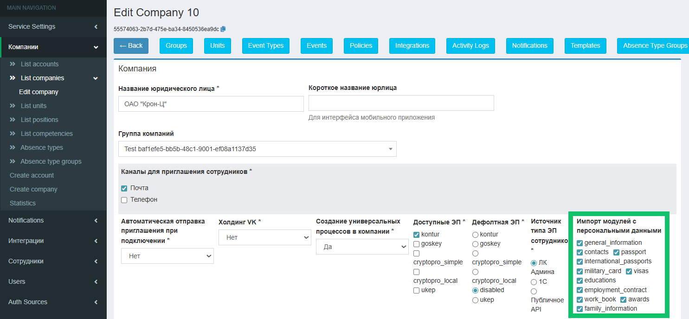

## **Персональные данные**
При отключении обмена для модуля персональных данных сотрудника данные будут удаляться из КЭДО.  Обязательные данные не будут удалены.

Если потребуется включить ранее отключенный модуль, то в раздел **Персональные данные** будут добавлены данные из карточки сотрудника в 1С.

Список обязательных данных и модулей, которые можно включить/отключить для обмена данными, описан в [статье](/ru/hr/employee/personal_data).  


Чтобы включить/отключить обмен данными, перейдите к настройкам компании в разделе **Компании → List companies → Edit company** и установите/уберите флажки в секции **Импортировать модули с персональными данными**.

Настройка доступна для пользователей с ролями ROLE_MANAGER, ROLE_SENIOR_MANAGER и ROLE_ADMIN.



## **Электронная подпись**
Добавили новые опциональные данные (идентификатор подписанта и название компании) для использования в штампе электронной подписи, в том числе номер и дату МЧД.


Все возможные данные, которые могут отображаться в штампах ПЭП и УКЭП:


Чтобы включить отображение данных МЧД в штампе электронной подписи, перейдите в раздел **Компании → List companies → Edit company** и включите настройки **Show attorney in stamp** и **Текст «по доверенности»**.


Чтобы включить новые данные для отображения в штампе электронной подписи, включите опции **Идентификатор подписанта** и **Название компании**.


## **Массовые действия с заявками**
1. Перенесли скачивание отчёта по изменениям в заявках в массовые действия со списком заявок. Если выбрана одна заявка из списка, то будет скачан один отчёт в pdf-формате, а если выбрано больше одной заявки — zip-архив с pdf-файлами.
1. По одной или нескольким заявкам можно скачать архив, в котором кроме документов из заявки, будут и файловые атрибуты (вложенные файлы).


## **Отмена заявки**
Добавили ограничение отмены заявки: только активный исполнитель этапа может отменить заявку, за исключением указанных групп, которым доступна отмена вне зависимости от этапа.

Пользователь может отменить заявку (доступна кнопка **Отменить заявку**) только в том случае, если он:

- является исполнителем текущего этапа заявки;
- имеет группу/роль, указанную в исключениях. В этом случае пользователи с такими ролями могут отменять заявки на любом этапе, независимо от того, являются ли они текущими исполнителями этапа или нет.

Если отмена заявки на определённых этапах полностью недоступна, то в этом случае ни один пользователь не может отменить заявку, даже если он исполнитель этапа или входит в список исключений.


Если в JSON бизнес-процесса для этапа указана настройка `"only_active_participant": true`, то система разрешит отменять заявку только в случае, когда пользователь является исполнителем текущего активного этапа.

В параметре `"only_active_exceptions"` перечисляются группы, для которых отмена заявки всегда доступна, независимо от того, на каком этапе находится заявка.

Если на этапе установлен параметр `"company_cancelable": false`, отмена заявки на этом этапе всегда запрещена вне зависимости от того, является ли пользователь исполнителем этапа или входит в список исключений.


<details>
<summary>Фрагмент JSON</summary>

```json
"name": "Бонус на удержание",
"group": "Бонус на удержание",
"options": {
    "cancel": {
        "only_active_participant": true,
        "only_active_exceptions": [
            "Отдел кадров"
        ]
    }
},
"participants": [
    {
        "role": "Отдел кадров",
        "group": "Отдел кадров"
    },
    {
        "role": "Руководитель отдела кадров",
        "group": "Руководитель отдела кадров"
    }
]
```

</details>

## **Этапы заявки**
В заявках с кастомными статусами можно задавать разные названия статуса до и после прохождения этапа заявки. Такие статусы позволяют понять, изменились ли состояния пройденных этапов или нет.

Кастомные статусы отображаются в подсказках при наведении курсора на этап.

Пример кастомного статуса для этапа **На утверждении**:

- **Первый статус (было):** *На утверждении*
- **Второй статус (стало):** *Утверждено*


Чтобы настроить кастомные статусы в бизнес-процессе, в JSON укажите следующие параметры на этапе бизнес-процесса:

- `"custom_state": [ { "name": "" } ]` — произвольное название статуса, отображаемое до прохождения этапа или на этапе;
- `"custom_state": [ { "completed_name": "" } ]` — произвольное название статуса, отображаемое после прохождения этапа.


<details>
<summary>Фрагмент JSON</summary>

```json
{
    "key": "step_2",
    "node_type": "middle",
    "state": {
        "name": "Проверка обращения"
    },
    "custom_state": [
        {
            "name": "На рассмотрении",
            "completed_name": "Рассмотрено"
        }
    ],
    "actions": [
        {
            "type": "accept",
            "roles": [
                "Отдел кадров"
            ]
        }
    ]
}
```

</details>

## **Атрибуты заявки**
Добавили возможность выводить значения, ключи или ключ-значения в выпадающем списке для атрибута с типом «справочник».

Пример вывода **значения** для справочника «Валюты»: *Российский рубль, Доллар США*.

Пример вывода **ключа**: *RUB, USD*.

Пример вывода **ключ-значения**: *Российский рубль (RUB), Доллар США (USD)* или *RUB — Российский рубль, USD — Доллар США*.


Чтобы настроить вывод атрибута «справочник» (`text_catalog`), в JSON бизнес-процесса укажите параметр `"display_format_value"` и формат вывода.

<details>
<summary>Фрагмент JSON</summary>

```json

            {
              "type": "text_catalog",
              "name": "Валюта",
              "options": {
                "catalog_name": "Валюта",
                "display_format_value": "{{ .Value }} ({{ .Key }})" // Value - вывод только значений справочника, Key - вывод только ключей справочника, Key_Value - вывод значений ключей и справочников, при этом для этого варианта доступна настройка формата вывода
              }
            }
```

</details>


## **Графики отпусков**
1\. Добавлен валидатор, который при переносе отпуска проверяет, что количество дней нового отпуска равно количеству дней переносимого. Таким образом, отпуск можно перенести только одним периодом с учётом предыдущего количества дней отпуска.


Чтобы настроить такую проверку для бизнес-процесса отпуска, в JSON укажите валидатор типа `"values_compare"` с количеством дней в первоначальном и новом периодах. 

<details>
<summary>Фрагмент JSON</summary>

```json
{
  "type": "values_compare",
  "attributes": [
      "Количество дней в первоначальном периоде",
      "Количество дней в новом периоде"
            ],
     "settings": {
              "operation": "eq"
                            }
}
```

</details>

2\. Доступно распределение остатков отпуска, некратных указанному в настройках валидатора числу.

Пример:

- Сотруднику доступно 23 дня отпуска.
- Установлен валидатор на кратность отпуска со значением 5.
- Сотрудник распределяет отпуск на два периода по 5 дней, на один период с 10 днями и на один период с оставшимися 3 днями.


## **Графики отсутствий** 
Чтобы исключить пересечения в планах на отпуск между сотрудником и его коллегами, в разделе **Мой календарь** в один календарь объединили графики отсутствий сотрудника и его коллег.

В разделах **Рабочее время** и **Мой календарь** каждое отсутствие имеет свой цвет в календаре в зависимости от группы отсутствия (кроме отсутствий коллег в разделе **Мой календарь**).


Чтобы включить видимость графиков отсутствий коллег по подразделению или всей компании, перейдите в административную панель в настройки компании и выберите в настройке **Уровень доступности графиков отсутствий коллег** один из вариантов: *По подразделению* или *Вся компания.* Для отключения видимости графиков выберите вариант *Не доступно.*


## **Графики работы**
В веб-сервис VK HR Tek из 1С будут передаваться графики работы сотрудников. Настройка будет доступна после выпуска новой версии расширения 1С 2025.08.00.


Для передачи графиков работы в КЭДО включите настройку **Import work schedules** в разделе **Компании → List companies → Edit company** административной панели.

Настройка доступна для пользователей с ролями MANAGER, SENIOR_MANAGER и ADMIN.


## **Кандидаты**
1. Вынесли модуль найма во внешний периметр. Новое архитектурное решение позволяет кандидатам работать с анкетой в модуле найма из внешней сети, при этом внутренняя сеть остается защищенной от прямого доступа из интернета.
1. Добавили просмотр файлов/документов кандидата с масштабированием.


## **Работа в административной панели**
1\. Обновлён интерфейс страницы настроек компании в разделе **Компании → List companies → Edit company**. На странице компании использованы русские названия настроек и структурированы настройки.


2\. В раздел **Компании → List companies → Edit company** добавили опции вызова плагина подписания КриптоПро ЭЦП Browser plug-in.

В поле **Крипто Про store.Open** выберите одно из значений:

- **capi** — передаются все сертификаты, расположенные и на рабочем компьютере, и на токене (например, на флешке).
- **cades** — передаются только те сертификаты, которые хранятся на токене (например, на флешке).

Настройка доступна для пользователей с ролями MANAGER, SENIOR_MANAGER и ADMIN.


3\. В настройках инсталляции реализовали получение ролей пользователя административной панели через OAuth2.

Пример. Аутентификация и авторизация пользователей в административной панели реализована через OAuth2 с обязательным использованием Keycloak (или аналога). На уровне Keycloak специалист разрабатывает матрицу соответствия ролей административной панели VK HR Tek и групп из Active Directory. При успешной авторизации возвращается токен, в котором будет указана роль, с которой нужно авторизовать пользователя в административной панели.

