## **Новости**

Выпущен новый модуль **Новости** — информационный сервис для публикации, управления и персонализированного распространения новостных материалов внутри компании.

В разделе **Управление новостями** для пользователя с ролью «Администратор модуля Портал» доступны следующие действия: 

1. Создание новости: 
- Публикация и отложенная публикация новостей.
- Создание черновиков.
- Указание видимости новости в разрезе организаций/подразделений.
- Добавление категорий/тегов к новостям.
- Управление комментированием и проставлением реакций.
- Указание признака «Важно».
2. Редактирование новости.
1. Удаление новости.

Возможности пользователя в разделе **Новости**:

1. Просмотр списка новостей и фильтрация новостей по категориям.
1. Просмотр новости.
1. Комментирование новости.
1. Проставление реакции на новость.

### **Создание новости в привязке к аккаунту**
Теперь сущность «Новость» всегда будет привязана к аккаунту компаний. Данная доработка нужна для привязки справочников «Категории» и «Теги» к корректному аккаунту. В этом же релизе выполнена задача, которая связывает теги и категории с конкретным аккаунтом. 

Это не значит, что у всех пользователей появляются права доступа к аккаунту. Выбранный аккаунт не равен области видимости новости, он настраивается отдельно и зависит от прав доступа конкретного автора.

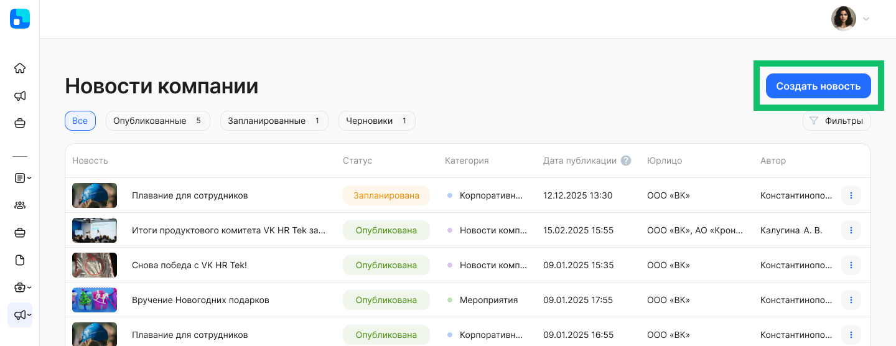

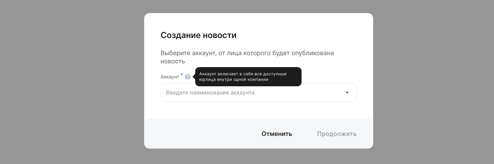

Пример 1. У пользователя есть права доступа к двум аккаунтам «Цветы и цветочки» и «Фрукты и ягоды». При создании новости будет предложено выбрать конкретный аккаунт, от которого пользователь хочет создать новость.

Пример 2. У пользователя есть права доступа только к одному юрлицу аккаунта «Цветы и цветочки». При создании новости этот аккаунт будет выбран автоматически. 

### **Управление категориями новостей**
Добавлен новый раздел **Категории**, в котором автор новостей и администратор портального модуля могут создавать, редактировать и удалять категории новости. Пользователи видят категории только по своим аккаунтам, на которые выданы права доступа.

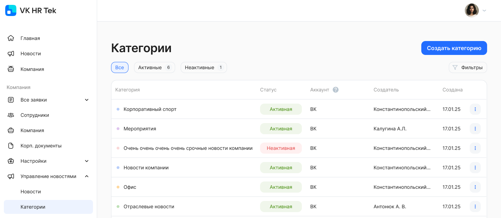

### **Упоминание пользователей в тексте**
Пользователи могут упомянуть других пользователей через @ в тексте новости или в комментарии к новости. Упоминание является ссылкой на профиль пользователя.

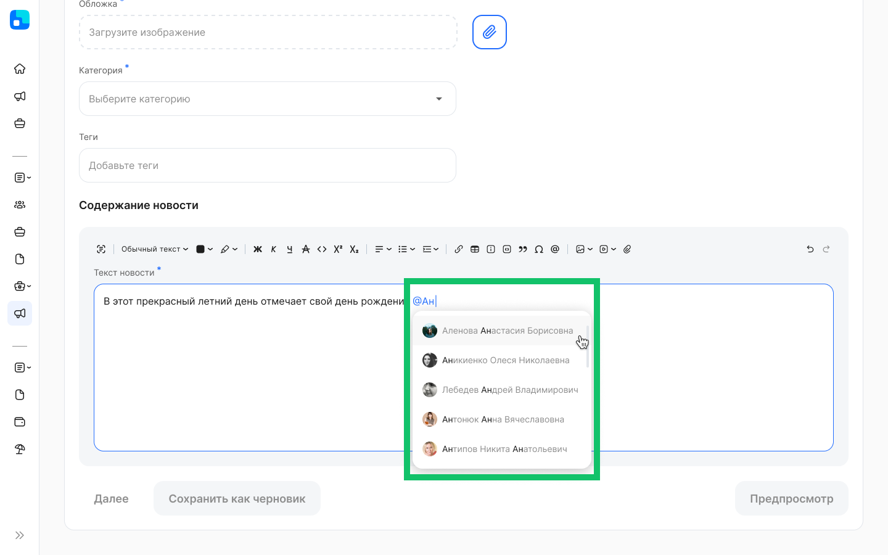

### **Уведомления об упоминании пользователя**
Пользователи могут получать уведомления в следующих ситуациях:

- Пользователя упомянули к тексте новости.
- Пользователя упомянули в тексте комментария.

Уведомления могут приходить на электронную почту пользователя и в раздел уведомлений веб-сервиса.

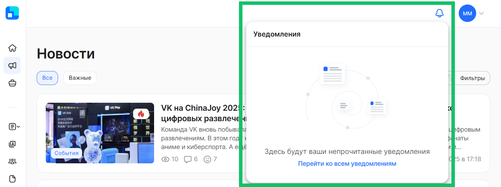

Чтобы получать такие уведомления, в разделе **Компании → List companies → Company notify settings** административной панели добавьте триггеры для кастомных уведомлений:

- **news\_mentions\_user** — упоминание в новости;
- **comment\_mentions\_user** — упоминание в комментарии.

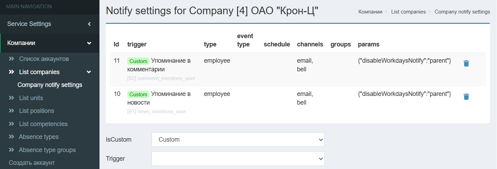

## **Ролевая модель**
Добавили управление доступом к разделу **Сотрудники** в ролевую модель. Теперь можно настроить доступ к этой странице только для определенных ролей представителей компании.

По умолчанию для блока **Компания — Сотрудники** в ролевой модели установлены значения:

- **Отдел кадров, Руководитель отдела кадров** — для представителей компании;
- **Нет доступа** — для руководителей.

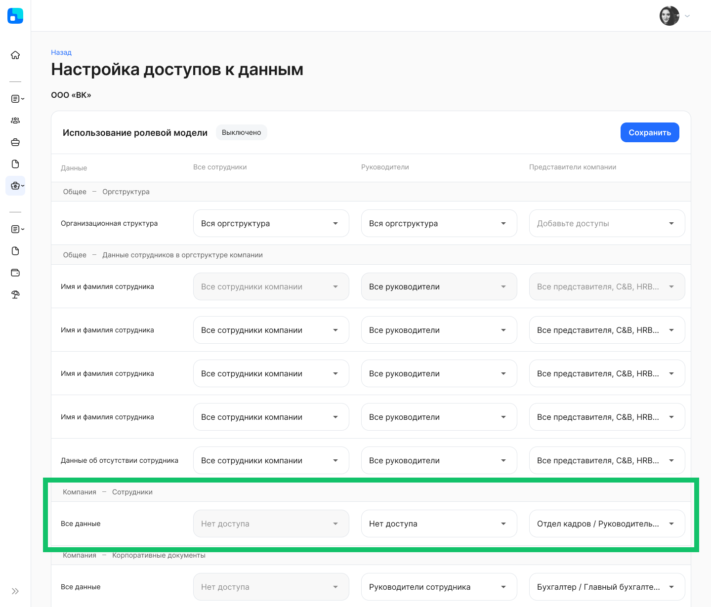

## **Настройки компании**
В раздел **Настройки компании** добавили новые настройки **Виджеты на главной странице** и **Боковая панель навигации**.

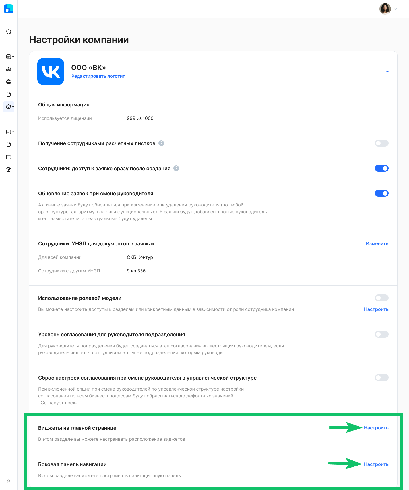

### **Виджеты на главной странице**
Администратор сможет включать/выключать, настраивать и перемещать виджеты, которые расположены на главной странице.

Для корректной работы пользователю должны быть добавлены роли «Администратор» или «Администратор главной страницы».

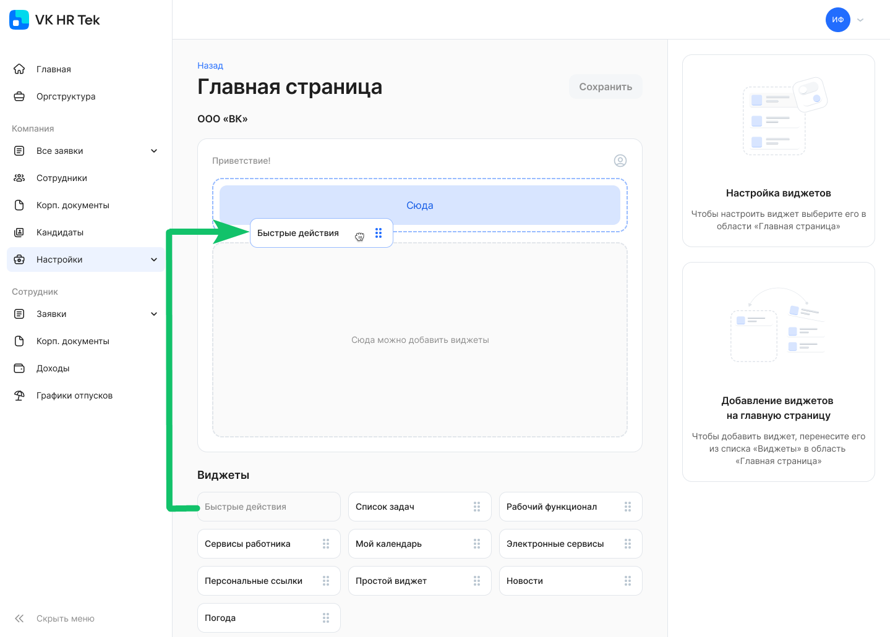

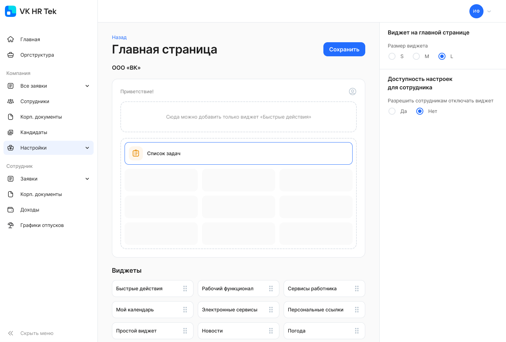


### **Боковая панель навигации**
Администратор сможет добавлять, удалять и перемещать пункты меню.

Для корректной работы пользователю должны быть добавлены роли «Администратор» или «Администратор главной страницы».

Перед работой проверьте, что все компании, где у вас есть роль «Администратор», привязаны к одному аккаунту.

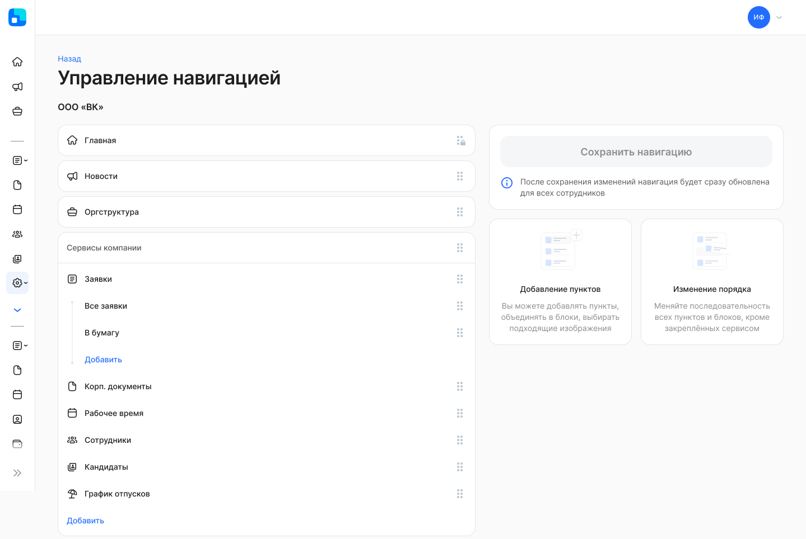

## **Бизнес-процессы**
### **Этапы заявки**
В разделе **Заявки** добавили кастомные названия этапов в фильтр и в выгрузку данных по списку заявок. Актуально для компаний, где используют [кастомные названия статусов](/ru/release_notes/saas/20250800Core#etapy_zayavki) в бизнес-процессах.


### **Срочные заявки**
В раздел **Заявки** добавили опцию **Срочные заявки в начале списка**.

Срочные заявки имеют специальное выделение и выводятся в начале списка. При этом внутри этой части списка они сортируются по возрастанию даты дедлайна: от ближайшей к более отдалённой.

Срочные заявки — это заявки, дедлайн которых наступит в течение количества часов, установленных по значению, указанному в настройках инсталляции (значению по умолчанию). Логика расчёта значения по умолчанию: оставшиеся часы до конца сегодняшнего дня суммируются с 9 часами следующего дня (с учётом таймзоны пользователя).

Пример расчёта значения по умолчанию:

- Сейчас 13:00 (15 июля) по таймзоне пользователя.
- Конец дня в 23:59 (15 июля), до конца сегодняшнего дня остаётся 10 часов 59 минут.
- Ночь до 09:00 (16 июля), 9 часов следующего дня.
- Значение по умолчанию равно 20 часов.


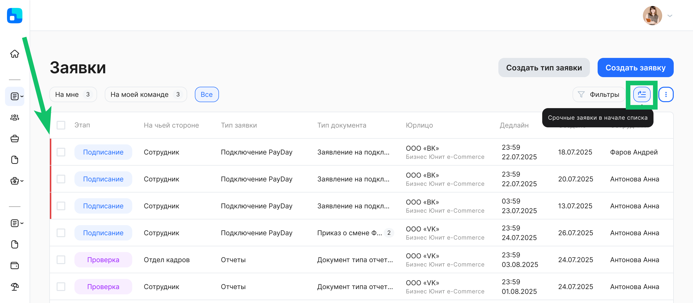

### **Сквозные номера заявок**
Добавили опцию проставлять заявкам идентификатор с автоинкрементным номером. Использование такого номера можно включить в рамках аккаунта и «собрать» недлинный номер из определенного набора переменных.

Например, сквозной номер удобно использовать, если какие-то детали заявки быстрее уточнить по телефону — такой номер можно продиктовать.


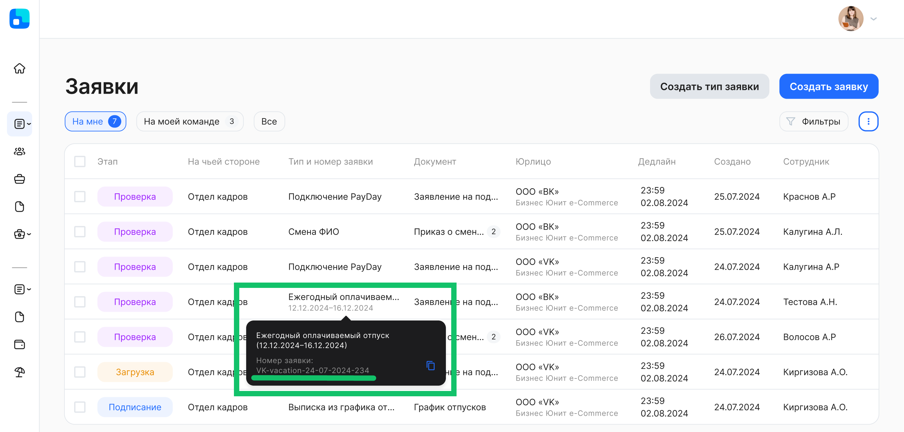

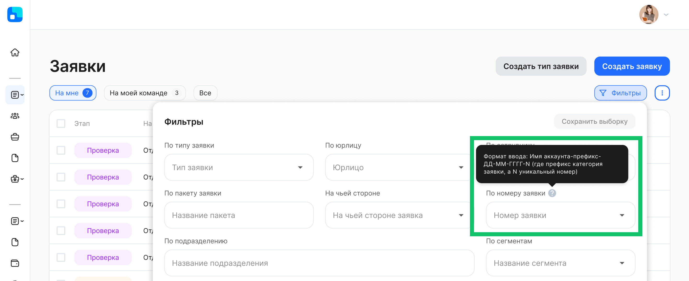

Для подключения опции **Использовать сквозные заявки** перейдите в административную панель, в раздел **Компании → Список аккаунтов → Редактирование аккаунта**.

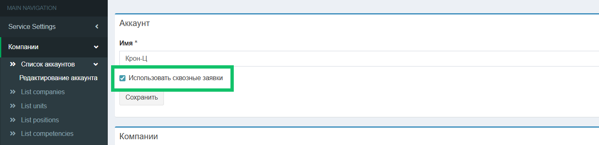

### **Атрибуты в заявках**
Добавлена новая опция для отображения атрибута в зависимости от значений, ранее выбранных в других атрибутах на этапе заявки.

Пример. Атрибут 1 всегда виден в заявке и представляет собой поле выбора с двумя значениями «Да» и «Нет». Каждый следующий зависимый атрибут (Атрибут 1.1 и Атрибут 1.1.1) отображается, только если в предыдущем выбрано значение «Да».


<details>
<summary>Фрагмент JSON</summary>

```json
{
    "type": "text",
    "name": "Атрибут 1.1.1",
    "options": {
        "show_when": {
            "conditions": [
                {
                    "attribute": "Атрибут 1",
                    "equal": [
                        "1"
                    ]
                },
                {
                    "attribute": "Атрибут 1.1",
                    "equal": [
                        "1"
                    ]
                }
            ]
        }
    }
}
```

</details>


### **Валидаторы в заявках** 
Добавлен валидатор, который позволяет пользователю вводить даты строго в рамках текущего года. Например, полезно для случаев, когда разрешено переносить отпуск только в рамках текущего года.


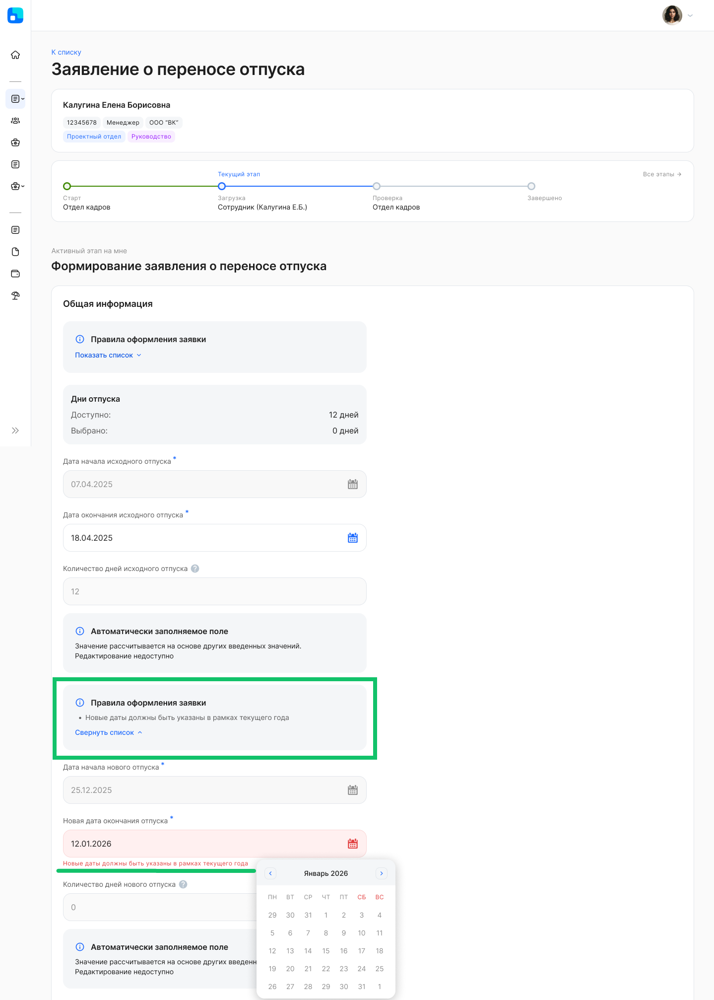

<details>
<summary>Фрагмент JSON</summary>

```json
{
  "type": "only_current_year",
  "attributes": [
    "Дата начала отпуска",
    "Дата окончания отпуска"
  ]
},
```

</details>

### **Скачивание документов по заявке**
В мобильную версию веб-сервиса добавили кнопки, чтобы можно было скачать и на телефон:
- Архив со всеми документами из заявки, включая оригиналы документов, sig и хml файлы;
- Отчёт об изменениях в заявке.

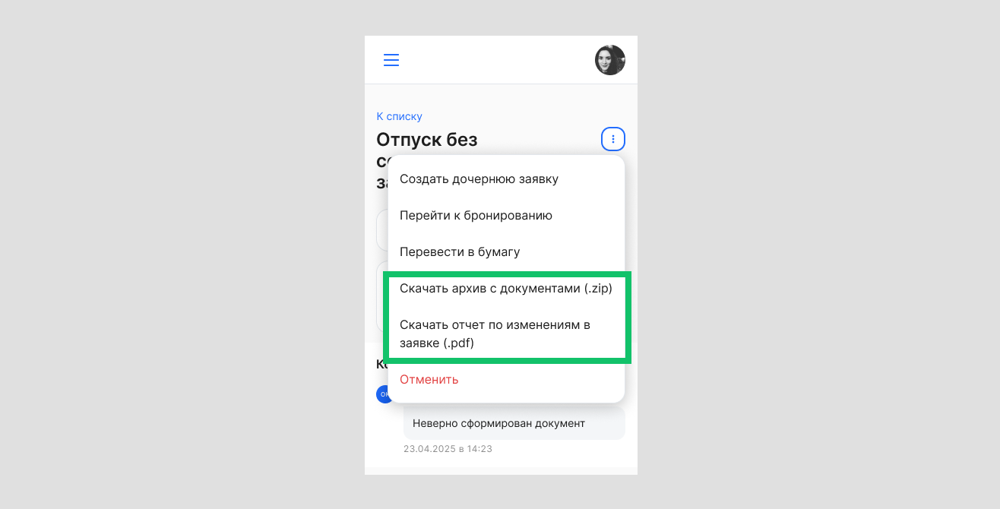

### **Предпросмотр документа**
Изменили дизайн снэк-бара на экране предпросмотра документа, сгенерированного по шаблону, чтобы синяя кнопка действия не перекрывалась окнами других приложений (в правом нижнем углу).

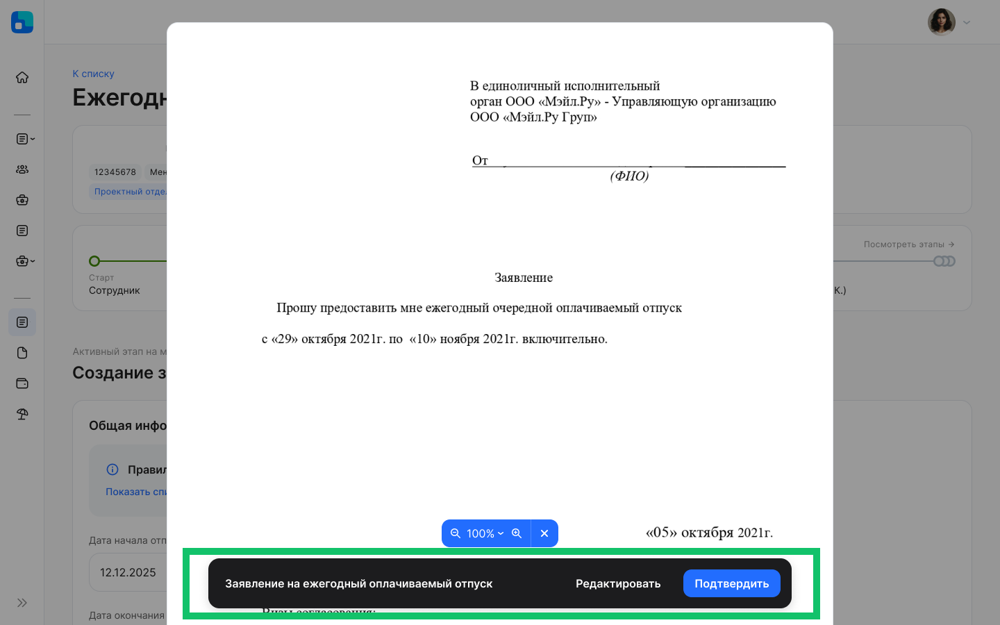


### **Дедлайны**
Вернули опцию дедлайна **Переход на следующий этап** для заявок.

## **Уведомления**

### **Отключение уведомлений в нерабочие дни**
Реализовали возможность отключать все уведомления в СМС и Telegram в нерабочие дни сотрудника: выходные, отпуска, праздники, в том числе региональные.


Отключение происходит на уровне инсталляции или компании. При необходимости для выбранных событий можно включить СМС и Telegram уведомления в нерабочие дни.

Чтобы настроить получение уведомлений на уровне компании, перейдите в раздел **Компании → List companies → Edit company** административной панели и активируйте настройку **Игнорировать СМС и telegram канал в нерабочие дни** с одним из вариантов: *Из общих настроек, Да, Нет*.

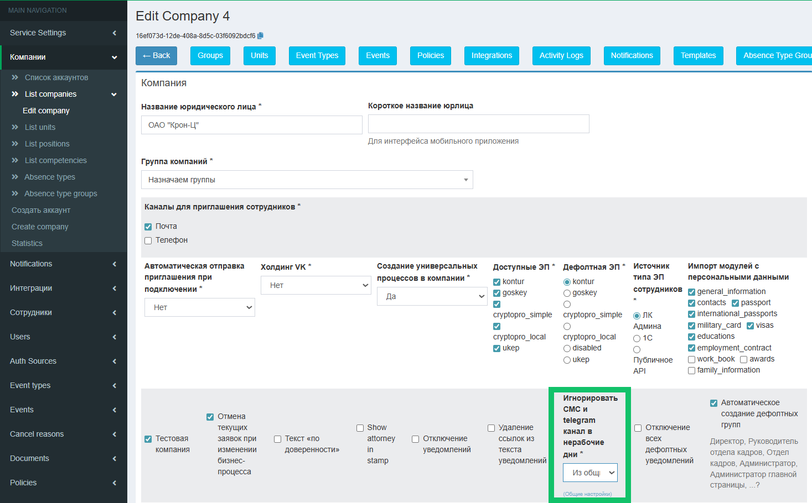

### **Уведомления, если сотрудники не ознакомились с ЛНА**
Реализовали уведомления для руководителя, ассистента подразделения и группы, если подчиненные сотрудники не ознакомились с ЛНА в течение N дней после публикации.

В уведомлении перечисляются сотрудники, которые не ознакомились с ЛНА. Для руководителя и ассистента перечислены только сотрудники прямого подчинения, для группы — все сотрудники компании.


Значение N настраивается в административной панели, в параметрах уведомления **Политика – нет аппрува** для руководителя, ассистента или группы.

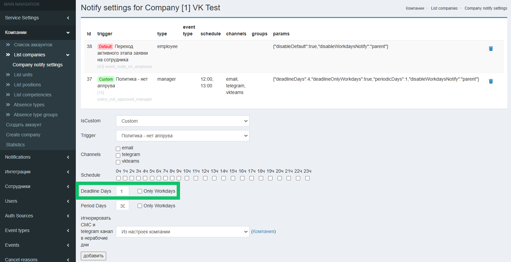

## **Корпоративные документы**
Исправили массовое распространение ЛНА при удалении подразделения и/или должности, указанных в параметрах опубликованного ЛНА.

## **Отсутствия и отпуска** 
1\. Добавлена настройка для округления накопленных дней отпуска у сотрудника. Настройка позволяет округлять дни математически, в пользу сотрудника или не округлять совсем.

На странице **Мой календарь**, в виджете **Дни отпуска** сотрудник может просмотреть доступное количество наколенных дней отпуска.


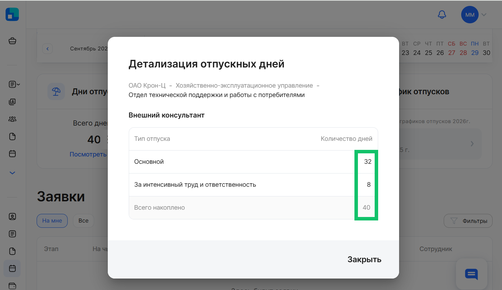

Чтобы настроить округление для компании, перейдите в раздел **Компании → List companies → Edit company** административной панели и активируйте настройку **Округление количества дней отпуска** с одним из вариантов: *Не округлять, Математически, В пользу сотрудника*.

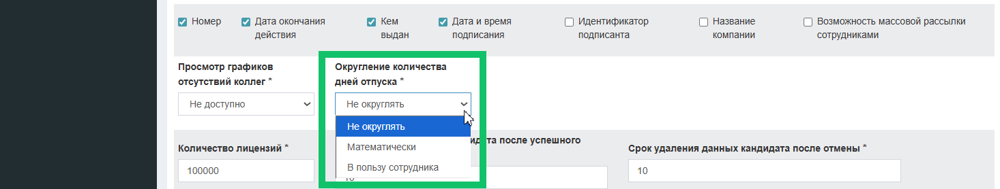

2\. Добавили возможность включать или отключать видимость виджета **Ближайшая задача** в разделе **Мой календарь** для всех пользователей компании. Чтобы отключить видимость виджета, в разделе **Настройки компании** Администратор КЭДО должен активировать переключатель настройки.

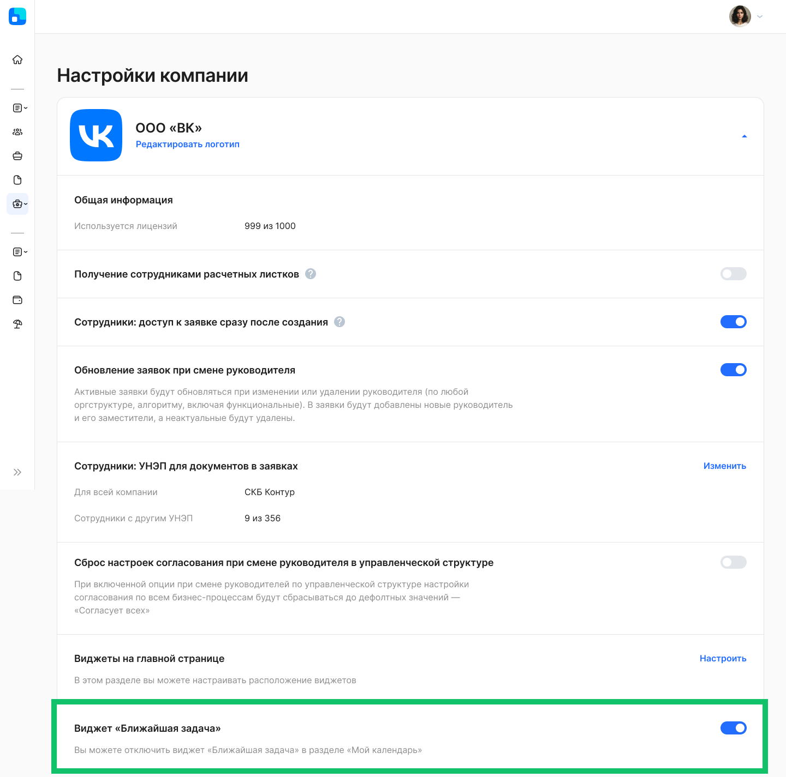

## **График отпусков** 
При планировании графика отпусков убрали обязательность настройки **Нельзя выбрать только выходные дни**, чтобы сотрудники, которые работают по сменному графику и для которых обычные выходные дни могут быть рабочими, смогли запланировать отпуск в выходные дни по производственному календарю.


