## **Портальные сервисы**
### **Новости**

#### **Добавлена возможность настраивать иконки для важных новостей**

В настройках инсталляции (на уровне конфигурационного файла) теперь можно выбрать одну иконку из предложенного набора для выделения важных новостей.

Иконка повышает заметность ключевых сообщений и позволяет визуально отделить критически важную информацию от рутинной.

<details>
<summary>Набор иконок</summary>

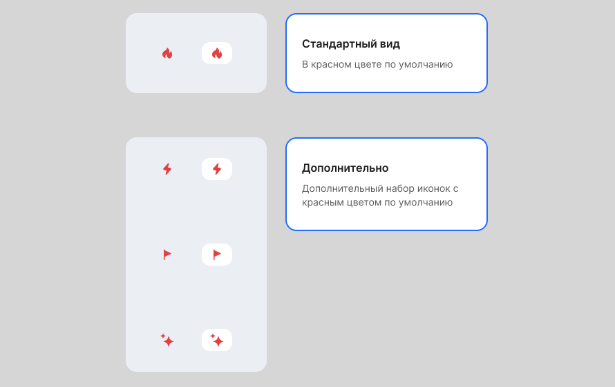

</details>

#### **Обновление управления правами доступа. Назначайте ответственных за новости гибко и безопасно**

Мы продолжаем развивать инструменты управления портальными сервисами. Теперь работа с новостями стала еще гибче и безопаснее за счет введения новых ролей и централизованного раздела для управления правами.

1\. Появились две специализированные роли:

- **Менеджер сервиса Новости** — этот пользователь отвечает за настройку доступа к новостям. Он может назначать других сотрудников авторами, не имея полных прав «Администратора модуля Портал».
- **Автор новостей** — сотрудник, который может создавать и публиковать новости. Идеально подходит для руководителей отделов, PR-менеджеров или HR-специалистов, ответственных за информирование коллектива.

2\. Реализован новый раздел **Администраторы**.

Это новый раздел в настройках портальных сервисов, где происходит управление правами доступа. Сейчас в нем настраивается доступ к сервису «Новости», а в будущем здесь будет управление правами и для других сервисов портала.

Доступ к разделу имеют пользователи с ролями «Администратор модуля Портал» и «Менеджер сервиса Новости».

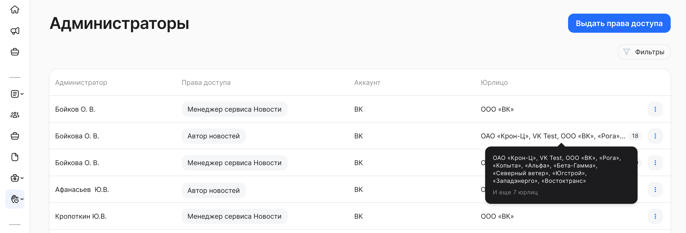

Какие преимущества вы получаете?

- Эффективное делегирование. Передайте задачи по управлению новостями ответственному сотруднику, не делая его полноправным администратором.
- Повышение безопасности. Минимизируйте риски, предоставляя сотрудникам только те права, которые им действительно необходимы для работы.
- Гибкость и контроль. Четко разграничьте, кто может управлять правами, а кто — только публиковать контент.

#### **Внедрена ролевая модель для управления комментариями к новостям**

Реализована ролевая модель для управления комментариями в сервисе «Новости».

Право на редактирование комментариев предоставлено двум ролям:

- Администратор модуля Портал.
- Автор новости.

Какие преимущества вы получаете?

- Поддержание порядка и качества дискуссий. Ответственные лица могут оперативно модерировать контент, исправлять ошибки или удалять некорректные сообщения.
- Защита репутации. Автор новости и администратор могут мгновенно реагировать на нарушение правил общения в комментариях.
- Эскалация ответственности. Автор, как инициатор новости, получает инструменты для полного контроля над созданной им дискуссией.

#### **Имена авторов новостей и комментариев стали ссылками на персональные данные сотрудника (профиль)**

Элементы «Автор новости» и «Автор комментария» в интерфейсе теперь являются кликабельными ссылками. Ссылки ведут на страницу с персональными данными пользователя (профиль).

Какие преимущества вы получаете?

- Укрепление корпоративных связей. Позволяет легко находить и узнавать больше о коллегах, что способствует формированию более сплоченной команды.
- Повышение доверия к контенту. Пользователи могут сразу оценить компетенцию автора, ознакомившись с его должностью и другими данными.
- Стимулирование вовлеченности. Упрощает установление неформальных контактов и повышает личную ответственность авторов за публикуемый контент.

### **Поиск**
#### **Запуск быстрого поиска по новостям и комментариям (первый этап развития поисковой системы)**

Реализован базовый механизм поиска. В интерфейс добавлена поисковая строка, позволяющая производить быстрый поиск по новостям и их комментариям. Система мгновенно выдает от 3 до 9 наиболее релевантных результатов.

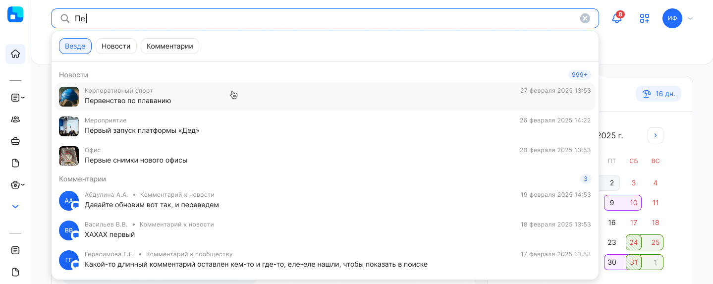

Какие преимущества вы получаете?

- Скорость доступа к информации. Сокращает время на поиск нужной новости или обсуждения с минут до секунд.
- Повышение эффективности работы. Сотрудники быстро находят интересующие новости, обсуждения, не тратя время на ручной просмотр. Поиск делает всю информацию, накопленную в новостях и комментариях, легко находимой.

В следующих релизах запланирован запуск расширенного (полноценного) поиска с возможностью просмотра всех результатов по запросу.

## **Настройки интерфейса**
### **Тестовые компании — в конце списка**
Для удобства пользователей, работающих с тестовыми компаниями — теперь во всех интерфейсах, где есть выбор компании, тестовые компании будут в конце списка.

### **Меню навигации**
В меню навигации появился новый блок **Мои ссылки** — место, где сотрудники могут сохранять персональные ссылки на нужные им сервисы и ресурсы.
Рекомендуем включить эту опцию, если в вашей компании сотрудники из разных департаментов используют разные системы: тогда каждый сможет собрать собственную подборку ссылок прямо в меню.

<details>
<summary>Настройка блока Администратором</summary>

1\. Откройте раздел **Настройки КЭДО → Настройки** **компании**, настройку **Боковая панель навигации**. 

2\. Перейдите к блоку **Мои ссылки** и активируйте переключатель, чтобы блок стал доступен в меню навигации для сотрудников компании.

3\. Название блока можно изменить: для этого нажмите на кнопку редактирования рядом с переключателем. 

4\. После внесения всех изменений на странице нажмите кнопку **Сохранить навигацию**. 

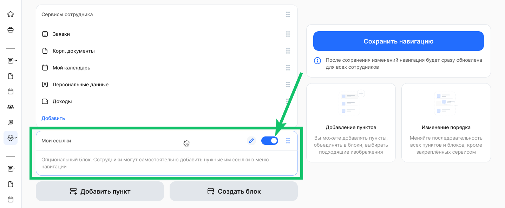

</details>

<details>
<summary>Настройка блока сотрудником</summary>

1\. Откройте блок **Мои ссылки →** **Настроить** **блок**. 

2\. Нажмите кнопку **Добавить**. 

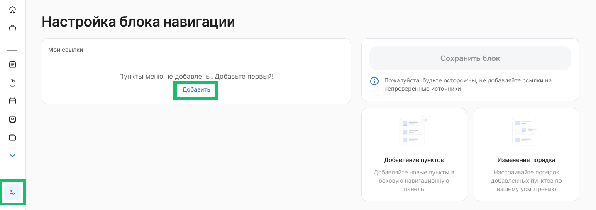

3\. Заполните название и ссылку, выберите изображение для нового пункта меню.

4\. Нажмите кнопку **Добавить**.

5\. После добавления нескольких пунктов меню вы можете изменить порядок их расположения, перенеся пункт с одного места на другое. 

6\. После добавления необходимых пунктов сохраните блок.

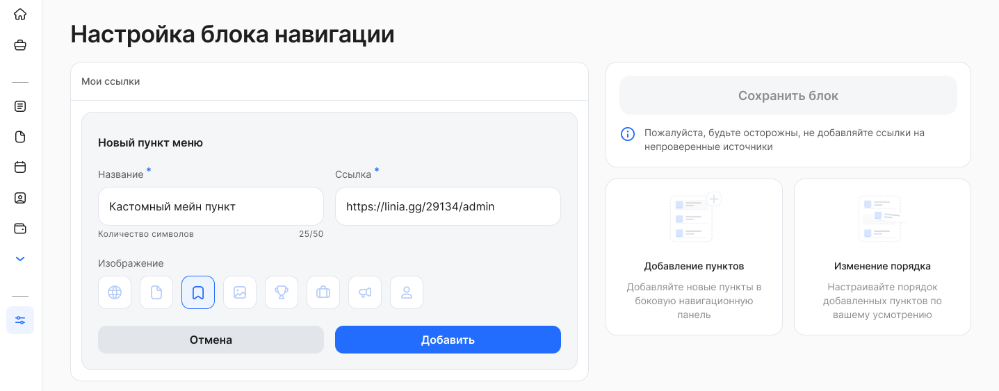

</details>

## **Работа с часовыми поясами**
Теперь можно указать часовой пояс, отличный от стандартного UTC+3, используемого по умолчанию во всём сервисе. Также добавлена возможность задавать часовые пояса для отдельных групп сотрудников.

Настройка часовых поясов в соответствии с местом работы помогает избежать ошибок в сроках и упрощает контроль. Часовые пояса, казанные для компании или отдельных сотрудников автоматически учитываются в расчетах и процессах, которые связаны с временем.

<details>
<summary>Подробнее об использовании часовых поясов</summary>

**Расчёт сроков выполнения действий с учётом часовых поясов**

Если срок выполнения действия в заявке рассчитывается от определённой даты, теперь он определяется с учётом часового пояса сотрудника.

**Пример**:

Часовой пояс компании — UTC+3 (Москва), сотрудника — UTC+7 (Красноярск).
Дата начала отпуска, указанная сотрудником, — 06.06.2025 (UTC+7).
Срок подписания приказа на отпуск — за 3 рабочих дня до начала отпуска.

В этом случае:

- Сотрудник в Красноярске должен подписать приказ до 03.06.2025 23:59:59 (UTC+7).
- Руководитель отдела кадров в Москве — до 03.06.2025 19:59:59 (UTC+3).

Таким образом, все сроки автоматически рассчитываются в соответствии с местным временем участников процесса.

**Расчет допустимых дат в заявках**

Доступные даты будут рассчитываются с учётом часовых поясов сотрудников.

**Пример**:

Два сотрудника одновременно стартовали заявки на отпуск — в 17:30 UTC+3. В бизнес-процессе настроено условие, что подать заявку необходимо минимум за 3 дня до даты начала отпуска.

- Для сотрудника с часовым поясом UTC+10 это время соответствует 00:30 15.01.2026, поэтому минимальная доступная дата будет 17.01.2025.
- Для сотрудника с часовым поясом UTC+2 — 16:30 14.01.2026, минимальная дата — 16.01.2026.

Таким образом, расчёты выполняются корректно для каждой временной зоны и учитывают местное время сотрудников.

**Сохранение дат в заявках с учётом часового пояса сотрудника**

Теперь выбранные в заявке даты сохраняются с учётом часового пояса сотрудника. Это важно для компаний, где сотрудники работают в разных регионах.

В определённое время дня текущая дата для сотрудника во Владивостоке может отличаться от даты сотрудника в Москве — система корректно учитывает такие различия при сохранении и обработке заявок.

**Фильтрация листингов заявок**

Запросы, связанные с временем, теперь рассчитываются с учётом часового пояса пользователя, который выполняет действие в сервисе. Это обеспечивает корректное отображение данных для сотрудников из разных регионов.

**Пример:**

Заявка сотрудника из Перми (UTC+5) имеет дедлайн текущего этапа 00:30 23 мая 2025 (UTC+5).
В Москве (UTC+3) это время соответствует 22:30 22 мая 2025 (UTC+3).

При фильтрации списка заявок по дате дедлайна:

- Сотрудник в Перми (UTC+5) увидит заявку в выборке заявок с дедлайном 23 мая.
- Сотрудник отдела кадров в Москве (UTC+3) — в выборке с дедлайном 22 мая.

Такая логика позволяет учитывать локальное время и формировать точные выборки данных для каждого пользователя.

**Отправка уведомлений**

Уведомления, отправляемые по расписанию, включая ежедневные рассылки в 10:00, теперь учитывают часовой пояс сотрудников, руководителей и представителей компании. Это гарантирует, что уведомления приходят в рабочее время каждого пользователя.

Для уведомлений, которые отправляются по факту события в заявке, часовой пояс используется при определении «окна тишины» — чтобы сообщения не приходили ночью.

**Пример:**

Уведомление по расписанию должно быть отправлено в 10:00.

- Руководителю 1 (UTC+10) уведомление будет отправлено в 10:00 02.06.2025 (UTC+10).
- Руководителю 2 (UTC+3) — в 10:00 02.06.2025 (UTC+3).

Таким образом, время отправки уведомлений автоматически подстраивается под локальное время получателя.

**Блокировка сервиса при увольнении сотрудника**

Сервис остаётся доступным сотруднику до конца суток даты его увольнения — в соответствии с часовым поясом, указанным для этого сотрудника.
После 00:00 по его местному времени доступ к сервису будет заблокирован.

</details>

<details>
<summary>Настройка часовых поясов Администратором</summary>

1\. Откройте раздел **Настройки КЭДО → Настройки** **компании**, настройку **Часовой пояс**. 

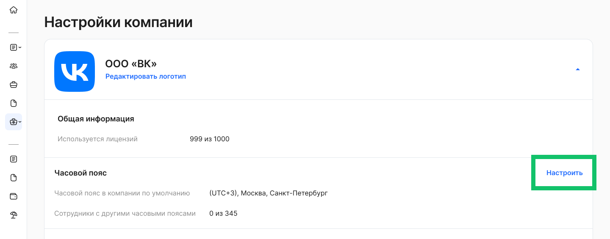

2\. По умолчанию в компании установлен часовой пояс **(UTC+3), Москва, Санкт-Петербург**. Если требуется изменить часовой пояс в компании, нажмите кнопку **Изменить**.

3\. Если часовой пояс у отдельных сотрудников отличается от часового пояса в компании, то добавьте исключение и выберите другой часовой пояс для сотрудника.  

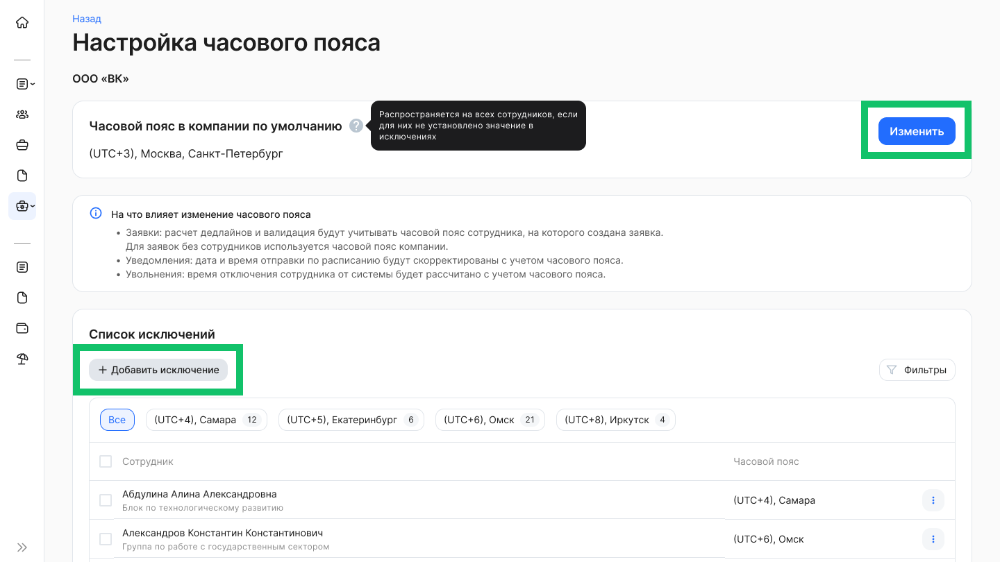

</details>

## **Доступ к данным и заявкам сотрудников**
Новая опция для [работы с профилями доступа](/ru/admin_actions/access_profiles/info) — профили можно создать на основе подразделений организационной структуры (управленческой или юридической).

Профили доступа позволяют ограничить доступ специалистов со стороны компании к заявкам и данным сотрудников. Функционал актуален для компаний, где в рамках одного бизнес-процесса несколько специалистов работают с разными группами сотрудников. Разделение доступов в таком случае не только решает вопросы безопасного доступа к данным, но и добавляет удобство — специалист видит только тех сотрудников, с заявками которых он должен работать.

<details>
<summary>Настройка профилей доступа Администратором</summary>

1\. Откройте раздел **Настройки КЭДО → Настройки** **компании**, настройку **Профили доступа**. 


2\. Выберите и сохраните настройки, подходящие для вашей компании.  


</details>

## **Заместители сотрудников**
В разделе **Настройки КЭДО → Заместители сотрудников** и в **Профиле** руководителя запрещено выбирать сотрудника в качестве временного заместителя, если этот сотрудник уже является постоянным заместителем на том же типе заявки. И наоборот.

<details>
<summary>Посмотреть интерфейс</summary>

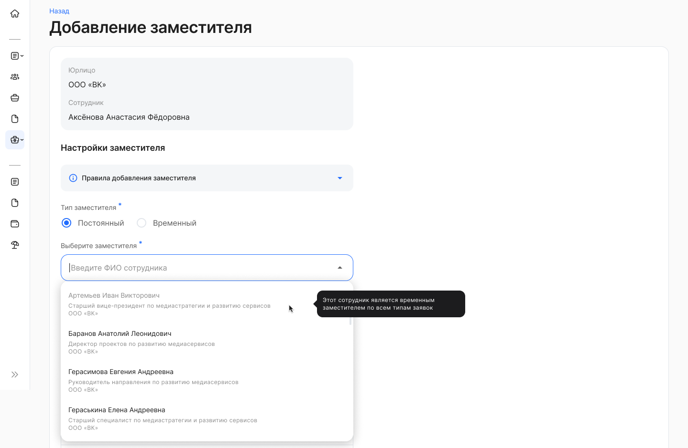

</details>

## **Работа с заявками**

### **Скрытие ФИО специалистов со стороны компании**
В настройках бизнес-процесса появилась новая опция — можно скрыть ФИО специалистов со стороны компании.

При включении этой настройки:

- ФИО не будет отображаться в данных о выполненных этапах заявки;
- при возврате заявки на доработку в комментарии автора будет указана только его **роль**, без указания имени.

Функция полезна, если требуется ограничить персональные данные специалистов в процессе согласования.

<details>
<summary>Посмотреть интерфейс</summary>

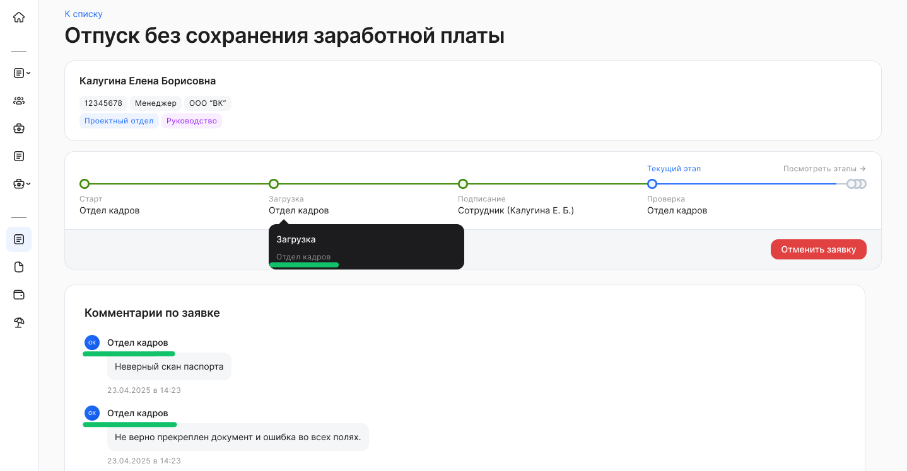

</details>

<details>
<summary>Настройка бизнес-процесса. Пример и фрагмент JSON</summary>

[Обезличивание роли в рамках БП.json](./assets/anonymous.json "download")

```json
"name": "Бонус на удержание",
"group": "Бонус на удержание",
"options": {
    "anonymous": {
        "all_roles": false,
        "roles": [
            "Отдел кадров"
        ]
    }
},
"participants": [
    {
        "role": "Отдел кадров",
        "group": "Отдел кадров"
    },
    {
        "role": "Руководитель отдела кадров",
        "group": "Руководитель отдела кадров"
    }
]
```

</details>

### **Атрибуты в заявках**
1\. Добавлен новый тип атрибута — **дата+время**. При его использовании в заявке отображаются два связанных поля: одно для выбора даты и второе — для указания времени.
Если пользователь заполняет дату, то поле времени становится обязательным для заполнения. Новый тип атрибута удобен для процессов, где важно фиксировать не только день, но и точное время события или действия.


<details>
<summary>Настройка бизнес-процесса. Фрагмент JSON</summary>

**Атрибут datetime в JSON**:

```json
"attributes":[
{ "type": "datetime",
   "name": "Дата и время отправления",
   "required": true }
],
```

**Атрибут datetime в placeholders**:

```json
"template"": {
"placeholders": [

      { "key": "DateFrom",
         "attribute"": "Дата и время отправления"  }.
  ] }
```

</details>

2\. В атрибутах, где значения выбираются из справочников, теперь можно использовать **справочники с иерархией**. Это удобно, когда значения имеют многоуровневую структуру. Такая структура помогает упростить навигацию и сделать выбор значений более наглядным. Кроме того, можно настроить обращение из атрибута напрямую к оргструктуре компании, чтобы участники процесса могли выбирать нужное подразделение из иерархического списка.


<details>
<summary>Настройка бизнес-процесса. Фрагмент JSON</summary>


```json

            {
              "type": "text_catalog",
              "name": "Цели командировки",
              "options": {
                "catalog_name": "Цели командировки",
                "select_leaf_only": "True" // True - выбор значений последнего уровня в цепочке иерархии, False - выбор любого элемента справочника, независимо от уровня иерархии,
"placeholder_display_hierarchy": "True" // True - вывод в шаблоне всей иерархии выбранного значения в атрибуте, False - вывод в шаблоне только значения выбранного атрибута (только должности или только одного подразделения)
              }
            }
          ],
          "template": {
            "placeholders": [
              {
                "key": "Goal",
                "attribute": "Цели командировки"
              }
```

</details>

### **Список атрибутов для заявок массовой рассылки**
Мы расширили список атрибутов, которые можно добавить в заявку для массовой рассылки. 

Доступные типы атрибутов:

- дата;
- текст;
- выбор из заданных вариантов (без зависимостей);
- файлы — с возможностью одиночного или множественного добавления.

Расширение списка позволяет гибче настраивать шаблоны заявок и собирать больше нужной информации в заявках.

<details>
<summary>Настройка бизнес-процесса. Пример и фрагмент JSON</summary>

[Массовая рассылка с несколькими атрибутами и документом.json](./assets/mass_mailing.json "download")

```json
    {
      "state": {
        "name": "Загрузка документа"
      },
      "node_type": "middle",
      "actions": [
        {
          "roles": [
            "Отдел кадров"
          ],
          "attributes": [
            {
              "type": "choice",
              "name": "Адрес по прописке совпадает с адресом проживания",
              "required": true,
              "options": {
                "choices": [
                  {
                    "label": "Да, совпадает",
                    "value": "1"
                  },
                  {
                    "label": "Нет, не совпадает",
                    "value": "2"
                  }
                ]
              }
            },
            {
              "type": "textarea",
              "name": "Комментарий",
              "required": true
            }
          ],
          "type": "upload",
          "document_type": "Документ"
        }
      ]
    },
```

</details>

### **Работа с документами**
В шаблоны документов для подписания теперь можно добавлять названия подразделений и должностей сотрудников и руководителей в разных падежах.

Это упрощает подготовку шаблонов с персонализированными данными и позволяет формировать корректные формулировки в документах.

<details>
<summary>Настройка шаблона</summary>

Чтобы просмотреть новые поля для шаблона документа:

1\. Перейдите в раздел **Настройки КЭДО → Шаблоны документов**.

2\. Раскройте выбранный шаблон и нажмите кнопку **Изменить**.

3\. Раскройте **Список возможных полей для шаблона**. 

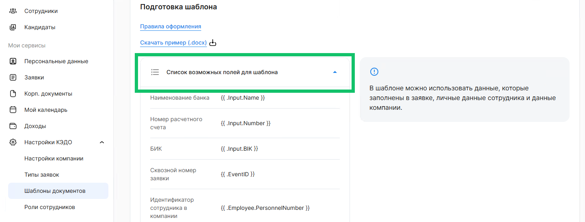

</details>

## **Модуль найма**
### **Доступность анкеты кандидата на этапе сохранения данных в 1C**
Теперь анкета кандидата доступна для просмотра и скачивания вложенных документов на этапе сохранения данных по кандидату в 1С. 
Ранее анкета на этом этапе становилась недоступной для рекрутера.


### **Кроме того**
Убрали возможность для кандидата удалять в анкете файлы, вложенные рекрутером. До изменений кандидат мог удалить вложения, и это блокировало дальнейшее заполнение анкеты.

Работа с вложениями при заполнении анкеты кандидатом не изменилась: кандидат может прикладывать файлы к анкете, удалять или изменять приложенные ранее файлы.

## **Корпоративные документы**
### **Пояснительные документы при публикации ЛНА**
Теперь при публикации ЛНА кроме основных документов на ознакомление можно приложить дополнительные поясняющие материалы, пояснения, примеры и т.п., которые помогут сотруднику понять смысл основного документа и не требуют подписания при ознакомлении. 

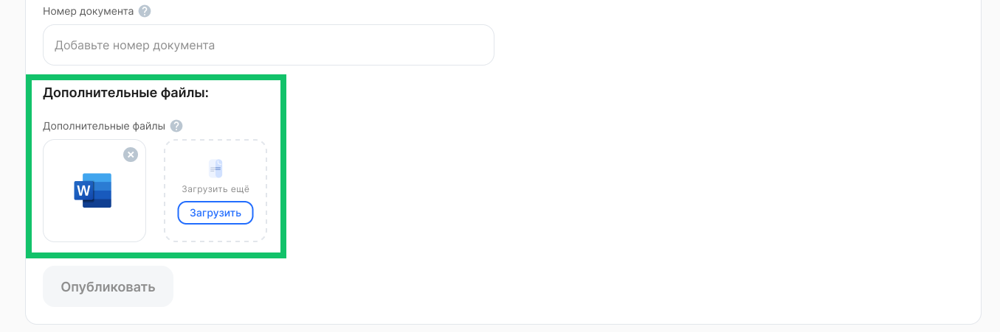


Пояснительные материалы можно добавить или изменить для уже опубликованного ЛНА в окне настроек документа.

Для сотрудника реализовали возможность скачать такие пояснительные документы при просмотре ЛНА.

### **Дополнительные фильтры**
Расширили список фильтров в разделе **Корпоративные документы** для поиска нужных ЛНА. Добавили фильтры:

- по названию документа;
- по статусу версии документа *Прошлая/Актуальная/Будущая* (учитывается статус последней опубликованной версии документа);
- по периоду действия версии документа;
- по дате подписания приказа, на основании которого создан ЛНА.

При фильтрации по юрлицу добавили возможность выбрать несколько значений.
При фильтрации по подразделению добавили возможность исключить ЛНА, опубликованные на всю компанию.

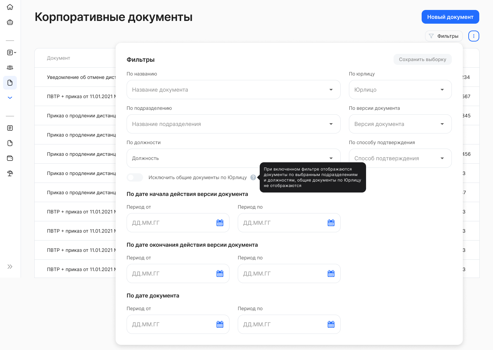

### **Архив листов ознакомления по сотруднику**
Реализовали возможность выгрузить архив всех листов ознакомлений по сотруднику компании, в том числе и уволенному. Архив содержит все ЛНА, подписанные сотрудником, листы ознакомления по ним и файлы подписи sig, если ознакомление было подтверждено УНЭП. 
Для выгрузки архива необходимо перейти в раздел **Сотрудники** и в строке сотрудника нажать кнопку **Скачать отчет по ЛНА**.

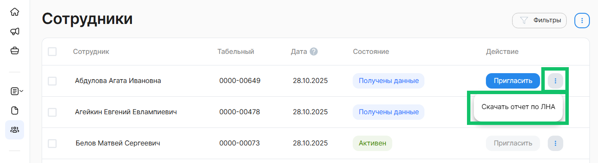

### **Кроме того**
1\. Исправили сброс фильтров при возврате со страницы просмотра ЛНА в раздел **Корпоративные документы**. Теперь при переходе в раздел **Корпоративные документы** со страницы просмотра ЛНА по кнопке **К списку** ранее установленные фильтры сохраняются.

2\. Исправили ошибку подгрузки списка ЛНА в разделе **Корпоративные документы**.

## **Отсутствия и график отпусков**
### **Отображение согласованных отсутствий в поле для выбора даты**
Теперь в момент выбора периода для нового отсутствия в поле выбора даты отображаются все ранее согласованные отсутствия из 1C, если атрибут связан с отсутствием. Это позволяет пользователю удобно ориентироваться на уже запланированные отпуска, минимизируя риск выбора пересекающихся дат.


### **Новые поля в отчёте по статусам планирования графика отпусков**
В отчёте по статусам планирования графика отпусков, выгружаемом в формат Excel, добавлены следующие поля:

- Табельный номер сотрудника;
- Дата окончания отпуска;
- Дедлайн планирования графика.

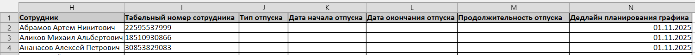


Эти изменения позволяют более удобно отслеживать статус планирования отпусков по каждому сотруднику, а также упрощают анализ данных в отчётах.

### **Ассистент подразделения в планировании графика отпусков**
В процесс планирования графика отпусков добавлена новая роль — Ассистент подразделения. Теперь график отпусков на этапе согласования попадает к пользователю с ролью «Ассистент подразделения», который может:

- просматривать графики отпусков сотрудников, в которых он участвует как согласующий;
- согласовывать графики как по одному, так и массово;
- возвращать графики на доработку сотруднику с указанием причины.

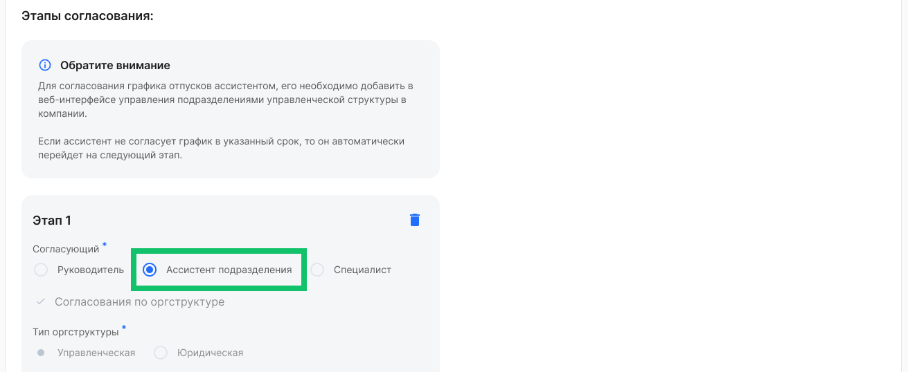

Чтобы ассистент мог согласовывать график отпусков, его необходимо добавить в подразделение управленческой структуры в разделе **Компания**. 

Все функции ассистента подразделения дублируют возможности руководителя на соответствующем этапе согласования.

Для роли «Ассистент подразделения» реализованы новые уведомления, которые информируют о переходе активного этапа согласования на данный этап. Уведомления могут быть как по умолчанию (дефолтными), так и настраиваемыми (кастомизированными), по аналогии с уведомлениями руководителю.
Пример уведомления: «Переход активного этапа на ассистента (график отпусков)».

Роль ассистента подразделения повышает гибкость процесса согласования графиков отпусков, делая его более эффективным. Ассистенты могут выполнять те же функции, что и руководители, но в рамках их полномочий. 
### **Исправления в разделе «Рабочее время»**
Исправлены следующие проблемы в разделе **Рабочее время**:

1. Ошибка раскрытия списка сотрудников: при нажатии на кнопку **Показать все N** поле **Заявки** исчезало, и полный список сотрудников не раскрывался. Эта ошибка была исправлена, теперь список сотрудников всегда корректно раскрывается.
1. Ошибка при переключении между компаниями: при переключении на другую компанию и возврате обратно, список сотрудников отображался полностью, но поле **Заявки** оставалось неактивным. Теперь это поле снова активируется при переключении между компаниями, и функционал работает корректно.