## **Главная страница / UI**

### **Поиск по коллегам**

Появилась возможность включить поиск по сотрудникам: при включении опции в «шапке» сайта отображается поисковая строка для поиска коллег. Функция доступна только при включённой [ролевой модели](#rolevaya_model) в компании/аккаунте.

В настройках ролевой модели Администратор указывает доступы к персональным данным сотрудников (в блоке **Персональные данные сотрудников: просмотр в списках**) для пользователей сервиса. Эти доступы влияют на то, какая информация будет выведена в результатах поиска.  

<details>
<summary>Посмотреть интерфейс поиска</summary>

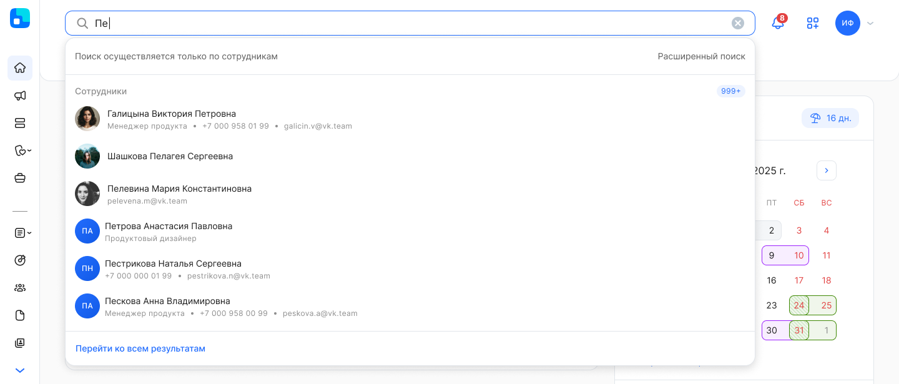

</details>

<details>
<summary>Посмотреть интерфейс настройки</summary> 

Доступно для пользователей с ролью «Администратор».  

Включение поиска для компании. Путь: **Настройки → Настройки общие → Настройки компании → Поиск по сотрудникам**.

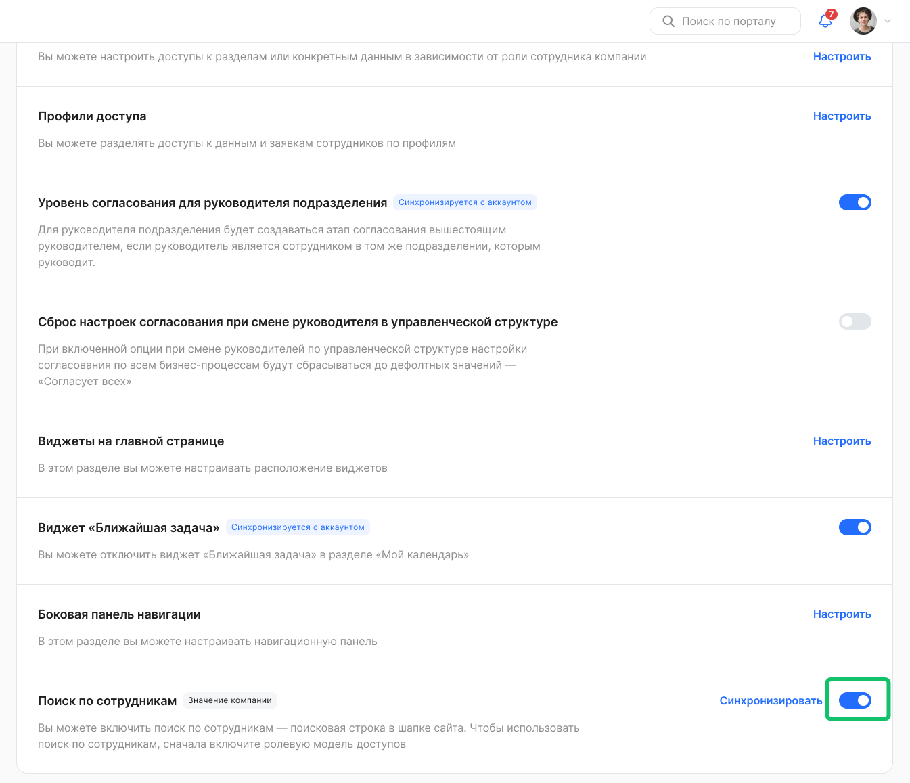

Включение поиска для аккаунта. Путь: **Настройки → Настройки общие → Настройки аккаунта → Поиск по сотрудникам**.  

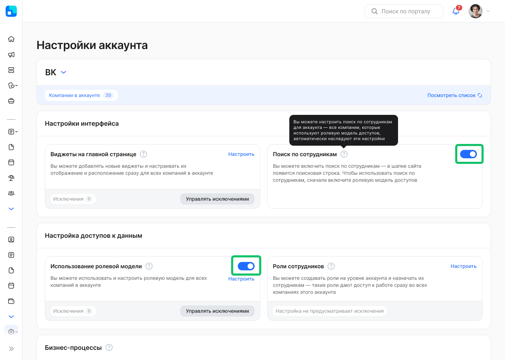

</details>
  
<details>
<summary>Настройка в административной панели</summary> 
 
Для пользователей с ролью ROLE_ADMIN в административной панели.  

1. Для компании. Путь: **Компании → List companies → Edit company →** включение настройки **Поиск по сотрудникам**. 

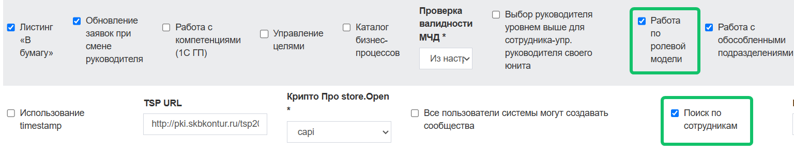

2. Для аккаунта. Путь: **Компании → Список аккаунтов → Редактирование аккаунта** **→** включение настройки **Поиск по сотрудникам**.  

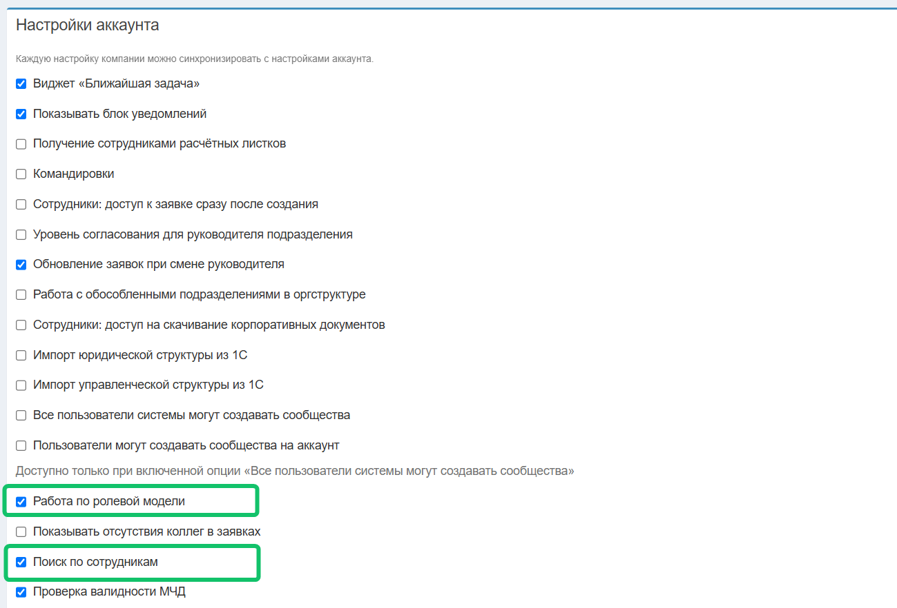

</details>

## **Бизнес-процессы**

### **Добавление участников в заявку из документа 1С**

Если в документе 1С указан конкретный подписант, система теперь может автоматически назначить его исполнителем нужной роли в заявке КЭДО. Маппинг между полями в 1С документе и ролями в бизнес-процессе КЭДО можно настроить на процесс один раз, и дальше участники будут подставляться автоматически, в том числе и в рамках уже активной заявки. Такое автозаполнение участников заявки возможно при загрузке документа из 1С в уже запущенную заявку или при создании заявки из 1С. Для роли в бизнес-процессе должна быть включена опция «Выбор согласующего».  

Для работы функционала Администратор настраивает маппинг в разделе 1С: **КЭДО → Начальная настройка → Соответствие документов → Соответствие реквизитов**. Необходимо связать поле документа с ролью в  бизнес-процессе. Для роли в бизнес-процессе должна быть включена опция «Выбор согласующего». Роли с такой опцией станут доступны для маппинга автоматически.  

Автоматическое заполнение исполнителя из 1С доступно только при одновременном выполнении условий:  
1. В заявке происходит загрузка документа из 1С на старте или в активной заявке.  
2. В бизнес-процессе для роли указана опция «Выбор согласующего».  
3. В бизнес-процессе настроена опция заполнения исполнителя из 1С документа.
4. В 1С настроены оба маппинга (документы и реквизиты).  
5. Реквизит указывает на подходящего пользователя. В реквизите документа 1С указан пользователь, и для него одновременно верно:  
- есть хотя бы один неуволенный сотрудник,  
- этот сотрудник подключен к КЭДО,  
- сотрудник может быть исполнителем этой роли. 

Если исполнитель из документа 1С не передан или не прошёл проверки, заявка продолжает работу по стандартной логике роли.  

<details>
<summary>Настройка бизнес-процесса. Пример и фрагмент JSON</summary> 

[Приказ о приеме на работу - согласующий из документа 1С.json](./assets/Employment_order.json "download") 

**Фрагмент JSON**  

```json
{
  "name": "Приказ о приеме на работу - согласующий из документа 1С",
  "group": "Приказ о приеме на работу - согласующий из документа 1С",
  "participants": [
    {
      "role": "Отдел кадров",
      "group": "Отдел кадров"
    },
    {
      "role": "Руководитель отдела кадров",
      "group": "Руководитель отдела кадров",
      "editable": true,
      "required": false,
      "editable_scope": "group",
      "editable_nodes": [
           "step_1"
      ]
    }
  ],
  "validators": [],
  "nodes": [
        {
            "key": "start",
            "state": {
                "name": "Старт"
            },
            "node_type": "begin",
            "actions": [
                {
                    "roles": [
                        "Отдел кадров"
                    ],
                    "type": "system"
                }
            ]
        },
        {
            "key": "step_1",
            "node_type": "middle",
            "state": {
                "name": "Загрузка приказа о приеме на работу"
            },
            "actions": [
                {
                    "roles": [
                        "Отдел кадров"
                    ],
                    "type": "upload",
                    "document_type": "Приказ о приеме на работу"
                }
            ],
            "notify_integration": true
        },
```

где ```editable_nodes": []``` — настройка в объекте participants, содержащая массив key из массива nodes, на которых разрешено автоматическое заполнение конкретного исполнителя роли из документа 1С. 

Автоматическое заполнение исполнителя из 1С доступно только при одновременном выполнении условий:

1. В JSON для роли заполнен editable_nodes.  
2. В 1С настроены оба маппинга (документы и реквизиты).  
3. Реквизит указывает на подходящего пользователя. В реквизите документа 1С указан пользователь, и для него одновременно верно:   
   * есть хотя бы один неуволенный сотрудник,  
   * этот сотрудник подключён к КЭДО,  
   * сотрудник входит в editable_scope, заданный для роли.

</details>

### **Новые типы файловых атрибутов**

Обновление для компаний, где используется AlterOffice — теперь документы AlterOffice (*.odt* и *.ods*) можно добавлять в файловые атрибуты. Также в список допустимых типов файловых атрибутов добавили: *.xlsx*, *.xml* и *.p7m* (файлы, зашифрованные в Litoria). 

Для заявок КЭДО файл .*odt* загружается и как документ для подписания.

Новые форматы работают в заявках КЭДО, заявках найма и корпоративных документах. 

Обратите внимание на использование формата *.xml* в Модуле найма. Если кандидат прикладывает к анкете справку СТД-Р в формате *.xml* — данные из файла этого типа потом могут быть считаны в 1С автоматически.  

<details>
<summary>Посмотреть интерфейс</summary>

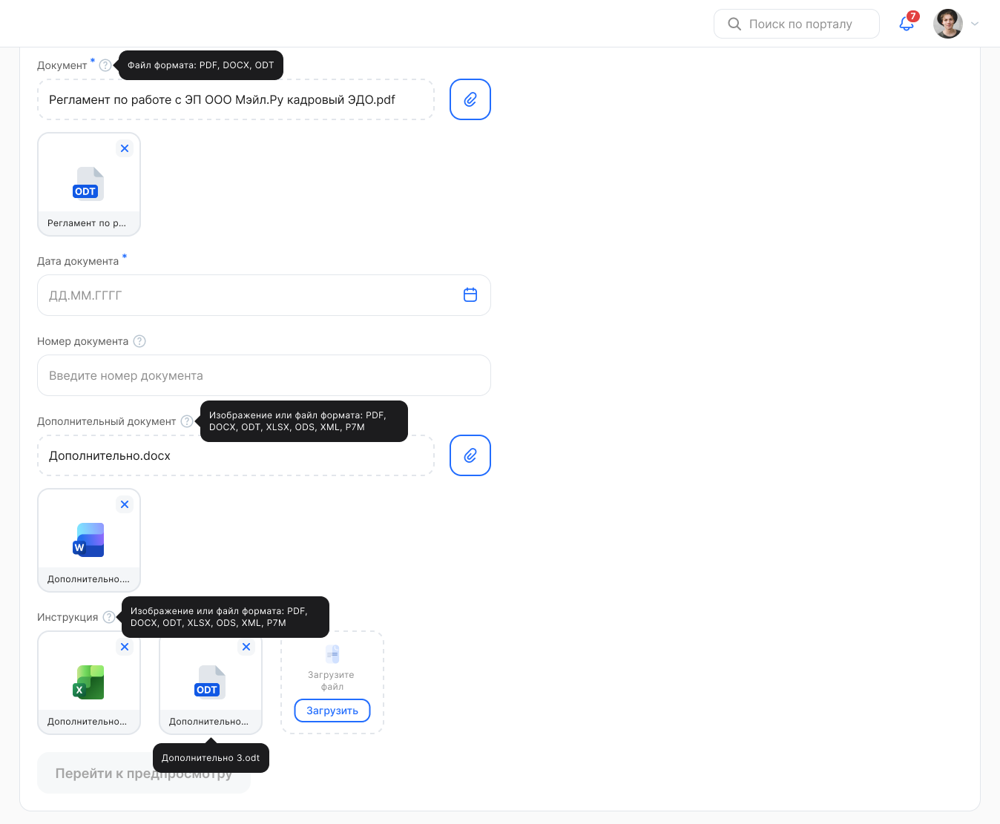

</details>

### **Кастом-название этапа в отчёте по заявке**

В отчёте по изменениям заявки (.pdf) скорректировано отображение этапов, где альтернативное действие используется не как отклонение, а как выбор ветки в бизнес-процессе. Раньше такие этапы всегда отображались в отчёте как «Отклонено»/«Отклонение» — даже если этап имел другой смысл. Теперь если для этапа задано кастомное название, оно теперь появляется в столбцах «Действие» и «Наименование этапа». 

При отсутствии кастомного названия поведение не изменилось.  

<details>
<summary>Посмотреть старую версию отчёта</summary>

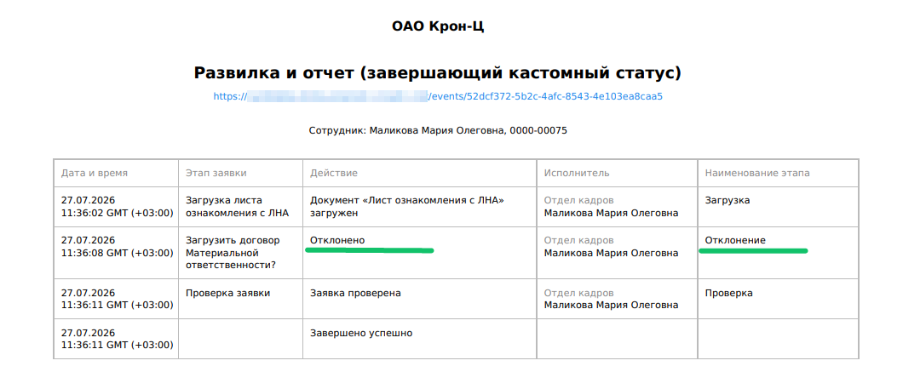

</details>

<details>
<summary>Посмотреть пример нового отчёта с кастом-названием этапа</summary>

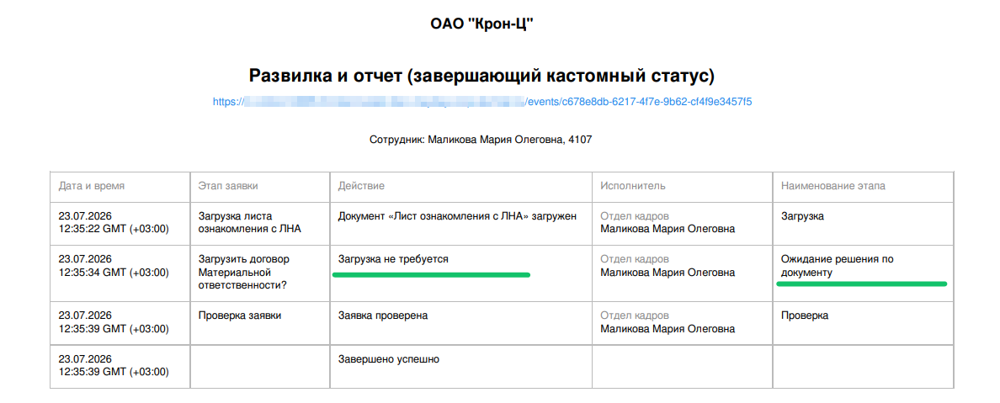

</details>
 
Подробнее о кастом-названиях этапа см. в [обзоре версии 2025.08](/ru/release_notes/onpremise/20250800Core#etapy_zayavki).

## **Ролевая модель**

В блок «Персональные данные сотрудников: просмотр в списках» добавлены новые объекты: подразделения управленческой и юридической структуры, телефоны и почтовые адреса.   

Администратор может управлять тем, кому из сотрудников, руководителей и специалистов видны эти данные в списках — в заявках, оргструктуре и результатах поиска (для каждой строки есть подсказки, где отобразятся данные).  

<details>
<summary>Посмотреть интерфейс</summary>

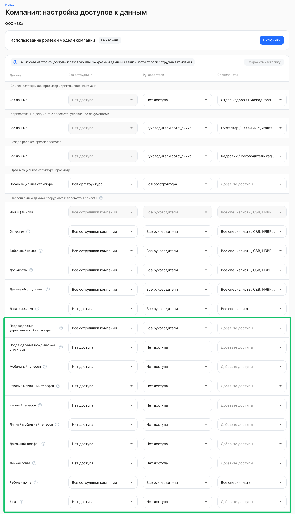

</details>


## **Отпуска и отсутствия**

### **Детализация накопленных дней отпуска в разрезе периодов их накопления**

Доработаны возможности получать из 1С накопленные дни отпуска по периодам их накопления и отображать такую детализацию в виджете **Детализация отпускных дней** в разделе **Мой календарь**.  

Доступные дни отпуска отображаются:
* в разрезе периодов накопления, если такие данные есть;  
* без детализации по периодам, если данных по периодам нет.

На странице **Мои сервисы → Мой календарь** → виджет **Дни отпуска →** кнопка **Посмотреть детализацию** → форма **Детализация отпускных дней** для каждого вида отпуска дополнительно будут отображаться периоды накоплений дней:  
   * начало периода накопления дней отпуска;  
   * окончание периода накопления дней отпуска;  
   * количество накопленных дней отпуска в указанном периоде (не суммируются дополнительно с данными без периодов).

Для вида отпуска «Другой день отдыха за работу в выходные и праздничные дни» детализация по периодам не отражается. 

<details>
<summary>Посмотреть интерфейс</summary>
  
Путь: **Мои сервисы → Мой календарь →** виджет **Дни отпуска →** кнопка **Посмотреть детализацию →** форма **Детализация отпускных дней**.  

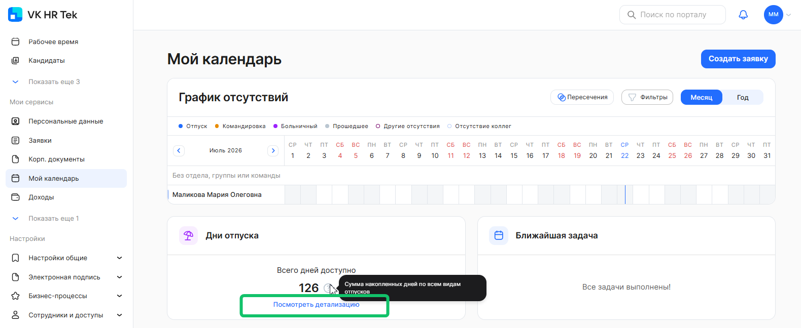 

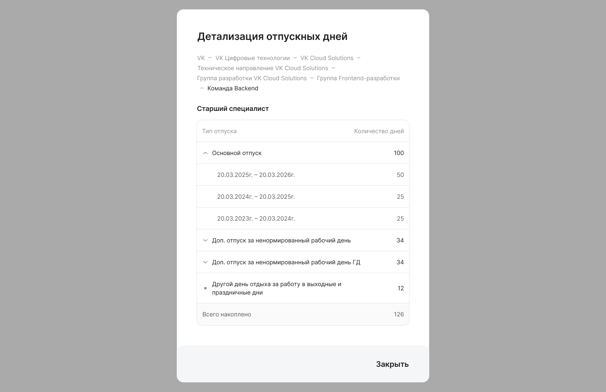

</details>

<details>
<summary>Мобильная версия</summary>

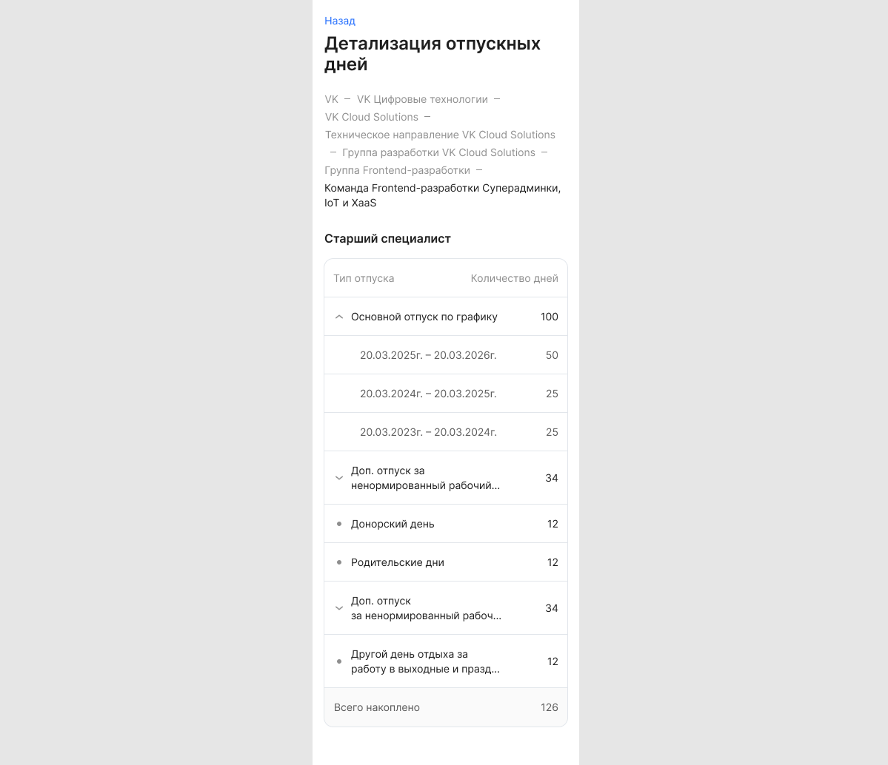

</details>

**Бизнес-ценность:**

* автоматизация процесса информирования сотрудника о доступных днях отпуска без обращения в кадровую службу: сотрудник сам может получить информацию о сумме накопленных дней в разрезе видов отсутствий и периодов их накопления, использовать накопленные дни на основании полученной информации;  
* корректное заполнение заявок на отпуск исходя из полученной информации.

### **Валидатор на количество дней компенсации**

В заявке на компенсацию неиспользованных дней отпуска реализована корректная валидация указанного количества дней компенсации на соответствие доступному количеству дней по каждому выбранному виду отпуска (лимита):

* пользователь указывает, какой лимит компенсируется;  
* тип лимита выбирается из списка лимитов, полученных из учетной/кадровой системы;  
* для выбранного типа лимита система отображает доступное количество дней;  
* пользователь указывает, сколько дней по нему компенсируется;  
* система проверяет, что запрашиваемое количество дней не превышает доступный остаток по выбранному виду отпуска;  
* в заявке будет поддерживаться нескольких строк — несколько видов лимитов компенсации.

<details>
<summary>Посмотреть интерфейс</summary>

В заявке на оформление компенсации отпуска доступна информация с видами лимитов для компенсации и количеством доступных дней компенсации, далее сотрудник имеет возможность выбрать несколько видов отпусков и заполнить по каждому количество дней компенсации: 

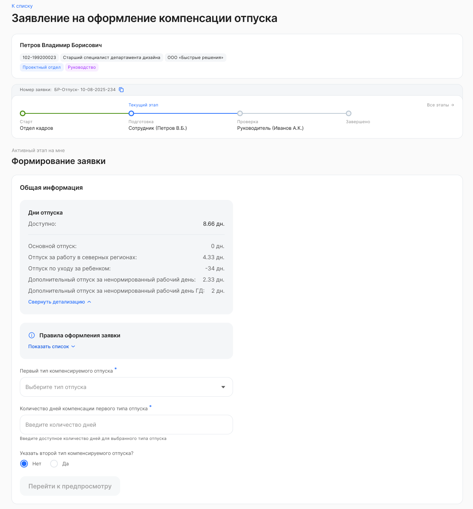

Ошибка при превышении доступного количества дней для компенсации:  

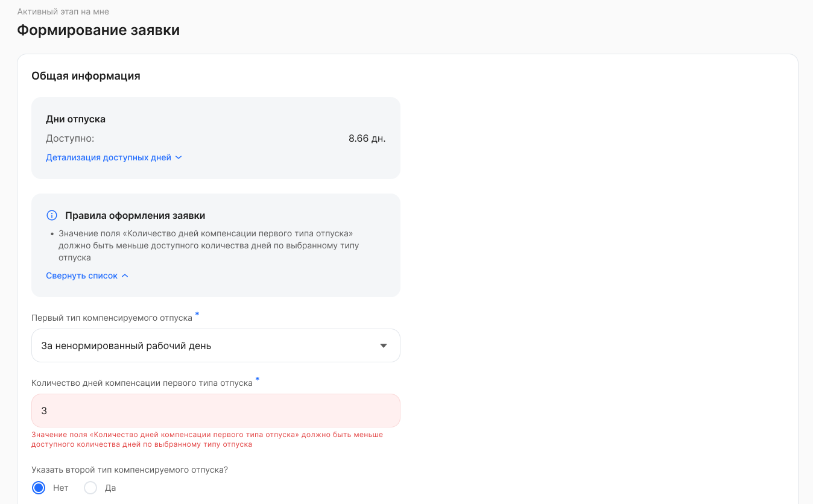

Реализована проверка по выбранным лимитам. Запрещено дублировать виды лимитов в атрибутах одной заявки:  

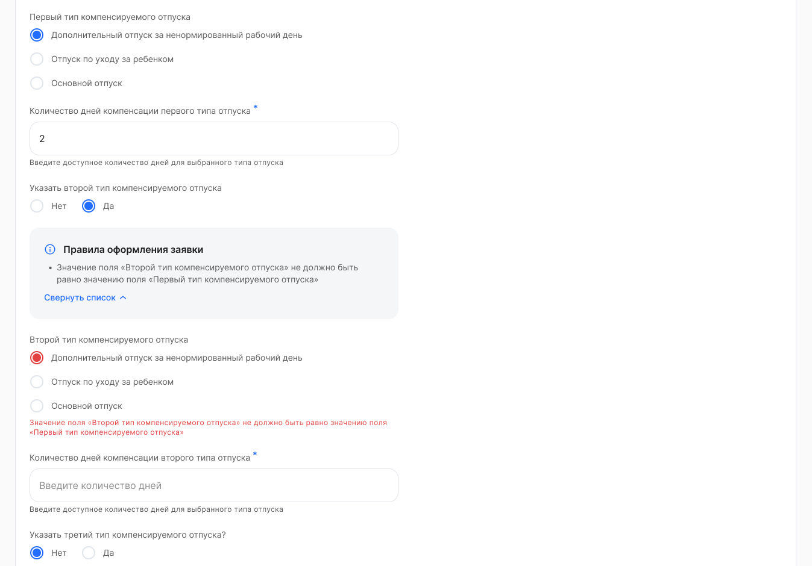

</details>

**Бизнес-ценность:**

* снижение количества некорректных заявок на компенсацию — автоматическая проверка на превышение лимита;  
* сокращение ручной работы HR и бухгалтерии, сокращение времени обработки заявки на компенсацию (без ручной проверки);  
* повышение доверия к данным и автоматизации процессов компенсации: пользователь не может отправить заявку с количеством дней, превышающим доступный лимит;  
* унификация логики работы с лимитами между отпусками и компенсациями.
  
<details>
<summary>Настройка бизнес-процесса. Пример и фрагмент JSON</summary>
 
[Заявка на компенсацию отпуска.json](./assets/vacation_compensation.json "download")  

**Пример разметки валидатора** 

```json
"validators": [
    {
        "type": "number",
        "attributes": [
            "Количество дней на компенсацию"
        ]
    },
    {
        "type": "available_days_check",
        "attributes": [
            "Количество дней на компенсацию",
            "Вид отпуска на компенсацию"
        ],
        "settings": {
            "operation": "le"
        }
    },
    {
        "type": "number",
        "attributes": [
            "Количество дней на компенсацию 2"
        ]
    },
    {
        "type": "available_days_check",
        "attributes": [
            "Количество дней на компенсацию 2",
            "Вид отпуска на компенсацию 2"
        ],
        "settings": {
            "operation": "le"
        }
    },
    {
        "type": "number",
        "attributes": [
            "Количество дней на компенсацию 3"
        ]
    },
    {
        "type": "available_days_check",
        "attributes": [
            "Количество дней на компенсацию 3",
            "Вид отпуска на компенсацию 3"
        ],
        "settings": {
            "operation": "le"
        }
    },
    {
        "type": "values_compare",
        "attributes": [
            "Вид отпуска на компенсацию",
            "Вид отпуска на компенсацию 2"
        ],
        "settings": {
            "operation": "ne"
        }
    },
    {
        "type": "values_compare",
        "attributes": [
            "Вид отпуска на компенсацию 2",
            "Вид отпуска на компенсацию 3"
        ],
        "settings": {
            "operation": "ne"
        }
    },
    {
        "type": "values_compare",
        "attributes": [
            "Вид отпуска на компенсацию",
            "Вид отпуска на компенсацию 3"
        ],
        "settings": {
            "operation": "ne"
        }
    }
],
```    

**Пример разметки валидируемого атрибута**   

```json
"key": "upload_compensation",
"state": {
    "name": "Оформление компенсации"
},
"node_type": "middle",
"action": {
    "type": "accept",
    "is_employee": true,
    "info_type": {
        "name": "vacation_types"
    },
    "attributes": [
        {
            "type": "choice",
            "name": "Вид отпуска на компенсацию",
            "required": true,
            "options": {
                "choices": [
                    {
                        "label": "Основной",
                        "value": "Основной",
                        "key": 1
                    },
                    {
                        "label": "За интенсивный труд и ответственность",
                        "value": "За интенсивный труд и ответственность",
                        "key": 2
                    },
                    {
                        "label": "Дополнительный отпуск",
                        "value": "Дополнительный отпуск",
                        "key": 3
                    }
                ]
            }
        },
        {
            "type": "text",
            "name": "Количество дней на компенсацию",
            "required": true
        },
        {
            "type": "choice",
            "name": "Указать второй тип компенсируемого отпуска",
            "options": {
                "choices": [
                    {
                        "label": "Нет",
                        "value": "2"
                    },
                    {
                        "label": "Да",
                        "value": "1"
                    }
                ]
            },
            "required": true
        },
```

</details>

## **Командировки**

### **Выбор места отправления и места назначения из справочника сервиса Trivio**

В заявках для атрибутов места отправления и места назначения будет изменен формат их заполнения при наличии настроенной интеграции КЭДО с Trivio:

* при заполнении атрибута для выбора города будет выводится список с автоподбором городов по данным системы Trivio (выпадающий список с вариантами для выбора);  
* сотрудник выбирает нужный город;  
* далее выбранный город будет передан из КЭДО в Trivio при создании поездки.

Реализованный сервис обмена данными с Trivio позволит запрашивать и получать в ответе информацию по городам. 

При вводе текста в поле **Место отправления** или **Место назначения** (поискового запроса, минимум два символа) будет отображаться перечень городов в виде подсказки:

<details>
<summary>Посмотреть интерфейс</summary>

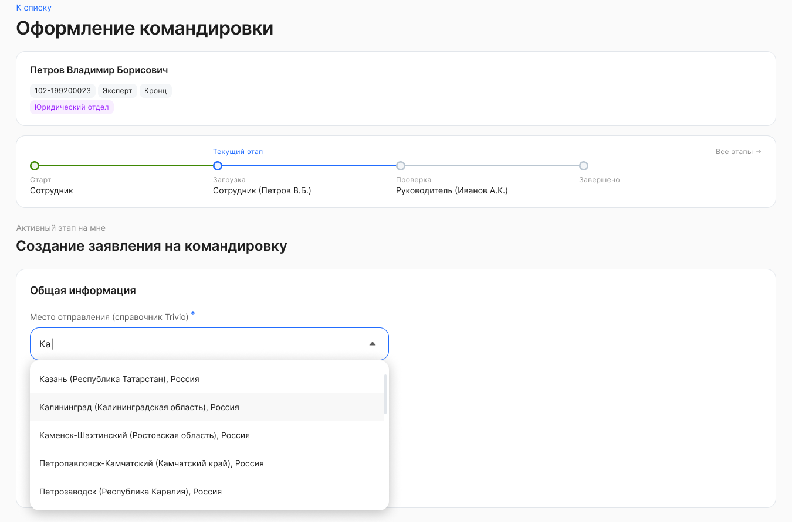

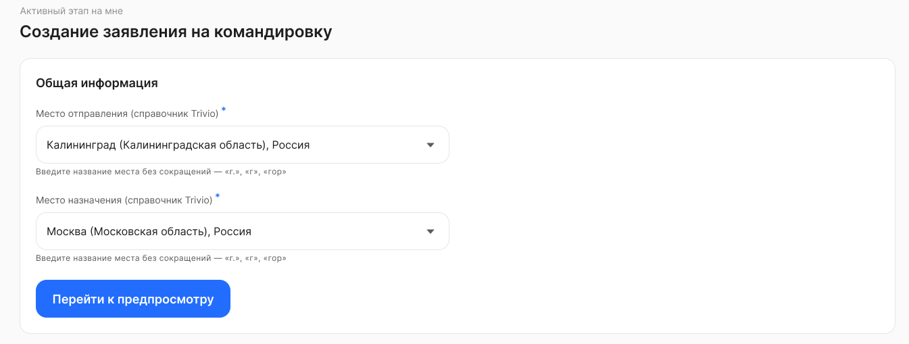

</details>

<details>
<summary>Мобильная версия</summary>

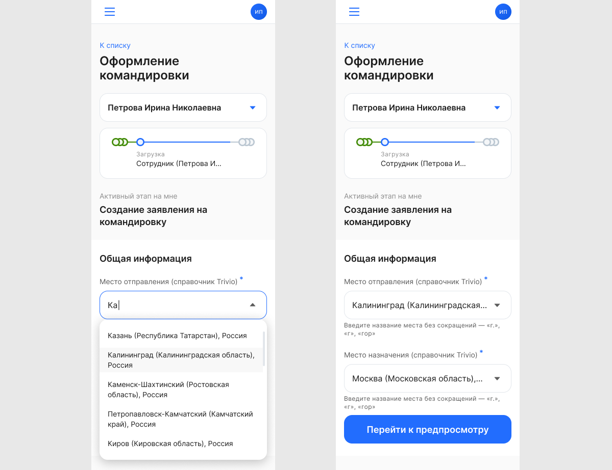

</details>

**Бизнес-ценность:**

* сокращение времени на двойное заполнение атрибутов места отправления и назначения в КЭДО и в Trivio (в карточке поездки) — атрибуты наследуются через интеграцию автоматически;  
* сокращение времени на ручное заполнение текста в КЭДО;  
* повышение качества данных — сокращение ошибок при ручном заполнении текста, выбор корректного значения из справочника.
  
<details>
<summary>Настройка бизнес-процесса. Фрагмент JSON</summary>

**Фрагмент JSON**  

```json  
{
    "type": "text_catalog",
    "name": "Место отправления (справочник Trivio)",
    "uid": "4c835657-214d-40cb-8961-09dd37d6455a",
    "options": {
        "catalog_name": "TRIVIO"
    },
    "required": true
},
{
    "type": "text_catalog",
    "name": "Место назначения (справочник Trivio)",
    "options": {
        "catalog_name": "TRIVIO"
    },
    "required": true
}
```

где ```"catalog_name": "TRIVIO"``` — справочник городов в Trivio.

</details>


## **Уведомления**

### **Кнопки действий для email-уведомлений**

В email-уведомления для руководителей и их заместителей добавлены кнопки «Согласовать» и «Отклонить». При нажатии на кнопку пользователь переходит в личный кабинет VK HR Tek, где:  
- «Согласовать» — согласование выполняется **автоматически** при переходе, заявка переводится на следующий этап. Если этап уже был завершён (например, если этап был пройден автоматически по дедлайну или ранее был согласован заместителем) — состояние заявки не меняется.  
- «Отклонить» — открывается форма отмены заявки с выбором причины и комментарием. 

Если пройти по ссылке «Перейти к заявке» — открывается заявка для ручных действий.  

В рамках текущей реализации согласование **не происходит прямо в письме** — пользователь всё равно переходит в веб-интерфейс VK HR Tek, где действие выполняется автоматически.   

**Условия отображения кнопок:**  
- Текущий этап имеет тип действия «согласовать».  
- Уведомление отправлено по одиночной заявке (не агрегированное).  
- Получатель — руководитель по любой оргструктуре или его заместитель.  

<details>
<summary>Посмотреть страницу письма</summary>

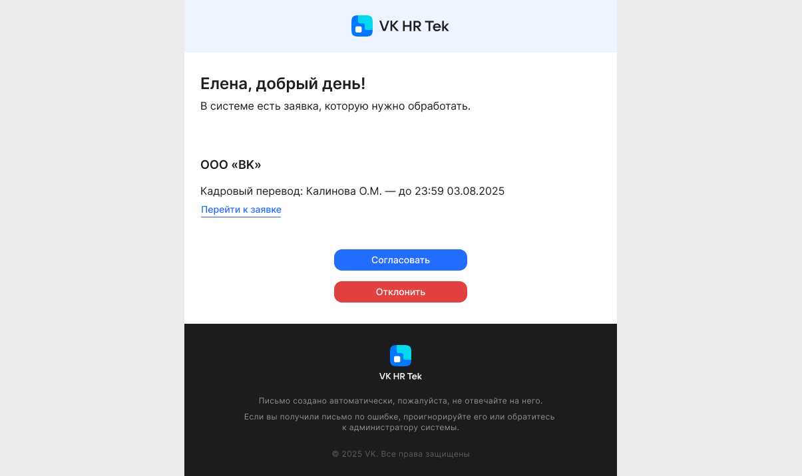

</details>

<details>
<summary>Настройка в административной панели</summary>

Для пользователей с ролью MANAGER, SENIOR_MANAGER, ADMIN, DEVELOPER, NOTIFICATION_MANAGER в административной панели.

Логика наследования: настройка компании по умолчанию синхронизируется из настроек аккаунта, но может быть переопределена для отдельных компаний.  

1. Уровень компании. Путь: **Компании → List companies → Edit company →** включение настройки **Согласование из email-уведомлений** (по умолчанию — **Из настроек аккаунта**).  

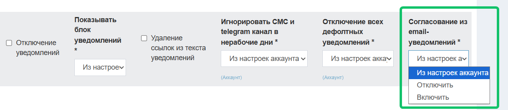

2. Уровень аккаунта. Путь: **Компании → Список аккаунтов → Редактирование аккаунта** **→** включение настройки **Согласование из email-уведомлений** (по умолчанию — выключено).  

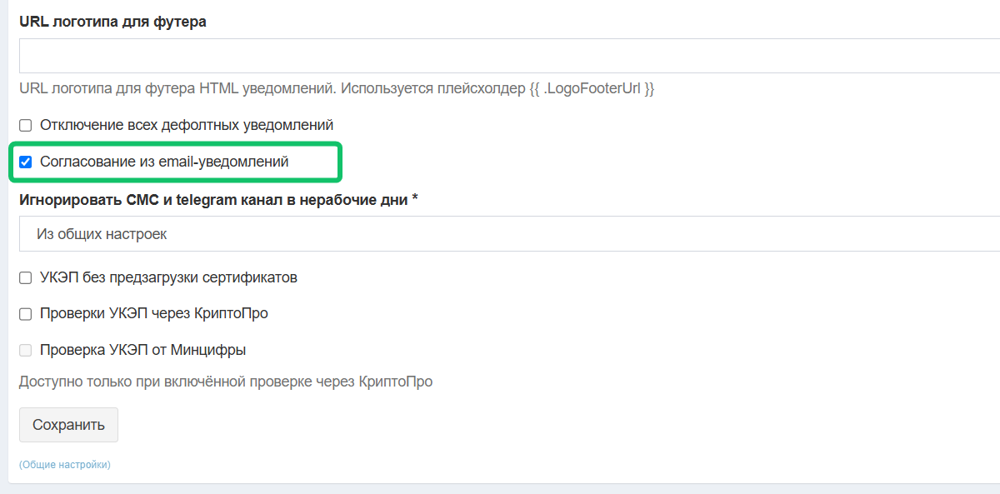

</details>

**Бизнес-ценность:**

Ускорение процесса согласования — одно нажатие на кнопку вместо ручного поиска заявки. 

### **Уведомление «Подтвердите выпуск УНЭП на Госуслугах»**

SMS-уведомление «Подтвердите выпуск УНЭП на Госуслугах» стало дефолтным. Теперь данное уведомление автоматически включено для всех компаний.

**Как это работает:**  

- Если пользователь выпускает УНЭП через Госуслуги, но сразу **не подтвердил** личность на Госуслугах — система напомнит ему об этом.  
- Уведомление содержит инструкцию перейти на Госуслуги ([https://lk.gosuslugi.ru](https://lk.gosuslugi.ru)) и завершить подтверждение.  
- Проверка запускается каждый час и ищет сотрудников, подавших заявление в последние 24 часа (но не раньше 4 часов назад).  
- Уведомление отправляется **не чаще одного раза в сутки** на одного сотрудника.

**Бизнес-ценность:**   

Напоминание позволяет избежать ошибки «Удостоверение личности через ЕСИА: время ожидания истекло», после которой процесс выпуска УНЭП нужно проходить заново.

### **Скрытие блока «Уведомления» в Профиле пользователя**

Добавлена настройка, позволяющая скрыть блок «Уведомления» в Профиле пользователя.  

<details>
<summary>Посмотреть интерфейс</summary>

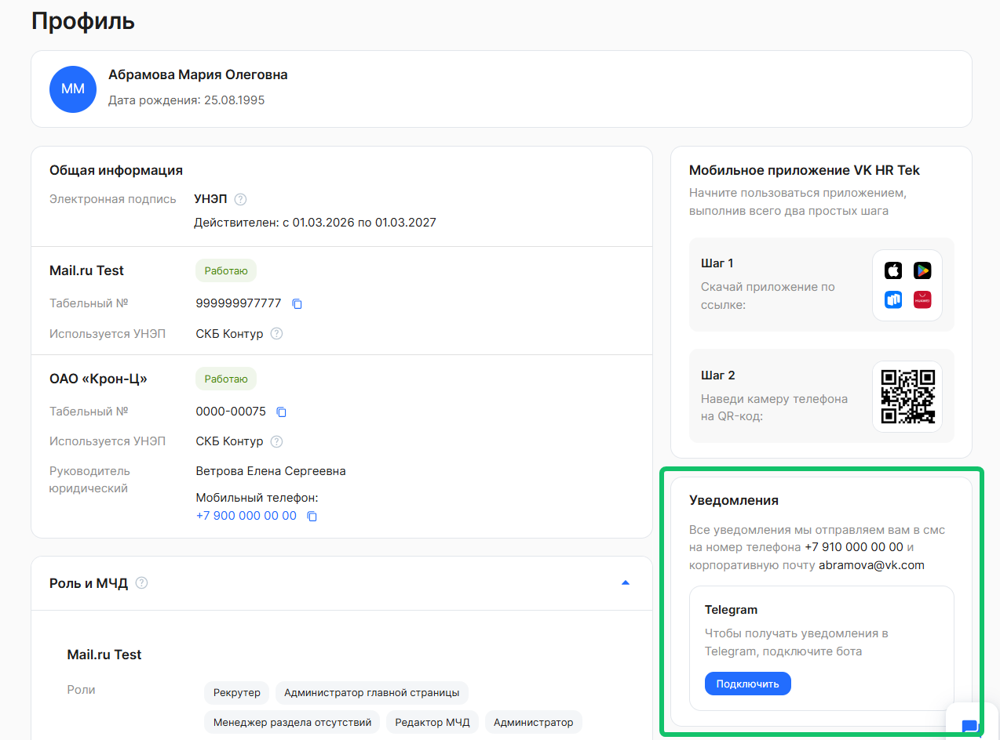

</details>

<details>
<summary>Настройка в административной панели</summary>

Для пользователей с ролью MANAGER, SENIOR_MANAGER, ADMIN, DEVELOPER в административной панели.

1. Уровень компании. Путь: **Компании → List companies → Edit company →** включение настройки **Показывать блок уведомлений** (по умолчанию — **Из настроек аккаунта**).  

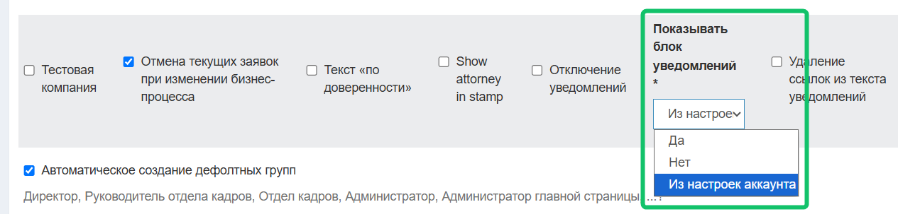

2. Уровень аккаунта. Путь: **Компании → Список аккаунтов → Редактирование аккаунта** **→** включение настройки **Показывать блок уведомлений** (по умолчанию — включено).  

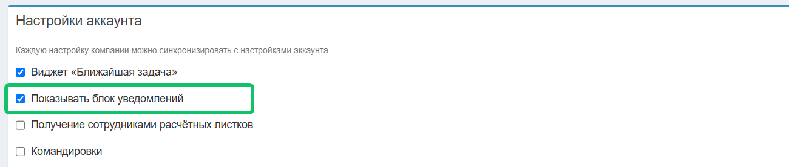

Приоритет настройки «Отключение уведомлений»: если на уровне компании включена настройка «Отключение уведомлений», то блок «Уведомления» не отображается, независимо от значений других настроек.  

</details>

Для пользователей с несколькими сотрудниками: блок отображается, если хотя бы для одного сотрудника выполняются условия отображения.  

**Бизнес-ценность:**   

Если компания полностью отключила уведомления, блок в профиле пользователя не нужен и только вводит в заблуждение. Настройка позволяет убрать лишний блок интерфейса.

## **МЧД**

### **Запрет на подписание документов с истекшей МЧД**

Добавлена настройка, которая проверяет валидность машиночитаемой доверенности (МЧД). Если срок действия МЧД истёк — подписание документа невозможно.   

**Что видит пользователь:**  

При попытке подписать документ с истекшей МЧД — ошибка: «Срок действия МЧД истек. Загрузите обновленную МЧД».  

Если МЧД отсутствует у пользователя, то проверки и ошибки не будет.  

<details>
<summary>Посмотреть интерфейс</summary>

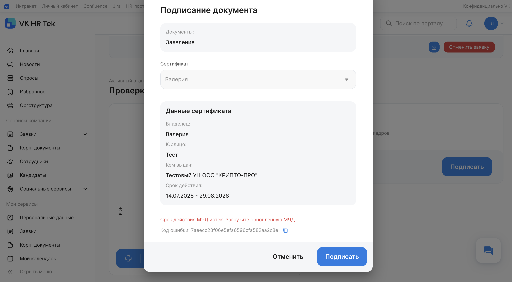

</details> 

<details>
<summary>Настройка в административной панели</summary>

Для пользователей с ролью MANAGER, ADMIN в административной панели.  

1. Уровень компании. Путь: **Компании → List companies → Edit company →** включение настройки **Проверка валидности МЧД** (по умолчанию — **Из настроек аккаунта**).  

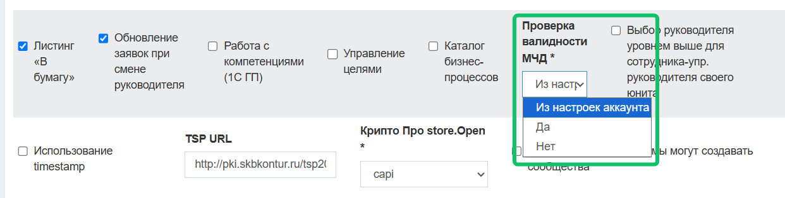 

2. Уровень аккаунта. Путь: **Компании → Список аккаунтов → Редактирование аккаунта** **→** включение настройки **Проверка валидности МЧД** (по умолчанию — включено).  

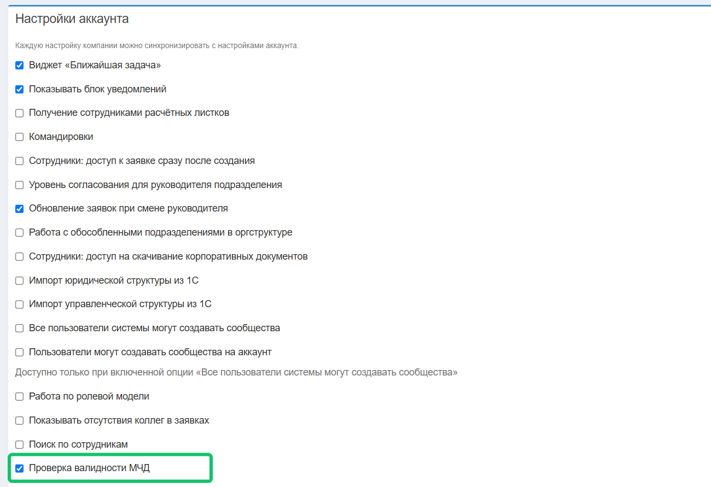 

</details>

**Логика работы:** 

- Проверка срока действия МЧД происходит вместе с проверкой подписи.  
- Дата окончания МЧД ≥ текущей даты → подписание разрешено.  
- Дата окончания МЧД \< текущей даты → ошибка, документ не подписан.  
- Для всех существующих аккаунтов настройка подключается автоматически.  

**Бизнес-ценность:**  

Защита от юридических рисков: документы, подписанные с истекшей МЧД, не имеют юридической силы. Автоматическая проверка предотвращает такие ситуации на этапе подписания.

## **Социальные сервисы**

### **Корректировка поиска с учетом новой ролевой модели**

Добавили отдельный блок в настройках ролевой модели для управления расширенным набором полей, отображаемых в результатах поиска сотрудников (контактные данные, отсутствия и др.). Поиск выполняется по расширенному набору атрибутов, добавлена фильтрация по дням рождения. Также реализована настройка на уровне компании/аккаунта, которая включает/выключает доступность поиска по сотрудникам.  

**Бизнес-ценность:**  

1. Расширение ролевых настроек поиска сотрудников повышает скорость и точность поиска нужных людей: пользователи видят в результатах только разрешённые данные (контакты, отсутствия и т.д.), могут искать по большему числу атрибутов и быстро находить сотрудников по дням рождения.  
2. Дополнительно появилась настройка на уровне компании/аккаунта, позволяющая централизованно включать или отключать поиск по сотрудникам — это усиливает контроль доступа и соответствие требованиям безопасности.  

<details>
<summary>Интерфейс поиска по сотрудникам</summary>

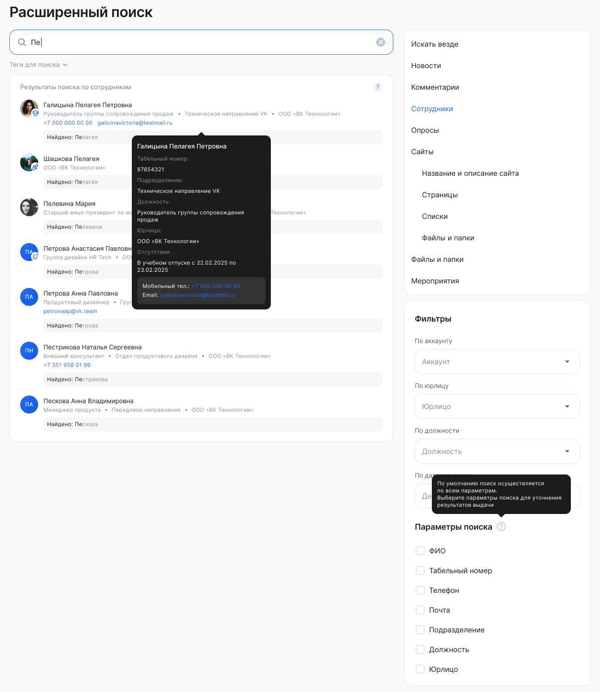

</details>

### **Добавление объектов в «Избранное»**

Реализован новый раздел бокового меню — **Избранное**. Пользователь может добавлять и убирать из избранного новости и посты. Видимость раздела зависит от того, включены ли на аккаунте/компании сервисы **Новости** и/или **Сообщества**. 

В разделе также доступен блок рекомендаций: подборки формируются по топ-3 категориям объектов, которые пользователь добавлял в избранное. Если данных недостаточно — показываются популярные публикации за последние 30 дней. Из рекомендаций исключаются уже просмотренные и уже добавленные в избранное объекты.  

**Бизнес-ценность:**  

1. Раздел **Избранное** позволяет пользователям быстро возвращаться к важным новостям и постам, снижая время на повторный поиск и повышая вовлечённость в корпоративный контент.
2. Дополнительно блок рекомендаций помогает открывать релевантные публикации (по интересам пользователя или по популярности), увеличивая охват и просмотры.
3. Гибкая видимость по включённым сервисам (Новости/Сообщества) и правам доступа обеспечивает корректное соблюдение настроек компании и безопасности.

<details>
<summary>Посмотреть интерфейс</summary>


</details>