## **Отпуска и отсутствия**

### **Отпуск по графику в разделе «Заявки»**

Заявку на отпуск по графику теперь можно оформить из раздела «Заявки», а не только из календаря, нажав на конкретный период: 

* при создании заявки сотруднику будет доступен выбор запланированного периода из графика отпусков в выпадающем списке;  
* сотрудник выбирает период,  и в заявку автоматически подгружается период отсутствия, количество дней отсутствия и тип отсутствия. Заполненные автоматически атрибуты становятся недоступны для редактирования.

Если при создании заявки запланированные периоды не были найдены, то заявка автоматически отменится с комментарием «Запланированные периоды не найдены для выбора в заявке, создайте заявку с другим типом, например, не по графику».

Пользователь в заявке сможет выбрать один из следующих периодов: 
* один запланированный период отпуска;
* несколько периодов отпусков, если они идут последовательно (первый день следующего отпуска следует за последним днём предыдущего отпуска).

<details>
<summary>Посмотреть интерфейс</summary> 

Заявка с выбором периода запланированного отпуска:

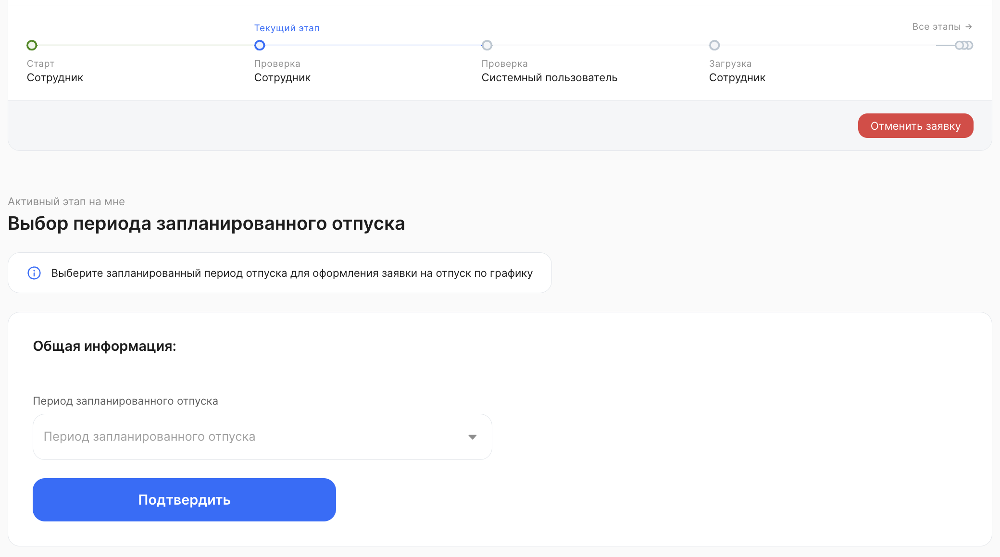

Выбор периодов, которые идут непоследовательно:

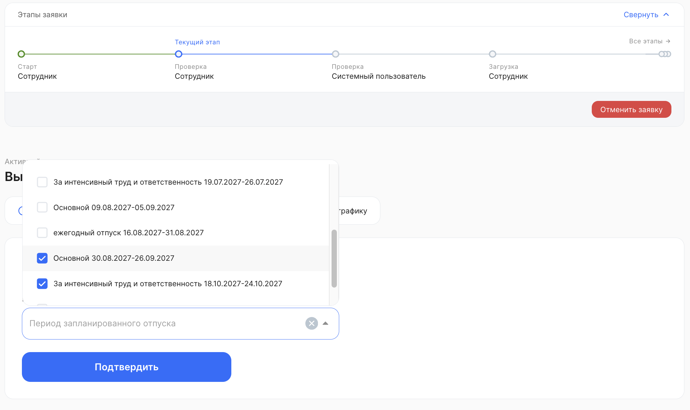

Комментарий о некорректности выбора непоследовательно идущих периодов:


</details>

<details>
<summary>Настройка бизнес-процесса. Пример и фрагмент JSON</summary> 

[Отпуск по графику из заявок.json](./assets/vacation.json "download")  

**Фрагменты JSON**

**Периоды из ПГО**:

```json
{
      "key": "prestep_1",
      "state": {
        "name": "Выбор данных ПГО сотрудника"
      },
      "node_type": "middle",
      "actions": [
        {
          "attributes": [
            {
              "name": "Период запланированного отпуска",
              "external_id": "f309e911-5b94-45ac-81c3-2daeffedf6a6",
              "type": "choice",
              "options": {
                "choices": [
                  {
                    "label": "Нет",
                    "value": "0"
                  }
                ],
                "is_multiple": true
              }
            }
          ],
          "type": "system_get_pgo_period"
        }
      ]
    },
    {
      "key": "step_12",
      "state": {
        "name": "Выбор периода запланированного отпуска",
        "description": "Выберите запланированный период отпуска для оформления заявки на отпуск по графику - один запланированный период отпуска или до пяти последовательных периодов отпуска (дата начала следующего периода следующая после даты окончания предыдущего периода)"
      },
      "node_type": "middle",
      "actions": [
        {
          "type": "accept",
          "is_employee": true,
          "attributes": [
            {
              "name": "Период запланированного отпуска",
              "description": "Можно выбрать до 5 периодов подряд (дата начала следующего периода следующая после даты окончания предыдущего периода).",
              "external_id": "f309e911-5b94-45ac-81c3-2daeffedf6a6",
              "type": "choice",
              "options": {
                "choices": [
                  {
                    "label": "Нет",
                    "value": "0"
                  }
                ],
                "is_multiple": true
              }
            }
          ]
        }
      ],
      "employee_cancelable": true,
      "company_cancelable": true
    },  
```

**Атрибуты из ПГО**:

```json
{
      "key": "prestep_2",
      "state": {
        "name": "Заполнение атрибутов данными ПГО сотрудника"
      },
     "custom_state": {
         "name": "Заполнение данных по запланированному отпуску"
        },
      "node_type": "middle",
      "actions": [
        {
          "attributes": [
            {
              "name": "Период запланированного отпуска",
              "external_id": "f309e911-5b94-45ac-81c3-2daeffedf6a6",
              "type": "choice",
              "options": {
                "choices": [
                  {
                    "label": "Нет",
                    "value": "0"
                  }
                ],
                "is_multiple": true
              }
            },
            {
              "name": "Дата начала отпуска",
              "external_id": "b702174b-f9e1-4ec4-97a3-78642eb46e3a",
              "type": "date",
              "options": {
                "info_type": {
                  "name": "vacation_days",
                  "show_vacation_types": false,
                  "show_negative": true
                }
              }
            },
            {
              "name": "Дата окончания отпуска",
              "external_id": "b6678658-e673-4782-9d0d-7eb15394d7e5",
              "type": "date"
            },
            {
              "name": "Количество календарных дней",
              "external_id": "b14325bb-508d-4fa9-b70e-35b36f48e3f8",
              "type": "text"
            },
            {
              "name": "Тип отсутствия",
              "external_id": "68747600-82df-45b2-b434-52bde1cce4e7",
              "type": "text"
            }
            ...
            {
              "name": "Дата начала отпуска 5",
              "external_id": "007119c9-770f-4ec0-ae08-b924101f448f",
              "type": "date",
              "options": {
                "info_type": {
                  "name": "vacation_days",
                  "show_vacation_types": false,
                  "show_negative": true
                }
              }
            },
            {
              "name": "Дата окончания отпуска 5",
              "external_id": "4a67438e-024e-4dc9-9a38-4c212ebfdf40",
              "type": "date"
            },
            {
              "name": "Количество календарных дней 5",
              "external_id": "7ea9d077-77ca-4640-9d41-ecb3169aa6a0",
              "type": "text"
            },
            {
              "name": "Тип отсутствия 5",
              "external_id": "942b3b4c-9430-4b80-ba50-e4ffa986cf95",
              "type": "text"
            }
          ],
          "type": "system_fill_event_pgo_attributes",
          "max_period": N
        }
      ]
    },
    {
            "key": "prestep_2_result",
            "node_type": "middle",
            "state": {
                  "name": "Проверка допустимости выбранного периода"
                       },
            "actions": [
                {
                    "type": "accept",
                    "name": "Период выбран корректно",
                    "roles": [
                          "Системный пользователь"
                            ]
                  },
                {
                    "type": "return",
                    "name": "Период выбран некорректно",
                    "roles": [
                          "Системный пользователь"
                          ]
                }
        ]
        },
```

</details>

### **Отображение запланированных сотрудником периодов отпусков с компенсацией в календарях**

В календарях с графиками отсутствий, с графиками отпусков будет отражаться признак «Денежная компенсация», если он был отмечен сотрудником при планировании периодов в графике.   

Признак «Денежная компенсация» видит сотрудник, а также все, кому доступен просмотр информации по периодам отсутствия этого сотрудника. 

<details>
<summary>Посмотреть интерфейс календарей</summary> 

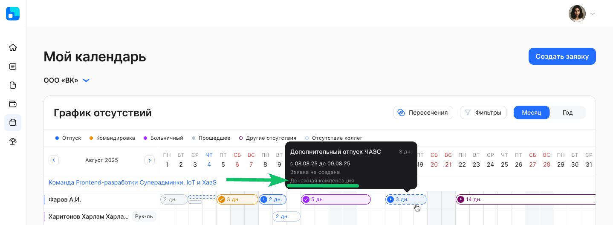


</details>

<details>
<summary>Посмотреть пример интерфейса создания заявки</summary> 


</details>

<details>
<summary>Настройка бизнес-процесса. Пример и фрагмент JSON</summary> 

[Заявление о переносе отпуска.json](./assets/vacation_transfer.json "download")
   
**Фрагмент JSON**

```json
{
"name": "Денежная компенсация",
"external_id": "712e6ce0-3a51-471f-ba18-ef29891d1b31",
"type": "choice",
"options": {
            "choices": [
                        {
                            "label": "Да",
                            "value": "Да"
                        },
                        {
                            "label": "Нет",
                            "value": "Нет"
                        }
                        ]
           }
}
```

</details>

## **График отпусков**

### **Запрет возврата заявки из планирования сотруднику, если прошел дедлайн для заполнения сотрудником**

Согласующий не сможет отправить график на доработку сотруднику, если срок заполнения сотрудником, установленный при запуске планирования, истек:
* будет скрыта кнопка «Вернуть на доработку»:   
  * внутри заявки;  
  * в листинге;  
  * в массовых действиях;  
* согласующему будет показана подсказка, почему кнопка возврата на доработку больше не доступна.

Ранее согласующий мог нажать кнопку возврата на доработку, но такие задачи не показывались сотруднику и возвращались обратно согласующему без какого-либо уведомления. 

<details>
<summary>Посмотреть интерфейс</summary> 

Дедлайн заполнения графика отпусков для сотрудника не наступил — кнопка **Вернуть на доработку** доступна.  

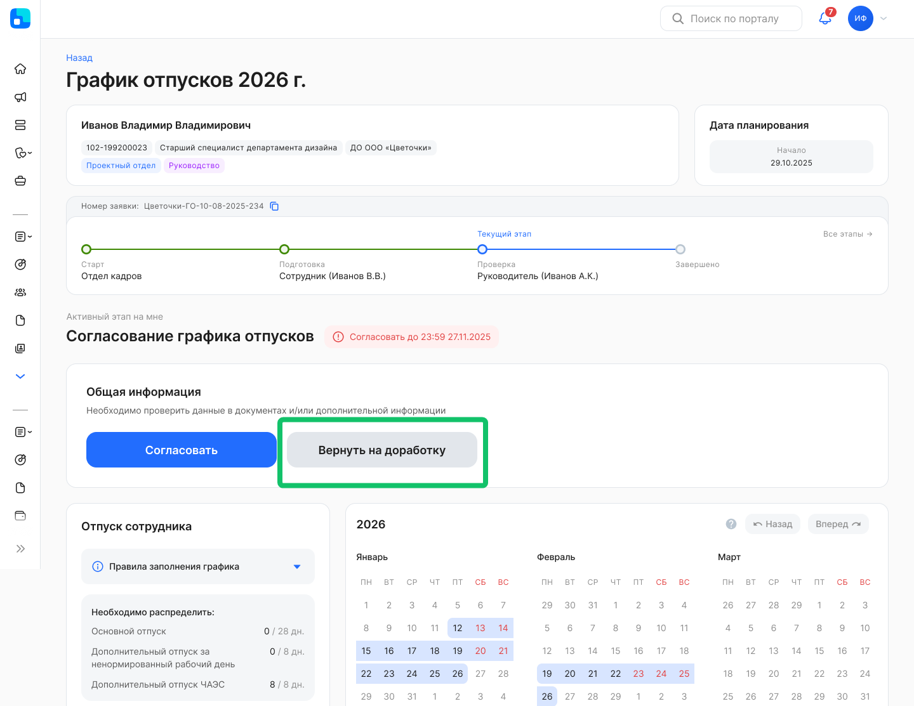

Дата заполнения графика отпусков для сотрудника уже истекла — кнопка **Вернуть на доработку** недоступна, пользователь увидит информационное сообщение.  

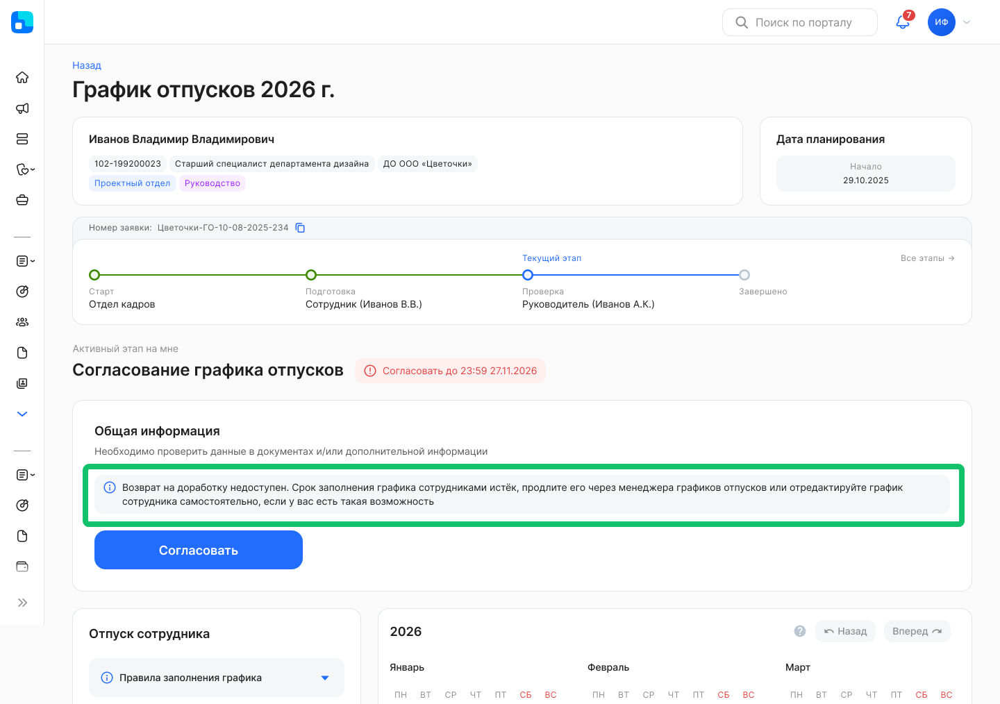

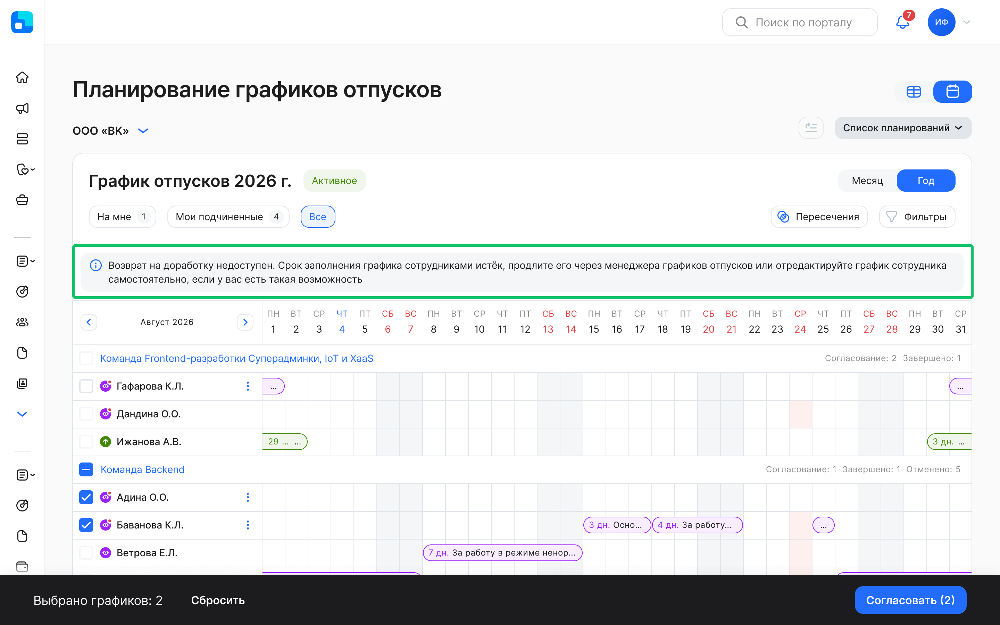

</details>

### **Удаление запущенного планирования через административную панель**

Ошибочно запущенное планирование графиков отпусков (ГО) можно полностью удалить через административную панель. Удаляются:

* само планирование ГО;  
* все заявки планирования независимо от их статуса: созданные, согласованные, завершённые, отменённые;  
* периоды отпусков, указанные в заявках;  
* отсутствия в календарях, созданные на основании периодов планирования;  
* данные, переданные в 1С по этому планированию — периоды отпусков и документ «График отпусков».

Удаление доступно независимо от статуса планирования (в т.ч. для завершённых):

* в разделе **Vacation → Vacation schedules** есть возможность удалять планирование ГО в любом статусе (создано / запущено / активно / завершено / отменено) независимо от признака «Тестовая компания» или нет;  
* полное удаление планирования с большим количеством сотрудников (от 100 сотрудников, ориентируемся на реально запланированный максимум в 10707 сотрудников). При сбое и повторном запуске удаления не должно появляться дублей и частично удалённых данных. Повторный запуск должен безопасно доводить удаление до конечного состояния (планирование и связанные данные полностью удалены);  
* если после удаления у подразделения не остаётся других активных планирований, то система удаляет признак наличия графика отпусков у подразделения;  
* при удалении появляется сообщение: «Вы уверены что хотите удалить это планирование? Будут удалены все заявки по данному ПГО, включая уже согласованные и завершённые, а также ранее переданные в 1С данные по графику отпусков сотрудников».

<details>
<summary>Посмотреть интерфейс в административной панели</summary> 

Раздел **Vacation → Vacation schedules**. Доступен для пользователей с ролью в SENIOR_MANAGER, MANAGER, ADMIN, DEVELOPER в административной панели.  

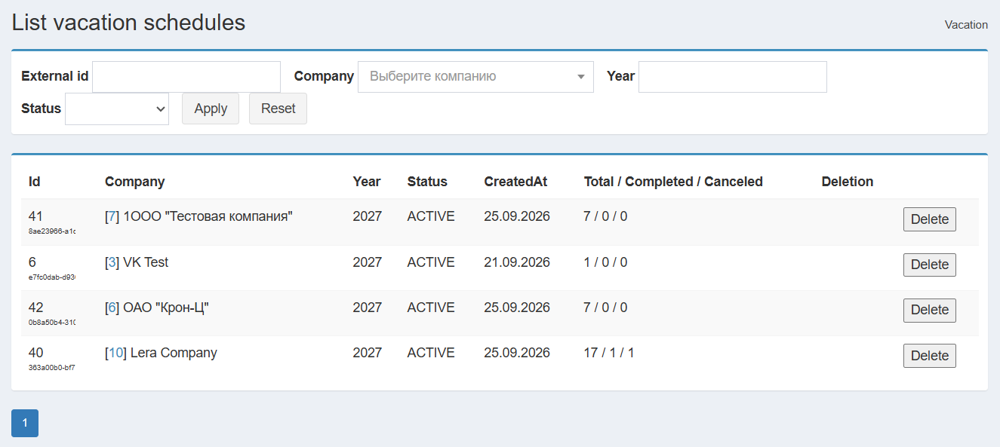

</details>

### **Отражение уже проведенных отсутствий в запущенном планировании**

В календарях планирования, в задачах и календарях разделов **Графики отпусков** будут отражаться проведенные отсутствия, если они относятся к году, на которое запущено планирование.  

<details>
<summary>Посмотреть интерфейс</summary> 

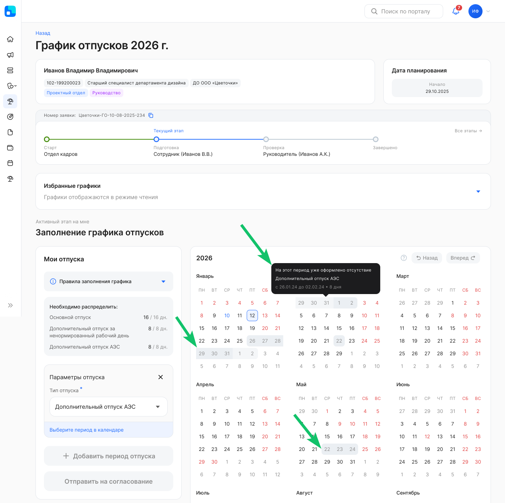

</details>

<details>
<summary>Настройка в административной панели</summary> 

Для пользователей с ролью ROLE_MANAGER, ROLE_SENIOR_MANAGER, ROLE_NOTIFICATION_MANAGER, ROLE_ADMIN в административной панели. 

**На уровне компании**  
Чтобы включить отображение проведенных периодов отпусков, перейдите в раздел **Компании → List Companies**, на страницу создания/редактирования настроек компании и включите опцию **Отображать в ПГО отпуска, проведенные в системе управления персоналом 1С/SAP** (по умолчанию опция включена).  

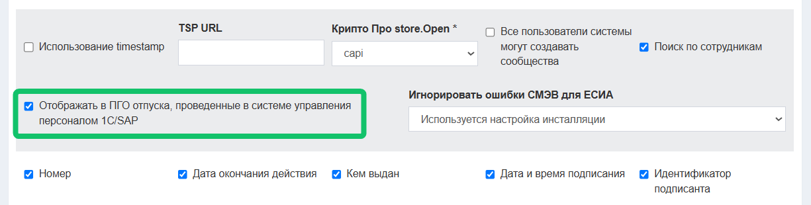

**На уровне аккаунта**  
Чтобы включить отображение проведенных периодов отпусков, перейдите в раздел **Компании → Список аккаунтов**, на страницу создания/редактирования настроек аккаунта и включите опцию **Отображать в ПГО отпуска, проведенные в системе управления персоналом 1С/SAP** (по умолчанию опция включена). 


Чтобы выбрать типы отсутствий для отображения проведенных в планировании графиков отпусков, перейдите в раздел **Компании → Absence types**, на страницу редактирования необходимого типа отсутствия и включите опцию **Display in schedule**.   

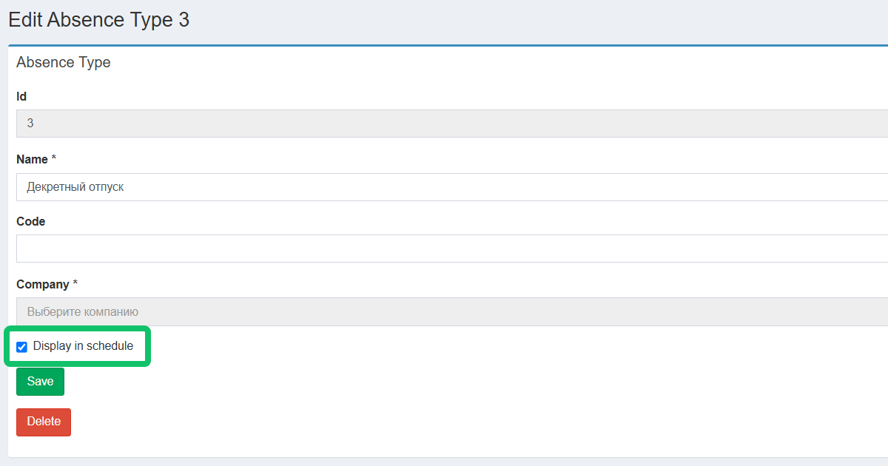

Чтобы массово настроить выбор типов отсутствий для отображения проведенных в планировании графиков отпусков:  
1. Перейдите в раздел **Компании → Absence types**, используйте массовую загрузку из CSV-файла по кнопке **Update display flags**.  

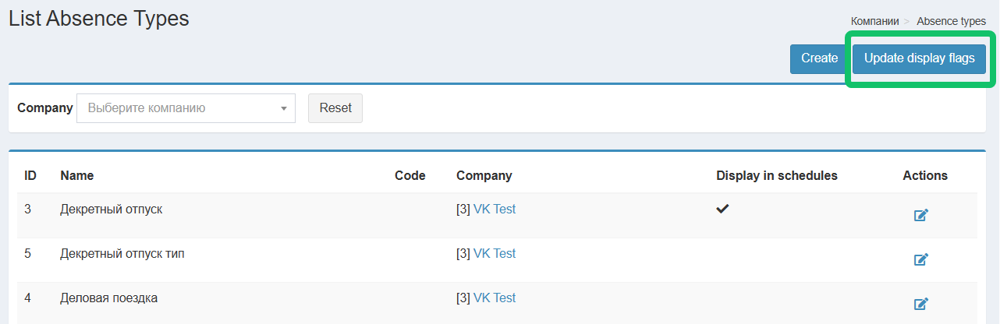

2. На странице загрузки CSV-файла включите опцию **Display in schedule**.  
3. Выберите CSV-файл для загрузки. [Шаблон CSV-файла](./assets/types_vacations.csv "download").  

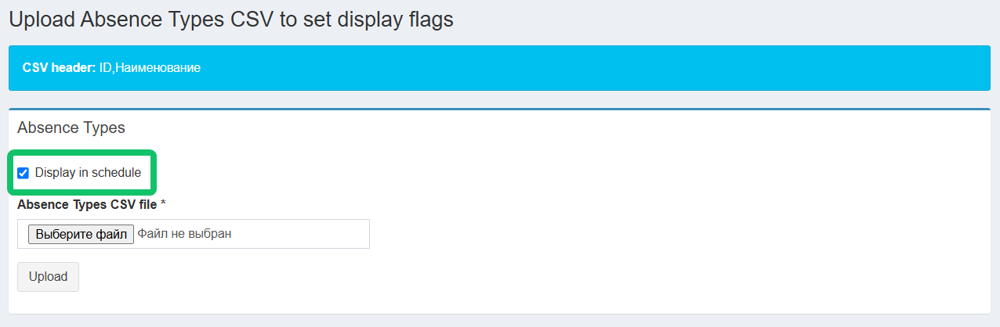

</details>

### **Планирования «На группу сотрудников»**

График отпусков можно планировать не только по юридическому лицу или подразделению, но и по группам сотрудников:
* применимо для компаний, у которых в кадровой системе есть группы (категории), присваиваемые сотрудникам.  
* группы могут быть переданы по сотрудникам в КЭДО.  
* по каждой группе — свой маршрут согласования задач при планировании графика, которые необходимо настроить при запуске планирований.

При создании планирования (в разделе **Настройки → Графики отпусков**) появилась настройка видимости «На группу сотрудников»:
* могут быть выбраны одна или несколько групп;  
* в планирование могут быть добавлены только сотрудники с выбранными группами;  
* далее настраивается маршрут согласования — как было ранее.

В разделе **Сервисы компании → Графики отпусков** добавлен фильтр «По группе сотрудников», а в уже запущенное планирование можно добавить новые группы и исключить отдельных сотрудников.  

<details>
<summary>Посмотреть интерфейс</summary> 


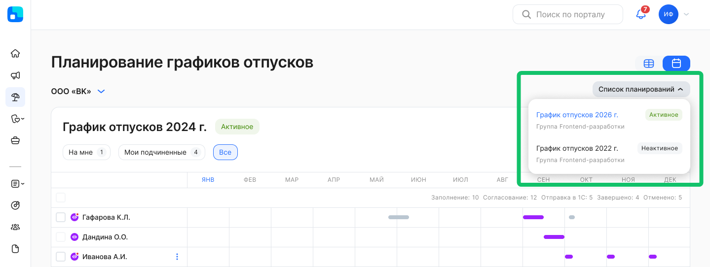

</details>

### **Редактирование дедлайнов активного планирования графика отпусков**

Пользователь с ролью «Менеджер графика отпусков» сможет продлить сроки в активном планировании, без удаления и нового запуска самого планирования, а также сможет скорректировать все дедлайны:
* дата окончания планирования;  
* дата окончания заполнения сотрудником;  
* дата окончания проверки.

Изменяем только в сторону увеличения и до наступления таких дедлайнов, сроки при этом пересчитываются по этапам, и участникам активного этапа приходит уведомление.  

В листинге планирований в каждом активном планировании будет доступна кнопка «Редактировать». 

<details>
<summary>Посмотреть интерфейс</summary> 


Поля, доступные для редактирования:  


</details>

### **Выбор компенсации при планировании периодов отпусков**

При планировании периода отпуска в календаре сотрудник сможет отметить признак денежной компенсации:
* настраиваются типы отпусков, для которых доступно указание признака «Денежная компенсация» при планировании графика отпусков;  
* флаг признака проставляется в разрезе выбираемых сотрудником плановых периодов;  
* руководитель, согласующий график отпусков, или пользователь с группой, согласующий график отпусков, сможет увидеть проставленный сотрудников признак при получении задач на согласование, также сможет его отредактировать;  
* признак «Денежная компенсация» дополнительно к типу планируемого отпуска и периоду передается в 1С, отражается в документе «График отпусков» в столбце «Компенсация», сохраняется в регистре 1С для последующей передачи в составе отсутствий.

<details>
<summary>Посмотреть интерфейс</summary> 

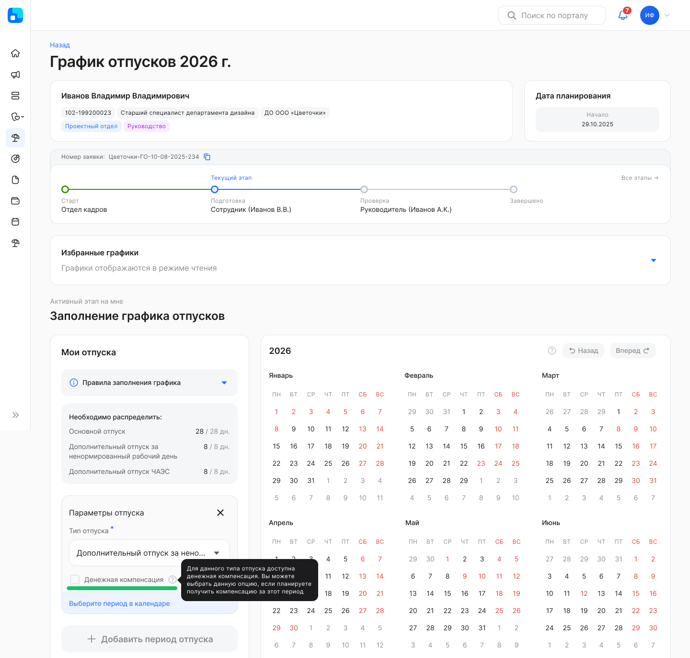

</details>


<details>
<summary>Настройка в административной панели</summary> 

Для пользователей с ролью ROLE_SENIOR_MANAGER, ROLE_MANAGER, ROLE_ADMIN, ROLE_SUPPORT в административной панели.  

Чтобы настроить в компании типы отпусков, для которых доступно указание признака «Денежная компенсация» при планировании графика отпусков, перейдите в раздел **Vacation → Vacation types**, на страницу редактирования необходимого типа отпуска и включите опцию **Allow compensatory**.  

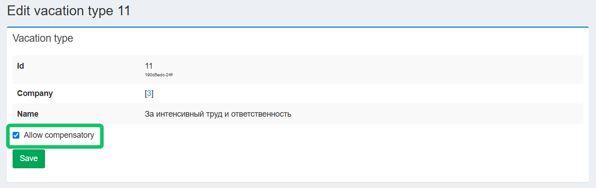

Чтобы массово настроить в компании типы отпусков, для которых доступно указание признака «Денежная компенсация» при планировании графика отпусков:  

1. Перейдите в раздел **Vacation → Vacation types**, используйте массовую загрузку из CSV-файла по кнопке **Upload CSV**.  

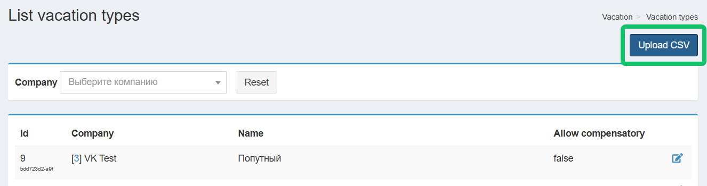

2. На странице загрузки CSV-файла включите опцию **Allow compensatory**.  
3. Выберите CSV-файл для загрузки. [Шаблон CSV-файла](./assets/allow_compensatory.csv "download").  

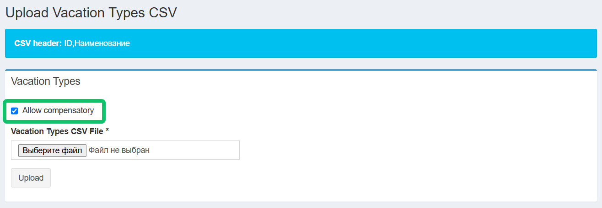

</details>

### **Добавление переводов для страницы настройки графика отпусков, добавление новой группы**

Информационные сообщения в интерфейсах настройки запуска планирования добавлены в переводы, компании смогут настроить текст таких сообщений под требования конкретной компании.

### Добавление новой системной роли

Для кейса с назначением ассистентов для согласования планирования графиков отпусков создана новая роль «Администратор раздела оргструктуры». Роль доступна для добавления пользователям в разделе **Настройки → Роли сотрудников**.

Пользователь, которому назначена данная роль, сможет:
* добавить ассистентов в подразделение разделе **Оргструктура**;
* создать новое управленческое подразделение в оргструктуре;  
* изменить настройки управленческого подразделения в веб-интерфейсе.


## **Командировки**

### **Изменение страницы заявки на командировку**

Теперь вся ключевая информация по поездке будет отражаться в верхней части заявки, чтобы удобно было сразу ее просмотреть, а не искать по всей заявке.  

В «шапке» пользователь сможет увидеть:
* маршрут;  
* даты поездки;  
* количество дней поездки;  
* количество выходных дней.

В «шапке» отражается информация по 3-м пунктам назначения, если их больше 3-х — появляется кнопка с количеством оставшихся пунктов, при переходе по кнопке открывается модальное окно с детализацией этих маршрутов. 

Блок с этапами заявки может сворачиваться, остаются только кнопки с действиями по заявке.  

Раньше формат заявки на командировку не отличался от обычной заявки, теперь заявка на командировку будет иметь свой дизайн.

Также после заполнения параметров командировки заявка стала удобной для просмотра — компактно отражаются атрибуты.

<details>
<summary>Посмотреть интерфейс</summary> 


Детализация маршрута в модальном окне:  

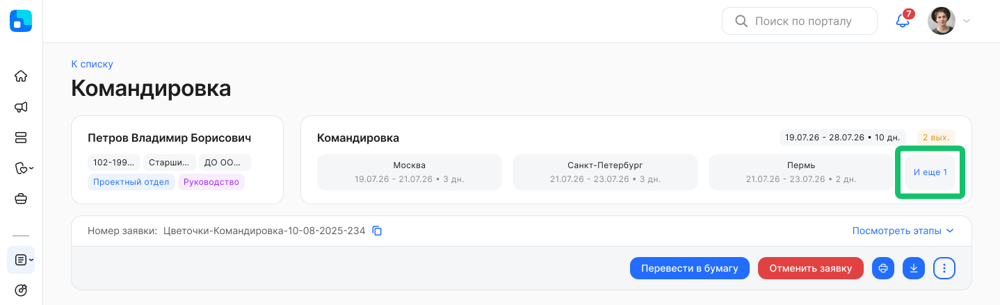


Заявка с заполненными атрибутами:  

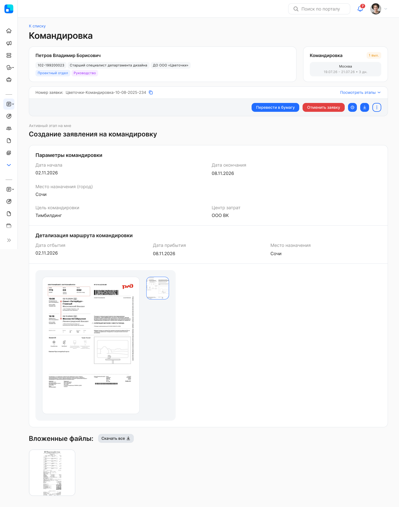

</details>

<details>
<summary>Мобильная версия</summary> 


</details>

 
<details>
<summary>Настройка бизнес-процесса. Пример и фрагмент JSON</summary> 

[Командировка.json](./assets/business_trip.json "download")
   
Функциональность применима для типов заявок с тегом «Командировки» и с вариантами атрибутов:
- Место назначения (город)
- Дата начала
- Дата окончания
- Место назначения (страна, город, организация)
- Место (населенный пункт) командировки
- Место командирования (город/населенный пункт)
- Место командировки
- Укажите пункт назначения
- Место назначения
- Место назначения (справочник Trivio)
- Дата начала командировки
- Дата начала служебной поездки
- Дата убытия в командировку
- Дата окончания командировки
- Дата окончания служебной поездки
- Дата прибытия из командировки
- Дата завершения командировки

**Фрагмент JSON**  

```json
"attributes_meta": [
            {
              "type": "document",
              "title": "Параметры командировки",
              "objects": [
                {
                  "type": "block",
                  "objects": [
                    {
                      "type": "row",
                      "is_bottom": true, //флаг выравнивания атрибутов по нижней границе
                      "objects": [
                        {
                          "type": "attribute",
                          "name": "Дата начала"
                        },
                        {
                          "type": "attribute",
                          "name": "Дата окончания"
                        }
                      ]
                    }
                  ]
                }
              ]
            }
          ],
```

</details>

## **Социальные сервисы**

### **Целевые аудитории**

Теперь кастомные целевые аудитории можно назначать не только новостям, но и опросам. Это позволяет точнее доставлять контент тем, кого он действительно касается, снижает информационный шум и повышает вовлечённость и качество обратной связи, одновременно усиливая контроль доступа и снижая риски ошибочной публикации чувствительной информации.  

<details>
<summary>Посмотреть интерфейс создания опроса для целевой аудитории</summary> 

Подробнее о создании опроса на целевую аудиторию описано в статье [Создание опроса / Настройки опроса](/ru/hr/portal/survey/management/create#nastroyki_oprosa).   

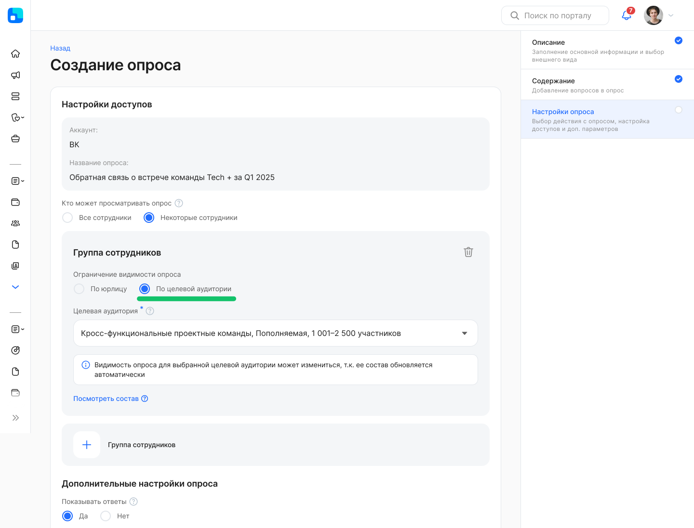

</details>