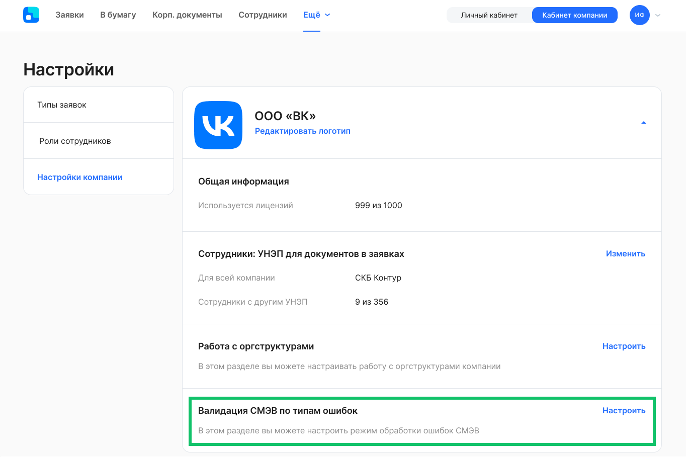
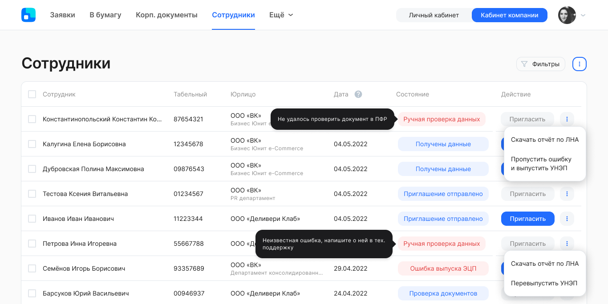

## **Для представителей компании**
### **Выпуск УНЭП для иностранных сотрудников**
Автоматизировали выпуск усиленной неквалифицированной электронной подписи (УНЭП) Контур для иностранных сотрудников.

Процесс выпуска УНЭП включает шаги:

1. Кадровый специалист добавляет сведения об иностранном сотруднике в модуль 1С.
1. Кадровый специалист указывает флаг в 1С для передачи данных о сотруднике в web-сервис VK HR Tek.
1. Кадровый специалист отправляет сотруднику приглашение на регистрацию в сервисе VK HR Tek.
1. Сотрудник проходит регистрацию в сервисе. Система получает номер телефона сотрудника.
1. На шаге выпуска УНЭП сервис передает информацию о том, что паспорт иностранный. 
1. Проверка данных в сервисе происходит в соответствии с алгоритмом для иностранного документа и не выдает лишние ошибки.
1. Сотрудник выпускает УНЭП.

### **Ошибки СМЭВ**
В *Кабинет компании → Сотрудники* перенесли работу с ошибками СМЭВ и процесс выпуска УНЭП Контур.

Администратор КЭДО настраивает режим обработки ошибок СМЭВ в *Кабинете компании → Настройки*. Настройка содержит типы и описания ошибок с возможностью переключения порядка валидации:

- ручная обработка ошибок СМЭВ;
- автоматический пропуск валидации.

Настройку можно применить в рамках одной компании или массово всем компаниям в аккаунте.

Результаты настройки доступны только для роли «Отдел кадров».

Если включить ручную обработку ошибок СМЭВ, то в разделе *Сотрудники* в зависимости от типа ошибки будут добавлены кнопки:

- «Пропустить ошибку и выпустить УНЭП» — для ошибок с типом «Предупреждение». Такие ошибки сообщают, что необходимо сверить данные в 1С с оригиналами документов на наличие опечаток или других неточностей.  
- «Перевыпустить УНЭП» — для ошибок, которые связаны с невалидностью документов. Например, такие ошибки случаются, если данные в 1С необходимо скорректировать на новые.

### **Выгрузка запланированных графиков отпусков**
В *Кабинете компании → График отпусков* можно скачивать список запланированных графиков отпусков в формате xlsx. В выгрузке учитывается результат фильтрации по подразделению, сотруднику, состоянию графика, текущему исполнителю.

### **Загрузка документа в заявку через публичный API**
В публичном API пользователям разрешили загружать документ в заявку без выпуска усиленной неквалифицированной электронной подписи (УНЭП).

## **Для сотрудников и представителей компании**
### **Автосохранение данных в заявках**
Настроили автосохранение данных, которые пользователь ввел в полях заявки и при выборе интервалов в календаре графиков отпусков в одном браузере на одном компьютере или мобильном устройстве. Теперь пользователь может дозаполнить заявку позже, не беспокоясь о потере данных даже при закрытии браузера. Данные сохраняются до 30 дней.

### **Скрытие комментариев в заявке**
Сотрудники могут получать заявки на доработку без комментариев от определенных участников бизнес-процесса.

Настройка этой функции является платной. Чтобы подключить скрытие комментариев для конкретного типа заявки, необходимо прописать данную настройку в JSON-файле бизнес-процесса. Для подключения обратитесь к вашему менеджеру внедрения VK HR Tek.

### **Подписание документов в заявках без СМС** 
Пользователи могут подписывать документы в заявках без подтверждения вторым фактором — без кода из СМС.

Настройка этой функции является платной. Чтобы подключить подписание без СМС для конкретного типа заявки, необходимо указать данную опцию в JSON-файле бизнес-процесса на этапе подписания. Для подключения обратитесь к вашему менеджеру внедрения VK HR Tek.

## **Для администраторов web-сервиса**
### **Заместители сотрудников**
В разделе *Настройки → Заместители сотрудников* администратор видит, кто является руководителем во всех компаниях аккаунта, и может назначать руководителю заместителя из другой компании аккаунта.

## **Исправления**
1. Настроили валидатор кратности, который при расчете отпуска должен учитывать дни из производственного календаря и не считать праздничные дни в периодах отпуска.
1. Вернули отображение должностей в pdf-файле выгрузки по ЛНА.

