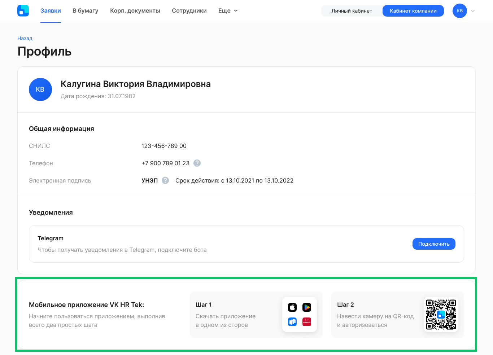
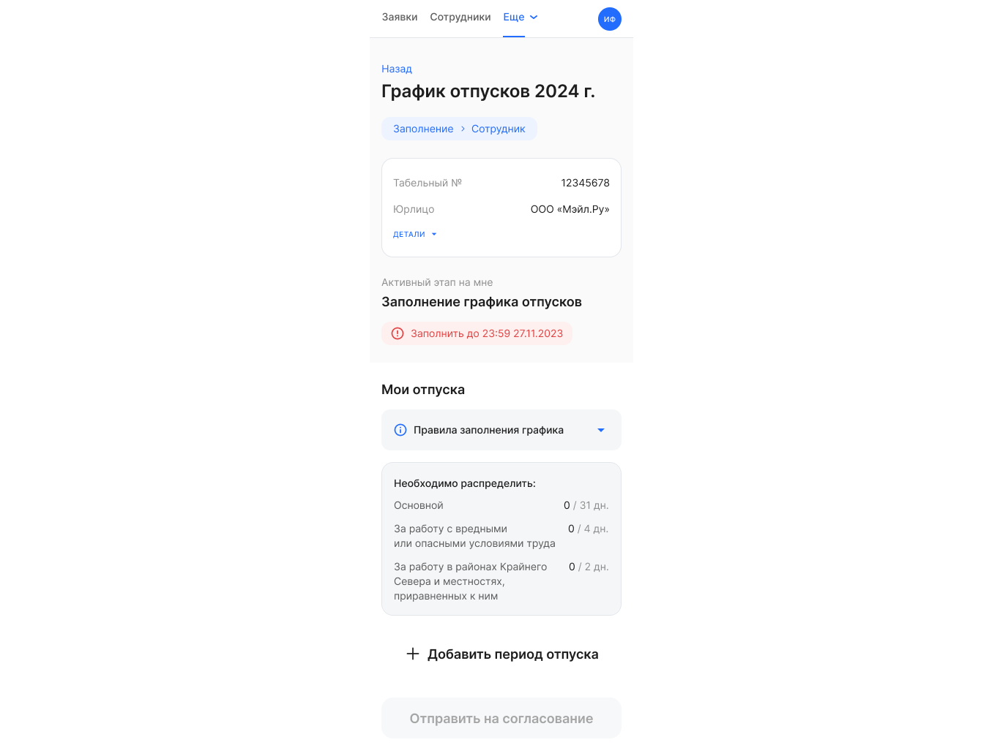

## **Для сотрудников и представителей компании**
### **Поддомены и способы авторизации**
Для клиентов, которые хотят использовать собственную авторизацию через Active Directory (AD) или определенные способы авторизации, предусмотренные в сервисе VK HR Tek, можно создать поддомен, например, вида test\_company.vkdoc.mail.ru и настроить авторизацию.

В рамках поддомена пользователю будут доступны только данные тех компаний, которые связаны с этим поддоменом. Например, если зайти на a\_company.vkdoc.mail.ru, то там не будет данных компании b\_company.

Пользователь может попасть в сервис с ограничением по поддомену:

- по ссылке с поддоменом, размещенной на портале компании;
- по ссылке с поддоменом из уведомления о выпуске УНЭП или заявке.

В Профиле сотрудника размещен QR-код для установки мобильного приложения и/или авторизации в нем в рамках поддомена. Пользователь должен один раз перейти по QR-коду и открыть приложение, а при последующей работе приложение будет автоматически открываться в поддомене.  

**Переход по ссылке с поддоменом на компьютере**

Пользователь переходит по ссылке, а система проверяет, авторизован ли пользователь в рамках поддомена или основного домена сервиса в зависимости от того, какая была открыта ссылка.

**Переход по ссылке с поддоменом на мобильном устройстве**

Если на мобильном устройстве пользователя не установлено приложение VK HR Tek, то откроется мобильная версия сервиса в браузере. Если приложение установлено на устройстве, то во время запуска приложение распознает ссылку и обнаружит значение поддомена (или «пусто» для основного домена).

Значение поддомена сохраняется при каждом переходе пользователя по ссылке.

**Способ авторизации**

Для поддомена можно определить способ авторизации, например, сотрудники на test\_company.vkdoc.mail.ru будут авторизовываться через OAuth (собственную AD авторизацию).

Если пользователь не был авторизован, то на странице входа будет предложен способ авторизации, который определен для домена/поддомена, куда перешел пользователь.

После авторизации пользователю доступны данные только по тем компаниям (скоуп компаний), которые привязаны к тому домену, в рамках которого авторизован пользователь.

Настройки этих функций являются платными. Для подключения обратитесь к вашему менеджеру внедрения VK HR Tek.

### **Атрибуты со справочниками**
Научились связывать текстовые атрибуты со справочниками. Например, атрибут «Список стран» можно связать со справочником «Страны», который хранится в базе данных VK HR Tek. Создаваться и обновляться эти справочники могут из 1С и публичного API.

На странице заявки атрибут со справочником будет отображен в виде поля с выпадающим списком значений из справочника с возможностью ввода и поиска текста из справочника.

Настройка этой функции является платной. Чтобы подключить атрибут со справочником для конкретного типа заявки, необходимо прописать данную опцию в JSON-файле бизнес-процесса. Для подключения обратитесь к вашему менеджеру внедрения VK HR Tek.

## **Для сотрудников**
Сотрудники могут просматривать и заполнять графики отпусков в *Личном кабинете* мобильной версии VK HR Tek.

## **Исправления**
1. Для кастомных уведомлений убрали ограничение на количество уведомлений в сутки.
1. Открыли заместителям руководителей доступ в *Кабинет компании*, даже если заместитель не относится ни к одной группе компании.
