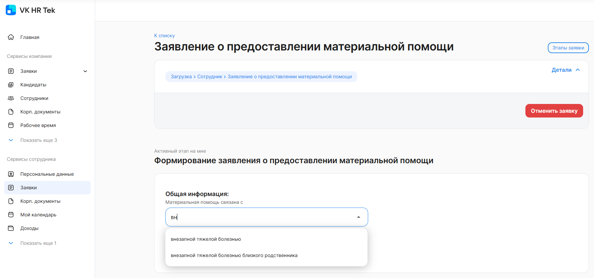
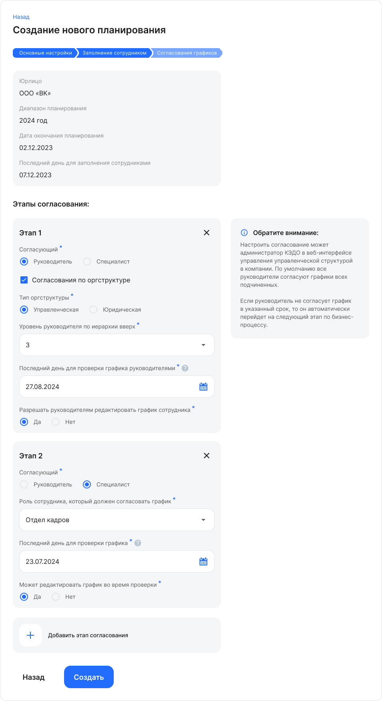
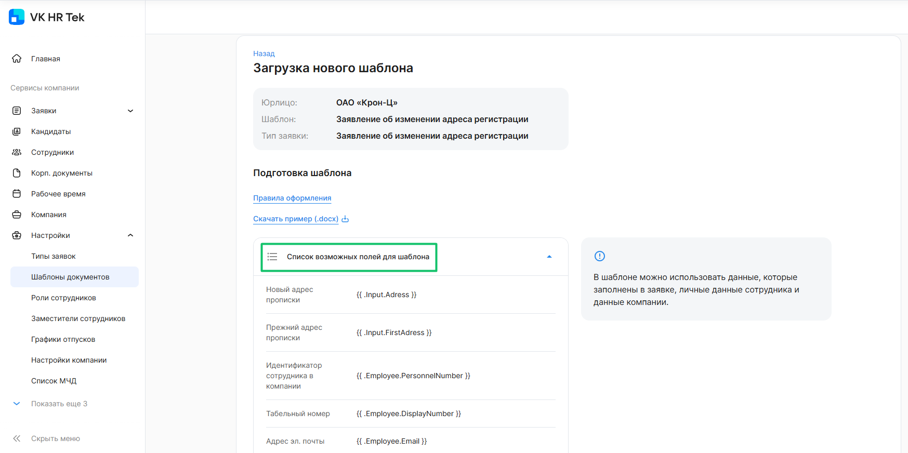
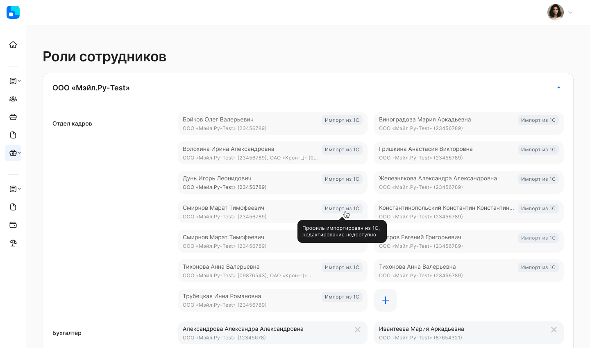

## **Главная страница**
В сервис VK HR Tek добавили главную страницу с виджетами, в которых собрана различная информация: действующие заявки пользователя, электронные сервисы компании и пр. Подробное описание в [статье](https://help.hrtek.ru/docs/hr/main_page).

## **Для представителей компании и сотрудников**
### **Атрибуты с поиском по значениям**
В заявках для полей, где из выпадающего списка можно выбрать хотя бы одно значение, добавили возможность поиска по значениям. При этом в выпадающем списке должно быть больше двух значений.

## **Для представителей компании и руководителей**
### **Рабочее время** 
В сервисы компании добавлен новый раздел **Рабочее время**, в котором показаны календарь с отсутствиями сотрудников по доступным подразделениям и список заявок с отсутствиями: отпуска, командировки, больничные и т.д. Подробности в [инструкции](/ru/hr/company/absence).

## **Для сотрудников**
### **Мой календарь**
Новый раздел **Мой календарь** позволит сотрудникам создавать заявки на отсутствия (отпуска, командировки, больничные и т.д.), просматривать список своих заявок на отсутствия и при необходимости переходить к их заполнению. Детали в [инструкции](/ru/hr/employee/absence).

### **Персональные данные**
В новом разделе **Персональные данные** указаны личные сведения о сотруднике, собранные в модули: общая информация, контакты, документы, образование и повышение квалификации, трудовой стаж и др. Более подробно в [инструкции](https://cloud.mail.ru/public/2NKM/wZarRZzJK/2.%20%D0%92%D0%BE%D0%B7%D0%BC%D0%BE%D0%B6%D0%BD%D0%BE%D1%81%D1%82%D0%B8%20%D0%90%D0%B4%D0%BC%D0%B8%D0%BD%D0%B8%D1%81%D1%82%D1%80%D0%B0%D1%82%D0%BE%D1%80%D0%B0%20%D0%B2%20%D0%9A%D0%AD%D0%94%D0%9E/%D0%A0%D0%B0%D0%B7%D0%B4%D0%B5%D0%BB%20%D0%BF%D0%B5%D1%80%D1%81%D0%BE%D0%BD%D0%B0%D0%BB%D1%8C%D0%BD%D1%8B%D1%85%20%D0%B4%D0%B0%D0%BD%D0%BD%D1%8B%D1%85.pdf).

## **Для менеджера графика отпусков**
Изменен процесс настройки согласования руководителями. Теперь можно указать согласующих, чередуя руководителей и специалистов. Возможность добавить нужную цепочку в процесс осталась: для этого нужно указать руководителей всех уровней по иерархии вверх (сколько необходимо). 

## **Для администратора web-сервиса** 
### **Шаблоны документов**
1\. В шаблонах документов научились склонять ФИО и должность сотрудников, ФИО руководителя организации.

Настройка этой функции является платной. Для подключения обратитесь к вашему менеджеру внедрения VK HR Tek.

2\. Для шаблонов документов добавили плейсхолдеры (поля):

- табельный номер сотрудника {{ .Employee.DisplayNumber }};
- данные о регистрации из паспорта {{ .User.RegistrationAddress }};
- название подразделения из оргструктуры (можно указать тип оргструктуры и какой уровень подразделения от текущего с ограничением количества).

Список доступных полей для шаблона документа можно найти в разделе **Настройки** → **Шаблоны документов** на этапе загрузки нового шаблона.

### **Новые валидаторы**
1\. В планировании графиков отпусков учитываются:

- наличие выходных дней в периодах по графику работы 5/2;
- запрет выбирать отпуск на менее чем 5 дней между выходными и праздничными днями.

2\. В заявках проверяются:

- наличие Х выходных дней в периоде Y при планировании отпуска;
- выбранная дата в атрибуте не должна быть раньше, чем дата найма сотрудника.

Настройки валидаторов являются платными. Для подключения обратитесь к вашему менеджеру внедрения VK HR Tek.

### **Профили доступа к данным сотрудников**
Добавили возможность импортировать Профили доступа из 1С (Группы физлиц = Профили доступа). После импорта групп и профилей доступа из 1С в разделе **Настройки** → **Роли сотрудников** будут указаны, каким сотрудникам были назначены профили, которые представители компании ведут в 1С.

Управление группами и профилями для пользователей, которые не работают в 1С, остается без изменений. 

Для тех, кто использует профили доступа в 1С, обратитесь за инструкциями по настройке импорта к вашему менеджеру VK HR Tek.

## **Исправления**
Вернули отображение управленческой структуры в алфавитном порядке.