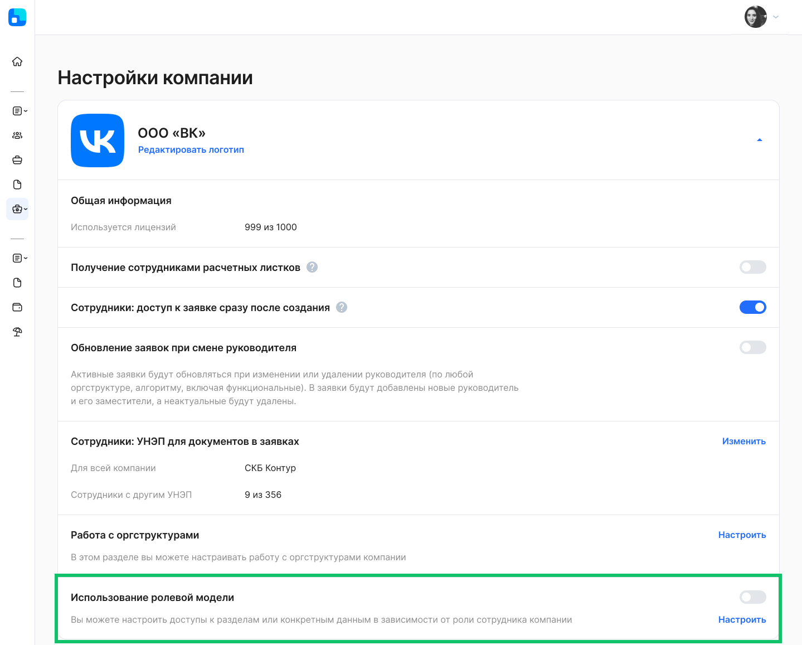
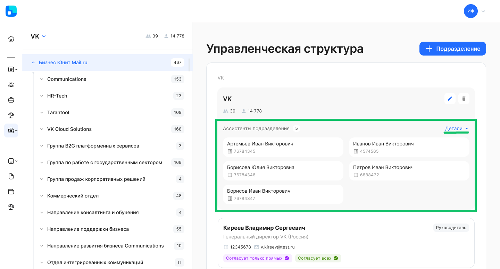
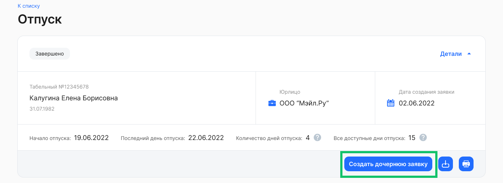

## **Ролевая модель доступа к данным**
В **Сервисы компании → Настройки → Настройки компании** добавлена настройка «Использование ролевой модели». Пользователь с ролью «Администратор» может настроить доступ к разделам целиком или к конкретным данным в зависимости от роли сотрудника в компании. Подробности в [статье](/ru/admin_actions/settings/settings_comp/role_model).

## **Ассистенты подразделений** 
В рамках управленческой структуры для каждого подразделения можно выбирать ассистента (административная роль в департаментах компании). Ассистент может быть указан исполнителем этапов заявки и рассчитывается по иерархии аналогично руководителям. Отличие ассистента от заместителя заключается в том, что заместитель назначается руководителю, а ассистент добавляется к подразделению.

О создании подразделения с ассистентами см. в [статье](/ru/admin_actions/management_structure/create_edit_division).

## **Уровень согласования для руководителей**
В **Сервисы компании → Настройки → Настройки компании** добавлена настройка «Уровень согласования для руководителя подразделения». Если руководитель является сотрудником в том же подразделении, которым руководит, то после включения этой настройки для руководителя подразделения будет создаваться этап согласования вышестоящим руководителем.

## **Согласования с поиском руководителей**
Если в заявке указан этап согласования руководителем, но у сотрудника по каким-то причинам отсутствует нужный руководитель, то в бизнес-процессе можно настроить обязательность согласования руководителем вышестоящего уровня.

Настройка поиска вышестоящих руководителей для выполнения этапа согласования в конкретном бизнес-процессе является платной. Для подключения обратитесь к вашему менеджеру VK HR Tek.

## **Приветствие на главной странице**

На главной странице VK HR Tek может отображаться приветствие сотрудника с одним именем или с именем и отчеством. Для настройки формата приветствия обратитесь в поддержку <support@hrtek.ru>.

## **Текст в кнопке «Создать дочернюю заявку»**
Добавили возможность изменять текст в кнопке «Создать дочернюю заявку».

Изменение текста кнопки для конкретного бизнес-процесса является платным. Для настройки обратитесь к вашему менеджеру VK HR Tek.

## **Исправления**
1. В разделе **Сервисы компании → Корп. документы** доработали выгрузки по ЛНА для случаев, когда количество строк превышает 1 048 576. Теперь данные xlsx-файла разбиваются на несколько листов, на первом листе — 1 000 000 строк.
1. Скорректировали отображение списка сотрудников в разделе **Сервисы компании → Рабочее время** при переходе по кнопке **Показать все** на больших экранах.
1. Перестали показывать дни отпуска уволенного сотрудника в виджете доступных дней в разделе **Сервисы сотрудника → Мой календарь**.
