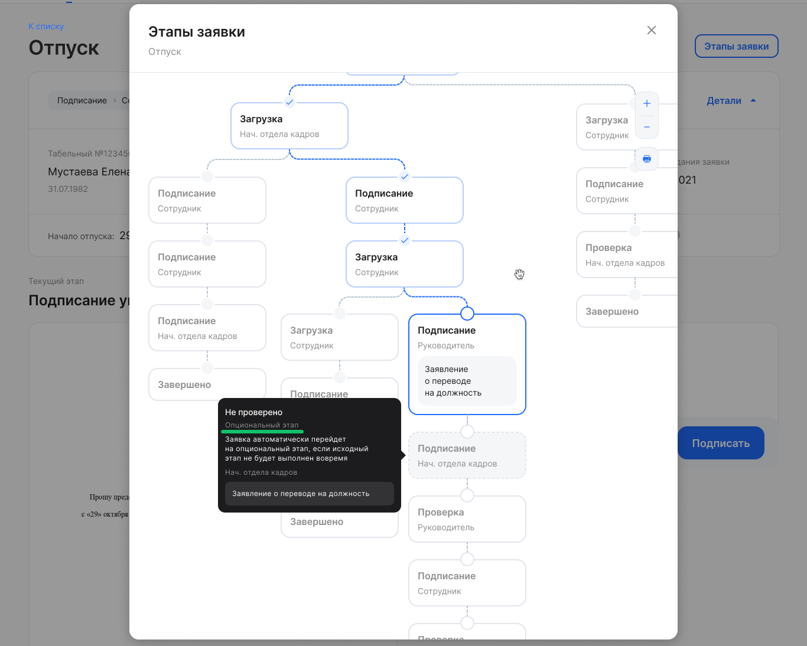

## **Работа с заявками**
### **Заявки без сотрудников**
1\. При создании заявки без участия сотрудника добавили возможность выбора согласующих. 

Настройка бизнес-процесса с выбором согласующих является платной. Для подключения обратитесь к вашему менеджеру VK HR Tek.

2\. Из формы создания заявки без участия сотрудника убрали переход к настройкам массовой рассылки.

### **Опциональный этап в заявке**
В заявку может быть добавлен опциональный этап с проверкой для случаев, если первый руководитель не успел согласовать заявку до дедлайна этапа. Тогда опциональный этап будет активирован для согласования вторым руководителем. Подробнее в [статье](/ru/hr/company/application/events/other_actions#opcionalnyy_etap_v_zayavke).

Настройка бизнес-процесса с опциональным этапом является платной. Для подключения обратитесь к вашему менеджеру VK HR Tek.

### **Кнопки действий на этапе**
На странице заявки объединили в один блок кнопки действий с текущим этапом. Кнопку «На доработку» расположили так, чтобы она была в одном «блоке» с остальными кнопками действий на этапе. Например, на этапе подписания документов появляется кнопка «Подписать документы», а рядом с ней кнопка «На доработку».  

### **Массовое согласование заявок**
Разрешили массовое согласование заявок из списка на стороне компании при условиях, что в заявках нет обязательных незаполненных данных и нет действия возврата на доработку. Подробнее в [статье](/ru/hr/company/application/events/other_actions#massovoe_soglasovanie_zayavok).

## **Электронная подпись**
Штамп на документе всегда расположен на отдельной странице в виде таблицы, а внизу каждой страницы документа добавлен маленький штамп. В штамп таблицы добавлен идентификатор документа согласно требованиям составления документов с электронной подписью.

## **Работа с кандидатами через публичный API**
В публичный API перенесли методы для работы с модулем найма со стороны компании:

- Получение компаний для создания анкеты кандидата.
- Фильтр списка кандидатов.
- Получение доступных анкет кандидата.
- Нахождение кандидата, который уже есть в системе, и др.

## **Исправления**
1. Список заявок, который нужно обработать сотруднику, открывается корректно при переходе по ссылке из уведомления.
1. Уведомления отправляются на электронную почту неуволенного сотрудника.
1. В уведомление об успешном выпуске УНЭП добавили условие про скрытие ссылки, если включена такая настройка для компании.
