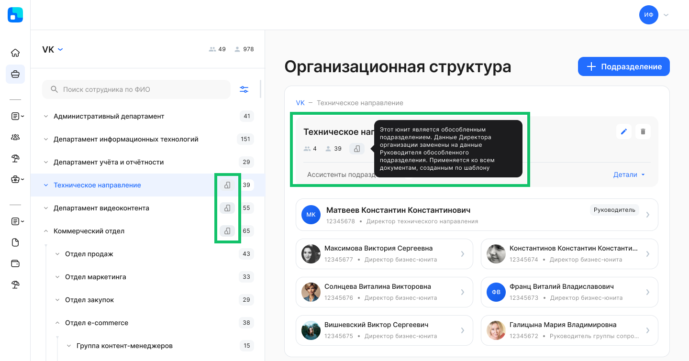

## **Для представителей компании, руководителей и сотрудников**
### **Страница сотрудника**
Страница сотрудника может быть доступна для руководителей и коллег. Доступ к странице настраивается в разделе **Настройки компании → Использование ролевой модели** (объект доступа «Сотрудник — Персональные данные»). Подробнее в [статье](/ru/admin_actions/settings/settings_comp/role_model).

Открыть страницу сотрудника можно в разделе **Организационная структура**, нажав на карточку сотрудника в выбранном подразделении. Подробности см. в [статье](/ru/admin_actions/management_structure/structure#poisk_sotrudnikov_v_podrazdeleniyah_kompanii).
### **Организационная структура** 
Для оргструктуры компании добавлен поиск сотрудников по ФИО, табельному номеру, должности и подразделению. Подробнее в [статье](/ru/admin_actions/management_structure/structure).

### **Настройка доступа к данным организационной структуры** 

Для доступа к организационной структуре компании включите настройку **Использование ролевой модели** (**Сервисы компании → Настройки → Настройки компании**). На странице **Настройка доступов к данным** в строке **Подразделения структуры** по умолчанию добавлена группа «Менеджер графика отпусков». 

Если включена настройка ролевой модели и для группы «Менеджер графика отпусков» удалён доступ к оргструктуре, то в списке сотрудников на исключение из планирования графиков отпусков будут только те, к которым есть доступ у сотрудника или руководителя.

Для сотрудников и руководителей можно выбирать следующие доступы:

- Вся оргструктура — доступны все подразделения компании;
- Только своё подразделение — доступно подразделение, в котором у пользователя есть неуволенный сотрудник;
- Своё и дочерние подразделения — доступны подразделение, в котором у пользователя есть неуволенный сотрудник, и все подразделения вниз по иерархии от него.
- Нет доступа — раздел **Организационная структура** недоступен для пользователей.

### **Отсутствия сотрудника**
В карточку сотрудника в разделе **Организационная структура** и на страницу сотрудника добавлены данные о текущих и предстоящих отсутствиях сотрудника: командировках, отпусках, больничных и др. Доступ к просмотру периодов отсутствий настраивается в разделе **Настройки компании → Использование ролевой модели**. 

### **Виджет с персональными ссылками**

Пользователи могут добавлять ссылки, необходимые им для работы, в настройках виджета **Персональные ссылки**. Настройка виджета на главной странице является платной. Для подключения обратитесь к вашему менеджеру VK HR Tek. 

### **«Шапка» главной страницы**
Уменьшена высота закрепляемой «шапки» при прокрутке страницы.

## **Для руководителей**
### **Назначение временных заместителей**
В разделе **Настройки → Заместители сотрудников** или в **Профиле пользователя** можно назначить заместителя на заданный период или период отсутствия, например, если руководитель планирует уйти в отпуск. Назначенный сотрудник будет автоматически удален из списка заместителей по окончании указанного периода для замещения. Подробности см. в [статье](/ru/admin_actions/management_structure/substitutes).

## **Для представителей компании и руководителей**
### **Выборка значений из списка заявок и сотрудников**
Появилась возможность сохранять собственные наборы выбранных значений в фильтрах списков заявок/сотрудников. Например, в фильтрах раздела **Заявки** выберите значение хотя бы для одного параметра и сохраните выборку.

После сохранения выборка появится в «шапке» списка заявок. При нажатии на название выборки открытый список будет отфильтрован по значениям, выбранным ранее.

## **Для представителей компании**
### **Работа со справочниками «ключ-значение»**
Ранее сервис VK HR Tek получал для элементов справочника только текстовые значения из публичного API (Public API).

Теперь сервис будет получать справочники, где для каждого элемента указывается ключ (код/идентификатор) и название элемента в сторонней системе. Сервис VK HR Tek (КЭДО) будет получать справочники по Public API.

Например: у клиента есть SAP, и SAP является мастер-системой для справочников. В КЭДО должны приходить только актуальные значения справочников. При этом в момент передачи данных по заявке, КЭДО должно возвращать не наименование элемента, а его ключ. Так для бизнес-процессов «Авансовый отчёт» и «Отчёт о расходах» КЭДО получит ключ = *RUB* и значение = *Российский рубль* из справочника «Валюты».

## **Работа с заявками**
### **Просмотр этапов заявки**
Обновили «шапку» заявок и добавили в неё компактный просмотр этапов заявки.

### **Создание заявки заместителем**
Заместитель может создавать заявки на сотрудника, который является подчиненным руководителя, которого он замещает.

### **Отмена заявки на определенном этапе**
 
Представитель компании может отменить заявку только на определенных этапах, где отображается кнопка **Отменить заявку**. Чтобы подключить ограничение отмены заявки на конкретных этапах бизнес-процесса (кнопка **Отменить заявку** будет отсутствовать на этапе), обратитесь к вашему менеджеру VK HR Tek. Настройка является платной.

### **Валидаторы**
1\. Для случаев, когда сотрудник хочет оформить заявку на отсутствие, но не знает, сможет ли создать определённый вид отсутствия на даты уже существующих согласованных отсутствий, добавлен валидатор, определяющий действие для пользователя при пересечении групп видов отсутствий.

Каждая группа видов отсутствий (отпуск, командировка и др.) имеет определённое действие, которое будет выполнено в ситуации пересечения с другой группой:

- запрет выбора определённого периода;
- выбор периода с выводом предупреждения, что на эти даты уже есть согласованное отсутствие.

2\. Добавлен валидатор, который не дает оформлять заявку в период, когда сотруднику запрещено брать командировку. Определенные даты в календаре будут заблокированы для выбора сотрудником, если они заполнены для него как запрещенные.

3\. На страницу заявки добавлено описание валидаторов.

<info>
Настройки валидаторов в заявках являются платными. Для подключения обратитесь к вашему менеджеру VK HR Tek.
</info>

## **Для администратора**
### **Работа с обособленными подразделениями**
Научились обозначать обособленные подразделения (филиалы и т.п.). При генерации документов сотрудников из таких подразделений следующие плейсхолдеры будут заполняться данными обособленного подразделения вместо данных компании:

- Company.Name: название обособленного подразделения;
- Company.LegalInfo.CeoFio: ФИО руководителя обособленного подразделения;
- Company.LegalInfo.CeoPosition: должность руководителя обособленного подразделения.

Чтобы указывать обособленные подразделения в компании, Администратор КЭДО должен включить настройку **Работа с обособленными подразделениями в оргструктуре**.

При добавлении/редактировании подразделения можно поставить отметку, что подразделение является обособленным. 

В оргструктуре обособленные подразделения будут обозначены следующим образом:

### **Группы видов отсутствий**

Для компании всегда заводятся 5 обязательных групп видов отсутствий (те, что используются в оргструктуре для указания отсутствия сотрудника):

- Отпуск;
- Декретный отпуск;
- Учебный отпуск;
- Больничный;
- Командировка.

Чтобы добавить новые группы видов отсутствий в компанию, обратитесь к вашему менеджеру VK HR Tek.

## **Исправления**
Скорректировали скачивание pdf-отчёта об изменениях в заявке.