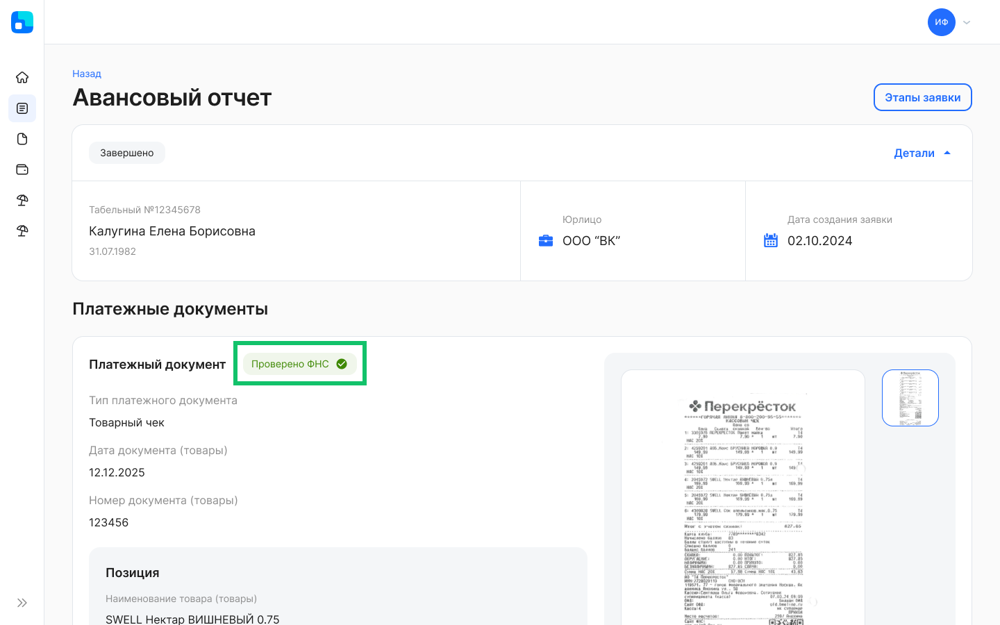

## **Для представителей компании**
### **Выбор нескольких подразделений или сотрудников при создании ЛНА**
В создание нового корпоративного документа добавили опцию выбора нескольких подразделений, должностей или конкретных сотрудников.

### **Опциональные этапы с загрузкой документов**
Для этапа с загрузкой документа на подписание можно настроить (через JSON) опцию, которая позволит перейти на следующий этап без загрузки документа. Переход возможен на тот же этап, что и в случае, если исполнитель загрузит документ. 

Настройка опциональных этапов является платной. Для подключения обратитесь к вашему менеджеру VK HR Tek. 

### **Статус заявки «В бумагу»**
Добавили новый этап «В бумагу» для заявок, которые были отменены по дедлайну и должны быть проведены в бумажном виде. Раньше такие заявки собирались в листинге **В бумагу** в статусе «Отменено».

### **Выбор сотрудника в атрибуте** 
Для работы с процессами на несколько сотрудников добавили возможность создавать заявку без сотрудника, в которой можно указать сотрудников в атрибутах.

Настройка этого бизнес-процесса является платной. Для подключения обратитесь к вашему менеджеру VK HR Tek.

### **Автоматическое создание дочерних заявок с сотрудниками из атрибутов**
В привязке дочернего типа заявки к родительскому добавили опцию автоматического создания дочерних заявок при успешном завершении родительской заявки.

**Кейсы и ограничения**

<table><tr><th><b>Родительский тип заявки</b></th><th><b>Дочерний тип заявки</b></th><th><b>Количество автосозданных дочерних заявок</b></th></tr>
<tr><td rowspan="2">
- без сотрудника

- без сотрудников в атрибутах
</td><td>- без сотрудника</td><td>1 дочерняя заявка без сотрудника.</td></tr>
<tr><td rowspan="2">
- без сотрудника

- без сотрудников в атрибутах
</td><td>- с сотрудником</td><td>Дочерняя заявка не может быть создана.</td></tr>
<tr><td rowspan="2">
- без сотрудника

- есть сотрудники в атрибутах
</td><td>- без сотрудника</td><td>1 дочерняя заявка без сотрудника.</td></tr>
<tr><td rowspan="2">
- без сотрудника

- есть сотрудники в атрибутах
</td><td>- с сотрудником</td><td>
N дочерних заявок на всех сотрудников из атрибутов родительской заявки.

В дочернюю заявку из родительской копируются атрибуты в случаях:

- если копируемый атрибут был объединен с сотрудником, на которого создаётся заявка;

- если копируемый атрибут не был объединен с другими атрибутами.
</td></tr>
<tr><td rowspan="2">
- с сотрудником

- без сотрудников в атрибутах
</td><td>- без сотрудника</td><td>1 дочерняя заявка без сотрудника.</td></tr>
<tr><td rowspan="2">
- с сотрудником

- без сотрудников в атрибутах
</td><td>- с сотрудником</td><td>1 дочерняя заявка на сотрудника из родительской заявки. </td></tr>
<tr><td rowspan="2">
- с сотрудником

- есть сотрудники в атрибутах
</td><td>- без сотрудника</td><td>1 дочерняя заявка без сотрудника.</td></tr>
<tr><td rowspan="2">
- с сотрудником

- есть сотрудники в атрибутах
</td><td>- с сотрудником</td><td>
N+1 дочерних заявок:

- на сотрудника из родительской заявки;

- на всех сотрудников из атрибутов родительской заявки.

В дочернюю заявку из родительской копируются атрибуты в случаях:

- если копируемый атрибут был объединен с сотрудником, на которого создаётся заявка;

- если копируемый атрибут не был объединен с другими атрибутами.
</td></tr>
</table>

Для включения опции автосоздания дочерних заявок обратитесь к вашему менеджеру VK HR Tek. Настройка связанных заявок является платной.

### **Привязка справочника к компании**
Реализована возможность загружать один справочник к нескольким компаниям в рамках одного аккаунта. 

Чтобы добавить новые справочники к компании, обратитесь к вашему менеджеру VK HR Tek. Настройка является платной.

### **Массовая отмена заявок**
Добавили массовую отмену заявок со стороны компании. Массово отменить можно только те заявки, на активном этапе которых доступна кнопка «Отменить».

Для массовой отмены по умолчанию включены три причины отмены: «Такое мероприятие уже есть в работе», «Другое», «Ошибочно созданная заявка». Причина отмены у всех заявок одна, выбранная при массовой отмене.

Для включения других причин отмены заявок обратитесь к вашему менеджеру VK HR Tek.

### **Выборка значений из списка кандидатов**
Появилась возможность сохранять собственные наборы выбранных значений в фильтрах списка кандидатов.

### **Заявки без сотрудников**
Руководители могут создавать заявки без сотрудников. Чтобы руководитель имел доступ к созданной заявке, у заявки должен быть исполнитель с ролью «Создатель заявки».

Заявки без сотрудника добавляются только через платную донастройку. Для подключения обратитесь к вашему менеджеру VK HR Tek. 

### **Выбор заместителей**
В разделе **Настройки → Заместители сотрудников** и **Профиле** пользователя изменили поле с выбором заместителя. В выпадающий список добавлены:

- новый набор данных сотрудника: ФИО, должность, название компании (если несколько компаний в аккаунте);
- полный список сотрудников в компании.

### **Справочники и группы видов отсутствий** 
Сервис VK HR Tek может получать справочники видов отсутствий и классифицировать их по определённым группам.

Для компании всегда заводятся 5 обязательных групп видов отсутствий (те, что используются в организационной структуре web-сервиса для указания отсутствия сотрудника):

- Отпуск;
- Декретный отпуск;
- Учебный отпуск;
- Больничный;
- Командировка.

Чтобы добавить новые группы видов отсутствий в компанию, обратитесь к вашему менеджеру VK HR Tek.

## **Для сотрудников**
### **Графики отсутствий коллег**
Просмотр графиков отсутствий коллег доступен в разделе **Мой календарь** c визуальным разделением видов отсутствий.

Для включения видимости графиков отсутствий коллег по подразделению или всей компании обратитесь к вашему менеджеру VK HR Tek.

### **Верификация чека в ФНС**
Сотрудник прикладывает подтверждающие документы на расходы в период командировки при создании заявки на авансовый отчет. Расходные чеки загружает в форму для проверки в ФНС.

После проверки чека в ФНС информация о чеке автоматически заполняется в заявке. Если чек прошел верификацию, то отображается информация о пройденной проверке. Если чек не прошёл верификацию, то отображается информация о том, что атрибуты заполнены вручную.

Настройка распознавания чеков в бизнес-процессе авансового отчета является платной. Для подключения обратитесь к вашему менеджеру внедрения VK HR Tek.

## **Для сотрудников и представителей компании**

### **Реквизиты руководителя в шаблоне документа**
В шаблон документа добавлены плейсхолдеры (поля с данными) с реквизитами юридического и прямого руководителей первого уровня.

В случае когда пользователь заполняет документ, в котором необходимо указать реквизиты руководителя сотрудника (ФИО, должность, подразделение), документ будет автоматически заполняться корректными реквизитами руководителя первого уровня.
### **Уведомления согласующим в заявках**
Теперь пользователи, у которых нет групп и которые были выбраны согласующими на старте создания заявок, будут получать уведомления о заявках.

Для включения уведомлений обратитесь в техподдержку <support@hrtek.ru>, подробнее об уведомлениях в [статье](/ru/hr/notifications).

### **Уведомления: отображение дедлайна -1 мин (23:59)**
В тексте уведомления, где указано время окончания выполнения этапа в заявке, сократили время дедлайна на одну минуту в конце суток. 

Пример: 

- Дедлайн 00:00 13.03.2025.
- Отображение в тексте уведомления: «до 23:59 12.03.2025».
 
### **Количество дней в периодах отпуска/отсутствий/оценки** 
Вернули счётчик количества дней отпуска/отсутствий/оценки в «шапку» заявки.

### **Даты командировок**
Для отображения выбранных дат командировки в «шапке» заявки добавили новую пару атрибутов — дата начала и дата окончания командировки.

### **Изменения в дизайне элементов сервиса**
1\. Изменили расположение кнопки создания дочерней заявки в мобильной версии сервиса.

2\. Если на форме создания заявки присутствует только один тип заявки, то название этого типа заявки будет предварительно выбрано.

3\. Добавили «заглушки» для всех видов пустых списков в разделах сервиса.

## **Для технических специалистов**

В Public API добавили метод, который будет передавать события логов активности (activity\_log) в SIEM систему клиента.

## **Исправления**
1. Скорректировали порядок в ФИО в разделе **Персональные данные**.
1. Настроили отображение подсказок к рассчитываемым атрибутам на странице заявки.
1. В рассчитываемых атрибутах заявки отделили праздничные дни от выходных согласно производственному календарю.
1. В разделе **Сотрудники** подкорректировали работу фильтров.
1. В мобильной версии сервиса починили кнопку **Создать заявку**.
1. Вернули даты в подсказке при отображении графика отпусков на год.
1. В разделе **Рабочее время** убрали уволенных сотрудников из формы фильтров.
1. Убрали возможность смены номера телефона при включенной настройке инсталляции «без управления телефоном».
1. На главной странице показали дни отсутствия сотрудника в виджете «Мой календарь».
1. Изменили логику выдачи результатов при фильтрации списка графиков отсутствий.