## **Для всех пользователей**
### **Просмотр документов**
1\. Добавили возможность увеличивать или уменьшать размер документа при его просмотре. Изменение масштаба доступно для документов:

- сформированных по шаблону (только в режиме просмотра заявки); 
- загруженных к заявке только в формате pdf (при создании, редактировании и просмотре заявки);
- ЛНА (просмотр сотрудником и представителем компании);
- расчётных листков.

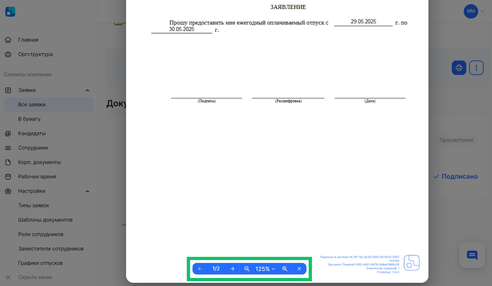

2\. Иногда в отрисовке штампов случаются ошибки, и в этом случае штамп не будет отображаться на странице документа. При этом документ будет иметь юридическую силу. 

В заявке появится сообщение о том, что штамповка документа пропущена. 

### **Ограничение символов в атрибуте заявки**
Для текстовых атрибутов заявки можно задать ограничение на количество символов, включая пробелы.

Настройка атрибута в бизнес-процессе является платной. Для подключения обратитесь к вашему менеджеру VK HR Tek.

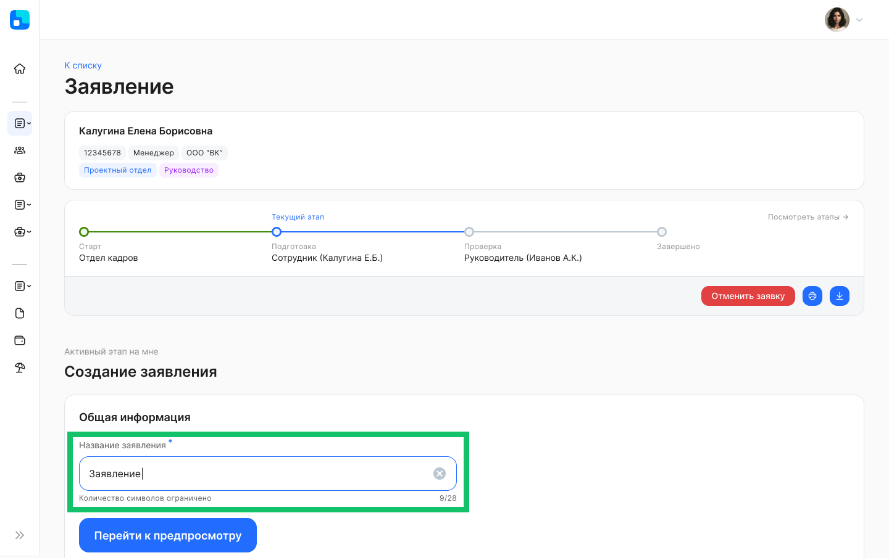

### **Скачивание корпоративного документа (ЛНА)**
В разделе **Корпоративные документы** сотрудники могут скачивать ЛНА только актуальных версий в формате pdf.

Представители компании могут скачивать корпоративные документы как последних, так и прошлых версий.

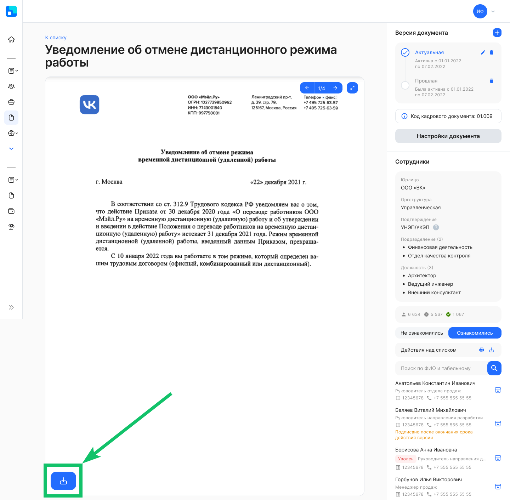

Чтобы кнопка скачивания стала доступной, Администратор КЭДО должен включить настройку **Сотрудники: доступ на скачивание корпоративных документов** в разделе **Настройки компании**.  

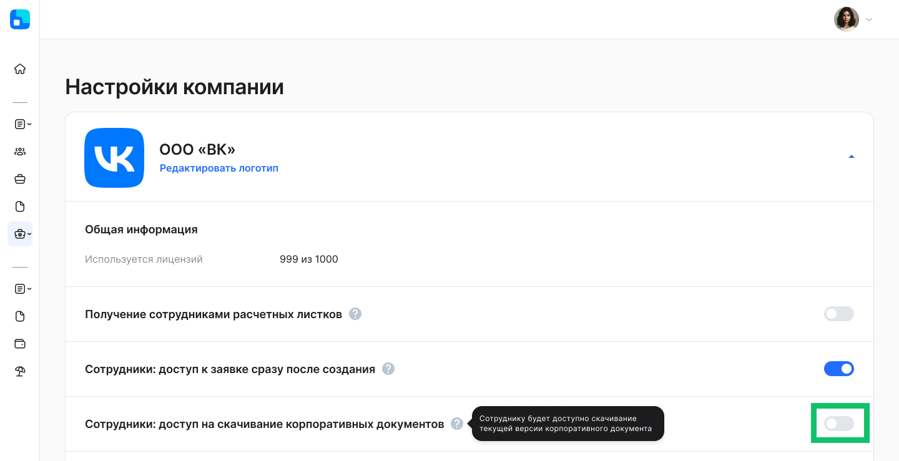

### **Персональные данные**
В разделе **Персональные данные сотрудника** можно скачать данные о наградах в формате pdf.

Выгрузка содержит следующие данные:

- ФИО, компания, должность и подразделение сотрудника;
- наименование награды;
- дата и номер приказа, по которому была присвоена эта награда;
- дата выгрузки данных.

Скачивание возможно только при наличии доступа к блоку данных о наградах сотрудника. Чтобы блок стал доступен для представителей компании, руководителей и других сотрудников, настройте ролевую модель компании для данных о наградах. 

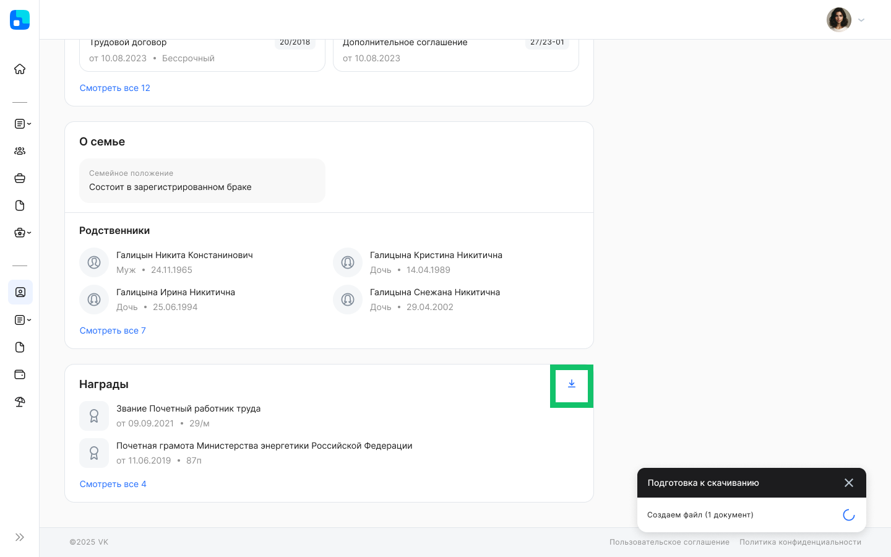

### **Уведомления**
1\. Добавлена опция, позволяющая отключить уведомления об ознакомлении с ЛНА в выходные/праздничные дни. Для отключения таких уведомлений обратитесь в техническую поддержку <support@hrtek.ru> или к вашему менеджеру VK HR Tek.

2\. В уведомления, которые поступают сотрудникам и руководителям по заявкам от разных компаний (если есть аккаунт компаний), добавили данные о согласовании планируемых графиков отпусков, если такие планирования есть у сотрудников.

Пример уведомления

**Тема: Заявки подчиненных ожидают ваших действий в КЭДО**

Дорогой коллега,

В системе есть заявки подчиненных, которые нужно обработать.

**ООО "Ромашка"**

**Дедлайн завтра:** 1 заявка

- Должностная инструкция: 1

**На тебе:** 3 заявки\
**Сегмент Продажи:**

- Приказ о предоставлении премии: 2
- Уведомление о начале отпуска: 1

**ЗАО "Василек"**

**На тебе:** 2 заявки\
**Сегмент Логистика:**

- Отпуск: 2

**Требуется согласование в планировании графиков отпусков:**

- Смирнов А.П. (ООО "Ромашка"), согласовать до 15.06.2025: [example.com/company/vacations/123](http://example.com/company/vacations/123)
- Кузнецова Е.В. (ЗАО "Василек"), согласовать: [example.com/company/vacations/223](http://example.com/company/vacations/223)

### **Мобильная версия сервиса**
В **Профиле** пользователя обновили отображение данных о сотруднике.

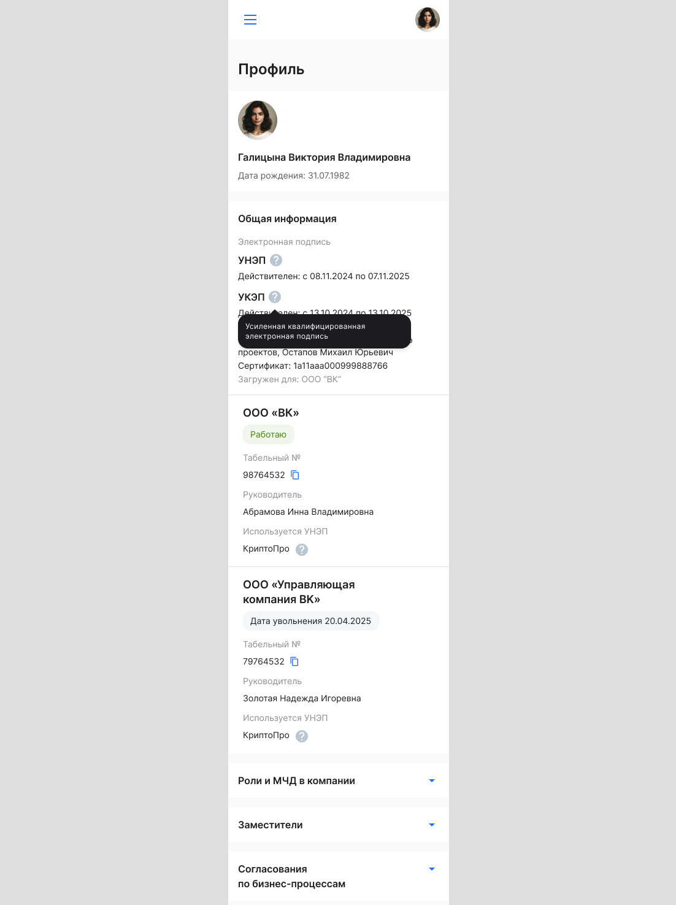

## **Для представителей компании**

### **Заявки с массовой рассылкой**
Для заявок с массовой рассылкой добавили новые возможности для случаев, когда в бизнес-процессах:

- присутствуют загрузка документа и заполнение текстовых атрибутов;
- присутствует загрузка документа и отсутствует заполнение текстовых атрибутов;
- отсутствует загрузка документа и присутствует заполнение текстовых атрибутов;
- отсутствуют загрузка документа и заполнение текстовых атрибутов.

Настройка бизнес-процесса является платной. Для подключения обратитесь к вашему менеджеру VK HR Tek.

Пример заявки с загрузкой документа и заполнением текстовых атрибутов:

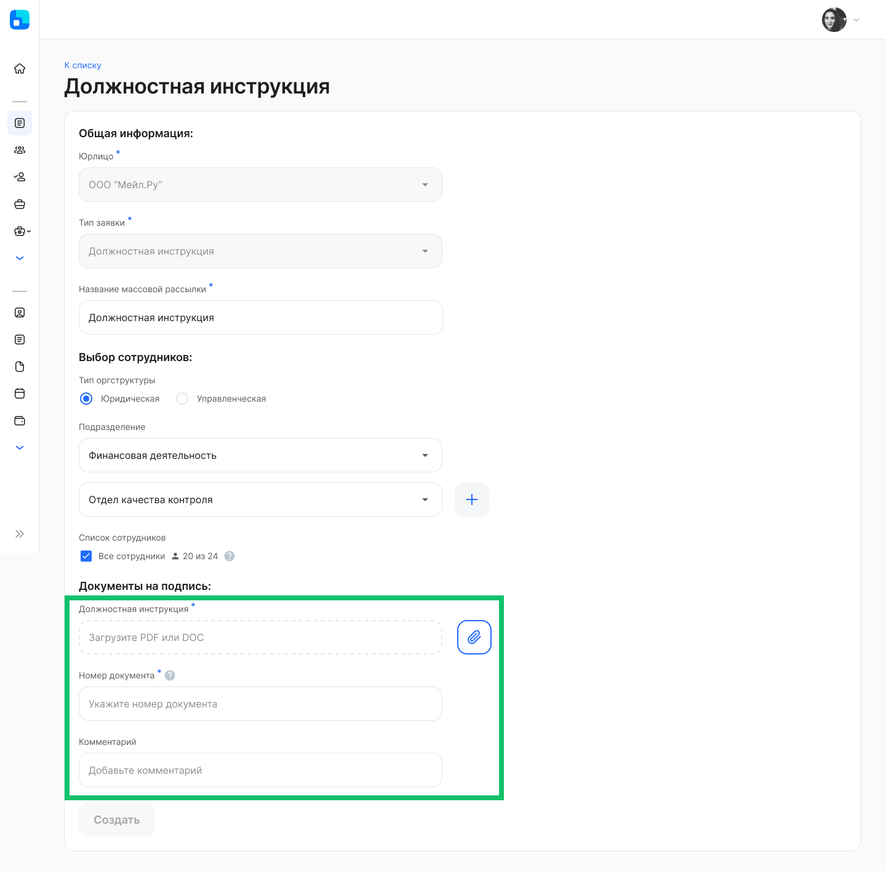

### **Пропуск этапов с любыми действиями**
В заявках могут быть пропущены этапы с подписанием, загрузкой/генерацией документа при наступлении дедлайна. 

Пример заявки:

1) загрузка документа произошла (нет дедлайна на этапе *Загрузка*); 

2) документ перешёл на этап подписания (есть дедлайн на этапе *Подписание*);

3) этап подписания будет пропущен и заявка перейдёт на следующий этап, если дедлайн будет просрочен.

Настройка бизнес-процесса с пропуском этапов является платной. Для подключения обратитесь к вашему менеджеру VK HR Tek.

### **Отчёт об изменениях заявки**
В отчёт по изменениям заявки добавили:

- новый столбец «Наименование этапа», в котором отображаются действия, выполненные на этапе.
- информацию о возврате этапа на доработку, если в заявке был такой возврат.

### **Фильтр по пакету заявки**
В фильтре **По пакету заявки** доступен выбор всех или нескольких значений.

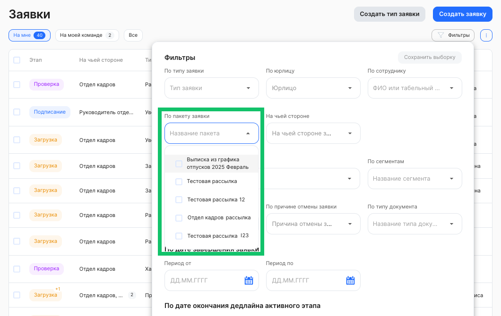

### **Фильтр по группе доступа**
В раздел **Сотрудники** добавили фильтр по группе доступа. Фильтр будет доступен, если компания использует группы доступа.

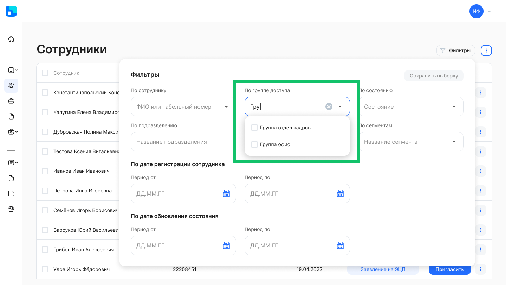

### **Изменение настроек корпоративного документа**
Доступно редактирование настроек в корпоративном документе после его публикации. В документе можно изменить:

- возможность скрыть версию документа после ознакомления сотрудником;
- тип организационной структуры;
- подразделение(-я);
- должность(-и);
- сотрудника(-ов).

Если внесённые изменения сохранены, то документ доступен изменённому набору пользователей для ознакомления и пользователям, которые уже ознакомились с документом (независимо от того попали ли они в новую выборку или нет).

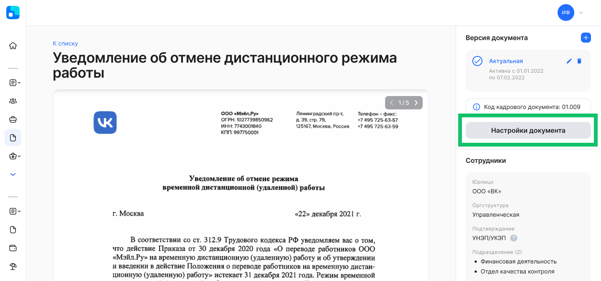

### **Видимость типов заявок**
Администратор КЭДО может управлять видимостью типов заявок в разделе **Сервисы компании → Настройки → Типы заявок**. Чтобы показать тип заявки в списке доступных при создании новой заявки, выберите необходимый бизнес-процесс из списка и включите настройку **Использование типа заявки**.

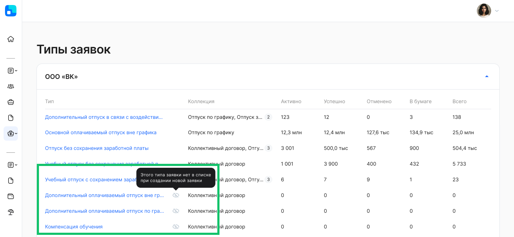

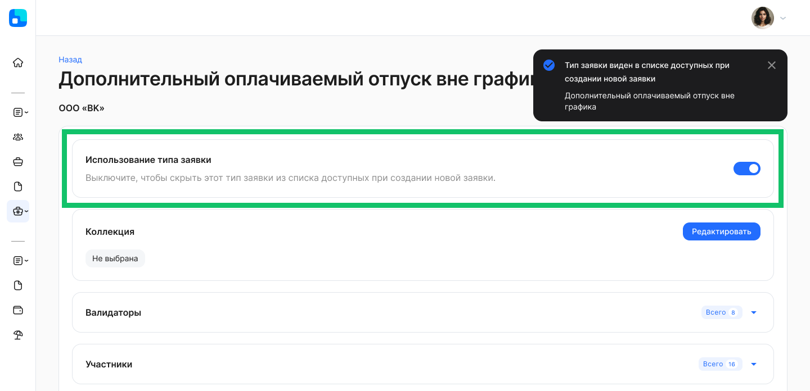

### **Изменение данных генерального директора**
Администратор КЭДО может отредактировать ФИО и должность генерального директора компании и изменить эти данные по падежам. Для этого откройте настройку **Юридическая информация** в разделе **Настройки компании** и заполните необходимую информацию.

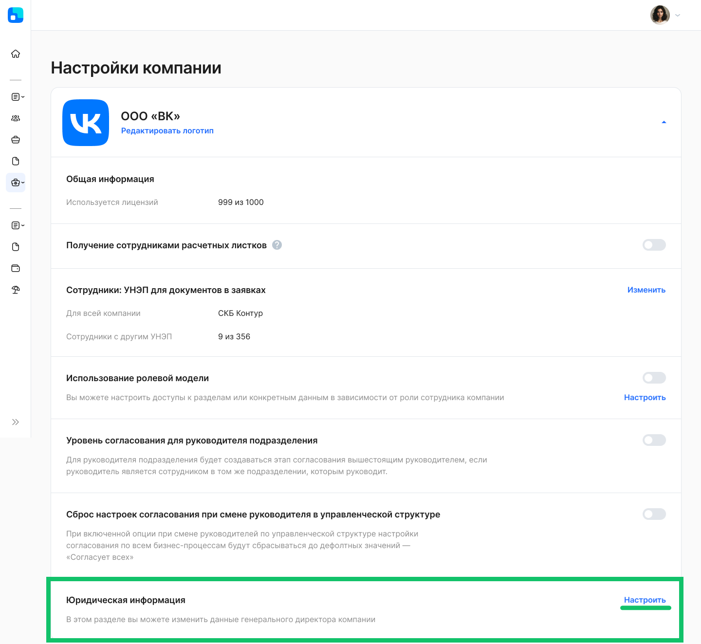

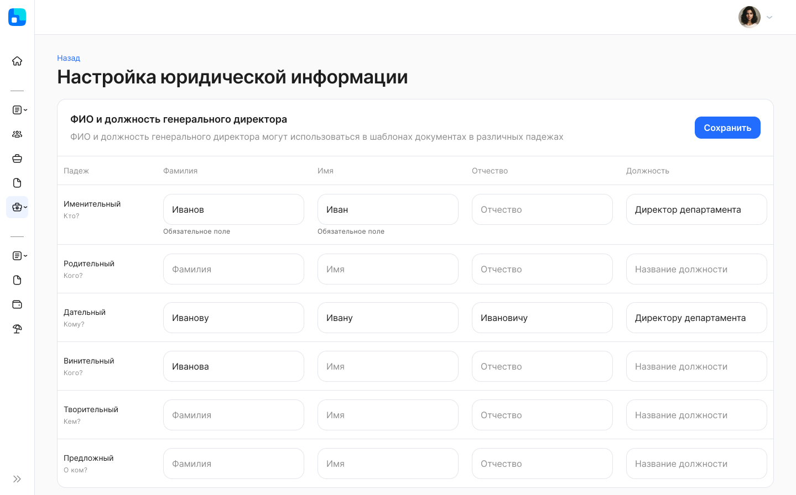

## **Для сотрудников**
### **Запланированные отсутствия**
При создании заявки на отсутствие сотрудник может выбрать период нового отсутствия, ориентируясь на даты ранее запланированных отсутствий.

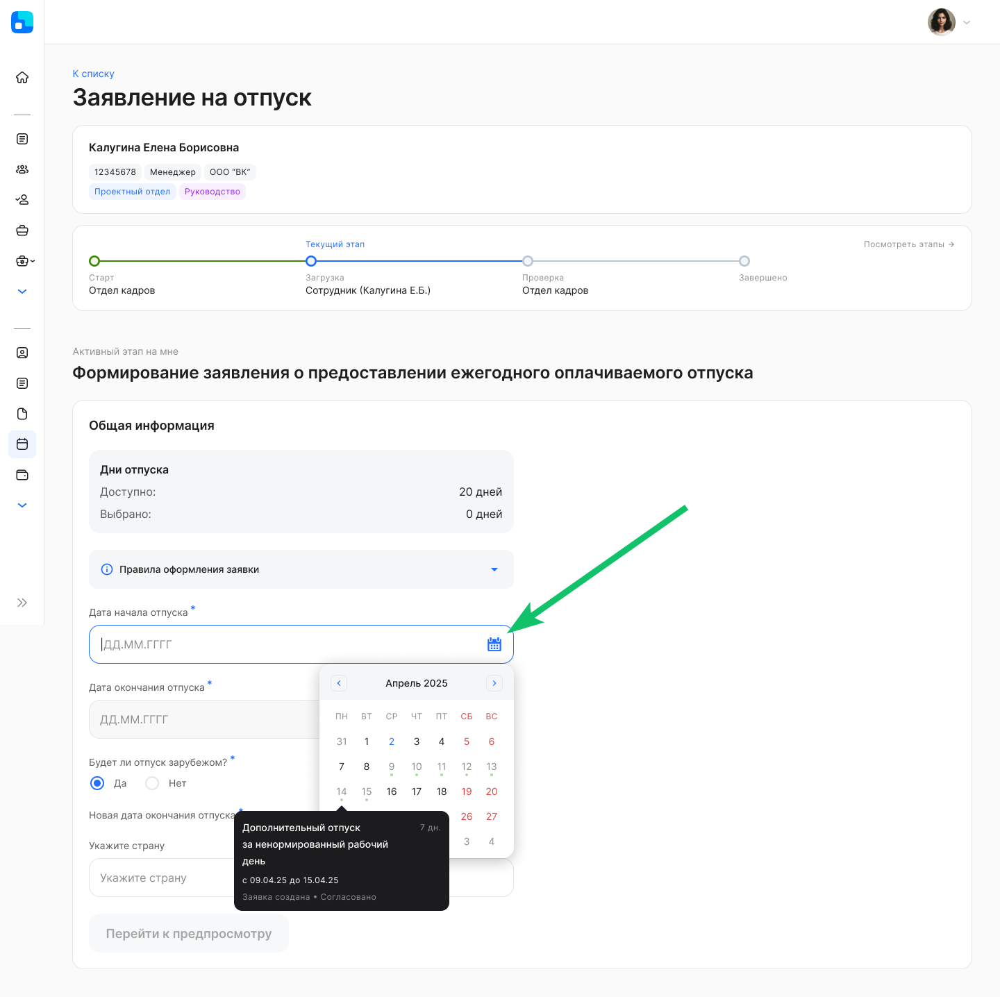

### **Превышение доступного количества дней**
Для заявок с отсутствиями доступен валидатор, который считает общее количество дней во всех указанных периодах и предупреждает, если это число превысило лимит. 

Если при выборе периода дат отсутствия сотрудник превысил доступный ему лимит по всем видам отсутствий, то в заявке отображается сообщение о превышении доступного количества дней. При этом сотрудник может создать заявку.

Настройка валидатора является платной. Для подключения обратитесь к менеджеру VK HR Tek.

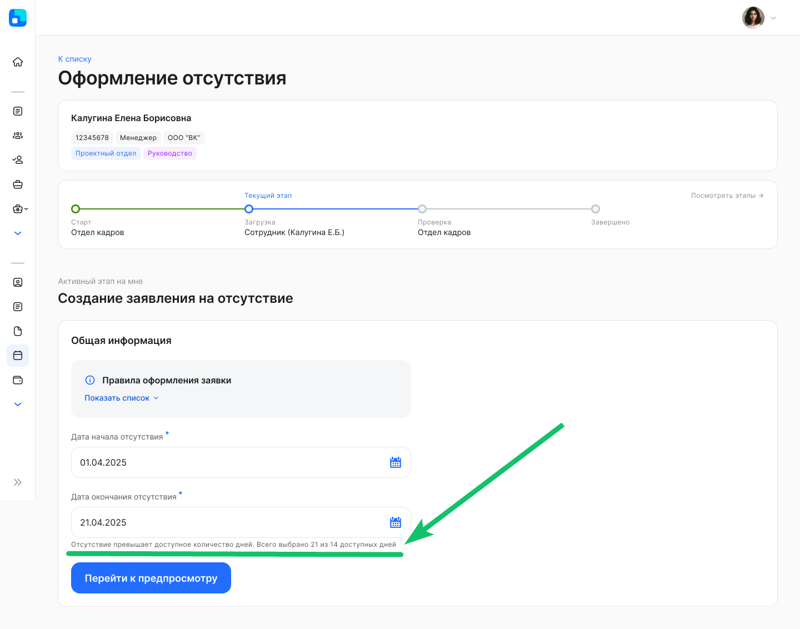

### **Электронная подпись**
Для иностранных сотрудников необязательно указывать ИНН для выпуска усиленной неквалифицированной электронной подписи (УНЭП УЦ Контур). В таком случае, если у иностранного сотрудника отсутствует ИНН, то этап валидации ИНН будет пропущен при выпуске УНЭП.

Для сотрудников РФ ИНН обязателен при выпуске УНЭП.

## **Исправления**
1. Поправили текст, появляющийся в случае возникновения ошибки СМЭВ.
1. В разделе **Рабочее время**, для выбранной компании корректно открывается полный **График отсутствий** при нажатии кнопки **Показать все** в конце календаря.
1. Скорректировали данные в **Профиле** пользователя для случаев, когда у пользователя отсутствует выпущенный УНЭП.
1. При редактировании бизнес-процесса в разделе **Настройки → Типы заявок** исправили ошибку с пустым наименованием справочника, возникавшую в JSON.
1. При просмотре этапов заявки после возврата на доработку отображается исполнитель этапа.
1. В мобильной версии настроили корректное отображение подсказок.

