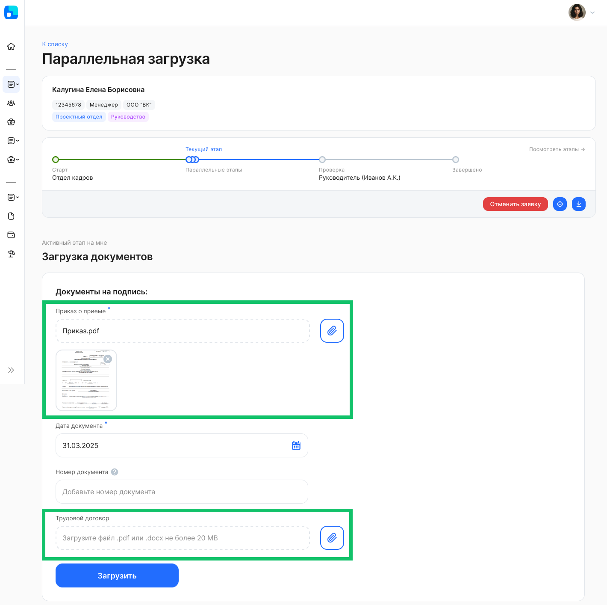
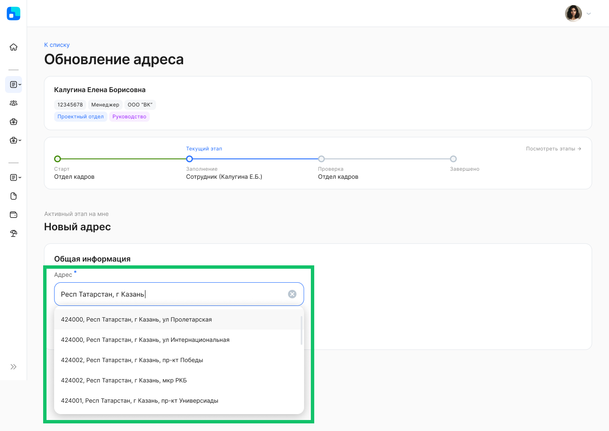
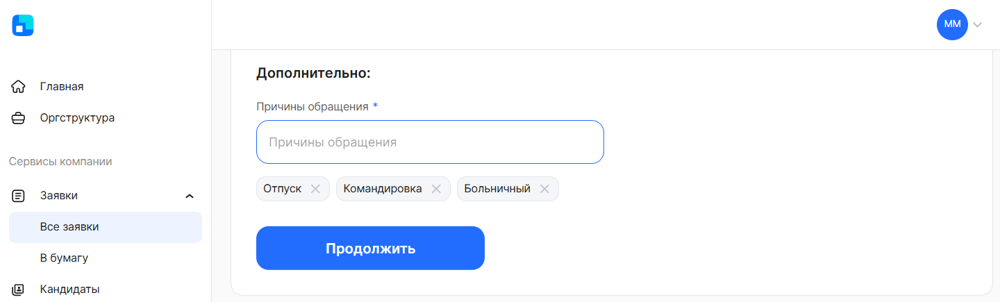
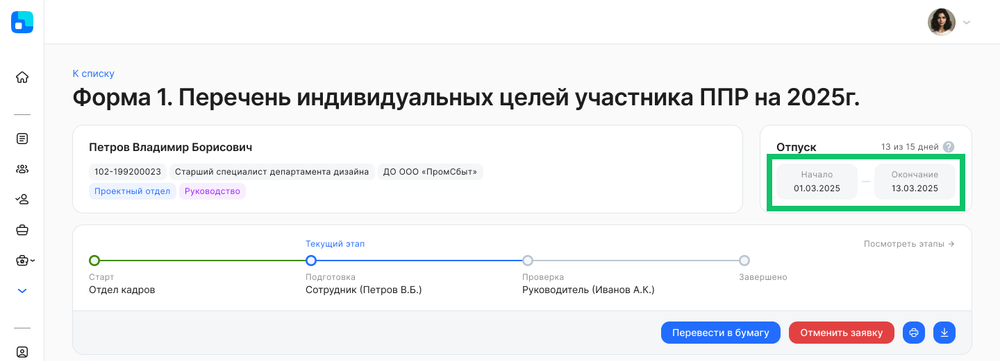
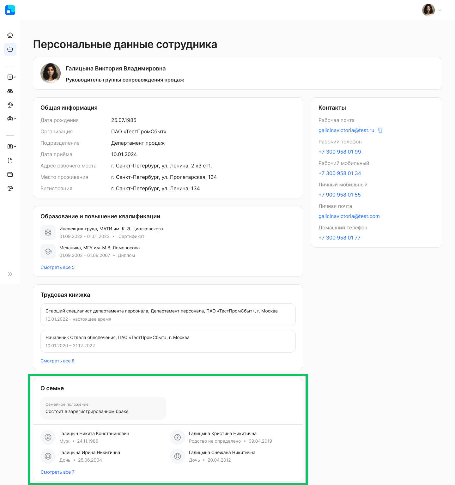
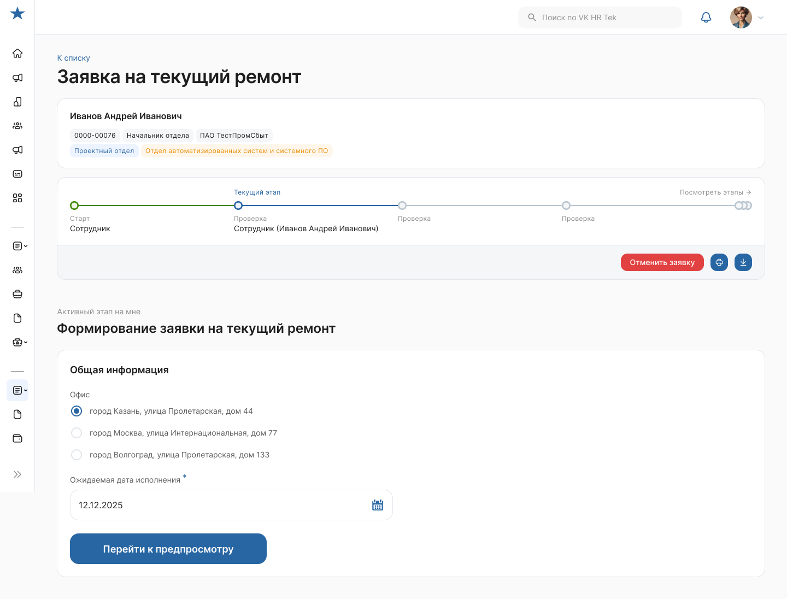
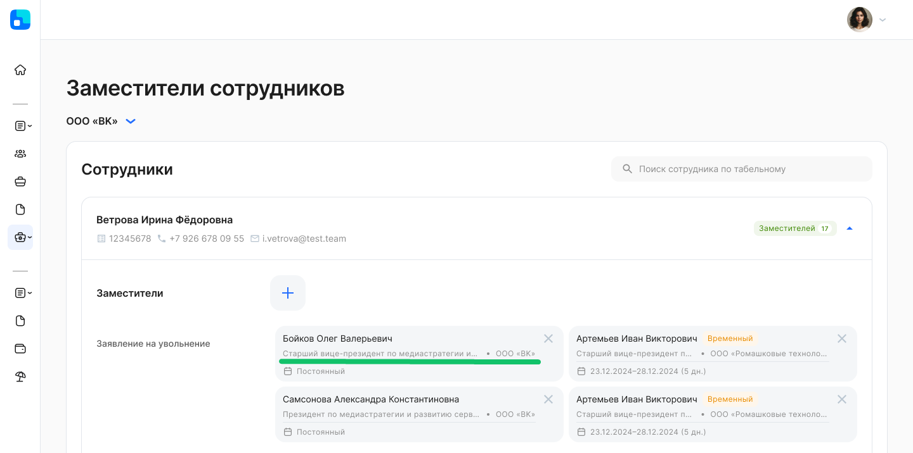

## **Для всех пользователей**
### **Параллельная загрузка документов**
Для заявок с несколькими параллельными этапами «Загрузка» обновлён интерфейс одновременной загрузки нескольких документов. В бизнес-процессах могут поддерживаться обязательные и необязательные для загрузки типы документов.

### **Пропуск этапа с подписанием**
Если в заявке на этапе подписания не найден руководитель (или ассистент руководителя) сотрудника, то при включенной опции пропуска этапа в бизнес-процессе система проверит наличие вышестоящего руководителя/ассистента относительно предыдущего. И в случае если вышестоящий руководитель/ассистент будет найден, переведёт этап с подписанием на него, иначе пропустит этот этап.

Настройка пропуска этапа с подписанием в бизнес-процессе является платной. Для подключения обратитесь в службу поддержки VK HR Tek <support@hrtek.ru>.

### **Поддержка справочника ГАР**
Пользователь может вводить адрес в поле заявки в соответствии с форматом Государственного адресного реестра (ГАР). Система покажет адреса из поискового запроса в выпадающем списке, обращаясь к сервису [DaData «Подсказки по адресам»](https://dadata.ru/api/suggest/address/). После выбора адреса система заполнит поле заявки данными по адресу по шаблону ГАР и сохранит полный ответ от сервиса DaData по выбранному адресу.

Поддержка справочника ГАР в бизнес-процессе является платной. Для подключения обратитесь в службу поддержки VK HR Tek <support@hrtek.ru>.

### **Мультивыбор в атрибутах для пополняемых справочников**
В заявке при заполнении поля можно выбирать несколько значений из справочника, а также вводить и выбирать новые произвольные значения.

Настройка этого атрибута в бизнес-процессе является платной. Для подключения обратитесь в службу поддержки VK HR Tek <support@hrtek.ru>.

### **Период отсутствия в заявке**
В верхней части заявки поменяли текст в блоке с подсчётом дней для периода отсутствия.

### **Валидаторы**
Пользователь может подтвердить даты в заявке и перейти на следующий этап, если атрибуты с датами не редактируются на текущем этапе. В этом случае валидаторы «Минимальное количество дней между датой подачи заявки и датой события» и «Максимальное количество дней между датой подачи заявки и датой события» на текущем этапе не будут применяться к полям, недоступным для редактирования дат.

Настройка этих валидаторов на этапах с нередактируемыми атрибутами является платной. Для подключения обратитесь в службу поддержки VK HR Tek <support@hrtek.ru>.

### **Персональные данные**
В разделе **Персональные данные сотрудника** можно просмотреть данные о своем семейном положении и составе семьи, если эти сведения были внесены в карточку сотрудника в модуле 1С и включена передача этих данных из 1С.

Также пользователи могут просматривать данные о семейном положении другого сотрудника и составе его семьи, если эти сведения были внесены в карточку сотрудника в модуле 1С и включена передача этих данных из 1С. В этом случае просмотр возможен только при наличии доступа к блоку «О семье». Чтобы блок стал доступен для представителей компании, руководителей и других сотрудников, настройте ролевую модель компании для данных о семейном положении и родственниках. 

### **Уведомление о возврате на доработку**
При возврате заявки на доработку пользователь получает уведомление о возврате на доработку, а не стандартное уведомление о переходе на этап.

Для подключения уведомлений о возврате на доработку обратитесь в службу поддержки VK HR Tek <support@hrtek.ru>.

### **Отключение уведомлений для этапа**
В заявке могут быть отключены уведомления на определённом этапе. Пользователь не будет получать уведомления до тех пор, пока заявка не перейдёт на следующий этап, для которого могут отправляться уведомления.

Отключение уведомления для этапа бизнес-процесса является платным. Для отключения обратитесь в службу поддержки VK HR Tek <support@hrtek.ru>.

## **Для представителей компании**
### **Отчёт по изменениям в заявках**
В отчёте по изменениям будет формироваться ссылка на заявку с учётом поддомена компании пользователя, если такой поддомен есть у компании. Если у компании отсутствует поддомен, то в отчёте используется ссылка по умолчанию.

### **Управление дизайном интерфейса портала**
Дизайн интерфейса КЭДО можно изменить с учётом данных в дизайн-токене. Дизайн-токен — это набор установленных правил и параметров, чтобы сделать дизайн системы визуально согласованным.

В рамках дизайн-токена можно изменить стили текстовых блоков, радиусы скругления компонентов, цветовую схему (текста, брендовых цветов), акцентные цвета.

Изменение элементов в дизайне КЭДО возможно только при использовании поддомена в компании и является платным. Для подключения обратитесь в службу поддержки VK HR Tek <support@hrtek.ru>.

### **Данные заместителей**
В разделах **Сервисы компании → Настройки → Заместители сотрудников** и в **Профиле** руководителя, в карточках заместителей обновили набор данных: должность и компания.

## **Для сотрудников**
### **Электронная подпись** 
В заявлении на выпуск УНЭП Контур не заполняется адрес электронной почты сотрудника, если этот адрес не был заполнен в карточке сотрудника при подключении к КЭДО. 

