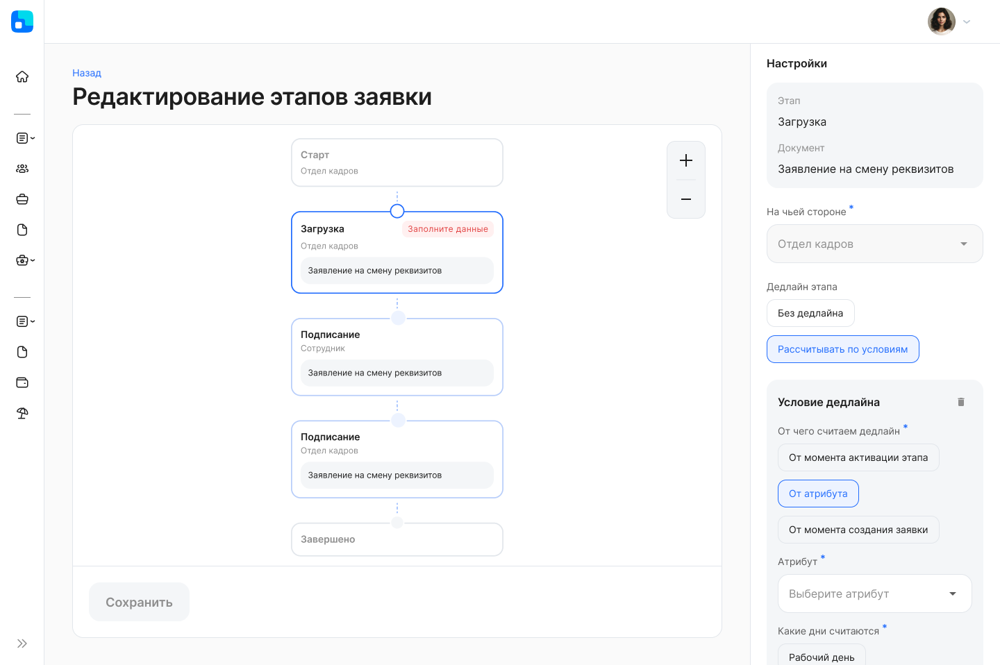
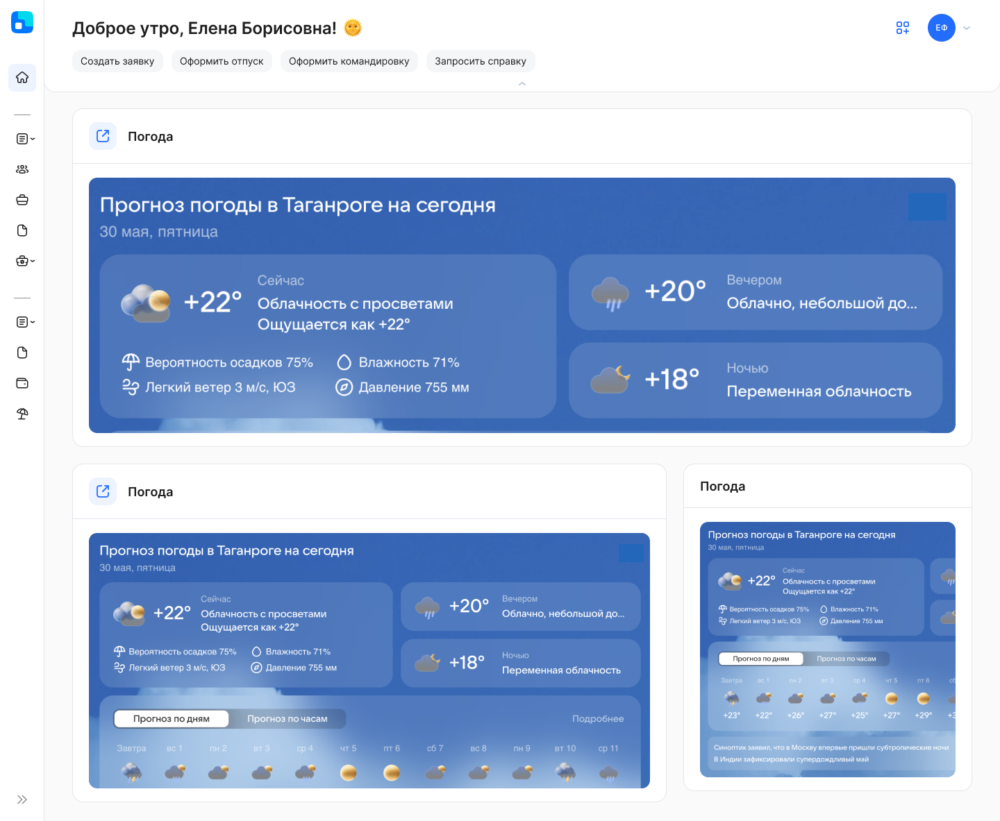
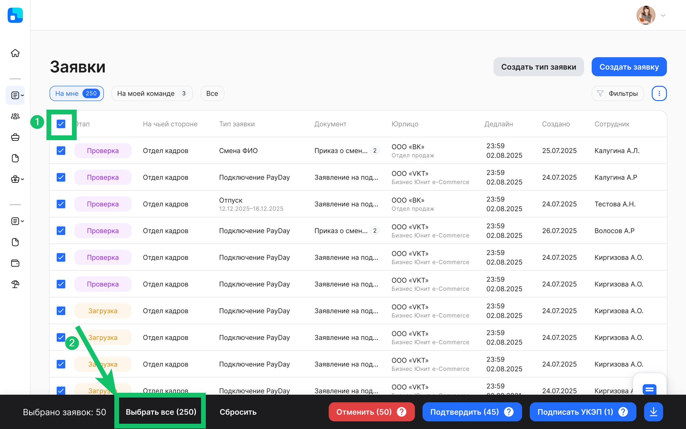
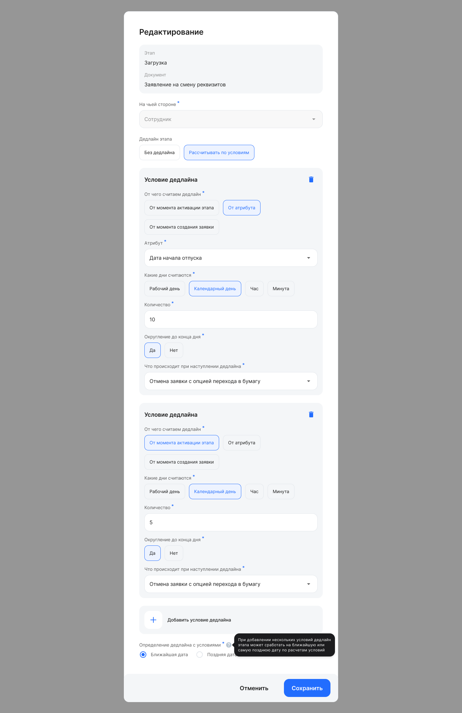
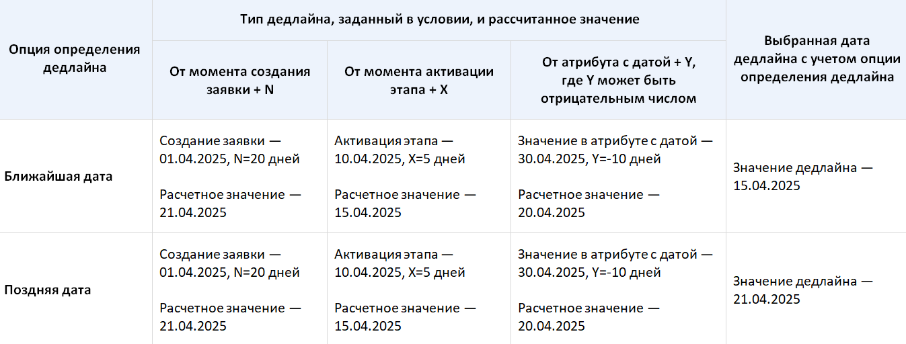
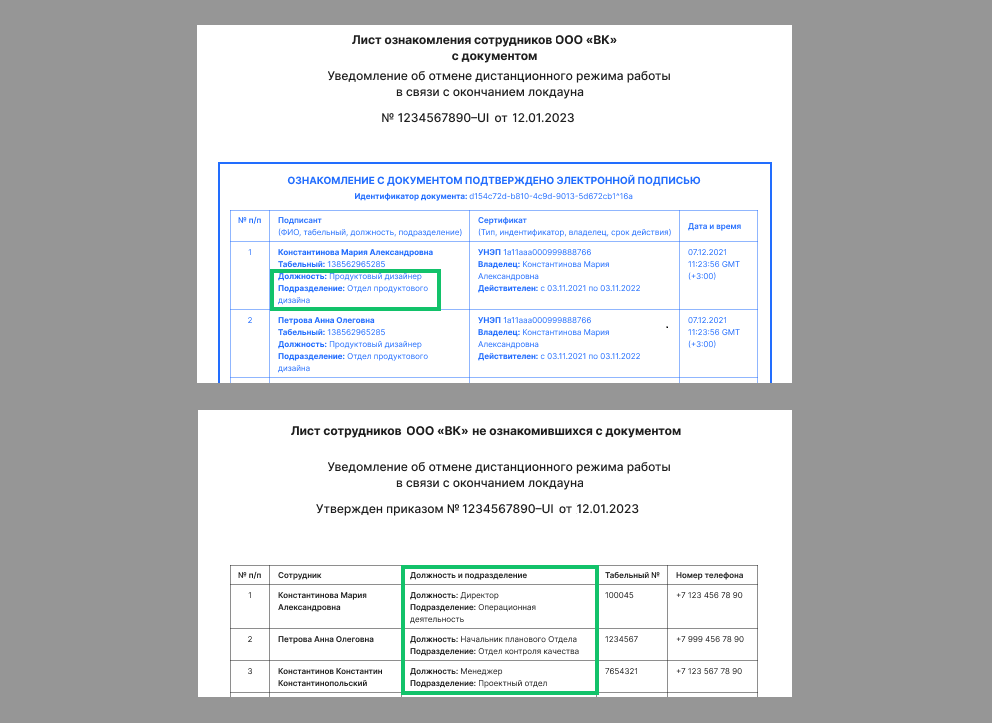

## ****Типы заявок****

В раздел **Настройки → Типы заявок** добавлена боковая панель, где Администратор КЭДО может редактировать настройки на этапах доступного бизнес-процесса, а затем сохранить все внесённые изменения для этапов одновременно.  

Нажмите на этап, чтобы в боковой панели появилась информация для изменения настроек дедлайна и исполнителя. На этапах, где Администратор КЭДО приступил к редактированию и при этом не заполнил все обязательные поля, появится метка «Заполните данные».

## ****Виджет с внешними данными****

На главную страницу сервиса может быть добавлен виджет, который был реализован партнёром клиента и получает данные из внешнего источника через API.

Виджет может располагаться как на главной странице и иметь различные размеры, так и целиком занимать отдельную страницу сервиса.

Настройка виджета с внешними данными является платной. Для подключения обратитесь в службу поддержки VK HR Tek [support@hrtek.ru](mailto:support@hrtek.ru).

## ****Шаблоны документов****

На этапе заявки может быть сформирован документ по шаблону для сотрудника, у которого нет непосредственного руководителя. В таком документе заполняются поля данными с вышестоящим руководителем, которого система нашла по иерархии вверх согласно допустимому ограничению со стороны управленческой или юридической организационной структуры.

## ****Заявки****

---

## ****Создание заместителями заявок без сотрудника****

Заместители руководителей могут создавать заявки без сотрудника в разделе **Сервисы компании → Заявки**.

## ****Массовые действия с заявками****

Представитель компании может одновременно выбирать все заявки, расположенные на всех страницах списка, где требуется выполнить какое-либо доступное действие: согласование, отмена, подписание и скачивание.

Ограничение на количество заявок, которое можно согласовать/отменить или скачать за раз массово — не более 1000, а для подписания заявок УКЭП — не более 500 за раз.

Массовые действия доступны в разделах **Заявки** и **Рабочее время**.

Чтобы выбрать заявки на всех страницах списка, выделите все заявки на открытой странице и нажмите кнопку **Выбрать все**.

## ****Массовое согласование заявок с этапом возврата на доработку****

При массовом выборе заявок представитель компании может согласовать заявки, у которых на текущем этапе возможен возврат на доработку.

Массовое согласование в заявках с возвратом на доработку доступно в разделах **Заявки**, **Рабочее время** и **Кандидаты**.

## ****Дедлайны****

Администратор КЭДО может задать до трёх условий для вычисления дедлайна на этапе заявки в разделе **Настройки → Типы заявок**.

По каждому заданному условию рассчитываются свои дата и время дедлайна. Затем Администратор выбирает одну из опций определения дедлайна:

- Ближайшая дата (по умолчанию).
- Поздняя дата.

Пример расчета дедлайна по каждому из условий:

## ****Корпоративные документы****

В лист ознакомления/неознакомления сотрудников с документом добавили сведения о должности и подразделении.

## ****Электронная подпись****

Сервис инициирует перевыпуск УНЭП за один час до окончания срока действия подписи.

## ****Уведомления****

Представитель компании или прямой руководитель сотрудника могут получать уведомления о приближающемся дедлайне этапа заявки на сотруднике.

Для подключения уведомлений о возврате на доработку обратитесь в службу поддержки VK HR Tek [support@hrtek.ru](mailto:support@hrtek.ru).

## ****Исправления****

1.  При перезагрузке страницы **Мой календарь** остаётся наименование той компании, на которую переключился сотрудник, если компания входит в аккаунт.
2.  При загрузке документа с некорректным форматом или размером выводится сообщение об ошибке файла.
3.  В разделе **Рабочее время** не отображаются уволенные сотрудники, которые не заполняли график отпусков.