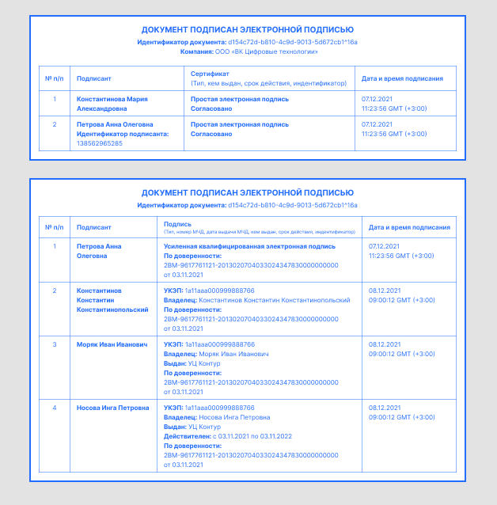
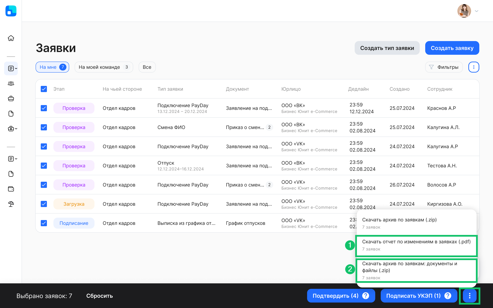
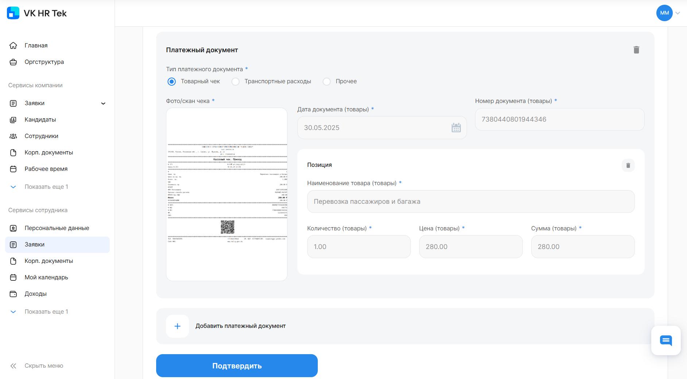
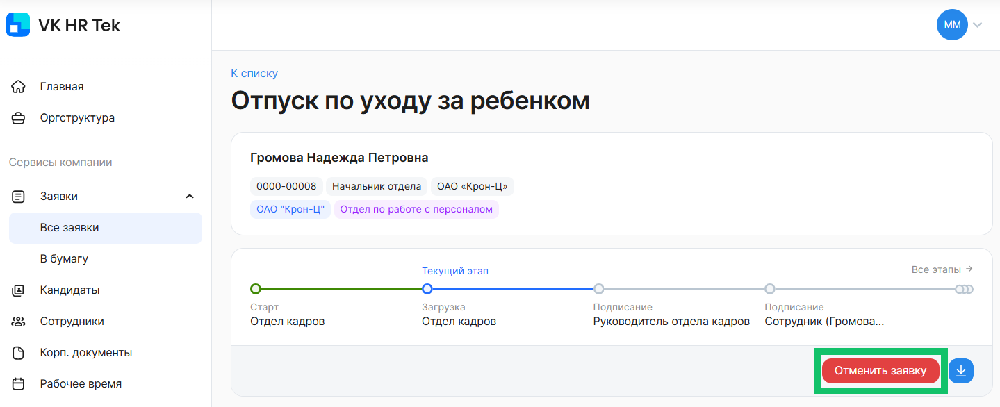
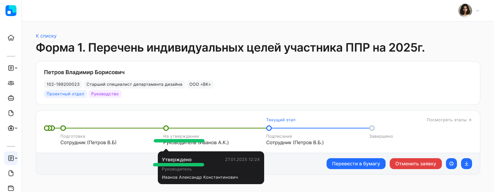
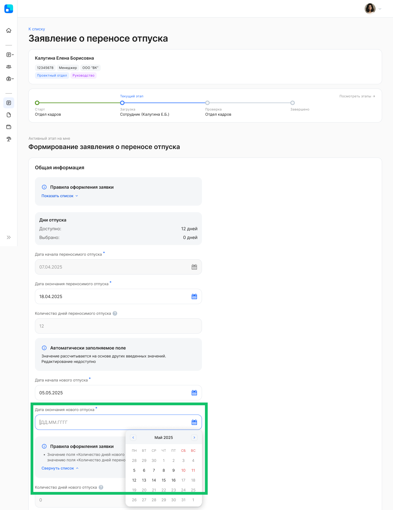
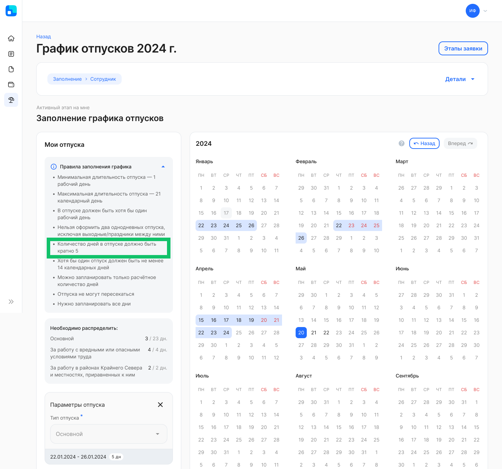
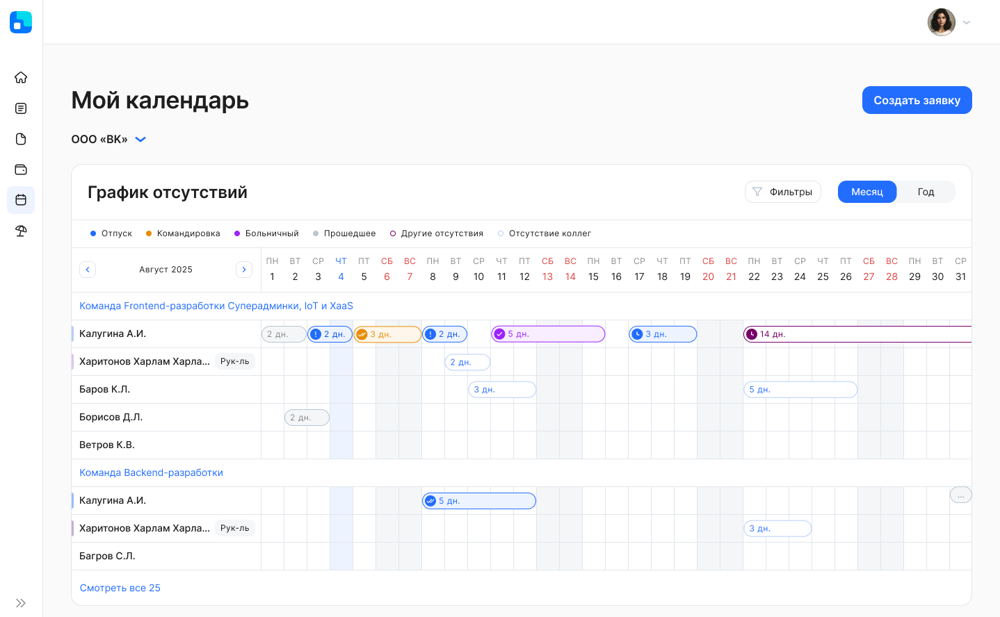
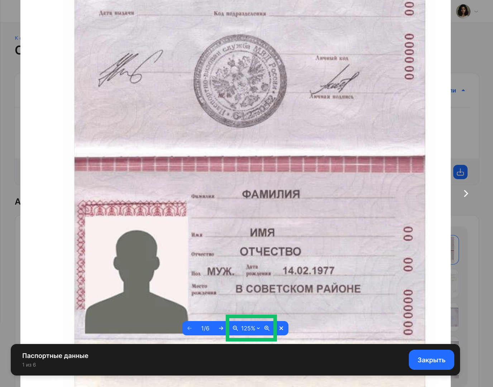

## **Персональные данные**
При отключении обмена для модуля персональных данных сотрудника данные будут удаляться из КЭДО.  Обязательные данные не будут удалены.

Если потребуется включить ранее отключенный модуль, то в раздел **Персональные данные** будут добавлены данные из карточки сотрудника в 1С.

Список обязательных данных и модулей, которые можно включить/отключить для обмена данными, описан в [статье](/ru/hr/employee/personal_data).  

Для включения/отключения импорта модулей с персональными данными обратитесь в поддержку VK HR Tek <support@hrtek.ru>.

## **Электронная подпись**
Добавили новые опциональные данные (идентификатор подписанта и название компании) для использования в штампе электронной подписи, в том числе номер и дату МЧД.

Для подключения этой возможности обратитесь в поддержку VK HR Tek <support@hrtek.ru>. После изменения данных в штампе новый вид будет применяться только к новым документам.

Все возможные данные, которые могут отображаться в штампах ПЭП и УКЭП:

## **Массовые действия с заявками**
1. Перенесли скачивание отчёта по изменениям в заявках в массовые действия со списком заявок. Если выбрана одна заявка из списка, то будет скачан один отчёт в pdf-формате, а если выбрано больше одной заявки — zip-архив с pdf-файлами.
1. По одной или нескольким заявкам можно скачать архив, в котором кроме документов из заявки, будут и файловые атрибуты (вложенные файлы).

## **Авансовый отчёт**
В бизнес-процесс по авансовому отчёту добавили проверку чеков в ФНС для платёжных документов **Транспортные расходы** и **Прочее**. Ранее распознавание и верификация чеков были доступны только для платёжного документа с типом **Товарный чек**.

Подключение модуля «Авансовый отчёт» является платным и настраивается индивидуально для каждого клиента. Для настройки обратитесь к вашему менеджеру VK HR Tek.

## **Отмена заявки**
Добавили ограничение отмены заявки: только активный исполнитель этапа может отменить заявку, за исключением указанных групп, которым доступна отмена вне зависимости от этапа.

Пользователь может отменить заявку (доступна кнопка **Отменить заявку**) только в том случае, если он:

- является исполнителем текущего этапа заявки;
- имеет группу/роль, указанную в исключениях. В этом случае пользователи с такими ролями могут отменять заявки на любом этапе, независимо от того, являются ли они текущими исполнителями этапа или нет.

Если отмена заявки на определённых этапах полностью недоступна, то в этом случае ни один пользователь не может отменить заявку, даже если он исполнитель этапа или входит в список исключений.

Настройка опции по ограничению отмены заявки в бизнес-процессе является платной. Для подключения обратитесь в службу поддержки VK HR Tek <support@hrtek.ru>.

## **Этапы заявки**
В заявках с кастомными статусами можно задавать разные названия статуса до и после прохождения этапа заявки. Такие статусы позволяют понять, изменились ли состояния пройденных этапов или нет.

Кастомные статусы отображаются в подсказках при наведении курсора на этап.

Пример кастомного статуса для этапа **На утверждении**:

- **Первый статус (было):** *На утверждении*
- **Второй статус (стало):** *Утверждено*

Настройка кастомных статусов на этапах является платной. Для подключения обратитесь в службу поддержки VK HR Tek <support@hrtek.ru>.

## **Атрибуты заявки**
Добавили возможность выводить значения, ключи или ключ-значения в выпадающем списке для атрибута с типом «справочник».

Пример вывода **значения** для справочника «Валюты»: *Российский рубль, Доллар США*.

Пример вывода **ключа**: *RUB, USD*.

Пример вывода **ключ-значения**: *Российский рубль (RUB), Доллар США (USD)* или *RUB — Российский рубль, USD — Доллар США*.

Настройка является платной. Для подключения обратитесь в службу поддержки VK HR Tek <support@hrtek.ru>.

## **Графики отпусков**
1\. Добавлен валидатор, который при переносе отпуска проверяет, что количество дней нового отпуска равно количеству дней переносимого. Таким образом, отпуск можно перенести только одним периодом с учётом предыдущего количества дней отпуска.

Настройка является платной. Для подключения обратитесь в службу поддержки VK HR Tek <support@hrtek.ru>.

2\. Доступно распределение остатков отпуска, некратных указанному в настройках валидатора числу.

Пример:

- Сотруднику доступно 23 дня отпуска.
- Установлен валидатор на кратность отпуска со значением 5.
- Сотрудник распределяет отпуск на два периода по 5 дней, на один период с 10 днями и на один период с оставшимися 3 днями.

## **Графики отсутствий** 
Чтобы исключить пересечения в планах на отпуск между сотрудником и его коллегами, в разделе **Мой календарь** в один календарь объединили графики отсутствий сотрудника и его коллег.

В разделах **Рабочее время** и **Мой календарь** каждое отсутствие имеет свой цвет в календаре в зависимости от группы отсутствия (кроме отсутствий коллег в разделе **Мой календарь**).

Для включения видимости графиков отсутствий коллег по подразделению или всей компании обратитесь в поддержку VK HR Tek <support@hrtek.ru>.

## **Графики работы**
В веб-сервис VK HR Tek из 1С будут передаваться графики работы сотрудников. Настройка будет доступна после выпуска новой версии расширения 1С 2025.08.00.

Для подключения импорта графиков работы обратитесь в поддержку VK HR Tek <support@hrtek.ru>.

## **Кандидаты**

Добавили просмотр файлов/документов кандидата с масштабированием.

