## **Новости**

<info>

Для подключения сервиса «Новости» обратитесь к вашему менеджеру VK HR Tek

</info>

Выпущен новый модуль **Новости** — информационный сервис для публикации, управления и персонализированного распространения новостных материалов внутри компании.

В разделе **Управление новостями** для пользователя с ролью «Администратор модуля Портал» доступны следующие действия: 

1. Создание новости: 
- Публикация и отложенная публикация новостей.
- Создание черновиков.
- Указание видимости новости в разрезе организаций/подразделений.
- Добавление категорий/тегов к новостям.
- Управление комментированием и проставлением реакций.
- Указание признака «Важно».
2. Редактирование новости.
1. Удаление новости.

Возможности пользователя в разделе **Новости**:

1. Просмотр списка новостей и фильтрация новостей по категориям.
1. Просмотр новости.
1. Комментирование новости.
1. Проставление реакции на новость.

### **Создание новости в привязке к аккаунту**
Теперь сущность «Новость» всегда будет привязана к аккаунту компаний. Данная доработка нужна для привязки справочников «Категории» и «Теги» к корректному аккаунту. В этом же релизе выполнена задача, которая связывает теги и категории с конкретным аккаунтом. 

Это не значит, что у всех пользователей появляются права доступа к аккаунту. Выбранный аккаунт не равен области видимости новости, он настраивается отдельно и зависит от прав доступа конкретного автора.

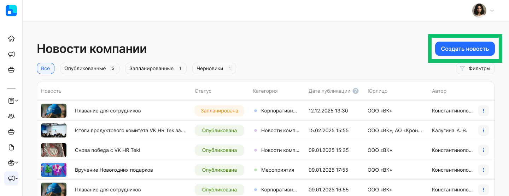

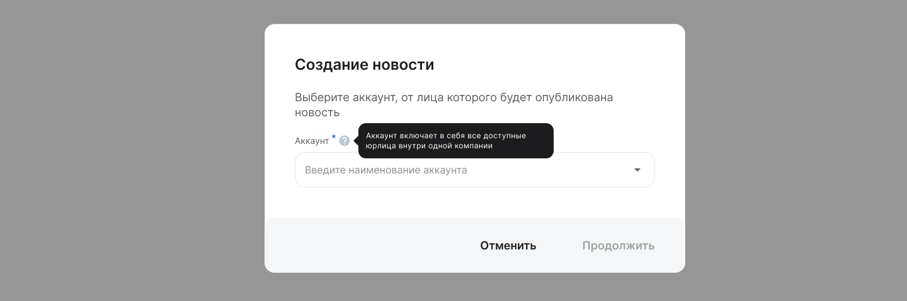

Пример 1. У пользователя есть права доступа к двум аккаунтам «Цветы и цветочки» и «Фрукты и ягоды». При создании новости будет предложено выбрать конкретный аккаунт, от которого пользователь хочет создать новость.

Пример 2. У пользователя есть права доступа только к одному юрлицу аккаунта «Цветы и цветочки». При создании новости этот аккаунт будет выбран автоматически. 

### **Управление категориями новостей**
Добавлен новый раздел **Категории**, в котором автор новостей и администратор портального модуля могут создавать, редактировать и удалять категории новости. Пользователи видят категории только по своим аккаунтам, на которые выданы права доступа.

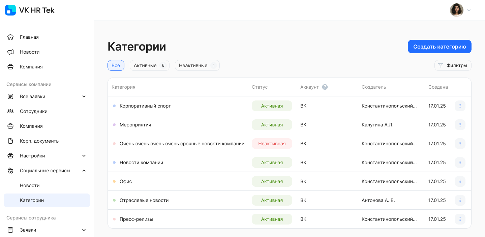

### **Упоминание пользователей в тексте**
Пользователи могут упомянуть других пользователей через @ в тексте новости или в комментарии к новости. Упоминание является ссылкой на профиль пользователя.

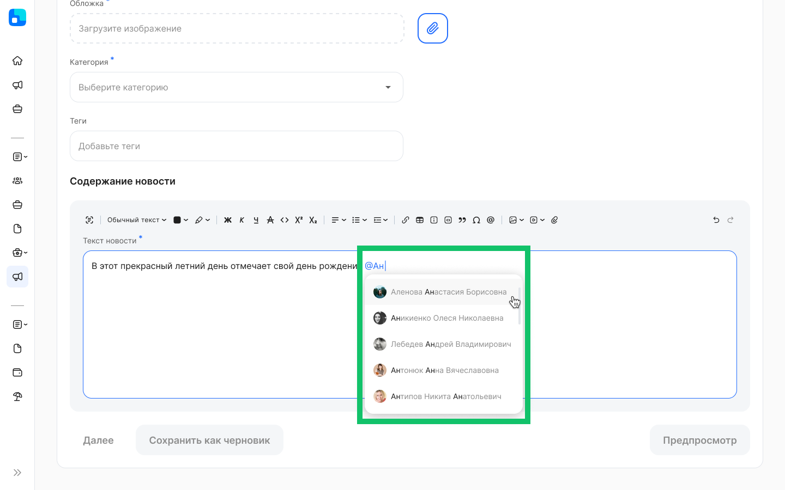

### **Уведомления об упоминании пользователя**
Пользователи могут получать уведомления в следующих ситуациях:

- Пользователя упомянули к тексте новости.
- Пользователя упомянули в тексте комментария.

Уведомления могут приходить на электронную почту пользователя и в раздел уведомлений веб-сервиса.

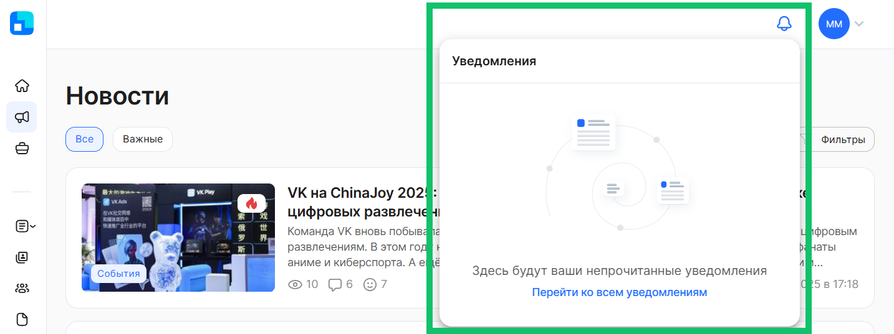

## **Ролевая модель**
Добавили управление доступом к разделу **Сотрудники** в ролевую модель. Теперь можно настроить доступ к этой странице только для определенных ролей представителей компании.

По умолчанию для блока **Компания — Сотрудники** в ролевой модели установлены значения:

- **Отдел кадров, Руководитель отдела кадров** — для представителей компании;
- **Нет доступа** — для руководителей.

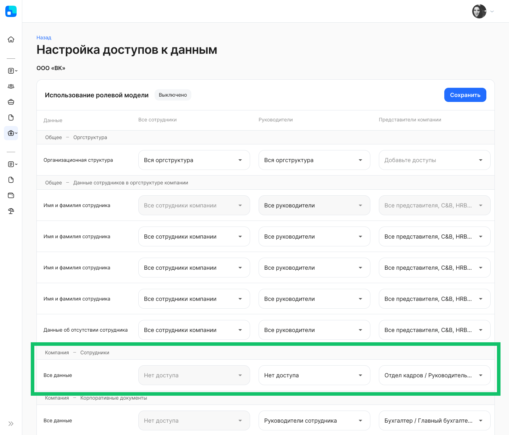

## **Настройки компании**
В раздел **Настройки компании** добавили новые настройки **Виджеты на главной странице** и **Боковая панель навигации**.

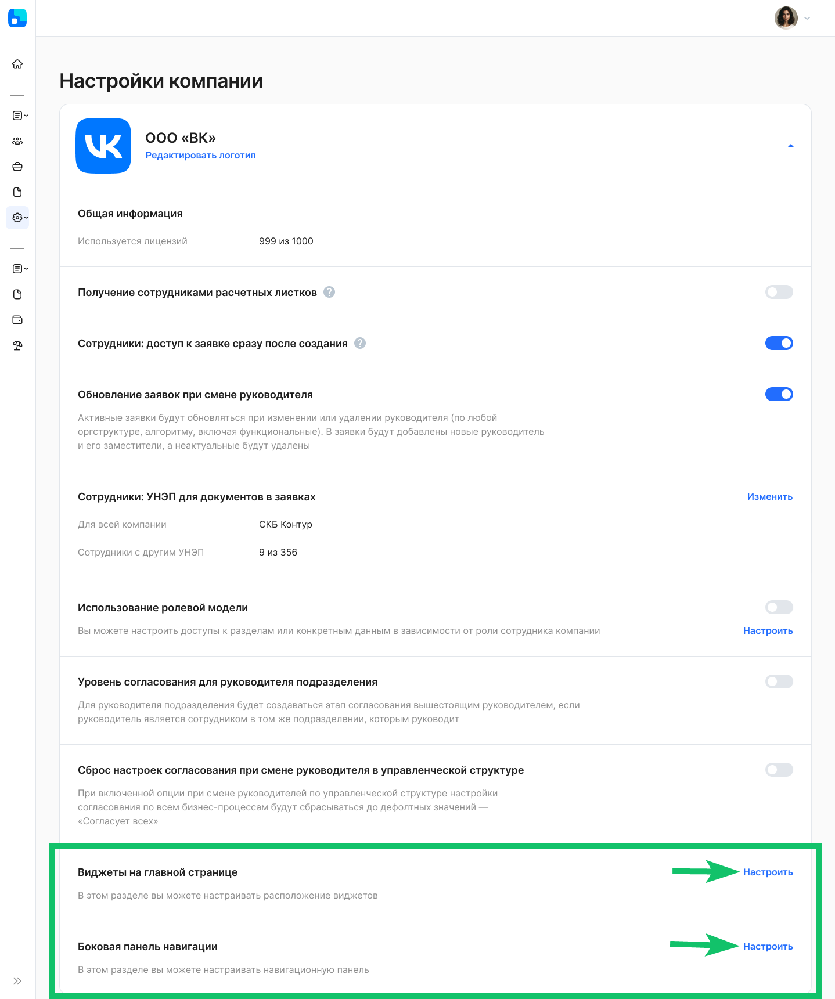

### **Виджеты на главной странице**
Администратор сможет включать/выключать, настраивать и перемещать виджеты, которые расположены на главной странице.

Для корректной работы пользователю должны быть добавлены роли «Администратор» и «Администратор главной страницы».

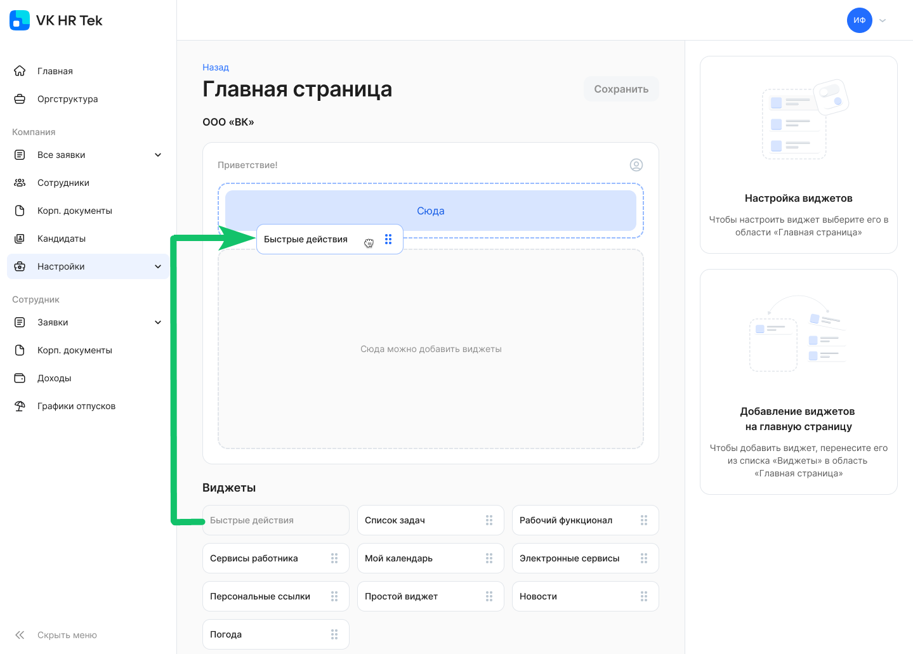

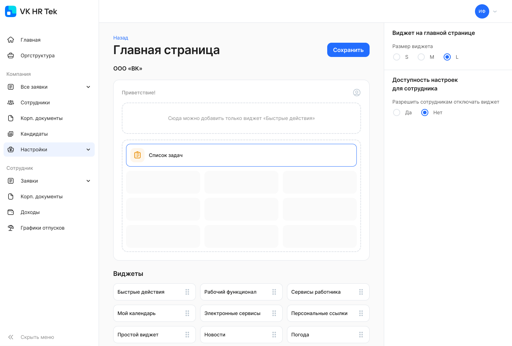

### **Боковая панель навигации**
Администратор сможет добавлять, удалять и перемещать пункты меню.

Для корректной работы пользователю должны быть добавлены роли «Администратор» и «Администратор главной страницы».

Все компании, где у пользователя есть роль «Администратор», должны быть привязаны к одному аккаунту. Чтобы проверить связь компании с аккаунтом, обратитесь в [поддержку VK HR Tek](/ru/hr/support/contact_channels).

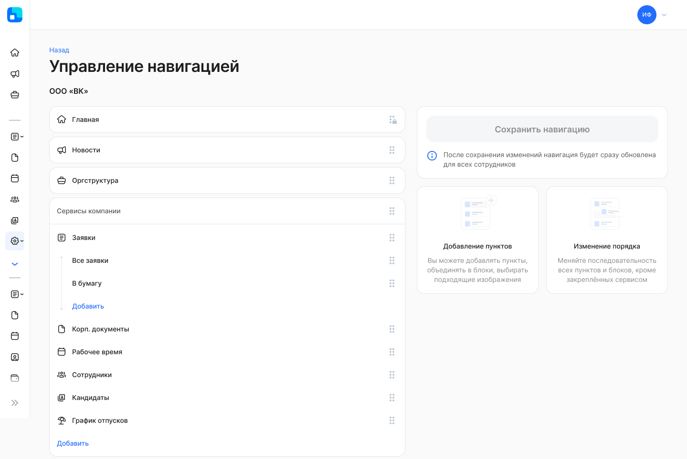

## **Бизнес-процессы**
### **Этапы заявки**
В разделе **Заявки** добавили кастомные названия этапов в фильтр и в выгрузку данных по списку заявок. Актуально для компаний, где используют [кастомные названия статусов](/ru/release_notes/saas/20250800Core#etapy_zayavki) в бизнес-процессах.

Настройка кастомных статусов на этапах является платной. Для подключения обратитесь в [поддержку VK HR Tek](/ru/hr/support/contact_channels).

### **Срочные заявки**
В разделе **Заявки** добавили опцию **Срочные заявки в начале списка**. По умолчанию опция включена.

Срочные заявки всегда расположены в начале списка и подсвечиваются красной линией слева. Внутри этой части списка они сортируются от ближайшей даты дедлайна к более отдалённой.

Срочными считаются заявки, дедлайн которых наступит до 9:00 утра следующего рабочего дня. В будущем планируем доработку для учёта часового пояса сотрудника.

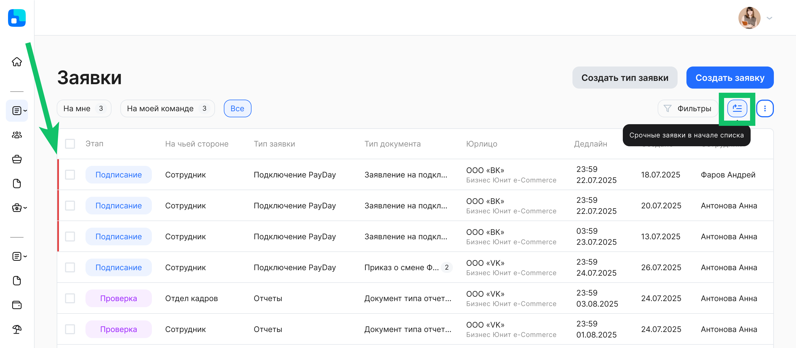

### **Сквозные номера заявок**
Добавили опцию для автоматического присвоения заявкам коротких уникальных номеров. Она работает для всех бизнес-процессов — включая анкеты кандидатов и графики отпусков.

Это удобно для оперативной работы: номер можно быстро продиктовать по телефону и по нему сразу найти нужную заявку.

Формат номера настраивается. В шаблон всегда входит порядковый номер, а дополнительные элементы можно выбрать:

- название группы компаний,

- произвольный текст,

- текущая дата/месяц/год.

Опция включается на уровне группы компаний. Если компания не входит в группу — тогда можно настроить на уровне компании.

Для подключения опции обратитесь в [поддержку VK HR Tek](/ru/hr/support/contact_channels).

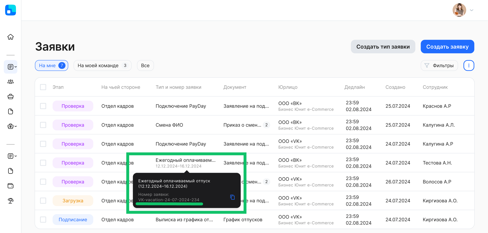

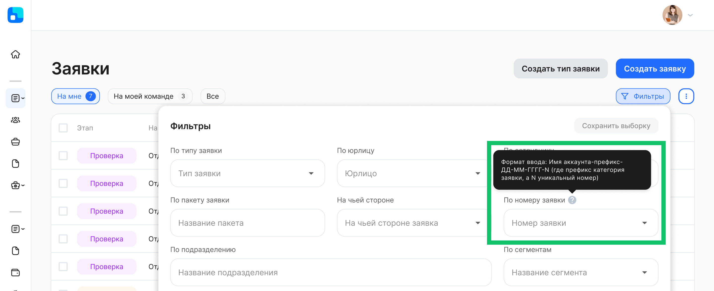

### **Атрибуты в заявках**
Теперь настройка видимости атрибута на этапе заявки учитывает выполнение нескольких заданных условий:

- Атрибут появится, если одновременно выполнены все условия (логика AND).

- Каждое условие — это конкретное значение, выбранное в одном из предыдущих атрибутов.

- Можно строить цепочки зависимостей: выбор одного атрибута открывает следующий и так далее.

Это позволяет настроить гибкие формы — сотрудники будут видеть только те поля, которые действительно нужны в их случае.

Настройка бизнес-процесса с зависимыми атрибутами является платной. Для подключения обратитесь в [поддержку VK HR Tek](/ru/hr/support/contact_channels).

### **Валидаторы в заявках** 
Добавлен валидатор, который позволяет пользователю вводить даты строго в рамках текущего года. Например, полезно для случаев, когда разрешено переносить отпуск только в рамках текущего года.

Настройка валидатора в бизнес-процессе является платной. Для подключения обратитесь в [поддержку VK HR Tek](/ru/hr/support/contact_channels).

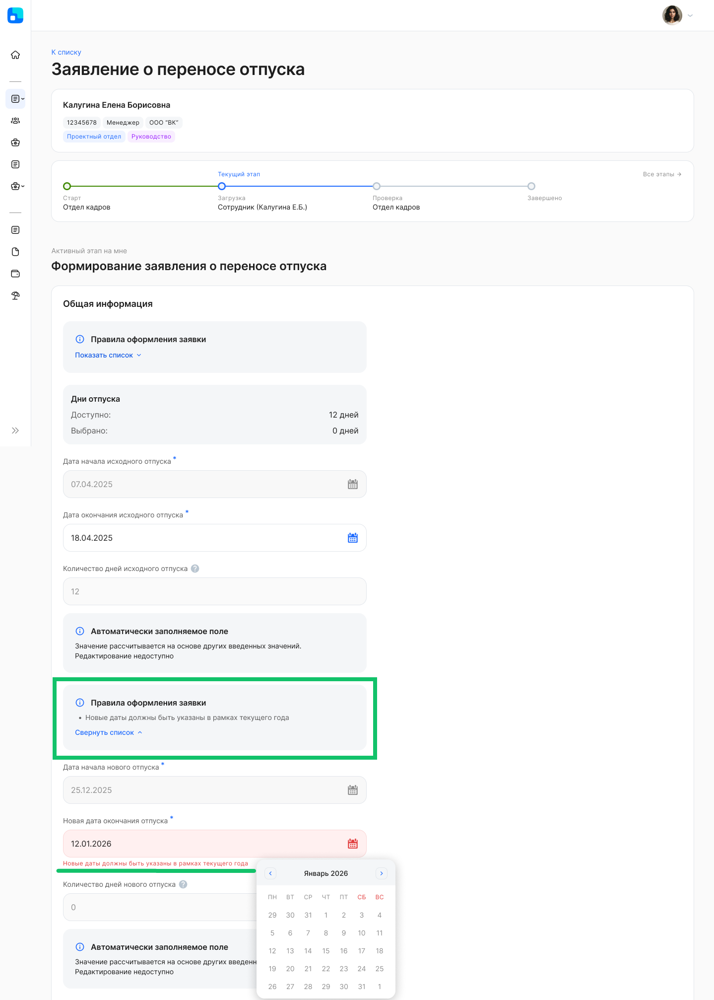

### **Скачивание документов по заявке**
В мобильную версию веб-сервиса добавили кнопки, чтобы можно было скачать и на телефон:
- Архив со всеми документами из заявки, включая оригиналы документов, sig и хml файлы;
- Отчёт об изменениях в заявке.

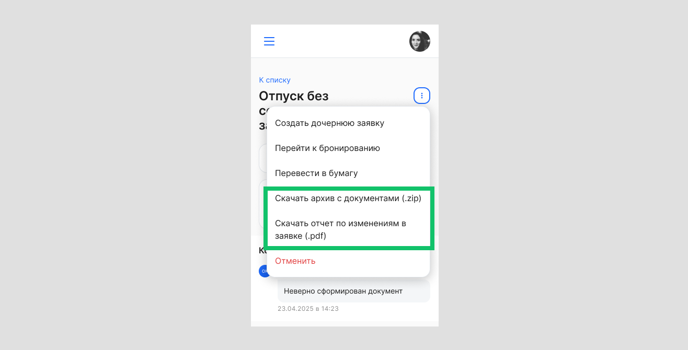

### **Предпросмотр документа**
Изменили дизайн снэк-бара на экране предпросмотра документа, сгенерированного по шаблону, чтобы синяя кнопка действия не перекрывалась окнами других приложений (в правом нижнем углу).

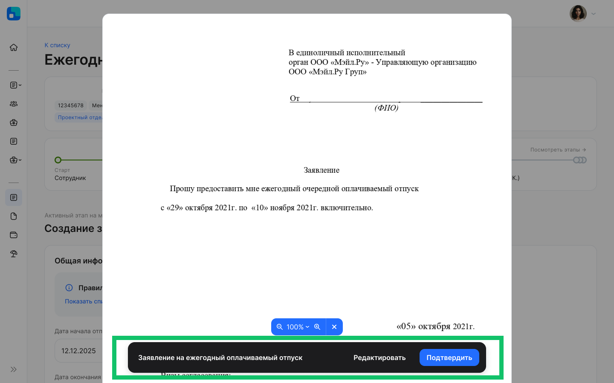

### **Дедлайны**
Вернули опцию дедлайна **Переход на следующий этап** для заявок.

## **Уведомления**

### **Отключение уведомлений в нерабочие дни**
Реализовали возможность отключать все уведомления в СМС и Telegram в нерабочие дни сотрудника: выходные, отпуска, праздники, в том числе региональные.

Для подключения или отключения уведомлений обратитесь в [поддержку VK HR Tek](/ru/hr/support/contact_channels).

### **Уведомления, если сотрудники не ознакомились с ЛНА**
Реализовали уведомления для руководителя, ассистента подразделения и группы, если подчиненные сотрудники не ознакомились с ЛНА в течение N дней после публикации.

В уведомлении перечисляются сотрудники, которые не ознакомились с ЛНА. Для руководителя и ассистента перечислены только сотрудники прямого подчинения, для группы — все сотрудники компании.

Для подключения уведомлений обратитесь в [поддержку VK HR Tek](/ru/hr/support/contact_channels).

## **Корпоративные документы**
Исправили массовое распространение ЛНА при удалении подразделения и/или должности, указанных в параметрах опубликованного ЛНА.

## **Отсутствия и отпуска** 
1\. Добавлена настройка для округления накопленных дней отпуска у сотрудника. Настройка позволяет округлять дни математически, в пользу сотрудника или не округлять совсем.

На странице **Мой календарь**, в виджете **Дни отпуска** сотрудник может просмотреть доступное количество наколенных дней отпуска.

Для подключения настройки обратитесь в [поддержку VK HR Tek](/ru/hr/support/contact_channels).

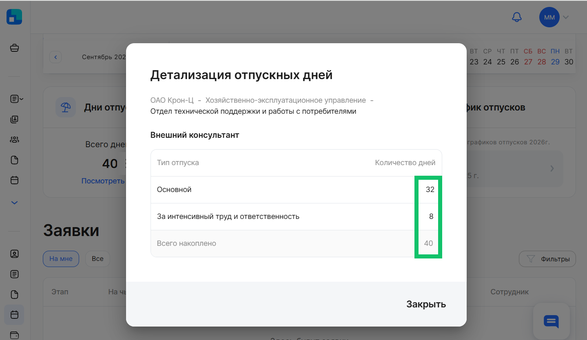

2\. Добавили возможность включать или отключать видимость виджета **Ближайшая задача** в разделе **Мой календарь** для всех пользователей компании. Чтобы отключить видимость виджета, в разделе **Настройки компании** Администратор КЭДО должен активировать переключатель настройки.

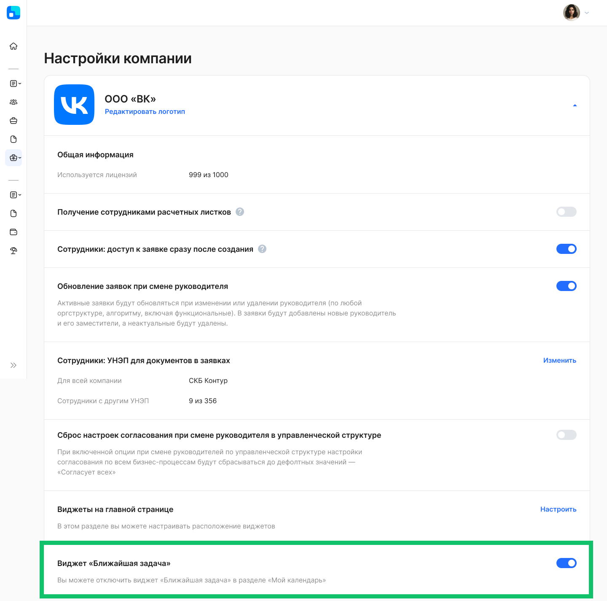

## **График отпусков** 
При планировании графика отпусков убрали обязательность настройки **Нельзя выбрать только выходные дни**, чтобы сотрудники, которые работают по сменному графику и для которых обычные выходные дни могут быть рабочими, смогли запланировать отпуск в выходные дни по производственному календарю.

