## **Портальные сервисы**

<info>
Для подключения новых возможностей в сервисах «Новости» и «Опросы» обратитесь к вашему менеджеру VK HR Tek
</info>

### **Опросы**
Расширяем возможности платформы: запущен сервис «Опросы» для сбора и анализа обратной связи. 

Эффективное управление невозможно без своевременной и релевантной информации от ваших сотрудников. Новый сервис **«Опросы»** — решение, которое систематизирует сбор обратной связи и предоставляет аналитику для принятия обоснованных управленческих решений.

**Преимущества для бизнеса**

1. Снижение операционных рисков за счет выявления проблем на ранней стадии.
1. Повышение обоснованности решений, влияющих на коллектив.
1. Укрепление корпоративной культуры, основанной на диалоге с вашими сотрудниками.

**Что можно делать в новом сервисе?**

Для всех сотрудников:

1. Просматривать доступные для прохождения опросы и уже пройденные опросы в разделе **Опросы**.
1. Фильтровать опросы по категориям.
1. Проходить опросы.

Посмотреть интерфейс раздела «Опросы»
 

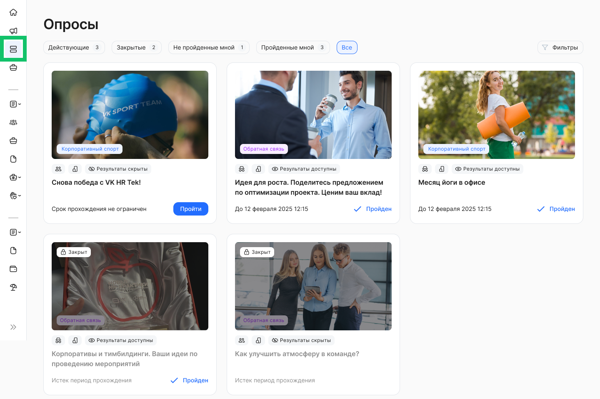

Посмотреть интерфейс прохождения опроса 
 

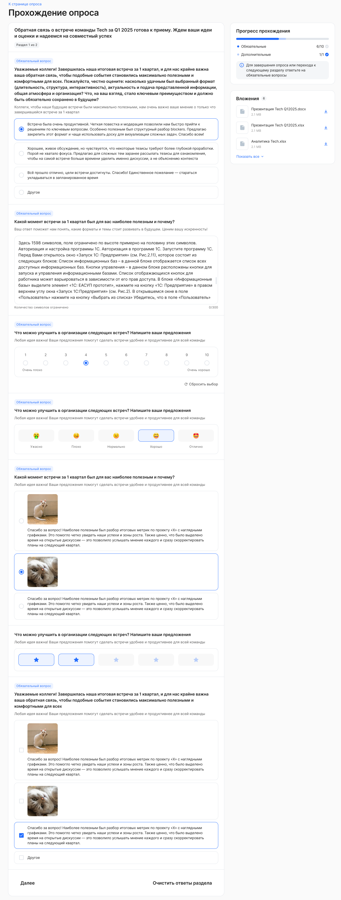

Для сотрудников с административными правами доступа к сервису «Опросы»:

1. Создавать, редактировать и удалять опросы в разделе **Социальные сервисы → Опросы**.
1. Публиковать опросы, сохранять черновики, настраивать отложенную публикацию опросов, задавать период проведения опросов.
1. Настраивать видимость опроса в разрезе организаций и подразделений.
1. Добавлять теги, категории.
1. Просматривать результаты опросов через выгрузку в Excel.
1. Настраивать уведомления о напоминании пользователям о необходимости пройти опрос.

Для управления опросами пользователю должна быть назначена группа «Администратор модуля Портал» или «Автор опросов».

Посмотреть интерфейс создания опроса
 

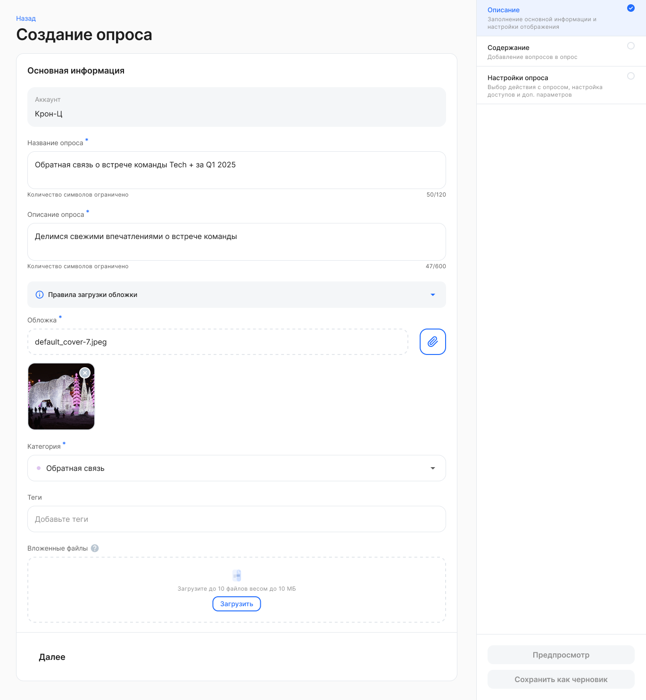

#### **Выгрузка результатов опросов в Excel**
Для просмотра результатов опросов реализован удобный механизм выгрузки данных в Excel. Данные можно выгружать, как с основными, так и дополнительными параметрами опроса.

Основные параметры открытого опроса
 

1. ФИО пользователя.
1. Организация/подразделение.
1. Дата и время прохождения опроса.
1. Наименование каждого вопроса и ответ на него. 

Основные параметры анонимного опроса
 

1. Порядковый номер пользователя.
1. Дата и время прохождения опроса.
1. Наименование каждого вопроса и ответ на него. 

Дополнительные параметры опроса
 

1. Название опроса.
1. Описание опроса.
1. Автор опроса — ФИО пользователя, создавшего опрос.
1. Дата публикации.
1. Дата завершения опроса.
1. Сведения об аудитории — Перечень организаций, на которые назначен опрос.

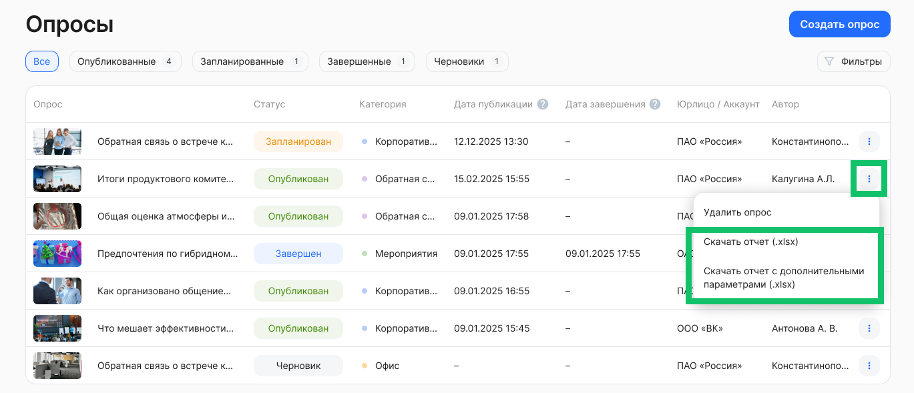

#### **Категории опросов**
В раздел **Социальные сервисы** → **Категории** добавлена возможность создавать категории для опросов.

В разделе **Опросы** сотрудник видит только категории, которые привязаны к доступным ему аккаунтам.

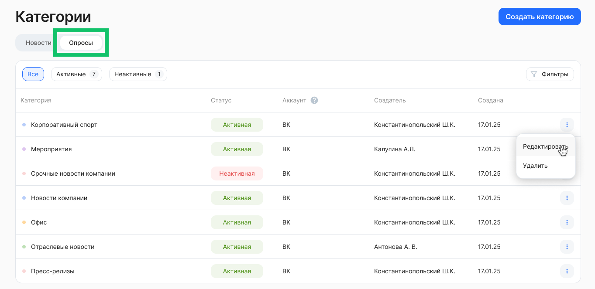

#### **Новый раздел по управлению правами доступа для сервиса «Опросы»**
В раздел **Социальные сервисы** → **Администраторы** добавлена возможность управлять правами доступа к сервису «Опросы».

Появились две специализированные роли:

- **Менеджер сервиса Опросы** — пользователь отвечает за настройку доступа к опросам. Он может назначать других сотрудников авторами, не имея полных прав «Администратора модуля Портал».
- **Автор опросов** — пользователь, который может создавать и публиковать опросы. 

Доступ к разделу с настройками прав в разрезе сервиса «Опросы» имеют пользователи с ролями «Администратор модуля Портал» и «Менеджер сервиса Опросы».

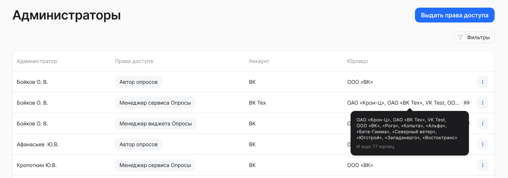

**Какие преимущества это дает?**

1. Эффективное делегирование. Вы можете поручить сотруднику управление опросами, не давая ему полных административных прав.
1. Улучшение мер безопасности. Сотрудники получают только те разрешения, которые им действительно нужны, что снижает возможные риски.
1. Гибкость и контроль. Вы можете четко определить, кто отвечает за управление правами, а кто — только за публикацию контента.

### **Новые портальные виджеты главной страницы**
Теперь на главной странице портала доступны два новых виджета — **Опросы** и **Новости**.

Виджет **Опросы** показывает сотрудникам актуальные опросы, которые они ещё не проходили, помогая вовлекать их в важные процессы и собирать ценную обратную связь.

Посмотреть интерфейс
 

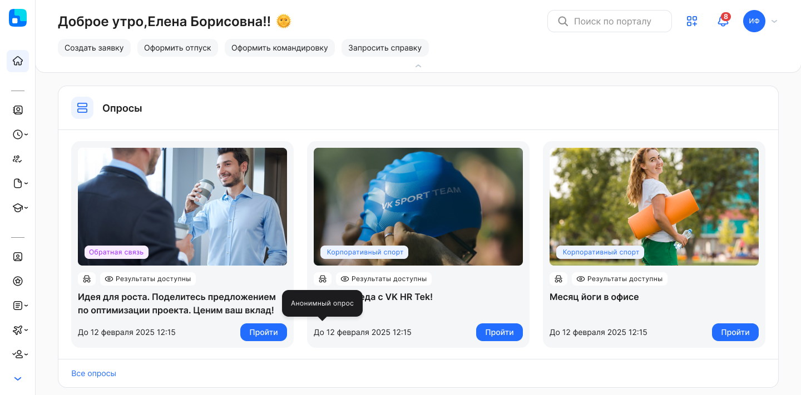

Виджет **Новости** отображает последние 4 опубликованные новости, позволяя сотрудникам быть в курсе всех значимых событий и изменений в компании.

Посмотреть интерфейс
 

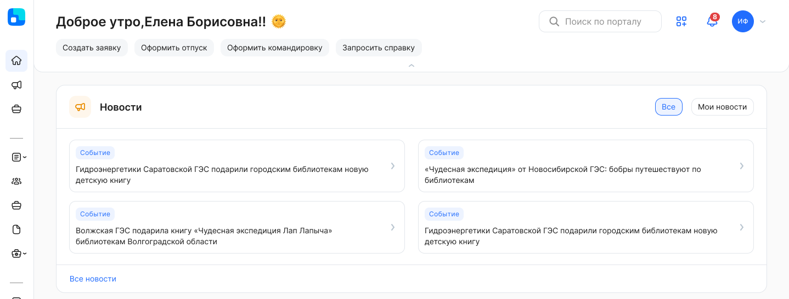

**Преимущества внедрения новых виджетов:**

1. Повышение вовлечённости. Сотрудники оперативно узнают о новых опросах и событиях, что способствует их активному участию в жизни компании.
1. Улучшение коммуникации. Быстрое распространение информации помогает поддерживать высокий уровень доверия и открытости между руководством и коллективом.

Добавьте новые виджеты на главную страницу и сделайте общение в вашей компании ещё эффективнее!

### **Расширение возможностей поиска по VK HR Tek**
Теперь можно легко искать по всем портальным сервисам VK HR Tek и быстро находить коллег по различным параметрам.

В планах: подключить ещё больше сервисов, чтобы выстроить единую поисковую систему для всей компании.

**Преимущества:**

1. Экономия времени: удобный поиск вместо ручного просмотра разных разделов.
1. Ускорение процессов: мгновенный доступ к данным и нужным специалистам.
1. Простота использования: интуитивный интерфейс без специального обучения.

**Поиск по портальным сервисам**

Допустим, вам нужны все материалы по запуску продукта «Х» за последний год. Просто введите в строку наименование продукта и вот что вы получите:

1. Новости — анонсы и отчеты о запуске.
1. Опросы — результаты исследования мнения сотрудников о новом продукте.
1. Комментарии — ценную обратную связь и идеи от коллег.

Посмотреть интерфейс
 

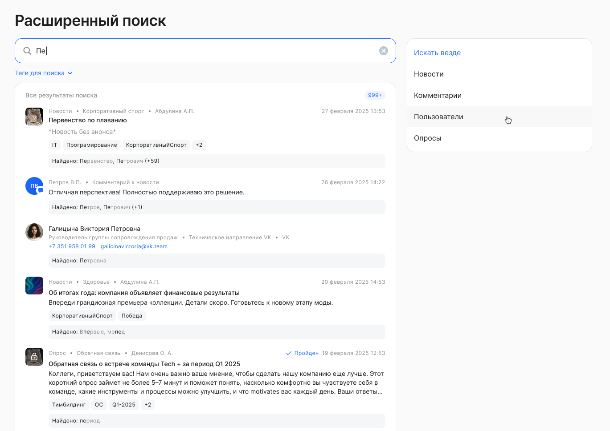

**Поиск по сотрудникам**

Вам пришло письмо от коллеги, а нужен его телефон? Или помните фамилию, но забыли email для встречи? Начните вводить имя в поиске — и система сразу покажет профиль человека со всеми актуальными контактами.

Больше не нужно часами искать вручную или писать в чаты — всё находится за секунды.

Посмотреть интерфейс
 

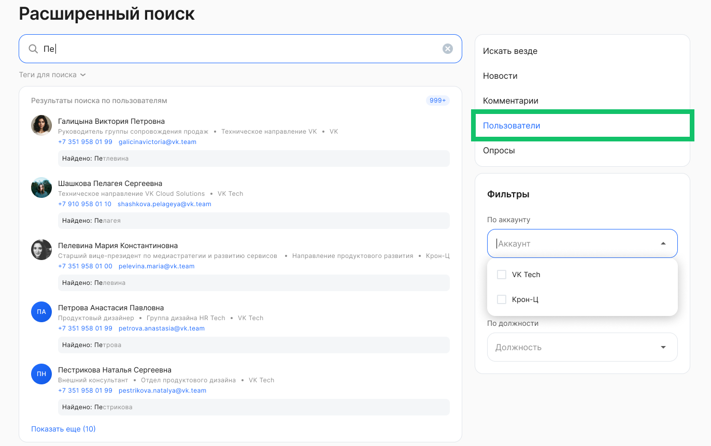

## **Главная страница**
### **Виджеты сервисов — руководителям и сотрудникам**
Мы постарались сделать оба виджета максимально полезными — так, чтобы **одного взгляда было достаточно**, чтобы увидеть срочные задачи, а необходимые инструменты всегда были под рукой.

В **виджете руководителя** собраны все сервисы, которые могут пригодиться ему в ежедневной работе:

- **организационная структура** с удобным поиском по коллегам и подчинённым;
- **заявки КЭДО** с быстрым переходом к созданию новой заявки;
- **календарь согласований**, где сразу видно, когда заявки на отпуск или командировку ждут вашего решения;
- для руководителей, участвующих в процессе найма, — **блок с ключевыми цифрами по подбору** в их команде.

Посмотреть интерфейс
 

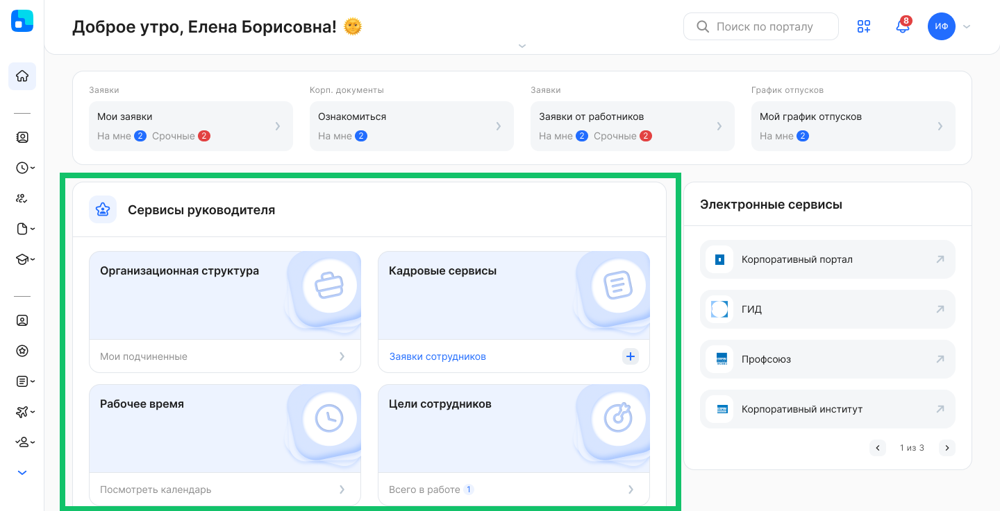

Инструкция администратора по настройкам виджетов для руководителей
 

1. Перейдите в раздел **Настройки компании → Виджеты на главной странице** и нажмите кнопку **Настроить**.
1. Перенесите виджет **Сервисы руководителя** из блока **Виджеты** на основную область размещения виджетов.
1. Нажмите на виджет **Сервисы руководителя** и выберите значение для настройки доступности сотрудникам.
1. Нажмите кнопку **Редактировать**.

 

5\. Перенесите необходимый сервис из блока **Сервисы** на область размещения и установите любой размер карточки сервиса. Также можно менять порядок сервисов на странице или удалять сервисы со страницы, тогда они снова появятся в блоке **Сервисы**.

6\. После произведенных перестановок сохраните изменения.

**Виджет для линейных сотрудников** помогает вовремя оформить нужные документы и быстро перейти к своим данным. В нём собраны самые востребованные функции:

- **оформление отпуска или командировки** — самая важная карточка, чтобы не пропустить сроки и подать заявку вовремя;
- **быстрый переход к корпоративным документам** для ознакомления, как того требует регламент компании;
- **доступ к профилю** — рекомендуем периодически проверять, что ваши персональные данные в системе актуальны;
- **заказ справок и просмотр данных о доходах** — всё в пару кликов и без лишних обращений в отдел кадров.

Посмотреть интерфейс
 

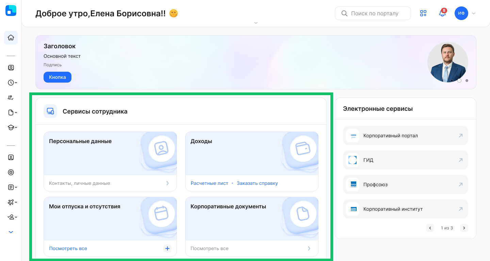

Инструкция администратора по настройкам виджетов для сотрудников
 

1. Перейдите в раздел **Настройки компании → Виджеты на главной странице** и нажмите кнопку **Настроить**.
1. Перенесите виджет **Сервисы сотрудника** из блока **Виджеты** на основную область размещения виджетов.
1. Нажмите на виджет **Сервисы сотрудника** и выберите значение для настройки доступности сотрудникам.
1. Нажмите кнопку **Редактировать**.
1. Перенесите необходимый сервис из блока **Сервисы** на область размещения и установите любой размер карточки сервиса. Также можно менять порядок сервисов на странице или удалять сервисы со страницы, тогда они снова появятся в блоке **Сервисы**.
1. После произведенных перестановок сохраните изменения.

### **Новый виджет — баннер**
Новый формат виджета помогает привлечь внимание сотрудников к важным новостям или событиям компании.
Баннер можно загрузить как **готовым изображением от дизайнера**, так и **собрать самостоятельно** из элементов, доступных в настройках.

Посмотреть интерфейс
 

Инструкция администратора по настройкам баннера
  

1. Перейдите в раздел **Настройки компании → Виджеты на главной странице** и нажмите кнопку **Настроить**.
1. В блоке **Баннеры** нажмите кнопку **Создать баннер**.

 

3\. Укажите название баннера и выберите тип баннера. 

3\.1. При выборе типа **Настроить самостоятельно** можно добавить один или более слайдов, для которых необходимо настроить:

- оформление: изображение на весь экран, дополнительное изображение;
- текст: заголовок, основной текст, подпись, цвет текста;
- кнопки: тип и текст кнопки, ссылка для перехода по кнопке.  

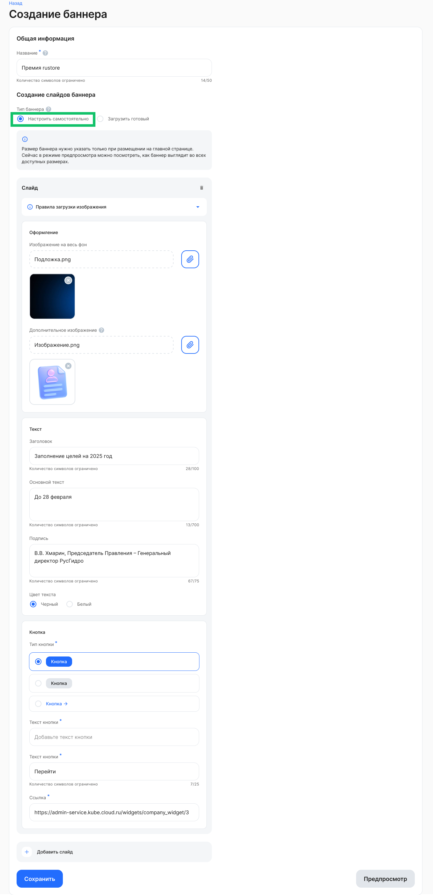

 

3\.2. При выборе типа **Загрузить готовый** можно добавить один или несколько слайдов, для которых необходимо настроить:

- изображение на весь экран;
- ссылку.

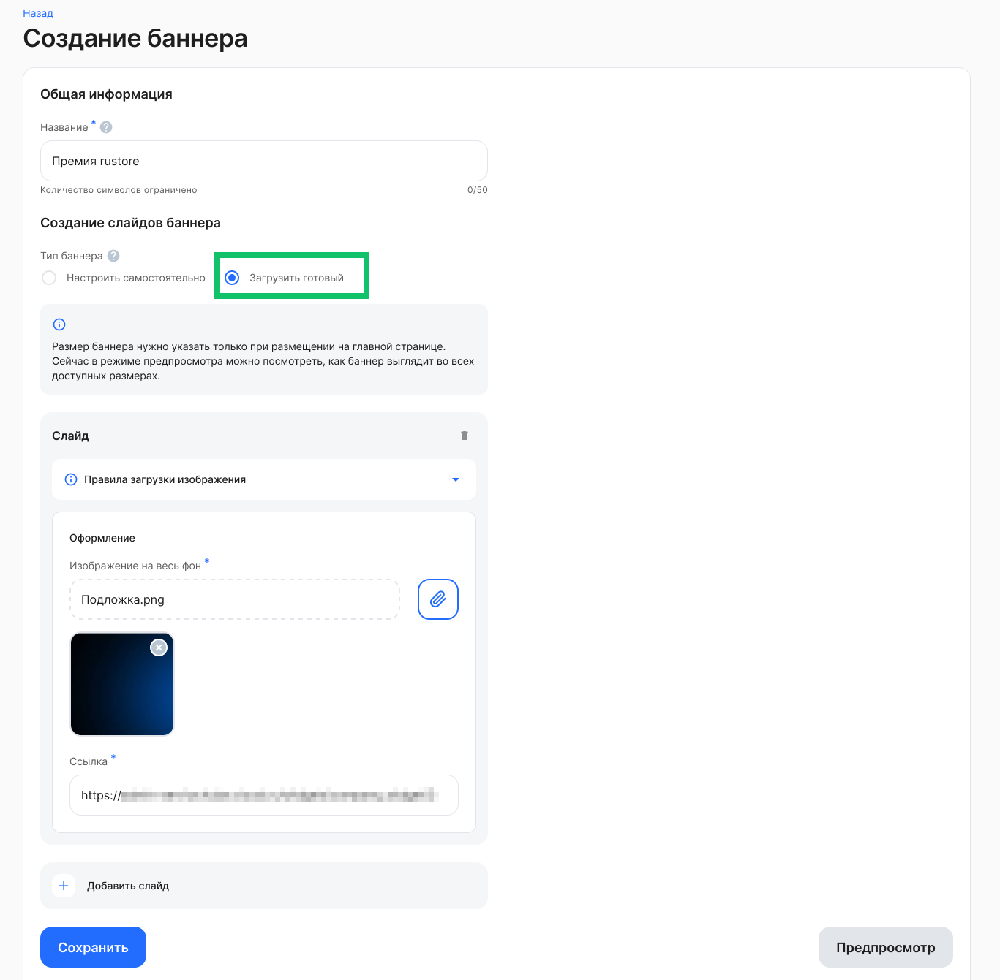

 

4\. Нажмите кнопку **Сохранить** после заполнения необходимых настроек. Новый баннер будет добавлен в блок **Баннеры**. 

### **Настройка списка быстрых действий**
Теперь в блоке с быстрыми действиями можно оставить только те, которые действительно актуальны для вашей компании. Кроме того, вы можете разрешить сотрудникам **добавлять в этот блок свои собственные ссылки** — они будут сохраняться индивидуально для каждого пользователя.

Так быстрые действия можно настроить максимально гибко: общие ссылки задаёт компания, а персональные — сами сотрудники, подстраивая блок под свой рабочий процесс.

Инструкция администратора по настройкам быстрых действий
 

1. Перейдите в раздел **Настройки компании → Виджеты на главной странице** и нажмите кнопку **Настроить**.
1. Перенесите виджет **Быстрые действия** из блока **Виджеты** на основную область размещения виджетов.
1. Нажмите на виджет **Быстрые действия** и выберите значения для настроек доступности: 
   - Разрешить сотрудникам отключать виджет.
   - Разрешить сотрудникам добавлять собственные ссылки.
4. Нажмите кнопку **Редактировать**.

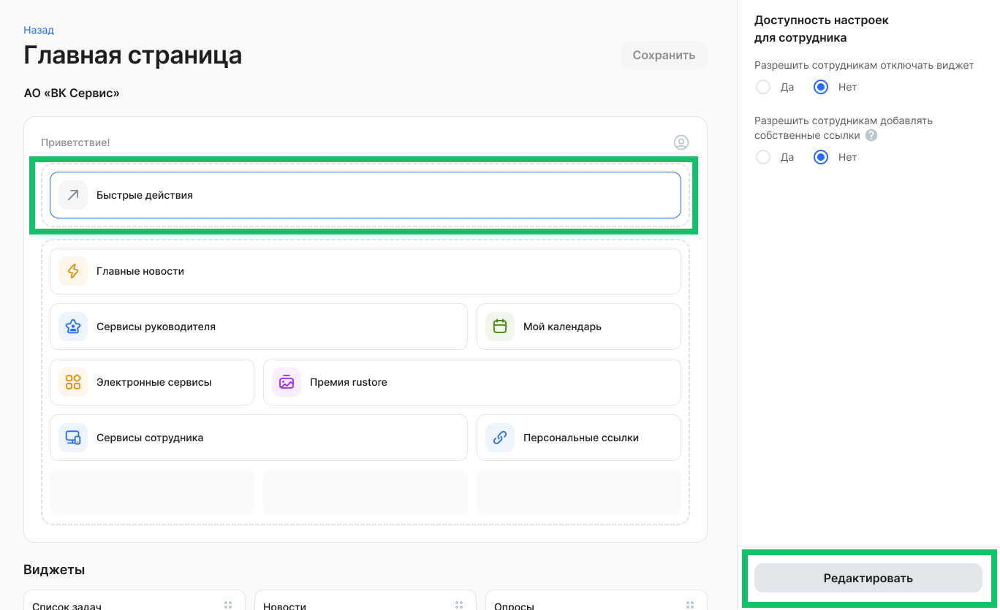

 

5\. Действие, которое было добавлено по умолчанию в список быстрых действий — **Создать заявку**. Перенесите необходимое действие из списка доступных в список быстрых действий, чтобы он отобразился в виджете. Также можно менять порядок действий внутри списка.

Чтобы добавить новые быстрые действия в список доступных, обратитесь в техническую поддержку VK HR Tek.

6\. После произведенных перестановок сохраните изменения.

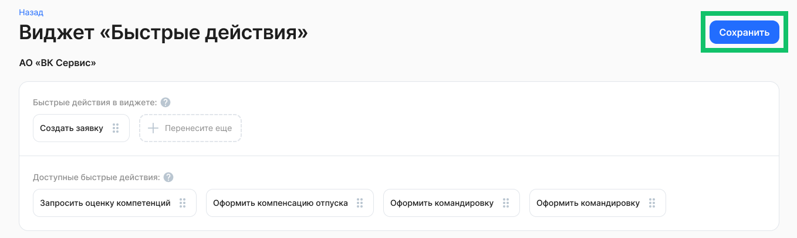

## **Работа с заявками**
### **Опция срочных заявок — запоминаем ваш выбор**
В списке заявок значение опции **«Срочные заявки»** сохраняется для каждого пользователя.
Если вы работаете в одном и том же браузере, выбранная настройка больше не будет сбрасываться.

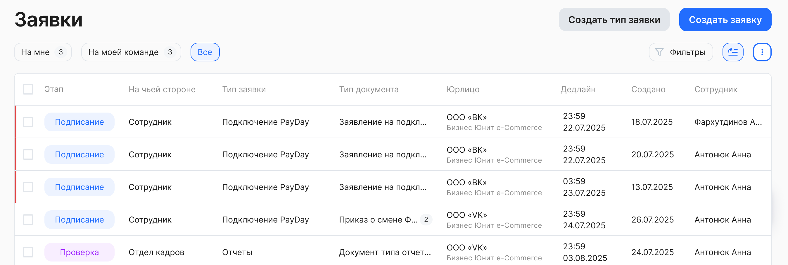

### **Новые поля шаблонов для документов**
Номер и дата документа — обязательные атрибуты для кадровых документов — теперь можно добавлять прямо в шаблоны документов.
Если эти значения указаны в заявке, они будут **подставляться автоматически**.

Настройка шаблона
 

Чтобы просмотреть новые поля для шаблона документа:

1\. Перейдите в раздел **Настройки КЭДО → Шаблоны документов**.

2\. Раскройте выбранный шаблон и нажмите кнопку **Изменить**.

3\. Раскройте **Список возможных полей для шаблона**. 

4\. В списке возможных полей найдите необходимое поле и используйте его для оформления шаблона.

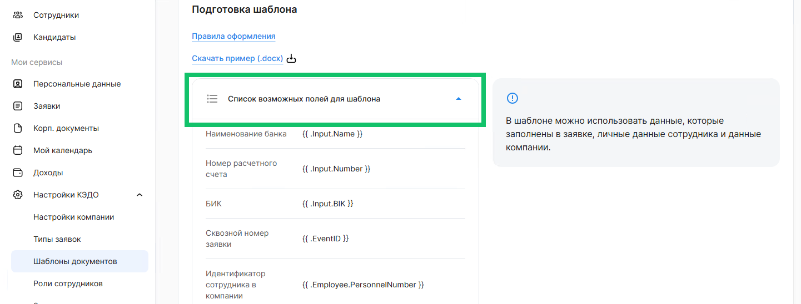

## **Кабинет администратора**
### **Настройки бизнес-процессов**
Немного изменили интерфейс настроек бизнес-процесса в разделе **Типы заявок**, чтобы было удобнее просматривать элементы и редактировать настройки. Надеемся, что станет удобнее, и продолжим работать над этим интерфейсом.

## **Организационная структура**
Мы вернули в интерфейс организационной структуры карточки с подсчётом различных настроек согласования руководителями по бизнес-процессам.

Посмотреть интерфейс
 

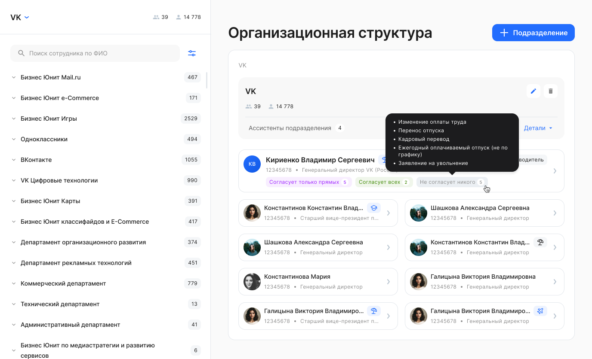

## **Отсутствия и отпуска**
### **Перенос отпуска прямо из календаря**
Теперь стало проще управлять ранее запланированными отпусками — их можно перенести напрямую из раздела **Мой календарь**.

**Что изменилось:**

1. При выборе **одного** отпускного периода в календаре доступны действия:
  - **Перенести** — открывается форма, где данные по отпуску уже заполнены автоматически.
  - **Оформить по графику** — подтверждение отпуска в текущие даты.
  - Также отображаются детали отпуска: тип, даты, статус заявки.
2. При выборе **нескольких** периодов:
  - Действие **«Перенести»** недоступно.
  - Доступно только **«Оформить по графику»**.

**Дополнительно:**

1. Выбрать можно только те отпуска, которые есть в утверждённом графике.
2. При выборе одного периода пользователь видит:
  - тип отпуска;
  - даты начала и окончания;
  - статус заявки;
  - обновлённый текст подсказки, который также сообщает, что возможен перенос отпуска через заявку.

Работа по планированию отпуска
  

1\. Сотрудник переходит в раздел **Мой календарь**.

2\. Если пользователь числится как сотрудник в нескольких компаниях, то выбирает ту компанию, в которой хочет запланировать отпуск.

3\. Выполняет одно из действий:

3\.1. в **Графике отсутствий** выбирает период для планирования, он выделен голубым цветом,

или

3\.2. в виджете **Ближайшая задача** нажимает **Создать заявку**.

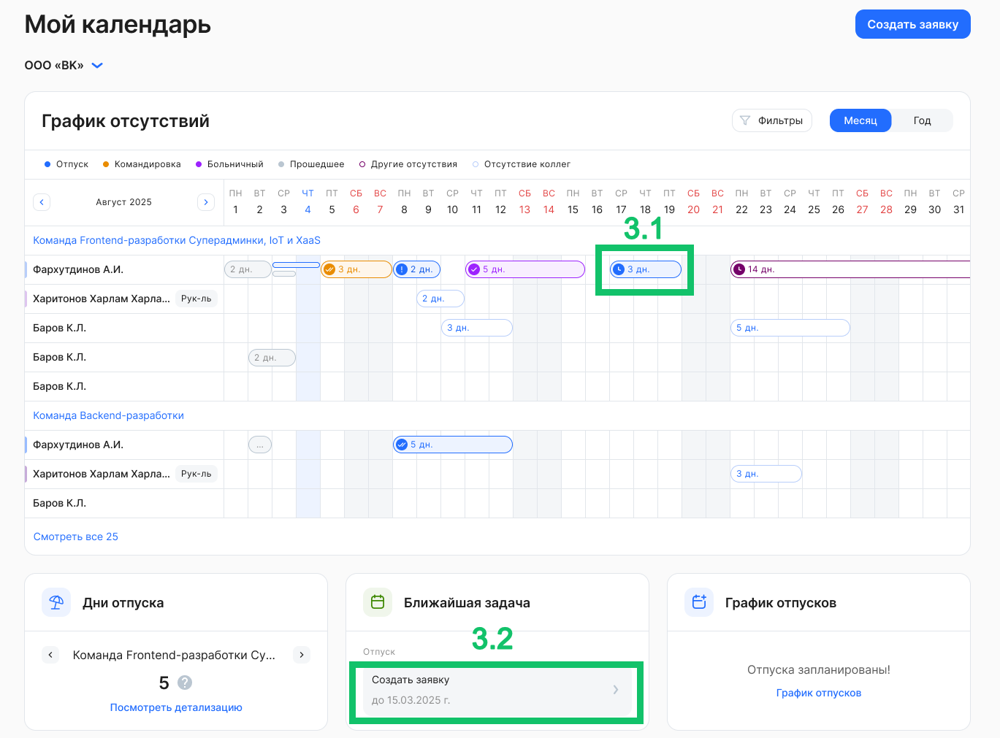

 

4\. В форме **Запланированный отпуск** оформляет или переносит ранее запланированный отпуск.

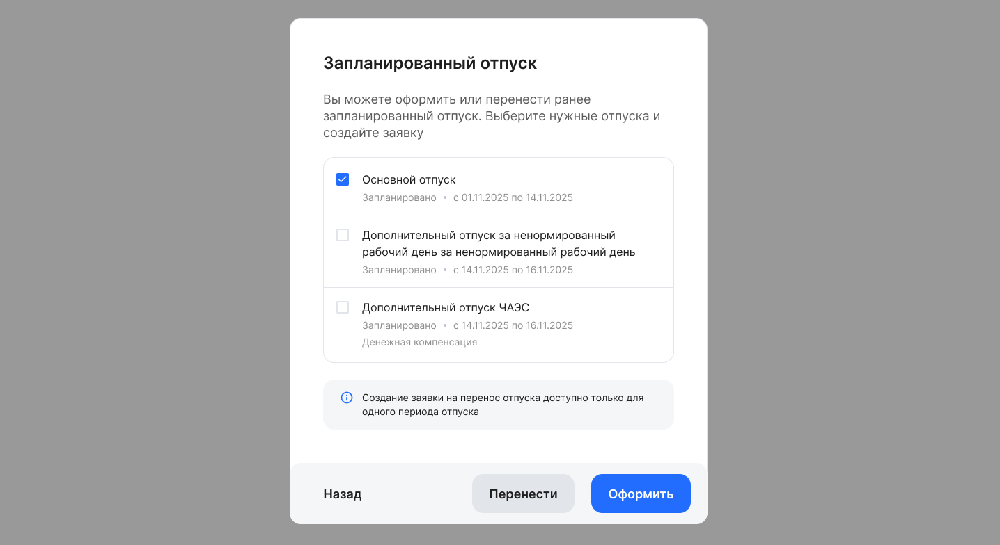

**Преимущества:**

- меньше ручного ввода — система сама подтягивает данные;
- проще изменить даты уже запланированного отпуска;
- меньше ошибок при оформлении.

### **Контроль корректности переноса нескольких периодов (один ко многим)**

<info>

Все настройки, связанные с изменениями бизнес-процессов, являются платными. Для подключения обратитесь в [поддержку VK HR Tek](/ru/hr/support/contact_channels).

</info>

При переносе отпуска системой теперь контролируется общий объём дней:

- система сверяет количество дней в **исходном** отпуске с количеством дней во всех **новых** периодах;
- если количество дней не совпадает — создать заявку будет невозможно.

Посмотреть интерфейс
 

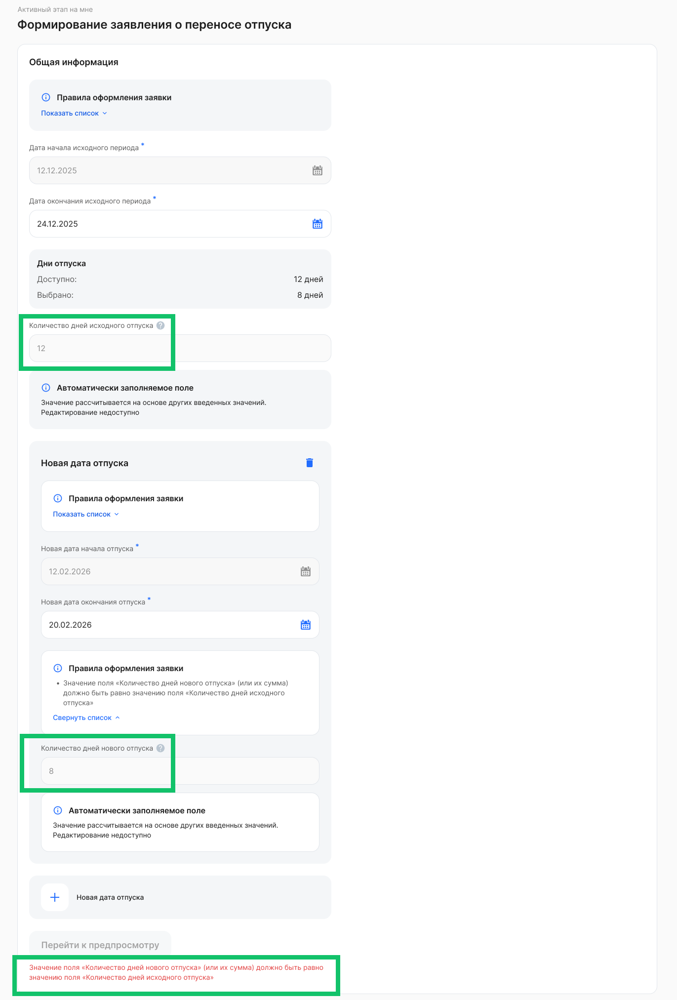

Это помогает избежать некорректного дробления отпусков и ошибок в учёте.

### **Проверка минимального количества дней отпуска** 
Система проверяет, соблюдается ли минимальная длительность отпуска, установленная в настройках планирования графика.

Заявку можно отправить, если выполняется хотя бы одно условие:

- у сотрудника уже был отпуск нужной длительности или больше;
- у него уже запланирован такой отпуск;
- в переносе сотрудник выбирает период, который соответствует минимальному количеству дней.

Посмотреть интерфейс
 

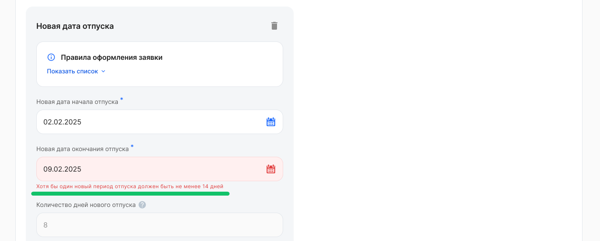

Это исключает ситуации, когда сотрудник оформляет слишком короткие периоды, не соответствующие корпоративным правилам.

### **Автоматическое создание переноса отпуска по нескольким периодам (интеграция с 1С)**
Теперь при переносе отпуска на несколько новых периодов в 1С автоматически формируется документ «Перенос отпуска» со всеми указанными датами.

**Что важно:**

- В 1С можно передавать сразу несколько диапазонов дат.
- В 1С передаются все периоды, указанные в заявке.
- Доступны дополнительные данные (например, количество дней).
- Документ может создаваться автоматически или вручную — как и раньше.
- Полная совместимость с текущими настройками: если у компании был настроен перенос одного периода — всё продолжит работать как раньше.
- Печатные формы продолжают отправляться в заявку, если это предусмотрено процессом.

## **График отпусков**
### **Передача заявок на планирование отпусков в 1С ещё до согласования**
Теперь система может отправлять в 1С не только согласованные графики отпусков, но и активные заявки, которые ещё заполняются сотрудником.

**Что это значит:**
- В 1С возвращаются данные из **всех активных заявок** на планирование отпусков: 
  - как с шага сотрудника (ещё не отправлено на согласование),
  - так и с шага согласующего (если заявка на доработке).
- Если сотрудник ни разу не создавал заявку — передача пустого графика тоже допустима.
- К каждому графику отпусков добавлен специальный признак «Планирование у сотрудника», чтобы различать графики, которые ещё в работе, и те, которые уже отправлены на согласование.

**Что это даёт:**
- 1С теперь видит все активные заявки на планирование отпусков, даже если они ещё не согласованы;
- исключает необходимость ручного контроля: всегда видно, что планируется;
- упрощает интеграцию и учёт в 1С.

## **Графики работы**
### **Учет рабочих графиков в дедлайнах и уведомлениях**
Теперь все дедлайны и уведомления рассчитываются с учётом индивидуального рабочего графика сотрудника.

**Что это значит:**

- Дата завершения этапа теперь падает на **рабочий день исполнителя**, а не на календарный.
- Уведомления приходят:
  - за N **рабочих**, а не календарных дней до события;
  - или через N рабочих дней после события.
- Учитывается график:
  - получателя уведомления;
  - или сотрудника, о котором идет речь в уведомлении.

Больше никаких писем «в выходной» или некорректных сроков.

## **Корпоративные документы**
### **Сроки ознакомления для сотрудника**
Реализовали возможность указать количество дней, в течение которого сотрудник должен ознакомиться с ЛНА. 

**Что это дает:** отображение сроков мотивирует сотрудника не затягивать и подтвердить ознакомление, что положительно влияет на трудовую дисциплину.

Значение количества дней может быть задано при публикации нового ЛНА или для уже опубликованного ЛНА, если по документу нет ни одного ознакомившегося сотрудника. 

Срок ознакомления для конкретного сотрудника рассчитывается с учетом даты, когда ЛНА стал доступен сотруднику, и даты, до которой ЛНА доступен сотруднику.

Примеры
  

ЛНА доступен сотрудникам с 01.10.25, период ознакомления 4 дня, версия документа доступна до 15.12.25.

Для сотрудника, которому документ был доступен с даты публикации, срок ознакомления — 05.10.25.

Для сотрудника, который был принят в компанию 15.10.25, срок ознакомления — 19.10.25.

Для сотрудника, который был принят в компанию 12.12.25, срок ознакомления — 15.12.25.

Срок ознакомления отображается сотруднику в интерфейсе КЭДО, в уведомлениях, а также в уведомлениях руководителю. 

<info>

Включение уведомлений сотруднику и руководителю о подчиненных, не ознакомившихся с ЛНА, выполняется отдельно

</info>

Посмотреть интерфейс
 

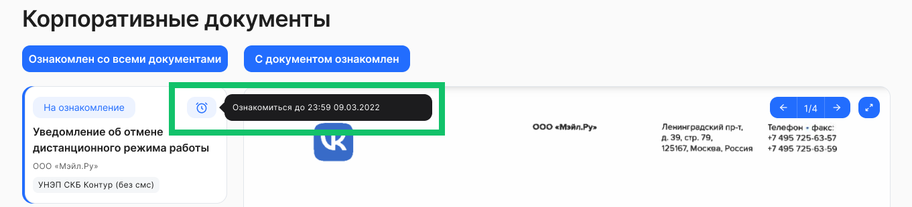

Срок ознакомления не влияет на доступность ЛНА или возможность подтвердить ознакомление, но по истечении отображается маркер, что срок ознакомления нарушен.

Посмотреть лист ознакомления
 

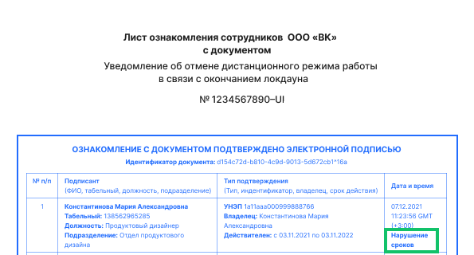

### **Выгрузка информации об ознакомлении только по работающим сотрудникам**
Изменили правила формирования выгрузки информации об ознакомлении в Excel. Теперь выгрузка выполняется только по последней опубликованной версии ЛНА, только по сотрудникам, работающим на момент выгрузки. То есть из выгрузки исключаются неактуальные версии документов и уволенные сотрудники.

**Что это дает:** выгрузка содержит только актуальные данные, необходимые для контроля сроков ознакомления.

### **Кроме того**
Исправили ошибки, возникающие при редактировании списка сотрудников, по ранее опубликованному корпоративному документу.

## **Модуль найма**
### **Ограничение доступа к анкетам кандидатов по автору**
Реализовали возможность ограничить доступ к анкетам кандидатов по автору. При включении ограничения анкета доступна сотруднику с ролью «Рекрутер», который её создал, и руководителю этого сотрудника, прочие сотрудники с ролью «Рекрутер» анкету не видят. На доступность анкеты для прочих ролей-участников бизнес-процесса ограничение не влияет.

**Что это дает:** возможность управления доступом к анкетам и заявкам с чувствительными данными.

Для подключения ограничения доступа к анкетам обратитесь в [поддержку VK HR Tek](/ru/hr/support/contact_channels). 

<info>

Ограничение доступа по автору может быть настроено не только для анкет кандидатов, но и для любого типа заявок.

</info>

## **Сотрудники**
### **Отображение руководителя по выбранной структуре в профиле сотрудника**
Теперь в профиле сотрудника можно отображать не только руководителя «по умолчанию», но и руководителя по любой выбранной оргструктуре. Правило, по какой именно структуре отображать руководителя, определяется в разделе **Настройки компании → Работа с оргструктурами**.

**Что это дает:** гибкость настройки и полноту отображаемой информации для сотрудника.

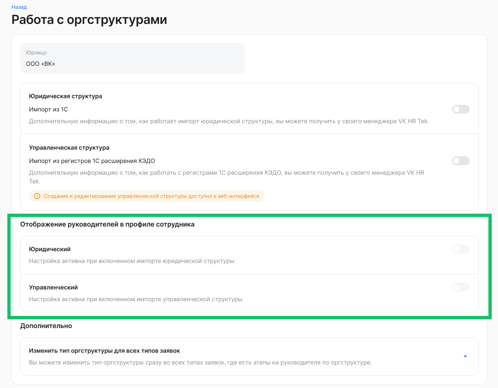

## **Электронная подпись (УНЭП)**
**Информативные подсказки при ошибках выпуска УНЭП**

Добавили информативные подсказки при ошибках выпуска УНЭП в двух сценариях:

- при регистрации и выпуске ЭП для сотрудника, 
- в разделе **Сотрудники** для представителей компании.

Подсказки связаны с кодами ошибок от Контура и СМЭВ и различаются в зависимости от роли: сотруднику показываем понятное человеческое объяснение и ссылку на статью в Базе знаний, а кадровому специалисту – что именно проверить в кадровой системе и в каких случаях нужно обращаться в поддержку VK HR Tek.

**Что это дает:** 

- cотрудники получают понятные подсказки и могут сами разобраться, почему не выпускается УНЭП и что делать дальше,
- кадровики получают конкретные инструкции по проверке данных и критериям для обращения в поддержку.

Это снижает количество обращений в поддержку, сокращает время на выпуск подписи и уменьшает число технических ошибок для пользователя. 

Посмотреть интерфейс раздела «Сотрудники»
 

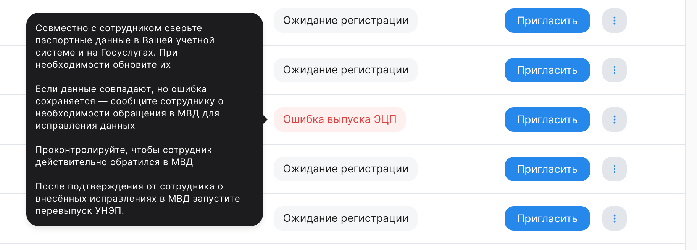

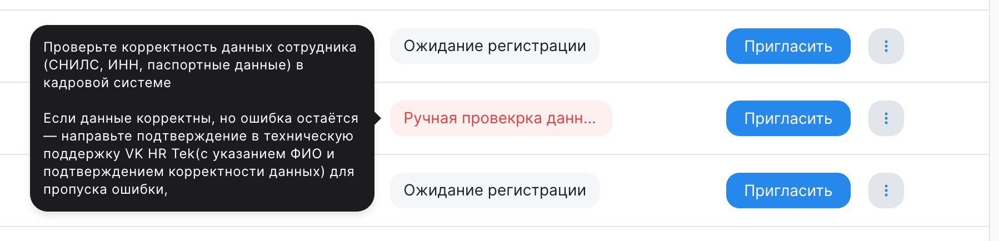

Посмотреть интерфейс подсказок
 

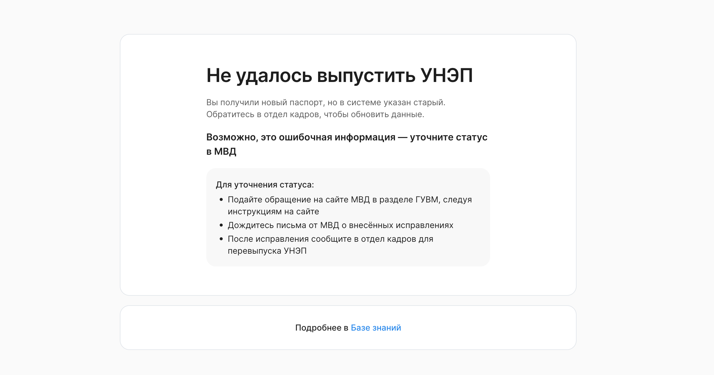

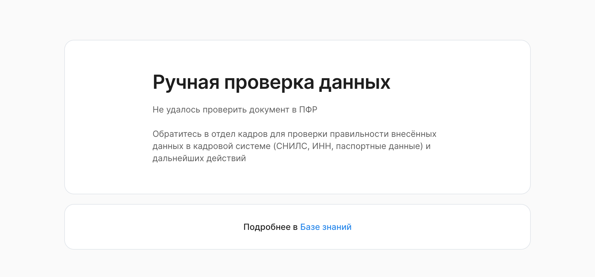

