## Главная страница / UI

### Ссылка на базу знаний

Добавили маленькую, но очень важную ссылку на **Базу знаний** (вы сейчас находитесь в ней).  
Теперь она всегда будет под рукой — на случай, если понадобится быстро уточнить, как работает наш сервис.

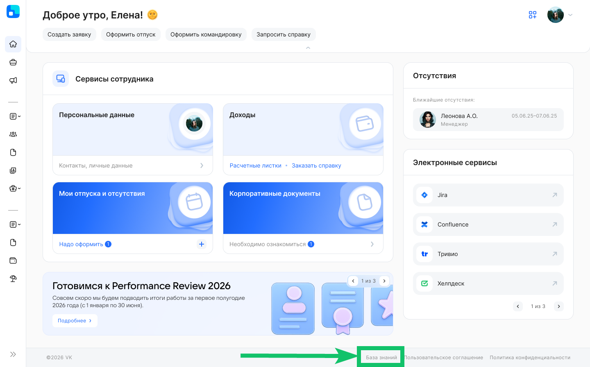

## Часовые пояса

Расширяем возможности настройки разных часовых поясов в рамках компании — добавили возможность использовать данные сотрудника из 1С для определения его часового пояса. Импорт данных о часовых поясах из 1С в КЭДО работает с адресами рабочих мест сотрудников.

В качестве источника рабочего адреса сотрудника в 1С используется поле «АдресРабочегоМеста» из типового регистра «Персональные данные сотрудника».

Настройка будет доступна после выпуска новой версии расширения 1С 2026.01.00. 

Настройка в 1С
 

Чтобы настроить импорт из 1С:

1. Перейдите в раздел **Начальная настройка → Настройки функциональности → Сотрудники и пользователи**.
2. В настройке **Источник рабочего адреса сотрудника** выберите вариант **Регистр персональных данных сотрудников**.

Инструкция администратора
 

1.  Перейдите в раздел **Настройки компании**, в настройку **Часовой пояс** и нажмите кнопку **Настроить**.

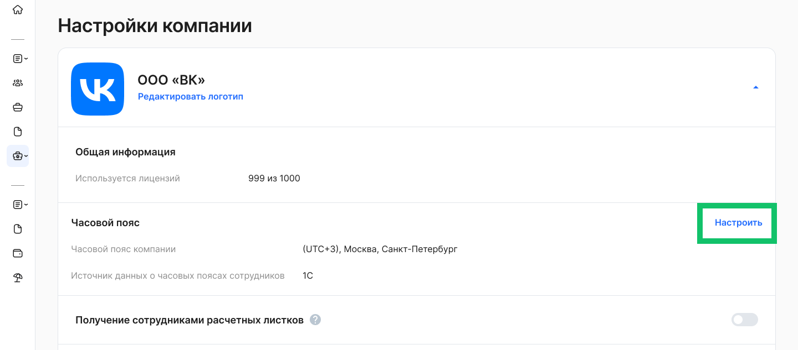

2. На странице настройки часового пояса включите настройку **Импорт из 1С**.

3. В таблице с часовыми поясами сотрудников могут отображаться следующие статусы:

- **Ожидание данных** — означает, что данные по сотруднику еще не получены из 1С. Рекомендуем обновить страницу через некоторое время. 
- **Импортирован из 1С** — данные по часовому поясу успешно переданы из 1С.
- **Не передано** — не удалось определить часовой пояс для сотрудника. В этом случае в качестве часового пояса сотрудника будет указан часовой пояс компании. 
- **Не определено** — сервис не смог определить часовой пояс по адресу рабочего места сотрудника, переданному из 1С. Попробуйте уточнить значение адреса рабочего места сотрудника в 1С. 

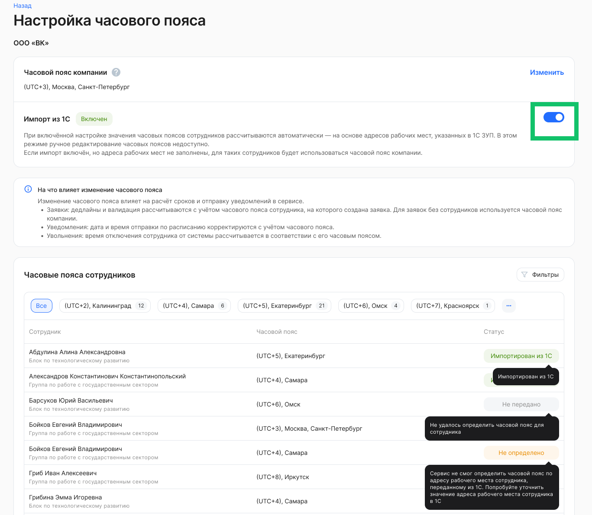

## Бизнес-процессы

### Настройка согласований управленческим руководителям

Теперь вам не нужно настраивать правила согласования руководителем по управленческой структуре вручную для каждого нового процесса. Мы добавили возможность установить значения по умолчанию на уровне всей компании или отдельных подразделений.

Если для подразделения установлены особые правила, они будут иметь приоритет над общими настройками компании.

Инструкция администратора
 

Чтобы указать настройку согласования руководителем по умолчанию для всех бизнес-процессов компании:

1.  Перейдите в раздел **Настройки компании**, в настройку **Согласование руководителями по бизнес-процессам** и нажмите кнопку **Настроить**.

2. Выберите настройку согласования по умолчанию для всех подразделений из следующих вариантов:

- **Всех**,
- **Только прямых**,
- **Никого**.

И сохраните выбор.

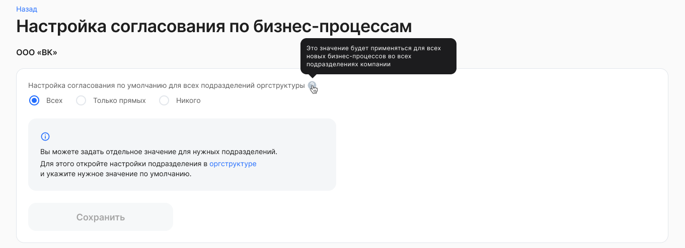

Чтобы указать настройку согласования руководителем по умолчанию для всех бизнес-процессах для определённого подразделения:

1.  Перейдите в раздел **Компания** и выберите необходимое подразделение для редактирования.
2.  На странице редактирования, в блоке **Согласование по бизнес-процессам** выберите настройку согласования по умолчанию для новых подразделений из следующих вариантов:
    - **Всех**,
    - **Только прямых**,
    - **Никого**.

И сохраните выбор.

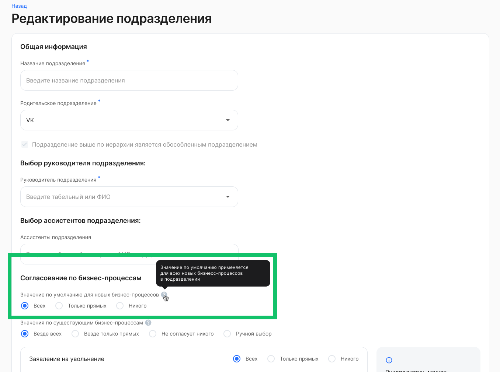

### Новые возможности согласования документов руководителями

Теперь вы можете создавать заявки, которые согласовываются руководителями подразделений, без привязки к конкретному сотруднику. Это первый шаг к удобному процессу рассылки и согласованию табелей. При создании заявки можно выбрать согласующих из числа руководителей — по управленческой, юридической или функциональной структуре. Заместители руководителей также получат доступ к таким заявкам.

<info>

Настройка бизнес-процесса является платной. Для подключения обратитесь в [поддержку VK HR Tek](/ru/hr/support/contact_channels).

</info>

Следующим шагом мы планируем реализовать автоматизацию и рассылку табелей в нашем модуле 1С.

### Новые атрибуты для листинга и «шапки» заявки

Расширили список атрибутов, которые появляются в листинге и «шапке» заявки. В список добавляем ключевые даты типовых бизнес-процессов, которые важно легко найти и проверить.

Список новых атрибутов:

1.  Дата увольнения.
2.  Дата заключения договора.
3.  Дата начала испытательного срока + Дата окончания испытательного срока.

<info>

Настройка бизнес-процесса является платной. Для подключения обратитесь в [поддержку VK HR Tek](/ru/hr/support/contact_channels).

</info>

## Аккаунты

Сделали первый шаг к управлению настройками на уровне аккаунта. Это первый релиз с такими настройками — дальше будем постепенно расширять возможности и добавлять новые параметры.

<info>

Для получения доступа к настройкам аккаунта надо создать обращение через [портал самообслуживания](/ru/hr/support/contact_channels/portal_instructions) с типом **«Назначить роль "Администратор аккаунта"»** (ссылка на [портал](https://support.mcs.mail.ru/login?redirectFrom=/tickets/create)).

В форме создания обращения выберите:
- Тип услуги: **VK HR Tek**,
- Категория услуги: **VK HR Tek: Компания, сотрудники и интеграции**,
- Группа услуги: **Управление ролями и профилями доступа**,
- Услуга: **Назначить роль "Администратор аккаунта"**.

И укажите, каким пользователям необходимо добавить права Администратора аккаунта.

</info>

### Роли сотрудников

Теперь можно создавать роли сотрудников, общие для всех компаний в вашем аккаунте, и управлять правами доступа централизованно — в одном месте, а не в каждой компании отдельно. Это позволяет сократить время настройки прав для новых сотрудников и новых компаний в несколько раз, а также снижает риск ошибок и несогласованности в правах доступа.

Как это работает: администратор аккаунта может создать роль (например, «Отдел кадров») в разделе настроек аккаунта, добавить её сотрудникам — они автоматически получат соответствующие доступы к заявкам, где участвует эта роль во всех компаниях аккаунта. Можно делать массовые операции добавления и удаления пользователей. Функция доступна для всех типов аккаунтов через веб-интерфейс и API.

Инструкция администратора веб-сервиса
 

1.  Перейдите в раздел **Настройки КЭДО → Настройки аккаунта**.
2.  В блоке **Настройка доступов к данным → Роли сотрудников** нажмите кнопку **Настроить**.

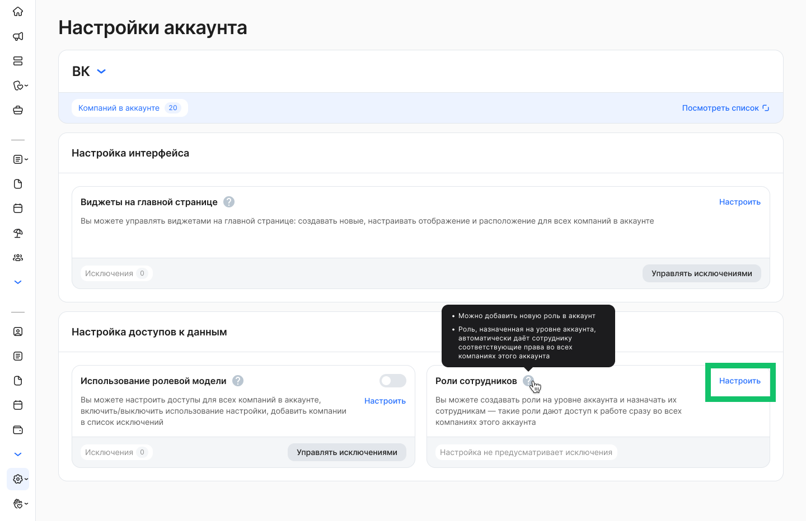

3. Чтобы добавить новую роль нажмите кнопку **Добавить новую роль**.

4. На странице **Добавление роли** заполните название роли и выберите родительскую роль. 

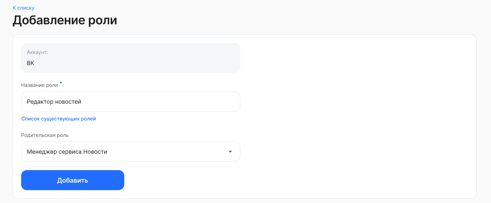

5. Чтобы назначить роль на одного сотрудника или на группу сотрудников, нажмите кнопку **Назначить роль** на странице **Аккаунт: роли сотрудников**.

6. На странице **Назначение ролей сотрудникам** заполните поля в зависимости от выбранного варианта в настройке **Назначить роль** — **На одного сотрудника** или **На группу сотрудников**. 

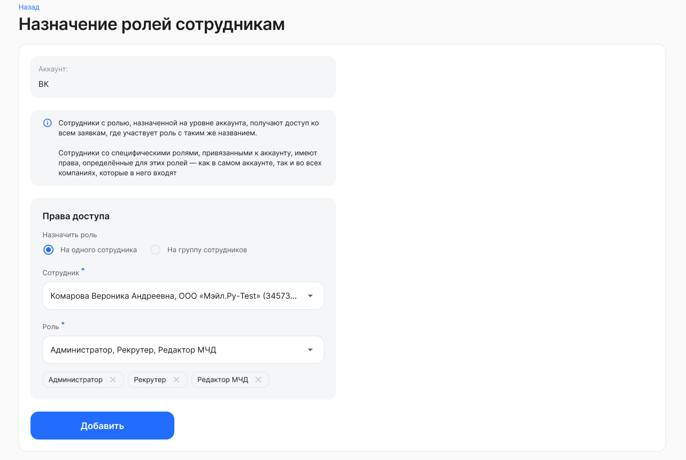

### Ролевая модель

Настройка ролевой модели один раз для всех компаний в рамках аккаунта — упрощает администрирование крупных холдингов и сетевых структур. Вместо повторной настройки прав доступа в каждой компании, достаточно сконфигурировать модель на уровне аккаунта, и все компании автоматически унаследуют эти настройки.  Администратор может также отметить отдельные компании как исключения, для которых будут действовать собственные настройки ролевой модели.

Доступно для администраторов аккаунта через новый раздел **Настройки аккаунта** в веб-интерфейсе.

Инструкция администратора

1. Перейдите в раздел **Настройки КЭДО → Настройки аккаунта**.

2. В блоке **Настройка доступов к данным → Использование ролевой модели** можно выполнить следующие действия:

2.1. Включить/отключить использование ролевой модели на аккаунт. 

2.2. Настроить ролевую модель на аккаунт.

2.3. Управлять исключениями — компаниями, которые имеют ролевую модель, отличимую от модели аккаунта. 

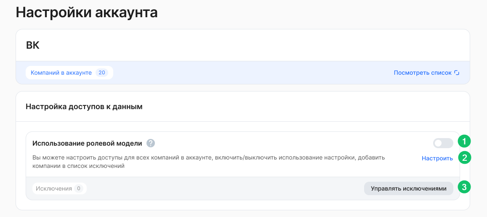

3. Чтобы настроить доступы к данным для всех компаний в аккаунте, кроме исключений, нажмите кнопку **Настроить**. Настройки можно редактировать, когда ролевая модель не используется (состояние **Выключено**), а затем включить уже настроенную модель. 

4. На странице **Аккаунт: настройка доступов к данным** можно настроить доступ к разделам и данным сервиса для всех сотрудников, руководителей, представителей компании. По завершении редактирования настроек сохраните изменения. 

5. Чтобы настроить ролевую модель для отдельной компании в аккаунте, нажмите кнопку **Управлять исключениями** на странице **Настройки аккаунта**.

6. На странице **Управление исключениями**, если в список исключений ранее были добавлены компании, то можно отредактировать настройки доступа для этих компаний. Для этого нажмите на строку с названием компании в списке. 

7. Для добавления компании в список исключений нажмите кнопку **Добавить исключение**.

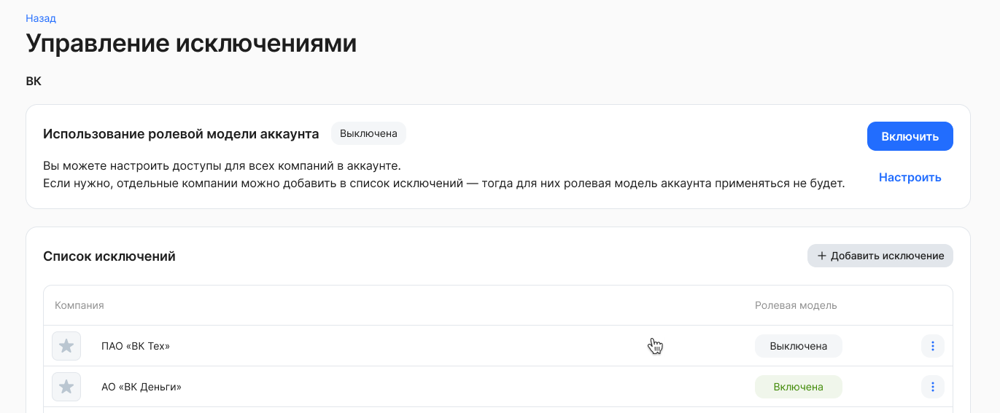

8. Добавьте компании из выпадающего списка и сохраните выбор. 

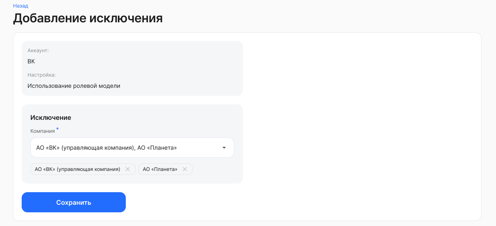

### Общие настройки для бизнес-процессов

Администраторы получили возможность задавать единые настройки на уровне аккаунта, которые автоматически распространяются на все компании. Для каждой компании можно указать исключения — настройки, отличные от аккаунтных, — что особенно удобно для холдингов и компаний с большим количеством юридических лиц. 

Планируем перенести на уровень аккаунт также все настройки, связанные с интерфейсами (включая управление логотипом) и электронными подписями и другие.

Инструкция администратора веб-сервиса

1. Перейдите в раздел **Настройки КЭДО → Настройки аккаунта**.

2. В блоке **Бизнес-процессы** можно включить/отключить следующие настройки: 

- Рассылка расчётных листков,
- Доступ сотрудника к заявке,
- Согласование заявок руководителей,
- Обновление заявок при смене руководителя,
- Импорт юридической структуры из 1С,
- Импорт управленческой структуры из 1С,
- Работа с обособленными подразделениями,
- Виджет «Ближайшая задача»,
- Скачивание сотрудниками корпоративных документов. 

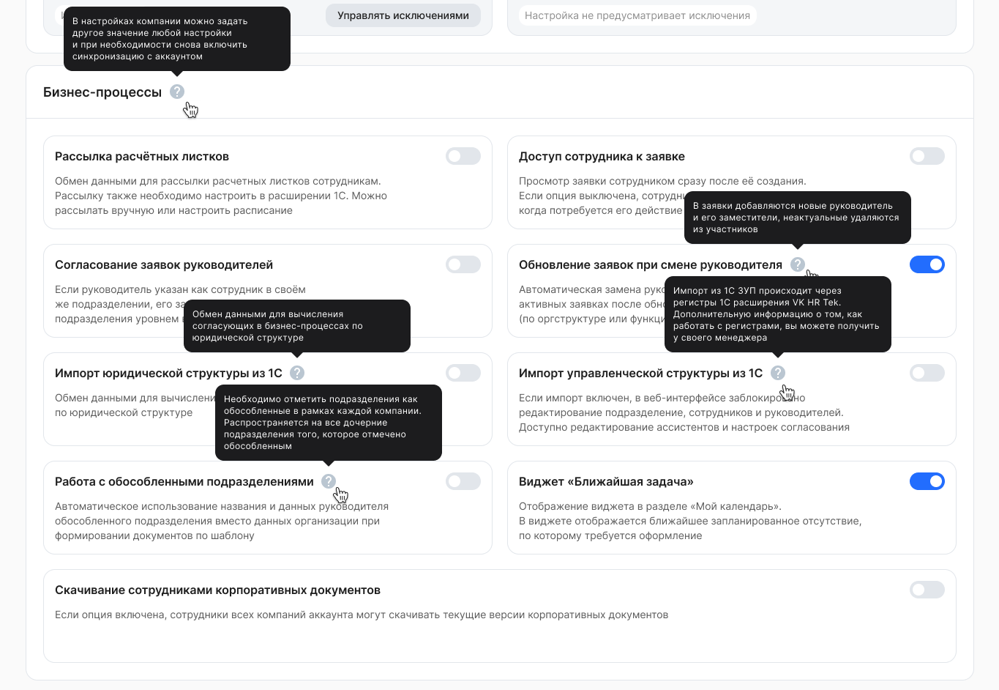

## Уведомления

### Новые типы уведомлений

Реализовали новые типы уведомлений:

- Для сотрудника при публикации ЛНА. При формировании уведомления учитывается дата, с которой ЛНА доступен для ознакомления — то есть если ЛНА опубликован 01.02.2026, но будет доступен сотрудникам только с 04.02.2026, уведомление о новом ЛНА сотрудник получит 04.02.2026.
- Для руководителя/ассистента/представители группы в случаях:
    - Отмены заявки участником процесса,
    - Отмены заявки по дедлайну,
    - Отказа от подписания,
    - Перехода заявки на следующий этап по дедлайну.

### Настройка уведомлений на аккаунт 

Теперь можно настраивать уведомления на аккаунт. При этом все компании, включенные в аккаунт, наследуют параметры настройки от аккаунта — и это существенно облегчает работу по администрированию уведомлений для группы компаний!   
При необходимости для компании можно отключить унаследованное уведомление и настроить аналогичное, но уже с другими параметрами.

### Html-письма для email-уведомлений

Реализовали возможность формировать html-письма для email-уведомлений. 

<info>

Настройка является платной. Чтобы настроить формат приветствия, изображения для «шапки» (верхней части письма) и «подвала» (нижней части письма) для всех email-уведомлений на уровне аккаунта, обратитесь в [поддержку VK HR Tek](/ru/hr/support/contact_channels).

В обращении укажите **пример приветствия** и прикрепите **файлы или ссылки на файлы** для «шапки» и «подвала», если их необходимо изменить.

</info>

### Исправления

Исправили ошибки при отправке уведомлений о планировании отпусков в выходные дни и уведомлений на группу при возврате заявки на доработку.

## График отпусков

Добавлена возможность сбросить выбор первой даты диапазона и выбрать другую дату начала отпуска. 

Кнопка **Сбросить** станет доступна после выбора первой даты рядом с названием месяца, в котором была выбрана эта дата. После выбора даты окончания кнопка исчезнет, и сбросить период можно будет только через удаление карточки с параметром отпуска.  

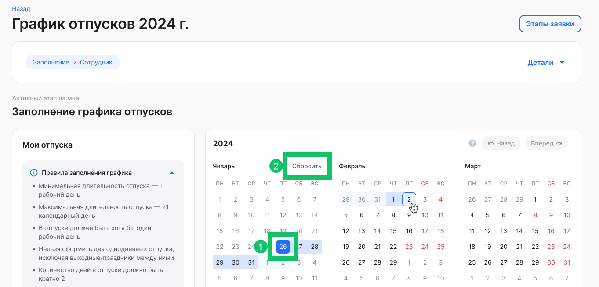

## Парольная политика

- Разрешили стандартные спецсимволы, которые раньше неожиданно блокировались.
- Усилили правило сложности: теперь обязательны и цифра, и спецсимвол.
- Применяется только к новым паролям, старые пароли останутся неизменными.

Вывод: меньше боли для пользователей, больше реальной стойкости паролей.