## **Главная страница / UI**

### **Виджет действий, которые ожидаются от пользователя**

Трансформация виджета: 

* Изменили название виджета на главной странице: Список задач → **Разделы с активными запросами**. Новое название точнее отражает суть и цель виджета.  
* Обновили дизайн, чтобы пользователь быстрее считывал данные.  
* Обновили логику — теперь блок будет оставаться в виджете, пока у вас есть хотя бы одна заявка в работе (даже если сейчас она на другом исполнителе).
* Добавили возможность настроить блоки данных, которые будут отображаться в виджете.  

Настройка виджета администратором
 
  
Для корректной настройки виджета пользователю должны быть добавлены роли «Администратор» (в компании или аккаунте) и «Администратор главной страницы».  
Для настройки расположения виджетов на главной странице:

* в рамках компании: перейдите в раздел **Настройки компании → Виджеты на главной странице** и нажмите кнопку **Настроить**;  
* в рамках аккаунта: перейдите в раздел **Настройки → Настройки аккаунта**, в блоке **Настройка интерфейса → Виджеты на главной странице** нажмите кнопку **Настроить**.

Для настройки виджета **Список задач**:

1. Перенесите виджет **Список задач** из блока **Виджеты для размещения** на основную область размещения виджетов.  
2. Нажмите на виджет **Список задач** и выберите размер виджета и значения для настройки «Разрешить сотрудникам отключать виджет».  
3. Сохраните изменения.  
4. Нажмите кнопку **Редактировать**.

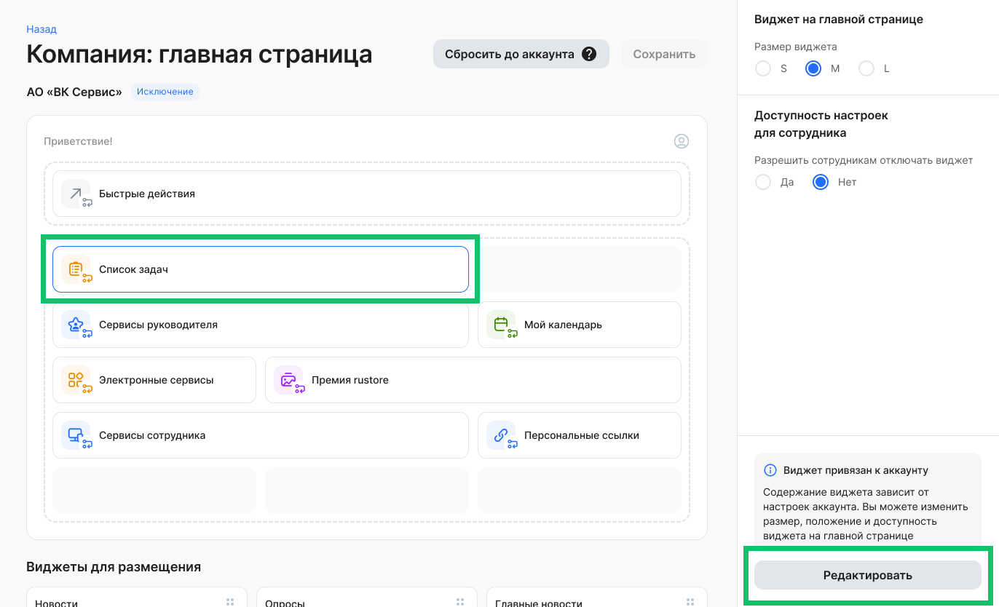

5. На странице настройки выберите разделы, которые будут отображаться в виджете линейного сотрудника — **Заявки** (будут доступны всегда), **Графики отпусков**, **Корпоративные документы**. А также выберите разделы, которые будут отображаться в виджете компании — **Заявки**, **Графики отпусков**.  
6. Сохраните изменения.  

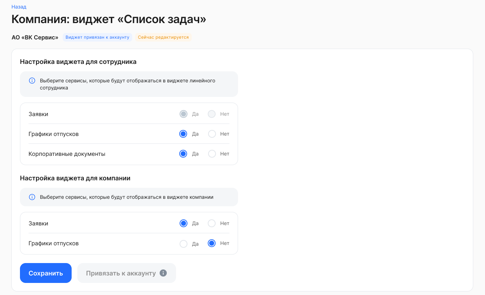

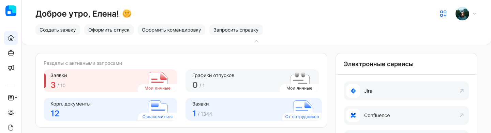

### **Синхронизация главной страницы**

Для клиентов, у которых больше одного юридического лица — в разделе управления виджетами компании появится возможность синхронизации с аккаунтом. Для полноценного запуска ждем следующий релиз — в нем мы добавим в аккаунты и компании все новые виджеты, и администраторам останется только настроить, расположить их в нужном порядке и включить. Пока в аккаунте нет виджетов, кнопка синхронизации останется неактивной.  

Посмотреть, как выглядит кнопка
 

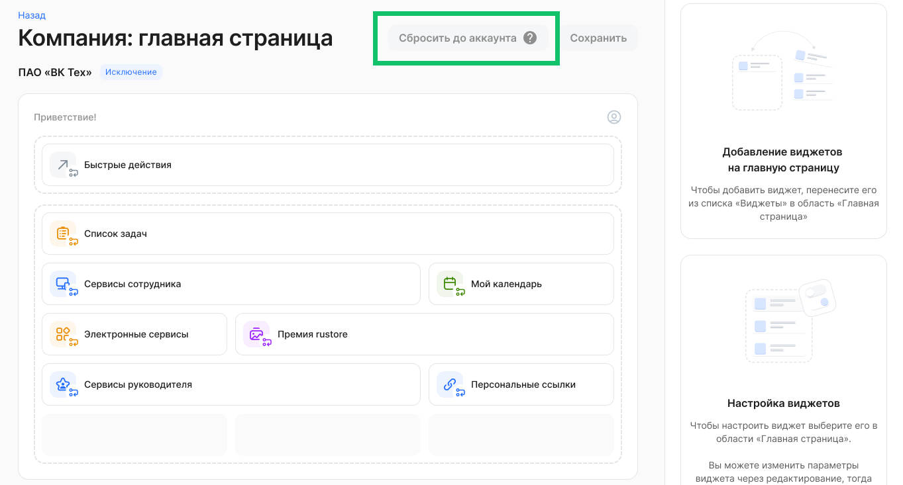

## **Бизнес-процессы**

### **Массовая рассылка**

Добавили  возможность загружать список сотрудников файлом .csv, чтобы сократить время на выбор сотрудников для массового создания заявок в тех случаях, когда списки сотрудников ведутся и согласуются вне КЭДО.

Опцию необходимо включить в настройках бизнес-процесса.

<info>

Настройка бизнес-процесса является платной. Для подключения обратитесь в [поддержку VK HR Tek](/ru/hr/support/contact_channels)  

</info>

Посмотреть, как работает новый функционал
 

1. В форме создания заявки с типом рассылки «Массовая рассылка» можно загрузить список сотрудников из файла .csv. Вариант с ручным выбором сотрудников остаётся доступным.  
2. После загрузки файла система должна отобразить уведомление об успешном добавлении сотрудников.  
3. Если в файле обнаружена хотя бы одна блокирующая ошибка из возможных типов, загрузка считается неуспешной — отображается сообщение в зависимости от ошибки.

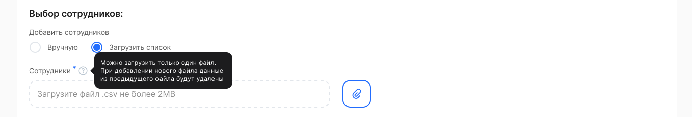

Загрузка файла .csv доступна при одновременном выполнении следующих условий:

1. Размер файла — не более 2 МБ.  
2. Каждая строка файла соответствует одному сотруднику.  
3. Строка содержит поля:

* EmployeeID, обязательное.  
* ФИО и прочие поля, необязательные.

[Шаблон для загрузки сотрудников по EmployeeID.csv](./assets/csv-EmployeeID.csv "download")

Также в интерфейс массовой рассылкой добавили возможность отфильтровать список сотрудников по должности. Должности в списке для выбора приведены в алфавитном порядке.

Посмотреть интерфейс заявки
 

 

### **Объединяющий статус этапов**

В настройки бизнес-процессов добавили новую опцию — указать произвольный обобщающий статус на несколько этапов. Карточка с этим статусом размещена в шапке заявки, статус помогает быстрее сориентироваться в сложных процессах и понять, на какой стадии находится заявка. Например, можно увидеть, что новая премия уже прошла все этапы согласования и находится на стадии оформления документов.  

<info>

Настройка бизнес-процесса является платной. Для подключения обратитесь в [поддержку VK HR Tek](/ru/hr/support/contact_channels)

</info>

Посмотреть, как выглядит карточка нового статуса
  

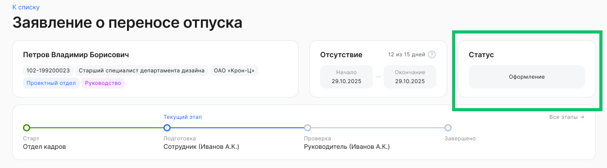

## **Корпоративные документы / ЛНА**

### **Выгрузка отчётов по корпоративным документам (ЛНА) в Excel**

В разделе **Корпоративные документы** доступна выгрузка отчётов в формате Excel (.xlsx) по статусу ознакомления сотрудников с локальными нормативными актами (ЛНА).

#### **Варианты формирования отчётов**

По всем корпоративным документам:

* отчёт по всем сотрудникам (ознакомившиеся и неознакомившиеся);  
* отчёт только по сотрудникам, не ознакомившимся с документами.

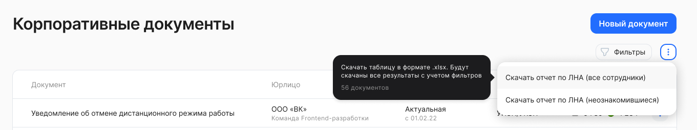

По конкретному документу:

* отчёт по всем сотрудникам (ознакомившиеся и неознакомившиеся) — скачивание по одному выбранному документу;  
* отчёт только по сотрудникам, не ознакомившимся с выбранным документом — скачивание по одному выбранному документу и только по сотрудникам без отметки об ознакомлении с актуальной версией документа. 

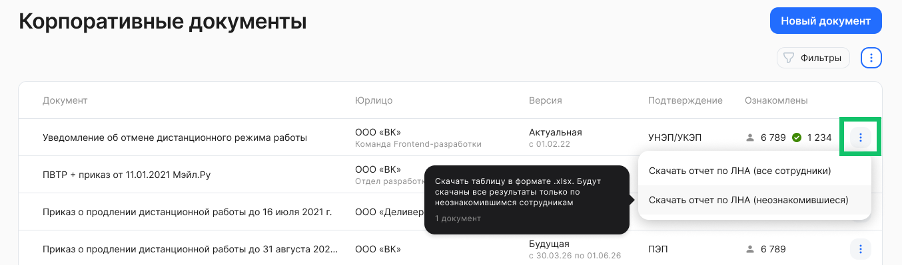

#### **Правила формирования отчёта**

* в выгрузку включаются только актуальные версии ЛНА;  
* если у документа несколько версий, используется версия, отмеченная как актуальная;  
* уволенные сотрудники не включаются в отчёт;  
* логика формирования данных соответствует текущей выгрузке по всем ЛНА, с возможностью выбора дополнительных режимов формирования отчёта.

### Иерархия документов ЛНА

Добавлена новая функциональность по настройке и ведению иерархии категорий корпоративных документов:
- добавление и удаление категорий;
- выбор категории для публикуемого документа;
- просмотр иерархической структуры в разделе **Сервисы компании → Корпоративные документы** → кнопка **Управление категориями**;
- фильтрация документов по категории.

Максимальный уровень вложенности категорий — 3.

**Бизнес-ценность**

Категоризация большого количества документов позволит:

- выполнить быстрый поиск в списке корп. документов;
- разграничить доступы к документам.

Категории корп. документов можно создавать только на аккаунт (отдельно на юрлица запрещено). 

Создание категории
 

1. Перейдите в раздел **Сервисы компании → Корпоративные документы** и нажмите кнопку **Управление категориями**.

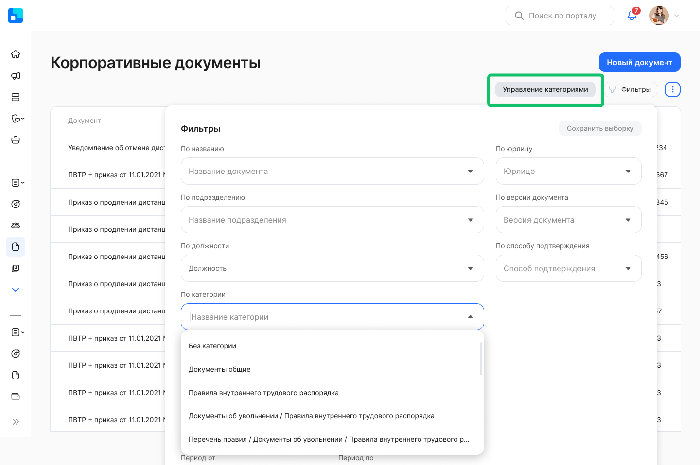

2\. На странице **Категории корпоративных документов** нажмите кнопку **Создать категорию**.

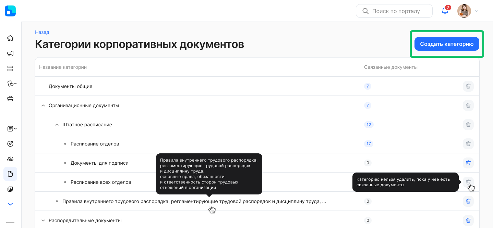

3\. В форме **Создание категории** заполните наименование аккаунта (если есть доступ к нескольким аккаунтам), придумайте название категории и, если требуется, выберите родительскую категорию. 

Название категории должно быть уникальным внутри аккаунта и содержать не более 256 символов.

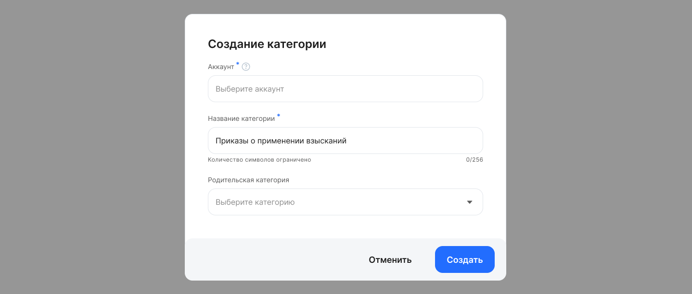

4\. Нажмите кнопку **Создать**. 

## **График работы**

### **Отображение графика работы в календарях**

Во всех календарях системы КЭДО отображается цветовая индикация графика работы сотрудников. Это помогает быстро понимать, какие дни являются рабочими, выходными или нерабочими по индивидуальному графику сотрудника.  

Индикация учитывает актуальный график работы и отображается в различных календарных интерфейсах системы.  

**Где отображается:**

1.  Раздел **Мой календарь** и виджет **Мой календарь**: отображается график работы текущего пользователя.  
Цветовая индикация позволяет сразу видеть свои рабочие и нерабочие дни.

Посмотреть раздел «Мой календарь»
    

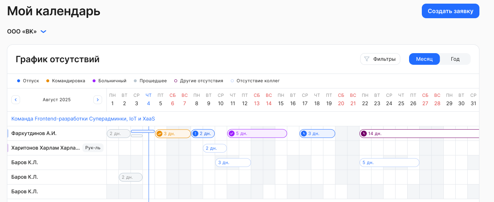

* Синяя вертикальная линия — текущий день.  
* Серые ячейки — выходные дни сотрудника.  
* Белые ячейки — рабочие дни.

2. Раздел **Рабочее время**: индикация отображается для всех сотрудников, представленных в календаре.  
3. **Календарь планирования отпусков**:

- для сотрудника — показывается его собственный график работы;  
- для пользователей, работающих с группой сотрудников — отображается график каждого сотрудника.

4. Индикация при выборе даты в заявках: в календаре при выборе дат будут подгружаться рабочие и выходные дни в соответствии с графиком.

Посмотреть интерфейс
 
 
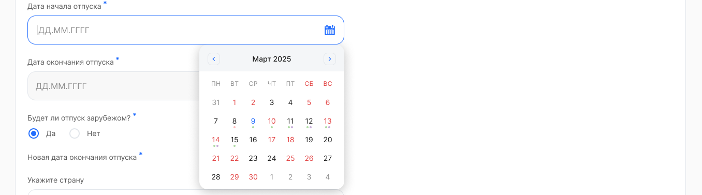

* Даты, выделенные красным — нерабочие дни сотрудника.  
* Даты, выделенные черным — рабочие дни.  
* Синяя дата — текущий день.

**Как работает визуальное представление в календаре заявки:**

* если заявка создаётся для конкретного сотрудника, календарь показывает его график работы с датами, которые выделены красными и черными цветами;  
* если заявка массовая или создаётся без указания сотрудника, график не выделяется цветом.

<info>

График работы настривается в 1С и передается в КЭДО при включенной настройке импорта. Для включения настройки обратитесь в [поддержку VK HR Tek](/ru/hr/support/contact_channels)  

</info>

## **Аутентификация**

### **Сброс номера телефона сотрудника**

В разделе **Сотрудники** добавили кнопку **Сбросить номер телефона**, которая позволяет отвязать текущий номер, завершить активные сессии, сбросить параметры регистрации и автоматически отправить пользователю новое приглашение на email для повторной регистрации с новым номером. 

Ранее при забытом пароле для сброса данных нужно было обращаться в поддержку VK HR Tek, что замедляло рабочий процесс.  

Теперь механизм доступен прямо в кабинете компании без обходных действий.  

Функция нужна в случае, когда сотрудник не помнит пароль и уже не имеет доступа к старому номеру телефона, указанному при регистрации в КЭДО.

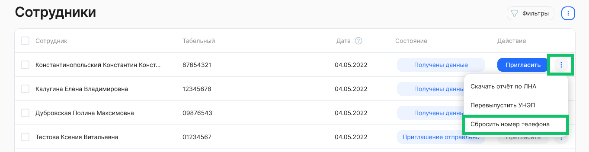 

## **Электронная подпись**

### **Выпуск УНЭП: обработка ошибок ЕСИА и Контур**

Сделали понятную обработку ошибок выпуска УНЭП. Теперь сотрудник и представители компании с доступом к разделу **Сотрудники** видят не просто статус ошибки, а понятное объяснение причины и следующий шаг.

Также добавили повторную отправку подтверждения на Госуслуги для части сценариев и напоминание сотруднику, если он не завершил выпуск вовремя.  

Добавлен новый триггер уведомлений для однократного СМС-напоминания при незавершенном подтверждении выпуска УНЭП через ЕСИА. 

Примеры ошибок
 

**Для сотрудника**

Код ошибки: Unknown / UnknownConfirmationError  
Произошла неизвестная ошибка / Произошла неизвестная ошибка подтверждения

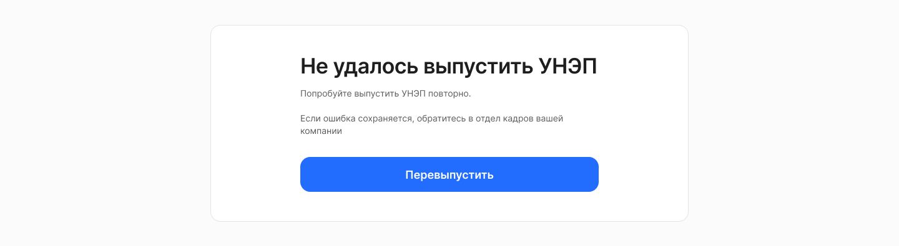

**Для представителей компании**

Код ошибки: Unknown / UnknownConfirmationError 
Произошла неизвестная ошибка / Произошла неизвестная ошибка подтверждения  

  

### **Использование УКЭП без загрузки открытого ключа в КЭДО**

Добавили режим подписания УКЭП без обязательной предзагрузки открытого ключа в КЭДО. Это упрощает старт подписания, снижает число ошибок из-за неверно предоставленного ключа или неподходящего формата, уменьшает количество обращений в поддержку и особенно полезно для компаний с большим числом кадровых специалистов.  

## **Сообщества**

<info>
Для подключения сервиса «Сообщества» обратитесь к вашему менеджеру VK HR Tek 
</info>

**Сообщества — место для общения и обмена опытом.**  

Мы рады сообщить о выходе нового сервиса «Сообщества». Это пространство, где сотрудники вашей компании смогут легко и удобно общаться, делиться знаниями и находить единомышленников. Здесь выстраивается живая корпоративная культура: от рабочих проектов до сообществ по интересам — будь то благотворительность, спорт или настольные игры.  
Сервис решает сразу несколько задач:

1. Знания не теряются: ценный опыт быстро передаётся между коллегами.  
2. Команда становится ближе: неформальное общение укрепляет связи.  
3. Растёт вовлечённость: каждый находит что-то интересное для себя.  
4. Экспертиза сохраняется: интеллектуальный капитал компании остаётся в команде.

**Для кого это решение?** 

Идеально для компаний, которые хотят усилить дух команды, наладить общение между отделами и сохранить ценные знания.  

Посмотреть список сообществ

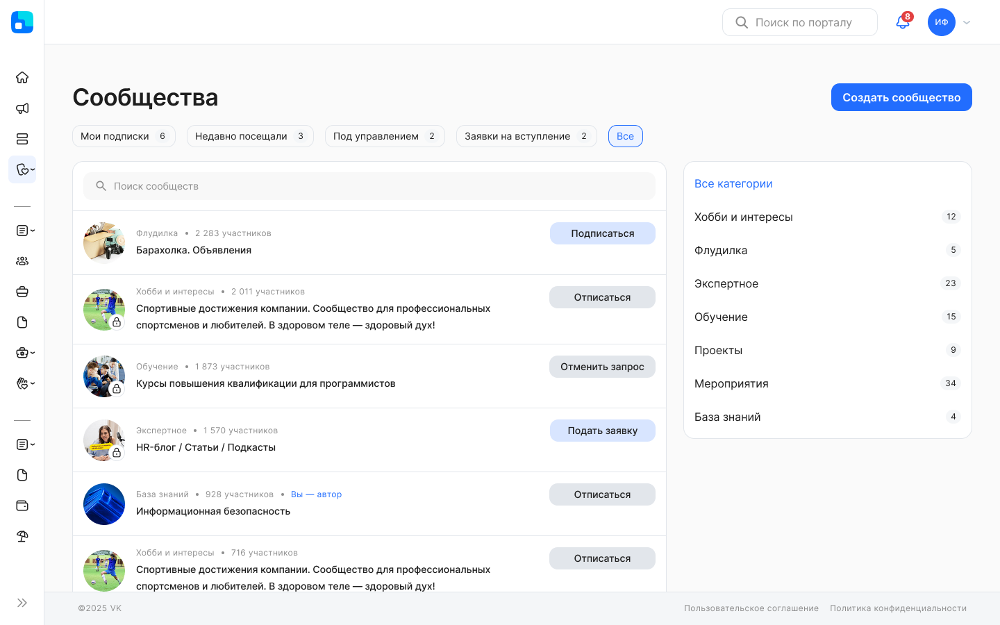

Посмотреть страницу сообщества

  
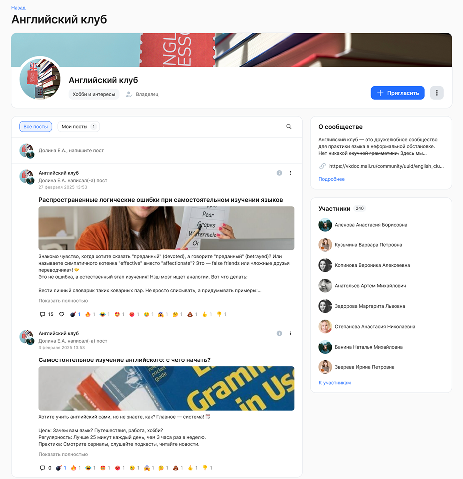  

Подробные инструкции о работе с сервисом «Сообщества» приведены в [статьях](/ru/hr/portal/communities). 

## **Портальные виджеты**

<info>
Для подключения социальных сервисов обратитесь к вашему менеджеру VK HR Tek
</info>

Добавили возможность настраивать виджеты **Главные новости** и **Лента публикаций**. Подробнее в [статье](/ru/hr/portal/widgets).

## **Новости**

<info>
Для подключения сервиса «Новости» обратитесь к вашему менеджеру VK HR Tek
</info>

### **Работа с таблицей**

Добавили дополнительные возможности по работе с таблицей в редакторе текста при создании/редактировании новости.  
Новый действия с таблицей:  
1. Добавить/удалить столбцы и строки.  
2. Залить ячейки цветом.  
3. Удалить таблицу.  

Посмотреть интерфейс

  
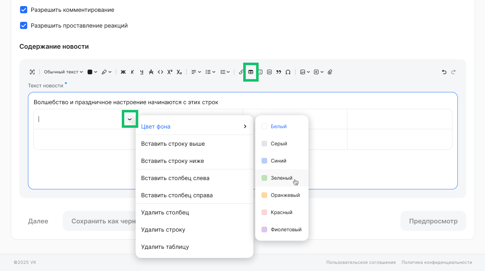

### **Фиксация панели инструментов в текстовом редакторе**

Зафиксировали панель инструментов в текстовом редакторе. Теперь при вертикальной прокрутке содержимого редактора, панель инструментов останется видимой в его верхней части, пока не будет достигнут конец редактируемого текста. 

Посмотреть интерфейс

 
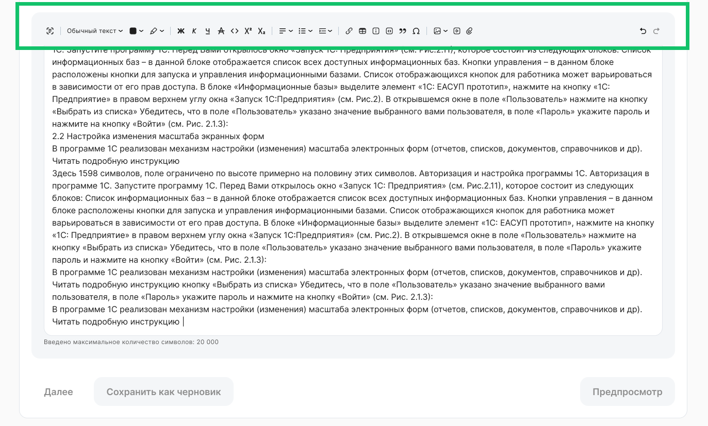

## **Опросы**

<info>
Для подключения сервиса «Опросы» обратитесь к вашему менеджеру VK HR Tek
</info>

### **Предварительный просмотр опроса автором**

Добавили возможность предпросмотра при создании/редактировании опроса.   
Предпросмотр опроса доступен при условии, что все обязательные поля опроса заполнены и должен быть создан хотя бы один вопрос с заполненными обязательными полями.  

Посмотреть интерфейс

   
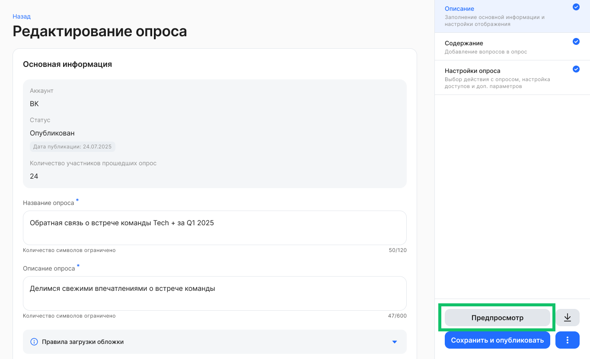

### **Уведомления. Триггеры по опросам**

Добавили триггеры по портальным уведомлениям:

* Уведомление пользователей о запуске опроса.  
* Напоминание пользователям о необходимости пройти опрос.  
* Уведомление пользователей, что опрос завершен.

Уведомления по опросам доступны в «колокольчике», в разделе **Уведомления** и в электронной почте пользователя. Если опрос больше не доступен пользователю по правам доступа, то при переходе к опросу из уведомления будет отображаться информация об ошибке: «Опрос больше не доступен».