## **Главная страница / UI**

### **Новый раздел для навигации по бизнес-процессам**

Новый раздел **Рабочие ситуации и запросы** — единая точка входа, когда нужно создать заявку. Задача раздела — уменьшить количество ошибок и обращений в HR: сотрудники видят, что можно оформить в системе, и находят нужное действие быстрее.  
Категории охватывают основные рабочие ситуации: отпуска, рабочее время и выходные, командировки, справки, персональные данные и документы, выплаты и льготы, переводы и изменение условий труда.

Посмотреть интерфейс
 

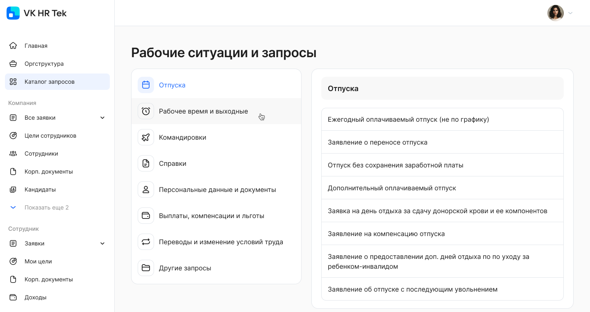

Инструкция для администратора

1. Перейдите в раздел **Настройки компании** → настройка **Управление каталогом запросов**.  
2. Нажмите кнопку **Настроить**.  

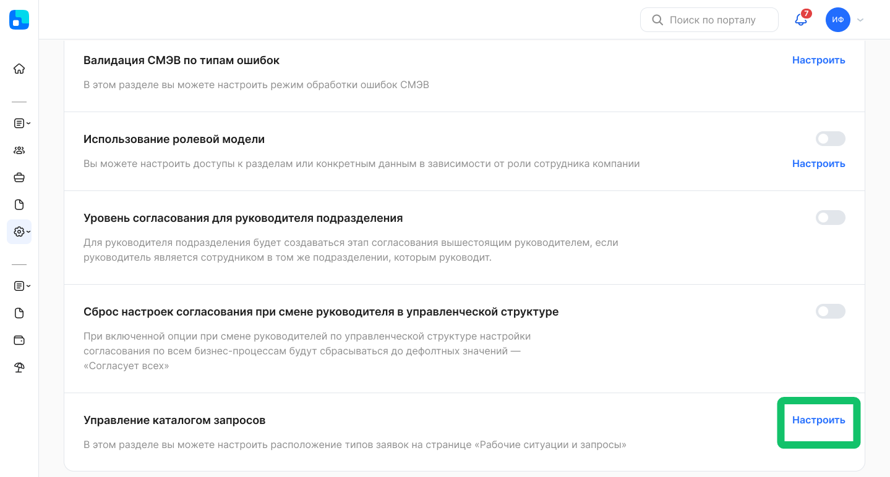

3\. Нажмите на строку с названием коллекции, чтобы настроить порядок типов заявок.

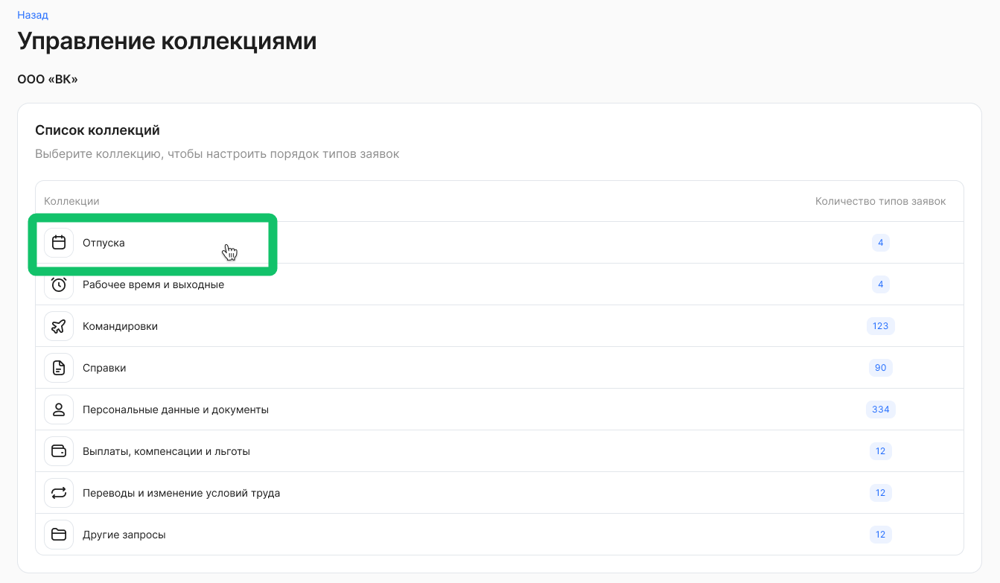

4. Определите порядок, в котором бизнес-процессы будут расположены в рамках коллекции (столбец **Приоритет**).   
5\. Включите опцию **Популярный** для процессов, которые хотите закрепить в верхней части блока (переключатель в столбце **Популярный**). 

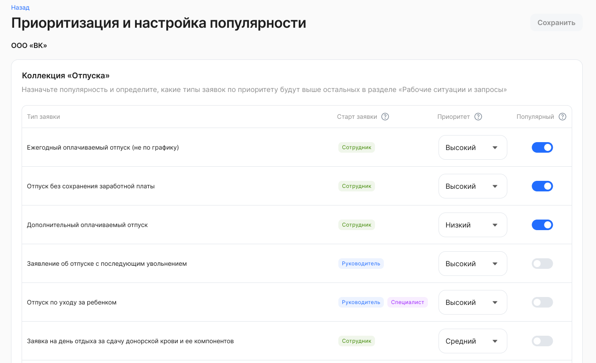 

Чтобы добавить тип заявки в коллекцию:
1. Перейдите в раздел **Настройки → Типы заявок**.

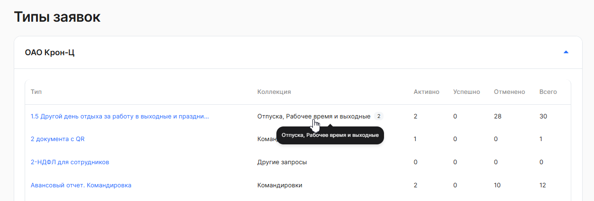

2. Откройте тип заявки, который хотите добавить в коллекцию, и нажмите кнопку **Редактировать**.
3. Выберите название коллекции, в которую будет добавлен тип заявки, и сохраните изменение.

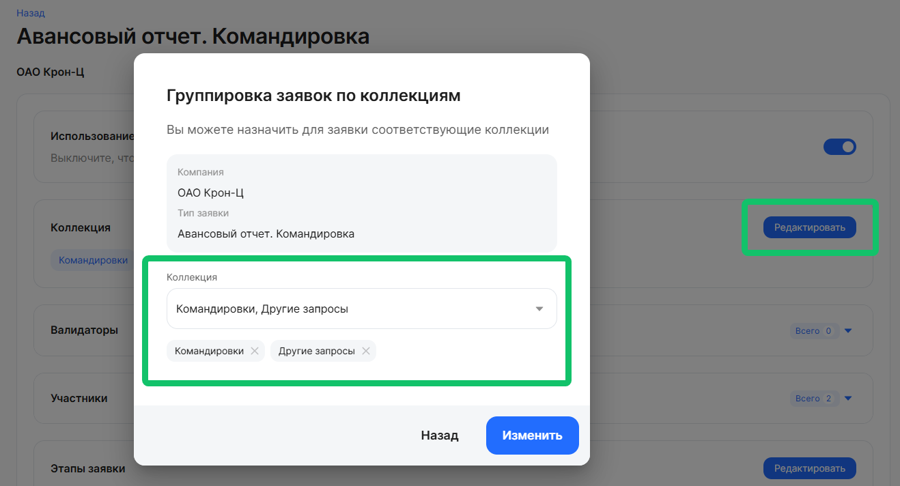

Инструкция для сотрудника и представителя компании

 
Для представителя компании доступны к созданию заявки, стартующие от него как от руководителя, от специалиста и от сотрудника. Для запросов, стартующих от сотрудника, пометка отсутствует.
 
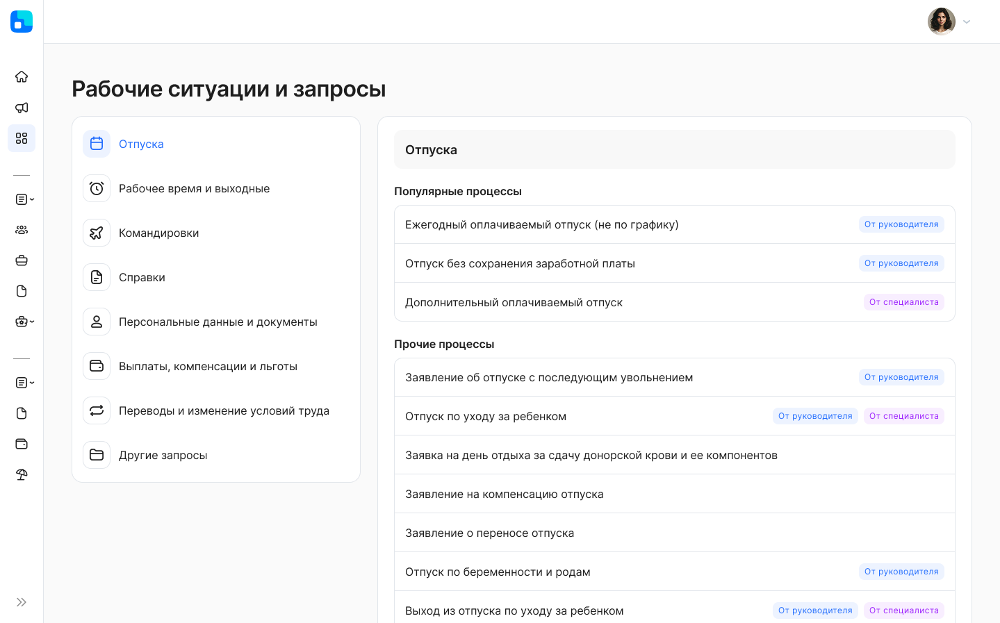

Для сотрудников без назначенных групп в компании (Отдел кадров, руководитель и т.д.) будут доступны запросы без пометок «От руководителя» и «От специалиста».  

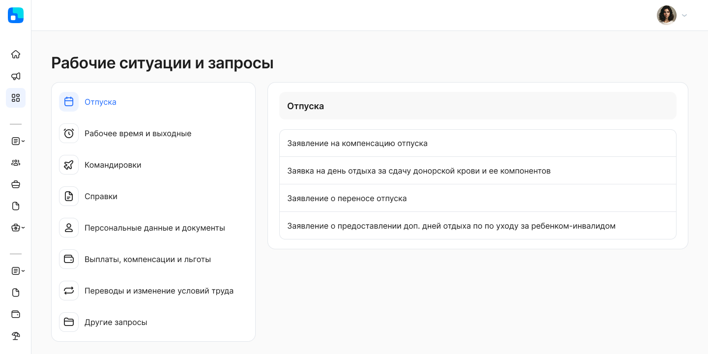

Запросы с одинаковыми названиями будут продублированы в списке для сотрудника и представителя компании (пометки «От руководителя», «От специалиста»).

1. Перейдите в раздел **Рабочие ситуации и запросы**.
2. Откройте запрос, например, тип заявки «Заявка на получение справки с места работы (182-Н)». 

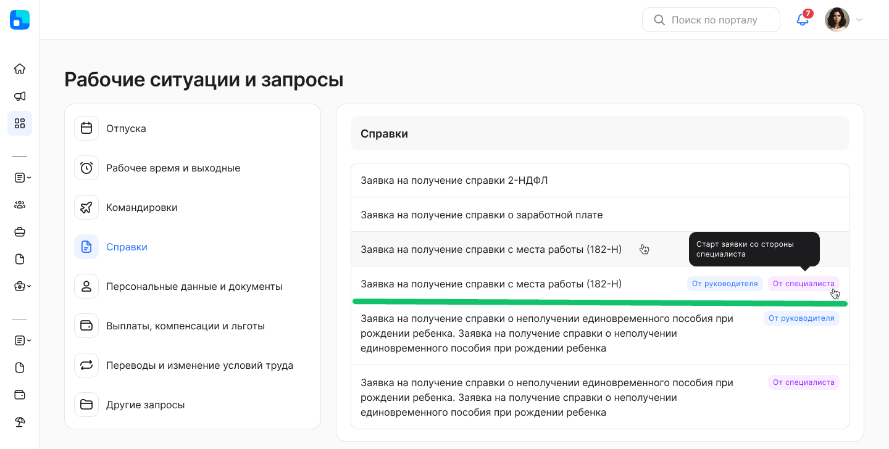

3\. Заполните форму создания заявки. В форме будет автоматически выбран тип заявки по запросу.  

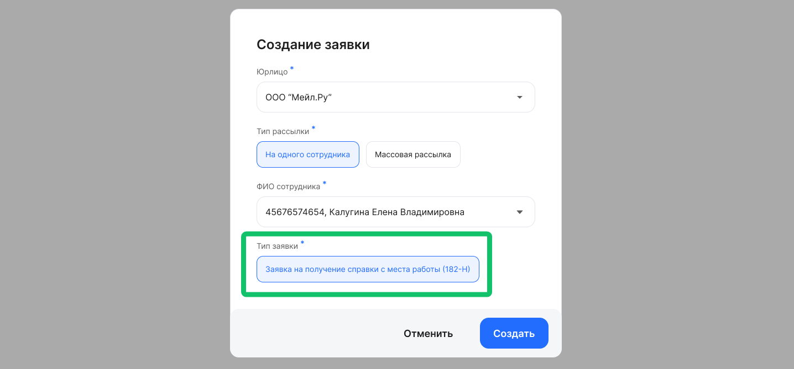

### **Новый виджет «Ближайшие отпуска»**

Виджет помогает заранее узнать, что коллега или руководитель скоро уходят в отпуск  (в ближайшие 10 рабочих дней). Эта информация позволяет вовремя решить вопросы, которые не могут ждать до их возвращения.  
Для виджета предусмотрено довольно много настроек — их можно гибко адаптировать под разные подходы к тому, кому, о ком и какую информацию показывать.

<info>

Чтобы подключить виджет к компании/аккаунту, обратитесь в [поддержку VK HR Tek](/ru/hr/support/contact_channels)

</info>

Как выглядит виджет
 

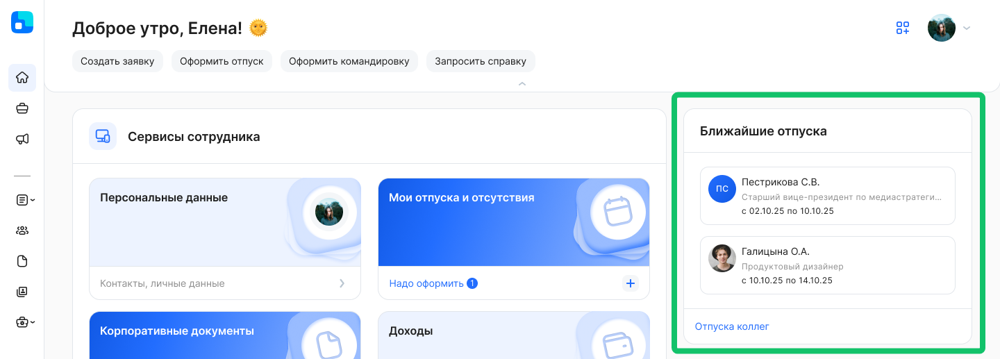

 

Инструкция администратора по настройкам виджета
 

1. Перейдите в раздел **Настройки компании (Настройки аккаунта) → Виджеты на главной странице** и нажмите кнопку **Настроить**.  
2. Перенесите виджет **Ближайшие отпуска** из блока **Виджеты** на основную область размещения виджетов.  
3. Нажмите на виджет **Ближайшие отпуска** и выберите значения для настроек:   
   - Размер виджета.  
   - Разрешить сотрудникам отключать виджет.  
4. Сохраните изменения.

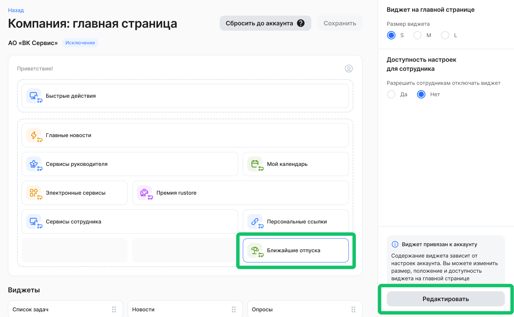

5\. Нажмите кнопку **Редактировать**, чтобы выбрать, чьи отпуска будут появляться в виджете линейного сотрудника/руководителя.   
6\. Напротив каждой строки установите вариант видимости отсутствий.   
7\. Сохраните изменения.  

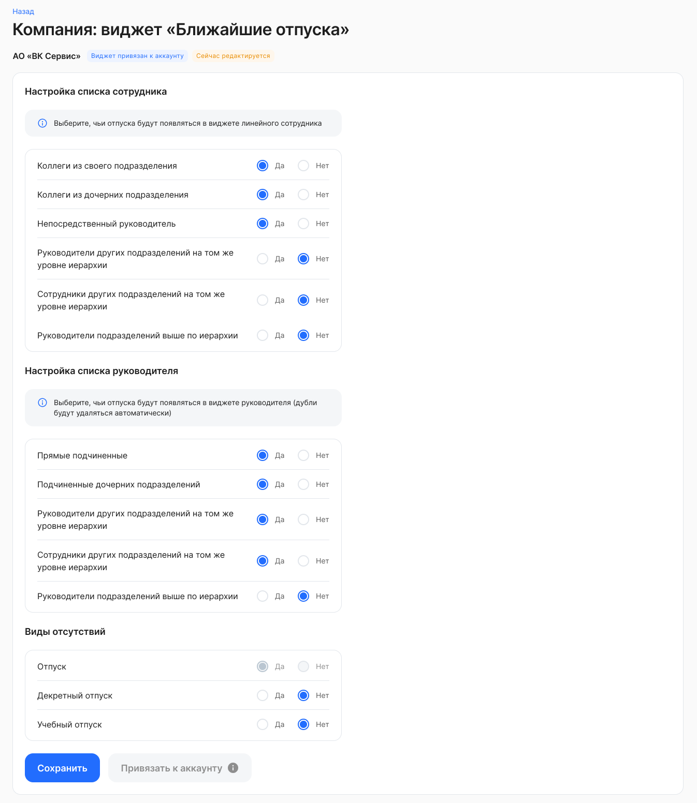

### **Новый виджет «Дни рождения»**

Новый виджет на главной странице показывает, у кого из коллег день рождения сегодня и в ближайшие 7 дней. Помогает не пропустить момент и поздравить вовремя.  
Администратор настраивает доступность: коллеги из подразделения, прямые руководители, подчинённые, руководители подразделений по горизонтали и вверх по иерархии. Можно разрешить сотрудникам скрывать виджет самостоятельно.  

<info>

Чтобы подключить виджет к компании/аккаунту, обратитесь в [поддержку VK HR Tek](/ru/hr/support/contact_channels)  

</info>

Как выглядит виджет
 
 
Переход в профиль сотрудника из виджета возможен, если в компании/аккаунте включена ролевая модель. Если ролевая модель выключена, то доступ к профилю сотрудника закрыт.  

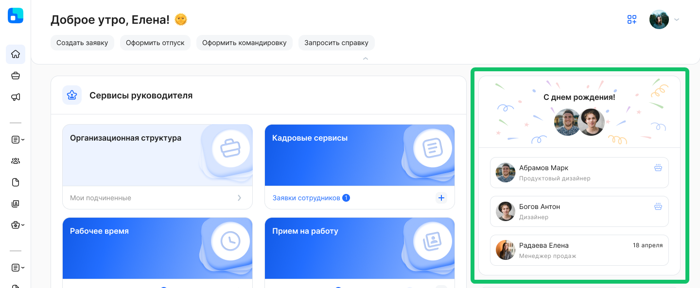

Инструкция администратора по настройкам виджета
 

1. Перейдите в раздел **Настройки компании (Настройки аккаунта) → Виджеты на главной странице** и нажмите кнопку **Настроить**.  
2. Перенесите виджет **Дни рождения** из блока **Виджеты** на основную область размещения виджетов.  
3. Нажмите на виджет **Дни рождения** и выберите значения для настроек:   
   - Размер виджета.  
   - Разрешить сотрудникам отключать виджет.  
4. Сохраните изменения.

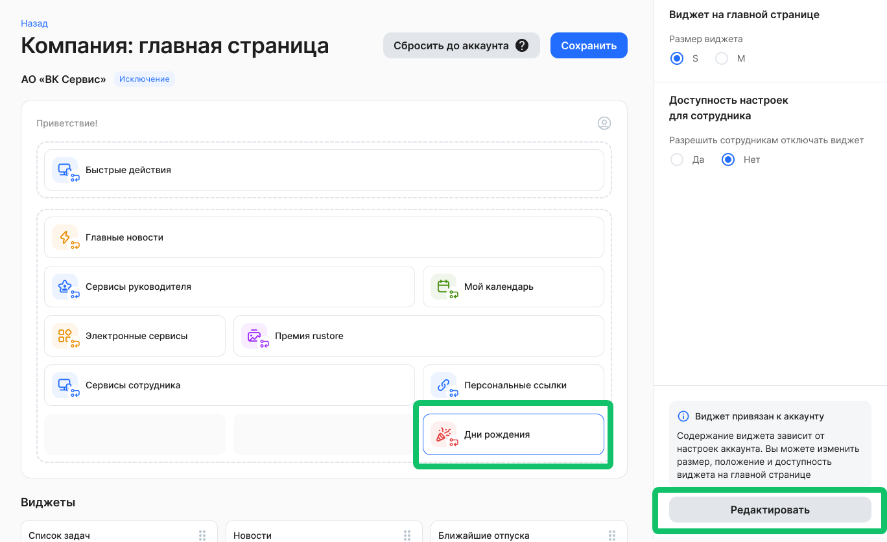

5\. Нажмите кнопку **Редактировать**, чтобы выбрать, чьи дни рождения будут появляться в виджете линейного сотрудника/руководителя.   
6\. Напротив каждой строки установите вариант видимости дат. Для корректной работы виджета выберите в разделе для сотрудника хотя бы для одной строки значение «Да».  
7\. Сохраните изменения.  

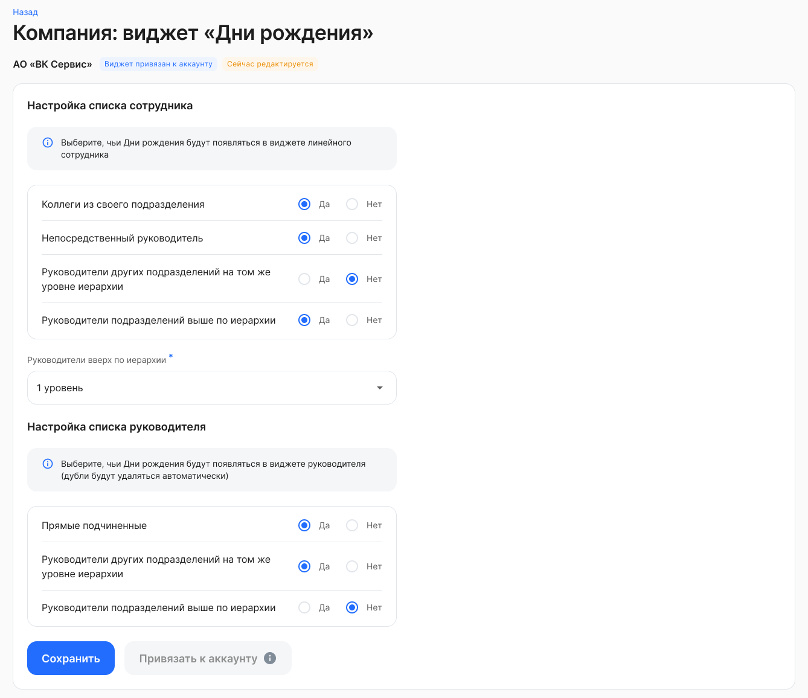

### **Главная страница для аккаунта**

Добавили все виджеты в аккаунты. Это дает всем клиентам с несколькими юрлицами возможность настроить единую главную страницу для всех сотрудников одновременно.

Доступные виджеты:

* **Быстрые действия** — создание популярных заявок в один клик.  
* **Активные запросы** — все текущие заявки собраны в одном месте.  
* **Сервисы руководителя** — быстрый доступ к разделам для работы с командой.  
* **Сервисы сотрудника** — ссылки на личный кабинет, справки, отпуска и другие разделы для личных задач.  
* **Календарь** — ближайшие события и даты прямо на главной.  
* **Электронные сервисы** — переходы во внешние сервисы, которые используются в работе.  
* **Мои ссылки** — каждый сотрудник настраивает под себя: добавляет нужные ссылки вручную.  
* **Ближайшие отпуска** *(новый)* — видно, кто из коллег и руководителей уходит в отпуск в ближайшее время.  
* **Дни рождения коллег** *(новый)* — чтобы не пропустить поздравление.

По умолчанию сейчас сотрудники по-прежнему видят главную страницу своей компании. Чтобы переключить их на главную аккаунта, перейдите в **Настройки виджетов компании** → кнопка **Сбросить до аккаунта**.  
После добавления виджеты расставлены в произвольном порядке — администратору надо проверить расположение и настройки.

<warn>

Для управления настройками главной страницы аккаунта нужна роль **Администратор главной страницы** (роль должна быть создана в аккаунте и назначена пользователю, даже если у него есть аналогичная роль в рамках компаний)

</warn>

<warn>

Автоматически виджеты добавлены только в аккаунты, где их раньше не было. Если хотя бы один виджет уже существовал — добавьте новые через обращение в [поддержку VK HR Tek](/ru/hr/support/contact_channels)

</warn>

<info>

Для получения доступа к настройкам аккаунта надо создать обращение через [портал самообслуживания](/ru/hr/support/contact_channels/portal_instructions) с типом **«Назначить роль "Администратор" (для аккаунта)»** (ссылка на [портал](https://support.mcs.mail.ru/login?redirectFrom=/tickets/create)).  
В форме создания обращения выберите:

* Тип услуги: **VK HR Tek**,  
* Категория услуги: **VK HR Tek: Компания, сотрудники и интеграции**,  
* Группа услуги: **Управление ролями и профилями доступа**,  
* Услуга: **Назначить роль "Администратор" (для аккаунта)**.

И укажите, каким пользователям необходимо добавить права Администратора (для аккаунта).

</info>

### **Компактная версия логотипа для свёрнутого меню**

Теперь администратор может загрузить два варианта логотипа: полный — для развёрнутого меню, компактный — для свёрнутого. Логотип переключается автоматически при изменении состояния панели навигации.  
Текущий логотип автоматически назначается основным — для развёрнутого меню. Компактный нужно загрузить отдельно в настройках управления логотипом.  

Инструкция администратора по настройке
 

1. Перейдите в **Настройки компании**. В случае если администратор имеет доступ к нескольким компаниям, раскройте блок с настройками той компании, в которой хотите настроить логотип.  
2. Нажмите кнопку **Настроить логотип**.

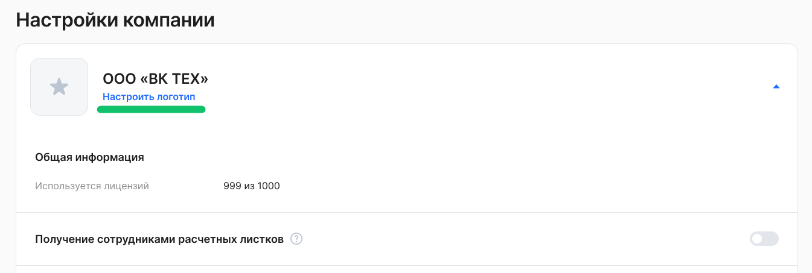

3\. Если ранее логотип не был настроен, обязательно загрузите логотип для развёрнутой панели меню.  
4\. При необходимости загрузите логотип для свёрнутой панели меню. 

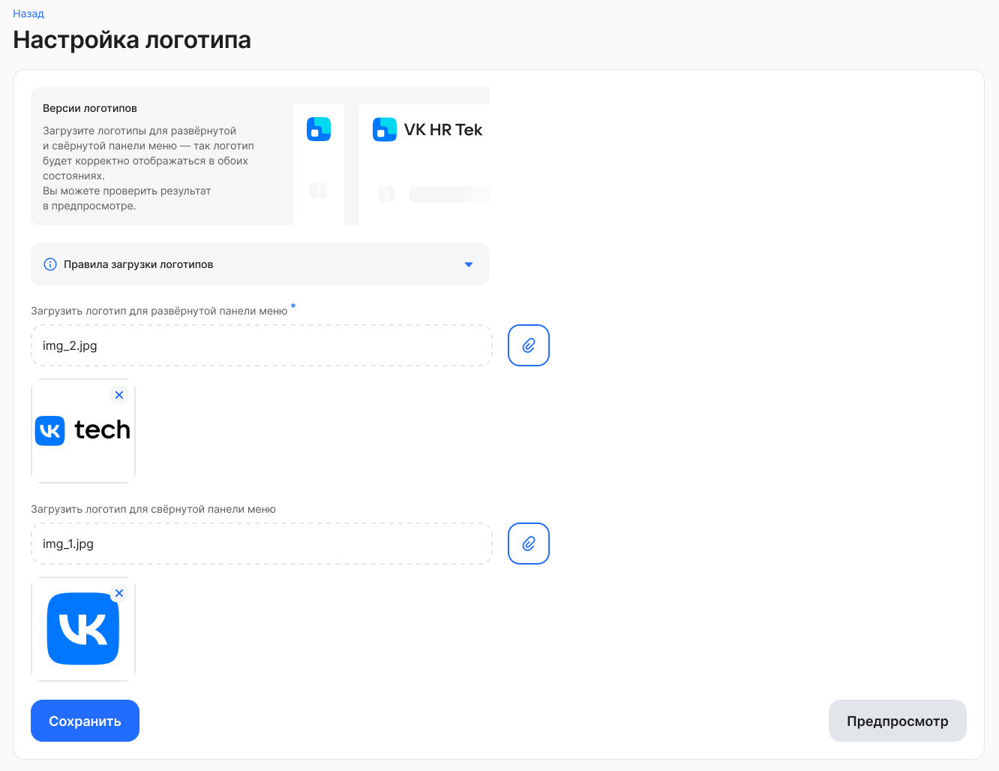 

5\. Нажмите кнопку **Предпросмотр**, чтобы проверить как логотипы будут выглядеть на панели меню.
   
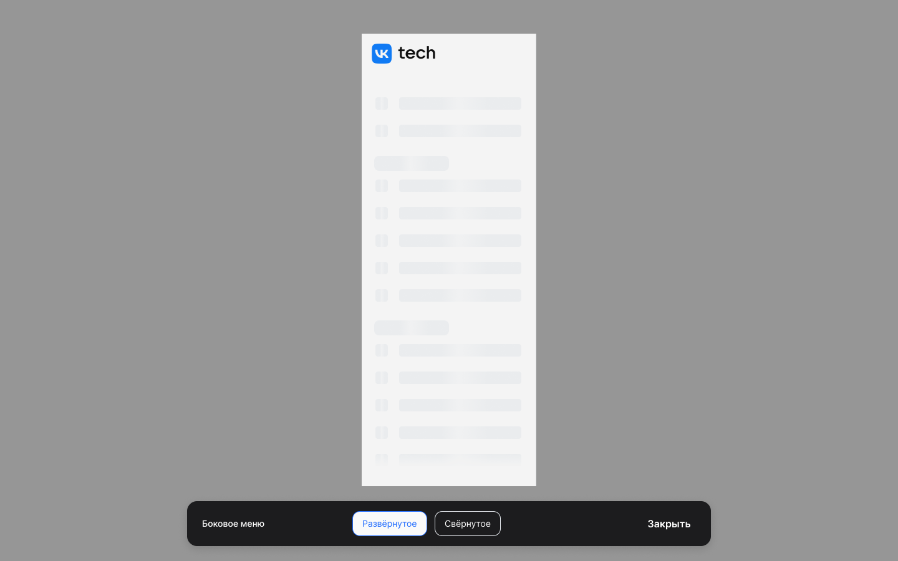

6\. Чтобы проверить, как будет выглядеть логотип на боковой панели в свёрнутом виде, переключитесь на кнопку **Свёрнутое**.    

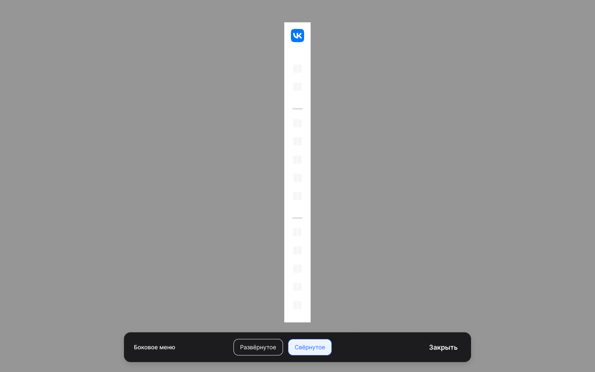

7\. После предпросмотра, при успешном отображении логотипов сохраните настройку или при необходимости измените файлы логотипов.

### **Фильтры в листингах**

В блок быстрых фильтров добавлен **новый фильтр «От меня»** — пользователь увидит все заявки, которые создал сам. Актуально при массовых рассылках и для ролей, которые создают много заявок: теперь не нужно разбирать общий список, где перемешаны свои и чужие.  

В списках заявок, сотрудников и корпоративных документов **в фильтре «По подразделению» появилась опция «включая дочерние»**. При её включении в выборку включается не только выбранное подразделение, но и все вложенные в него отделы. Удобно для компаний с многоуровневой структурой: не нужно выбирать каждый отдел вручную, чтобы увидеть полный список по подразделению. Поведение фильтров по умолчанию в разделах не изменилось.  

Посмотреть, как выглядят фильтры
 

Раздел **Сервисы компании → Заявки**  

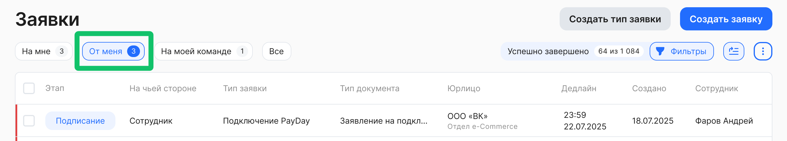

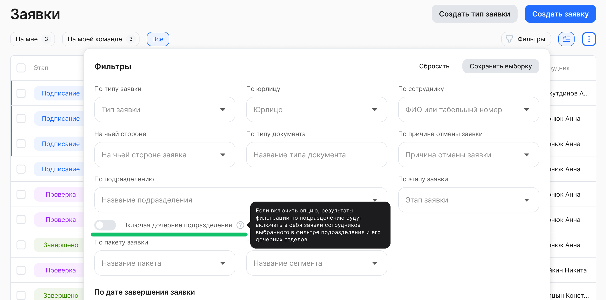

## **Бизнес-процессы**

<info>

Настройка бизнес-процессов является платной. Для подключения обратитесь в [поддержку VK HR Tek](/ru/hr/support/contact_channels)  

</info>

### **Автоматизация рассылки табелей руководителям**

Для всех компаний, где руководители должны согласовать табель учета рабочего времени своих подчиненных, — теперь можно настроить рассылку заявок из 1С документа. По кнопке «Отправить в КЭДО» для каждого подразделения будет создана заявка с табелями сотрудников этого подразделения. В заявке можно настроить цепочку согласований руководителей аналогично тому, как работает расчет в заявках сотрудников.

При старте из 1С-документа «Табель» система автоматически разбивает его по подразделениям и создаёт отдельную заявку на каждое. Распил можно делать по юридической или управленческой структуре — зависит от настройки на уровне 1С-модуля.

Если руководитель отвечает за несколько подразделений, он получает несколько заявок. Назначенные для этого бизнес-процесса заместители также имеют доступ к действиям в заявках.

Настройка автоматизации рассылки табелей будет доступна после выпуска новой версии расширения 1С 2026.03.00.

Ограничения первого релиза — обратите внимание
 

В текущем релизе еще не реализованы инструменты для удобной работы с такими типами заявок в листингах. Мы планируем доработать: 

- индикацию подразделения, по которому создана заявка, в листинге;
- возможность фильтровать по подразделению.

Список заявок табелей, после применения фильтра по пакету:

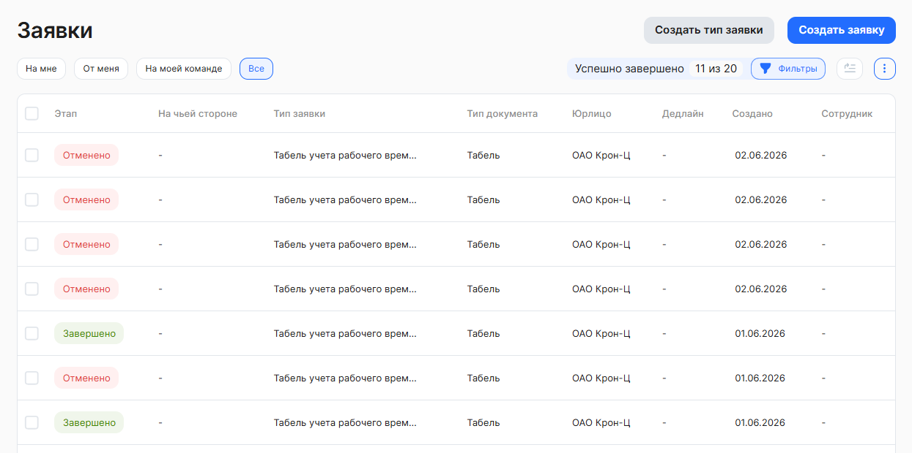

Заявка на этапе согласования, в атрибуте — Структурное подразделение в табеле:

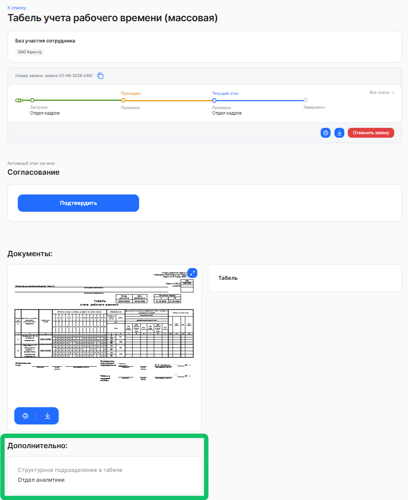

### **Произвольное значение в атрибуте-справочнике**

В атрибутах типа «справочник» теперь можно ввести значение вручную, но не сохранять его — оно не добавляется в справочник и не перегружает его лишними данными. Раньше, если был доступен ввод своего значения, оно автоматически сохранялось в справочник и становилось доступно для выбора будущим пользователям.  

### **Новая опция валидации**

При выборе дат периода в заявке система умеет проверить, что выбранный пользователем период — не больше или не меньше определенного количества дней. Новая опция позволяет явно указать, надо считать праздничные дни в периоде или нет.

Посмотреть интерфейс заявки
 

Выбранная дата начала отпуска — 08.06.2026.  
Опция игнорирует праздничный день (12.06.2026) и не считает этот день в расчете периода.  
Так как по условию максимальное количество дней в периоде — 7 дней, то возможная дата для выбора — 15.06.2026.  

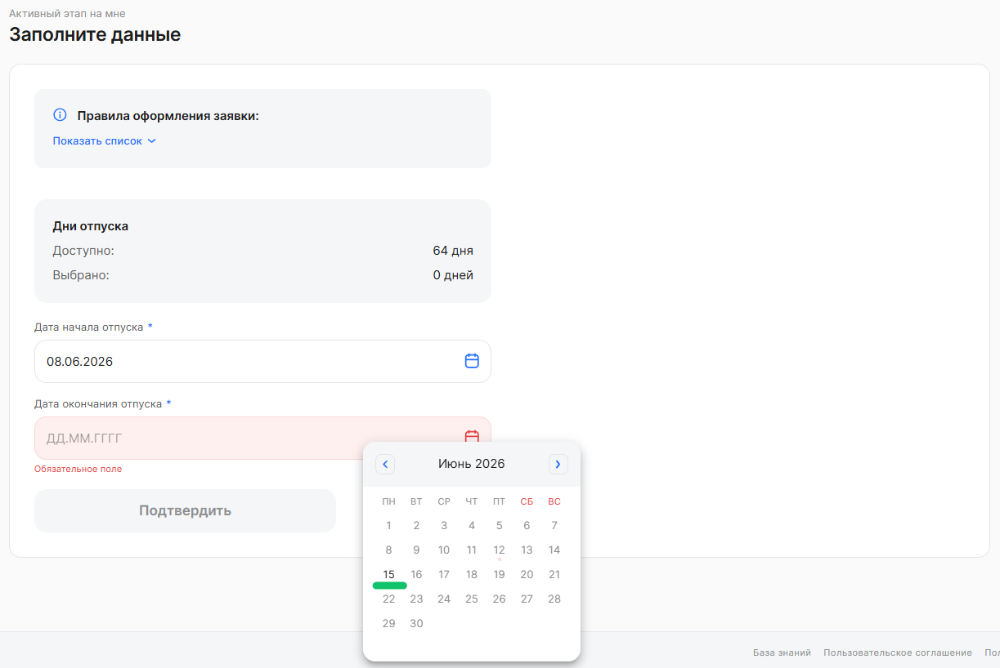

 

## **Организационная структура**

### **Автоматическое назначение заместителей на время отсутствия руководителя**

Для временных заместителей на отсутствия руководителя — система будет автоматически подключать их к заявкам в течение периода отсутствия. Раньше заместителя нужно было вручную привязывать к каждому отсутствию.

Доступ заместителя определяется по календарю руководителя: в течение периода отсутствия руководителя заместитель будет добавляться во все новые заявки, где участвует его руководитель. После окончания периода замещения у заместителя остается доступ только к заявкам, в которых он выполнил действие за руководителя. К остальным заявкам доступ закрывается.

Для компаний без обмена отсутствиями с 1С остаётся возможность указать период вручную.

В ближайших релизах планируем доработать функционал так, чтобы заместитель автоматически добавлялся во все активные заявки, где ожидается участие его руководителя. Ждем! 

Посмотреть интерфейс настройки заместителей
 

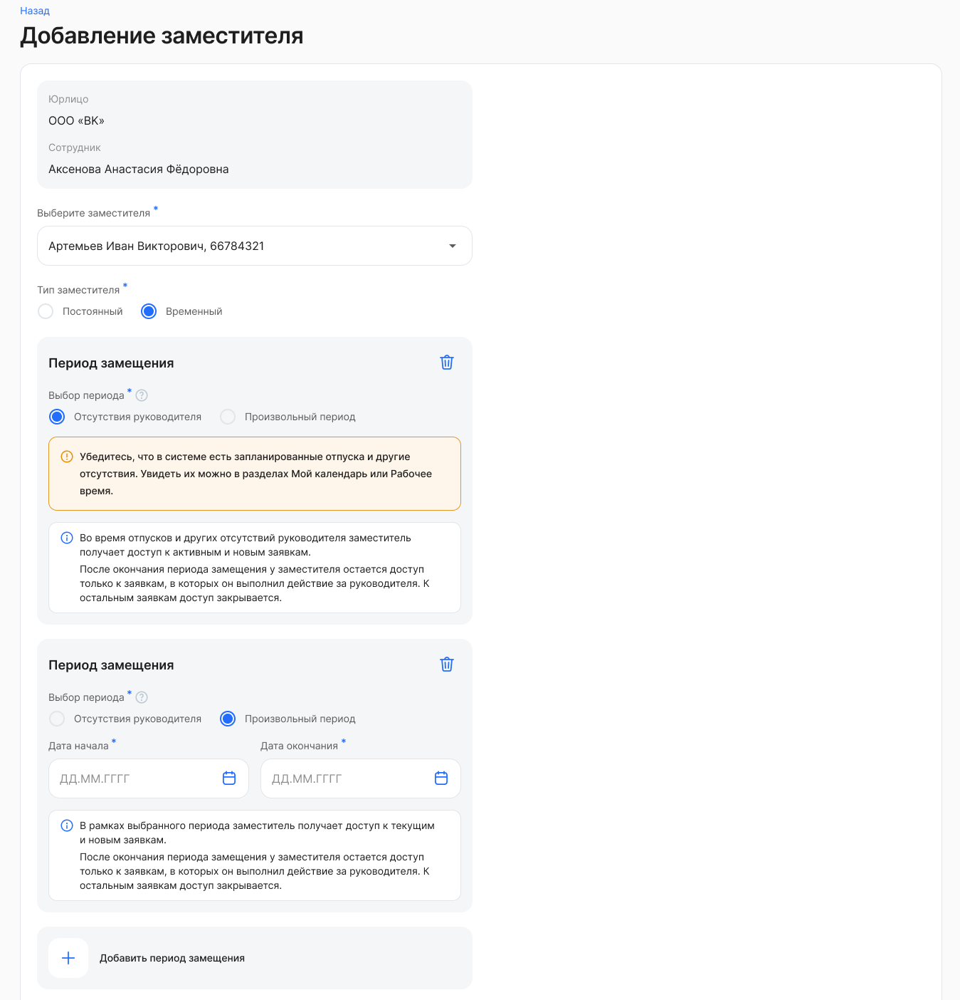

 

### **Данные штатного расписания в оргструктуре**

Теперь руководители могут видеть в оргструктуре, сколько ставок в штате занято и свободно — без ручных выгрузок из 1С.

Данные по штатному расписанию добавлены в карточку подразделения — штат, замещённые и вакантные ставки с учётом дочерних и отдельно по подразделению. Удобно для планирования найма и контроля укомплектованности.

В списке сотрудников незакрытые вакансии будут отображаться отдельными карточками — с должностью и количеством свободных ставок. У каждого сотрудника появится бейдж — процент ставки, который он занимает.

Функционал будет доступен полностью после выпуска новой версии расширения 1С 2026.03.00.

Посмотреть интерфейс
 

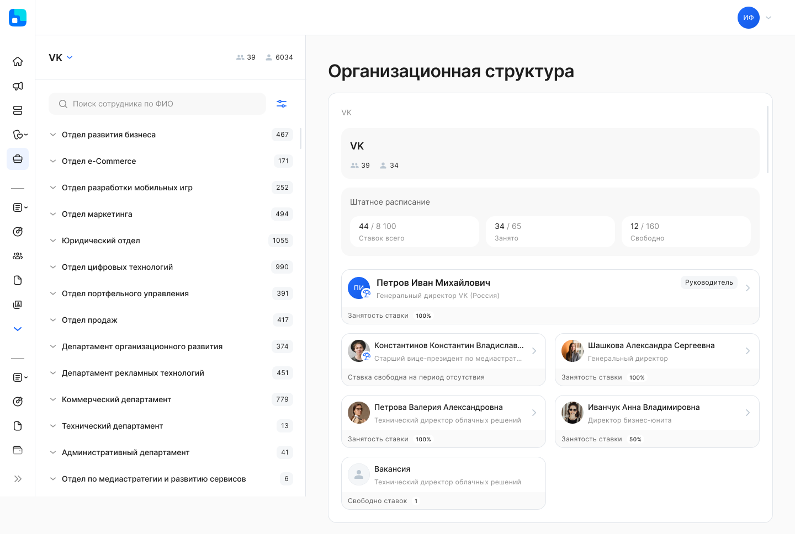

В блоке **Штатное расписание** отображаются данные о ставках по всем сотрудникам компании, включая неподключенных к КЭДО сотрудников. Например, в отображении штатного расписания может быть 10 занятых ставок, а в перечне сотрудников подразделения — только 8 подключенных к КЭДО.

<info>

Для подключения настройки доступности данных штатного расписания обратитесь в [поддержку VK HR Tek](/ru/hr/support/contact_channels).Функционал доступен только при условии импорта управленческой структуры из 1С

</info>

Подробнее о работе с данными штатного расписания
 

Для отображения данных штатного расписания в оргструктуре:
1. В рамках настроек компании (аккаунта) включите импорт управленческой структуры из 1С или проверьте, что импорт включён.

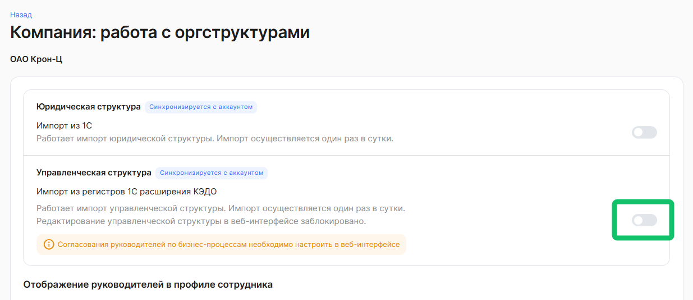

2. Обратитесь в поддержку VK HR Tek для подключения настройки доступности данных штатного расписания. 
3. В расширении 1С, в регистре «Управленческая организационная структура (КЭДО)» должно быть выставлено соответствие между подразделениями и позициями штатного расписания. После того как управленческая структура синхронизируется, будет произведена выгрузка данных.
4. Администратор в компании (в аккаунте) должен перейти в **Настройки компании (Настройки** **аккаунта)**, к настройке **Использование ролевой модели**. 
В блоке **Персональные данные сотрудников: просмотр в списках — Штатная позиция сотрудника** выберите варианты для типов пользователей:

* Руководители:    
  * Все руководители. При выборе этого значения руководителям всех подразделений будут доступны сведения по штатным позициям сотрудников всех подразделений.    
  * Нет доступа.  
* Специалисты:   
  * Все специалисты.  
  * Роли из раздела **Роли сотрудников**.  

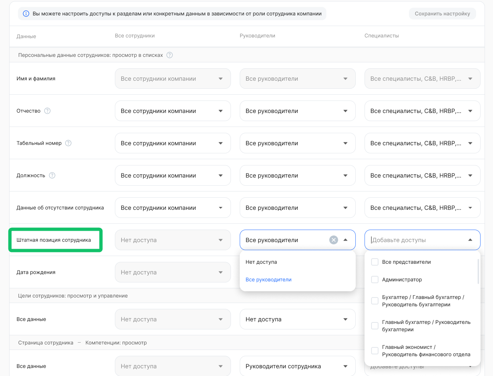

Расчёт показателей для подразделения
 

**Показатели подразделения**

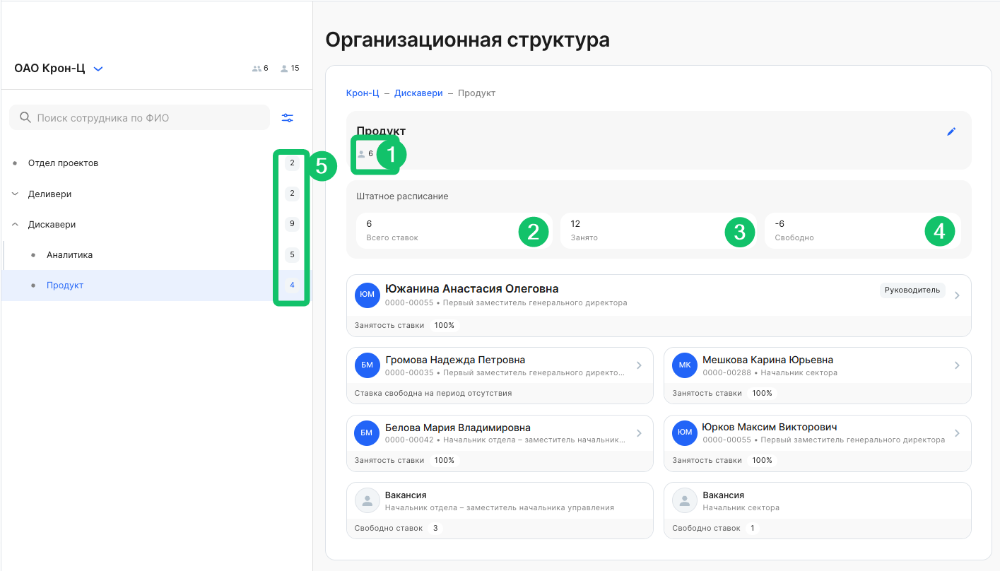

* Для подразделения выводятся показатели: 

| Номер показателя | Показатель | Определение | Как считается |
| ----- | ----- | ----- | ----- |
| 1 | Общее количество сотрудников | Общее количество сотрудников  в подразделении | Рассчитывается как сумма всех нанятых в подразделение сотрудников, без учёта руководителя подразделения. К полученной сумме прибавляются блоки вакансий (именно блоки, а не количество ставок по каждой вакантной позиции)  |
| 2 | Всего ставок | Общее количество ставок позиций  штатного расписания подразделения | Сумма атрибута "КоличествоСтавок" справочника "Штатные позиции" в 1С каждой связанной с подразделением штатной позиции.  При расчёте учитываются позиции без признака "Исключена из ШР" |
| 3 | Занято | Общее количество занятых ставок позиций  штатного расписания подразделения | Сумма атрибута "СтавокЗанято" справочника "Штатные позиции" в 1С каждой связанной с подразделением штатной позиции.  При расчёте учитываются позиции без признака "Исключена из ШР" |
| 4 | Свободно | Общее количество вакантных ставок позиций  штатного расписания подразделения | Сумма атрибута "СтавокСвободно" справочника "Штатные позиции" в 1С каждой связанной с подразделением штатной позиции.  При расчёте учитываются позиции без признака "Исключена из ШР" |
| 5 | Общее количество сотрудников | Общее количество сотрудников  в подразделении | Рассчитывается как сумма всех нанятых в подразделение сотрудников, без учёта руководителя подразделения и без учёта блока вакансий |

* Показатели для каждого подразделения передаются из 1С.  
* Показатели обновляются в соответствии с обновлением данных в 1С. Передача данных по штатным позициям происходит после обновления управленческой оргструктуры.   
* Если данные для показателя не переданы, то они не отображаются в веб-сервисе. В том числе, может быть ситуация, что если не для всех подразделений указана связь со штатной позицией, то данные отображаются как раньше.  
* Для подразделений, у которых есть дочерние подразделения, отображается информация по текущему подразделению (первая цифра)/ сумма с учётом всех дочерних подразделений (вторая цифра) + есть расшифровка в тултипе.  
* Если у подразделения нет руководителя, то логика построения оргструктуры не меняется, т.е. в подразделении не отображается информация о руководителе, его штатная позиция отображается как вакансия (если она заведена в штатном расписании, в ином случае просто не отображается руководитель).    

**Сотрудники:**

* Несколько сотрудников могут быть приняты на одну штатную позицию. В этом случае информацию отображается по каждому сотруднику в отдельности.  
* Может быть ситуация, когда не все ставки штатной позиции закрыты, тогда будут отображены данные по сотрудникам и блок вакансии.  
* Для каждого сотрудника в оргструктуре отображается бейдж с информацией о замещении штатной позиции (расчёт происходит на стороне 1С): 

| Бейдж | Как определятся процент занятости |
| ----- | ----- |
| Занятость ставки | Условия назначения бейджа:  1. Сотрудник занимает полную ставку штатной позиции (у штатной позиции в 1С заполнены атрибуты: Вид занятости позиции = Занята, Количество ставок = 1).  2. Процент занятости при этом рассчитывается в соответствии с графиком работы сотрудника:  Проверяется значение "График работы" в карточке сотрудника (справочник "Сотрудники" в 1С):  а. Если оно не заполнено, то указывается — 100%,  б. Если оно заполнено, то проверяется значение атрибута "Длительность рабочей недели" карточки графика работы сотрудников (Справочник "Графики работы сотрудников" в 1С):  &bull;  Если длительность недели = 40 часам, то указывается — 100%,  &bull; Если указано иное значение, то высчитывается процент с учётом, что 40 часов = 100%. Например, если длительность рабочей недели равна 20 часам, то передается 50%, если длительность недели равна 32, то 80% и т.д.  3. Даже если, исходя из графика работы, занятость ставки не равна 100%, то блок вакансии в этом случае не доступен, т.к. по факту сотрудник нанят на полную ставку штатной позиции. |
| Замещена частично  |1. Условия назначения бейджа: сотрудник нанят на неполную ставку штатной позиции (по сотруднику по этой штатной позиции в 1С заполнены атрибуты: Вид занятости позиции = Занята, Количество ставок < 1).  2. Процент занятости ставки высчитывается в соответствии с количеством ставок, которые занимает пользователь (несколько полных или часть от одной).   Например:  &bull; если сотрудник нанят на полставки, то указывается 50%,  &bull; если сотрудник нанят на 1/4 ставки, то указывается 25%.  При этом на эту штатную позицию на оставшуюся часть ставки можно нанять ещё сотрудника. Если сотрудник не нанят, то отображается вакансия. |
| Освобождена на период отсутствия | 1. Указывается 0%.  2. Сотрудник занимает ставку, но для него проведено отсутствие (отпуск, командировка) с освобождением штатной позиции, а у штатной позиции заполнены атрибуты: Вид занятости позиции = Свободна, Количество ставок может быть любым от 0 до 1, Действует до — заполнено.  3.  На эту штатную позицию могли назначить нового сотрудника или ставка могла остаться вакантной.  |

  
- В оргструктуре не выводится информация по сотрудникам, которые совмещают несколько штатных позиций (т.е. у штатной позиции атрибут "Вид занятости" = "Совмещена").   
- Если в документе 1С "Совмещение" указан "Вид совмещения" = "Исполнение обязанностей сотрудника", то:   
    - В веб-сервисе будет выведена штатная позиция и в ней указан сотрудник, который занял её первично.  
    - Информации о совмещении не будет, в том числе не будет добавлено, кто на эту позицию назначен совместителем.  
    - При расчёте показателей подразделения: общее количество позиций штатного расписания и количество вакансий не изменится, количество занятых будет увеличено согласно количеству занимаемых ставок, с учётом совмещения.  
- Если в документе 1С "Совмещение" указан "Вид совмещения" = "Совмещение должностей (профессий)", то:   
    - Вакантная позиция не выводится в веб-сервисе, если на позицию нанят сотрудник, то отображается информация о нём.   
    - При расчёте показателей подразделения: общее количество позиций штатного расписания не изменится, количество занятых будет увеличено согласно количеству занимаемых ставок, а количество вакансий уменьшено соотвественно.   
- При этом для этих штатных позиции не будет указано, что они совмещены и кто на них назначен.

**Вакантные позиции**: 

* Если атрибут 1С штатной позиции "СтавокСвободно" больше 0, то в этом случае отображается карточка "Вакансии".  
* Для каждой вакансии указывается: название должности и информация о количестве доступных вакансий.  
* Количество доступных вакансий может быть нецелым числом.   
* Информация о количестве доступных вакансий система получает из 1С. 

## **Профиль сотрудника**

В профиле теперь можно увидеть не только, кто ваш руководитель, но и его контактный телефон — удобно в начале работы, особенно для тех сотрудников, которые работают не в офисе и нанимаются массово. Доступ к данным настраивается в ролевой модели.  

Подробнее о настройке
 

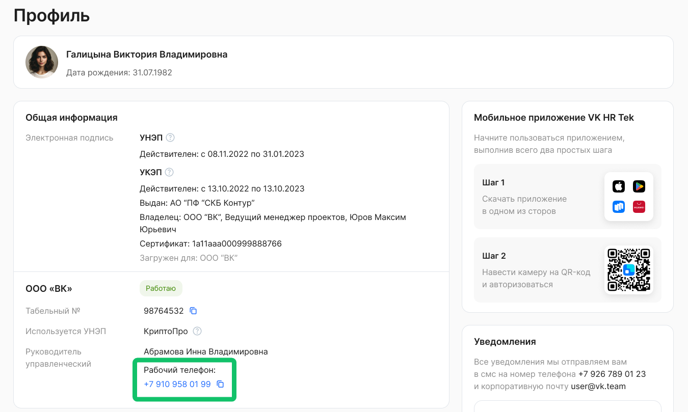
 
Чтобы настроить отображение номера телефона руководителя в Профиле сотрудника, администратор:  
1\. Переходит в **Настройки** **компании**, к настройке **Использование ролевой модели**, к блоку **Страница сотрудника - Контакты: просмотр**.  
2\. К примеру, если у руководителя заполнен **Рабочий** **телефон** и для роли **Все сотрудники** выбран доступ **Все сотрудники компании** или **Все сотрудники группы компаний**, то сотрудник сможет просмотреть номер телефона руководителя в своем Профиле.

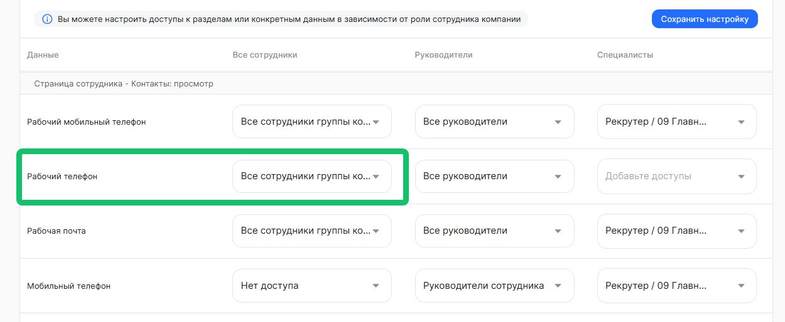   

**Матрица условий отображения телефонов руководителя**

Применяется к каждому руководителю отдельно и к каждому типу телефона отдельно.

| Ролевая модель  включена? | Право доступа роли «Все сотрудники»  к типу данных | Значение телефона в  карточке руководителя | Результат отображения  в Профиле |
| :---: | :---: | :---: | :---: | 
| Нет | Неприменимо | Любое | Не отображается |
| Да | Нет доступа | Заполнено | Не отображается |
| Да | Доступ \- «Все сотрудники компании» | Не заполнено | Не отображается |
| Да | Доступ \- «Все сотрудники группы компаний» | Не заполнено | Не отображается |
| Да | Доступ \- «Все сотрудники компании» | Заполнено | Отображается телефон |
| Да | Доступ \- «Все сотрудники группы компаний» | Заполнено | Отображается телефон |

 

## **Ролевая модель**

В ролевой модели теперь можно ограничить доступ к просмотру даты рождения сотрудника в заявках. По умолчанию дату рождения видят все руководители и специалисты, у которых есть доступ к заявке. 

Также немного обновили названия разделов ролевой модели. 

Подробнее о настройке
 

Чтобы настроить отображение даты рождения в заявках, администратор переходит в **Настройки** **компании**, к настройке **Использование ролевой модели**, к блоку **Персональные данные сотрудников: просмотр в списках**. 

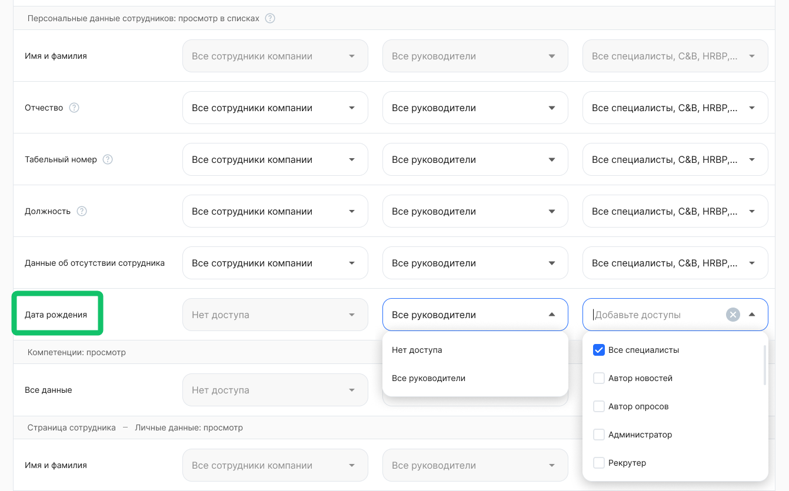

Новый порядок блоков данных на странице настройки доступов к данным, а также названия блоков:

| Старое название | Новое название |
| ----- | ----- |
| Компания - Сотрудники | Список сотрудников: просмотр , приглашения, выгрузки |
| Компания - Корпоративные документы | Корпоративные документы: просмотр, управление документами |
| Компания - Рабочее время | Раздел Рабочее время: просмотр |
| Общее - Оргструктура | Организационная структура: просмотр |
| Общее - Данные сотрудников в оргструктуре компании | Персональные данные сотрудников: просмотр в списках |
| Компания - Цели сотрудников | Цели сотрудников: просмотр и управление |
| Сотрудник - Компетенции | Компетенции: просмотр |
| Сотрудник - Персональные данные | Страница сотрудника - Личные данные: просмотр |
| Сотрудник - Персональные данные - Дата рождения | Страница сотрудника - Дата рождения: просмотр |
| Сотрудник - Персональные данные - Общая информация | Страница сотрудника - Общая информация: просмотр |
| Сотрудник - Персональные данные - Документы | Страница сотрудника - Документы: просмотр |
| Сотрудник - Персональные данные - Контакты | Страница сотрудника - Контакты: просмотр |
| Сотрудник - Персональные данные -  О семье | Страница сотрудника - О семье: просмотр |

 

## **Корпоративные документы / ЛНА**

### **Несколько файлов в одном документе ЛНА**

При публикации ЛНА добавили возможность загрузки нескольких pdf-файлов в поле **Версия документа** (например, файл с основным текстом ЛНА и приложения к нему).   

Максимальное количество загружаемых файлов — не более 10.  

При публикации новой версии ЛНА будет формироваться общий pdf-файл на основе загруженных. Порядок документов в файле соответствует порядку загрузки.  

Бизнес-ценность:

* не запускать согласование нескольких файлов, например, приложений к ЛНА, отдельными документами в системе — ознакомление с несколькими связанными документами в одной карточке ЛНА;  
* все версии документа будут подписаны сразу;  
* техническая поддержка объединения нескольких связанных ЛНА (например, основной текст и приложения к нему) на стороне КЭДО.

Страница создания корпоративного документа
    

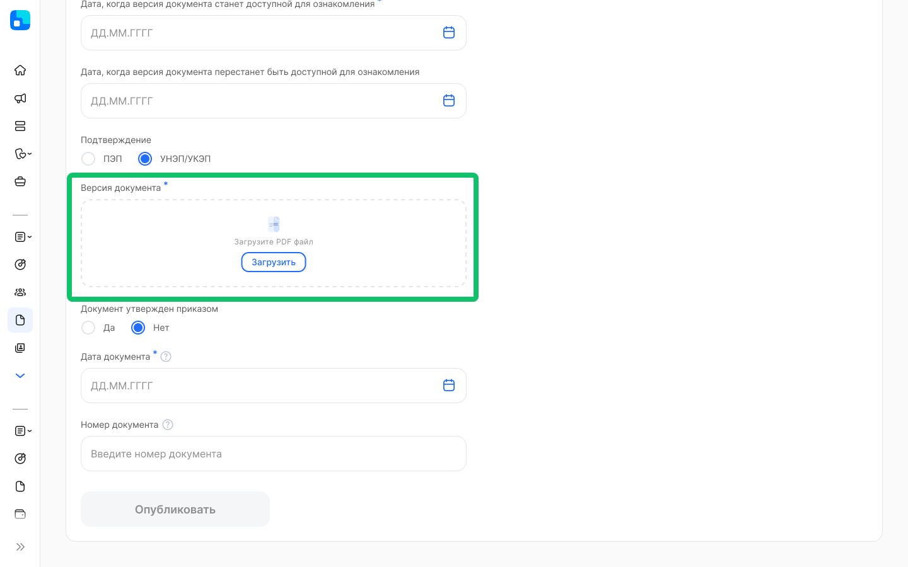

Форма создания версии документа
   

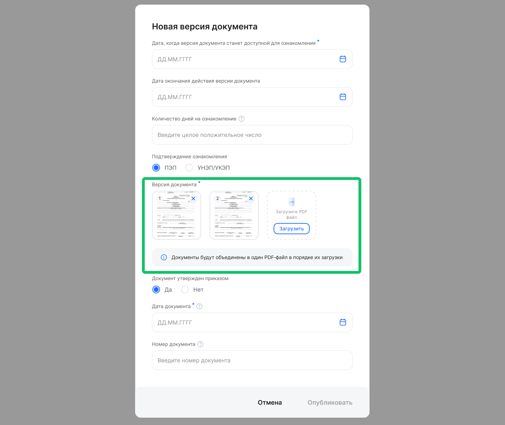

## **Отпуска и отсутствия**

### **Передача дней отгула за работу в выходные и праздничные дни из 1С в КЭДО**

Добавлена передача дней отгула за работу в выходные и праздничные дни из 1С в КЭДО. Возможности:

* информация по накопленным дням для отгулов будет импортироваться в КЭДО из 1С и храниться в системе как один из лимитов отпусков;  
* сотрудник сможет просмотреть данные по доступным дням в разделе **Мой календарь** → виджет **Дни отпуска** → кнопка **Просмотреть детализацию** → тип отпуска **Другой день отдыха за работу в выходные и праздничные дни**.  
* сотрудник сможет создать заявку с видом отпуска «Другой день отдыха за работу в выходные и праздничные дни».

Бизнес-ценность:

* поддержка бизнес-процесса по предоставлению дней отгула за работу в праздничные и выходные дни (заявка, валидация);  
* информирование сотрудника о доступных днях с помощью виджета.

Функциональность будет доступна после выпуска новой версии расширения 1С 2026.03.00.  

<info>

Для включения импорта дней отгулов обратитесь в [поддержку VK HR Tek](/ru/hr/support/contact_channels)  

</info>

### **График отсутствий коллег подразделения при создании заявки на отсутствие**

На странице заявки на отсутствия добавили раскрывающийся блок с календарем отсутствий коллег подразделения сотрудника. По умолчанию блок скрыт.   

Блок будет отображаться, если для компании/аккаунта включена настройка видимости отсутствий коллег в заявках. 

<info>

Настройка является платной. Для подключения обратитесь в [поддержку VK HR Tek](/ru/hr/support/contact_channels)

</info>

При раскрытии блока **Отсутствия коллег** загружаются данные из календаря отсутствия коллег. Данные календаря будут обновляться при изменении периода в заявке без необходимости перезагрузки страницы — при вводе/изменении периодов отсутствия календарь автоматически переключается на соответствующий период.  

Бизнес-ценность:

* удобный интерфейс для планирования отсутствия — в одном окне (не покидая текущий интерфейс и не переключаясь между разделами системы) сотрудник сможет увидеть загруженность команды и отсутствия, которые обновляются в момент выбора дат отсутствия.

Пример заявки на отсутствие

Блок **Отсутствие коллег** скрыт:  

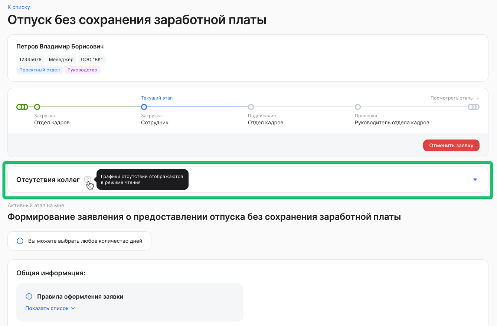

Динамическая загрузка данных из календаря отсутствия коллег при раскрытии блока:  

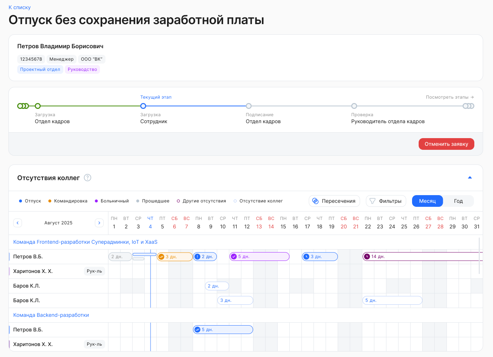

Мобильная версия

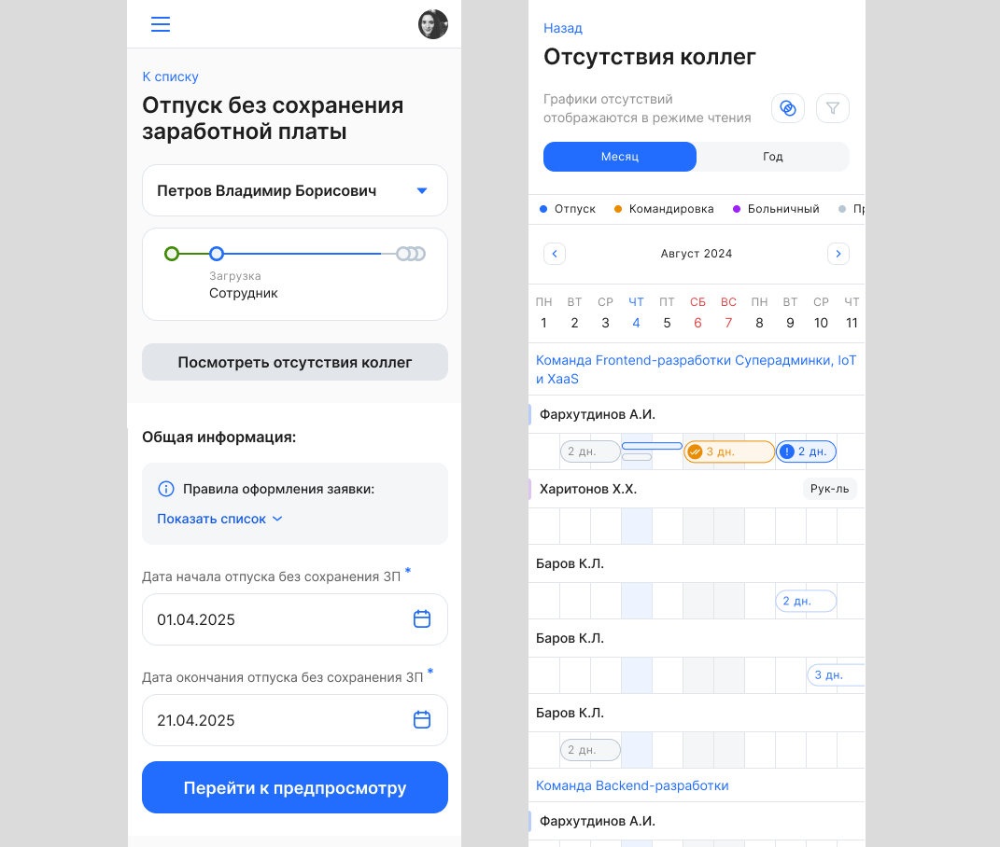

<info>

Настройка бизнес-процесса на отсутствие является платной. Для подключения обратитесь в [поддержку VK HR Tek](/ru/hr/support/contact_channels)  

</info>

### **Отображение пересечений отпусков в календаре**

В виджет с календарем добавлена визуализация пересечений отпусков сотрудников.

Чтобы просмотреть пересечения отпусков, нажмите кнопку **Пересечения**: 

* в планировании графика отпусков;  
* в Сервисах сотрудника, в разделе **Мой календарь**;  
* в Сервисах компании, в разделе **Рабочее время**.

Бизнес-ценность:

* Упрощение планирования и согласования отпуска за счет вызова автоматической визуализации пересечений отпусков в подразделении.

Посмотреть интерфейс

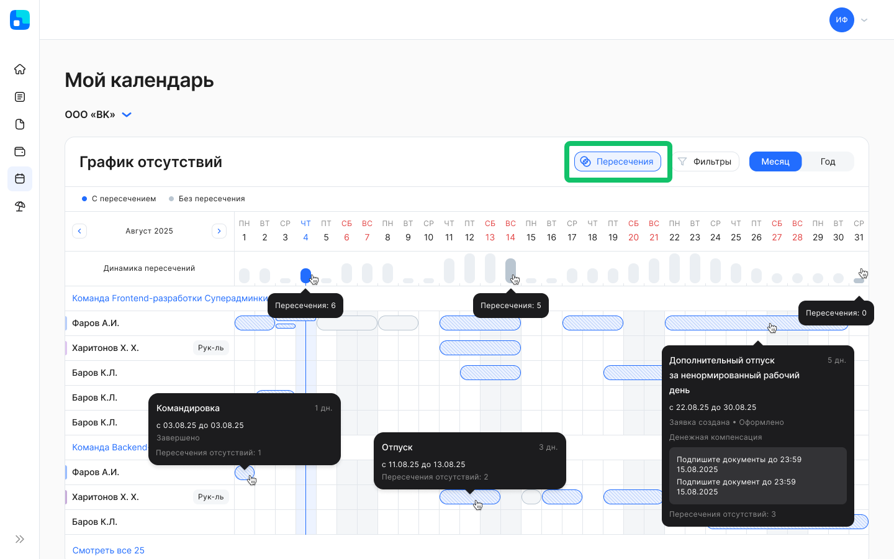

## **График отпусков**

### **Планирование графика отпусков по подразделениям**

Добавили возможность создавать планирование графика отпусков по подразделениям в рамках одного юридического лица. Ранее можно было создать только по всему юридическому лицу в целом. Возможность доступна для пользователей с ролью «Менеджер графика отпусков».

Новые планирования запускаются также через **Сервисы компании** → **Настройка → Графики отпусков**.

В каждом планировании можно настроить тип оргструктуры и выбрать подразделения, указать дату окончания планирования для сотрудников подразделения.

Далее сотрудники заполняют планирования, а руководители и кадровые специалиста их согласовывают — в рамках каждого созданного планирования отдельно.

Бизнес-ценность:

* поддержка в решении бизнес-процесса крупных компаний;  
* возможность настройки такого планирования для разных подразделений по разным сценариям.

Создание нового планирования Менеджером графика отпусков

1. Перейдите в раздел **Сервисы компании** → **Настройка → Графики отпусков** и нажмите кнопку **Создать новое планирование**.   
2. Выберите тип оргструктуры и добавьте подразделения из выпадающего списка в соответствии с оргструктурой компании. Запрещено добавлять подразделение, для которого уже было создано планирование. 

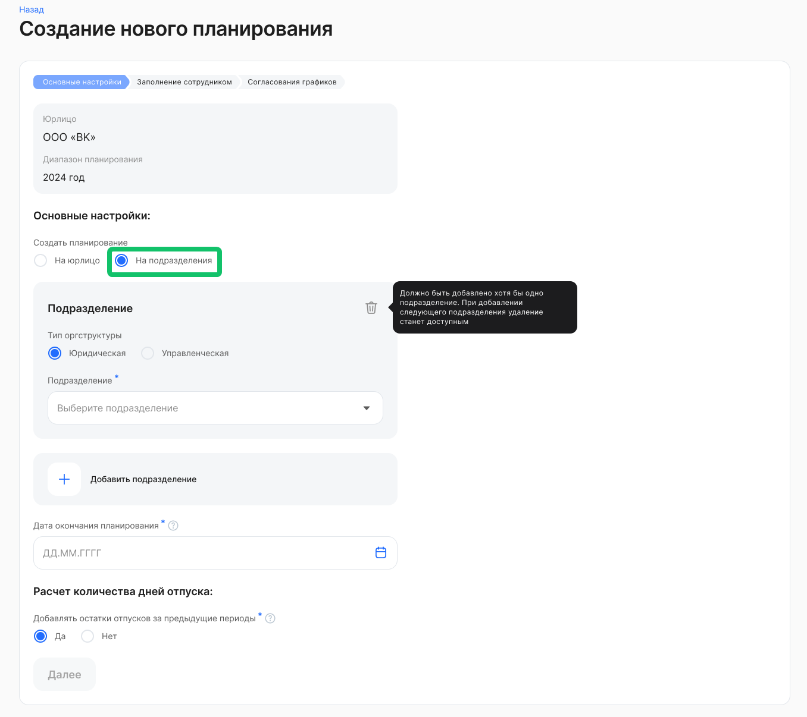

3\. Заполните все обязательные поля и перейдите к следующему шагу создания планирования.  
4\. После успешного создания график отпусков появится в общем списке планирований.
   
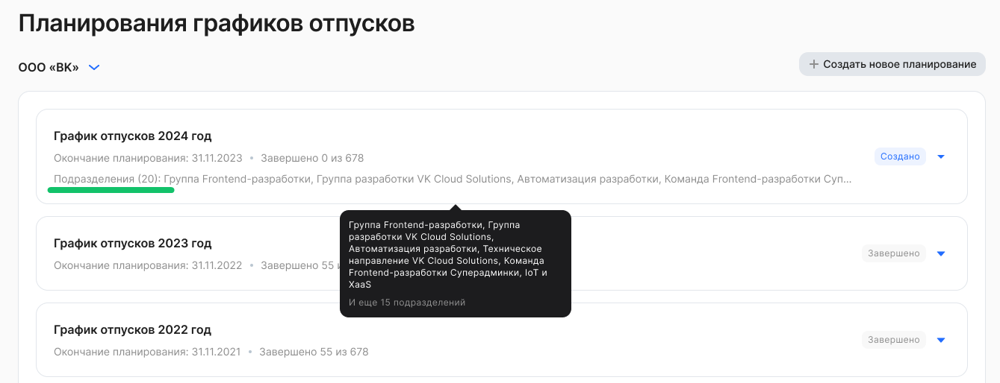

5\. Чтобы просмотреть детали планирования, нажмите на график отпусков с подразделениями.

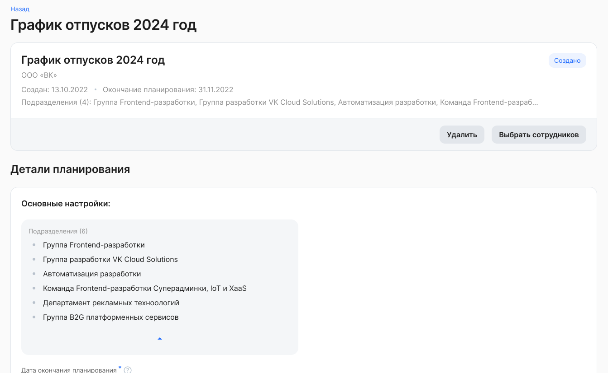

### **Согласование графика отпусков функциональными руководителями**

На текущий момент в КЭДО согласование осуществляется административными руководителями по оргструктуре. Новая настройка позволит направлять на согласование заявку как административному, так и функциональному руководителю.

При настройке маршрута согласования на этапе запуска планирования графика отпусков можно добавить дополнительно функционального руководителя в качестве согласующего. Возможности:

* будет добавлена новая роль функционального руководителя;  
* при настройке планирования будет добавлен выбор типа руководителя: при выборе функционального — согласование происходит функциональным руководителем и руководителем по юридической оргстурктре;  
* функциональному руководителю доступны такие функции при согласовании, как иным руководителям по оргструктуре.

Если функциональный руководитель не найден, то этот этап пропускается и осуществляется переход к следующему согласующему.

Если при назначении один сотрудник является руководителем по разным типам (например, и как юридический, и как функциональный) — на согласование назначается только одна задача.

Бизнес-ценность:

* Возможность согласования отпуска сотрудника всеми руководителями, в процессах которых сотрудник выполняет задачи.

Выбор типа согласующего руководителя добавлен в интерфейс настройки планирования графика отпусков.

Посмотреть интерфейс

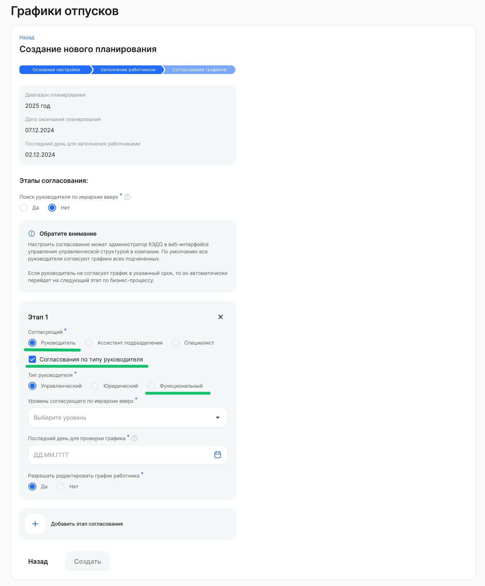

## **Командировки**

### **Создание командировки на группу сотрудников**

Доработана функциональность заявок для ведения процесса групповых командировок. Возможности:

* создание групповой заявки на командировку — родительская заявка;  
* после успешного завершения родительской заявки автоматически создаются дочерние индивидуальные заявки по родительской заявке без сотрудника.

Бизнес-ценность:

* Сокращение времени оформления командировок для групп сотрудников.  
* Снижение операционных затрат HR и бухгалтерии.  
* Минимизацию ошибок за счет единых параметров поездки.  
* Прозрачность и управляемость групповых поездок.

Групповая заявка

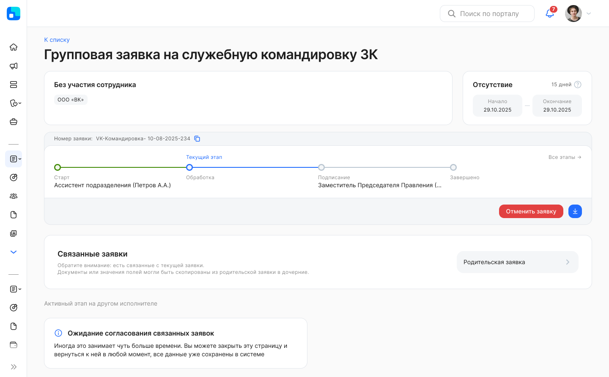

Индивидуальная дочерняя заявка

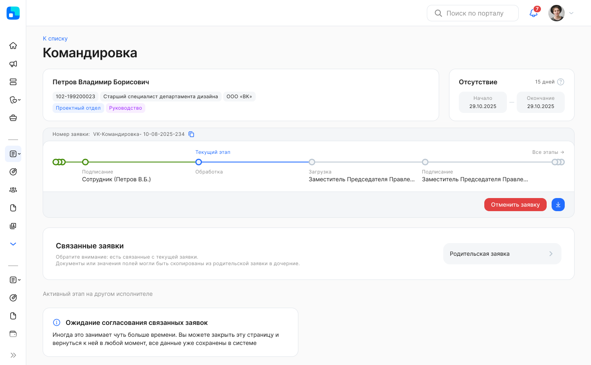

<info>

Настройка бизнес-процесса является платной. Для подключения обратитесь в [поддержку VK HR Tek](/ru/hr/support/contact_channels)

</info>

## **Уведомления**

### **Email-канал для отправки уведомлений сотруднику**

Теперь сотрудники могут получать уведомления об успешном выпуске/автоматическом перевыпуске УНЭП не только по СМС, но и на электронную почту.

### **Push-уведомления в мобильном приложении**

Добавили новый канал для отправки уведомлений по событиям в VK HR Tek — push-уведомления. 

Для дефолтных уведомлений с каналом отправки СМС будет работать следующая логика:

* если пуш-уведомления включены, тогда придет пуш-уведомление пользователю:   
  * если пуш в течение 10 мин не будет прочитан, следом придет СМС,  
  * если пуш будет прочитан, то СМС не придет.  
* если пуш-уведомления не включены или у пользователя нет мобильного приложения, то сразу придет СМС. 

Также канал пуш-уведомлений появился для ряда кастомных уведомлений. По умолчанию пуш-уведомления будут выключены.  

<info>

Чтобы включить пуш-уведомления для [кастомных уведомлений](/ru/hr/notifications#kastomnye_uvedomleniya), обратитесь в поддержку VK HR Tek. В обращении перечислите список тем уведомлений

</info>

Посмотреть интерфейс

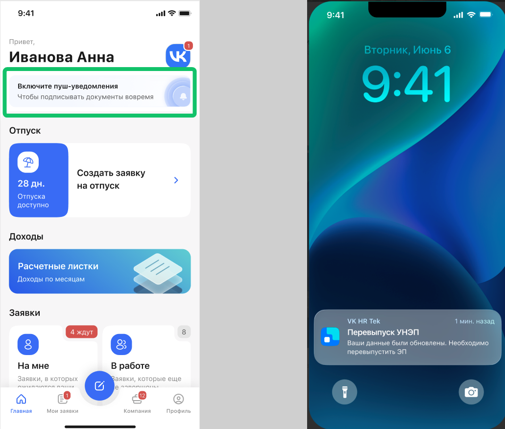

## **Социальные сервисы**

<info>

Для подключения социальных сервисов обратитесь к вашему менеджеру VK HR Tek

</info>

### **Сообщества**

#### **Добавление изображения в «шапку» сообщества**  

На форме создания/редактирования появилась возможность добавить обложку — изображение для «шапки» сообщества. Подробнее в статье [Создание сообщества](/ru/hr/portal/communities/management/create#zapolnenie_opisaniya_soobshchestva).  

Посмотреть интерфейс

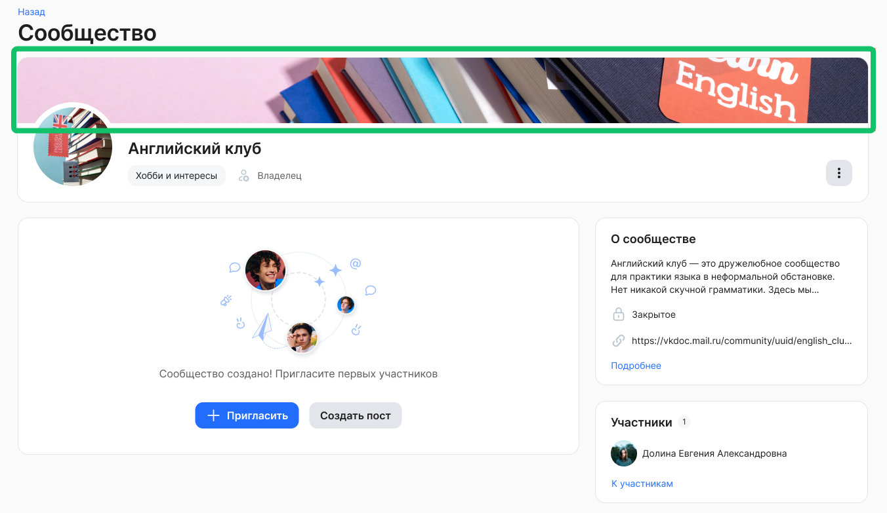

#### **Поиск по сообществам и постам сообществ**  

Появился единый поиск по сообществам и их контенту. Можно находить **сообщества**, **посты внутри сообществ** и **комментарии к постам** по ключевым словам. Поиск помогает быстро перейти к нужной теме, обсуждению или ответу, даже если вы не помните, где именно это было опубликовано.

Преимущества:
* Быстрее находите нужное: один запрос — и результаты сразу по сообществам, постам и комментариям.  
* Экономия времени: меньше ручного просмотра ленты и веток обсуждений.  
* Проще ориентироваться в большом количестве сообществ: легко найти релевантное сообщество по теме и сразу увидеть активные обсуждения.  
* Повышает повторное использование контента: старые полезные посты и ответы легче найти и не создавать дубликаты вопросов.  
* Ускоряет коммуникацию: быстрее находите, кто и где уже обсуждал вопрос, и можете продолжить диалог в нужной ветке.  
* Улучшает качество обсуждений: меньше повторяющихся тем, больше ссылок на уже найденные ответы и контекст.

Подробнее в статье [Поиск по социальным сервисам](/ru/hr/portal/search). 

#### **Модерация постов**  

В сообществах появилась возможность включить **модерацию постов**. Обычные участники могут предложить пост к публикации, а сотрудники с административными правами в сообществе проверить его и согласовать или отклонить. Это помогает поддерживать качество контента и единые правила публикаций в сообществе. 

Преимущества:
* Контроль качества и соответствия правилам: публикации проходят проверку перед размещением в ленте сообщества.  
* Снижение шума и нерелевантного контента: меньше случайных/дублирующих/неподходящих постов.  
* Безопасность и корректность: проще предотвращать публикацию чувствительной информации, нарушений и некорректных формулировок.  
* Единый стиль и структура: администраторы могут поддерживать форматирование, теги, тональность и стандарты сообщества.  
* Удобный вклад участников: участники по-прежнему могут делиться идеями и материалами, не теряя возможности быть услышанными.  
* Повышение доверия к сообществу: лента становится более полезной и предсказуемой по качеству, что увеличивает вовлечённость.

Подробнее в статье [Модерация поста](/ru/hr/portal/communities/management/moderate_post).  

Посмотреть интерфейс

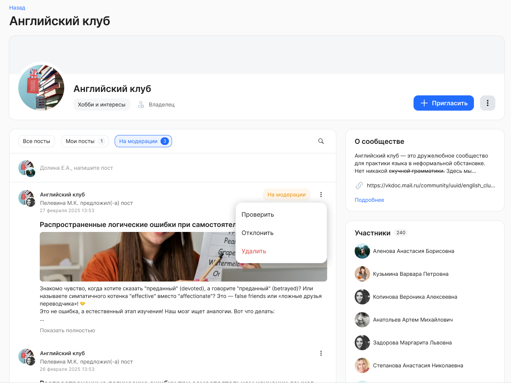

#### **Публикация постов от имени сообщества**  

Появилась возможность публиковать посты от имени конкретного сотрудника или от имени сообщества. Возможность публиковать пост от имени сообщества доступна только сотрудникам с административными правами в сообществе.  

Посмотреть интерфейс

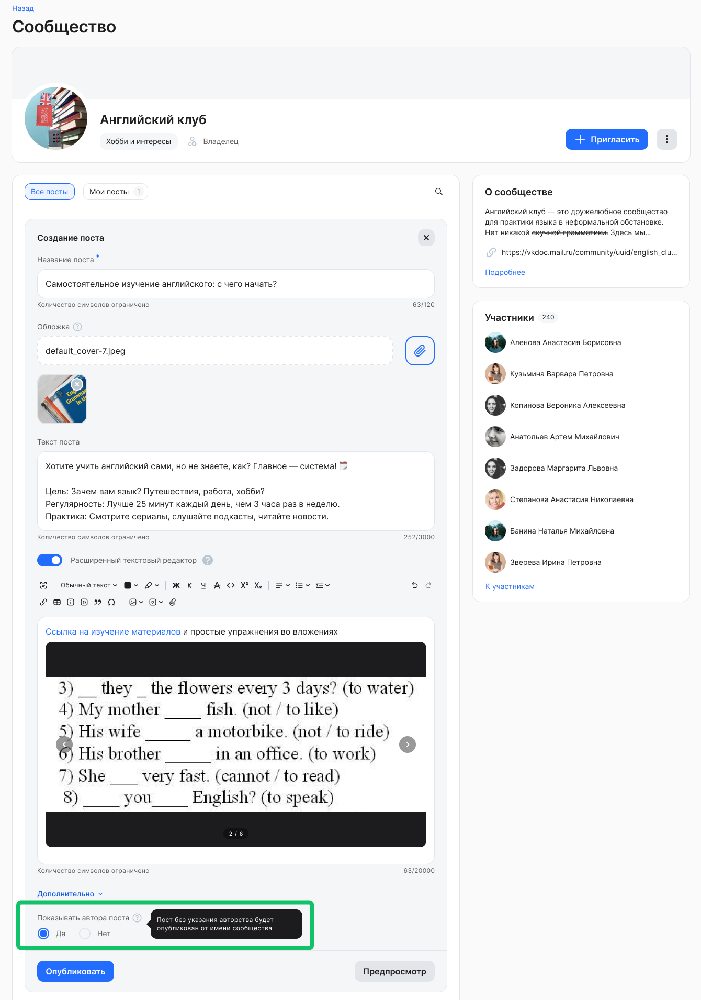

### **Опросы**

#### **Аналитика по прохождению опросов** 

Сотрудники с правами администрирования опросов могут смотреть результаты по каждому вопросу как в общем виде, так и в разрезе конкретных сотрудников.  
Обычные сотрудники могут видеть общую статистику по каждому вопросу (кроме текстовых), если администратор включил настройку просмотра ответов опроса сотрудниками. 

Преимущества:
* Быстрое понимание итогов: наглядная общая статистика по каждому вопросу без ручного подсчёта.  
* Глубокий анализ для администраторов: возможность смотреть результаты по конкретным сотрудникам помогает разбирать спорные случаи, уточнять контекст и повышать качество данных.  
* Гибкое управление доступом: администратор сам решает, показывать ли результаты сотрудникам, и тем самым балансирует открытость и конфиденциальность.  
* Защита чувствительных данных: текстовые ответы не отображаются в общей статистике для сотрудников, что снижает риск раскрытия персональных формулировок.  
* Повышение доверия и вовлечённости: когда результаты (в допустимом виде) доступны, участники чаще воспринимают опрос как полезный инструмент, а не формальность.  
* Ускорение принятия решений: аналитика помогает быстрее выявлять тренды и проблемные зоны по конкретным вопросам.

Подробнее в статье [Просмотр аналитики по опросам](/ru/hr/portal/survey/management/analytics).  

Посмотреть интерфейс

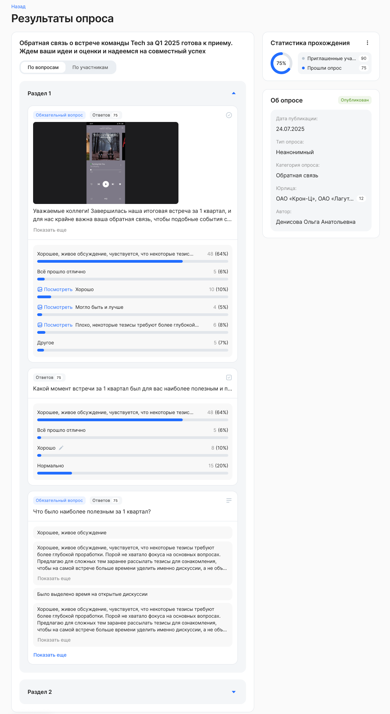

### **Текстовый редактор**

#### **Мини-опросы в текстовом редакторе**  

В текстовом редакторе новостей и постов появилась возможность добавлять мини-опросы. Мини-опрос — это опрос из одного вопроса, который отображается в конце текста публикации. В одном материале можно добавить несколько мини-опросов.

Поддерживаются следующие типы ответов: 
* Один вариант из нескольких,  
* Несколько вариантов из нескольких,  
* Текстовый ответ.

Для каждого мини-опроса можно настроить, показывать ли результаты всем сотрудникам или скрывать их (при этом по текстовым ответам общая статистика не отображается).

Преимущества:
* Быстрый сбор обратной связи без отдельного опроса: мини-опросы создаются прямо при подготовке новости/поста.  
* Единая точка взаимодействия: все вопросы собраны в конце публикации, читателю удобно ответить после прочтения.  
* Гибкие форматы ответов:   
  * один вариант — для голосований, выбора и т.д,  
  * несколько вариантов — для чек-листов, сбора предпочтений и т.д.,  
  * текст — для комментариев, предложений и т.д.  
* Несколько вопросов в одной публикации: можно собрать мнения по разным аспектам темы, добавив несколько мини-опросов.  
* Управление прозрачностью: автор/администратор решает, показывать результаты всем или оставить их только для анализа.  
* Конфиденциальность текстовых ответов: отсутствие общей статистики по текстовым ответам снижает риск раскрытия персональных формулировок.

Подробнее в статьях [Создание новости](/ru/hr/portal/news/management/create) и [Создание поста](/ru/hr/portal/communities/work/create_post).  

Посмотреть интерфейс

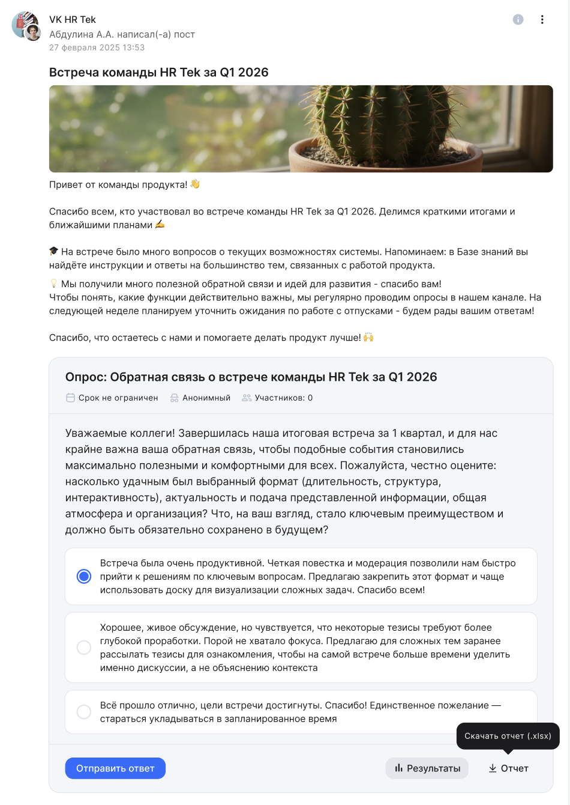

#### **Возможность внести корректировки в уже написанную цитату**  

Упростили процесс работы с цитатами. Появилась возможность внести корректировку в ранее написанную цитату.

Посмотреть интерфейс

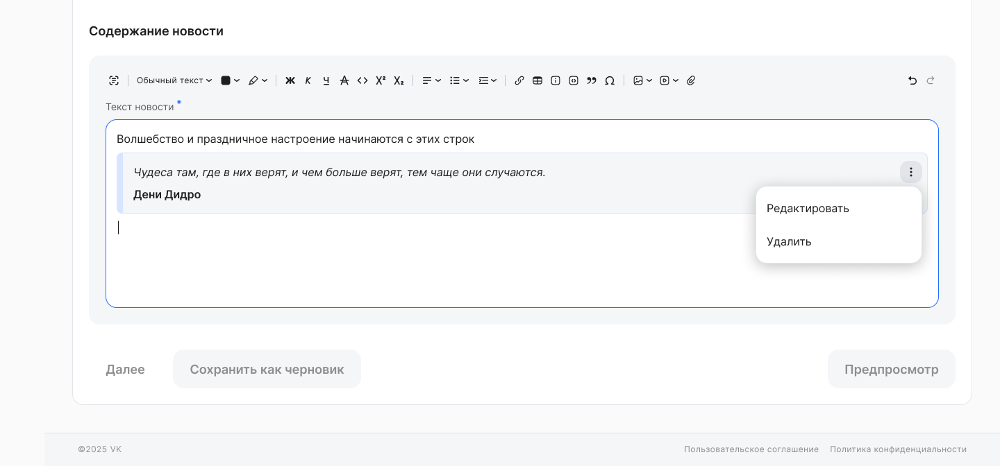

