## **Главная страница / UI**

### **Информирование о массовом сбое**

В случае массового сбоя в сервисе VK HR Tek пользователи увидят страницу с информацией о недоступности сервиса и статусе устранения. Страница статуса сервиса — https://status.hrtek.ru.

Бизнес-ценность:
* Снизить количество дублирующихся обращений в поддержку.  
* Обеспечить прозрачность и доверие пользователей за счет своевременного информирования.  
* Повысить операционную эффективность службы поддержки, перераспределив ресурсы на более приоритетные запросы.

Посмотреть интерфейс
 

## **Бизнес-процессы**

### **Заместители теперь видят все незавершённые заявки, а не только новые**

Когда руководителю назначают заместителя — постоянного или временного — тот автоматически получает доступ ко всем активным заявкам, где руководитель ещё не завершил своё участие. После окончания периода замещения у заместителя остается доступ только к заявкам, в которых он выполнил действие за руководителя. К остальным заявкам доступ закрывается.

Сценарий: руководитель ушёл в отпуск, в работе находятся заявки на согласовании. Раньше заместитель видел только новые заявки и не мог закрыть уже начатые. Теперь — может сразу приступить ко всем незавершённым этапам.

Функциональность будет доступна при включенной настройке **Обновление заявок при смене руководителя** в компании или аккаунте. 

Посмотреть интерфейс настройки
 

Для компании. Путь: **Настройки → Настройки общие → Настройки компании**

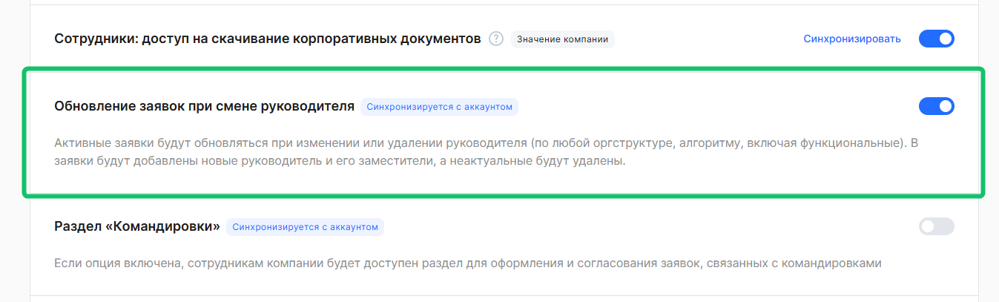

Для аккаунта. Путь: **Настройки → Настройки общие → Настройки аккаунта**

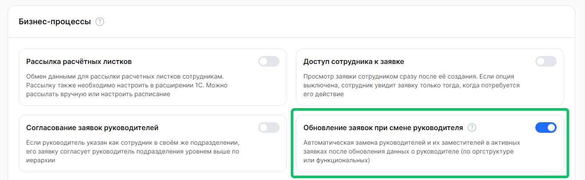

### **Планирование графиков отпусков — теперь с разграничением доступа по профилям доступа**

В настройках компании появился новый параметр «Использовать профили доступа для ограничения доступа к заявкам планирования графиков отпусков». Администратор включает его в разделе **Настройки КЭДО → Настройки компании → Профили доступа**. По умолчанию опция отключена.

Когда настройка включена, специалист открывает раздел **Графики отпусков** и видит только заявки тех сотрудников, которые входят в его профиль доступа. Заявки остальных сотрудников не отображаются.

Это позволяет компаниям со сложной структурой разграничить работу с планированиями графиков аналогично работе с заявками  — каждый специалист работает только со «своими» сотрудниками, без доступа к данным других групп.  

Посмотреть интерфейс настройки
 

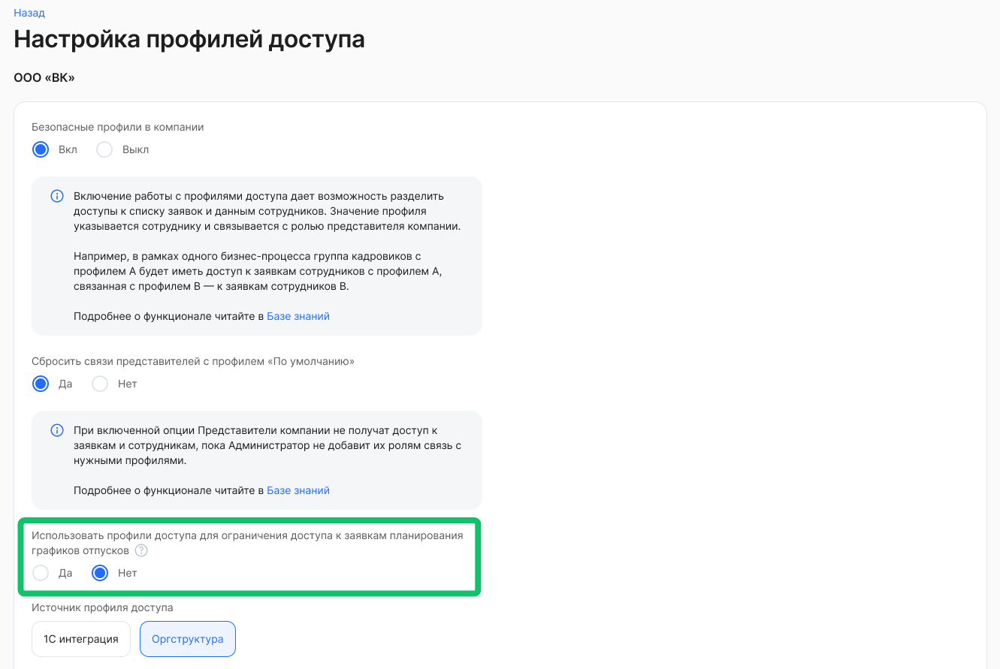

### **Заявки на доработке теперь видно сразу**

В карточке заявки и в листинге появилась метка «На доработке» — она показывает, что этап был активирован в результате возврата, а не первичного перехода заявки на исполнителя. При наведении на метку открывается история возвратов: дата, инициатор и этап, с которого вернули. В комментарии к заявке теперь указано, что он оставлен при возврате.  

В листинге заявок (для представителей компании и сотрудников) добавлен фильтр «Только заявки на доработке» — он выводит только те заявки, у которых текущий активный этап назначен в результате возврата. Работает вместе с остальными фильтрами и быстрыми фильтрами, поддерживает сохранение в выборку.  

Посмотреть интерфейс
 

1. Заявка

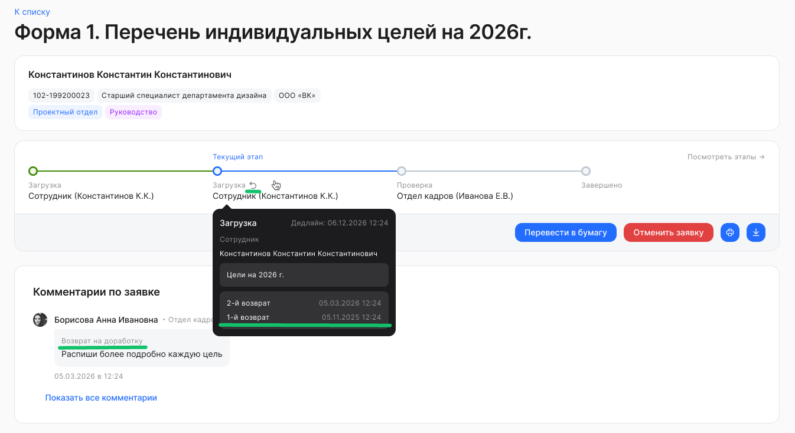

2. Этапы заявки  

3. Список заявок  

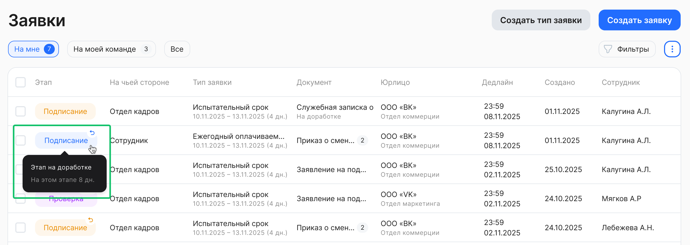

4. Фильтр «Только заявки на доработке»  

### **Проверка номера карты и минимальной длины значения текстового поля заявки**

Для текстовых атрибутов появилась опция «минимальное количество символов». Её можно использовать для любого поля: номер карты, номер лицевого счёта, СНИЛС, артикул — что угодно, где точно известно минимальное количество символов в значении. Для атрибутов с номером банковской карты добавлен валидатор по алгоритму Луна: система проверяет, что цифры введены без опечаток.  

Актуально для форм, где сотрудники вводят реквизиты для выплат: если номер карты содержит ошибку или значение короче допустимого, ошибка обнаружится на этапе заполнения, а не после отправки. Это сокращает количество возвратов заявок и ручных проверок со стороны HR.  

<info>

Настройка бизнес-процесса является платной. Для подключения обратитесь в [поддержку VK HR Tek](/ru/hr/support/contact_channels)  

</info>

### **Документ с подразделениями без наименования организации («корневого» подразделения)**

Теперь в документах, которые сформированы из шаблона, будут отображаться подразделения без наименования организации или «корневого» подразделения.  

При добавлении первого подразделения в управленческую структуру, Администратор указывает наименование «корневого» подразделения. Подробнее в статье [Создание и редактирование подразделений](/ru/admin_actions/management_structure/create_edit_division).   

При использовании полей для шаблона (плейсхолдеров) с окончанием ".UpN" система исключает наименование организации или «корневого» подразделения в документах, где указаны дочерние подразделения.  

Используется при формировании значений для нескольких уровней вверх в следующих плейсхолдерах:
* юридическое подразделение сотрудника {{ .Employee.LegalUnits.Up1 }} \- {{ .Employee.LegalUnits.Up9 }}   
* юридическое подразделение непосредственного руководителя {{ .Employee.Manager.LegalUnits.Up1 }} \- {{ .Employee.Manager.LegalUnits.Up9 }}  
* юридическое подразделение юридического руководителя {{ .Employee.LegalManager.LegalUnits.Up1 }} \- {{ .Employee.LegalManager.LegalUnits.Up9 }}  
* юридическое подразделение управленческого руководителя {{ .Employee.OperationalManager.LegalUnits.Up1 }} \- {{ .Employee.OperationalManager.LegalUnits.Up9 }}  
* управленческое подразделение сотрудника {{ .Employee.OperationalUnits.Up1 }} \- {{ .Employee.OperationalUnits.Up9 }}  
* управленческое подразделение непосредственного руководителя {{ .Employee.Manager.OperationalUnits.Up1 }} \- {{ .Employee.Manager.OperationalUnits.Up9 }}

Посмотреть список возможных полей для шаблона
 

Путь: **Настройки → Бизнес-процессы → Шаблоны документов → Загрузка нового шаблона**.  

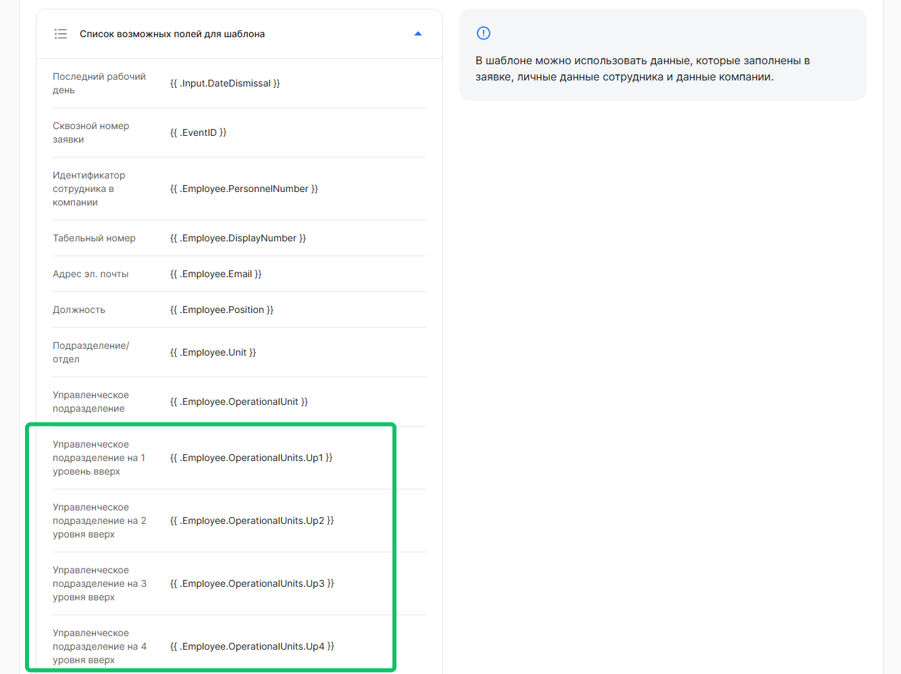

## **Электронная подпись**

### **Выпуск УНЭП через ЕСИА больше не зависит от сбоев СМЭВ**

В настройках компании появился переключатель «Пропускать все ошибки (только для ЕСИА)». Путь: **Настройки → Настройки компании → Валидация СМЭВ по типам ошибок**.  

Актуально, когда сотрудник выпускает УНЭП через ЕСИА, а СМЭВ в этот момент работает с ошибками. Раньше выпуск останавливался — теперь при включённой настройке система пропускает проверку СМЭВ и продолжает выпуск.  

Это безопасно: ЕСИА уже подтвердил личность сотрудника, дополнительная проверка не нужна. Настройка действует только для выпуска через ЕСИА и не затрагивает другие сценарии.  

Администратор может включить её сразу для всех компаний аккаунта через настройку «Применить ко всем компаниям аккаунта». Если у кого-то из сотрудников выпуск уже завершился ошибкой — достаточно запустить перевыпуск УНЭП, и новая попытка пройдёт с учётом новой настройки.  

Посмотреть интерфейс настройки
 

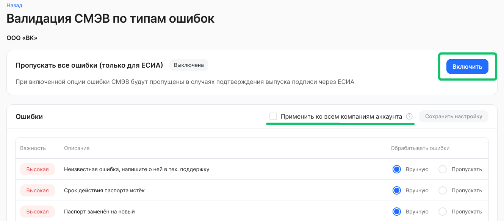

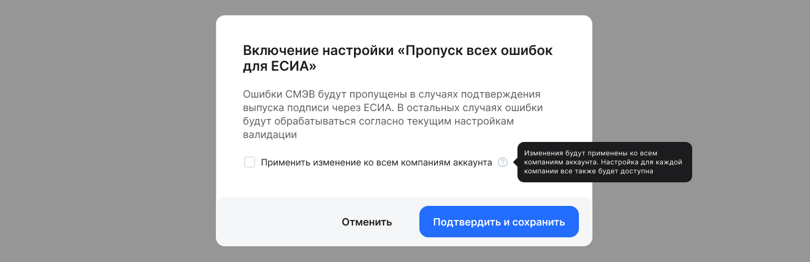

## **Корпоративные документы / ЛНА**

### **Загрузка списка сотрудников из файла CSV при публикации ЛНА**

При публикации ЛНА помимо ручного выбора сотрудников в атрибуте добавили возможность автоматической загрузки списка таких сотрудников из файла .csv:
* после загрузки csv-файла система считывает данные и отображает уведомление об успешном добавлении сотрудников, на которых будет опубликован ЛНА;  
* возможность выбора сотрудников вручную остается также доступной;  
* такая возможность будет доступна и при изменении настроек уже опубликованного ЛНА.

При выборе этого варианта поля, необходимые при выборе вручную (Тип оргструктуры/Подразделение/Должность/Включая руководителя подразделения), скрываются.  

Выбор варианта загрузки файла при публикации ЛНА
 

1. Перейдите в раздел **Сервисы компании → Корпоративные документы → Новый документ**.  
2. Выберите юрлицо, если в аккаунт входит несколько компаний.  
3. В поле **Добавить сотрудников** выберите вариант **Загрузить список**.  
4. В поле **Сотрудники** загрузите список сотрудников через csv-файл.

Загрузка нового csv-файла приводит к автоматическому удалению ранее загруженного файла и его замене на новый. Также можно отдельно удалить уже загруженный файл вручную.  

[Шаблон для загрузки сотрудников по EmployeeID.csv](./assets/template_EmployeeID.csv "download")

[Шаблон для загрузки сотрудников по Табельному номеру.csv](./assets/template_tabel_number.csv "download")

[Шаблон для загрузки сотрудников по Персональному номеру.csv](./assets/template_personal_number.csv "download")

Также добавили опцию, при включении которой можно будет выбрать руководителей в списке сотрудников, для которых будет опубликован корпоративный документ:
* доступна только в режиме ручного выбора сотрудников;  
* опция включена: руководители выбранных подразделений добавляются в перечень должностей и в список сотрудников при публикации ЛНА;  
* опция выключена: текущий порядок действия в атрибутах при публикации остается без изменений.

Руководитель выбранного подразделения определяется согласно штатному расписанию.  

Посмотреть интерфейс
 

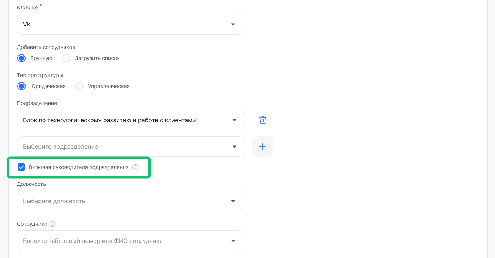

Бизнес-ценность:
* сокращение времени на выбор сотрудников в атрибуте при публикации ЛНА;
* снижение количества ошибок при таком выборе;  
* ознакомление с ЛНА руководителей подразделений сотрудников, которые были добавлены при публикации ЛНА.

## **График отпусков**

### **Отображение типа отпуска в запланированном графике отпусков**

Добавлено отображение типа отпуска в распланированных периодах отпусков сотрудника в графике отпусков, в блоке **Мои отпуска** (раздел **Мои сервисы → Графики отпусков**) и в блоке **Отпуск сотрудника** (раздел **Сервисы компании → Графики отпусков**).  

Функциональность позволит видеть запланированные периоды отсутствий вместе с типом отсутствий в графике после направления на согласование, так как ранее после отправки на согласование сотруднику был виден только перечень запланированных периодов без типа.  

Посмотреть интерфейс
 

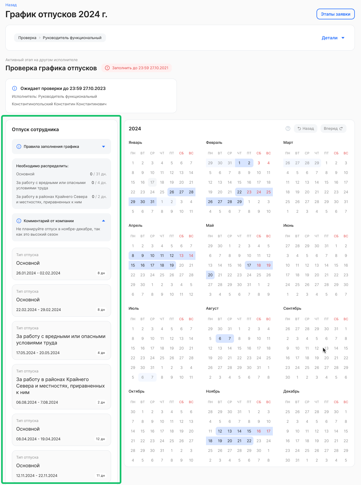

Бизнес-ценность:
* сокращение времени на поиск информации о запланированных периодах: согласующие и сотрудник видят сразу, какие отпуска запланированы.

### **Добавление подразделений и сотрудников в активное планирование графика отпусков**

В активном планировании графика отпусков <u>по юрлицу</u> доступно добавление сотрудников — выборочно или всех новых, кто не попал в это планирование. В активном планировании графика отпусков <u>по подразделениям</u> доступно добавление подразделения полностью с его сотрудниками.  

Чтобы добавить новых сотрудников в разрезе подразделений и/или напрямую по табельному номеру/ФИО сотрудника, перейдите в **Настройки КЭДО → Настройки бизнес-процессов → Графики отпусков** **→** детали планирования активного графика отпусков. После добавления новых сотрудников будут созданы задачи на планирование для этих сотрудников.  

При добавлении сотрудников можно выбрать только тех сотрудников, для которых нет активных / успешно завершенных планирований в предстоящем периоде.  

Также можно исключить сотрудников, которых нет в активном планировании при добавлении сотрудников/подразделения, например, добавить подразделение, но исключить из него пару человек:
* исключение сотрудников выборочно напрямую по табельному номеру/ФИО требуемых сотрудников;  
* после сохранения изменений выбранные сотрудники исключены и задачи для них отменены.

Добавление сотрудников по юрлицу
 

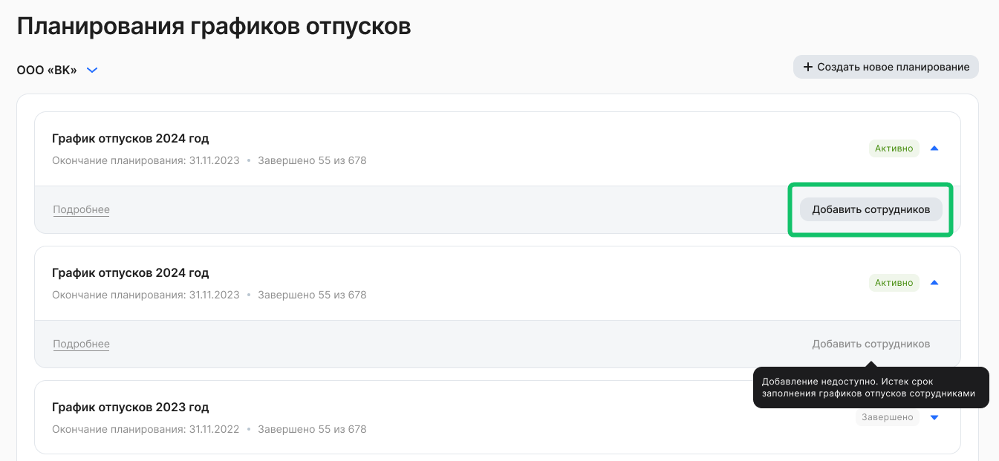

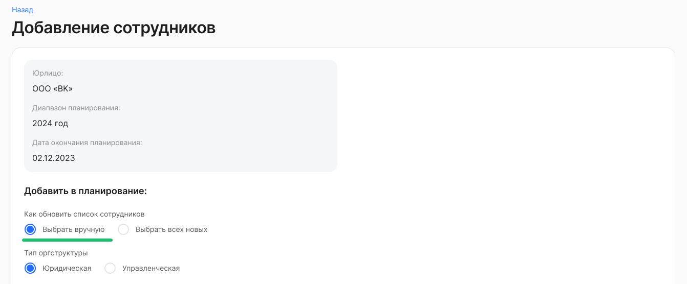

Добавление сотрудников по подразделениям
 

 

Уведомления о добавлении новых сотрудников и подразделений в планирование
 

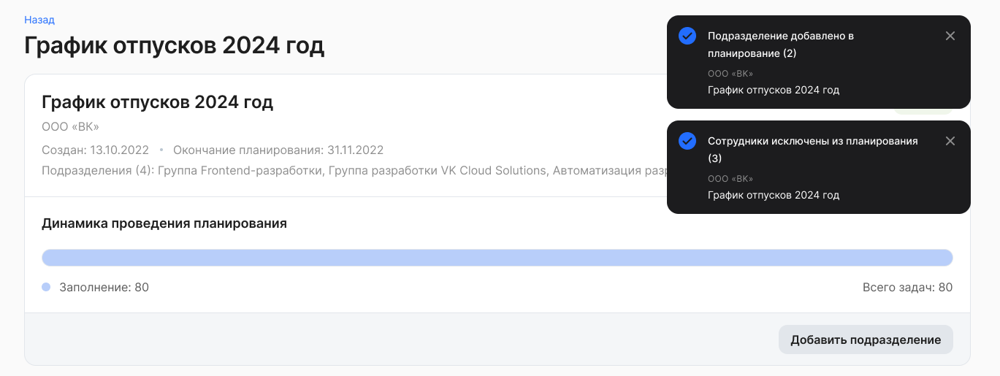

Бизнес-ценность:
* процесс планирования в системе в полном объеме, по всем сотрудникам и подразделениям;  
* не нужно перезапускать планирование снова, если появились сотрудники до даты завершения планирования;  
* повышение гибкости системы при изменениях организационной структуры.

## **Командировки**

### **Отдельный листинг заявок на командировки**

Добавили новый раздел **Командировки** для отображения списка заявок на командировки.   

В разделе **Сервисы компании → Командировки** будут отображаться заявки на командировку сотрудников.  

В разделе **Мои сервисы → Мои командировки** будут отображаться заявки на командировку сотрудника пользователя.  

Включение настройки для компании и аккаунта
 

Для компании:   
Путь: **Настройки → Настройки общие → Настройки компании →** включение настройки **Раздел «Командировки»**. 

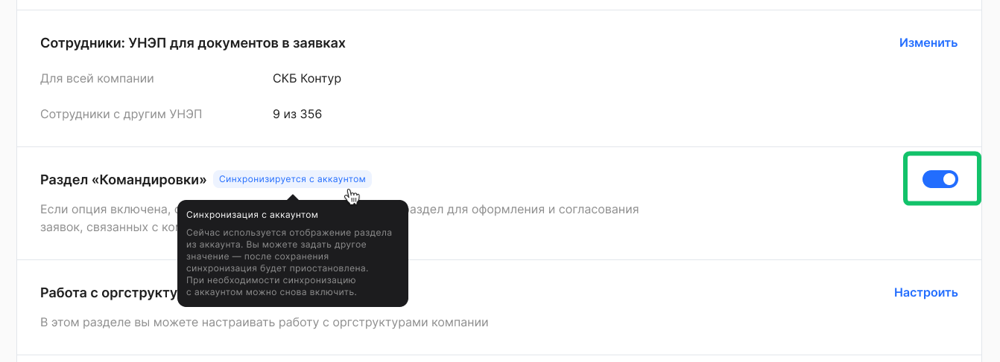   

Для аккаунта:   
Путь: **Настройки → Настройки общие → Настройки аккаунта →** включение настройки **Раздел «Командировки»**.  

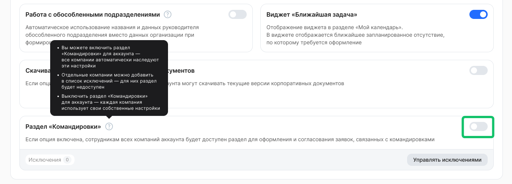 

Посмотреть интерфейс раздела «Командировки»

Перечень возможностей в разделе:

* Сортировка;  
* Фильтрация по кнопке;  
* Создание заявки на командировку на странице раздела;  
* Возможность скачивания данных по заявкам.

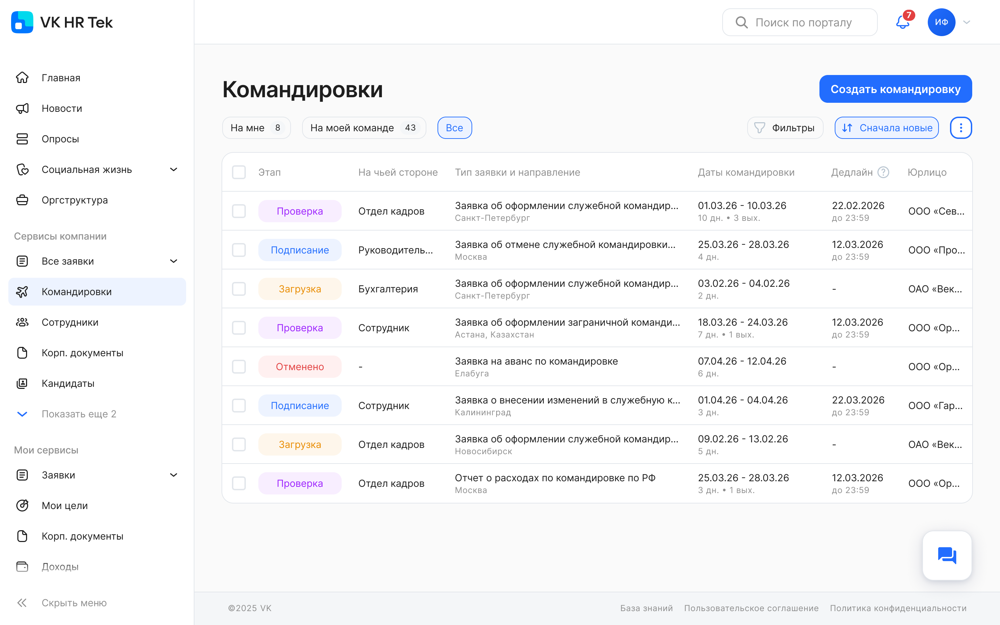

Фильтр на странице листинга:
* В сервисах компании: На мне / На моей команде / Все;  
* Мои сервисы:  На мне / Все / От меня.

Сортировка на странице листинга:
* при загрузке раздела по умолчанию — по дате создания заявки убыванию;  
* добавлена опция сортировки листинга «Ближайшие командировки в начале списка»:  
    * заявки с датой начала командировки на текущую дату в начале списка;  
    * заявки по возрастанию даты начала командировки > текущей даты;  
    * заявки по убыванию даты начала командировки < текущей даты.

Бизнес-ценность:

* все заявки для согласования и обработки в одном месте, что сократит время поиска, сортировки, выбора и пр.;  
* контроль статуса самим сотрудником в одном месте;  
* уменьшение риска пропуска срочных поездок за счет сортировки ближайших заявок.

<info>

Если в разделе **Командировки** заявки отображаются некорректно или не отображаются вовсе, то обратитесь в [поддержку VK HR Tek](/ru/hr/support/contact_channels)  

</info>

## **Уведомления**

<info>

Коды подтверждения от УЦ Контур для подписания документов и ознакомления с ЛНА в VK HR Tek также могут приходить в MAX (https://vk.company/ru/press/releases/12305)

</info>

Начиная с версии 2026.04 приоритетным каналом отправки одноразовых кодов подтверждения для входа в сервис VK HR Tek станет меccенджер MAX:
* если у пользователя есть MAX, то одноразовый код придет в мессенджер (чат-бот «Коды подтверждения»), не по СМС;   
* если у пользователя есть MAX, но пуш-уведомление не доставлено/не открыто, то одноразовый код придет в СМС через одну минуту после неуспешной доставки в MAX;  
* если у пользователя нет MAX, тогда одноразовый код будет сразу отправлен по СМС.  

<info>
Бот MAX «Коды подтверждения» — официальный чат-бот в мессенджере MAX, через который приходят коды подтверждения от разных сервисов (например, для входа на «Госуслуги», для входа в VK HR Tek и др.)  
</info>

Сообщение при входе в сервис

Интерфейс бота MAX «Коды подтверждения»

