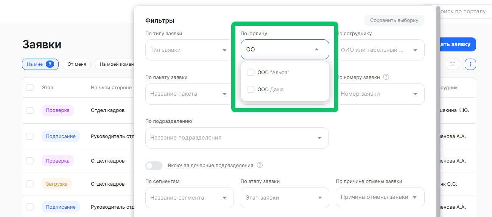
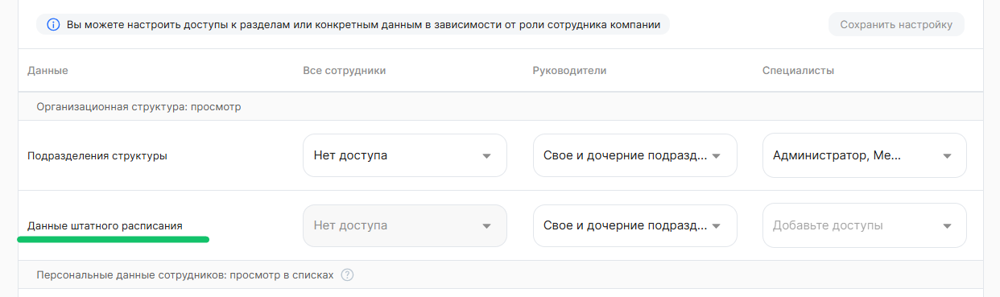

## **Бизнес-процессы**

### **Обновления автоматизации рассылки табеля**

Заявки, которые автоматически создаются при распиле табеля по подразделениям, стало проще находить и различать.

Название подразделения, на которое создан табель, видно в списке заявок и в «шапке» заявки.

Фильтр «По подразделению» находит заявки по значению подразделения, на которое создан табель.

Посмотреть интерфейс
 

<info>

Настройка бизнес-процесса рассылки табеля является платной. Для подключения обратитесь в [поддержку VK HR Tek](/ru/hr/support/contact_channels) 

</info>

### **Настройка дедлайна в типе заявки**

Теперь при настройке дедлайна этапа система не даст сохранить нереалистичное количество дней. В разделе **Настройки → Типы заявок**, на странице редактирования этапов бизнес-процесса поле **Количество** принимает значения только от −1200 до 1200. При вводе числа за пределами диапазона появится сообщение об ошибке, и сохранить изменения не получится, пока значение не будет исправлено.  

Посмотреть интерфейс
 

### **Обновление в фильтрах списка заявок**

Добавили возможность поиска в фильтрах с выбором нескольких значений, в том числе в фильтре по компании.  

Посмотреть интерфейс
 

### **Шаблоны документов**

Повысили уровень безопасности сервиса VK HR Tek. Согласно новым требованиям:  

- в шаблонах .docx запретили наличие любых внешних ссылок на ресурсы: логотипы, шаблоны и т.п. Все эти ресурсы можно встраивать внутри самого .docx, чтобы они были внутри документа, а не ссылкой снаружи.  
- запретили плейсхолдер “vnd.sun.star.expand” внутри документа — такой иногда используют в LibreOffice и OpenOffice.  

Загрузка и использование таких шаблонов теперь невозможны.

Пример запрещенной ссылки 
 

Ссылка на шаблон, которую можно посмотреть в свойствах .docx-документа. 

## **Компания/аккаунт**

Компания, которая использует не все сервисы VK HR Tek, теперь может оставить только нужные: неиспользуемые сервисы можно скрыть, и в меню не останется пустых разделов.  

Раньше все сервисы КЭДО были включены по умолчанию и управлять можно было только портальными — теперь можно отключить сервисы «Заявки и графики отпусков», «Отсутствия и графики работы», «Корпоративные документы», «Кандидаты» или «Командировки» на уровне аккаунта или отдельной компании. Отключённые сервисы исчезают из меню, виджетов и настроек сотрудников, а их данные сохраняются и возвращаются при повторном включении.  

Посмотреть интерфейс
 

Отключены сервисы: «Заявки и графики отпусков», «Отсутствия и графики работы», «Корпоративные документы», «Кандидаты» и «Командировки». В меню не отображены разделы «Заявки» (компания/сотрудник), «Рабочее время», «Мой календарь», «Корпоративные документы» (компания/сотрудник), «Кандидаты» и «Командировки». На главной странице не отображены виджеты, связанные с отключенными сервисами. 

<info>

Настройка выполняется через [поддержку VK HR Tek](/ru/hr/support/contact_channels)  

</info>

Подробнее, как это работает

Если для сервиса, который хотите включить/отключить, установлено ограничение на уровне аккаунта, то ограничение автоматически применяется ко всем компаниям аккаунта. 

Ограничения доступа к сервисам распространяются на все категории пользователей. 

Для пользователей, подключенных к нескольким компаниям и/или аккаунтам, доступность сервиса определяется по всем компаниям пользователя:
- сервис отображается пользователю, если он включен хотя бы в одной компании, к которой подключен пользователь,
- сервис не отображается пользователю, если он отключен во всех компаниях пользователя.

Отображение данных сервиса «Отсутствия и графики работы» зависит от работы сервиса «Заявки и графики отпусков»:
- если сервис «Заявки и графики отпусков» отключен, то сервис «Отсутствия и графики работы» автоматически считается отключенным и недоступен пользователям,  
- включение сервиса «Отсутствия и графики работы» возможно только при включенном сервисе «Заявки и графики отпусков»,  
- отключение сервиса «Отсутствия и графики работы» не влияет на доступность сервиса «Заявки и графики отпусков».

Отображение данных сервиса «Командировки» зависит от работы сервиса «Заявки и графики отпусков»:
- если сервис «Заявки и графики отпусков» отключен, то сервис «Командировки» автоматически считается отключенным и недоступен пользователям,  
- включение сервиса «Командировки» возможно только при включенном сервисе «Заявки и графики отпусков»,  
- отключение сервиса «Командировки» не влияет на доступность сервиса «Заявки и графики отпусков».

При отключении того или иного сервиса будут недоступны определенные разделы в меню, виджеты и настройки. Доступно управление следующими сервисами:

| Сервис | Разделы, виджеты, настройки, которые не будут  отображаться в интерфейсе при отключении сервиса | Примечание |
| ----- | ----- | ----- |
| **Заявки и графики отпусков** |
 Разделы меню: - Заявки (Мои сервисы), - Заявки, В бумагу (Сервисы компании), - Каталог запросов, - Графики отпусков (Мои сервисы / Сервисы компании)

 Виджеты: - Разделы с активными запросами (включая настройку  отображения виджета в разделе  «Виджеты на главной странице»)

 Настройки аккаунта: - Доступ сотрудника к заявке, - Обновление заявок при смене руководителя, - Согласование заявок руководителей

 Настройки компании: - Доступ сотрудника к заявке сразу после создания, - Обновление заявок при смене руководителя, - Уровень согласования для руководителя подразделения, - Согласование руководителями по бизнес-процессам, - Профили доступа, - Управление каталогом запросов, - Графики отпусков

 Настройки навигации: - Заявки (Мои сервисы), - Заявки, В бумагу (Сервисы компании), - Каталог запросов, - Графики отпусков (Мои сервисы / Сервисы компании)

 Ролевая модель — без изменений
 | Если сервис отключен, то: - Профили доступа отключаются целиком, включая планирование графика отпусков. - Виджет «Разделы с активными запросами» отключается целиком. - Раздел «Графики отпусков» (сотрудник/компания) по текущей логике не должен отображаться сотруднику и/или представителю, если нет активных планирований Графика отпусков. |
| **Отсутствия и графики работы** |
 Разделы меню: - Рабочее время (Сервисы компании), - Мой календарь (Мои сервисы)

 Виджеты: - Сервисы сотрудника: карточка «Мои отпуска и отсутствия»  (включая настройку отображения виджета в разделе  «Виджеты на главной странице» →  Виджет «Сервисы сотрудника»), - Сервисы руководителя: карточка «Рабочее время»  (включая настройку отображения виджета в разделе  «Виджеты на главной странице» → Виджет «Сервисы руководителя»), - Календарь (включая настройку отображения виджета  в разделе «Виджеты на главной странице»), - Отпуска (включая настройку отображения виджета в разделе  «Виджеты на главной странице»)

 Настройки компании/аккаунта: - Виджет «Ближайшая задача»,
 Настройки навигации: - Рабочее время (Сервисы компании), - Мой календарь (Мои сервисы)

 Ролевая модель: - Блок «Рабочее время: просмотр», - Блок «Персональные данные сотрудников: просмотр  в списках» / «Данные об отсутствии сотрудника», - Блок «Страница сотрудника - Общая информация:  просмотр» / «Данные об отсутствии»
 |  |
| **Корпоративные документы** |
 Раздел «Корпоративные документы»  (Мои сервисы / Сервисы компании)

 Раздел «Сотрудники» / выгрузки по ЛНА

 Виджеты: - Сервисы сотрудника: карточка «Корпоративные документы»  (включая настройку отображения виджета в разделе  «Виджеты на главной странице» → Виджет «Сервисы сотрудника»)

 Настройки компании/аккаунта: - Сотрудники: доступ на скачивание корп. документов,
 Настройки навигации: - Корпоративные документы  (Мои сервисы / Сервисы компании)

 Ролевая модель: - Блок «Корпоративные документы: просмотр,  управление документами»
 |  |
| **Кандидаты** |
 Раздел «Кандидаты» (Сервисы компании)

 Виджеты: - Сервисы руководителя: карточка «Прием на работу»  (включая настройку отображения виджета в разделе  «Виджеты на главной странице» → Виджет «Сервисы руководителя»)

 Настройки навигации: -  Кандидаты (Сервисы компании)
 |  |
| **Командировки** |
 Раздел «Командировки» (Мои сервисы / Сервисы компании)

 Настройки компании/аккаунта: - Раздел «Командировки»
Настройки навигации: - Командировки (Мои сервисы / Сервисы компании)
 |  |

## **Ролевая модель**

Для компаний, которые подключили данные штатного расписания в организационную структуру. Теперь руководители могут видеть всю оргструктуру компании, а данные штатного расписания — только по своему подразделению.  

Раньше доступ к данным штатного расписания настраивался в ролевой модели, в блоке «Персональные данные сотрудников: просмотр в списках» и был привязан к видимости оргструктуры — открыть руководителям всю структуру, но ограничить данные штатного расписания их подразделением, было нельзя.  

Теперь в ролевой модели есть отдельный объект «Данные штатного расписания» в блоке «Организационная структура: просмотр»: руководителям можно задать показ данных по своему подразделению, своему и дочерним или всей оргструктуре. Настроенные ранее права переносятся автоматически. Путь к настройке: Настройки КЭДО → Настройки → Настройки компании → Использование ролевой модели → кнопка «Настроить». 

Посмотреть интерфейс настройки ролевой модели

Подробнее, как это работает

В блок «Организационная структура: просмотр» добавлен новый объект данных «Данные штатного расписания». Настройка определяет доступ к данным штатного расписания по категории ролей:   

| **Объект**  | **Все сотрудники** | **Руководители** | **Специалисты** |
| ----- | ----- | ----- |----- |
| Данные штатного расписания | нет доступа (изменить нельзя) | -нет доступа, - вся оргструктура, - только свое подразделение, - свое и дочерние подразделения | не выбраны группы |

Руководители видят данные штатного расписания (ШР) согласно выбранной опции: 
- «Нет доступа» — данные ШР не отображаются. Опция выбрана по умолчанию.  
- «Только своё подразделение» — данные ШР только по своему подразделению.  
- «Своё и дочерние подразделения» — данные ШР по своему и всем дочерним подразделениям.  
- «Вся оргструктура» — данные ШР по всем подразделениям.  

Итоговый набор подразделений ограничивается блоком «Организационная структура: просмотр». Данные ШР доступны только по тем подразделениям, что одновременно доступны руководителю на просмотр в оргструктуре и попадают под выбранную опцию поля «Данные штатного расписания». Например, если по оргструктуре руководителю доступно видеть только своё подразделение, то и данные ШР ему доступны только по его подразделению.  

Специалисты видят данные ШР по всем подразделениям компании, что доступны им по блоку «Организационная структура: просмотр». По умолчанию не выбрана ни одна группа.  

<u> Логика отображения данных ШР для блока «Организационная структура: просмотр». </u>  

Итоговый доступ определяется пересечением двух объектов данных «Подразделения структуры» и «Данные штатного расписания». 

Объект «Подразделения структуры» задаёт, какие подразделения видны в разделе «Оргструктура», а «Данные штатного расписания» — по каким из видимых подразделений показываются данные ШР. Если подразделение недоступно для просмотра, данные ШР по нему не отображаются, даже если в «Данные штатного расписания» задан более широкий доступ.

| Категория ролей | Значение объекта данных  «Подразделения структуры» | Значение объекта данных  «Данные штатного расписания» | Результат |
| ----- | :---- | :---- | :---- |
| **Все сотрудники** | нет доступа | нет доступа | Нет доступа к разделу «Оргструктура» у этой категории ролей |
|  | вся оргструктура | нет доступа | В разделе «Оргструктура» доступны все подразделения компании без отображения данных ШР |
|  | только свое подразделение | нет доступа | В разделе «Оргструктура» доступно подразделение, в котором у пользователя есть неуволенный сотрудник без отображения данных ШР |
|  | свое и дочерние подразделения | нет доступа | В разделе «Оргструктура» доступны подразделения, в котором у пользователя есть неуволенный сотрудник, и все подразделения вниз по иерархии от него без отображения данных ШР |
| **Руководители** | нет доступа | нет доступа | Нет доступа к разделу «Оргструктура» у этой категории ролей |
|  | нет доступа | вся оргструктура | Нет доступа к разделу «Оргструктура» у этой категории ролей |
|  | нет доступа | только свое подразделение | Нет доступа к разделу «Оргструктура» у этой категории ролей |
|  | нет доступа | свое и дочерние подразделения | Нет доступа к разделу «Оргструктура» у этой категории ролей |
|  | вся оргструктура | нет доступа | В разделе «Оргструктура» доступны все подразделения компании без отображения данных ШР |
|  | вся оргструктура | вся оргструктура | В разделе «Оргструктура» доступны все подразделения компании с отображением данных ШР по всем подразделениям |
|  | вся оргструктура | только свое подразделение | В разделе «Оргструктура» доступны все подразделения компании; данные ШР отображаются только по подразделению, в котором у пользователя есть неуволенный сотрудник |
|  | вся оргструктура | свое и дочерние подразделения | В разделе «Оргструктура» доступны все подразделения компании; данные ШР отображаются по подразделению, в котором у пользователя есть неуволенный сотрудник, и всем подразделениям вниз по иерархии от него |
|  | только свое подразделение | нет доступа | В разделе «Оргструктура» доступно подразделение, в котором у пользователя есть неуволенный сотрудник, без отображения данных ШР |
|  | только свое подразделение | вся оргструктура | В разделе «Оргструктура» доступно подразделение, в котором у пользователя есть неуволенный сотрудник, с отображением данных ШР по этому подразделению |
|  | только свое подразделение | только свое подразделение | В разделе «Оргструктура» доступно подразделение, в котором у пользователя есть неуволенный сотрудник, с отображением данных ШР по этому подразделению |
|  | только свое подразделение | свое и дочерние подразделения | В разделе «Оргструктура» доступно подразделение, в котором у пользователя есть неуволенный сотрудник, с отображением данных ШР по этому подразделению |
|  | свое и дочерние подразделения | нет доступа | В разделе «Оргструктура» доступны подразделение, в котором у пользователя есть неуволенный сотрудник, и все подразделения вниз по иерархии от него, без отображения данных ШР |
|  | свое и дочерние подразделения | вся оргструктура | В разделе «Оргструктура» доступны подразделение, в котором у пользователя есть неуволенный сотрудник, и все подразделения вниз по иерархии от него, с отображением данных ШР по этим подразделениям |
|  | свое и дочерние подразделения | только свое подразделение | В разделе «Оргструктура» доступны подразделение, в котором у пользователя есть неуволенный сотрудник, и все подразделения вниз по иерархии от него; данные ШР отображаются только по подразделению, в котором у пользователя есть неуволенный сотрудник |
|  | свое и дочерние подразделения | свое и дочерние подразделения | В разделе «Оргструктура» доступны подразделение, в котором у пользователя есть неуволенный сотрудник, и все подразделения вниз по иерархии от него, с отображением данных ШР по этим подразделениям |

Для категории ролей «Специалисты», в которой выбранная роль получает доступ ко всем подразделениям компании, доступ определяется по каждой роли пользователя отдельно.

| Роль пользователя относительно настроек | Результат |
| ----- | ----- |
| Роль входит в «Подразделения структуры», но не входит в «Данные штатного расписания» | В разделе «Оргструктура» доступны все подразделения компании без отображения данных ШР |
| Роль входит и в «Подразделения структуры», и в «Данные штатного расписания» | В разделе «Оргструктура» доступны все подразделения компании с отображением данных ШР по всем подразделениям |
| Роль входит в «Данные штатного расписания», но не входит в «Подразделения структуры» | Нет доступа к разделу «Оргструктура» (данные ШР не отображаются) |
| Роль не входит ни в одно из выбранных объектов данных | Нет доступа к разделу «Оргструктура» |

Например, в объекте «Подразделения структуры» выбрана роль «Отдел кадров», в «Данные штатного расписания» — роль «Бухгалтерия»:  
- пользователь с ролью «Отдел кадров» видит всю оргструктуру компании без данных ШР;  
 - пользователь с ролью «Бухгалтерия» не получает доступ к разделу «Оргструктура» (его роль не выбрана в «Подразделения структуры»);  
- если у пользователя есть обе роли — он видит всю оргструктуру с данными ШР.  

При выключенной ролевой модели — всем категориям ролей данные ШР недоступны.

<info>

Для подключения настройки доступности данных штатного расписания обратитесь в [поддержку VK HR Tek](/ru/hr/support/contact_channels). Функционал доступен только при условии импорта управленческой структуры из 1С

</info>

## **Отпуска и отсутствия**

### **Возможность динамически ограничивать список доступных значений в атрибуте в заявке на основании данных импорта из 1С**

Настроена возможность проверять на соответствие значение, которое выводиться в атрибут заявки, на основании данных импорта из 1С следующим образом:

* список значений атрибута должен формироваться динамически на основании количества накопленных дней отдыха сотрудника из 1С;  
* если количество накопленных дней отдыха сотрудника равно 0, в атрибут возвращается пустой список значений.

Доработка применяется:

* для заявок с типом отпуска «Другой день отдыха за работу в выходные и праздничные дни»;   
* в заявке есть атрибут с типом выбора, где пользователь будет выбирать количество планируемых дней отдыха, к которому будет применяться новая настройка;  
* данные получены при включенной настройке «Импорт дней для отгулов»;  
* применимо для 1С ЗУП версии 3.1.34 и выше.

Валидация заключается в том, что сотрудник сможет выбрать только количество дней, не превышающее доступный остаток, полученный из 1С.  

Если при запуске заявки для сотрудника отсутствуют данные о количестве накопленных дней отдыха (например, импорт дней отключен или для сотрудника отсутствуют данные), настройка валидации к заявке не применяется.  

Если количество доступных дней отдыха из 1С больше, чем задано в настройке бизнес-процесса для этого атрибута, то атрибут будет выводиться следующим образом:

* накоплено 3 дня → вернуть значения 1, 2, 3  
* накоплено 8 дней → вернуть значения 1–8  
* накоплено 25 дней → вернуть все значения 1-10

Бизнес-ценность:

* Контроль количества выбранных дат с доступными для сотрудника;  
* Сокращение ошибок при заполнении заявки;  
* Корректная подача заявки и согласование.

<info>

Настройка бизнес-процесса является платной. Для подключения обратитесь в [поддержку VK HR Tek](/ru/hr/support/contact_channels)  

</info>

## **Социальные сервисы**

### **Целевые аудитории**

Добавили возможность создания кастомных целевых аудиторий.

Кастомные целевые аудитории расширяют модель доступа к новостям и опросам (в релизе 2026.07): теперь видимость и права можно настраивать не только по аккаунту/организации/подразделениям, но и по гибким пользовательским группам (руководители, HR, ИТ, проектные и временные команды). Это позволяет точнее доставлять контент тем, кого он действительно касается, снижает информационный шум и повышает вовлечённость и качество обратной связи, одновременно усиливая контроль доступа и снижая риски ошибочной публикации чувствительной информации.  

Посмотреть интерфейс

