## **Электронная подпись**

Теперь, если удостоверяющий центр «Контур» временно недоступен, сотрудники по-прежнему могут подписывать документы: на странице подписания заявки и при ознакомлении с корпоративными документами система предложит подписать документ через «Госключ» — такая подпись имеет тоже юридическое значение. Раньше в такие моменты подписание не работало, и сотрудники иногда считали, что не работает весь сервис.  

Это касается и сотрудников, у которых ещё не выпущен сертификат УНЭП «Контура»: на время сбоя они получают доступ к сервису и подписывают документы через «Госключ», а после восстановления «Контура» возвращаются к выпуску сертификата.  

Подписанные через «Госключ» документы остаются валидно подписанными и после восстановления «Контура», и после удаления приложения «Госключ» с телефона. 

<info>

Как получить сертификат через «Госключ» — https://www.gosuslugi.ru/help/faq/state_key/284254

</info>

Компания может выключить опцию. В этом случае при недоступности «Контура» подписание для сотрудников компании не переключается на «Госключ» — они дожидаются восстановления «Контура» и подписывают документы как обычно. Пока «Контур» работает, подписание идёт в штатном режиме. Настройка находится в веб-интерфейсе — Настройки / Типы электронных подписей / Автоматическая замена поставщика УНЭП — и доступна пользователям с ролью «Администратор». Подробнее о настройке смотрите в статье [Подписание документов через «Госключ» при недоступности «Контура»](/ru/admin_actions/settings/e-signature). 

<warn>

Переключение на «Госключ» уже доступно всем клиентам. Мы будем вводить его в эксплуатацию поэтапно: в этом релизе автоматически включим для части клиентов, для остальных — в следующих обновлениях. Если хотите начать пользоваться раньше, вы можете сделать это самостоятельно в разделе **Настройки компании** или **Настройки аккаунта**. 

</warn>
  

Посмотреть интерфейс
 

Подписание в заявке: 

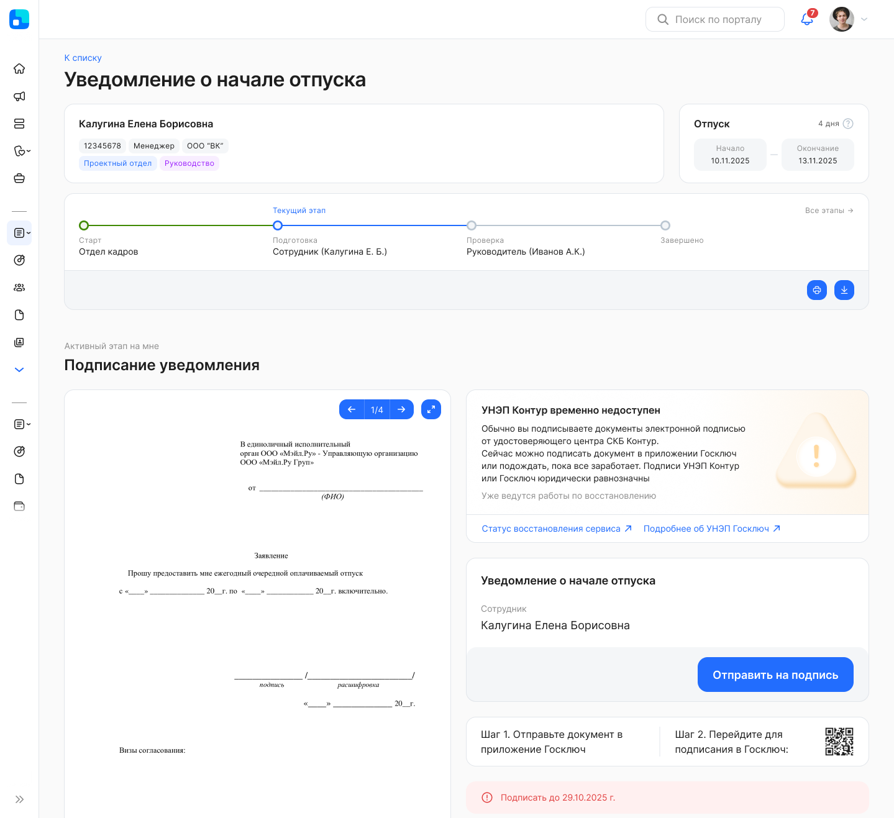

Подписание в корпоративном документе:  

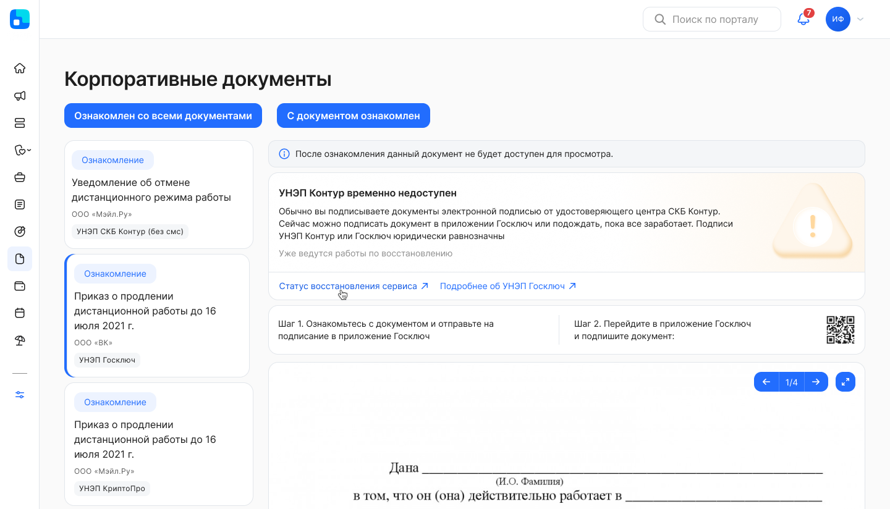

## **Отпуска и отсутствия**

### **Отпуск по графику в разделе «Заявки»**

Заявку на отпуск по графику теперь можно оформить из раздела «Заявки», а не только из календаря, нажав на конкретный период: 

* при создании заявки сотруднику будет доступен выбор запланированного периода из графика отпусков в выпадающем списке;  
* сотрудник выбирает период,  и в заявку автоматически подгружается период отсутствия, количество дней отсутствия и тип отсутствия. Заполненные автоматически атрибуты становятся недоступны для редактирования.

Если при создании заявки запланированные периоды не были найдены, то заявка автоматически отменится с комментарием «Запланированные периоды не найдены для выбора в заявке, создайте заявку с другим типом, например, не по графику».

Пользователь в заявке сможет выбрать один из следующих периодов: 
* один запланированный период отпуска;
* несколько периодов отпусков, если они идут последовательно (первый день следующего отпуска следует за последним днём предыдущего отпуска).

<info>

Чтобы создание заявки на отпуск по графику стало доступно в разделе «Заявки», необходимо настроить бизнес-процесс. Настройка такого бизнес-процесса является платной. Для подключения обратитесь в [поддержку VK HR Tek](/ru/hr/support/contact_channels)  

</info>

Посмотреть интерфейс
 

Заявка с выбором периода запланированного отпуска:

Выбор периодов, которые идут непоследовательно:

Комментарий о некорректности выбора непоследовательно идущих периодов:

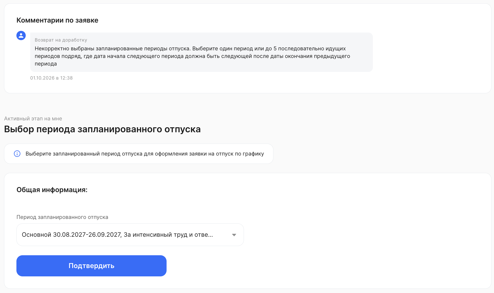

### **Отображение запланированных сотрудником периодов отпусков с компенсацией в календарях**

В календарях с графиками отсутствий, с графиками отпусков будет отражаться признак «Денежная компенсация», если он был отмечен сотрудником при планировании периодов в графике.   

Признак «Денежная компенсация» видит сотрудник, а также все, кому доступен просмотр информации по периодам отсутствия этого сотрудника. 

Посмотреть интерфейс календарей
 

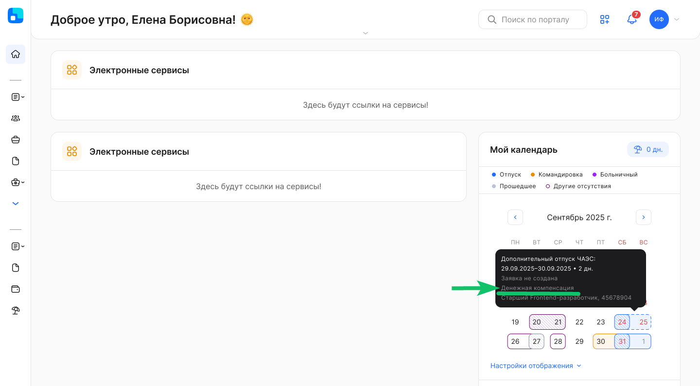

Посмотреть пример интерфейса создания заявки
 

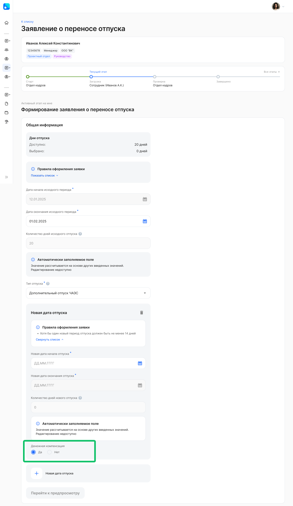

<info>

Настройка бизнес-процесса с признаком «Денежная компенсация» и с атрибутами, относящимися к датам графиков отпусков, является платной. Для подключения обратитесь в [поддержку VK HR Tek](/ru/hr/support/contact_channels)  

</info>

## **График отпусков**

### **Запрет возврата заявки из планирования сотруднику, если прошел дедлайн для заполнения сотрудником**

Согласующий не сможет отправить график на доработку сотруднику, если срок заполнения сотрудником, установленный при запуске планирования, истек:
* будет скрыта кнопка «Вернуть на доработку»:   
  * внутри заявки;  
  * в листинге;  
  * в массовых действиях;  
* согласующему будет показана подсказка, почему кнопка возврата на доработку больше не доступна.

Ранее согласующий мог нажать кнопку возврата на доработку, но такие задачи не показывались сотруднику и возвращались обратно согласующему без какого-либо уведомления. 

Посмотреть интерфейс
 

Дедлайн заполнения графика отпусков для сотрудника не наступил — кнопка **Вернуть на доработку** доступна.  

Дата заполнения графика отпусков для сотрудника уже истекла — кнопка **Вернуть на доработку** недоступна, пользователь увидит информационное сообщение.  

### **Отражение уже проведенных отсутствий в запущенном планировании**

В календарях планирования, в задачах и календарях разделов **Графики отпусков** будут отражаться проведенные отсутствия, если они относятся к году, на которое запущено планирование.  

Посмотреть интерфейс
 

<info>

Для подключения отображения проведенных отсутствий обратитесь в [поддержку VK HR Tek](/ru/hr/support/contact_channels)  

</info>

### **Планирования «На группу сотрудников»**

График отпусков можно планировать не только по юридическому лицу или подразделению, но и по группам сотрудников:
* применимо для компаний, у которых в кадровой системе есть группы (категории), присваиваемые сотрудникам.  
* группы могут быть переданы по сотрудникам в КЭДО.  
* по каждой группе — свой маршрут согласования задач при планировании графика, которые необходимо настроить при запуске планирований.

При создании планирования (в разделе **Настройки → Графики отпусков**) появилась настройка видимости «На группу сотрудников»:
* могут быть выбраны одна или несколько групп;  
* в планирование могут быть добавлены только сотрудники с выбранными группами;  
* далее настраивается маршрут согласования — как было ранее.

В разделе **Сервисы компании → Графики отпусков** добавлен фильтр «По группе сотрудников», а в уже запущенное планирование можно добавить новые группы и исключить отдельных сотрудников.  

Посмотреть интерфейс
 

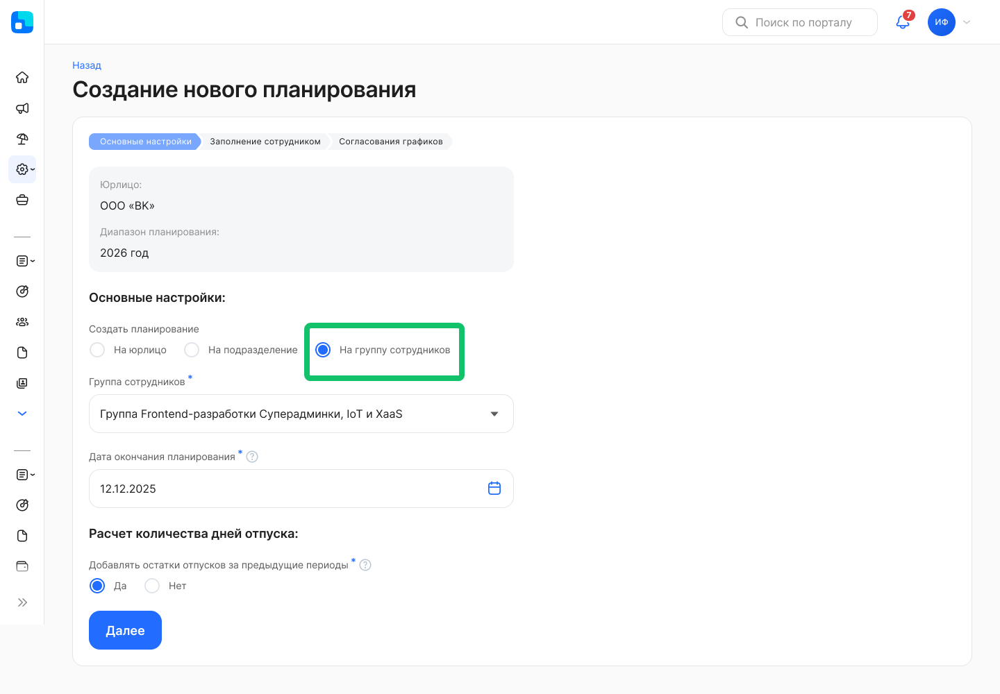

### **Редактирование дедлайнов активного планирования графика отпусков**

Пользователь с ролью «Менеджер графика отпусков» сможет продлить сроки в активном планировании, без удаления и нового запуска самого планирования, а также сможет скорректировать все дедлайны:
* дата окончания планирования;  
* дата окончания заполнения сотрудником;  
* дата окончания проверки.

Изменяем только в сторону увеличения и до наступления таких дедлайнов, сроки при этом пересчитываются по этапам, и участникам активного этапа приходит уведомление.  

В листинге планирований в каждом активном планировании будет доступна кнопка «Редактировать». 

Посмотреть интерфейс
 

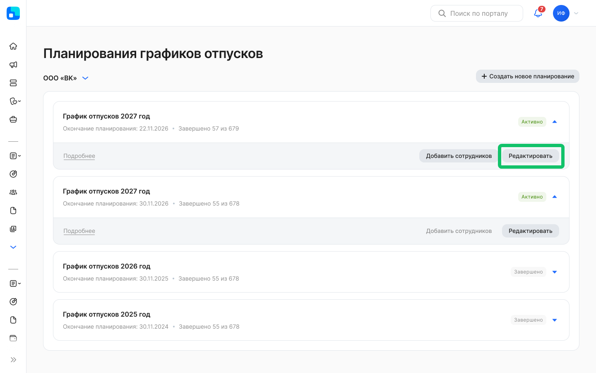

Поля, доступные для редактирования:  

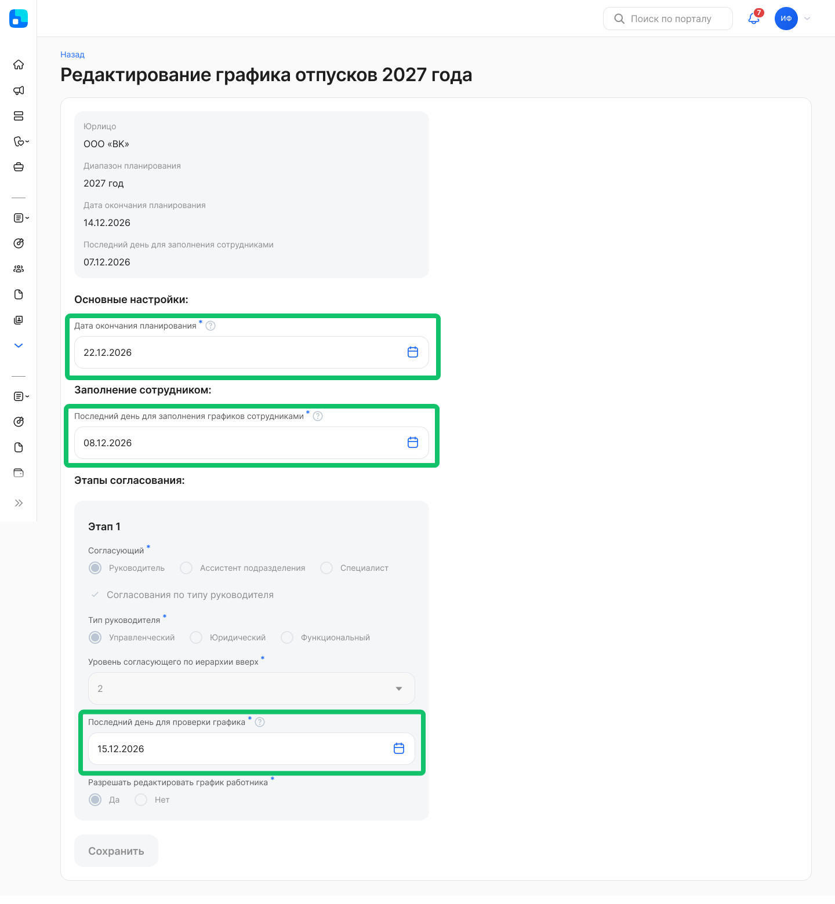

### **Выбор компенсации при планировании периодов отпусков**

При планировании периода отпуска в календаре сотрудник сможет отметить признак денежной компенсации:
* настраиваются типы отпусков, для которых доступно указание признака «Денежная компенсация» при планировании графика отпусков;  
* флаг признака проставляется в разрезе выбираемых сотрудником плановых периодов;  
* руководитель, согласующий график отпусков, или пользователь с группой, согласующий график отпусков, сможет увидеть проставленный сотрудников признак при получении задач на согласование, также сможет его отредактировать;  
* признак «Денежная компенсация» дополнительно к типу планируемого отпуска и периоду передается в 1С, отражается в документе «График отпусков» в столбце «Компенсация», сохраняется в регистре 1С для последующей передачи в составе отсутствий.

Посмотреть интерфейс
 

<info>

Для подключения признака «Денежная компенсация» для типа отпуска обратитесь в [поддержку VK HR Tek](/ru/hr/support/contact_channels)  

</info>

### Добавление новой системной роли

Для кейса с назначением ассистентов для согласования планирования графиков отпусков создана новая роль «Администратор раздела оргструктуры». Роль доступна для добавления пользователям в разделе **Настройки → Роли сотрудников**.

Пользователь, которому назначена данная роль, сможет:
* добавить ассистентов в подразделение разделе **Оргструктура**;
* создать новое управленческое подразделение в оргструктуре;  
* изменить настройки управленческого подразделения в веб-интерфейсе.

## **Командировки**

<info>

Функциональность доступна только в модуле «Командировки». Модуль приобретается дополнительно и платно, за подключением обратитесь к персональному менеджеру VK HR Tek.  

</info>

### **Изменение страницы заявки на командировку**

Теперь вся ключевая информация по поездке будет отражаться в верхней части заявки, чтобы удобно было сразу ее просмотреть, а не искать по всей заявке.  

В «шапке» пользователь сможет увидеть:
* маршрут;  
* даты поездки;  
* количество дней поездки;  
* количество выходных дней.

В «шапке» отражается информация по 3-м пунктам назначения, если их больше 3-х — появляется кнопка с количеством оставшихся пунктов, при переходе по кнопке открывается модальное окно с детализацией этих маршрутов. 

Блок с этапами заявки может сворачиваться, остаются только кнопки с действиями по заявке.  

Раньше формат заявки на командировку не отличался от обычной заявки, теперь заявка на командировку будет иметь свой дизайн.

Также после заполнения параметров командировки заявка стала удобной для просмотра — компактно отражаются атрибуты.

Посмотреть интерфейс
 

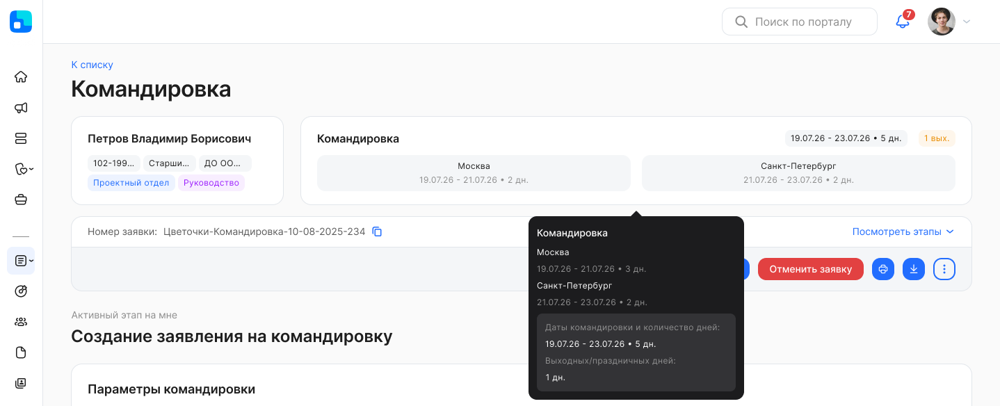

Детализация маршрута в модальном окне:  

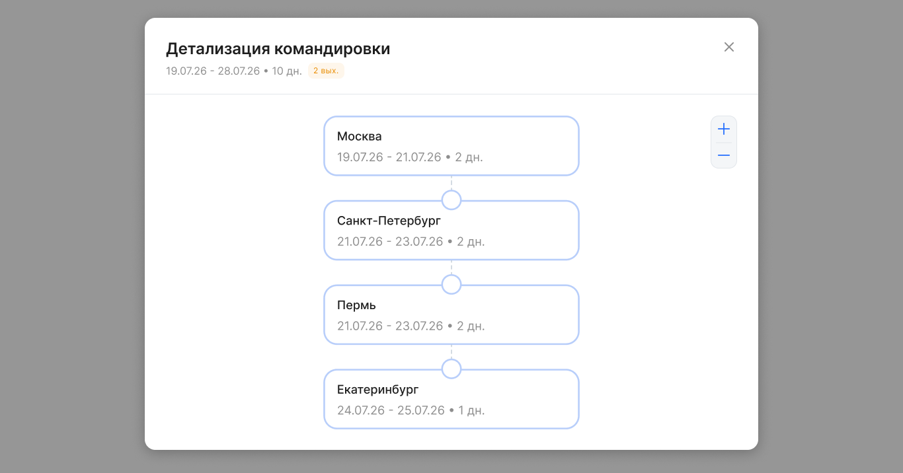

Заявка с заполненными атрибутами:  

Мобильная версия
 

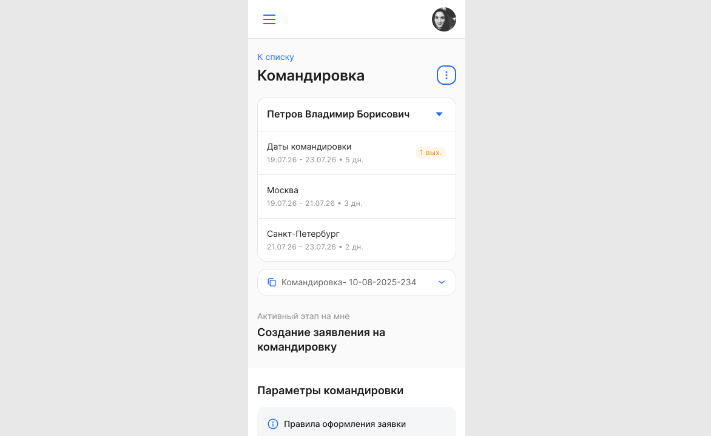

## **Социальные сервисы**

<info>

Для подключения социальных сервисов обратитесь к вашему менеджеру VK HR Tek

</info>

### **Целевые аудитории**

Теперь кастомные целевые аудитории можно назначать не только новостям, но и опросам. Это позволяет точнее доставлять контент тем, кого он действительно касается, снижает информационный шум и повышает вовлечённость и качество обратной связи, одновременно усиливая контроль доступа и снижая риски ошибочной публикации чувствительной информации.  

Посмотреть интерфейс создания опроса для целевой аудитории
 

Подробнее о создании опроса на целевую аудиторию описано в статье [Создание опроса / Настройки опроса](/ru/hr/portal/survey/management/create#nastroyki_oprosa).   

